# Java对象

## 问题思考

###### 什么是 Java 对象？

Java 是**纯面向对象语言**（除基本类型外，一切皆对象），对象是：

- 类的**实例化产物**：类是对象的「模板」，对象是类的「具体实例」（如`Person`类 → `new Person()`创建的具体人）；
- 数据与行为的**封装体**：对象包含「属性（实例变量）」和「方法」，属性存储数据，方法实现行为；
- 内存中的**独立实体**：每个对象在堆中占用独立的内存空间，有唯一的内存地址。


###### Java 对象的核心特性（面向对象三大特征）

1. **封装**：对象的属性私有化（`private`），通过`getter/setter`暴露访问，隐藏内部实现；
2. **继承**：子类继承父类的属性和方法，实现代码复用（`extends`）；
3. **多态**：父类引用指向子类对象，调用方法时执行子类实现（如`Animal a = new Cat(); a.eat();`），底层依赖 JVM 的`invokevirtual`指令动态分派。


###### 对象的分类（按存储位置 / 类型）

| 分类维度 | 类型                   | 存储位置           | 示例                                                  |
| -------- | ---------------------- | ------------------ | ----------------------------------------------------- |
| 数据类型 | 基本类型对象（包装类） | 堆（自动装箱后）   | `Integer i = 10;`（装箱为 Integer 对象）              |
|          | 引用类型对象           | 堆                 | `String s = "hello";`、`List list = new ArrayList();` |
| 生命周期 | 普通对象               | 堆，GC 回收        | 业务 POJO（如 User、Order）                           |
|          | 不可变对象             | 堆，创建后不可修改 | `String`、`Integer`、`LocalDate`                      |


###### Java 对象到底是什么

Java 对象 = 堆内存中的一段数据 + 对应的元数据

- **对象的定义**：对象是类的实例，是现实世界实体的抽象
- **对象的特点**：
    - 具有状态（属性/字段）
    - 具有行为（方法）
    - 具有唯一的标识（内存地址）


###### 对象大小怎么算

例子（64 位 + 压缩指针）

```java
class A {
    int x;      // 4
    Object o;   // 4（压缩指针）
}
```

| 部分          | 大小         |
| ------------- | ------------ |
| Mark Word     | 8            |
| Klass Pointer | 4            |
| 实例数据      | 8            |
| 对齐填充      | 4            |
| **总计**      | **24 bytes** |

👉 **最小对象：16 bytes**


###### 什么对象能被回收？

**没有 GC Roots 引用的对象**


###### 常见 GC Roots

- 虚拟机栈（局部变量）
- 静态变量
- 常量
- JNI 引用


###### finalize（基本不用）

- 不可靠
- 延迟回收
- 已被弃用


###### 对象逃逸分析

```java
public void test() {
    Object o = new Object();
}
```

👉 不逃逸：

- 栈上分配
- 不进堆
- 无 GC


###### 对象复用 vs 创建

- 小对象：**大胆创建**
- 大对象：谨慎
- 盲目对象池 ≈ 反优化


###### 压缩指针

```bash
-XX:+UseCompressedOops
```

* 堆 ≤ 32G：默认开启
* 指针 4 字节 → 性能大幅提升


###### new 一个对象一定在堆吗

 不一定（逃逸分析）


###### 对象一定有 hashCode 吗

只有调用才生成


###### synchronized 锁在哪

对象头 Mark Word


###### 最小对象多大

16 bytes（64 位）


###### 对象变为垃圾的几种情况

```java
public class GarbageCollection {
    
    @Override
    protected void finalize() throws Throwable {
        try {
            System.out.println("对象被垃圾回收前执行");
            // 清理资源
        } finally {
            super.finalize();
        }
    }
    
    public static void main(String[] args) {
        // 对象变为垃圾的几种情况
        
        // 1. 引用置为null
        GarbageCollection obj1 = new GarbageCollection();
        obj1 = null;
        
        // 2. 重新赋值
        GarbageCollection obj2 = new GarbageCollection();
        obj2 = new GarbageCollection();  // 前一个对象变成垃圾
        
        // 3. 局部变量超出作用域
        createAndLose();
        
        // 4. 匿名对象
        new GarbageCollection();  // 立即成为垃圾
        
        // 手动触发垃圾回收（只是建议，不保证立即执行）
        System.gc();
    }
    
    static void createAndLose() {
        GarbageCollection obj3 = new GarbageCollection();
        // 方法结束，obj3超出作用域
    }
}
```


## 基础知识


### 创建方式

Java 对象的创建过程（从代码到 JVM 底层）

你写的`new Person()`一行代码，JVM 底层会执行**5 个核心步骤**，结合之前讲的字节码、栈帧知识，完整链路如下：

###### 2.1 代码层面：创建对象的 3 种方式（开发常用）

| 方式                 | 示例                                                         | 特点                                             |
| -------------------- | ------------------------------------------------------------ | ------------------------------------------------ |
| new 关键字（最常用） | `Person p = new Person();`                                   | 调用构造方法，创建全新对象，JVM 底层最完整的流程 |
| 反射                 | `Person p = Person.class.newInstance();`                     | 运行时动态创建，可调用无参构造，灵活但性能略低   |
| 序列化 / 反序列化    | `ObjectInputStream ois = new ObjectInputStream(...); Person p = (Person) ois.readObject();` | 从字节流恢复对象，不调用构造方法                 |

补充：克隆（`clone()`）、工厂模式本质也是基于上述方式，不是独立的创建逻辑。

###### 2.2 JVM 底层：new 关键字创建对象的 5 步核心流程

| 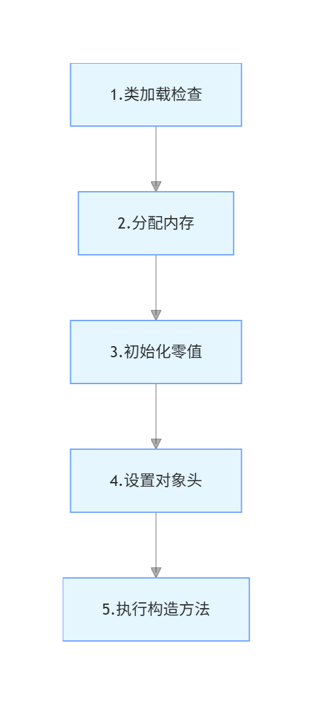 |
| :----------------------------------------------------------: |

步骤 1：类加载检查

JVM 遇到`new`指令时，先检查：

- 常量池中是否有该类的符号引用（如`#5`指向 Person 类）；
- 该类是否已被加载、解析、初始化（类加载流程：加载→验证→准备→解析→初始化）；
- 未加载则先执行类加载，加载完成后再继续。

步骤 2：分配内存

在堆中为新对象分配内存（大小由类的属性决定，编译期已确定），有两种分配方式：

- **指针碰撞**：堆内存规整（Serial/ParNew GC），用过的内存和空闲内存有分界指针，指针向空闲区移动对应大小即可；
- **空闲列表**：堆内存碎片化（CMS GC），JVM 维护空闲内存块列表，找到足够大的块分配给对象。

> 并发安全：分配内存时用**CAS + 失败重试**或**TLAB（本地线程分配缓冲）** 保证线程安全（TLAB 是默认优化，每个线程有独立的内存分配区域，避免竞争）。

步骤 3：初始化零值

JVM 将分配的内存空间**全部初始化为零值**（如 int=0、String=null、boolean=false），这一步保证：对象的属性在构造方法执行前，已有默认值，避免空指针。

步骤 4：设置对象头

给对象的「对象头」赋值，包括：

- Mark Word：存储对象的哈希码、GC 分代年龄、锁状态等（核心，后续详解）；
- 类型指针：指向对象所属类的 Class 对象（如 Person.class），JVM 通过该指针确定对象的类型；
- 数组长度（仅数组对象）：存储数组的长度。

步骤 5：执行<init>构造方法

JVM 调用对象的构造方法（`<init>()`），完成：

- 显式赋值（如`name = "张三"`）；
- 父类构造方法执行；
- 代码块、初始化逻辑执行。

> 核心区别：步骤 3 是「零值初始化」（JVM 自动），步骤 5 是「显式初始化」（开发者写的构造逻辑）。

###### 2.3 字节码链路：new→dup→invokespecial

对应之前讲的字节码，完整链路：

```
0: new           #5  // 步骤1-4：类加载检查+分配内存+零值+对象头
3: dup               // 复制对象引用（一份给构造方法，一份给赋值）
4: invokespecial #6  // 步骤5：执行<init>()构造方法
7: astore_1          // 将对象引用存入局部变量表（p1）
```


```java
// 1. 使用 new 关键字（最常用）
Person person = new Person();

// 2. 使用 Class.newInstance()（反射，已过时）
Person p2 = Person.class.newInstance();

// 3. 使用 Constructor.newInstance()（反射）
Constructor<Person> constructor = Person.class.getConstructor();
Person p3 = constructor.newInstance();

// 4. 使用 clone() 方法
Person p4 = (Person) person.clone();

// 5. 使用反序列化
ObjectInputStream in = new ObjectInputStream(new FileInputStream("person.ser"));
Person p5 = (Person) in.readObject();
```


### 对象特性

封装

继承

多态


### 特殊对象

#### 匿名对象

```java
// 只使用一次的对象
new Person("匿名", 0).introduce();

// 作为参数传递
registerUser(new User("temp", "123"));
```

#### 内部类对象

```java
class Outer {
    private String outerField = "外部";
    
    // 成员内部类
    class Inner {
        void accessOuter() {
            System.out.println(outerField);  // 访问外部类成员
        }
    }
    
    // 静态内部类
    static class StaticInner {
        // 不能访问外部非静态成员
    }
    
    void createInner() {
        Inner inner = new Inner();  // 创建内部类对象
    }
}
```

#### 枚举对象

```java
enum Color {
    RED("#FF0000"),
    GREEN("#00FF00"),
    BLUE("#0000FF");
    
    private String hexCode;
    
    Color(String hexCode) {
        this.hexCode = hexCode;
    }
    
    public String getHexCode() {
        return hexCode;
    }
}

// 使用
Color red = Color.RED;
```


### 重要方法

```java
public class ObjectMethods {
    public static void main(String[] args) {
        Object obj1 = new Object();
        Object obj2 = new Object();
        
        // 1. hashCode() - 返回对象的哈希码
        int hash = obj1.hashCode();
        
        // 2. equals() - 比较对象内容
        boolean isEqual = obj1.equals(obj2);
        
        // 3. toString() - 返回对象的字符串表示
        String str = obj1.toString();
        
        // 4. getClass() - 返回对象的运行时类
        Class<?> clazz = obj1.getClass();
        
        // 5. clone() - 创建并返回对象的副本
        try {
            Object clone = obj1.clone();
        } catch (CloneNotSupportedException e) {
            e.printStackTrace();
        }
        
        // 6. wait(), notify(), notifyAll() - 线程通信
        synchronized (obj1) {
            try {
                obj1.wait();  // 释放锁并等待
                obj1.notify();  // 唤醒一个等待线程
            } catch (InterruptedException e) {
                e.printStackTrace();
            }
        }
        
        // 7. finalize() - 已弃用，对象被回收前调用
    }
}
```


### 对象比较

###### == 与 equals()

| 比较方式   | 基本类型 | 引用类型                     |
| ---------- | -------- | ---------------------------- |
| `==`       | 比较值   | 比较引用地址（是否同一对象） |
| `equals()` | 不适用   | 比较逻辑相等性（需重写）     |

```java
// 重写equals()规范（必须同时重写hashCode()）
@Override
public boolean equals(Object o) {
    if (this == o) return true;           // 1. 自反性：引用相同直接返回true
    if (o == null || getClass() != o.getClass()) return false; // 2. 非空+类型检查
    User user = (User) o;
    return age == user.age &&            // 3. 字段比较
           Objects.equals(name, user.name);
}

@Override
public int hashCode() {
    return Objects.hash(name, age);      // 4. 与equals保持一致
}
```

`hashCode()`设计原则

- **一致性**：同一对象多次调用返回相同值（除非字段改变）
- **相等性**：`a.equals(b)`为true ⇒ `a.hashCode() == b.hashCode()`
- **分散性**：不相等对象尽量返回不同hash，减少哈希冲突


```java
String s1 = new String("hello");
String s2 = new String("hello");

// == 比较引用地址
System.out.println(s1 == s2);       // false

// equals() 比较内容（String类已重写）
System.out.println(s1.equals(s2));  // true

// 自定义对象需要重写equals()和hashCode()
class Student {
    private String id;
    private String name;
    
    @Override
    public boolean equals(Object o) {
        if (this == o) return true;
        if (o == null || getClass() != o.getClass()) return false;
        Student student = (Student) o;
        return id.equals(student.id);
    }
    
    @Override
    public int hashCode() {
        return Objects.hash(id);
    }
}
```

###### Comparable和Comparator

```java
// 实现Comparable（自然排序）
class Student implements Comparable<Student> {
    private int score;
    
    @Override
    public int compareTo(Student other) {
        return Integer.compare(this.score, other.score);
    }
}

// 使用Comparator（定制排序）
Comparator<Student> byName = new Comparator<>() {
    @Override
    public int compare(Student s1, Student s2) {
        return s1.getName().compareTo(s2.getName());
    }
};
```


### 对象复制

#### 浅拷贝（Shallow Copy）

```java
public class User implements Cloneable {
    private String name;
    private Address address;  // 引用类型
    
    @Override
    protected Object clone() throws CloneNotSupportedException {
        return super.clone();  // 只复制引用，不复制引用指向的对象
    }
}
```

- **特点**：基本类型复制值，引用类型复制引用
- **问题**：修改拷贝对象的引用字段会影响原对象

#### 深拷贝（Deep Copy）

###### 重写clone()递归复制

```java
@Override
protected Object clone() throws CloneNotSupportedException {
    User cloned = (User) super.clone();
    cloned.address = (Address) this.address.clone();  // 递归clone
    return cloned;
}
```

###### 序列化反序列化（通用但性能低）

```java
public class SerializableObject implements Serializable {
    // 序列化版本UID
    private static final long serialVersionUID = 1L;
    
    private String name;
    private transient String password;  // transient修饰的字段不被序列化
    
    // 自定义序列化过程
    private void writeObject(java.io.ObjectOutputStream out)
            throws IOException {
        out.defaultWriteObject();
        // 自定义写入逻辑
    }
    
    private void readObject(java.io.ObjectInputStream in)
            throws IOException, ClassNotFoundException {
        in.defaultReadObject();
        // 自定义读取逻辑
    }
}
```

###### 使用第三方库（如Apache Commons Lang）

```java
User copy = SerializationUtils.clone(original);
```


### 对象反射

```java
import java.lang.reflect.*;

public class ReflectionDemo {
    public static void main(String[] args) throws Exception {
        Person person = new Person("Bob", 30);
        Class<?> clazz = person.getClass();
        
        // 获取类信息
        System.out.println("Class name: " + clazz.getName());
        
        // 获取字段
        Field[] fields = clazz.getDeclaredFields();
        for (Field field : fields) {
            field.setAccessible(true);  // 设置可访问私有字段
            System.out.println(field.getName() + ": " + field.get(person));
        }
        
        // 获取方法
        Method[] methods = clazz.getDeclaredMethods();
        for (Method method : methods) {
            System.out.println("Method: " + method.getName());
        }
        
        // 动态调用方法
        Method setName = clazz.getMethod("setName", String.class);
        setName.invoke(person, "Charlie");
    }
}
```


### 特殊对象

#### 单例对象

```java
public class Singleton {
    // 1. 私有静态实例
    private static volatile Singleton instance;
    
    // 2. 私有构造方法
    private Singleton() {
        // 防止反射创建实例
        if (instance != null) {
            throw new RuntimeException("请使用getInstance()方法");
        }
    }
    
    // 3. 双重检查锁
    public static Singleton getInstance() {
        if (instance == null) {
            synchronized (Singleton.class) {
                if (instance == null) {
                    instance = new Singleton();
                }
            }
        }
        return instance;
    }
    
    // 4. 防止序列化破坏单例
    protected Object readResolve() {
        return getInstance();
    }
}
```

#### 不可变对象

```java
// 1. 类声明为final
public final class ImmutablePerson {
    // 2. 所有字段私有final
    private final String name;
    private final int age;
    private final List<String> hobbies;  // 引用类型需要特殊处理
    
    // 3. 通过构造方法初始化
    public ImmutablePerson(String name, int age, List<String> hobbies) {
        this.name = name;
        this.age = age;
        // 4. 防御性复制
        this.hobbies = new ArrayList<>(hobbies);
    }
    
    // 5. 不提供setter方法
    
    // 6. 返回不可修改的副本
    public List<String> getHobbies() {
        return Collections.unmodifiableList(hobbies);
    }
    
    // 7. 需要修改时返回新对象
    public ImmutablePerson withAge(int newAge) {
        return new ImmutablePerson(this.name, newAge, this.hobbies);
    }
}
```

#### 内部类对象

```java
public class OuterClass {
    private String outerField = "外部字段";
    
    // 1. 实例内部类
    class InnerClass {
        void accessOuter() {
            System.out.println(outerField);  // 可以访问外部类成员
        }
    }
    
    // 2. 静态内部类
    static class StaticInnerClass {
        // 不能访问外部类实例成员
    }
    
    // 3. 局部内部类
    void method() {
        class LocalClass {
            // 方法内定义的类
        }
    }
    
    // 4. 匿名内部类
    Runnable anonymousClass = new Runnable() {
        @Override
        public void run() {
            System.out.println("匿名内部类");
        }
    };
}
```


### 对象序列化

###### Serializable接口

```java
public class User implements Serializable {
    private static final long serialVersionUID = 1L;
    private String name;
    private transient int password;  // transient字段不参与序列化
}
```

###### Externalizable接口（完全控制序列化）

```java
public class User implements Externalizable {
    private String name;
    
    @Override
    public void writeExternal(ObjectOutput out) throws IOException {
        out.writeUTF(name);
    }
    
    @Override
    public void readExternal(ObjectInput in) throws IOException {
        this.name = in.readUTF();
    }
}
```

###### 序列化安全问题

- **反序列化漏洞**：攻击者构造恶意字节流，触发危险操作
- 防护措施：
    - 避免反序列化不可信数据
    - 使用`ObjectInputFilter`（Java 9+）过滤类
    - 重写`readObject()`进行校验


### 初始化过程

```java
public class Student {
    // 1. 静态变量初始化（类加载时）
    static String school = "ABC School";
    
    // 2. 静态代码块（类加载时）
    static {
        System.out.println("Static block executed");
    }
    
    // 3. 实例变量初始化（对象创建时）
    String name = "Unknown";
    
    // 4. 实例代码块（对象创建时）
    {
        System.out.println("Instance block executed");
    }
    
    // 5. 构造方法
    public Student() {
        System.out.println("Constructor executed");
    }

```


### 生命周期阶段

```java
public class LifecycleDemo {
    public static void main(String[] args) {
        // 1. 创建 (Creation)
        Object obj = new Object();
        
        // 2. 使用 (In Use)
        System.out.println(obj.toString());
        
        // 3. 不可达 (Invisible)
        obj = null;  // 原对象不再被引用
        
        // 4. 不可达 -> 可收集 (Unreachable -> Collectible)
        System.gc();  // 提示GC，但不保证立即执行
        
        // 5. 收集 (Collected)
        // 6. 终结 (Finalized) - 已弃用
        // 7. 内存重分配 (Deallocated)
    }
}
```


## 生命周期

### 创建过程

> new 的真相

```java
// Java源代码
Object obj = new Object();

// 对应的字节码
0: new           #2    // 创建对象，分配内存，返回引用（未初始化）
3: dup                 // 复制引用（一份用于构造，一份用于赋值）
4: invokespecial #1    // 调用<init>构造方法
7: astore_1            // 将引用存入局部变量表
```

1️⃣ 类是否已加载？
2️⃣ 在堆中分配内存
3️⃣ 内存清零
4️⃣ 设置对象头
5️⃣ 执行 `<init>` 构造方法
6️⃣ 返回引用

⚠️ **new ≠ 构造完成**


**JVM执行流程**

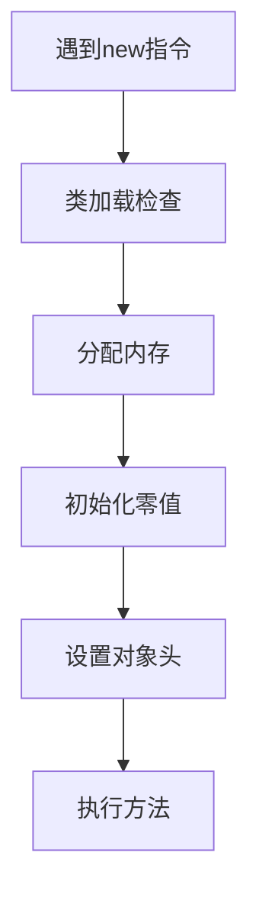
```mermaid
graph TD
    A[遇到new指令] --> B[类加载检查]
    B --> C[分配内存]
    C --> D[初始化零值]
    D --> E[设置对象头]
    E --> F[执行<init>方法]
```


(1) 类加载检查

- 检查常量池中是否有该类的符号引用
- 检查类是否已加载、解析、初始化
- 未加载则先执行类加载过程

(2) 分配内存（关键性能点）

**两种分配方式**：

- 指针碰撞（Bump the Pointer）

    ：适用于规整的堆（Serial、ParNew GC）

    - 维护一个指针，指向已用空间末尾
    - 分配时将指针向空闲空间移动对象大小的距离

- 空闲列表（Free List）

    ：适用于不规整的堆（CMS GC）

    - 维护一个列表，记录哪些内存块可用
    - 分配时从列表中找到足够大的空闲块

**并发安全问题**：

- **CAS + 失败重试**：保证更新操作的原子性

- TLAB（Thread Local Allocation Buffer）

    ：每个线程在Eden区预先分配一小块内存

    - 线程在TLAB内分配无需同步
    - TLAB用尽才需要同步分配
    - `-XX:+UseTLAB`（默认开启），`-XX:TLABSize`调整大小

(3) 初始化零值

- 将分配到的内存空间初始化为零值（不包括对象头）
- 保证对象实例字段不赋初始值也可直接使用

(4) 设置对象头

- 设置Mark Word（锁状态、GC分代年龄等）
- 设置Class Pointer
- 如是数组，设置数组长度

(5) 执行`<init>`方法

- 执行构造方法中的代码
- 完成字段赋值、资源初始化等


**创建过程的6个步骤**

```java
public class ObjectCreation {
    /**
     * 对象创建的完整流程：
     * 1. 类加载检查
     * 2. 分配内存
     * 3. 初始化零值
     * 4. 设置对象头
     * 5. 执行<init>方法
     * 6. 建立引用
     */
    
    // 步骤1：类加载检查
    // JVM遇到new指令时，检查：
    // - 常量池中是否有类的符号引用
    // - 类是否已被加载、解析、初始化
    // - 如果没有，执行类加载过程
    
    // 步骤2：分配内存（两种方式）
    class MemoryAllocation {
        // 方式1：指针碰撞（Bump the Pointer）
        // 适用条件：堆内存规整（Serial、ParNew等收集器）
        // 原理：使用一个指针作为分界点，分配内存就是移动指针
        
        // 方式2：空闲列表（Free List）
        // 适用条件：堆内存不规整（CMS收集器）
        // 原理：维护一个空闲内存块列表
    }
    
    // 步骤3：初始化零值
    // 将分配的内存（不包括对象头）都初始化为零值
    // 保证对象的实例字段可以不赋初始值直接使用
    
    // 步骤4：设置对象头
    // 设置Mark Word、Klass Pointer、数组长度（如果是数组）
    
    // 步骤5：执行<init>方法
    // 调用构造函数，按照程序员的意愿初始化
    
    // 步骤6：建立引用
    // 将栈帧中的引用指向堆中的对象
}
```


###### 创建阶段

```java
// 1. 声明引用
Person p;

// 2. 实例化（分配内存）
p = new Person();

// 3. 初始化（调用构造方法）
// 构造方法执行
```


###### 使用阶段

```java
// 访问对象成员
p.name = "李四";
p.introduce();

// 对象作为参数传递
processPerson(p);

// 对象作为返回值
Person getPerson() {
    return new Person("王五", 30);
}
```


###### 销毁阶段

```java
// 1. 失去引用
Person p = new Person();
p = null;  // 原对象失去引用，等待GC

// 2. 超出作用域
{
    Person temp = new Person();
}  // temp超出作用域

// 3. 垃圾回收（自动）
// 对象不可达时被回收
```


### 内存分配

#### TLAB（Thread Local Allocation Buffer）

```java
public class TLABDemo {
    // TLAB：线程本地分配缓冲区
    // - 每个线程在Eden区有一块私有内存区域
    // - 小对象优先在TLAB中分配
    // - 避免多线程竞争，提高分配效率
    
    // 相关JVM参数
    // -XX:+UseTLAB              # 启用TLAB（默认开启）
    // -XX:TLABSize             # 设置TLAB大小
    // -XX:TLABRefillWasteFraction # 最大浪费空间比例
    // -XX:+PrintTLAB           # 打印TLAB信息
    
    public static void main(String[] args) {
        // 大量创建小对象，TLAB能显著提升性能
        for (int i = 0; i < 1000000; i++) {
            // 小对象在TLAB中分配
            new SmallObject(i);
            
            if (i % 10000 == 0) {
                // 大对象直接在Eden区分配
                new LargeObject(new byte[1024 * 1024]); // 1MB
            }
        }
    }
    
    static class SmallObject {
        int id;
        SmallObject(int id) { this.id = id; }
    }
    
    static class LargeObject {
        byte[] data;
        LargeObject(byte[] data) { this.data = data; }
    }
}
```


#### 对象逃逸分析与栈上分配

```java
public class EscapeAnalysis {
    // 逃逸分析：分析对象的作用域是否可能逃逸出方法
    // -XX:+DoEscapeAnalysis   # 启用逃逸分析（默认开启）
    // -XX:+PrintEscapeAnalysis # 打印逃逸分析结果
    
    /**
     * 对象逃逸的三种情况：
     * 1. 全局逃逸：对象被赋值给静态变量或外部线程访问
     * 2. 参数逃逸：对象作为参数传递给其他方法
     * 3. 无逃逸：对象仅在方法内部使用
     */
    
    private static Object globalObj;  // 全局变量
    
    // 示例1：全局逃逸
    public void globalEscape() {
        globalObj = new Object();  // 对象逃逸到全局
    }
    
    // 示例2：参数逃逸
    public void paramEscape() {
        Object obj = new Object();
        process(obj);  // 对象作为参数传递（可能逃逸）
    }
    
    private void process(Object obj) {
        // 使用对象
    }
    
    // 示例3：无逃逸（栈上分配优化）
    public String noEscape() {
        // User对象只在方法内部使用，可以被优化为栈上分配
        User user = new User("张三", 25);
        return user.getName();  // 返回的是字符串，不是User对象
    }
    
    // 示例4：同步消除（基于逃逸分析）
    public void syncElimination() {
        // 如果lock对象不会逃逸，JVM会消除同步操作
        Object lock = new Object();
        synchronized (lock) {
            // 临界区代码
        }
    }
}
```

#### 对象的初始化顺序

```java
public class InitializationOrder {
    // 静态变量
    private static int staticVar = initStatic();
    
    // 静态代码块
    static {
        System.out.println("静态代码块执行");
    }
    
    // 实例变量
    private int instanceVar = initInstance();
    
    // 实例代码块
    {
        System.out.println("实例代码块执行");
    }
    
    // 构造器
    public InitializationOrder() {
        System.out.println("构造器执行");
    }
    
    private static int initStatic() {
        System.out.println("静态变量初始化");
        return 1;
    }
    
    private int initInstance() {
        System.out.println("实例变量初始化");
        return 2;
    }
    
    public static void main(String[] args) {
        System.out.println("开始创建对象");
        new InitializationOrder();
    }
    
    /* 输出顺序：
     * 静态变量初始化
     * 静态代码块执行
     * 开始创建对象
     * 实例变量初始化
     * 实例代码块执行
     * 构造器执行
     */
}
```


### 分配方式

| 方式     | 说明                        |
| -------- | --------------------------- |
| 指针碰撞 | 堆规整（Serial / Parallel） |
| 空闲列表 | 堆不规整（CMS）             |

###### 两种访问方式对比

```java
public class ObjectAccess {
    /**
     * 对象访问的两种方式：
     * 
     * 1. 句柄访问（间接访问）
     *    ┌─────────┐      ┌──────────────┐      ┌─────────────┐
     *    │  reference  │─→│    句柄池      │─→│  对象实例数据  │
     *    │  (栈)      │   │ (堆)          │   │ (堆)         │
     *    └─────────┘      │  ┌──────────┐ │   └─────────────┘
     *                     │  │实例数据指针│─┘
     *                     │  └──────────┘
     *                     │  ┌──────────┐
     *                     │  │类型数据指针│─→│  类型数据      │
     *                     │  └──────────┘   │ (方法区)       │
     *                     └──────────────┘   └─────────────┘
     * 
     * 2. 直接指针访问（HotSpot使用）
     *    ┌─────────┐      ┌─────────────────────────────┐
     *    │  reference  │─→│  对象实例数据                 │
     *    │  (栈)      │   │ (堆)                        │
     *    └─────────┘      │  ┌──────────────────────┐   │
     *                     │  │ 对象头（含类型指针）   │─→│ 类型数据 │
     *                     │  └──────────────────────┘   │ (方法区)│
     *                     │  │ 实例字段               │   └────────┘
     *                     │  └──────────────────────┘
     *                     └─────────────────────────────┘
     */
    
    // 句柄访问的优点：
    // - reference存储稳定句柄地址，对象移动时只需更新句柄
    // - 适合对象频繁移动的场景
    
    // 直接指针的优点：
    // - 访问速度快，少一次指针定位
    // - HotSpot虚拟机采用此方式
}
```

###### 访问定位的底层实现

```java
public class ObjectAccessDetails {
    // 通过HSDB（HotSpot Debugger）查看对象内存
    
    // 对象在内存中的实际存储示例
    class MemoryExample {
        // 假设User对象在内存0x1000
        // 对象头：Mark Word(8字节) + Klass Pointer(4字节) = 12字节
        // 实例数据：
        //   int id (4字节)
        //   String name (4字节引用)
        //   boolean active (1字节)
        // 对齐填充：3字节（使总大小为8的倍数）
        
        // 访问流程：
        // 1. reference指向0x1000
        // 2. 通过对象头中的Klass Pointer找到类元数据
        // 3. 根据类元数据中的字段偏移量访问具体字段
    }
    
    // 字段偏移量计算
    static void showFieldOffsets() {
        // 使用Unsafe获取字段偏移量
        try {
            sun.misc.Unsafe unsafe = getUnsafe();
            
            Class<?> clazz = User.class;
            long idOffset = unsafe.objectFieldOffset(
                clazz.getDeclaredField("id"));
            long nameOffset = unsafe.objectFieldOffset(
                clazz.getDeclaredField("name"));
            
            System.out.println("id字段偏移: " + idOffset);
            System.out.println("name字段偏移: " + nameOffset);
            
            // 创建对象并直接操作内存
            User user = new User(1, "张三");
            
            // 通过偏移量获取字段值
            int id = unsafe.getInt(user, idOffset);
            String name = (String) unsafe.getObject(user, nameOffset);
            
            System.out.println("直接内存访问: id=" + id + ", name=" + name);
            
        } catch (Exception e) {
            e.printStackTrace();
        }
    }
    
    private static sun.misc.Unsafe getUnsafe() throws Exception {
        java.lang.reflect.Field field = sun.misc.Unsafe.class
            .getDeclaredField("theUnsafe");
        field.setAccessible(true);
        return (sun.misc.Unsafe) field.get(null);
    }
}
```


### 对象一生

```
Eden → Survivor → Old → 回收
```


### 晋升条件

- 存活次数 ≥ `MaxTenuringThreshold`
- Survivor 放不下
- 大对象直接进老年代


### 对象大小计算

###### 手动计算对象大小

```java
public class ObjectSizeCalculator {
    /**
     * 计算对象大小的步骤：
     * 1. 对象头大小
     * 2. 实例数据大小
     * 3. 对齐填充
     * 4. 如果是数组，加上数组长度
     */
    
    static class SizeExample {
        // 在64位JVM，开启压缩指针情况下：
        
        // 1. 空对象（Object）
        //   对象头：Mark Word(8) + Klass Pointer(4) = 12字节
        //   对齐填充：4字节（到16字节）
        //   总大小：16字节
        
        // 2. 包含一个int字段的对象
        //   对象头：12字节
        //   实例数据：int(4字节)
        //   总大小：12 + 4 = 16字节（正好对齐）
        
        // 3. 包含int和long字段的对象
        //   对象头：12字节
        //   实例数据：int(4) + long(8) = 12字节
        //   总大小：12 + 12 = 24字节
        
        // 4. 包含byte字段的对象
        //   对象头：12字节
        //   实例数据：byte(1字节)
        //   对齐填充：3字节（到16字节）
        //   总大小：16字节
        
        private int a;      // 4字节
        private long b;     // 8字节
        private byte c;     // 1字节
        private Object d;   // 4字节（压缩指针）
        private boolean e;  // 1字节
    }
    
    // 字段重排序优化
    static class OptimizedLayout {
        // JVM会重排序字段以减少填充
        // 原始顺序（会有更多填充）：
        //   byte b1;
        //   long l1;
        //   byte b2;
        //   int i1;
        //   byte b3;
        
        // 优化后的顺序：
        private long l1;    // 8字节
        private int i1;     // 4字节
        private byte b1;    // 1字节
        private byte b2;    // 1字节
        private byte b3;    // 1字节
        // 填充：1字节（总大小：8+4+3+1=16字节）
    }
    
    // 数组对象大小计算
    static class ArraySize {
        // 数组对象有额外的数组长度字段（4字节）
        
        // int[10] 数组：
        //   对象头：12字节（普通对象头）
        //   数组长度：4字节
        //   对齐填充：0字节（16字节已对齐）
        //   元素数据：10 * 4 = 40字节
        //   总大小：16 + 40 = 56字节
        
        // Object[10] 数组（空引用）：
        //   对象头：12 + 4 = 16字节
        //   元素数据：10 * 4 = 40字节（压缩指针）
        //   总大小：16 + 40 = 56字节
    }
}
```

###### 使用工具测量对象大小

```java
public class MeasureObjectSize {
    // 方法1：使用jol工具
    public static void measureWithJOL() {
        System.out.println("=== 使用JOL测量对象大小 ===");
        
        // 测量普通对象
        Object obj = new Object();
        System.out.println(ClassLayout.parseInstance(obj).toPrintable());
        
        // 测量数组
        int[] array = new int[10];
        System.out.println(ClassLayout.parseInstance(array).toPrintable());
        
        // 测量复杂对象
        ComplexObject complex = new ComplexObject();
        System.out.println(ClassLayout.parseInstance(complex).toPrintable());
        
        // 查看字段偏移量
        GraphLayout graph = GraphLayout.parseInstance(complex);
        System.out.println("总大小: " + graph.totalSize() + " bytes");
        System.out.println("字段统计: " + graph.toFootprint());
    }
    
    // 方法2：使用Instrumentation
    public static void measureWithInstrumentation() {
        // 需要在MANIFEST.MF中指定Premain-Class
        // java -javaagent:YourAgent.jar YourMainClass
    }
    
    // 方法3：估算方法（不准确）
    public static long estimateSize(Object obj) {
        // 通过Runtime估算
        Runtime runtime = Runtime.getRuntime();
        
        // 运行多次GC
        for (int i = 0; i < 10; i++) {
            System.gc();
            try { Thread.sleep(100); } catch (InterruptedException e) {}
        }
        
        long before = runtime.totalMemory() - runtime.freeMemory();
        
        // 创建大量对象
        int count = 100000;
        Object[] array = new Object[count];
        for (int i = 0; i < count; i++) {
            array[i] = obj.getClass().newInstance();
        }
        
        long after = runtime.totalMemory() - runtime.freeMemory();
        
        // 计算平均大小
        return (after - before) / count;
    }
    
    static class ComplexObject {
        private int id;
        private String name;
        private Date birthday;
        private List<String> hobbies;
        private Map<String, Object> attributes;
        private byte[] data = new byte[1024];
        
        public ComplexObject() {
            this.id = 1;
            this.name = "测试对象";
            this.birthday = new Date();
            this.hobbies = Arrays.asList("读书", "编程");
            this.attributes = new HashMap<>();
            this.attributes.put("key", "value");
        }
    }
}
```


### 对象的生命周期

###### 对象的7个生命周期阶段

```java
public class ObjectLifecycle {
    /**
     * 对象的完整生命周期：
     * 1. 创建（Created）          - 对象被分配内存，但构造函数未完成
     * 2. 应用（In Use）          - 对象被强引用持有，正常使用
     * 3. 不可见（Invisible）     - 超出作用域，但引用仍在局部变量表
     * 4. 不可达（Unreachable）   - 没有引用链可达
     * 5. 收集（Collected）       - 被GC标记，准备回收
     * 6. 终结（Finalized）       - 执行finalize()方法
     * 7. 重新分配（Deallocated） - 内存被回收，可重新分配
     */
    
    // 阶段1：创建阶段
    class CreationPhase {
        // 对象正在构造中，this引用可能逸出
        public CreationPhase() {
            // 错误：在构造完成前发布引用
            // GlobalRegistry.register(this);
            
            // 正确：先完成构造
            initialize();
        }
        
        private void initialize() {
            // 初始化逻辑
        }
    }
    
    // 阶段2：应用阶段
    class InUsePhase {
        private List<Object> cache = new ArrayList<>();
        
        public void addToCache(Object obj) {
            // 强引用，对象处于In Use阶段
            cache.add(obj);
        }
        
        public void removeFromCache(Object obj) {
            cache.remove(obj);
            // 对象可能进入下一阶段
        }
    }
    
    // 阶段3：不可见阶段
    class InvisiblePhase {
        public void method() {
            Object obj = new Object();
            // obj在这里是强引用
            
            // ... 使用obj
            
            // 方法结束，obj超出作用域
            // 但obj引用可能仍在局部变量表中（未被覆盖）
            // 此时对象处于不可见阶段
        }
    }
    
    // 阶段4-7：GC相关阶段
    class GCPhases {
        // 对象不可达时，进入GC流程
        // 如果重写了finalize()，会进入Finalizer队列
        // 否则直接进入回收阶段
    }
}
```

###### 引用类型与对象生命周期

```java
public class ReferenceTypes {
    /**
     * Java的四种引用类型，影响对象的生命周期：
     * 1. 强引用（Strong Reference） - 不回收
     * 2. 软引用（Soft Reference）   - 内存不足时回收
     * 3. 弱引用（Weak Reference）   - GC时回收
     * 4. 虚引用（Phantom Reference）- 跟踪对象被回收
     */
    
    public static void demonstrateReferences() {
        // 1. 强引用
        Object strongRef = new Object();
        // 只要strongRef存在，对象就不会被回收
        
        // 2. 软引用
        SoftReference<byte[]> softRef = new SoftReference<>(
            new byte[1024 * 1024 * 10]); // 10MB
        
        // 内存充足时，get()返回对象
        // 内存不足时，get()返回null，对象被回收
        
        // 3. 弱引用
        WeakReference<Object> weakRef = new WeakReference<>(
            new Object());
        
        System.gc();
        // GC后，weakRef.get()通常返回null
        
        // 4. 虚引用
        ReferenceQueue<Object> queue = new ReferenceQueue<>();
        PhantomReference<Object> phantomRef = new PhantomReference<>(
            new Object(), queue);
        
        // phantomRef.get()总是返回null
        // 用于跟踪对象何时被回收（通过queue）
    }
    
    // 引用队列的使用
    public static void referenceQueueDemo() {
        ReferenceQueue<byte[]> queue = new ReferenceQueue<>();
        
        // 创建弱引用并关联队列
        WeakReference<byte[]> ref = new WeakReference<>(
            new byte[1024 * 1024], queue);
        
        // 清空强引用
        byte[] data = ref.get();
        data = null;
        
        // 触发GC
        System.gc();
        
        try {
            // 等待引用进入队列（超时1秒）
            Reference<? extends byte[]> clearedRef = queue.remove(1000);
            if (clearedRef != null) {
                System.out.println("对象已被回收: " + clearedRef);
            }
        } catch (InterruptedException e) {
            e.printStackTrace();
        }
    }
    
    // 使用场景示例
    class CacheExample {
        // 使用WeakHashMap实现缓存
        private Map<String, WeakReference<BigObject>> cache = 
            new WeakHashMap<>();
        
        public BigObject get(String key) {
            WeakReference<BigObject> ref = cache.get(key);
            if (ref != null) {
                BigObject obj = ref.get();
                if (obj != null) {
                    return obj;
                } else {
                    // 对象已被回收，移除缓存项
                    cache.remove(key);
                }
            }
            return null;
        }
        
        public void put(String key, BigObject obj) {
            cache.put(key, new WeakReference<>(obj));
        }
    }
    
    static class BigObject {
        byte[] data = new byte[1024 * 1024]; // 1MB
    }
}
```


## 内存结构

```
+-------------------------+
|        对象头 (Header)  | 必选，Mark Word + 类型指针
+-------------------------+
|        实例数据 (Data)  | 必选，存储对象的属性（父类+子类）
+-------------------------+
|        对齐填充 (Padding)| 可选，凑8字节倍数（JVM要求对象大小为8的整数倍）
+-------------------------+
```


以 **HotSpot 64 位 JVM** 为例

```css
+-----------------------+
|     对象头 (Header)   |
|-----------------------|
|   Mark Word (8字节)   | → 哈希码、GC信息、锁状态等
|-----------------------|
| Klass Pointer (4-8字节)| → 指向类元数据的指针
|-----------------------|
| 数组长度 (可选，4字节) | → 仅数组对象有
+-----------------------+
|     实例数据 (Data)   |
|-----------------------|
|   实例变量1 (field1)  |
|   实例变量2 (field2)  |
|         ...           |
+-----------------------+
|     对齐填充 (Padding)| → 使对象大小为8字节的倍数
+-----------------------+
```

```
栈内存(Stack)             堆内存(Heap)
+-------------+           +-------------------+
| 引用变量    | ------->  | 对象实例          |
| person      |           | +--------------+  |
+-------------+           | | 对象头       |  |
                           | | Mark Word    |  |
                           | | Klass Pointer|  |
                           | +--------------+  |
                           | | 实例数据     |  |
                           | | - name       |  |
                           | | - age        |  |
                           | | ...          |  |
                           | +--------------+  |
                           | | 对齐填充     |  |
                           | +--------------+  |
                           +-------------------+
```

```
┌─────────────────────────────────────────────┐
│                 对象头（Header）             │
│  ├─ Mark Word（标记字段）─ 8字节（64位）     │
│  ├─ Klass Pointer（类型指针）─ 4字节（压缩后）│
│  └─ 数组长度（如果是数组）─ 4字节            │
├─────────────────────────────────────────────┤
│              实例数据（Instance Data）       │
│  ├─ 父类继承的字段                          │
│  ├─ 子类定义的字段                          │
│  └─ 按照特定顺序排列                        │
├─────────────────────────────────────────────┤
│              对齐填充（Padding）             │
│  └─ 保证对象大小为8字节的整数倍              │
└─────────────────────────────────────────────┘
```


内存布局

```
┌─────────────────┐
│    栈(stack)    │
│    ┌───────┐    │
│    │ person│────┼──→ 引用变量
│    └───────┘    │
├─────────────────┤
│     堆(heap)    │
│    ┌───────┐    │
│    │ 对象  │←───┘
│    │ 数据  │     实例变量
│    └───────┘    │
├─────────────────┤
│  方法区/元空间  │
│    ┌───────┐    │
│    │ 类信息│    类变量、方法代码
│    └───────┘    │
└─────────────────┘
```


### 一 对象头（Object Header）

```
// 32位JVM的Mark Word布局（4字节）
// 锁状态标志位（2位）：
// 00 - 轻量级锁
// 01 - 无锁/偏向锁
// 10 - 重量级锁
// 11 - GC标记
```

#### 查看对象布局

```java
// 使用jol-core工具查看对象布局
<dependency>
    <groupId>org.openjdk.jol</groupId>
    <artifactId>jol-core</artifactId>
    <version>0.17</version>
</dependency>

// 查看对象布局
import org.openjdk.jol.info.ClassLayout;
import org.openjdk.jol.vm.VM;

public class ObjectLayout {
    public static void main(String[] args) {
        // 查看虚拟机详细信息
        System.out.println(VM.current().details());
        
        // 查看简单对象布局
        Object obj = new Object();
        System.out.println(ClassLayout.parseInstance(obj).toPrintable());
        
        // 查看自定义对象布局
        User user = new User();
        System.out.println(ClassLayout.parseInstance(user).toPrintable());
    }
    
    static class User {
        private int id;           // 4字节
        private String name;      // 引用4字节（压缩指针）
        private boolean active;   // 1字节
        private double salary;    // 8字节
        private byte level;       // 1字节
    }
}
```


#### Mark Word（运行时数据）

```
64位Mark Word在不同状态下的布局：

无锁状态（Normal）：
┌─────────────────────────────────────────────────────────────┐
│  unused:25 | identity_hashcode:31 | unused:1 | age:4 | biased_lock:1 | lock:2  │
└─────────────────────────────────────────────────────────────┘
  25位未使用    31位对象哈希码       未使用1位  分代年龄4位  偏向锁标识1位  锁标志2位(01)

偏向锁状态（Biased）：
┌─────────────────────────────────────────────────────────────┐
│  thread:54 | epoch:2 | unused:1 | age:4 | biased_lock:1 | lock:2 │
└─────────────────────────────────────────────────────────────┘
  54位线程ID   2位时间戳  未使用1位 分代年龄4位 偏向锁标识1位  锁标志2位(01)

轻量级锁（Lightweight Locked）：
┌─────────────────────────────────────────────────────────────┐
│          指向栈中锁记录的指针（62位）          | lock:2 │
└─────────────────────────────────────────────────────────────┘
                                    锁标志2位(00)

重量级锁（Heavyweight Locked）：
┌─────────────────────────────────────────────────────────────┐
│          指向重量级锁（monitor）的指针（62位）      | lock:2 │
└─────────────────────────────────────────────────────────────┘
                                    锁标志2位(10)

GC标记状态（Marked for GC）：
┌─────────────────────────────────────────────────────────────┐
│                    空（62位）                    | lock:2 │
└─────────────────────────────────────────────────────────────┘
                           锁标志2位(11)
```

| 内容        | 用途         |
| ----------- | ------------ |
| hashCode    | `hashCode()` |
| GC 分代年龄 | GC           |
| 锁标志位    | synchronized |
| 偏向线程 ID | 偏向锁       |

存储对象运行时数据，**状态可变**：

| 状态         | 存储内容                                                     | 32位JVM | 64位JVM                               |
| ------------ | ------------------------------------------------------------ | ------- | ------------------------------------- |
| **无锁**     | HashCode(25bit) \| Age(4bit) \| biased_lock(1bit)=0 \| lock(2bit)=01 | 32bit   | 64bit（压缩后实际占用25+4+1+2=32bit） |
| **偏向锁**   | ThreadID(54bit) \| Epoch(2bit) \| Age(4bit) \| biased_lock(1bit)=1 \| lock(2bit)=01 | -       | 64bit                                 |
| **轻量级锁** | 指向栈中锁记录的指针                                         | 32bit   | 64bit                                 |
| **重量级锁** | 指向互斥量（monitor）的指针                                  | 32bit   | 64bit                                 |
| **GC标记**   | GC标记位                                                     | -       | -                                     |

> 💡 **关键点**：Mark Word是锁升级、GC、hashCode的核心载体


###### 指针压缩技术

```java
// 指针压缩（-XX:+UseCompressedOops，默认开启）
// 将64位指针压缩为32位，减少内存占用

// 压缩前后的变化
未压缩指针（64位）：
对象头 = Mark Word(8字节) + Klass Pointer(8字节) = 16字节

压缩指针（64位）：
对象头 = Mark Word(8字节) + Klass Pointer(4字节) = 12字节
对齐填充到16字节

// 查看压缩状态
System.out.println("压缩指针状态: " + VM.current().isCompressedOopsEnabled());
System.out.println("对象对齐: " + VM.current().objectAlignment());
```


**锁状态变化**

```
无锁 → 偏向锁 → 轻量级锁 → 重量级锁
```


#### Klass Pointer（类型指针）

- 指向方法区（元空间）中的 **Class 元数据**
- JVM 通过它知道：
    - 是哪个类
    - 有哪些字段
    - 怎么调方法

- 指向方法区中类元数据的指针
- **开启指针压缩（-XX:+UseCompressedOops）**：4字节（JDK6u23+**默认开启**）
- 未开启：8字节


#### 数组长度（仅数组对象）

- 普通对象无此字段
- 存储数组元素个数


### 二 实例数据

```java
class User {
    int id;
    boolean active;
    Object ref;
}
```

**内存排列（不是源码顺序）**

- JVM 会按 **对齐 & 紧凑** 排列
- boolean 也可能占 1 byte（但会对齐）
- 按照字段定义顺序存储（受`-XX:+CompactFields`影响可能重排序）
- **字段重排序规则**：长整型/双精度 → 整型/浮点 → 短整型/字符 → 字节/布尔 → 引用类型
- 目的：减少内存碎片，提高缓存命中率


### 三 对齐填充（Padding）

* JVM 要求对象大小是 **8 字节倍数**
* 填充不存任何业务数据

- HotSpot要求对象大小为**8字节的整数倍**
- 不足则填充（Padding）
- 示例：对象头12字节 + 1个int(4字节) = 16字节（刚好对齐，无需填充）


## 对象与锁

* 锁信息存在 **对象头 Mark Word**
* synchronized 锁的是 **对象，不是代码**


### 锁升级流程

```
无锁 → 偏向锁 → 轻量级锁 → 重量级锁
```

```
                 ┌───────────────┐
                 │   无锁状态     │
                 │  (Normal)     │
                 └───────┬───────┘
                         │
                第一次加锁（无线程竞争）
                         │
                         ▼
                 ┌───────────────┐
                 │   偏向锁       │
                 │ (Biased Lock) │
                 └───────┬───────┘
                         │
        有其他线程尝试获取同一把锁？
                         │
           ┌─────────────┴─────────────┐
           │                             │
         否（一直单线程）             是
           │                             │
           ▼                             ▼
      偏向锁保持                 撤销偏向锁
                                        │
                           CAS 尝试获取锁成功？
                                        │
                        ┌───────────────┴───────────────┐
                        │                               │
                      是                               否
                        │                               │
                        ▼                               ▼
                 ┌───────────────┐              ┌───────────────┐
                 │   轻量级锁     │              │   重量级锁     │
                 │ (Thin Lock)   │              │ (Heavy Lock)  │
                 └───────────────┘              └───────────────┘
```

#### 一 无锁状态（对象刚创建）

```java
Object o = new Object();
```

**对象头**

- Mark Word：hashCode / GC 年龄
- 没有锁信息

👉 此时对象可以：

- 计算 hash
- 参与 GC


#### 二 偏向锁（Biased Lock）

- **目的**：减少无竞争情况下的同步开销
- **原理**：Mark Word存储线程ID，后续该线程进入同步块无需CAS
- **撤销条件**：其他线程尝试获取锁时
- **JDK15+默认禁用**：`-XX:-UseBiasedLocking`

**触发条件**

- 第一次进入 synchronized
- JVM 启用偏向锁（JDK8 默认）

```java
synchronized (o) {
}
```

**JVM 做了什么？**

- Mark Word 记录：
    - 线程 ID
    - 偏向时间戳
- **不使用 CAS，不阻塞**

👉 **极致优化：单线程零开销**

**偏向锁特点**

- 没有竞争 → 一直不升级
- 不释放锁
- 线程再次进入无需同步


#### 三 偏向锁撤销（转折点）

**触发条件**

- 第二个线程尝试获取锁

**JVM 行为**

- 暂停原线程（STW，极短）
- 检查：
    - 原线程是否还活着
    - 是否还在同步块内


#### 四 轻量级锁（Thin Lock）

- **原理**：CAS将对象头Mark Word替换为指向栈中锁记录的指针
- **适用场景**：线程交替执行同步块（无竞争）
- **膨胀条件**：CAS失败（存在竞争）

**适用场景**

- 多线程
- 但**竞争不激烈**

**原理（重点）**

- 在线程栈创建 **Lock Record**
- CAS 把对象头指向 Lock Record

```
对象头 → Lock Record（线程栈）
```

**特点**

- 自旋
- 不阻塞
- 成功 → 高性能


#### 五 自旋失败 → 重量级锁

**触发条件**

- 多线程激烈竞争
- 自旋超过阈值

**JVM 行为**

- 创建 Monitor（操作系统 mutex）
- 线程阻塞（用户态 → 内核态）

```
对象头 → Monitor
```


#### 六 重量级锁（Heavy Lock）

- **原理**：Mark Word指向ObjectMonitor（重量级锁）
- **特点**：阻塞线程，需要操作系统介入
- **开销**：线程挂起/唤醒成本高

**特点**

- 线程阻塞
- 上下文切换
- 性能最差

> **竞争激烈时反而最稳定**


### 对象头Mark Word变化

> synchronized 的一切，**都写在对象头里**

64 位 JVM（压缩指针）Mark Word（简化）

| 锁状态   | Mark Word 内容   |
| -------- | ---------------- |
| 无锁     | hash + age       |
| 偏向锁   | 线程 ID + epoch  |
| 轻量级锁 | 指向 Lock Record |
| 重量级锁 | 指向 Monitor     |


### 锁消除与锁粗化

**锁消除**：JIT编译器分析发现锁不会被多线程访问，直接消除

```java
public String concat(String s1, String s2) {
    StringBuffer sb = new StringBuffer();  // sb是局部变量，无竞争
    sb.append(s1);
    sb.append(s2);
    return sb.toString();  // 锁被消除
}
```


**锁粗化**：将多个相邻同步块合并为一个，减少锁申请/释放次数


### 逃逸分析（Escape Analysis）

JIT编译器分析对象的作用域：

- **全局逃逸**：对象被赋值给静态变量/其他线程可见
- **参数逃逸**：对象作为参数传递给其他方法
- **不逃逸**：对象仅在当前方法内使用


###### 优化手段

- **栈上分配**：不逃逸对象直接在栈上分配，避免堆分配和GC
- **标量替换**：将对象拆解为若干字段（标量），直接在栈上分配字段
- **同步消除**：不逃逸对象的锁操作可被消除

###### 验证栈上分配

```java
// JVM参数：-XX:+DoEscapeAnalysis -XX:+EliminateAllocations -Xmx10m -verbose:gc
public static void main(String[] args) {
    for (int i = 0; i < 10000000; i++) {
        createObject();  // 不逃逸对象
    }
}

private static void createObject() {
    User user = new User("test", 20);  // 未逃逸，可能栈上分配
    // 未将user返回或赋值给外部变量
}
```

- 开启逃逸分析：几乎无GC
- 关闭逃逸分析（`-XX:-DoEscapeAnalysis`）：频繁GC


### 注意事项

###### 锁升级关键点

> 偏向 → 轻量 → 重量
>  ❌ 不会反向


###### hashCode 与偏向锁冲突

* 调用 `hashCode()`
* 对象头要存 hash
* **偏向锁被撤销**


###### wait / notify 直接升级重量级锁

```java
o.wait();
```

👉 Monitor 必须存在


###### JDK 版本变化

| JDK  | 偏向锁     |
| ---- | ---------- |
| ≤ 8  | 默认开启   |
| 9~14 | 默认开启   |
| ≥ 15 | **已废弃** |
| ≥ 17 | **移除**   |


###### 代码演示

```java
Object o = new Object();

Thread t1 = new Thread(() -> {
    synchronized (o) {
        sleep(1000);
    }
});

Thread t2 = new Thread(() -> {
    synchronized (o) {
    }
});
```

**执行过程**

1. t1 获取偏向锁
2. t2 进入 → 撤销偏向锁
3. CAS 竞争 → 轻量级锁
4. 若 t1 未释放 → 升级重量级锁


###### 性能建议

✅ **建议**

- synchronized 块尽量小
- 减少锁竞争
- 用局部变量
- 用并发容器

❌ **误区**

- 手动关偏向锁
- 滥用 synchronized
- 认为 ReentrantLock 一定更快


###### 知识点总结

> synchronized 锁的本质是对象头 Mark Word 的变化

1. 锁信息在对象头
2. 偏向锁是单线程优化
3. 轻量级锁靠 CAS
4. 重量级锁用 Monitor
5. 只能升级不能降级
6. hashCode 会破坏偏向锁
7. wait 一定是重量级锁


## 对象回收

### 可达性分析

```
GC Roots (根对象)
    ↓
强引用对象
    ↓
软引用对象 (SoftReference)
    ↓
弱引用对象 (WeakReference)
    ↓
虚引用对象 (PhantomReference)
    ↓
不可达对象 → 被回收
```

```java
public class ObjectReachability {
    /**
     * GC Roots包括：
     * 1. 虚拟机栈中的引用
     * 2. 方法区中静态属性引用
     * 3. 方法区中常量引用
     * 4. 本地方法栈中JNI引用
     * 5. 活跃线程的引用
     */
    
    // GC Roots示例
    class GCRootsExamples {
        // 1. 虚拟机栈中的引用
        public void stackReference() {
            Object localObj = new Object();  // localObj是GC Root
            // 方法结束时，localObj不再是GC Root
        }
        
        // 2. 方法区中静态属性引用
        private static Object staticObj = new Object();  // staticObj是GC Root
        
        // 3. 方法区中常量引用
        private static final String CONSTANT = "constant";  // CONSTANT是GC Root
        
        // 4. 活跃线程的引用
        private Thread thread = new Thread(() -> {
            Object threadLocal = new Object();  // threadLocal是GC Root（在线程存活期间）
        });
    }
    
    // 可达性分析算法演示
    public static void reachabilityDemo() {
        Object a = new Object();  // GC Root: a
        Object b = new Object();  // GC Root: b
        
        a = b;  // 现在a和b指向同一个对象
        b = null;  // b不再引用对象
        
        // 对象仍然被a引用，所以可达
        
        Object c = new Object();  // GC Root: c
        Object d = new Object();  // GC Root: d
        
        c.next = d;
        d.next = c;
        
        c = null;
        d = null;
        
        // c和d形成循环引用，但没有GC Root指向它们
        // 所以不可达，可以被回收
    }
    
    static class Node {
        Node next;
    }
    
    // 内存泄漏示例
    class MemoryLeak {
        private static List<Object> leakList = new ArrayList<>();
        
        public void createLeak() {
            for (int i = 0; i < 1000; i++) {
                // 对象被static集合持有，无法被GC回收
                leakList.add(new byte[1024 * 1024]);  // 1MB each
            }
        }
        
        public void fixLeak() {
            // 解决方法：及时清理不再需要的引用
            leakList.clear();
            
            // 或者使用弱引用
            List<WeakReference<byte[]>> weakList = new ArrayList<>();
            weakList.add(new WeakReference<>(new byte[1024 * 1024]));
        }
    }
}
```

###### GC Roots包括

- 虚拟机栈中局部变量表引用的对象
- 方法区中类静态属性引用的对象
- 方法区中常量引用的对象
- 本地方法栈中JNI引用的对象
- 同步锁（synchronized）持有的对象
- JVM内部引用（如基本类型对应的Class对象）


###  finalize()机制（已废弃）

- 对象在被回收前会调用`finalize()`（仅一次）
- 问题：
    - 执行时间不确定
    - 可能导致对象"复活"
    - 性能开销大
- **替代方案**：`Cleaner`（Java 9+）或`PhantomReference`

```java
public class FinalizeTruth {
    /**
     * finalize()方法的注意事项：
     * 1. 不保证及时执行
     * 2. 不保证一定会执行
     * 3. 性能开销大
     * 4. 可能导致对象复活
     */
    
    // 对象复活示例
    static class Zombie {
        static Zombie savedZombie;
        
        @Override
        protected void finalize() throws Throwable {
            System.out.println("finalize()被调用");
            // 对象复活
            savedZombie = this;
            super.finalize();
        }
    }
    
    public static void zombieDemo() {
        Zombie z = new Zombie();
        z = null;  // 使对象不可达
        
        System.gc();
        
        try {
            // 给Finalizer线程时间执行
            Thread.sleep(1000);
        } catch (InterruptedException e) {
            e.printStackTrace();
        }
        
        if (Zombie.savedZombie != null) {
            System.out.println("对象复活成功!");
        } else {
            System.out.println("对象已被回收");
        }
        
        // 再次尝试回收
        Zombie.savedZombie = null;
        System.gc();
    }
    
    // 替代finalize()的方案
    class CleanerAlternative {
        // Java 9+ 引入了Cleaner替代finalize()
        private final Cleaner cleaner = Cleaner.create();
        private final Resource resource;
        private final Cleaner.Cleanable cleanable;
        
        public CleanerAlternative() {
            this.resource = new Resource();
            this.cleanable = cleaner.register(this, resource::clean);
        }
        
        public void close() {
            cleanable.clean();
        }
        
        static class Resource {
            void clean() {
                System.out.println("清理资源");
            }
        }
    }
    
    // 正确使用finalize()的示例
    static class NativeResource {
        private long nativeHandle;
        
        public NativeResource() {
            nativeHandle = allocateNative();
        }
        
        // 必须提供显式的释放方法
        public void release() {
            if (nativeHandle != 0) {
                freeNative(nativeHandle);
                nativeHandle = 0;
            }
        }
        
        @Override
        protected void finalize() throws Throwable {
            try {
                release();  // 作为最后的安全网
            } finally {
                super.finalize();
            }
        }
        
        private native long allocateNative();
        private native void freeNative(long handle);
    }
}
```


### 对象优化实践

###### 对象池技术

```java
public class ObjectPoolOptimization {
    /**
     * 对象池适用场景：
     * 1. 对象创建成本高
     * 2. 对象需要频繁创建和销毁
     * 3. 对象是重量级资源（如数据库连接）
     */
    
    // 简单对象池实现
    static class SimpleObjectPool<T> {
        private final int maxSize;
        private final Supplier<T> creator;
        private final Queue<T> pool;
        private int createdCount;
        
        public SimpleObjectPool(int maxSize, Supplier<T> creator) {
            this.maxSize = maxSize;
            this.creator = creator;
            this.pool = new ConcurrentLinkedQueue<>();
        }
        
        public T borrow() {
            T obj = pool.poll();
            if (obj == null && createdCount < maxSize) {
                obj = creator.get();
                createdCount++;
            }
            return obj;
        }
        
        public void returnObject(T obj) {
            if (obj != null && pool.size() < maxSize) {
                pool.offer(obj);
            }
        }
    }
    
    // 线程本地对象池
    static class ThreadLocalObjectPool<T> {
        private final ThreadLocal<T> threadLocal = new ThreadLocal<>();
        private final Supplier<T> creator;
        
        public ThreadLocalObjectPool(Supplier<T> creator) {
            this.creator = creator;
        }
        
        public T get() {
            T obj = threadLocal.get();
            if (obj == null) {
                obj = creator.get();
                threadLocal.set(obj);
            }
            return obj;
        }
    }
    
    // 使用示例
    public static void poolDemo() {
        // 创建StringBuilder对象池
        ObjectPool<StringBuilder> pool = new ObjectPool<>(
            10, () -> new StringBuilder(1024));
        
        // 使用对象池
        StringBuilder sb = pool.borrow();
        try {
            sb.append("Hello");
            sb.append(" World");
            System.out.println(sb.toString());
        } finally {
            sb.setLength(0);  // 重置状态
            pool.returnObject(sb);
        }
    }
    
    // 更完整的对象池实现
    static class ObjectPool<T> {
        private final int maxSize;
        private final Supplier<T> creator;
        private final Consumer<T> resetter;
        private final Queue<T> pool;
        
        public ObjectPool(int maxSize, Supplier<T> creator, Consumer<T> resetter) {
            this.maxSize = maxSize;
            this.creator = creator;
            this.resetter = resetter;
            this.pool = new ArrayBlockingQueue<>(maxSize);
        }
        
        public T borrow() {
            T obj = pool.poll();
            if (obj == null) {
                obj = creator.get();
            }
            return obj;
        }
        
        public void returnObject(T obj) {
            if (obj != null) {
                resetter.accept(obj);  // 重置对象状态
                pool.offer(obj);
            }
        }
    }
}
```

###### 减少对象创建

```java
public class ReduceObjectCreation {
    // 技巧1：重用可变对象
    class ReusableObjects {
        private final StringBuilder sb = new StringBuilder();
        private final SimpleDateFormat sdf = 
            new SimpleDateFormat("yyyy-MM-dd");
        
        public String formatMessage(String name, Date date) {
            sb.setLength(0);  // 清空，而不是创建新的
            sb.append("Hello, ").append(name)
              .append("! Today is ")
              .append(sdf.format(date));
            return sb.toString();
        }
    }
    
    // 技巧2：使用基本类型
    class PrimitiveTypes {
        // 避免自动装箱
        public long sumWithBoxing() {
            Long sum = 0L;  // 错误：每次循环都会装箱
            for (long i = 0; i < 1000000; i++) {
                sum += i;   // 创建Long对象
            }
            return sum;
        }
        
        public long sumWithoutBoxing() {
            long sum = 0L;  // 正确：使用基本类型
            for (long i = 0; i < 1000000; i++) {
                sum += i;   // 无对象创建
            }
            return sum;
        }
    }
    
    // 技巧3：对象复用模式
    class FlyweightPattern {
        // 享元模式：共享细粒度对象
        private static final Map<String, Color> colorCache = 
            new HashMap<>();
        
        public Color getColor(String name) {
            return colorCache.computeIfAbsent(name, 
                k -> new Color(k));
        }
        
        static class Color {
            final String name;
            Color(String name) { this.name = name; }
        }
    }
    
    // 技巧4：延迟初始化
    class LazyInitialization {
        private volatile HeavyObject heavyObject;
        
        public HeavyObject getHeavyObject() {
            if (heavyObject == null) {
                synchronized (this) {
                    if (heavyObject == null) {
                        heavyObject = createHeavyObject();
                    }
                }
            }
            return heavyObject;
        }
        
        private HeavyObject createHeavyObject() {
            // 昂贵的创建操作
            return new HeavyObject();
        }
    }
    
    // 技巧5：使用数组代替集合（对于基本类型）
    class ArrayVsCollection {
        // 对于大量基本类型数据，使用数组更高效
        public void processWithCollection() {
            List<Integer> list = new ArrayList<>(1000000);
            for (int i = 0; i < 1000000; i++) {
                list.add(i);  // 自动装箱
            }
        }
        
        public void processWithArray() {
            int[] array = new int[1000000];
            for (int i = 0; i < 1000000; i++) {
                array[i] = i;  // 无对象创建
            }
        }
    }
    
    static class HeavyObject {
        byte[] data = new byte[1024 * 1024]; // 1MB
    }
}
```

###### 内存对齐优化

```java
public class MemoryAlignment {
    // 原始布局（有大量填充）
    static class BadLayout {
        private boolean a;     // 1字节
        private long b;        // 8字节 → 需要7字节填充
        private boolean c;     // 1字节
        private int d;         // 4字节 → 需要3字节填充
        private boolean e;     // 1字节
        // 总填充：7 + 3 = 10字节
    }
    
    // 优化后的布局（减少填充）
    static class GoodLayout {
        private long b;        // 8字节
        private int d;         // 4字节
        private boolean a;     // 1字节
        private boolean c;     // 1字节
        private boolean e;     // 1字节
        // 填充：1字节（总大小8+4+3+1=16字节）
    }
    
    // 使用@Contended防止伪共享
    static class ContendedExample {
        // 不同线程频繁访问的独立变量
        @sun.misc.Contended("group1")
        private volatile long value1;
        
        @sun.misc.Contended("group1")
        private volatile long value2;
        
        @sun.misc.Contended("group2")
        private volatile long value3;
        
        // JVM参数：-XX:-RestrictContended
    }
    
    // 手动填充示例
    static class ManualPadding {
        // 在多线程环境下，防止伪共享
        private volatile long value;
        private long p1, p2, p3, p4, p5, p6, p7; // 填充
        
        // 在x86架构上，缓存行通常为64字节
        // 对象头：12字节（压缩指针）
        // value：8字节
        // 填充：7 * 8 = 56字节
        // 总大小：12 + 8 + 56 = 76字节 → 对齐到80字节
        // 确保value独占一个缓存行
    }
    
    // 验证布局优化
    public static void verifyLayout() {
        System.out.println("=== BadLayout ===");
        System.out.println(ClassLayout.parseClass(BadLayout.class).toPrintable());
        
        System.out.println("=== GoodLayout ===");
        System.out.println(ClassLayout.parseClass(GoodLayout.class).toPrintable());
        
        System.out.println("=== ContendedExample ===");
        System.out.println(ClassLayout.parseClass(ContendedExample.class).toPrintable());
    }
}
```


### 实战案例分析

###### 性能敏感场景的对象优化

```java
public class PerformanceSensitiveObjects {
    // 案例1：高并发计数器
    static class ConcurrentCounter {
        // 问题：多个线程同时更新counter会导致缓存行伪共享
        private volatile long counter;
        
        // 解决方案：使用填充或@Contended
        @sun.misc.Contended
        private volatile long paddedCounter;
        
        // 或者使用数组+ThreadLocal
        private final AtomicLongArray counters;
        
        public ConcurrentCounter(int concurrency) {
            counters = new AtomicLongArray(concurrency * 2); // 填充避免伪共享
        }
        
        public void increment(int threadId) {
            // 每个线程更新自己的槽
            counters.addAndGet(threadId * 2, 1);
        }
        
        public long get() {
            long sum = 0;
            for (int i = 0; i < counters.length(); i += 2) {
                sum += counters.get(i);
            }
            return sum;
        }
    }
    
    // 案例2：缓存行友好的矩阵乘法
    static class MatrixMultiplier {
        // 优化原则：提高缓存命中率
        public static double[][] multiply(double[][] a, double[][] b) {
            int n = a.length;
            double[][] result = new double[n][n];
            
            // 优化：分块计算
            int blockSize = 32; // 根据CPU缓存大小调整
            
            for (int i = 0; i < n; i += blockSize) {
                for (int j = 0; j < n; j += blockSize) {
                    for (int k = 0; k < n; k += blockSize) {
                        // 计算块
                        for (int ii = i; ii < Math.min(i + blockSize, n); ii++) {
                            for (int kk = k; kk < Math.min(k + blockSize, n); kk++) {
                                double aik = a[ii][kk];
                                for (int jj = j; jj < Math.min(j + blockSize, n); jj++) {
                                    result[ii][jj] += aik * b[kk][jj];
                                }
                            }
                        }
                    }
                }
            }
            
            return result;
        }
    }
    
    // 案例3：对象池在数据库连接中的应用
    static class ConnectionPool {
        private final BlockingQueue<Connection> pool;
        private final int maxSize;
        private final String url, username, password;
        
        public ConnectionPool(int maxSize, String url, 
                             String username, String password) {
            this.maxSize = maxSize;
            this.url = url;
            this.username = username;
            this.password = password;
            this.pool = new ArrayBlockingQueue<>(maxSize);
            
            // 预热连接池
            for (int i = 0; i < Math.min(10, maxSize); i++) {
                pool.offer(createConnection());
            }
        }
        
        public Connection getConnection() throws InterruptedException {
            Connection conn = pool.poll();
            if (conn != null && conn.isValid()) {
                return conn;
            }
            
            synchronized (this) {
                // 双重检查
                if (pool.size() < maxSize) {
                    return createConnection();
                }
            }
            
            return pool.take(); // 等待可用连接
        }
        
        public void releaseConnection(Connection conn) {
            if (conn != null && conn.isValid()) {
                pool.offer(conn);
            }
        }
        
        private Connection createConnection() {
            // 实际创建数据库连接
            return new Connection(url, username, password);
        }
        
        static class Connection {
            // 模拟数据库连接
            boolean isValid() { return true; }
            Connection(String url, String user, String pwd) {}
        }
    }
}
```

###### 内存泄漏检测与解决

```java
public class MemoryLeakDetection {
    // 常见内存泄漏场景
    
    // 场景1：静态集合引起的内存泄漏
    static class StaticCollectionLeak {
        private static final List<byte[]> LEAK_LIST = new ArrayList<>();
        
        public void addData() {
            // 数据被静态集合持有，永远不会被回收
            LEAK_LIST.add(new byte[1024 * 1024]); // 1MB
        }
        
        // 解决方案：使用弱引用或及时清理
        private static final List<WeakReference<byte[]>> SAFE_LIST = 
            new ArrayList<>();
            
        public void addDataSafely() {
            SAFE_LIST.add(new WeakReference<>(new byte[1024 * 1024]));
        }
    }
    
    // 场景2：未关闭的资源
    static class ResourceLeak {
        public void readFile(String path) {
            InputStream is = null;
            try {
                is = new FileInputStream(path);
                // 使用流...
            } catch (IOException e) {
                e.printStackTrace();
            } finally {
                // 必须关闭！否则Native内存泄漏
                if (is != null) {
                    try {
                        is.close();
                    } catch (IOException e) {
                        e.printStackTrace();
                    }
                }
            }
        }
        
        // 更好的方案：使用try-with-resources
        public void readFileBetter(String path) {
            try (InputStream is = new FileInputStream(path)) {
                // 使用流...
            } catch (IOException e) {
                e.printStackTrace();
            }
        }
    }
    
    // 场景3：监听器未取消注册
    static class ListenerLeak {
        private final List<EventListener> listeners = new ArrayList<>();
        
        public void addListener(EventListener listener) {
            listeners.add(listener);
        }
        
        public void removeListener(EventListener listener) {
            listeners.remove(listener);  // 必须提供移除方法
        }
        
        // 使用弱引用存储监听器
        private final List<WeakReference<EventListener>> weakListeners = 
            new ArrayList<>();
            
        public void addWeakListener(EventListener listener) {
            weakListeners.add(new WeakReference<>(listener));
        }
    }
    
    // 场景4：ThreadLocal使用不当
    static class ThreadLocalLeak {
        // ThreadLocal可能引起的内存泄漏
        private static final ThreadLocal<byte[]> threadLocal = 
            new ThreadLocal<>();
        
        public void setData() {
            threadLocal.set(new byte[1024 * 1024]); // 1MB
        }
        
        // 必须在使用后清理
        public void cleanup() {
            threadLocal.remove();
        }
        
        // 使用InheritableThreadLocal更危险
        private static final ThreadLocal<byte[]> inheritableThreadLocal = 
            new InheritableThreadLocal<>();
    }
    
    // 检测内存泄漏的工具方法
    public static void detectLeaks() {
        // 方法1：使用jmap和MAT
        // jmap -dump:live,format=b,file=heap.bin <pid>
        // 使用MAT分析
        
        // 方法2：使用VisualVM
        
        // 方法3：编程方式监控
        Runtime runtime = Runtime.getRuntime();
        
        // 监控内存增长
        new Thread(() -> {
            long lastMemory = 0;
            while (true) {
                long currentMemory = runtime.totalMemory() - runtime.freeMemory();
                if (currentMemory > lastMemory * 1.5) {
                    System.err.println("内存显著增长: " + 
                        (currentMemory - lastMemory) / 1024 / 1024 + "MB");
                    // 可以触发堆转储
                    // dumpHeap();
                }
                lastMemory = currentMemory;
                
                try {
                    Thread.sleep(5000);
                } catch (InterruptedException e) {
                    break;
                }
            }
        }).start();
    }
}
```

### 最佳实践

###### 对象设计最佳实践

```java
public class ObjectDesignBestPractices {
    /**
     * 1. 尽量使用不可变对象
     * 2. 合理设计对象大小和布局
     * 3. 避免创建不必要的对象
     * 4. 及时释放资源
     * 5. 注意对象的作用域和生命周期
     */
    
    // 1. 不可变对象
    static final class ImmutablePoint {
        private final int x;
        private final int y;
        
        public ImmutablePoint(int x, int y) {
            this.x = x;
            this.y = y;
        }
        
        // 提供修改方法返回新对象
        public ImmutablePoint withX(int newX) {
            return new ImmutablePoint(newX, y);
        }
        
        public ImmutablePoint withY(int newY) {
            return new ImmutablePoint(x, newY);
        }
    }
    
    // 2. 值对象优化
    static class ValueObject {
        // 小对象可以考虑栈上分配
        private final int id;
        private final String name;
        
        // 重写equals和hashCode
        @Override
        public boolean equals(Object o) {
            if (this == o) return true;
            if (o == null || getClass() != o.getClass()) return false;
            ValueObject that = (ValueObject) o;
            return id == that.id && Objects.equals(name, that.name);
        }
        
        @Override
        public int hashCode() {
            return Objects.hash(id, name);
        }
    }
    
    // 3. 对象创建模式
    static class ObjectCreationPatterns {
        // 工厂方法
        public static ValueObject create(int id, String name) {
            return new ValueObject(id, name);
        }
        
        // 构建器模式（用于复杂对象）
        static class Builder {
            private int id;
            private String name;
            private String description;
            
            public Builder id(int id) { this.id = id; return this; }
            public Builder name(String name) { this.name = name; return this; }
            public Builder description(String desc) { this.description = desc; return this; }
            
            public ValueObject build() {
                // 验证参数
                validate();
                return new ValueObject(id, name);
            }
            
            private void validate() {
                if (id <= 0) throw new IllegalArgumentException("id必须大于0");
                if (name == null) throw new IllegalArgumentException("name不能为空");
            }
        }
    }
}
```

###### 性能调优检查清单

```java
public class PerformanceChecklist {
    /**
     * 对象性能优化检查清单：
     * 
     * ✅ 1. 对象创建
     *   - 是否避免了不必要的对象创建？
     *   - 是否重用了可变对象？
     *   - 是否使用了对象池？
     * 
     * ✅ 2. 内存布局
     *   - 字段顺序是否优化（减少填充）？
     *   - 是否使用了基本类型代替包装类型？
     *   - 对象大小是否合理？
     * 
     * ✅ 3. 引用管理
     *   - 是否及时清理了不再需要的引用？
     *   - 是否使用了合适的引用类型（弱引用/软引用）？
     *   - ThreadLocal使用后是否调用了remove()？
     * 
     * ✅ 4. 缓存优化
     *   - 缓存对象是否考虑了内存占用？
     *   - 是否设置了合适的缓存大小和过期策略？
     *   - 是否避免了缓存穿透和雪崩？
     * 
     * ✅ 5. 并发访问
     *   - 是否避免了伪共享（使用@Contended或填充）？
     *   - 是否使用了线程本地变量？
     *   - 对象是否设计为线程安全的？
     */
    
    // 性能测试模板
    public static void performanceTest(Runnable test, String name) {
        // 预热
        for (int i = 0; i < 1000; i++) {
            test.run();
        }
        
        // 测试
        long startTime = System.nanoTime();
        for (int i = 0; i < 10000; i++) {
            test.run();
        }
        long endTime = System.nanoTime();
        
        System.out.printf("%s: %.2f ms%n", 
            name, (endTime - startTime) / 1_000_000.0);
    }
}
```


## 对象引用

| 引用    | 用途         |
| ------- | ------------ |
| Strong  | 默认         |
| Soft    | 内存敏感缓存 |
| Weak    | ThreadLocal  |
| Phantom | 直接内存回收 |


### 强引用（Strong Reference）

```java
Object obj = new Object();  // 默认引用类型
```

- **特点**：只要强引用存在，GC永不回收
- **内存泄漏主因**：静态集合持有对象引用

### 软引用（SoftReference）

```java
SoftReference<Object> softRef = new SoftReference<>(new Object());
```

- **特点**：内存不足时被回收（GC前）
- **应用场景**：缓存系统（如Guava Cache

### 弱引用（WeakReference）

```java
WeakReference<Object> weakRef = new WeakReference<>(new Object());
```

- **特点**：下一次GC时必定回收
- **应用场景**：WeakHashMap（key为弱引用，避免内存泄漏）

### 虚引用（PhantomReference）

```java
PhantomReference<Object> phantomRef = 
    new PhantomReference<>(new Object(), referenceQueue);
```

- 特点：
    - 无法通过虚引用获取对象
    - 对象被回收时，虚引用会被加入ReferenceQueue
- **应用场景**：资源清理（替代finalize）


### 引用队列（ReferenceQueue）

- 与软/弱/虚引用配合使用
- 被回收的对象，其引用会被加入队列
- 可用于实现资源清理逻辑


## 实践总结

### 最佳实践

#### 对象设计原则

```java
// 1. 单一职责原则
class UserService {  // 只负责用户相关操作
    void register(User user) { /* ... */ }
    void login(String username, String password) { /* ... */ }
}

// 2. 正确重写equals()和hashCode()
// 3. 优先使用组合而非继承
// 4. 最小化可变性（使用不可变对象）
final class ImmutablePoint {
    private final int x;
    private final int y;
    
    public ImmutablePoint(int x, int y) {
        this.x = x;
        this.y = y;
    }
    
    // 返回新对象而不是修改现有对象
    public ImmutablePoint move(int dx, int dy) {
        return new ImmutablePoint(this.x + dx, this.y + dy);
    }
}
```


###### 不可变对象

```java
// 1. 类声明为final
public final class ImmutablePerson {
    // 2. 所有字段私有final
    private final String name;
    private final int age;
    
    // 3. 构造方法中初始化
    public ImmutablePerson(String name, int age) {
        this.name = name;
        this.age = age;
    }
    
    // 4. 不提供setter方法
    public String getName() { return name; }
    public int getAge() { return age; }
}
```


###### Builder模式

```java
public class User {
    private final String username;
    private final String email;
    private final int age;
    
    private User(Builder builder) {
        this.username = builder.username;
        this.email = builder.email;
        this.age = builder.age;
    }
    
    public static class Builder {
        private final String username;
        private final String email;
        private int age = 0;
        
        public Builder(String username, String email) {
            this.username = username;
            this.email = email;
        }
        
        public Builder age(int age) {
            this.age = age;
            return this;
        }
        
        public User build() {
            return new User(this);
        }
    }
}

// 使用
User user = new User.Builder("john", "john@email.com")
                    .age(25)
                    .build();
```


###### 避免在循环内创建对象

```java
// ❌ 低效
for (int i = 0; i < 10000; i++) {
    StringBuilder sb = new StringBuilder();  // 每次循环新建
    sb.append(i);
}

// ✅ 高效
StringBuilder sb = new StringBuilder();
for (int i = 0; i < 10000; i++) {
    sb.setLength(0);  // 复用对象
    sb.append(i);
}
```

###### 对象复用

- 使用对象池（如数据库连接池、线程池）
- 避免频繁创建大对象（如大数组、大集合）


###### 内存泄漏预防

- 静态集合及时清理（使用WeakHashMap）
- 监听器/回调及时注销
- ThreadLocal使用后调用`remove()`

###### 对象大小估算

- 空对象：16字节（64位JVM，开启指针压缩）
- 每增加一个int字段：+4字节
- 每增加一个long/double字段：+8字节
- 每增加一个引用字段：+4字节（开启压缩指针）


#### 性能考虑

- **对象创建开销**：避免在循环中创建大量临时对象
- **内存占用**：注意对象大小，合理设计数据结构
- **缓存重用**：对于频繁创建的对象考虑使用对象池

```java
public class ObjectPerformance {
    // 1. 对象复用（避免频繁创建）
    private static final SimpleDateFormat DATE_FORMAT = 
        new SimpleDateFormat("yyyy-MM-dd");  // 重用
    
    // 2. 使用基本类型而非包装类
    void example() {
        int primitive = 100;        // 推荐
        Integer wrapper = 100;      // 不推荐频繁使用
        
        // 3. 避免在循环中创建对象
        List<String> list = new ArrayList<>();
        for (int i = 0; i < 1000; i++) {
            // 避免: String s = new String("test"); // 每次创建新对象
            String s = "test";  // 使用字符串池
            list.add(s);
        }
    }
}
```


###### 对象创建开销

```java
// 避免不必要的对象创建
// 不好的做法：
String str = new String("value");  // 创建新对象

// 好的做法：
String str = "value";  // 使用字符串常量池

// 对象池模式
class ConnectionPool {
    private static List<Connection> pool = new ArrayList<>();
    
    public static Connection getConnection() {
        if (pool.isEmpty()) {
            return new Connection();
        }
        return pool.remove(0);
    }
    
    public static void returnConnection(Connection conn) {
        pool.add(conn);
    }
}
```

###### 内存泄漏预防

```java
// 1. 及时清除引用
List<Object> largeList = new ArrayList<>();
// 使用后清除
largeList.clear();
largeList = null;

// 2. 避免在静态集合中存储大对象
static Map<String, Object> cache = new HashMap<>();
// 定期清理或使用WeakHashMap

// 3. 正确关闭资源
try (BufferedReader br = new BufferedReader(new FileReader("file.txt"))) {
    // 自动关闭资源
}
```


#### 常见陷阱

```java
// 1. 内存泄漏
class LeakExample {
    private static List<Object> list = new ArrayList<>();
    
    void add(Object obj) {
        list.add(obj);  // 对象被静态集合引用，无法被GC
    }
}

// 2. 不正确的equals()实现
class BadEquals {
    private int id;
    
    // 错误：没有重写equals()和hashCode()
    // 正确：应该重写这两个方法
}
```


# 内存结构

| 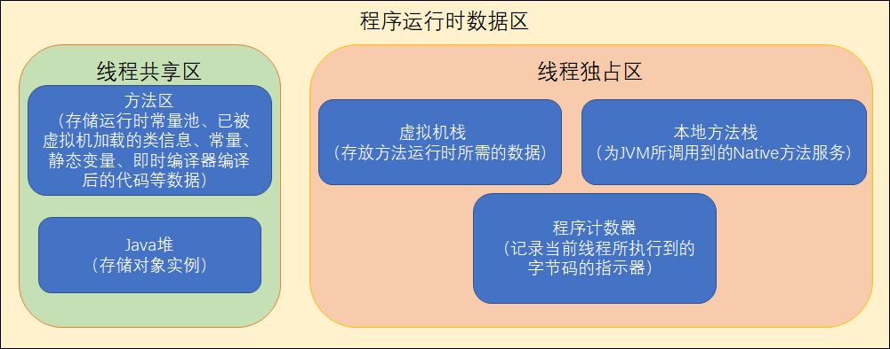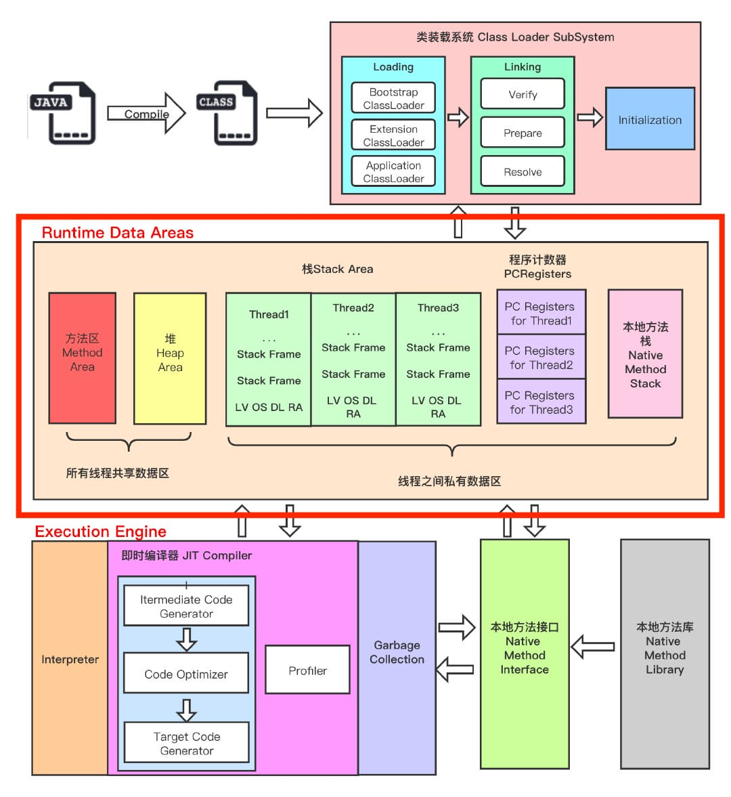 |
| :----------------------------------------------------------: |
| 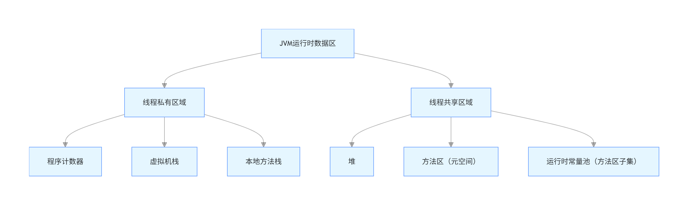 |

1

| **区域名称**                                | **共享性** | **存储内容**                                               | **常见错误**                        | 生命周期       |
| ------------------------------------------- | ---------- | ---------------------------------------------------------- | ----------------------------------- | -------------- |
| **<font color='red'>方法区/ 元空间</font>** | **共享**   | 类元信息、常量、静态变量、JIT代码                          | `OutOfMemoryError: Metaspace`       | JVM 启动到关闭 |
| **<font color='red'>堆 </font>**            | **共享**   | **所有对象实例** 和 **数组**                               | `OutOfMemoryError: Java heap space` | JVM 启动到关闭 |
| **<font color='blue'>虚拟机栈</font>**      | *私有*     | 存储**栈帧 (Stack Frame)**。每个方法调用都会创建一个栈帧。 | `StackOverflowError` (栈深度溢出)   | 随线程         |
| **<font color='blue'>本地方法栈</font>**    | *私有*     | 支持 native 方法（即 JNI 调用 C/C++ 代码）。               | `StackOverflowError`                | 随线程         |
| **<font color='blue'>程序计数器 </font>**   | *私有*     | 存储当前线程正在执行的**字节码指令地址**。                 | **无**                              | 随线程         |

> * JDK8 之后，“方法区”被元空间（Metaspace）取代，存储在**本地内存**。
> * 局部变量、方法参数、方法出口地址等随方法调用存储在**栈**上；对象实例（new 出来的）存储在**堆**上。
> * **线程私有**：每个线程启动时创建，线程结束时销毁，数据隔离，无线程安全问题。
> * **线程共享**：所有线程共用，生命周期与 JVM 一致，是线程安全问题的核心发生地，也是 GC 的主要目标区域（堆 + 元空间）。


## 问题思考

###### 内存区域总结

| 区域           | 线程共享 | 存储内容                             | 异常                   | 是否 GC         |
| -------------- | -------- | ------------------------------------ | ---------------------- | --------------- |
| **程序计数器** | ❌        | 字节码行号                           | 无                     | 否              |
| **虚拟机栈**   | ❌        | 栈帧（局部变量、操作数栈）           | `StackOverflowError`   | 否              |
| **本地方法栈** | ❌        | native 方法调用                      | 同上                   | 否              |
| **堆**         | ✅        | 对象实例、数组                       | `Java heap space`      | ✅（主要区域）   |
| **方法区**     | ✅        | 类信息、静态变量、常量、JIT 编译代码 | `Metaspace`/`PermGen`  | ✅（类卸载时）   |
| **直接内存**   | ✅        | 堆外内存（NIO）                      | `Direct buffer memory` | ❌（但可被清理） |

> 方法区在 JDK 8 之前是“永久代（PermGen）”，之后改为“元空间（Metaspace）”，使用本地内存。


###### 为什么要有程序计数器？

因为 JVM 是多线程的，每个线程要独立记录执行位置；程序计数器保证线程切换后能恢复正确的执行点（即线程私有）。


###### 虚拟机栈和本地方法栈的区别？可能发生哪些异常？

- 虚拟机栈：存储 Java 方法的栈帧（局部变量表、操作数栈等）；本地方法栈：为 Native 方法（C/C++ 实现）提供内存。
- 异常：`StackOverflowError`（栈深度溢出，如无限递归）、`OutOfMemoryError`（栈扩展失败，如创建过多线程）。


###### Java 虚拟机栈里存的是什么？栈帧里又包含哪些部分？

- 栈中存储的是**栈帧**。
- 每个栈帧包含：**局部变量表**、**操作数栈**、**动态连接**、**方法返回地址**。


###### Java对象分配

- 对象首先在 Eden 区分配。
- Minor GC：清理新生代，存活对象移至 Survivor 区。
- 对象在 Survivor 区“躲过”多次 GC 后（默认 15 次），晋升到老年代。
- Major GC / Full GC：清理老年代（通常伴随 Minor GC），耗时较长。


###### `String s = new String("abc")` 创建了几个对象？分别是什么？

- 1 个或 2 个。
- 如果 `"abc"` 在字符串常量池中不存在，则会创建 2 个：一个在**堆**中（`new` 出来的），一个在**字符串常量池**中（字面量 `"abc"`）。
- 如果已存在，则只创建 1 个堆中的对象。


###### 堆和栈的区别？

- **存储内容**：堆存对象实例；栈存局部变量、栈帧。
- **线程共享**：堆线程共享；栈线程私有。
- **内存分配**：堆动态分配；栈自动分配（编译器分配）。
- **异常**：堆 OOM；栈 OOM 或 SOF。
- **效率**：堆慢；栈快。

| 维度         | 堆（Heap）         | 栈（Stack）                |
| ------------ | ------------------ | -------------------------- |
| **存储内容** | 对象实例、数组     | 局部变量、方法调用（栈帧） |
| **线程共享** | 是                 | 否（每个线程私有）         |
| **内存分配** | 动态分配（new）    | 编译期确定大小             |
| **GC 回收**  | 是（主要区域）     | 否（方法结束自动释放）     |
| **异常**     | `OutOfMemoryError` | `StackOverflowError`       |


###### 堆是怎么划分的？

```
年轻代（Young Generation）
  ├─ Eden 区
  ├─ Survivor From
  └─ Survivor To
老年代（Old Generation）
```

新对象默认进入 Eden 区；经过多次 Minor GC 后仍存活的对象晋升到老年代。


###### 对象在内存中的布局是怎样的？

对象在堆内存中包括：

1. **对象头（Header）**：存储 MarkWord、类型指针
2. **实例数据（Instance Data）**：成员变量
3. **对齐填充（Padding）**：为了 8 字节对齐


###### 对象一定在堆上分配吗？

**不一定。**JIT 编译器会根据逃逸分析：

- **未逃逸对象** → 栈上分配；
- **分配后立即消亡对象** → 可能被标量替换；
- 否则才分配在堆上。


###### Java 堆内存是如何划分的？为什么要把堆分成新生代和老年代？

- 堆分为**新生代**和**老年代**。
- 新生代又分为 **Eden** 区和两个 **Survivor** 区。
- 分代依据是**弱分代假说**：绝大多数对象都是朝生夕死的。分代是为了更高效地进行垃圾回收。


###### **方法区里存什么？JDK 8 为什么用 Metaspace 替代 PermGen？**

- **方法区存储**：类结构（字段、方法、构造器）、静态变量、常量池、JIT 编译后的代码等。
- Metaspace 替代 PermGen 的原因：
    1. **内存溢出风险**：PermGen 大小固定（`-XX:MaxPermSize`），容易 OOM；
    2. **GC 效率低**：PermGen 回收条件苛刻，Full GC 频繁；
    3. **灵活性差**：无法动态扩展；
    4. **Metaspace 使用本地内存**，默认无上限（受系统限制），自动扩展，减少 OOM。


###### 堆划分不同区域的意义

堆在逻辑上分为 “新生代” 和 “老年代”，默认比例为`1:2`（可通过`-XX:NewRatio`调整），新生代又进一步划分，目的是**优化 GC 效率**（不同区域的对象生命周期不同，采用不同的 GC 算法）。


###### 为什么分代？

基于 **“弱代假说”（Weak Generational Hypothesis）**： 

- 大多数对象朝生夕死；
- 少数对象长期存活。→ 分代回收可大幅提升 GC 效率。


###### 堆是分配对象存储的唯一选择吗？

大部分对象存储在堆中，但**逃逸分析优化**后，未逃逸的对象会被分配到栈上（而非堆），避免 GC 开销（如方法内的局部对象，未被外部引用）。


###### Survivor 区必须有两个

两个 Survivor 区是为了实现 “复制算法” 的无内存碎片特性，若仅一个 Survivor 区，复制后会产生碎片，影响对象分配效率。


###### 对象年龄必须达到 15 才能晋升

15 是默认阈值，可通过 `MaxTenuringThreshold` 调整（范围 0-15）；此外，动态年龄判断、Survivor 区不足等场景会导致对象提前晋升。


###### 堆越大越好

堆过大可能导致 GC 耗时激增（如 Full GC 耗时数秒），且会占用过多物理内存，导致其他进程内存不足。


###### JVM 堆是干什么的？

存储对象实例，是GC主要区域。


###### 新生代和老年代的区别？

新生代短命对象多，老年代长期对象多。


###### Minor GC 和 Full GC 区别？

Minor清理新生代，Full清理整个堆。


###### 对象什么时候进入老年代？

达到年龄阈值或 Survivor 放不下。


###### OOM 如何排查？

Dump堆 + MAT 分析 + 调整 -Xmx


###### Java 方法 vs native 方法 PC 值区别

如果线程执行的是java方法，则计数器的值是正在执行的字节码指令的地址。如果线程执行的是native方法，则计数器的值为undefined。


###### 为什么移除永久代？ 

1. 字符串常量池已在 JDK 7 移到堆中；
2. 永久代大小难调优（`-XX:MaxPermSize`）；
3. 元空间使用操作系统内存，更灵活。


###### 类常量池与运行时常量池的关系？

类常量池是静态结构，运行时常量池是其运行期版本。


###### 字符串字面量存在哪？

字符串常量池（堆）


###### intern() 会创建对象吗？

不会创建新对象，只会引用或加入池。


###### `String s = new String("A")` 创建几个对象？

两个（池中 1 个，堆上 1 个）


###### `static final` 修饰的常量一定存储在方法区吗？

**答案**：不一定。

- 如果它是 **编译期常量**（基本类型或字符串字面量），它的值被内联，不占用方法区空间。
- 如果它是 **运行期常量**，那么它和静态变量一样，存储在方法区/元空间。


###### 以下代码创建了几个对象？

```java
public class StringConstantTest {
    public static final String STR = "Hello"; // 编译期常量
    public static void main(String[] args) {
        String s1 = "Hello";
        String s2 = STR;
    }
}
```

**答案**：只创建了 **1** 个 `String` 对象。

- `"Hello"` 是编译期常量，在类加载时被驻留到 **字符串常量池**。
- `STR` 和 `s1` 都指向字符串常量池中的同一个对象。
- `s2` 在编译时就被替换为对 `"Hello"` 的引用，所以也是同一个对象。


###### `static final String str = "abc"` 存储在堆？

"abc"` 是字符串字面量，`static final` 修饰的编译期常量，`str` 的值（而非引用）直接存储在 **元空间的运行时常量池** 中；字符串常量池（堆）中也会有 "abc" 的对象，但运行时常量池会直接引用该对象，本质是 “运行时常量池 + 堆（字符串常量池）” 协同存储，核心标识在运行时常量池。


###### 实例常量存储在元空间？

实例常量（仅 `final`）属于对象的一部分，必须存储在 **堆的对象实例中**，随对象创建而分配内存，与元空间（类级数据）无关。


###### JDK 8 中，`static int num = 10` 和 `static final int MAX = 100` 的存储位置区别？

- `static int num`：基本类型静态变量，存储在 **元空间的类元数据** 中，准备阶段设默认值 0，初始化阶段赋值 10；
- `static final int MAX = 100`：编译期静态常量，存储在 **元空间的运行时常量池** 中，准备阶段直接赋值 100，支持常量折叠。


###### `static final String s = new String("hello")` 的存储位置？

属于 “运行期静态常量”（new String是运行时创建对象）：

- 引用 `s`：存储在 **元空间的类元数据** 中；
- `new String("hello")` 创建的对象：存储在 **堆的普通对象区**（未入字符串常量池，除非调用 `s.intern()`）；
- 字面量 "hello"：会自动入字符串常量池（堆），但 `s` 指向的是堆中新建的对象，而非常量池对象。


## 堆（Heap）

```
Heap
├── Young Generation（新生代，约 1/3 堆）
│   ├── Eden（80%）：新对象优先分配于此
│   ├── Survivor From（10%）：Minor GC后存活的对象暂存
│   └── Survivor To（10%）：用于复制存活对象，始终为空
└── Old Generation（老年代，约 2/3 堆）：长期存活的对象存储于此
└── Metaspace（元空间）：非堆
```

- **特点**：线程共享，在虚拟机启动时创建。是 JVM 所管理的**最大**的一块内存区域几乎所有的对象都在堆中分配（除非被逃逸分析优化为栈上分配）。
    - **线程共享**：所有线程的对象都存储在堆中，是线程安全问题的主要发生地（如多线程修改同一对象的字段）。
- **作用**：**此内存区域的唯一目的就是存放对象实例**。几乎所有的对象实例都在这里分配内存。
- **GC 主战场**：Java 堆是**垃圾收集器管理的主要区域**，因此也被称为 **GC 堆**。
- **分代管理**：从垃圾回收的角度，现代收集器基本都采用分代收集算法，所以 Java 堆可以细分为：
    - **新生代**：新创建的对象在此分配。又分为 **Eden** 空间和两个 **Survivor** 空间。
    - **老年代**：在新生代中经历多次 GC 后仍然存活的对象，会被移动到老年代。
- **异常**：如果在堆中没有内存完成实例分配，并且堆也无法再扩展时，将会抛出 `OutOfMemoryError` 异常

- **Eden 区**：新创建的对象首先在 Eden 区分配。
    - **Survivor 区**：分为 `From Survivor` 和 `To Survivor`。用于存放 Minor GC 后存活的对象。
    - **对象晋升**：在 Survivor 区中，对象每熬过一次 Minor GC，年龄就增加 1 岁。当它的年龄增加到一定程度（默认为 15），就会被晋升到老年代。
- **老年代**：存放生命周期较长的对象，或大对象（如大的数组）。
- **默认大小**：
    - 初始：物理内存 **1/64**
    - 最大：物理内存 **1/4**
    - ≤4 GB 时自动对齐到 1 MB 倍数

> 若堆总大小为 6GB，默认配置下：
>
> - 新生代 = 2GB（1/3），老年代 = 4GB（2/3）；
> - Eden 区 = 1.6GB（8/10 新生代），From/To 区各 = 0.2GB（1/10 新生代）。


**Java 堆核心要点**

| 关键点       | 说明                                 |
| ------------ | ------------------------------------ |
| **分代设计** | 新生代（Eden/Survivor） + 老年代     |
| **分配策略** | TLAB → Eden → 大对象直入老年代       |
| **GC 核心**  | Minor GC（新生代） + Full GC（全堆） |
| **调优核心** | `-Xms/-Xmx`、`-Xmn`、SurvivorRatio   |
| **排查核心** | 堆转储 + MAT 分析引用链              |


### 内存划分

JVM 内存中**最大**的一块区域，用于存放**对象实例**和**数组**。几乎所有的对象都在堆中分配（**<font color='orange'>除非被逃逸分析优化为栈上分配</font>**）。为了进行高效的垃圾回收，虚拟机把堆内存**逻辑上**划分成三块区域（**<font color='red'>分代的唯一理由就是优化 GC 性能</font>**）

- 新生带（年轻代）：新对象和没达到一定年龄的对象都在新生代
- 老年代（养老区）：被长时间使用的对象，老年代的内存空间应该要比年轻代更大
- 元空间（JDK8 之前叫永久代）：像一些方法中的操作临时对象等，==JDK8 之前是占用JVM内存，JDK8 之后直接使用物理内存==。

| 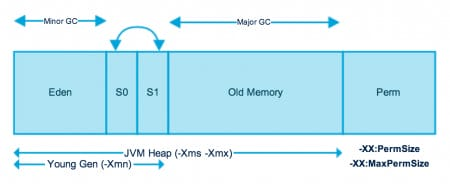 |
| :-----------------------------------------: |

> Java 虚拟机规范规定，Java 堆可以是处于物理上不连续的内存空间中，只要逻辑上是连续的即可，像磁盘空间一样。实现时，既可以是固定大小，也可以是可扩展的，主流虚拟机都是可扩展的（通过 `-Xmx` 和 `-Xms` 控制），如果堆中没有完成实例分配，并且堆无法再扩展时，就会抛出 `OutOfMemoryError` 异常。


**<font color='red'>分代假说（一切模型的理论基础）</font>**

1. **弱分代假说**：98 % 对象朝生夕灭
2. **强分代假说**：熬过越多次 GC 越难死亡
3. **跨代引用假说**：老年代→新生代的引用仅占 0.1 ~ 1 %，可用 **Remembered Set** 记录


**各分区核心职责**

| 分区          | 核心职责                                                     |
| ------------- | ------------------------------------------------------------ |
| Eden 区       | 新对象（如 `new User()`）的 “出生地”，分配速度快，GC 频率高（Minor GC 触发源）。 |
| Survivor From | 上一次 Minor GC 后存活的对象存储区，下次 GC 时作为 “源区” 复制存活对象 |
| Survivor To   | 本次 Minor GC 时，存活对象的 “目标区”，复制完成后 From/To 角色互换（To 变 From，原 From 清空）。 |
| 老年代        | 长期存活的对象（如缓存、单例）、大对象的 “养老区”，GC 频率低（Full GC 触发源）。 |


#### 年轻代 (Young Generation)

存放新创建的对象，绝大多数对象“朝生夕死”。

- Eden 区：新创建对象
- Survivor 0 / 1：幸存区，经过 GC 后的对象
- 默认 Eden : Survivor = 8 : 1 : 1（可通过 `-XX:SurvivorRatio=8` 调整）。

```
Eden : S0 : S1 = 8 : 1 : 1
```


**新建对象的生命周期**

1. 对象首先分配在 **Eden 区**；
2. 当 Eden 满了，触发 **Minor GC**；
3. 存活下来的对象进入 **Survivor 区**；
4. 在多次 GC 后仍存活的对象晋升到 **老年代**。


#### 老年代(Old Generation)

存放生命周期较长的对象（如缓存、单例、Session 等）。

> 大对象直接进入老年代（大对象是指需要大量连续内存空间的对象）。这样做的目的是避免在 Eden 区和两个Survivor 区之间发生大量的内存拷贝。


**老年代特点**

- 空间比新生代大；
- 主要由 **Major GC / Full GC** 管理；
- GC 频率低，但耗时高；
- 当老年代空间不足会触发


**对象来源**

1. 在新生代中经历多次 Minor GC 后仍然存活的对象（年龄达到阈值，默认 15 次，`-XX:MaxTenuringThreshold`）。
2. 大对象（如很长的字符串或大型数组）可能因为无法在新生代找到足够的连续空间而**直接进入老年代**（避免 Survivor 复制开销）。
3. Survivor 区空间不足时，对象直接晋升。


**GC 类型**

老年代的垃圾回收称为 **Major GC** 或 **Full GC**。Major GC 的速度一般比 Minor GC 慢 **10 倍以上**，因为老年代的空间通常更大，且存活对象更多。


### 垃圾回收

#### GC分类

###### Minor GC/Young GC

只是新生代的垃圾收集

- **触发条件**：Eden 区满（无足够空间分配新对象）。
- **回收范围**：Eden 区 + 当前 Survivor From 区。
- **核心算法**：复制算法（将存活对象复制到 Survivor To 区，清空 Eden 和 From 区），效率高（新生代对象存活率低，复制成本低）。
- **对象年龄递增**：每次 Minor GC 后存活的对象，年龄（`age`）会 +1（存储在对象头中）。


**Survivor区角色互换**

- Minor GC 完成后，Survivor To 区存储了所有存活对象，此时：
    - 原 From 区变为 “空”，下次 GC 时作为 To 区；
    - 原 To 区变为 From 区，下次 GC 时作为存活对象的 “源区”；
    - 核心目的：保证每次 Minor GC 时，总有一个 Survivor 区为空，用于存储复制后的存活对象。


**对象晋升老年代**

满足以下任一条件，对象会从新生代晋升到老年代

1. **年龄达标**：对象年龄达到 `MaxTenuringThreshold` 阈值（默认 15）
2. **Survivor 区空间不足**：Minor GC 后，Survivor To 区无法容纳所有存活对象，部分对象直接晋升
3. **动态年龄判断**：Survivor 区中，相同年龄的对象总大小超过 Survivor 区一半，年龄≥该年龄的对象直接晋升（JVM 优化，避免 Survivor 区溢出）
4. **大对象直接进入**：超过 `PretenureSizeThreshold` 阈值的对象（如 10MB 以上），跳过新生代直接进入老年代。


###### Major GC/Old GC

只是老年代的垃圾收集

- 目前，只有 CMS GC 会有单独收集老年代的行为。
- 很多时候 Major GC 会和 Full GC 混合使用，需要具体分辨是老年代回收还是整堆回收。


###### Partial GC

不是完整收集整个 Java 堆的垃圾收集

- 新生代收集（Minor GC/Young GC）
- 老年代收集（Major GC/Old GC）
- 混合收集（Mixed GC）


###### Mixed GC

收集整个新生代以及部分老年代的垃圾收集


###### Full GC

收集整个 Java 堆和方法区的垃圾

- **触发条件**：老年代满（无足够空间容纳晋升的对象）、元空间溢出、调用 `System.gc()`（仅建议，JVM 可忽略）。
- **回收范围**：老年代 + 新生代 + 元空间（部分）。
- **核心算法**：标记 - 清除 - 压缩算法（先标记垃圾对象，清除后整理内存碎片），效率低（老年代对象存活率高，标记和整理成本高）。
- **影响**：Full GC 会导致线程暂停（STW，Stop The World），耗时通常是 Minor GC 的 10 倍以上，生产环境需尽量避免频繁 Full GC。


#### GC类型与堆的关系

| GC 类型      | 回收区域                  | 触发条件                            | 停顿时间             |
| ------------ | ------------------------- | ----------------------------------- | -------------------- |
| **Minor GC** | 新生代（Eden + Survivor） | Eden 区满                           | 短（几十 ms）        |
| **Major GC** | 老年代                    | 老年代满                            | 长（几百 ms ~ 秒级） |
| **Full GC**  | 整个堆 + 方法区           | System.gc()、Metaspace 满、老年代满 | 最长                 |

> Major GC 和 Full GC 常被混用，但严格来说： 
>
> - **Major GC** = 老年代 GC；
> - **Full GC** = Minor GC + Major GC + 方法区 GC。


#### 不同GC器的堆管理

| GC 器                 | 堆布局                        | 特点                        |
| --------------------- | ----------------------------- | --------------------------- |
| **Serial / Parallel** | 传统分代（Eden/Survivor/Old） | 简单高效，适合单核/吞吐优先 |
| **CMS**               | 分代                          | 并发标记，低停顿（已废弃）  |
| **G1**                | **分区（Region）**            | 可预测停顿，大内存首选      |
| **ZGC / Shenandoah**  | 分页/分 Region                | 超低停顿（<10ms），TB 级堆  |


### 内存泄漏

#### OOM场景

| 错误信息                                | 区域          | 定位命令                | 解决方向                     |
| --------------------------------------- | ------------- | ----------------------- | ---------------------------- |
| `Java heap space`                       | 老年代/新生代 | `jmap -heap` / dump     | 内存泄漏/容量不足            |
| `GC overhead limit exceeded`            | 堆            | GC 日志                 | 垃圾占 >98 % & 回收 <2 % CPU |
| `Requested array size exceeds VM limit` | 堆            | `jmap -heap`            | 单次申请 > 堆最大可用        |
| `Direct buffer memory`                  | 直接内存      | `jcmd VM.native_memory` | Netty 未 release / 未限制    |
| `Metaspace`                             | 元空间        | `jcmd VM.native_memory` | 动态代理无限生成类           |

> * Java heap space：堆内存不足
>     * 增大`-Xmx`
>     * 排查内存泄漏
>
> * GC overhead limit exceeded：GC 太频繁，回收无效（优化对象生命周期）
>     * 增大堆
>     * 优化代码（减少临时对象）
> * Metaspace：类元信息太多
>     * 调大 `-XX:MaxMetaspaceSize`


#### 排查方法

**一 监控**

`jstat -gc <pid>` 观察老年代是否持续增长；


**二 堆转储**

自动 dump：`-XX:+HeapDumpOnOutOfMemoryError -XX:HeapDumpPath=/tmp`

实时 dump：`jmap -dump:format=b,file=heap.hprof <pid>`


**三 分析**

用 MAT（Memory Analyzer）或 VisualVM或 JProfiler 工具

- 查看 **Dominator Tree**（支配树）；
- 定位 **GC Roots 到泄漏对象的引用链**；


**四 修复**

**常见泄漏点**

- 静态集合（如 `static Map` 未清理）；
- 未关闭的资源（Connection、Stream、网络、IO）；
- ThreadLocal 未 remove；
- 监听器/回调未注销。

> **MAT 分析示例**：
> `java.util.HashMap` 占用 80% 堆 → 查看其 inbounds → 发现是静态缓存未清理。 


**优化方案**

- 若为内存泄漏：修复代码（如释放无用对象引用、关闭资源）；
- 若为堆配置过小：增大 `-Xms`/`-Xmx`；
- 若为大对象过多：优化业务逻辑，减少大对象创建。


**频繁Full GC排查**

- **原因**：老年代对象增长过快（如频繁创建长生命周期对象）、对象晋升过快（阈值过小）、老年代空间不足；
- 排查：
    1. 查看 GC 日志（`-verbose:gc -XX:+PrintGCDetails`），分析 Full GC 触发原因（老年代满？元空间满？）；
    2. 检查是否有大对象频繁进入老年代，或缓存对象未设置过期时间；
- **优化**：增大老年代空间、调整晋升阈值、优化缓存策略。


**新生代Minor GC频繁但耗时短**

- 若 Minor GC 频率高（如每秒 10 次以上）但单次耗时短（如 1ms 以内），通常是正常现象（新生代对象周转快）；
- 若耗时过长（如超过 10ms），可优化：增大新生代空间、减少临时对象创建、使用内存池复用对象。


#### 堆的监控与工具

**命令行工具**

| 工具      | 命令                   | 用途             |
| --------- | ---------------------- | ---------------- |
| **jstat** | `jstat -gc <pid> 1000` | 实时监控 GC 状态 |
| **jmap**  | `jmap -heap <pid>`     | 查看堆内存详情   |
| **jcmd**  | `jcmd <pid> GC.run`    | 触发 GC          |

```bash
# 实时堆使用情况
jstat -gc <pid> 1000

# Dump堆快照
jmap -dump:live,format=b,file=heap.bin <pid>

# 查看堆概况
jmap -heap <pid>
```


**可视化工具**

- **VisualVM**：监控、堆转储、线程分析；
- **MAT**：深度内存分析；
- **JProfiler**：商业级性能分析；
- **Arthas**：线上诊断（`heapdump` 命令）。
- **JConsole**
- **Eclipse MAT（Memory Analyzer）**


### 调优参数

#### 参数详解

| 目标       | 参数示例                                                | 备注                                       |
| ---------- | ------------------------------------------------------- | ------------------------------------------ |
| 固定大小   | `-Xms12g -Xmx12g`                                       | 避免动态扩容抖动                           |
| 新生代     | `-Xmn4g`                                                | G1 可不设，由 `-XX:NewRatio` 动态调整      |
| 大对象阈值 | `-XX:RegionSize=8m`                                     | G1  Humongous ≥ 4 MB                       |
| 停顿目标   | `-XX:MaxGCPauseMillis=150`                              | G1 默认 200 ms                             |
| 压缩指针   | `-XX:+UseCompressedOops`                                | 堆 ≤32 GB 默认开                           |
| 容器感知   | `-XX:+UseContainerSupport`                              | 自动读取 cgroup limit                      |
| 自动 dump  | `-XX:+HeapDumpOnOutOfMemoryError -XX:HeapDumpPath=/tmp` | OOM 瞬间留档                               |
| 对象晋升   | `-XX:MaxTenuringThreshold=15`                           | 对象晋升老年代的最大年龄                   |
| 大页支持   | `-XX:+UseLargePages -XX:LargePageSizeInBytes=1g`        | **G1/ZGC** 均受益，TLB 命中率              |
| 直接晋升   | `-XX:PretenureSizeThreshold=0`                          | 直接晋升老年代的对象大小阈值（0 表示禁用） |

> * 开启`-XX:+UseAdaptiveSizePolicy`，JVM 会动态调整 JVM 堆中各个区域的大小以及进入老年代的年龄，此时 `–XX:NewRatio` 和 `-XX:SurvivorRatio` 将会失效，而 JDK 8 是默认开启`-XX:+UseAdaptiveSizePolicy`，在 JDK 8中，**不要随意关闭**`-XX:+UseAdaptiveSizePolicy`，除非对堆内存的划分有明确的规划。
> * **`-XX:NewRatio`**：老年代与新生代的比例。例如 `-XX:NewRatio=2` 表示老年代:新生代 = 2:1。
> * **`-XX:SurvivorRatio`**：Eden 区与一个 Survivor 区的比例。例如 `-XX:SurvivorRatio=8` 表示 Eden:S0:S1 = 8:1:1。
> * **`-XX:+PrintGCDetails`**：在发生 GC 时打印详细的日志。
> * `-XX:PretenureSizeThreshold=10485760`（10MB 以上为大对象）
> * `-XX:MaxTenuringThreshold=10`（年龄达 10 晋升）
> * -Xlog:gc*：开启 GC 日志


#### 调优实践

堆的优化核心是 “减少 Full GC 频率” 和 “降低 GC 耗时”


###### 合理配置堆大小

* **`-Xms = -Xmx`**：避免堆动态扩展带来的性能抖动（在垃圾回收机制清理完堆区后不再需要重新分隔计算堆的大小）
* 堆大小不宜过大（如超过物理内存的 80%），否则会导致 swap 交换（内存与磁盘交换），GC 耗时激增。


###### 优化新生代配置

* **新生代不宜过大**：Minor GC 时间随新生代增大而增长
* 高频创建临时对象的场景（如 Web 服务），可适当增大新生代比例（如 `-XX:NewRatio=2`，新生代：老年代 = 1:2），减少 Minor GC 频率
* 避免新生代过小（如小于 1GB），否则会导致 Minor GC 过于频繁（如每秒数次），影响响应时间。


###### 调整对象晋升阈值

* 对于生命周期短的对象（如请求上下文），可保持默认阈值（15），避免过早晋升；
* 对于生命周期长的对象（如缓存），可适当降低阈值（如 `-XX:MaxTenuringThreshold=5`），让其快速晋升到老年代，减少新生代 GC 时的复制成本。

> **监控 Survivor 使用率**：避免过早晋升（`jstat -gc <pid>`）


###### 大对象处理

- 通过 `PretenureSizeThreshold` 配置大对象阈值（如 5MB），避免大对象在新生代反复复制；
- 业务层面尽量避免创建超大对象（如几十 MB 的字节数组），若无法避免，需确保老年代有足够空间。


###### 减少老年代对象产生

- 避免创建长期存活的大对象（如静态集合存储大量数据）；
- 合理使用缓存（如 Redis 替代本地缓存），减少 JVM 堆中缓存对象的数量。


### 分配流程

#### 标准分配流程

1. **Eden 分配**：新对象优先在 Eden 区分配
2. Eden 满 → Minor GC：
    - 清理 Eden + From Survivor
    - 存活对象复制到 To Survivor
    - From/To 角色互换
3. **对象年龄 +1**：每经历一次 Minor GC，对象年龄 +1
4. 晋升老年代：
    - 年龄 ≥ 阈值（默认 15）
    - Survivor 空间不足
    - 动态年龄判定（相同年龄对象总和 > Survivor 50%）
5. **老年代满触发Full GC**
    * 清理整个堆（包括新生代）。
    * 若仍无法分配空间 → 抛出 `OutOfMemoryError`。


#### 特殊分配策略

###### 大对象直接进入老年代

- **目的**：避免在 Eden 和 Survivor 之间频繁复制；
- **触发条件**：对象大小 > `-XX:PretenureSizeThreshold`（字节）；
- **典型场景**：大数组、长字符串。

> **大对象**直接进 Humongous，**跳过新生代**，避免拷贝代价。


###### 新生代空间不足进入老年代

新生代空间不足时，可能直接分配到老年代。


###### TLAB（Thread Local Allocation Buffer）

- **问题**：多线程同时分配对象 → 堆内存分配需同步（锁竞争）；
- **解决方案**：每个线程在 Eden 中预分配一小块**私有缓存区**（TLAB）；
- **效果**：99% 的对象分配在 TLAB 内完成，无需同步；
- **参数**：

```bash
-XX:+UseTLAB        # 启用 TLAB（默认开启）
-XX:TLABSize=64k    # 设置 TLAB 大小
```

* **TLAB 分配流程**：

```
对象分配 → 尝试 TLAB → 成功（无锁） / 失败 → 走公共 Eden 分配（加锁）
```


#### TLAB

###### 什么是 TLAB （Thread Local Allocation Buffer）?

- 从内存模型而不是垃圾回收的角度，对 Eden 区域继续进行划分，JVM 为每个线程分配了一个私有缓存区域，它包含在 Eden 空间内。
- 多线程同时分配内存时，使用 TLAB 可以避免一系列的非线程安全问题，同时还能提升内存分配的吞吐量，因此可以将这种内存分配方式称为**快速分配策略**。
- OpenJDK 衍生出来的 JVM 大都提供了 TLAB 设计。


###### 为什么要有 TLAB ?

- 堆区是线程共享的，任何线程都可以访问到堆区中的共享数据。
- 由于对象实例的创建在 JVM 中非常频繁，因此在并发环境下从堆区中划分内存空间是线程不安全的。
- 为避免多个线程操作同一地址，需要使用加锁等机制，进而影响分配速度。

尽管不是所有的对象实例都能够在 TLAB 中成功分配内存，但 JVM 确实是将 TLAB 作为内存分配的首选。

> 在程序中，可以通过 `-XX:UseTLAB` 设置是否开启 TLAB 空间。默认情况下，TLAB 空间的内存非常小，仅占有整个 Eden 空间的 1%，可以通过 `-XX:TLABWasteTargetPercent` 设置 TLAB 空间所占用 Eden 空间的百分比大小。一旦对象在 TLAB 空间分配内存失败时，JVM 就会尝试着通过使用加锁机制确保数据操作的原子性，从而直接在 Eden 空间中分配内存。


### 逃逸分析

**逃逸分析(Escape Analysis)是目前 Java 虚拟机中比较前沿的优化技术。这是一种可以有效减少 Java 程序中同步负载和内存堆分配压力的跨函数全局数据流分析算法**。通过逃逸分析，Java Hotspot 编译器能够分析出一个新的对象的引用的使用范围从而决定是否要将这个对象分配到堆上。

> 关于逃逸分析的论文在1999年就已经发表了，但直到JDK 1.6才有实现，而且这项技术到如今也并不是十分成熟的。**其根本原因就是无法保证逃逸分析的性能消耗一定能高于他的消耗。虽然经过逃逸分析可以做标量替换、栈上分配、和锁消除。但是逃逸分析自身也是需要进行一系列复杂的分析的，这其实也是一个相对耗时的过程。**
>
> 一个极端的例子，就是经过逃逸分析之后，发现没有一个对象是不逃逸的。那这个逃逸分析的过程就白白浪费掉了。虽然这项技术并不十分成熟，但是他也是即时编译器优化技术中一个十分重要的手段。


**逃逸分析的基本行为就是分析对象动态作用域**

- 当一个对象在方法中被定义后，对象只在方法内部使用，则认为没有发生逃逸。
- 当一个对象在方法中被定义后，它被外部方法所引用，则认为发生逃逸。例如作为调用参数传递到其他地方中，称为方法逃逸。

```java
public static StringBuffer craeteStringBuffer(String s1, String s2) {
   StringBuffer sb = new StringBuffer();
   sb.append(s1);
   sb.append(s2);
   return sb;
}
```

`StringBuffer sb`是一个方法内部变量，上述代码中直接将sb返回，这样这个 StringBuffer 有可能被其他方法所改变，这样它的作用域就不只是在方法内部，虽然它是一个局部变量，但是其逃逸到了方法外部。甚至还有可能被外部线程访问到，譬如赋值给类变量或可以在其他线程中访问的实例变量，称为线程逃逸。

上述代码如果想要 `StringBuffer sb`不逃出方法，可以这样写。

```java
public static String createStringBuffer(String s1, String s2) {
   StringBuffer sb = new StringBuffer();
   sb.append(s1);
   sb.append(s2);
   return sb.toString();
}
```

不直接返回 StringBuffer，那么 StringBuffer 将不会逃逸出方法。


**参数设置**

- 在 JDK 6u23 版本之后，HotSpot 中默认就已经开启了逃逸分析
- 如果使用较早版本，可以通过`-XX"+DoEscapeAnalysis`显式开启

> 开发中使用局部变量，就不要在方法外定义。


#### 栈上分配

将堆分配转化为栈分配。JIT 编译器在编译期间根据逃逸分析的结果，发现如果一个对象并没有逃逸出方法的话，就可能被优化成栈上分配。分配完成后，继续在调用栈内执行，最后线程结束，栈空间被回收，局部变量对象也被回收。这样就无需进行垃圾回收。

> 常见栈上分配的场景：成员变量赋值、方法返回值、实例引用传递


#### 标量替换

**标量**（Scalar）是指一个无法再分解成更小的数据的数据。Java 中的原始数据类型就是标量。相对的，那些的还可以分解的数据叫做**聚合量**（Aggregate），Java 中的对象就是聚合量，因为其还可以分解成其他聚合量和标量。

有的对象可能不需要作为一个连续的内存结构存在也可以被访问到，那么对象的部分（或全部）可以不存储在内存，而存储在 CPU 寄存器。在 JIT 阶段，通过逃逸分析确定该对象不会被外部访问，并且对象可以被进一步分解时，JVM 不会创建该对象，而会将该对象成员变量分解若干个被这个方法使用的成员变量所代替。这些代替的成员变量在栈帧或寄存器上分配空间。这个过程就是**标量替换**。

通过 `-XX:+EliminateAllocations` 可以开启标量替换，`-XX:+PrintEliminateAllocations` 查看标量替换情况。

```java
public static void main(String[] args) {
   alloc();
}

private static void alloc() {
   Point point = new Point（1,2）;
   System.out.println("point.x="+point.x+"; point.y="+point.y);
}
class Point{
    private int x;
    private int y;
}
```

以上代码中，point 对象并没有逃逸出 `alloc()` 方法，并且 point 对象是可以拆解成标量的。那么，JIT 就不会直接创建 Point 对象，而是直接使用两个标量 int x ，int y 来替代 Point 对象。

```java
private static void alloc() {
   int x = 1;
   int y = 2;
   System.out.println("point.x="+x+"; point.y="+y);
}
```


#### 同步消除

如果一个对象被发现只能从一个线程被访问到，那么对于这个对象的操作可以不考虑同步。

- 线程同步的代价是相当高的，同步的后果是降低并发性和性能。
- 在动态编译同步块的时候，JIT 编译器可以借助逃逸分析来判断同步块所使用的锁对象是否能够被一个线程访问而没有被发布到其他线程。如果没有，那么 JIT 编译器在编译这个同步块的时候就会取消对这个代码的同步。这样就能大大提高并发性和性能。这个取消同步的过程就叫做**同步省略，也叫锁消除**。

```java
public void keep() {
  Object keeper = new Object();
  synchronized(keeper) {
    System.out.println(keeper);
  }
}
```

如上代码，代码中对 keeper 这个对象进行加锁，但是 keeper 对象的生命周期只在 `keep()`方法中，并不会被其他线程所访问到，所以在 JIT编译阶段就会被优化掉。优化成：

```java
public void keep() {
  Object keeper = new Object();
  System.out.println(keeper);
}
```


## 方法区（Method Area）

**方法区（method area）只是 JVM 规范中定义的一个概念**，用于存放**<font color='green'>类结构信息</font>**【版本、字段、方法、接口】、**<font color='red'>常量</font>**、**<font color='orange'>静态变量</font>**、**<font color='blue'>即时编译器编译后的代码缓存</font>**等数据。并没有规定如何去实现它，不同的厂商有不同的实现。

- **线程共享**：所有线程共用类元数据（如`String.class`对象仅存储一份）
- **运行时常量池（Runtime Constant Pool）**：是方法区的一部分，用于存放编译期生成的各种**字面量**和**符号引用**。
- **内存位置**：**本地内存**（Native Memory），**不再在 Heap**
- **默认大小**：**无限**（受本机物理内存 + 操作系统限制）
- **常见报错**：`java.lang.OutOfMemoryError: Metaspace`
- **内存配置（元空间）**：
    - `-XX:MetaspaceSize`：元空间初始大小（默认约 21MB）；
    - `-XX:MaxMetaspaceSize`：元空间最大大小（默认无上限，可设置为固定值避免本地内存溢出）

- **泄漏场景**：
    - 动态代理无限生成类（MyBatis Mapper、GCLib）
    - 热部署重复创建 `ClassLoader`

```bash
jcmd <pid> VM.native_memory | grep Metaspace
```

> [!IMPORTANT]
>
> 1. **JDK 8 起，所有对象（包括 Class 对象、静态变量、字符串常量）都在堆中**。
> 2. **元空间只存类的元数据（metadata），不存对象或静态变量**。
> 3. **字符串常量池在 JDK 7+ 就已移到堆中**，这是为了减少永久代溢出风险并提升性能。


| 变量类型             | 修饰符组合                | 存储位置（核心）                   | 生命周期                          | 关键特点                     |
| -------------------- | ------------------------- | ---------------------------------- | --------------------------------- | ---------------------------- |
| 静态变量（基本类型） | `static`                  | 元空间（类元数据）                 | 类级（类加载 → 类卸载）           | 类共享，准备阶段设默认值     |
| 静态变量（引用类型） | `static`                  | 引用：元空间（类元数据）；对象：堆 | 引用：类级；对象：堆级（GC 回收） | 引用不回收，对象可 GC        |
| 静态常量（编译期）   | `static final` + 字面量   | 元空间（运行时常量池）             | 类级（类加载 → 类卸载）           | 常量折叠，复用性强           |
| 静态常量（运行期）   | `static final` + 非字面量 | 引用：元空间（类元数据）；对象：堆 | 引用：类级；对象：堆级            | 初始化阶段赋值               |
| 实例常量             | `final`（无 static）      | 堆（对象实例中）                   | 对象级（创建 → GC）               | 每个对象独立一份，构造时赋值 |


### 元空间（Metaspace）

不管是 JDK8 之前的永久代，还是 JDK8 及以后的元空间，都可以看作是 Java 虚拟机规范中方法区的实现。虽然 Java 虚拟机规范把方法区描述为堆的一个逻辑部分，但是它却有一个别名叫 Non-Heap（非堆），目的应该是与 Java 堆区分开。

类型信息、字段、方法、常量保存在本地内存的元空间，但字符串常量池、静态变量仍在堆中

*设置方法区内存的大小*

- 元数据区大小可以使用参数 `-XX:MetaspaceSize` 和 `-XX:MaxMetaspaceSize` 指定。
- 默认值依赖于平台。Windows 下，`-XX:MetaspaceSize` 是 21M，`-XX:MaxMetaspacaSize` 的值是 -1，即没有限制。
- 与永久代不同，如果不指定大小，默认情况下，虚拟机会耗尽所有的可用系统内存。如果元数据发生溢出，虚拟机一样会抛出异常 `OutOfMemoryError:Metaspace`。
- `-XX:MetaspaceSize` ：设置初始的元空间大小。对于一个 64 位的服务器端 JVM 来说，其默认的 `-XX:MetaspaceSize` 的值为20.75MB，这就是初始的高水位线，一旦触及这个水位线，Full GC 将会被触发并卸载没用的类（即这些类对应的类加载器不再存活），然后这个高水位线将会重置，新的高水位线的值取决于 GC 后释放了多少元空间。如果释放的空间不足，那么在不超过 `MaxMetaspaceSize`时，适当提高该值。如果释放空间过多，则适当降低该值。
- 如果初始化的高水位线设置过低，上述高水位线调整情况会发生很多次，通过垃圾回收的日志可观察到 Full GC 多次调用。为了避免频繁 GC，建议将 `-XX:MetaspaceSize` 设置为一个相对较高的值。

元空间（Metaspace），使用**本地内存（Native Memory）**，默认无上限（受系统内存限制）。


###### 存放内容

- 类信息（Class Metadata）：类的全限定名、字段信息（名称、类型、访问权限）、方法信息（名称、参数、返回值、字节码）、接口信息、父类信息等
- **运行时常量池**（Runtime Constant Pool）：JDK 7 后，字符串常量池、基本类型包装类常量池（如`Integer.valueOf(127)`）移至堆中，方法区仅保留 “运行时常量池”（存储类编译后的符号引用、字面量）
- 静态变量（`static`修饰）：如`public static String name = "Tom"`，存储在方法区（而非堆）
- JIT 编译后的代码：即时编译器（JIT）将热点代码（频繁执行的字节码）编译为机器码后，存储在方法区（提升执行效率）。


###### 永久代和元空间的区别

* 存储内容不同，==元空间存储类的元信息==，静态变量和常量池等并入堆中。相当于永久代的数据被分到了堆和元空间中。
* 永久代物理是堆的一部分，和新生代，老年代地址是连续的（受垃圾回收器管理），而元空间存在于本地内存（堆外内存，不受垃圾回收器管理）。
* 通过`-XX:PermSize` 和 `-xx:MaxPermSize` 来设置永久代参数，通过`-XX:MetaspaceSize` 和 `-XX:MaxMetaspaceSize` 用来设置元空间参数。


**字符串常量池迁移**

- **JDK 6**：字符串常量池在 **永久代**；
- **JDK 7+**：字符串常量池移到 **堆中**；
- 影响：
    - `String.intern()` 行为变化；
    - 堆内存压力增大，但避免永久代 OOM。

```java
// JDK 6: intern() 返回 PermGen 中的引用
// JDK 7+: intern() 返回堆中首次出现的字符串引用
String s1 = new String("hello");
String s2 = s1.intern();
System.out.println(s1 == s2); // JDK 6: false, JDK 7+: true（如果 "hello" 未出现过）
```


###### 静态变量的存储

静态变量（`static`）存储在方法区的类元数据中，而非堆中。

```java
public class User {
    public static String name = "Tom"; // 存储在方法区
    public String age = "20"; // 实例变量，存储在堆中的User对象里
}
```

- 静态变量属于 “类级别的数据”，仅存储一份，所有实例共享
- 实例变量属于 “对象级别的数据”，每个对象存储一份，存储在堆中


### 存放内容

| **对比项**   | **类常量池（Class CP）**         | **运行时常量池（Runtime CP）**                | **字符串常量池（String CP）**         |
| ------------ | -------------------------------- | --------------------------------------------- | ------------------------------------- |
| **存在形式** | `.class` 文件中的静态数据结构    | 内存中的动态数据结构                          | 内存中特殊的对象引用集合              |
| **存储位置** | 磁盘上的 **`.class` 文件**       | **方法区**（Java 8+ 为 Metaspace）            | **堆（Heap）**（Java 7+）             |
| **生命周期** | 编译时确定                       | 类加载时生成，类卸载时销毁                    | 随 JVM 启动/GC 回收（在 Heap 中）     |
| **主要内容** | 字面量 和 **符号引用**（未解析） | 字面量、符号引用 和 **直接引用**（已解析）    | **String 对象的唯一引用**（用于去重） |
| **关键作用** | 类的**编译时蓝图**               | 实现**动态链接**，符号引用转直接引用          | **字符串去重**，节省内存              |
| **动态性**   | 无（编译时确定）                 | **有**（解析符号引用，`intern()` 也可以添加） | **有**（通过 `intern()` 添加和查找）  |

| 项目               | static变量     | final 编译期常量              | final 运行时常量 |
| ------------------ | -------------- | ----------------------------- | ---------------- |
| 是否在类加载时分配 | 是             | 是                            | 是               |
| 变量本身位置       | 方法区         | 常量池                        | 方法区           |
| 内容是否在堆       | 若是对象则在堆 | 字符串可能在堆（String Pool） | 是               |
| 是否 inline        | 否             | **是**                        | 否               |
| 是否触发类初始化   | 会             | **不会**                      | 会               |

| **特性**     | **静态变量 (static)**             | **常量 (final)**                     | **静态常量 (static final)**                    |
| ------------ | --------------------------------- | ------------------------------------ | ---------------------------------------------- |
| **关注点**   | **共享性**（属于类）              | **不可变性**（不能被修改）           | 共享且不可变                                   |
| **是否可变** | 可变（除非被 `final` 修饰）       | 不可变（引用或值）                   | 不可变                                         |
| **内存位置** | 方法区（Metaspace）               | 取决于类型（局部/实例/静态）         | **运行时常量池**（Metaspace）或 Metaspace/Heap |
| **命名规范** | 小写开头，驼峰命名（如：`count`） | （作为实例或局部）小写开头，驼峰命名 | **全大写，下划线连接**（如：`MAX_VALUE`）      |
| **赋值要求** | 自动赋零值                        | **必须**且只能赋值一次               | **必须**且只能赋值一次（在类加载时）           |


| 变量类型       | 代码示例                                       | 存储位置                       | 生命周期       | 初始化时机                                           |
| :------------- | :--------------------------------------------- | :----------------------------- | :------------- | :--------------------------------------------------- |
| **静态变量**   | `static int a = 10;`                           | **方法区/元空间**              | 与类相同       | 类加载的**准备阶段**（零值），**初始化阶段**（赋值） |
| **编译期常量** | `static final int A = 10;`                     | **常量池**（值被内联到代码中） | -              | 编译期直接替换，**不占用静态区**                     |
| **运行期常量** | `static final int B = new Random().nextInt();` | **方法区/元空间**              | 与类相同       | 类加载的**初始化阶段**（与静态变量相同）             |
| **实例变量**   | `int b = 20;`                                  | **堆**（在对象实例内部）       | 与对象实例相同 | 创建对象实例时                                       |


#### 常量（Constants）

| **常量类型**                           | **描述**                                                     | **存储位置**                                                 | **编译器优化**                                               |
| -------------------------------------- | ------------------------------------------------------------ | ------------------------------------------------------------ | ------------------------------------------------------------ |
| **编译时常量 (Compile-Time Constant)** | 必须是基本类型或 `String`，并且**赋值为一个字面量或另一个编译时常量**。 | **运行时常量池（Runtime Constant Pool）**，位于 Metaspace。  | **编译器优化：** 编译器会进行**常量折叠（Constant Folding）**，直接将常量值（而不是引用）嵌入到所有使用它的地方，就像 C/C++ 的宏定义一样。 |
| **运行时常量 (Runtime Constant)**      | 赋值为一个**方法调用**或**复杂表达式**（如 `new Object()` 或 `System.currentTimeMillis()`）。 | 引用存储在 **Metaspace**（像普通静态变量），对象实例在 **堆（Heap）**。 | **无优化：** 必须在运行时执行初始化代码才能确定值，无法被常量折叠。 |

```java
// 编译时常量：会被编译器直接替换为 100
public static final int COMP_CONST = 10 * 10; 

// 运行时常量：必须在运行时执行方法，其值无法被内联
public static final long RUN_CONST = System.currentTimeMillis();
```


###### 关于 `final` 的“不可变性”陷阱

`final` 只保证**引用本身不可变**，但**不保证引用指向的对象内容不可变**。

- 对于基本类型：`final int x = 10;`，`x` 的值永远是 10。
- 对于对象类型：`final List<String> list = new ArrayList<>();`
    - **不能**执行：`list = new LinkedList<>();`（引用不可变）
    - **可以**执行：`list.add("Hello");`（对象内容可变）


###### 编译期常量（constant variable）

如果一个静态常量的值可以在 **编译时** 就确定，那么它会被特殊优化。

- **定义：** 必须是**基本类型**或 **String**，并且直接赋值给一个**字面量**（如 `100` 或 `"Hello"`）。
- **存储内容：** 存储常量的值本身。
- **存储位置：** **运行时常量池（Runtime Constant Pool）**，该常量池位于 **方法区（元空间 Metaspace）** 内部。

| **示例代码**                               | **存储位置分析**                                             |
| ------------------------------------------ | ------------------------------------------------------------ |
| `public static final int MAX = 100;`       | 常量值 `100` 存储在 **运行时常量池**。                       |
| `public static final String NAME = "JDK";` | 字符串常量 `"JDK"` 的引用存储在 **运行时常量池**；该字符串对象本身存储在 **字符串常量池**（位于**堆**）。 |

这是一个非常好的问题，它涉及到 JVM 内存模型中的核心细节和 Java 语言的编译优化机制。

静态变量和常量的存储位置是不同的，并且会根据它们是否被 `final` 修饰以及赋值方式（是否为编译时常量）而变化。


如果一个静态常量的值可以在 **编译时** 就确定，那么它会被特殊优化。

- **定义：** 必须是**基本类型**或 **String**，并且直接赋值给一个**字面量**（如 `100` 或 `"Hello"`）。
- **存储内容：** 存储常量的值本身。
- **存储位置：** **运行时常量池（Runtime Constant Pool）**，该常量池位于 **方法区（元空间 Metaspace）** 内部。

| **示例代码**                               | **存储位置分析**                                             |
| ------------------------------------------ | ------------------------------------------------------------ |
| `public static final int MAX = 100;`       | 常量值 `100` 存储在 **运行时常量池**。                       |
| `public static final String NAME = "JDK";` | 字符串常量 `"JDK"` 的引用存储在 **运行时常量池**；该字符串对象本身存储在 **字符串常量池**（位于**堆**）。 |

**编译器优化（常量折叠）：**

对于编译时常量，Java 编译器会进行**常量折叠（Constant Folding）**，直接将常量值（如 `100`）嵌入到所有使用它的地方，就像 C 语言的宏一样，不再需要运行时查找变量。


满足条件：

- `final`
- 基本类型 或 String
- 编译期就能确定值

**示例说明**

```java
public static final int A = 1;
public static final String S = "abc";
```

**存放位置**

| 内容                                  | 存放位置                                     |
| ------------------------------------- | -------------------------------------------- |
| A / S 的值                            | **class 文件 Constant Pool（编译期常量池）** |
| 加载后进入 Method Area 的运行时常量池 | **Runtime Constant Pool**                    |
| 引用该常量的地方                      | **直接把值拷贝到字节码**                     |

**编译期常量会被 inline（复制到使用处）**

```java
System.out.println(A);
```

不需要访问类，也不触发 Demo 类初始化。


**基本类型常量**（如 `static final int`）

方法区（元空间）（实际值可能内联到字节码，不单独占内存）

**字符串字面量 / String 常量**（如 `"hello"`）

**Java 堆中的字符串常量池**

> 💡 注意：`public static final String s = "hello";`
>
> - `"hello"` 字符串对象本身存放在 **堆中的字符串常量池**（JDK 7+）
> - `s` 是一个静态引用，指向该字符串对象。而这个引用（即变量 `s`）作为静态字段，也存放在 **堆中**（JDK 8+）


 **编译期常量**

**定义**：被 `static final` 修饰，并且其值是 **基本数据类型** 或 **字符串字面量**，其值在编译期就能确定。

```java
public class ConstantDemo {
    // 编译期常量
    public static final int MAX_VALUE = 100;         // 基本数据类型
    public static final String GREETING = "Hello";   // 字符串字面量
}
```

**存储位置与行为**：

1. **编译期**：编译器会将所有使用到 `MAX_VALUE` 和 `GREETING` 的地方，直接替换为字面量 `100` 和 `"Hello"`。这个过程称为 **常量传播**。
2. **类加载**：这些常量的符号引用会存储在 **类常量池** 中。在解析阶段，它们会被解析为直接量。
3. **运行时**：**它们不会被存储在方法区的静态变量区域**。因为编译后，代码中已经没有对 `ConstantDemo.MAX_VALUE` 这个符号的引用了，取而代之的是直接的数字 `100`。

**验证**：
查看上述代码的字节码，你会发现 `System.out.println(ConstantDemo.MAX_VALUE);` 会被编译为 `bipush 100`，直接操作数字 `100`，与 `ConstantDemo` 类无关。

**结论**：编译期常量在运行时，其值被直接“内联”到使用它们的代码中，本身不占用静态变量区的空间。


###### 运行时常量（不能编译期计算）

如果一个静态常量的值必须在 **运行时** 才能确定（例如通过方法调用赋值）。

- **定义：** 赋值为一个**方法调用**或 **new 操作符**。
- **存储位置：** 与普通的静态变量相同。
    - 引用本身存储在 **方法区（元空间）**。
    - 对象实例存储在 **堆（Heap）**。

| **示例代码**                                                 | **存储位置分析**                                            |
| ------------------------------------------------------------ | ----------------------------------------------------------- |
| `public static final Date NOW = new Date();`                 | `NOW` 引用存储在 **元空间**；`Date` 对象实例存储在 **堆**。 |
| `public static final long TIME = System.currentTimeMillis();` | `TIME` 变量的值在类初始化时确定，存储在 **元空间**。        |


```java
public static final int B = new Random().nextInt();  // 运行时计算
```

**存放位置**

| 内容            | 存放位置 |
| --------------- | -------- |
| B（变量本身）   | 方法区   |
| B 指向的对象/值 | 堆       |


###### 实例常量 (`private final`)

**存储内容：** 实例常量的值或引用。

**存储位置：** 属于对象的一部分，存储在 **堆（Heap）** 中。

| **示例代码**            | **存储位置分析**                               |
| ----------------------- | ---------------------------------------------- |
| `private final int id;` | `id` 作为对象实例数据的一部分，存储在 **堆**。 |


**运行期常量**

**定义**：虽然被 `static final` 修饰，但其值需要在 **运行期** 才能确定。

```java
public class RuntimeConstantDemo {
    // 运行期常量
    public static final int RANDOM_NUMBER = new Random().nextInt(); // 运行时计算
    public static final Object OBJECT_CONSTANT = new Object();      // 运行时创建对象
    public static final String COMPLEX_STRING = getStringFromDB();  // 运行时方法调用
}
```

**存储位置与行为**：

1. 它们的值在编译期无法确定，必须在类加载的 **初始化** 阶段（执行 `<clinit>` 方法）进行赋值。
2. 因此，它们的行为和静态变量 **完全一样**。
3. **存储位置**：与普通静态变量相同，存储在 **方法区/元空间** 的类信息中。

**结论**：运行期常量就是一种特殊的静态变量，只是赋值后不可再修改。


#### 类变量（Static Variables）

静态变量（Static Variables），或称**类变量**，是使用 `static` 关键字修饰的变量。

| 类型                    | 存放位置                |
| ----------------------- | ----------------------- |
| static 变量（引用本身） | **方法区（Metaspace）** |
| static 引用指向的对象   | **堆（Heap）**          |

**示例说明**

```java
public class Demo {
    public static int a = 10;          // 基本类型 static
    public static String s = "hello";  // 引用类型 static
}
```

**内存布局**

- `a` 的 **变量本身**在 方法区
- `10` 这个数值放在 JVM 的运行时常量池中（属于 class 常量）
- `s` 的 **引用本身**在 方法区
- `"hello"` 字符串对象在 堆（并且共享到 字符串常量池 StringTable）

> **类的静态变量（非 final 或非常量）存储在 Java 堆中，与该类的 Class 对象关联。**而类的元数据（如类名、方法信息、字段描述等）才存储在 **元空间（Metaspace）**。

| **示例代码**                   | **存储位置分析**                                             |
| ------------------------------ | ------------------------------------------------------------ |
| `public static int count = 0;` | `count` 变量本身（值 `0`）存储在 **元空间**。                |
| `public static Object ref;`    | `ref` 这个引用本身存储在 **元空间**；它指向的对象实例 `new Object()` 存储在 **堆**。 |


```java
public class StaticStorageDemo {
    // 静态变量
    public static int staticValue = 100;
    public static Object staticObject = new Object();

    public static void main(String[] args) {
        // 静态变量可以通过类名直接访问，无需创建对象
        System.out.println(StaticStorageDemo.staticValue);
    }
}
```

- `staticValue` 这个变量名和它的值（100）的存储信息，都在 `StaticStorageDemo` 类的 `Class` 对象里，位于 **方法区/元空间**。
- 但是，`staticObject` 这个引用变量本身存储在方法区，而它所指向的实际 `Object` 对象则是在 **堆** 中创建的。


#### class常量池（Class Constant Pool / 静态常量池）

###### 定义与位置

- **定义：** 类常量池是 **`.class` 文件（字节码文件）** 中存储的静态数据结构。
- **位置：** 存储在磁盘上的 **`.class` 文件** 内部。
- **生成时机：** **编译时**（即 `javac` 编译 `.java` 文件时）确定。
- **作用：**类常量池是类的**蓝图**。它描述了一个类、其字段和方法的所有**外部依赖**信息，为后续的类加载和动态链接提供了基础数据。


###### 存储内容

类常量池存储的是一个类在编译阶段能确定的**字面量（Literal）和符号引用（Symbolic Reference）**。

| **类型**     | **描述**                                                     | **示例**                                                     |
| ------------ | ------------------------------------------------------------ | ------------------------------------------------------------ |
| **字面量**   | 文本字符串、final 常量值（如 `final int a = 10;`）、数字常量等。 | `"Hello World"`、`100`、`3.14`                               |
| **符号引用** | 用于描述在运行时才能确定的引用信息，与内存地址无关。         | 类的全限定名（如 `java/lang/Object`），字段的名称和描述符，方法的名称和描述符。 |


###### 为什么需要常量池


#### 运行时常量池（Runtime Constant Pool）

###### 定义与位置

- **定义：** 运行时常量池是类常量池在 **JVM 内存中**的运行时表示。
- **位置：** 存储在 **方法区（Method Area）** 内部。
    - **Java 7 及以前：** 方法区以**永久代（PermGen）**形式实现。
    - **Java 8 及以后：** 方法区以**元空间（Metaspace）**形式实现（使用本地内存，而非 JVM 堆）。
- **生成时机：** 类加载的 **加载（Loading）** 阶段，将 `.class` 文件中的常量池数据复制到方法区。


###### 实际作用

运行时常量池是 JVM 执行**动态链接**的关键区域：

- **动态性：** 它具有**动态性**，可以在程序运行期间将新的常量放入池中（最典型的就是 `String.intern()` 方法）。
- **符号引用到直接引用的转换：**
    - 初始时，它存储了类常量池中的符号引用。
    - 在类加载的**解析（Resolution）阶段（也是动态链接的关键步骤），JVM 会将这些符号引用**（如方法名 `java/lang/Object.wait`）转换为指向内存地址的**直接引用**（该方法代码的实际内存入口）。


###### 运行时常量池的功能

1. **保存类常量池的信息**
2. **将符号引用解析为直接引用（动态链接）**
3. **还可以动态添加内容（例如 String.intern()）**


#### 字符串常量池（String Intern Pool）

###### 定义与位置

- **定义：** 字符串常量池是一个特殊的、独立的内存区域，专门用来存储**字符串字面量**（在代码中用双引号定义的字符串）的**唯一实例**。
- **位置：** **发生了重要变化，面试必考。**
    - **Java 6 及以前：** 存储在 **永久代（PermGen）** 中。
    - **Java 7 及以后：** 存储在 **堆（Heap）** 中。
- **目的：** 实现 **字符串去重（String Deduplication）**，节省内存。

> 这是一个**全局共享的字符串池**：
>
> - 所有字符串字面量（`"abc"`）都会进入池
> - 调用 `intern()` 时也会进入池


###### 存储内容

字符串常量池存储的是对唯一 `String` 对象的**引用**（Reference）。

- **如何去重：**
    - 当 JVM 遇到一个字符串字面量（例如 `"abc"`）时，它会首先检查字符串常量池中**是否已经存在**内容等于 `"abc"` 的 `String` 对象。
    - **如果存在：** 直接返回池中已有的那个 `String` 对象的引用。
    - **如果不存在：** 创建一个新的 `String` 对象，并将其引用放入字符串常量池，然后返回这个新对象的引用。


###### 为什么字符串池在堆？

因为：

- 堆可回收
- 永久代容易 OOM（Java6）
- 提高 JVM 性能

Java8 后永久代被取消，字符串池自然也放堆。


###### 字符串字面量

```java
String a = "hello";
String b = "hello";
```

- 字符串 `"hello"` 存在 **字符串常量池**
- `a` 与 `b` 指向同一个对象
- 不会创建两个对象


###### new String() 不会进池

```java
String s1 = new String("abc");
```

流程：

1. `"abc"` → 放入字符串常量池
2. new String("abc") → 在堆上创建一个新对象

**池中 + 堆中 = 2 个对象**


###### intern() 行为

```java
String s1 = new String("abc");
String s2 = s1.intern();
```

Java8 中：

- 若池中已存在 `"abc"` → 返回池中的对象
- 若池中不存在 → 把 **堆中的对象引用**放入池（优化）


###### 多线程环境下的常量池

字符串池是**线程安全的**：

- 基于全局锁结构
- intern 操作不会导致竞争问题
- 但频繁使用 intern 会降低性能


### 垃圾回收

方法区的垃圾收集主要回收两部分内容：**常量池中废弃的常量和不再使用的类型**。

> 方法区内常量池之中主要存放的两大类常量：字面量和符号引用。


HotSpot 虚拟机对常量池的回收策略是很明确的，只要常量池中的常量没有被任何地方引用，就可以被回收。判定一个类型是否属于“不再被使用的类”，需要同时满足三个条件。

- 该类所有的实例都已经被回收，也就是 Java 堆中不存在该类及其任何派生子类的实例。
- 加载该类的类加载器已经被回收，这个条件除非是经过精心设计的可替换类加载器的场景，如 OSGi、JSP 的重加载等，否则通常很难达成。
- 该类对应的 java.lang.Class 对象没有在任何地方被引用，无法在任何地方通过反射访问该类的方法。

Java 虚拟机被允许堆满足上述三个条件的无用类进行回收，这里说的仅仅是“被允许”，而并不是和对象一样，不使用了就必然会回收。是否对类进行回收，HotSpot 虚拟机提供了 `-Xnoclassgc` 参数进行控制，还可以使用 `-verbose:class` 以及 `-XX:+TraceClassLoading` 、`-XX:+TraceClassUnLoading` 查看类加载和卸载信息。

> 在大量使用反射、动态代理、CGLib 等 ByteCode 框架、动态生成 JSP 以及 OSGi 这类频繁自定义 ClassLoader 的场景都需要虚拟机具备类卸载的功能，以保证永久代不会溢出。


## 程序计数器（Program Counter Register）

一个小的内存空间，用来存储当前线程所执行的 **字节码指令地址**。

- **特点**：线程私有，生命周期与线程相同。
- **作用**：可以看作是当前线程所执行的**字节码的行号指示器**，存储指向下一条指令的地址。由执行引擎读取下一条指令。
- **为什么需要**：在多线程环境下，CPU 需要在线程之间切换。当线程切换回来时，需要知道上次执行到了哪里
- **无 OOM**：是 JVM 规范中唯一**不会抛出 OutOfMemoryError**的区域，内存大小固定且极小。

> * **JVM中的PC寄存器是对物理PC寄存器的一种抽象模拟**。
> * 如果线程执行的是java方法，则计数器的值是正在执行的字节码指令的地址。如果线程执行的是native方法，则计数器的值为undefined。

| 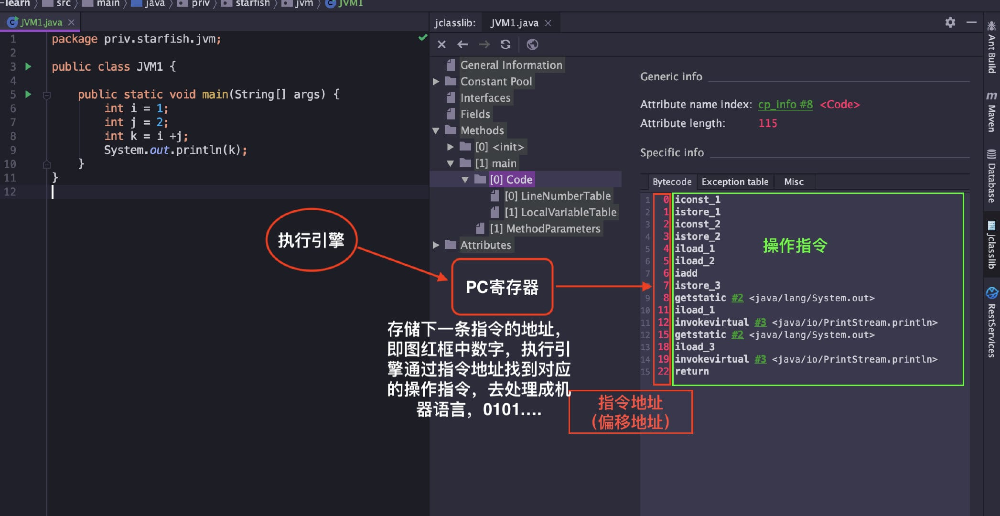 |
| :----------------------------------------------------------: |


###### 为什么使用PC寄存器记录当前线程的执行地址呢？

因为CPU需要不停的切换各个线程，这时候切换回来以后，就得知道接着从哪开始继续执行。JVM的字节码解释器就需要通过改变PC寄存器的值来明确下一条应该执行什么样的字节码指令。


###### PC寄存器为什么会被设定为线程私有的？

多线程在一个特定的时间段内只会执行其中某一个线程方法，CPU会不停的做任务切换，这样必然会导致经常中断或恢复。为了能够准确的记录各个线程正在执行的当前字节码指令地址，所以为每个线程都分配了一个PC寄存器，每个线程都独立计算，不会互相影响。


###### 作用场景

- 解释器执行字节码时，通过计数器定位下一条要执行的指令
- 多线程切换时，保存线程执行上下文（确保线程恢复后能继续执行）
- 执行 Native 方法时，计数器值为`undefined`（Native 方法由 C/C++ 实现，不受 JVM 控制）


## 虚拟机栈（VM Stack）

Java 虚拟机栈(Java Virtual Machine Stacks)，早期也叫Java栈。每个线程在创建的时候都会创建一个虚拟机栈，其内部保存一个个的栈帧(Stack Frame），对应着一次次 Java 方法调用。

- **特点**：线程私有，生命周期与线程相同。
- **作用**：描述的是 **Java 方法执行的内存模型**。每个方法在执行的同时都会创建一个 **栈帧**，用于存储**局部变量表**、**操作数栈**、**动态链接**、**方法出口**等信息。每一个方法从调用直至执行完成的过程，就对应着一个栈帧在虚拟机栈中从入栈到出栈的过程。

* **默认深度**：`-Xss1m` ≈ 1 MB；**递归死循环** → `StackOverflowError`
* **调优**：
    - 高并发：`-Xss256k` 可把 1 k 线程内存从 1 GB 降到 256 MB
    - 深度递归：`-Xss4m` 防止 Excel 导出/解析爆栈

* **异常**：如果线程请求的栈深度大于虚拟机所允许的深度，将抛出 `StackOverflowError` 异常；如果虚拟机栈可以动态扩展，如果扩展时无法申请到足够内存，就会抛出 `OutOfMemoryError` 异常。

* **特点**

    - 栈是一种快速有效的分配存储方式，访问速度仅次于程序计数器。

    - JVM 直接对虚拟机栈的操作只有两个：每个方法执行，伴随着**入栈**（进栈/压栈），方法执行结束**出栈。**

    - **栈不存在垃圾回收问题。**


> * 每个方法调用 = 一个栈帧入栈；方法返回 = 栈帧出栈。
> * 栈深度过大会抛出：
>     - `StackOverflowError`（栈溢出）
>     - `OutOfMemoryError`（无法创建新线程）


**内存大小**

可通过 JVM 参数配置（`-Xss`），默认值因 JVM 版本、系统而异（如 JDK8 默认 1M）。


**栈中可能出现的异常**

Java 虚拟机规范允许 **Java虚拟机栈的大小是动态的或者是固定不变的**。可以通过参数`-Xss`来设置线程的最大栈空间，栈的大小直接决定了函数调用的最大可达深度。

- `StackOverflowError`：线程请求的栈深度超过虚拟机栈的最大深度（如无限递归调用）-采用固定大小的 Java 虚拟机栈。
- `OutOfMemoryError`：虚拟机栈可动态扩展（默认开启），当扩展时无法申请到足够内存（如创建过多线程导致栈内存总和超过物理内存）-可以动态扩展的 Java 虚拟机栈。


**栈的存储单位**

一个栈中可以有多个栈帧，栈帧是栈的元素，栈帧随着方法的调用而创建，随着方法的结束而消亡。栈帧存储了方法的`局部变量表`、`操作数栈`、`动态连接`和`方法返回地址`等信息。在活动线程中，只有位于栈顶的栈帧才是有效的，称为当前栈帧，与这个栈帧相关联的方法称为当前方法。

帧中需要多大的局部变量表，多深的操作数栈都已经完全确定了。因此一个栈帧需要分配多少内存，不会受到程序运行期变量数据的影响，而仅仅取决于具体的虚拟机实现。

- 每个线程都有自己的栈，栈中的数据都是以**栈帧（Stack Frame）的格式存在**。
- 在这个线程上正在执行的每个方法都各自有对应的一个栈帧。
- 栈帧是一个内存区块，是一个数据集，维系着方法执行过程中的各种数据信息。


### 运行原理

- JVM 直接对 Java 栈的操作只有两个，对栈帧的**压栈**和**出栈**，遵循“先进后出/后进先出”原则。
- 在一条活动线程中，一个时间点上，只会有一个活动的栈帧。即只有当前正在执行的方法的栈帧（**栈顶栈帧**）是有效的，这个栈帧被称为**当前栈帧**（Current Frame），与当前栈帧对应的方法就是**当前方法**（Current Method），定义这个方法的类就是**当前类**（Current Class）。
- 执行引擎运行的所有字节码指令只针对当前栈帧进行操作。
- 如果在该方法中调用了其他方法，对应的新的栈帧会被创建出来，放在栈的顶端，称为新的当前栈帧。
- 不同线程中所包含的栈帧是不允许存在相互引用的，即不可能在一个栈帧中引用另外一个线程的栈帧。
- 如果当前方法调用了其他方法，方法返回之际，当前栈帧会传回此方法的执行结果给前一个栈帧，接着，虚拟机会丢弃当前栈帧，使得前一个栈帧重新成为当前栈帧。
- Java 方法有两种返回函数的方式，**一种是正常的函数返回，使用 return 指令，另一种是抛出异常，不管用哪种方式，都会导致栈帧被弹出**。

IDEA 在 debug 时候，可以在 debug 窗口看到 Frames 中各种方法的压栈和出栈情况

| 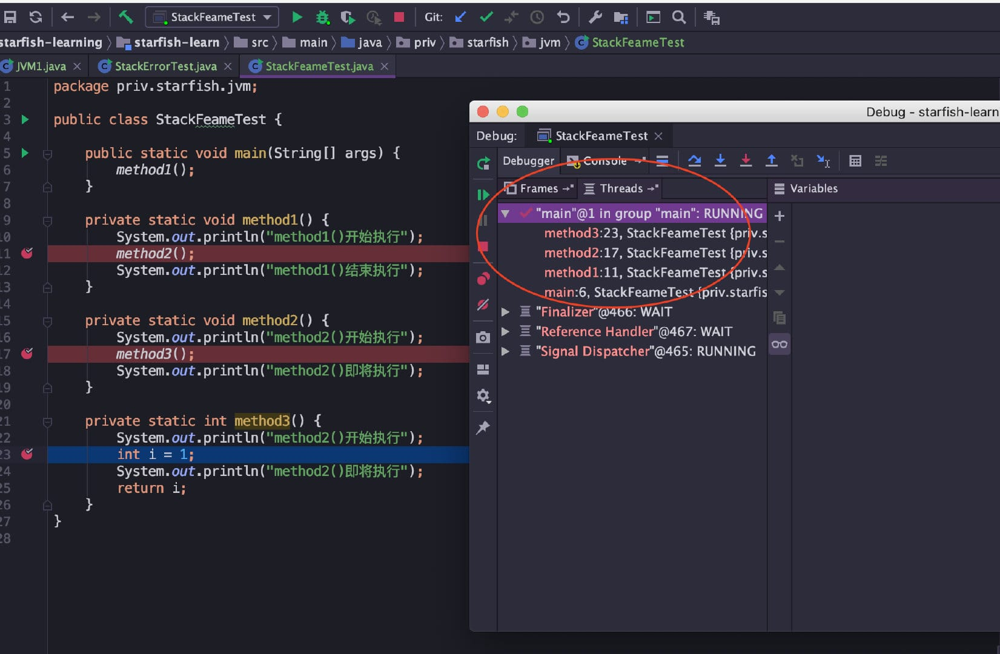 |
| :----------------------------------------------------------: |


### 栈帧结构

- 局部变量表（Local Variables）
- 操作数栈（Operand Stack）(或称为表达式栈)
- 动态链接（Dynamic Linking）：指向运行时常量池的方法引用
- 方法返回地址（Return Address）：方法正常退出或异常退出的地址
- 一些附加信息

| 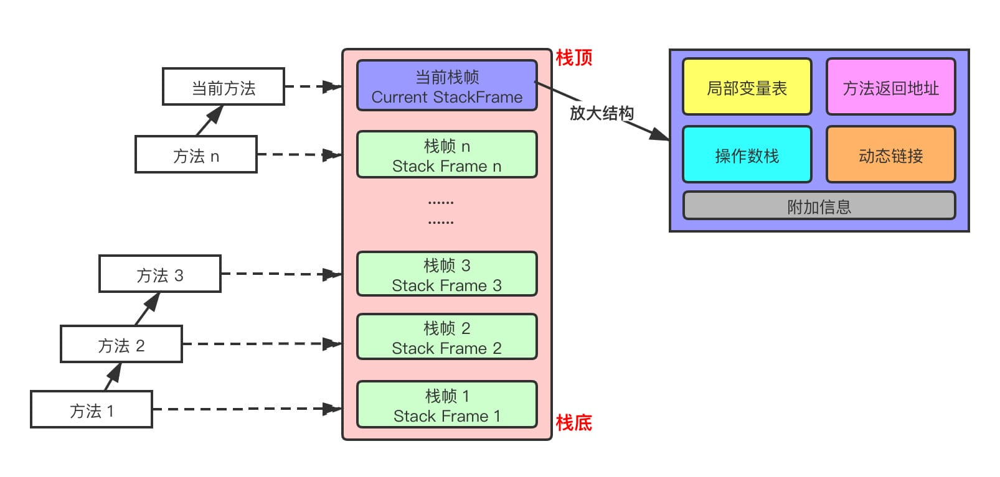 |
| :----------------------------------------------------------: |


#### 1 局部变量表（Local Variables）

存储方法的局部变量（基本数据类型、对象引用地址、returnAddress 类型），容量在编译时确定（通过字节码指令`max_locals`指定）。 局部变量表的容量以变量槽（Variable Slot）为最小单位。

- 局部变量表也被称为局部变量数组或者本地变量表。

- 存放了编译期可知的各种**基本数据类型**（`boolean`, `byte`, `char`, `short`, `int`, `float`, `long`, `double`）、**对象引用**（`reference` 类型，它不等同于对象本身，可能是一个指向对象起始地址的引用指针，也可能是指向一个代表对象的句柄或其他与此对象相关的位置）和 **returnAddress** 类型（指向了一条字节码指令的地址）。

- 由于局部变量表是建立在线程的栈上，是线程的私有数据，因此**不存在数据安全问题**。

- **局部变量表所需要的容量大小是编译期确定下来的**，并保存在方法的 Code 属性的 `maximum local variables` 数据项中。在方法运行期间是不会改变局部变量表的大小的。

- 方法嵌套调用的次数由栈的大小决定。一般来说，**栈越大，方法嵌套调用次数越多**。对一个函数而言，它的参数和局部变量越多，使得局部变量表膨胀，它的栈帧就越大，以满足方法调用所需传递的信息增大的需求。进而函数调用就会占用更多的栈空间，导致其嵌套调用次数就会减少。

- **局部变量表中的变量只在当前方法调用中有效**。在方法执行时，虚拟机通过使用局部变量表完成参数值到参数变量列表的传递过程。当方法调用结束后，随着方法栈帧的销毁，局部变量表也会随之销毁。

- 参数值的存放总是在局部变量数组的 index0 开始，到数组长度 -1 的索引结束。

- 以**变量槽**为单位。64位的 `long` 和 `double` 占两个槽，其余占一个。

    ​    


**槽 Slot**

- 局部变量表最基本的存储单元是 Slot（变量槽）。
- 在局部变量表中，32 位以内的类型只占用一个 Slot(包括returnAddress类型)，64 位的类型（long和double）占用两个连续的 Slot
    - byte、short、char 在存储前被转换为int，boolean也被转换为int，0 表示 false，非 0 表示 true
    - long 和 double 则占据两个 Slot
- JVM 会为局部变量表中的每一个 Slot 都分配一个访问索引，通过这个索引即可成功访问到局部变量表中指定的局部变量值，索引值的范围从 0 开始到局部变量表最大的 Slot 数量。
- 当一个实例方法被调用的时候，它的方法参数和方法体内部定义的局部变量将会**按照顺序被复制**到局部变量表中的每一个 Slot 上。
- **如果需要访问局部变量表中一个 64bit 的局部变量值时，只需要使用前一个索引即可**。（比如：访问 long 或 double 类型变量，不允许采用任何方式单独访问其中的某一个 Slot）。
- 如果当前帧是由构造方法或实例方法创建的，那么该对象引用 this 将会存放在 index 为 0 的 Slot 处，其余的参数按照参数表顺序继续排列（这里就引出一个问题：静态方法中为什么不可以引用 this，就是因为this 变量不存在于当前方法的局部变量表中）。
- **栈帧中的局部变量表中的槽位是可以重用的**，如果一个局部变量过了其作用域，那么在其作用域之后申明的新的局部变量就很有可能会复用过期局部变量的槽位，从而**达到节省资源的目的**。（下图中，this、a、b、c 理论上应该有 4 个变量，c 复用了 b 的槽）。

| 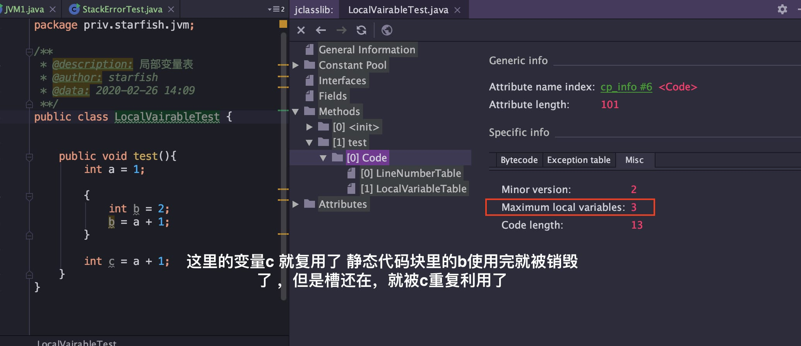 |
| :----------------------------------------------------------: |

- 在栈帧中，与性能调优关系最为密切的就是局部变量表。在方法执行时，虚拟机使用局部变量表完成方法的传递。
- **局部变量表中的变量也是重要的垃圾回收根节点，只要被局部变量表中直接或间接引用的对象都不会被回收**。


#### 2 操作数栈（Operand Stack）

方法执行时的临时数据存储区，用于字节码指令的运算（如`iadd`指令会从操作数栈弹出两个 int 值，相加后压回栈）。

- **操作数栈，在方法执行过程中，根据字节码指令，往操作数栈中写入数据或提取数据，即入栈（push）、出栈（pop）**。**主要用于保存计算过程的中间结果，同时作为计算过程中变量临时的存储空间**。
- 每一个操作数栈都会拥有一个明确的栈深度用于存储数值，其所需的最大深度在编译期就定义好了，保存在方法的 Code 属性的 `max_stack` 数据项中。
- 栈中的任何一个元素都可以是任意的 Java 数据类型。
    - 32bit 的类型占用一个栈单位深度
    - 64bit 的类型占用两个栈单位深度
- 操作数栈并非采用访问索引的方式来进行数据访问的，而是只能通过标准的入栈和出栈操作来完成一次数据访问。
- **如果被调用的方法带有返回值的话，其返回值将会被压入当前栈帧的操作数栈中**，并更新 PC 寄存器中下一条需要执行的字节码指令。
- **Java虚拟机的解释引擎是基于栈的执行引擎**，其中的栈指的就是操作数栈。


**栈顶缓存（Top-of-stack-Cashing）**

HotSpot 的执行引擎采用的并非是基于寄存器的架构，但这并不代表 HotSpot VM 的实现并没有间接利用到寄存器资源。寄存器是物理 CPU 中的组成部分之一，它同时也是 CPU 中非常重要的高速存储资源。一般来说，寄存器的读/写速度非常迅速，甚至可以比内存的读/写速度快上几十倍不止，不过寄存器资源却非常有限，不同平台下的CPU 寄存器数量是不同和不规律的。寄存器主要用于缓存本地机器指令、数值和下一条需要被执行的指令地址等数据。

基于栈式架构的虚拟机所使用的零地址指令更加紧凑，但完成一项操作的时候必然需要使用更多的入栈和出栈指令，这同时也就意味着将需要更多的指令分派（instruction dispatch）次数和内存读/写次数。由于操作数是存储在内存中的，因此频繁的执行内存读/写操作必然会影响执行速度。为了解决这个问题，HotSpot JVM 设计者们提出了栈顶缓存技术，**将栈顶元素全部缓存在物理 CPU 的寄存器中，以此降低对内存的读/写次数，提升执行引擎的执行效率**


#### 3 动态链接（Dynamic Linking）

将栈帧中的 “符号引用”（如方法名、字段名）转换为 “直接引用”（内存地址），支持方法调用。

- **每一个栈帧内部都包含一个指向运行时常量池中该栈帧所属方法的引用**。包含这个引用的目的就是为了支持当前方法的代码能够实现动态链接(Dynamic Linking)。
- 在 Java 源文件被编译到字节码文件中时，所有的变量和方法引用都作为**符号引用**（Symbolic Reference）保存在 Class 文件的常量池中。比如：描述一个方法调用了另外的其他方法时，就是通过常量池中指向方法的符号引用来表示的，那么**动态链接的作用就是为了将这些符号引用转换为调用方法的直接引用**。

| 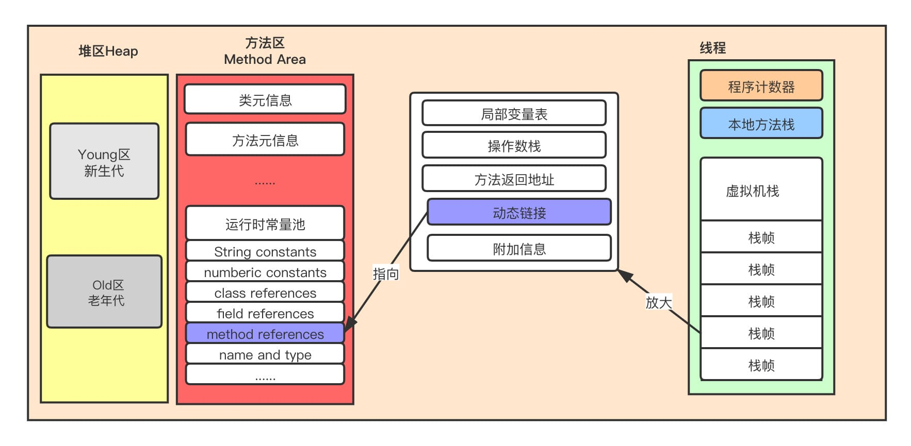 |
| :----------------------------------------------------------: |


###### 动态链接和静态链接

在 JVM 中，将符号引用转换为调用方法的直接引用与方法的绑定机制有关。

- **静态链接**：当一个字节码文件被装载进 JVM 内部时，如果被调用的**目标方法在编译期可知**，且运行期保持不变时。这种情况下将调用方法的符号引用转换为直接引用的过程称之为静态链接。
- **动态链接**：如果被调用的方法在编译期无法被确定下来，也就是说，只能在程序运行期将调用方法的符号引用转换为直接引用，由于这种引用转换过程具备动态性，因此也就被称之为动态链接。

对应的方法的绑定机制为：早期绑定（Early Binding）和晚期绑定（Late Binding）。**绑定是一个字段、方法或者类在符号引用被替换为直接引用的过程，这仅仅发生一次**。

- 早期绑定：**早期绑定就是指被调用的目标方法如果在编译期可知，且运行期保持不变时**，即可将这个方法与所属的类型进行绑定，这样一来，由于明确了被调用的目标方法究竟是哪一个，因此也就可以使用静态链接的方式将符号引用转换为直接引用。
- 晚期绑定：如果被调用的方法在编译器无法被确定下来，只能够在程序运行期根据实际的类型绑定相关的方法，这种绑定方式就被称为晚期绑定。


###### 虚方法和非虚方法

- 如果方法在编译器就确定了具体的调用版本，这个版本在运行时是不可变的。这样的方法称为非虚方法，比如静态方法、私有方法、final 方法、实例构造器、父类方法都是非虚方法。
- 其他方法称为虚方法。


######虚方法表

在面向对象编程中，会频繁的使用到动态分派，如果每次动态分派都要重新在类的方法元数据中搜索合适的目标有可能会影响到执行效率。为了提高性能，JVM 采用在类的方法区建立一个虚方法表（virtual method table），使用索引表来代替查找。非虚方法不会出现在表中。

* 每个类中都有一个虚方法表，表中存放着各个方法的实际入口。
* 虚方法表会在类加载的连接阶段被创建并开始初始化，类的变量初始值准备完成之后，JVM 会把该类的方法表也初始化完毕。


#### 4 方法返回地址址（Return Address）

存储方法执行完成后要返回的地址（如调用方的下一条指令地址），用于方法执行完后恢复调用方的执行流程。


**一个方法的结束，有两种方式**

- 正常返回
- 异常退出

无论通过哪种方式退出，在方法退出后都返回到该方法被调用的位置。方法正常退出时，调用者的 PC 计数器的值作为返回地址，即调用该方法的指令的下一条指令的地址。而通过异常退出的，返回地址是要通过异常表来确定的，栈帧中一般不会保存这部分信息。

> 本质上，**方法的退出就是当前栈帧出栈的过程**。此时，需要恢复上层方法的局部变量表、操作数栈、将返回值压入调用者栈帧的操作数栈、设置PC寄存器值等，让调用者方法继续执行下去。正常完成出口和异常完成出口的区别在于：**通过异常完成出口退出的不会给他的上层调用者产生任何的返回值**。


#### 5 附加信息

栈帧中还允许携带与 Java 虚拟机实现相关的一些附加信息。例如，对程序调试提供支持的信息，但这些信息取决于具体的虚拟机实现。


### 方法调用

方法调用并不等同于方法的执行，方法调用阶段的唯一任务就是确定被调用方法的版本


**解析调用**

 在类加载的类解析阶段就已经调用方法的版本即在编译期已经确定了调用的方法，这种调用方式称之为解析调用。在Java中被final、private、static修饰的方法以及构造方法都是属于这种类型，在编译期间就可确定，对应编译出的字节码指令为`invokestatic【调用静态方法】`、`invokespecial:调用非静态私有方法和final方法、构造方法(包括super)`


**静态分派调用**

```java
public class StaticDispatch {
  static class Parent{
  }
  static class Child extends Parent{
  }
  public static void sayHello(Parent p){
    System.out.println("hello,parent");
  }
  public static void sayHello(Child c) {
    System.out.println("hello,child");
  }

  public static void main(String[] args) {
    //      静态类型      实际类型
    Parent  parent = new Parent();
    Parent  child  = new Child();
    sayHello(parent);    //hello,parent
    sayHello(child);     //hello,parent
  }
}
```

 把“Parent”称为变量的静态类型，后面的“Child”称为变量的实际类型，静态类型和实际类型在程序中都可以发生一些变化，区别是静态类型的变化仅仅在使用时发生，变量本身的静态类型不会被改变，并且最终的`静态类型在编译阶段可知`依旧是`invokespecial`调用。而`实际类型变化的结果在运行期才确定`，编译器在编译期并不知道一个对象的实际类型是什么。

 静态分派的典型应用是方法重载。**编译器在重载时是通过参数的静态类型而不是实际类型作为判定的依据**。并且静态类型在编译期解析阶段可知，因此，Javac编译器会根据参数的静态类型决定使用哪个重载版本。


**动态分派调用**

```java
public class DynamicDispatch {
  static class Parent{
    public  void sayHello(){
      System.out.println("hello,i am parent");
    }
  }
  static class Child extends Parent{
    @Override
    public void sayHello(){
      System.out.println("hello,i am child");
    }
  }
  public static void main(String[] args) {
    Parent  parent = new Parent();
    Parent  child  = new Child();
    parent.sayHello();  // hello,i am parent
    child.sayHello();   // hello,i am child
  }
}
```

 因为子类`重写`父类的方法，在运行阶段才可确定类型在方法调用时候jvm其实是使用了`invokevirtual`指令。java中采用`oop-klass`二分模型表示一个对象。`klass`保存着类的数据，在其中保存着方法表，方法表中保存着从父类继承下来，自己定义的所有方法，如果子类重写父类方法，那么在这个方法表中相同位置上的父类方法则会被覆盖。也就意味着从子类实例来说是无法找到父类该方法的。


### 动态类型语言

静态类型语言：在非运行阶段，变量的类型是可以确定的，也就是变量是有类型的。

动态类型语言：在非运行阶段，变量的类型是无法确定的，也就是变量是没类型的。但是值是有类型的，也就是运行期间可以确定变量的值类型。

JDK7新增对动态语言调用的支持`invokedynamic`，Java里没有函数指针无法在运行时动态调用方法。

```java
public class MethodHandleTest {
  static class ClassA {
    public void println(String s) {
      System.out.println(s);
    }
  }
  
  public static void main(String[] args) throws Throwable {
    // 无论obj最终是哪个实现类，下面这句都能正确调用到println方法。 
    Object obj = System.currentTimeMillis() % 2 == 0 ? System.out : new ClassA();
        
    /**
      * MethodType：代表“一个方法”
      * 第一个参数 - 方法的返回值
      * 第一个参数 - 方法的具体参数
      */
    MethodType mt = MethodType.methodType(void.class, String.class);
      
    /**
      * lookup()方法来自于MethodHandles.lookup
      * 作用是在指定类中查找符合给定的方法名称、方法类型，并且符合调用权限的方法句柄。 
      * bindTo()用于绑定本地变量表的第一个元素this
      */
    MethodHandle methodHandle = lookup().findVirtual(obj.getClass(), "println", mt).bindTo(obj);
        
    // 调用方法
    methodHandle.invokeExact("Hello");
  }
}
```


## 本地方法栈（Native Method Stack）

本地方法栈与虚拟机栈功能类似，区别在于：**虚拟机栈存储 Java 方法的栈帧，本地方法栈存储 Native 方法的栈帧**（Native 方法是由 C/C++ 实现、通过 JNI 调用的方法，如`System.currentTimeMillis()`）。

* **线程私有**：与虚拟机栈一致，每个线程独立拥有。
* **数据存储**：存储本地方法执行的中间数据
* **可能的异常**：与虚拟机栈相同，抛出`StackOverflowError`或`OutOfMemoryError`。

> **栈是运行时的单位，而堆是存储的单位**。
>
> 栈解决程序的运行问题，即程序如何执行，或者说如何处理数据。堆解决的是数据存储的问题，即数据怎么放、放在哪。


**为什么要使用本地方法（Native Method）?**

1. 访问操作系统底层能力
2. 提升性能（热点代码 + 高性能库）
3. 与硬件或设备交互
4. 使用已有的成熟库（复用 C/C++ 生态）
5. 绕过 JVM 安全/限制进行特殊操作
6. JVM 自身的实现需要本地方法

| 原因             | 说明                             |
| ---------------- | -------------------------------- |
| 访问操作系统能力 | 如文件权限、线程、socket、信号   |
| 性能优化         | 调用 C/C++ 高性能代码            |
| 使用硬件         | GPU、摄像头、串口等              |
| 复用成熟库       | FFmpeg、OpenSSL、RocksDB         |
| JVM 自身依赖     | GC、线程、类加载等               |
| 特殊能力         | 直接内存访问、绕过 Java 安全模型 |


## 直接内存（Direct Memory）

非JVM规范区域

- **作用**：通过 `java.nio.ByteBuffer.allocateDirect()` 分配的**堆外内存**

- 特点：

    - 不受 `-Xmx` 限制；
    - 由操作系统管理；
    - 通过 `Unsafe` 或 JNI 分配；
    - **GC 不会回收**，但 `DirectByteBuffer` 对象被回收时会释放内存。

- **特性**：并非《Java虚拟机规范》中定义的内存区域，但被频繁使用，也可能导致 OOM。

- **作用**：在 JDK 1.4 中新加入了 NIO 类，引入了一种基于**通道**与**缓冲区**的 I/O 方式，它可以使用 Native 函数库直接分配堆外内存，然后通过一个存储在 Java 堆中的 `DirectByteBuffer` 对象作为这块内存的引用进行操作。这样能在一些场景中显著提高性能，因为它避免了在 Java 堆和 Native 堆之间来回复制数据。

- **异常**：虽然不受 JVM 堆大小的限制，但既然是本机内存，显然还是会受到本机总内存的大小及处理器寻址空间的限制。配置 JVM 参数时，如果忽略了直接内存，使得各个内存区域总和大于物理内存限制，动态扩展时就会出现 **`OutOfMemoryError`**。

- **分配方式**：

    - `ByteBuffer.allocateDirect()` → `sun.misc.Unsafe.allocateMemory()`
    - `FileChannel.map()` → 内存映射文件

- **默认上限**：

    - 64-bit JVM：**与堆大小无关**，默认 = **0**（无限）
    - 可显式限制：`-XX:MaxDirectMemorySize=1g`

- **OOM 报错**：

    ```bash
    java.lang.OutOfMemoryError: Direct buffer memory
    ```

- **调优**：

    - Netty 场景：`-XX:MaxDirectMemorySize=2g -Dio.netty.maxDirectMemory=0`（0 表示不额外检查）
    - 禁止手动 `System.gc()`：`-XX:+DisableExplicitGC`（但记得定期 `allocator.directMemory()` 监控）

**异常**

- **`OutOfMemoryError: Direct buffer memory`**（当 `-XX:MaxDirectMemorySize` 超限时）。

> 💡 **Netty、RocketMQ 等高性能框架大量使用直接内存**，减少堆内拷贝。 


## 实践总结

### 知识拓展

#### Code Cache（代码缓存）

- **作用**：存放 **C1/C2 编译后的机器码** + 解释器入口
- **默认大小**：
    - JDK17：240 MB（64-bit）
    - 分层编译开启后，分为 **Non-profiled / Profiled / Non-method** 三区
- **满报警**：CodeCache is full. Compiler has been disabled.⇒ 立即降速、回退解释执行
- **调优**：

```bash
-XX:ReservedCodeCacheSize=512m
-XX:+UseCodeCacheFlushing   // 自动清理过期代码
```

* **监控**：

```bash
jcmd <pid> Compiler.CodeCache_stats
```


### 内存溢出场景与排查

###### 堆内存溢出（Heap OOM）

- **原因**：内存泄漏、堆太小、大对象；
- **排查**：

```bash
# 生成堆转储
jmap -dump:format=b,file=heap.hprof <pid>

# 分析工具：MAT、VisualVM
```

###### 元空间溢出（Metaspace OOM）

- **原因**：动态生成大量类（如 CGLib、Spring AOP）、未设 `MaxMetaspaceSize`；
- **排查**：

```bash
jstat -gcmetacapacity <pid>  # 查看元空间使用
```

###### 栈溢出（StackOverflowError）

- **原因**：递归太深、栈太小；
- **解决**：

```bash
-Xss256k  # 增大栈大小（但会减少线程数）
```


###### 内存调优建议

1. **堆大小**：`-Xms = -Xmx`（避免动态扩展抖动）；
2. **新生代比例**：`-XX:NewRatio=2`（老年代:新生代=2:1）；
3. **元空间限制**：`-XX:MaxMetaspaceSize=512m`（防止单机耗尽内存）；
4. 监控工具：
    - `jstat -gc <pid>`：实时 GC 状态；
    - `jconsole` / `VisualVM`：图形化监控；
    - `Arthas`：线上诊断。


### 关键要点

JVM**内存区域总结**

| 关键点              | 说明                                 |
| ------------------- | ------------------------------------ |
| **堆 = 对象仓库**   | 几乎所有对象在此分配，GC 主战场      |
| **方法区 = 类仓库** | JDK 8+ 为 Metaspace（本地内存）      |
| **栈 = 方法执行**   | 每个线程私有，存储局部变量和调用信息 |
| **PC = 指令指针**   | 记录当前执行位置，唯一不 OOM 区域    |
| **直接内存 = 堆外** | NIO 使用，不受`-Xmx`限制             |

> 🧠 **一句话理解 JVM 内存**：
> **“堆存对象，栈存方法，方法区存类，PC 指指令，直接内存走堆外。”** 


**关键理解点**

1. **线程私有与共享**：前三个区域（PC、VM Stack、Native Stack）是线程私有的，随线程生灭。后两个（Heap、Method Area）是共享的，是内存管理和垃圾回收的重点。
2. **`StackOverflowError`** 通常发生在**栈深度过大**时（如无限递归）。
3. **`OutOfMemoryError`** 通常发生在**内存真正耗尽**时（如堆内存不足、创建过多线程等）。
4. **元空间**的使用使得方法区不再容易 OOM，但如果加载的类过多（如动态生成类），依然可能耗尽本地内存。


###### 堆 vs 方法区（元空间）

| 维度       | 堆                        | 方法区（元空间）             |
| ---------- | ------------------------- | ---------------------------- |
| 存储对象   | 对象实例、数组            | 类元数据、静态变量、JIT 代码 |
| 线程可见性 | 共享                      | 共享                         |
| GC 目标    | 主要目标（Minor/Full GC） | 次要目标（Full GC 时回收）   |
| 内存来源   | JVM 堆内存                | 本地内存（JDK8+）            |
| 常见 OOM   | Java heap space           | Metaspace（JDK8+）           |


###### 虚拟机栈 vs 堆

| 维度       | 虚拟机栈                 | 堆                     |
| ---------- | ------------------------ | ---------------------- |
| 存储对象   | 栈帧（局部变量、操作数） | 对象实例、数组         |
| 线程可见性 | 私有                     | 共享                   |
| 生命周期   | 线程级（线程结束销毁）   | 应用级（JVM 启动创建） |
| 内存分配   | 连续内存（栈结构）       | 不连续内存（动态分配） |
| 异常类型   | StackOverflowError/OOM   | OOM                    |


###### 常见OOM异常与排查方向

| OOM 类型                                             | 对应内存区域          | 排查方向                                                     |
| ---------------------------------------------------- | --------------------- | ------------------------------------------------------------ |
| Java heap space                                      | 堆                    | 1. 检查是否创建大量对象未释放（如内存泄漏）；2. 调整`-Xms`/`-Xmx`增大堆内存；3. 分析堆快照（MAT 工具）定位大对象。 |
| Metaspace（JDK8+）                                   | 元空间                | 1. 检查是否动态生成大量类（CGLib、反射、Spring AOP）；2. 调整`-XX:MaxMetaspaceSize`；3. 排查类加载泄漏。 |
| PermGen space（JDK7-）                               | 永久代                | 1. 增大`-XX:MaxPermSize`；2. 减少静态变量、常量的使用；3. 避免动态生成大量类。 |
| StackOverflowError                                   | 虚拟机栈 / 本地方法栈 | 1. 检查是否存在无限递归；2. 调整`-Xss`增大栈深度（需谨慎，栈过大会导致线程数减少）。 |
| OutOfMemoryError: unable to create new native thread | 虚拟机栈 + 本地内存   | 1. 检查是否创建过多线程（如线程池无上限）；2. 减少线程数或增大堆内存（释放线程栈内存）。 |


###### 垃圾回收主要作用于

- **堆（Heap）**：清理无引用的对象；
- **方法区（Method Area）**：清理无用类信息（JIT 元空间回收）。

📘 常见 GC 触发点：

- Eden 满 → Minor GC；
- Old 满 → Major/Full GC；
- 元空间满 → Class 卸载或 OOM。


###### JVM 内存分配策略

1️⃣ **对象优先在 Eden 区分配**
 2️⃣ **Eden 不足时触发 Minor GC**
 3️⃣ **长期存活对象进入老年代**
 4️⃣ **大对象（如大数组）直接进入老年代**
 5️⃣ **Full GC 时清理整个堆和方法区**


###### 常见内存异常与排查

| 异常                                           | 原因               | 解决                        |
| ---------------------------------------------- | ------------------ | --------------------------- |
| `OutOfMemoryError: Java heap space`            | 堆太小             | 调大 `-Xmx`                 |
| `OutOfMemoryError: Metaspace`                  | 元空间满           | 调大 `-XX:MaxMetaspaceSize` |
| `StackOverflowError`                           | 栈深度过大（递归） | 优化递归或调大 `-Xss`       |
| `OutOfMemoryError: GC overhead limit exceeded` | GC 回收过频        | 优化内存分配/GC参数         |


###### 虚拟机栈与本地方法栈

| 维度     | 虚拟机栈            | 本地方法栈                  |
| -------- | ------------------- | --------------------------- |
| 存储对象 | Java 方法的栈帧     | Native 方法的栈帧           |
| 调用语言 | Java 语言编写的方法 | C/C++ 等原生语言编写的方法  |
| 规范要求 | 强制要求实现        | 无强制要求，由 JVM 灵活实现 |


###### 对象在内存中的旅行（HotSpot 64-bit 压缩指针）

| 区域          | 长度          | 说明                            |
| ------------- | ------------- | ------------------------------- |
| Mark Word     | 8 B           | 哈希、锁、GC 分代年龄、偏向锁位 |
| Klass Pointer | 4 B（+压缩）  | 指向 `instanceKlass`            |
| 数组长度      | 4 B（仅数组） | 最大 2³¹                        |
| 实例数据      | 不定          | 字段按宽度对齐                  |
| 对齐填充      | 0~8 B         | 对象大小必须是 8 B 倍数         |

> 开启 `-XX:+UseCompressedOops` 时，**对象引用** 压缩到 32 位，**节省 10~30 % 堆内存**。


###### 参数速查表

| 场景     | 参数示例                         | 说明                |
| -------- | -------------------------------- | ------------------- |
| 固定堆   | `-Xms8g -Xmx8g`                  | 避免动态扩容抖动    |
| 高并发   | `-Xss256k`                       | 1 k 线程节省 750 MB |
| 大元空间 | `-XX:MaxMetaspaceSize=1g`        | 防动态代理 OOM      |
| 直接内存 | `-XX:MaxDirectMemorySize=2g`     | Netty/MQ 必配       |
| 代码缓存 | `-XX:ReservedCodeCacheSize=512m` | 防编译被关闭        |
| 压缩指针 | `-XX:+UseCompressedOops`         | 堆 ≤32 GB 默认开启  |


###### 定位口诀（OOM 120 秒排查）

1. **看日志**：报错区域是 `Java heap` / `Metaspace` / `Direct buffer`？

2. **jcmd 先手**

    ```bash
    jcmd <pid> VM.native_memory | grep -E "(Heap|Metaspace|Direct)"
    ```

3. **dump 分析**：

    ```bash
    jmap -dump:live,format=b,file=heap.hprof <pid>
    ```

    MAT 打开 → Dominator Tree → 找最大对象 → GC Roots 路径

4. **如果是 Direct**：

    ```bash
    jmap -histo:live <pid> | grep -i direct
    ```

    看 `java.nio.DirectByteBuffer` 数量 & Cleaner 是否堆积


###### VM 内存结构 = **3 私有 + 4 共享 + 1 直接**

- 私有随线程，**无 GC**
- 共享归 **GC & Metaspace**，**OOM 高发地**
- 直接内存 **最隐蔽**，**Cleaner 延迟回收** 常坑 Netty


# 垃圾回收

## 问题思考

###### 生产环境中，JVM 频繁Full GC导致服务卡顿，如何解决？

1. 查看 GC 日志，确认 Full GC 原因（老年代满？元空间满？）。
2. 若老年代满：分析是否有大对象直接进入老年代（如`-XX:PretenureSizeThreshold`配置），或对象晋升过快（年龄阈值过低）。
3. 若元空间满：检查是否有类加载泄漏（如动态生成大量类），增大`MaxMetaspaceSize`。
4. 优化：调整堆大小、优化对象生命周期（减少长生命周期对象）、更换 GC 回收器（如 G1 替代 CMS）。


###### 为什么`String.intern()`可能导致 OOM？

- `intern()`会将字符串存入常量池（JDK7 + 常量池移至堆），若大量调用`intern()`存储长字符串，会导致常量池所在的堆 / 元空间内存耗尽，触发 OOM。


###### 哪些对象会被GC 回收？

主流 JVM 使用 **可达性分析算法**（非引用计数法）

- 从 **GC Roots** 出发，不可达的对象即为垃圾。
- GC Roots 包括：
    - 虚拟机栈中局部变量引用的对象；
    - 方法区中静态变量引用的对象；
    - 方法区中常量引用的对象；
    - 本地方法栈中 JNI 引用的对象。


###### 如何判断一个对象是否可以被回收？

- **引用计数法**（Java 未采用，无法解决循环引用）。
- **可达性分析算法**（Java 主要采用）。从 **GC Roots** 对象开始搜索，不能被引用链到达的对象即为可回收。


###### Java 的四种引用类型（强、软、弱、虚）有什么区别？在 GC 时表现如何？

- **强引用**：最常见的引用，只要强引用存在，对象就绝不会被回收。
- **软引用**：内存不足时才会被回收，常用于缓存。
- **弱引用**：下一次 GC 发生时就会被回收。
- **虚引用**：无法通过虚引用获取对象，唯一目的是在对象被回收时收到一个系统通知。


###### 常见的垃圾回收算法有哪些？

- **标记-清除（Mark-Sweep**：产生碎片。
- **标记-整理（Mark-Compact）**：没有碎片，但移动对象有开销（用于老年代）。
- **复制算法（Copying）**：没有碎片，但内存利用率低（用于新生代）。
- **分代收集**：商业虚拟机的实际采用方案，根据对象存活周期不同使用不同算法。


###### 什么是内存泄漏？常见场景有哪些？

- 内存泄漏：对象不再使用但未被 GC 回收，导致内存占用持续增长，最终 OOM。
- 场景：
    - 静态集合类（如`static List`存储大量无用对象）。
    - 未关闭的资源（如`InputStream`、数据库连接）。
    - 匿名内部类持有外部类引用（如线程生命周期长于外部类）。


###### Minor GC / Major GC / Full GC 区别？

| 类型     | 作用对象      | 触发条件                             |
| -------- | ------------- | ------------------------------------ |
| Minor GC | 年轻代        | Eden 区满                            |
| Major GC | 老年代        | 较少使用                             |
| Full GC  | 整个堆+方法区 | 显式调用 / 老年代不足 / Metaspace 满 |


###### Minor GC 和Full GC有什么区别？

| 对比项       | Minor GC            | Full GC                               |
| ------------ | ------------------- | ------------------------------------- |
| **回收区域** | 新生代（Young Gen） | 老年代 + 新生代 + 方法区              |
| **触发条件** | Eden 区满           | 老年代满、System.gc()、Metaspace 满等 |
| **执行频率** | 高                  | 低                                    |
| **停顿时间** | 短（几十 ms）       | 长（几百 ms ~ 秒级）                  |
| **别名**     | Young GC            | Major GC（不严谨，Full GC 更准确）    |

> ✅ **关键**：Full GC 通常伴随 Minor GC，但 Minor GC 不会触发 Full GC。 


###### 常见的垃圾回收器有哪些？如何选择？

| 回收器             | 特点                 | 适用场景                    |
| ------------------ | -------------------- | --------------------------- |
| **Serial**         | 单线程，STW          | 客户端、小内存              |
| **Parallel**       | 多线程并行，高吞吐   | 后台计算、批处理            |
| **CMS**            | 并发低停顿（已废弃） | Web 应用（JDK 8 之前）      |
| **G1**             | 分区回收，可预测停顿 | 大内存（4GB~TB），低延迟    |
| **ZGC/Shenandoah** | 超低停顿（<10ms）    | 超大堆、实时系统（JDK 11+） |

> 🎯 **选择建议**： 
>
> - 默认：G1（JDK 9+）；
> - 吞吐优先：Parallel；
> - 延迟敏感：ZGC（JDK 17+ 推荐）。


###### G1 垃圾回收器的工作原理？

G1（Garbage-First）核心思想：**优先回收垃圾最多的 Region**。

- **堆划分**：将堆划分为多个大小相等的 **Region**（默认 2048 个）；
- **Remembered Set（RSet）**：记录 Region 之间的引用，避免全堆扫描；
- 回收过程：
    1. **Young GC**：回收 Eden + Survivor Region；
    2. **Mixed GC**：在 Young GC 基础上，加入部分老年代 Region；
    3. **并发标记**：与应用线程并发执行，找出存活对象；
- **目标**：通过 `-XX:MaxGCPauseMillis` 设置最大停顿时间（如 200ms）。

> 💡 **面试亮点**：提到“G1 取代 CMS 成为默认 GC（JDK 9）”，并解释 CMS 的“并发模式失败”问题。 


######  CMS 有哪些缺点？

- 使用“标记-清除”，会产生内存碎片。
- 并发阶段仍需 Stop-The-World。
- 对 CPU 敏感，占用较多资源。


###### G1 收集器的核心思想是什么？

- 将堆划分为多个 Region；
- 按收益优先（Garbage First）回收；
- 可预测暂停时间。


###### 如何减少 Full GC？

- 减少大对象创建
- 调整堆大小
- 调整 Survivor 比例
- 减少永久代/Metaspace 类加载次数
- 避免频繁 System.gc()


###### JVM 中的 Safepoint 是什么？

JVM 执行安全点时允许 GC 暂停所有线程（Stop-The-World），确保堆一致性。


###### Stop-The-World 是什么？

GC 或其他 VM 操作需要暂停所有线程，等待安全点完成。


###### JVM 垃圾回收的主要算法有哪些？

标记-清除、标记-整理、复制、分代收集


###### Minor GC 和 Full GC 的区别？

前者只清理年轻代，后者清理整个堆


###### CMS 的优缺点？

并发、低停顿；缺点是碎片化


###### G1 为什么性能好？

Region 化堆、可预测停顿、并行并发


###### 什么是 Stop-The-World？

GC 暂停所有线程执行以保证内存一致性


###### 如何避免频繁 Full GC？

减少晋升失败，合理设置新生代比例


## GC简介

###### 垃圾的定义：什么是 “无用对象”？

垃圾是指**程序中不再被任何可达引用指向的对象**—— 这些对象无法被程序继续使用，其占用的内存可被安全释放。

###### GC 的作用范围

GC 仅负责回收 **JVM 堆内存**（对象实例、数组）和 **方法区（元空间）**（常量、无用类信息），以下区域不参与 GC：

- 程序计数器、虚拟机栈、本地方法栈（线程私有，生命周期与线程一致，线程退出后自动释放）；
- 栈上分配的对象（逃逸分析优化后，未逃逸的局部对象直接分配在栈上，随方法出栈释放）。

###### GC 的核心挑战

- **正确性**：不能误回收 “仍在使用的对象”（避免程序崩溃）；
- **效率**：回收过程不能占用过多 CPU 时间或阻塞线程过久（避免影响程序响应）；
- **内存碎片**：频繁回收后避免堆内存出现大量不连续碎片（否则无法分配大对象）。


###### 什么是垃圾回收？

垃圾回收是一种**自动内存管理**机制。它负责在 JVM 中回收那些已经“死亡”的对象所占用的内存空间，从而防止内存泄漏，保证程序的稳定运行。


###### 为什么要垃圾回收？

- **避免内存泄漏**：手动管理内存（如 C++ 的 `new/delete`）极易出错，导致已分配的内存无法被回收。
- **提高开发效率**：程序员可以更专注于业务逻辑，而不是内存管理的细节。
- **提升程序稳定性**：自动管理减少了因内存问题导致的程序崩溃。


###### 垃圾回收的核心问题

GC 需要完成三件事：

1. **哪些内存需要回收？（判定对象已死）**
2. **什么时候回收？**
3. **如何回收？（垃圾收集算法）**


###### GC 管辖范围：只盯 **堆** 与 **方法区（元空间）**

- **线程私有区**（PC、栈、本地方法栈）随线程生灭，**不 GC**
- **堆**：对象实例 & 数组——**GC 主战场**
- **方法区**：类元数据、运行时常量池——**GC 辅战场**（类卸载）


###### 垃圾回收器选择方案

≤4 GB 且吞吐量 **Parallel**；≤16 GB **G1**；≥16 GB **分代 ZGC**；ARM/容器 **ZGC** 优先。


###### G1 回收过程 4 步曲

1. **Young GC**
    Eden 满 → 复制存活到 Survivor / Old → STW 但并行
2. **Initial Mark**（STW 短暂）
    标记 GC Roots 直接关联对象
3. **Concurrent Mark & Remark**
    并发遍历堆，**SATB** 解决浮动垃圾；Remark STW 修正
4. **Mixed GC**
    按需选择 **部分 Old Region** 回收，**优先价值大**（Garbage-First）


###### 调优目标

| 目标         | 适用场景           | 推荐 GC          |
| ------------ | ------------------ | ---------------- |
| **高吞吐量** | 批处理、科学计算   | Parallel GC      |
| **低延迟**   | Web 服务、交易系统 | G1 / ZGC         |
| **超低延迟** | 金融、实时系统     | ZGC / Shenandoah |


###### 通用调优原则

1. **堆大小**：`-Xms = -Xmx`（避免动态扩展抖动）；
2. **新生代比例**：`-XX:NewRatio=2`（老年代:新生代=2:1）；
3. **监控先行**：先用 `jstat`、`GC 日志` 分析瓶颈；
4. **避免 Full GC**：监控老年代增长，防止内存泄漏。


###### GC 日志分析（JDK 9+）

```
# 开启 GC 日志
-Xlog:gc*:gc.log:time,tid,tags

# 关键指标
- GC 类型：Young GC / Mixed GC / Full GC
- 停顿时间（Pause Time）
- 回收前后内存变化
- 频率
```


###### 常见问题排查

| 问题                   | 原因                         | 解决方案                       |
| ---------------------- | ---------------------------- | ------------------------------ |
| **频繁 Minor GC**      | Eden 太小、对象创建过快      | 增大新生代、优化代码           |
| **老年代持续增长**     | 内存泄漏、大对象             | 堆转储分析（MAT）              |
| **Full GC 频繁**       | 老年代/元空间满、System.gc() | 禁用 System.gc()、增大堆       |
| **G1 Mixed GC 时间长** | 老年代 Region 过多           | 调整`-XX:G1MixedGCCountTarget` |


### 垃圾回收分类

JVM 在进行 GC 时，并非每次都对堆内存（新生代、老年代；方法区）区域一起回收的，大部分时候回收的都是指新生代。

针对 HotSpot VM 的实现，它里面的 GC 按照回收区域又分为两大类：部分收集（Partial GC），整堆收集（Full GC）

- 部分收集：不是完整收集整个 Java 堆的垃圾收集。其中又分为：
    - 新生代收集（Minor GC/Young GC）：只是新生代的垃圾收集
    - 老年代收集（Major GC/Old GC）：只是老年代的垃圾收集
        - 目前，只有 CMS GC 会有单独收集老年代的行为
        - 很多时候 Major GC 会和 Full GC 混合使用，需要具体分辨是老年代回收还是整堆回收
    - 混合收集（Mixed GC）：收集整个新生代以及部分老年代的垃圾收集
        - 目前只有 G1 GC 会有这种行为
- 整堆收集（Full GC）：收集整个 Java 堆和方法区的垃圾


###### Minor GC

清理年轻代，不会影响到永久代


###### Major GC 

清理老年代，`Major GC`大部分由`Minor GC`触发


###### Full GC 

清理整个堆空间—包括年轻代、老年代和永久代


###### Full GC 的触发条件

对于 Minor GC，其触发条件非常简单，当 Eden 空间满时，就将触发一次 Minor GC。而 Full GC 则相对复杂，有以下条件:

#### 1. 调用 System.gc()

只是建议虚拟机执行 Full GC，但是虚拟机不一定真正去执行。不建议使用这种方式，而是让虚拟机管理内存。

#### 2. 老年代空间不足

老年代空间不足的常见场景为前文所讲的大对象直接进入老年代、长期存活的对象进入老年代等。

为了避免以上原因引起的 Full GC，应当尽量不要创建过大的对象以及数组。除此之外，可以通过 -Xmn 虚拟机参数调大新生代的大小，让对象尽量在新生代被回收掉，不进入老年代。还可以通过 -XX:MaxTenuringThreshold 调大对象进入老年代的年龄，让对象在新生代多存活一段时间。

#### 3. 空间分配担保失败

使用复制算法的 Minor GC 需要老年代的内存空间作担保，如果担保失败会执行一次 Full GC。具体内容请参考上面的第五小节。

#### 4. JDK 1.7 及以前的永久代空间不足

在 JDK 1.7 及以前，HotSpot 虚拟机中的方法区是用永久代实现的，永久代中存放的为一些 Class 的信息、常量、静态变量等数据。

当系统中要加载的类、反射的类和调用的方法较多时，永久代可能会被占满，在未配置为采用 CMS GC 的情况下也会执行 Full GC。如果经过 Full GC 仍然回收不了，那么虚拟机会抛出 java.lang.OutOfMemoryError。

为避免以上原因引起的 Full GC，可采用的方法为增大永久代空间或转为使用 CMS GC。

#### 5. Concurrent Mode Failure

执行 CMS GC 的过程中同时有对象要放入老年代，而此时老年代空间不足(可能是 GC 过程中浮动垃圾过多导致暂时性的空间不足)，便会报 Concurrent Mode Failure 错误，并触发 Full GC。


###### 第六部分：内存分配与回收策略

**1. 对象优先在 Eden 分配**

大多数情况下，对象在新生代 Eden 区中分配。当 Eden 区没有足够空间时，虚拟机将发起一次 Minor GC。

**2. 大对象直接进入老年代**

大对象（如长字符串、大数组）需要大量连续内存空间，直接进入老年代可以避免在 Eden 区及两个 Survivor 区之间发生大量的内存复制。

**3. 长期存活的对象将进入老年代**

通过对象年龄计数器实现。

**4. 空间分配担保**

在发生 Minor GC 之前，虚拟机必须先检查老年代最大可用的连续空间是否大于新生代所有对象总空间。

- 如果条件成立，那么 Minor GC 可以确保是安全的。
- 如果不成立，则虚拟机会查看 `-XX:HandlePromotionFailure` 参数的设置值是否允许担保失败；如果允许，那么会继续检查老年代最大可用的连续空间是否大于历次晋升到老年代对象的平均大小。
- 如果大于，将尝试进行一次 Minor GC，尽管这次 GC 是有风险的。
- 如果小于，或者 `-XX:HandlePromotionFailure` 设置不允许冒险，那这时就要改为进行一次 **Full GC**。


###### **总结**

1. **核心思想**：GC 通过**可达性分析**判断对象生死，基于**分代理论**对不同区域采用不同算法。
2. **三大算法**：**标记-清除**、**标记-复制**、**标记-整理**。
3. **堆结构**：分为**新生代**和**老年代**，新生代又分为 **Eden** 和 **Survivor**。
4. **GC 类型**：**Minor GC**（新生代，快）、**Major GC/Full GC**（老年代，慢）。
5. **调优方向**：减少 **Full GC** 的频率和持续时间是调优的主要目标。


###### 核心 GC 类型

| GC 类型         | 回收范围                 | 触发条件                                  | 回收算法           | STW 影响       |
| --------------- | ------------------------ | ----------------------------------------- | ------------------ | -------------- |
| Minor GC（YGC） | 新生代（Eden + From 区） | Eden 区满（无空间分配新对象）             | 复制算法           | 短（1-10ms）   |
| Full GC（FGC）  | 老年代 + 新生代 + 元空间 | 老年代满、元空间满、调用 System.gc () 等  | 标记 - 清除 - 整理 | 长（100ms-1s） |
| Mixed GC        | 老年代（部分）+ 新生代   | G1/ZGC 等分区 GC 器的混合回收（兼顾效率） | 复制 + 标记 - 整理 | 中（10-50ms）  |

###### 完整 GC 流程（分代收集）

| 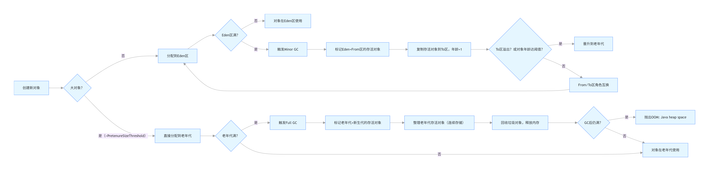 |
| :----------------------------------------------------------: |

4. 关键流程细节

（1）Minor GC 执行步骤：

1. 触发条件：Eden 区满，无法分配新对象；
2. 标记阶段：标记 Eden 区和 From 区的存活对象（通过可达性分析）；
3. 复制阶段：将存活对象复制到 To 区，同时对象年龄 +1；
4. 晋升判断：若对象年龄达到 `MaxTenuringThreshold`（默认 15），或 To 区无法容纳所有存活对象，直接晋升到老年代；
5. 角色互换：清空 Eden 区和 From 区，交换 From 和 To 区的角色（To 变 From，原 From 变 To）。

（2）Full GC 执行步骤：

1. 触发条件：老年代满（无法容纳新生代晋升的对象）、元空间满、调用 `System.gc()`（JVM 可忽略）、CMS GC 晋升失败等；
2. 标记阶段：标记老年代、新生代的所有存活对象；
3. 整理阶段：将老年代的存活对象向一端移动（消除碎片），新生代执行复制算法；
4. 清除阶段：回收所有未标记的垃圾对象；
5. 后果：若 Full GC 后仍无足够空间，抛出 `OutOfMemoryError`。


###### GC 关键配置参数（生产环境必配）

| 参数名称                          | 作用                                   | 示例                                          |
| --------------------------------- | -------------------------------------- | --------------------------------------------- |
| `-Xms`                            | 初始堆大小                             | `-Xms8g`                                      |
| `-Xmx`                            | 最大堆大小                             | `-Xmx16g`                                     |
| `-XX:NewRatio`                    | 新生代与老年代比例（默认 2）           | `-XX:NewRatio=3`（1:3）                       |
| `-XX:SurvivorRatio`               | Eden 与单个 Survivor 比例（默认 8）    | `-XX:SurvivorRatio=10`（10:1）                |
| `-XX:MaxTenuringThreshold`        | 对象晋升老年代的年龄阈值（默认 15）    | `-XX:MaxTenuringThreshold=10`                 |
| `-XX:PretenureSizeThreshold`      | 大对象直接进入老年代的阈值（单位字节） | `-XX:PretenureSizeThreshold=10485760`（10MB） |
| `-XX:+HeapDumpOnOutOfMemoryError` | OOM 时生成堆快照                       | 直接添加该参数                                |
| `-XX:HeapDumpPath`                | 堆快照存储路径                         | `-XX:HeapDumpPath=./heap.hprof`               |
| `-XX:MaxGCPauseMillis`            | G1/ZGC 的最大 STW 时间（默认 200ms）   | `-XX:MaxGCPauseMillis=50`                     |
| `-XX:+UseG1GC`                    | 指定使用 G1 GC 器                      | 直接添加该参数（JDK 9+ 默认）                 |
| `-XX:+UseZGC`                     | 指定使用 ZGC 器                        | 直接添加该参数（JDK 11+）                     |
| `-verbose:gc`                     | 输出 GC 日志                           | 直接添加该参数                                |
| `-XX:+PrintGCDetails`             | 输出详细 GC 日志（包括分区使用情况）   | 直接添加该参数                                |
| `-XX:+PrintGCTimeStamps`          | 输出 GC 发生的时间戳                   | 直接添加该参数                                |


###### 什么是垃圾回收（GC）

在 Java 中，开发者**不需要手动释放内存**，由 JVM 自动完成这件事。
 GC 的职责是：

1. 找出不再使用的对象（垃圾对象）；
2. 回收它们占用的内存；
3. 复用这块空间给新的对象分配。

> 🧠 简单理解：GC = 找垃圾 + 清垃圾 + 整理内存。


###### GC 作用的内存区域

JVM 内存结构中，**GC 只作用于堆和方法区（Metaspace）**：

| 内存区域                | 是否 GC 管理 | 说明                    |
| ----------------------- | ------------ | ----------------------- |
| 程序计数器              | ❌ 否         | 线程私有                |
| 虚拟机栈                | ❌ 否         | 随方法调用回收          |
| 本地方法栈              | ❌ 否         | JNI 使用                |
| **堆（Heap）**          | ✅ 是         | 存放对象实例，GC 主战场 |
| **方法区（Metaspace）** | ✅ 是         | 存放类元数据、常量池    |


###### 对象何时会被回收

JVM 通过 **可达性分析算法（Reachability Analysis）** 判断对象是否“活着”。

🌲 可达性分析图

```
GC Roots
  ├── 栈中引用的对象（局部变量）
  ├── 静态变量引用的对象
  ├── JNI 引用对象
  └── 活动线程对象
```

只要从 GC Roots 能**沿引用链（Reference Chain）\**到达的对象，就是“存活”的；
 反之，无法到达的就是\**垃圾对象**。

🚫 注意：引用类型影响 GC 判断

| 引用类型                   | 是否可被回收         | 使用场景       |
| -------------------------- | -------------------- | -------------- |
| 强引用（Strong）           | ❌ 否                 | 普通对象       |
| 软引用（SoftReference）    | ⚠️ 内存不足时回收     | 缓存           |
| 弱引用（WeakReference）    | ✅ 随时回收           | ThreadLocalMap |
| 虚引用（PhantomReference） | ✅ 仅用于接收回收通知 | 资源释放追踪   |


对象生命周期

1️⃣ 新对象分配在 Eden；
 2️⃣ Minor GC 后仍存活 → Survivor；
 3️⃣ 多次存活或 Survivor 满 → 晋升老年代；
 4️⃣ 老年代满 → Full GC；
 5️⃣ 对象死亡 → 回收。

###### GC 触发时机

| 类型                    | 触发条件                                  |
| ----------------------- | ----------------------------------------- |
| **Minor GC**            | 年轻代满                                  |
| **Major GC（Full GC）** | 老年代或方法区满；System.gc()；元空间溢出 |
| **混合 GC（G1）**       | 部分老年代 Region 回收                    |


###### GC 调优思路

1️⃣ **选择合适的收集器**：

- 小内存、单线程 → Serial
- 高吞吐 → Parallel
- 低延迟 → G1 / ZGC

2️⃣ **调整堆大小与代比**：

- -Xms、-Xmx：堆大小
- -XX:NewRatio：新生代比例

3️⃣ **监控 GC 日志**：

```
-XX:+PrintGCDetails -XX:+PrintGCDateStamps
```

4️⃣ **使用可视化工具**：

- JVisualVM / JConsole
- GCViewer
- Java Mission Control (JMC)


###### 常用 GC 参数示例

```
# 使用 G1 收集器
-XX:+UseG1GC
-XX:MaxGCPauseMillis=200
-XX:+PrintGCDetails
-XX:+PrintGCDateStamps
-XX:+PrintHeapAtGC

# Parallel GC
-XX:+UseParallelGC
-XX:ParallelGCThreads=8
```


## Java对象

### 对象创建过程

| 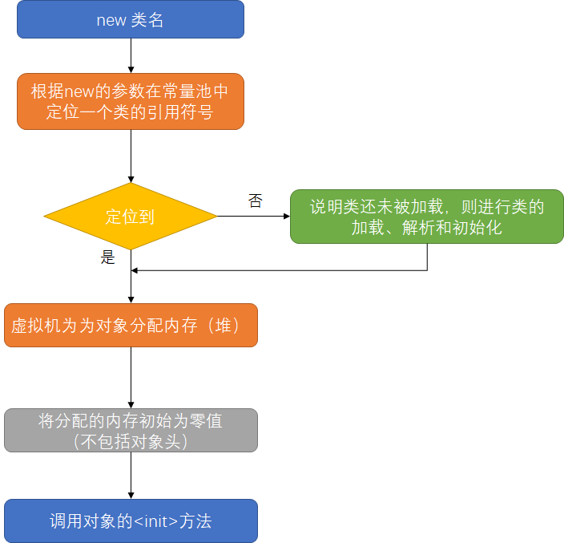 |
| :----------------------------------------------------------: |


### 对象内存分配方式

**指针碰撞**

 假设Java堆中内存是绝对规整的，所有用过的内存都放在一边，空闲的内存放在另一边，中间放着一个指针作为分界点的指示器，那所分配内存就仅仅是把那个指针向空闲空间那边挪动一段与对象大小相等的距离，这种分配方式称为指针碰撞

**空闲列表**

 如果Java堆中的内存并不是规整的，已使用的内存和空闲的内存相互交错，那就没有办法简单地进行指针碰撞了，虚拟机就必须维护一个列表，记录上哪些内存块是可用的，在分配的时候从列表中找到一块足够大的空间划分给对象实例，并更新列表上的记录，这种分配方式称为空闲列表

> 具体是使用空闲列表还是指针碰撞需要根据内存状况决定


### 多线程内存分配管理

 不管使用哪种对象内存分配方式，在多线程环境时，如果一个线程正在给A对象分配内存，指针还没有来的及修改，切换为其它为B对象分配内存的线程，而且还是引用这之前的指针指向，这样会带来分配问题。

**分配时加锁**

 堆是JVM中所有线程共享的，因此在其上进行对象内存的分配均需要进行加锁，这也导致了new对象的开销是比较大的。

**TLAB【线程本地分配缓存区】**

 为了提升对象内存分配的效率，对于所创建的线程都会分配一块独立的空间TLAB（Thread Local Allocation Buffer），其大小由JVM根据运行的情况计算而得，在TLAB上分配对象时不需要加锁，因此JVM在给线程的对象分配内存时会尽量的在TLAB上分配，在这种情况下JVM中分配对象内存的性能和C基本是一样高效的，但如果对象过大的话则仍然是直接使用堆空间分配。

 JVM在内存新生代Eden Space中开辟了一小块线程私有的区域称作TLAB。默认设定为占用Eden Space的1%。


### 对象的结构

| 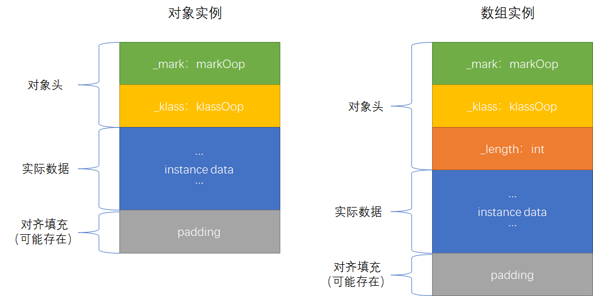 |
| :----------------------------------------------------------: |


**对象头**

- _mark：用于存储对象自身的运行时数据，如哈希码（HashCode）、GC分代年龄、锁状态标志、线程持有的锁、偏向线程ID、偏向时间戳等，称之为“MarkWord”
- _klass：指向类元数据的指针
- _length：数组长度（只有数组对象有）

**实例数据**

 存储在程序代码中所定义的各种类型的字段内容

**对齐填充**

 帮助对象凑满8字节的倍数，不一定存在


### 对象访问方式

**句柄访问**

 使用句柄访问。Java堆中将会划分出一块内存来作为句柄池，reference中存储的是对象的句柄地址，而句柄中包含了对象实例数据和类型数据各自的具体地址信息。

| 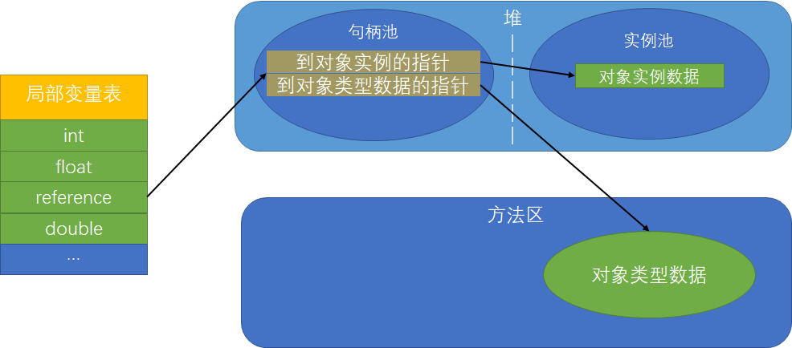 |
| :----------------------------------------------------------: |


**直接指针访问**

 使用直接指针访问。reference中存储的就是对象的地址。

| 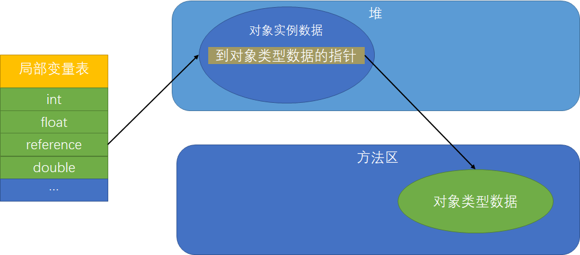 |
| :----------------------------------------------------------: |


> HotSpot是用直接指针访问方式进行对象访问的。


### 内存分配

### 分配策略

- 对象优先分配到Eden区

- 大对象直接分配到老年代

- 长期存活对象分配到老年代

- 空间分配担保

    存入对象时发现年轻代空间不足，将判断老年代最大可用的连续空间是否大于当前年起代所有对象

    - 满足，minor gc是安全的，可以进行minor gc
    - 不满足，虚拟机查看HandlePromotionFailure参数
        - true会继续检测[老年代最大可用的连续空间]是否大于[历次晋升到老年代对象的平均大小]。若大于，将尝试进行一次minor gc，若失败，则重新进行一次full gc
        - false则不允许冒险，要进行full gc


#### 1. 对象优先在 Eden 分配

大多数情况下，对象在新生代 Eden 区分配，当 Eden 区空间不够时，发起 Minor GC。

#### 2. 大对象直接进入老年代

大对象是指需要连续内存空间的对象，最典型的大对象是那种很长的字符串以及数组。

经常出现大对象会提前触发垃圾收集以获取足够的连续空间分配给大对象。

-XX:PretenureSizeThreshold，大于此值的对象直接在老年代分配，避免在 Eden 区和 Survivor 区之间的大量内存复制。

#### 3. 长期存活的对象进入老年代

为对象定义年龄计数器，对象在 Eden 出生并经过 Minor GC 依然存活，将移动到 Survivor 中，年龄就增加 1 岁，增加到一定年龄则移动到老年代中。

-XX:MaxTenuringThreshold 用来定义年龄的阈值。

#### 4. 动态对象年龄判定

虚拟机并不是永远地要求对象的年龄必须达到 MaxTenuringThreshold 才能晋升老年代，如果在 Survivor 中相同年龄所有对象大小的总和大于 Survivor 空间的一半，则年龄大于或等于该年龄的对象可以直接进入老年代，无需等到 MaxTenuringThreshold 中要求的年龄。

#### 5. 空间分配担保

在发生 Minor GC 之前，虚拟机先检查老年代最大可用的连续空间是否大于新生代所有对象总空间，如果条件成立的话，那么 Minor GC 可以确认是安全的。

如果不成立的话虚拟机会查看 HandlePromotionFailure 设置值是否允许担保失败，如果允许那么就会继续检查老年代最大可用的连续空间是否大于历次晋升到老年代对象的平均大小，如果大于，将尝试着进行一次 Minor GC；如果小于，或者 HandlePromotionFailure 设置不允许冒险，那么就要进行一次 Full GC。


### 栈上分配和逃逸分析

在JDK7（包括）之后完全支持栈上分配和逃逸分析。

**逃逸分析**

 如果某个方法之内创建的实例只在方法内被使用，方法结束之后没有任何对象引用它【即可被GC回收】，这样的对象叫做未发生逃逸对象。如果某个方法之内创建的实例在方法结束之后有对象引用它【即不可被GC回收】，这样的对象叫做逃逸对象。

**栈上分配**

 如果一个对象未发生逃逸则这个对象的生命周期只存在一个方法体内，这样的对象可以直接在栈上分配提高效率，也方便回收【方法结束，栈销毁，未发生逃逸也就随着销毁】


## 对象已死判定算法

| 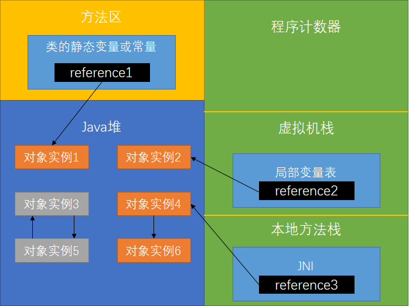 |
| :----------------------------------------------------------: |


### ~~一 引用计数法（Reference Counting）~~

核心原理：

- 为每个对象维护一个 “引用计数器”，记录当前指向该对象的引用数量；
- 引用增加时计数器 +1，引用失效时计数器 -1；
- 当计数器为 0 时，判定为垃圾对象。


优点：

- 实现简单，回收及时（计数器为 0 时立即回收）；
- 无停顿（不阻塞线程）。

缺点：

- 无法解决 “循环引用” 问题（如两个对象互相引用，计数器均为 1，但均无外部引用）；
- 每次引用操作都需修改计数器，有性能开销。

现状：

JVM 未采用（Java、C# 均弃用），仅用于简单场景（如 Python 早期版本、Redis）。


- **原理**：对象被引用时计数+1，引用失效时-1，计数为0则回收。
- **致命缺陷**：**无法解决循环引用**（A→B，B→A，计数≠0 但不可达）。
- **现状**：Python、PHP 使用，**JVM 未采用**。


- **原理**：在对象中添加一个引用计数器。每当有一个地方引用它时，计数器值加 1；当引用失效时，计数器值减 1。任何时刻计数器为 0 的对象就是不可能再被使用的。

- **优点**：实现简单，判定效率高。

- **致命缺点**：**无法解决对象之间循环引用的问题**。

```java
class ObjectA {
    public ObjectB ref;
}
class ObjectB {
    public ObjectA ref;
}
// 在主函数中
ObjectA a = new ObjectA();
ObjectB b = new ObjectB();
a.ref = b; // a 引用 b
b.ref = a; // b 引用 a
a = null;
b = null;
// 此时，a 和 b 对象已经无法被访问，但由于它们互相引用，计数器都不为0，无法被回收。
```

- **结论**：主流的 JVM 都**没有选用**引用计数算法来管理内存。


 在对象中添加一个引用计数器，当有地方释放这个引用时，对象上存储的引用计数减一，但是当出现互相引用时【对象实例3和对象实例5】引用计数依旧不为0，无法对其进行垃圾回收。

给对象添加一个引用计数器，当对象增加一个引用时计数器加 1，引用失效时计数器减 1。引用计数为 0 的对象可被回收。

两个对象出现循环引用的情况下，此时引用计数器永远不为 0，导致无法对它们进行回收。

正因为循环引用的存在，因此 Java 虚拟机不使用引用计数算法。

```java
public class ReferenceCountingGC {

    public Object instance = null;

    public static void main(String[] args) {
        ReferenceCountingGC objectA = new ReferenceCountingGC();
        ReferenceCountingGC objectB = new ReferenceCountingGC();
        objectA.instance = objectB;
        objectB.instance = objectA;
    }
}
```


### 二 可达性分析（Reachability Analysis）

###### 核心原理（JVM 主流算法）：

- 以 “根对象（GCRoots）” 为起点，遍历对象引用链；
- 若对象能通过 GCRoots 遍历到（存在可达路径），则为 “存活对象”；
- 若对象无法通过任何 GCRoots 遍历到（引用链断裂），则为 “垃圾对象”。

###### （1）GCRoots 根对象的类型（必须牢记）：

| 根对象类型                 | 示例                                            |
| -------------------------- | ----------------------------------------------- |
| 虚拟机栈中引用的对象       | 方法内的局部变量（如 `User user = new User()`） |
| 本地方法栈中引用的对象     | Native 方法调用的参数 / 局部变量                |
| 方法区中静态变量引用的对象 | `static User user = new User()`                 |
| 方法区中常量引用的对象     | `final User USER = new User()`                  |
| 活跃线程对象               | 正在运行的线程实例                              |

###### （2）循环引用问题的解决：


```java
class A { B b; }
class B { A a; }

A a = new A();
B b = new B();
a.b = b; // A 引用 B
b.a = a; // B 引用 A（循环引用）
a = null;
b = null;
```

- 分析：`a` 和 `b` 均被置为 null，无任何 GCRoots 指向 A、B 对象，引用链断裂 → 判定为垃圾；
- 结论：可达性分析算法完美解决循环引用问题。

#### 优点：

- 准确识别垃圾，无循环引用问题；
- 适配 Java 复杂的引用类型（强 / 软 / 弱 / 虚引用）。

#### 缺点：

- 遍历引用链耗时较长，可能导致线程停顿（STW）。


- **原理**：从 **GC Roots** 出发，不可达的对象即为垃圾。

- GC Roots 包括：

    - 虚拟机栈中**局部变量**引用的对象；
    - 方法区中**静态变量**引用的对象；
    - 方法区中**常量**引用的对象；
    - 本地方法栈中 **JNI（Native）** 引用的对象。


> 📌 **灰色对象**（C、E）不可达 → 可回收。

 该算法的核心算法是从GC Roots对象作为起始点，如果对象不可达到GC Root则认为此对象是要回收的对象。可作为GC Roots的对象

- 虚拟机栈的局部变量所引用的对象
- 本地方法栈的JNI所引用的对象
- 方法区的静态变量和常量所引用的对象


- **原理**：通过一系列称为 **GC Roots** 的对象作为起始点集，从这些节点开始，根据引用关系向下搜索，搜索过程所走过的路径称为**引用链**。如果某个对象到 GC Roots 间**没有任何引用链相连**，则证明此对象是不可能再被使用的。
- **哪些对象可以作为 GC Roots？**
    - **虚拟机栈中引用的对象**（即各个线程被调用的方法堆栈中使用到的参数、局部变量、临时变量等）。
    - **本地方法栈中 JNI 引用的对象**。
    - **方法区中类静态属性引用的对象**（如 `public static Object`）。
    - **方法区中常量引用的对象**（如 `public static final Object`）。
    - **Java 虚拟机内部的引用**（如基本数据类型对应的 Class 对象，常驻的异常对象等）。
    - **所有被同步锁持有的对象**。

下图直观地展示了基于GC Roots的可达性分析过程：

| 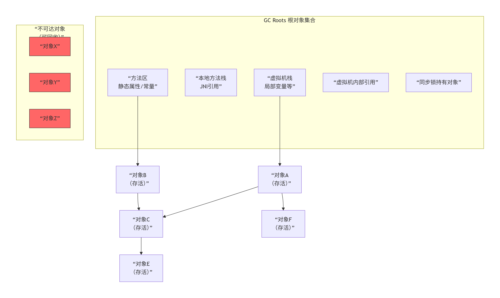 |
| :----------------------------------------------------------: |


**GC Roots 对象包括**

- 虚拟机栈中局部变量引用的对象；
- 方法区中静态变量引用的对象；
- 方法区中常量引用的对象；
- 本地方法栈中 JNI 引用的对象。


通过 GC Roots 作为起始点进行搜索，能够到达到的对象都是存活的，不可达的对象可被回收。

| 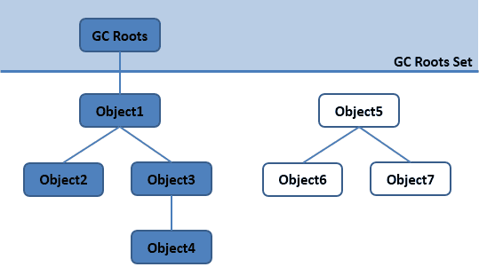 |
| :----------------------------------------------------------: |


Java 虚拟机使用该算法来判断对象是否可被回收，在 Java 中 GC Roots 一般包含以下内容:

- 虚拟机栈中引用的对象
- 本地方法栈中引用的对象
- 方法区中类静态属性引用的对象
- 方法区中的常量引用的对象


###  引用类型

Java 中引用分为 4 种类型，不同类型对垃圾回收的影响不同（从强到弱）：

| 引用类型 | 核心特性                                                     | 适用场景                            |
| -------- | ------------------------------------------------------------ | ----------------------------------- |
| 强引用   | 程序直接引用（如 `Object o = new Object()`），GC 不会回收存活的强引用对象 | 普通对象引用（默认）                |
| 软引用   | 内存充足时不回收，内存不足时（OOM 前）回收                   | 缓存（如图片缓存、数据缓存）        |
| 弱引用   | 每次 GC 都会回收（无论内存是否充足）                         | 临时数据（如 ThreadLocal 底层）     |
| 虚引用   | 最弱引用，仅用于监听对象被 GC 回收的事件（无法通过虚引用获取对象） | 堆外内存释放（如 DirectByteBuffer） |

示例（软引用缓存）：

```java
// 软引用包裹缓存对象
SoftReference<byte[]> cache = new SoftReference<>(new byte[1024 * 1024 * 10]); // 10MB
// 内存充足时，cache.get() 可获取对象；内存不足时，GC 回收该 byte[]，cache.get() 返回 null
```


JVM 提供**四种引用强度**，控制对象回收时机

| 引用类型              | 回收时机                 | 用途                                            |
| --------------------- | ------------------------ | ----------------------------------------------- |
| **强引用（Strong）**  | 永不回收（OOM 也不回收） | `Object obj = new Object()`                     |
| **软引用（Soft）**    | 内存不足时回收           | 缓存（`SoftReference`）                         |
| **弱引用（Weak）**    | 下次 GC 时回收           | `WeakHashMap`、监听器                           |
| **虚引用（Phantom）** | 随时回收，仅用于跟踪     | 资源清理（`PhantomReference`+`ReferenceQueue`） |

> 💡 **SoftReference 示例**： 

```
SoftReference<byte[]> cache = new SoftReference<>(new byte[1024*1024]);
// 内存不足时，cache.get() 可能返回 null
```


无论是通过引用计算算法判断对象的引用数量，还是通过可达性分析算法判断对象是否可达，判定对象是否可被回收都与引用有关。

Java 具有四种强度不同的引用类型。

#### 强引用

被强引用关联的对象不会被回收。

使用 new 一个新对象的方式来创建强引用。

```java
Object obj = new Object();
```


#### 软引用

被软引用关联的对象只有在内存不够的情况下才会被回收。

使用 SoftReference 类来创建软引用。

```java
Object obj = new Object();
SoftReference<Object> sf = new SoftReference<Object>(obj);
obj = null;  // 使对象只被软引用关联
```


#### 弱引用

被弱引用关联的对象一定会被回收，也就是说它只能存活到下一次垃圾回收发生之前。

使用 WeakReference 类来实现弱引用。

```java
Object obj = new Object();
WeakReference<Object> wf = new WeakReference<Object>(obj);
obj = null;
```


#### 虚引用

又称为幽灵引用或者幻影引用。一个对象是否有虚引用的存在，完全不会对其生存时间构成影响，也无法通过虚引用取得一个对象。

为一个对象设置虚引用关联的唯一目的就是能在这个对象被回收时收到一个系统通知。

使用 PhantomReference 来实现虚引用。

```java
Object obj = new Object();
PhantomReference<Object> pf = new PhantomReference<Object>(obj);
obj = null;
```


### 知识拓展

#### 方法区的回收

因为方法区主要存放永久代对象，而永久代对象的回收率比新生代低很多，因此在方法区上进行回收性价比不高。

主要是对常量池的回收和对类的卸载。

在大量使用反射、动态代理、CGLib 等 ByteCode 框架、动态生成 JSP 以及 OSGi 这类频繁自定义 ClassLoader 的场景都需要虚拟机具备类卸载功能，以保证不会出现内存溢出。

类的卸载条件很多，需要满足以下三个条件，并且满足了也不一定会被卸载:

- 该类所有的实例都已经被回收，也就是堆中不存在该类的任何实例。
- 加载该类的 ClassLoader 已经被回收。
- 该类对应的 Class 对象没有在任何地方被引用，也就无法在任何地方通过反射访问该类方法。

可以通过 -Xnoclassgc 参数来控制是否对类进行卸载。


#### finalize()

finalize() 类似 C++ 的析构函数，用来做关闭外部资源等工作。但是 try-finally 等方式可以做的更好，并且该方法运行代价高昂，不确定性大，无法保证各个对象的调用顺序，因此最好不要使用。

当一个对象可被回收时，如果需要执行该对象的 finalize() 方法，那么就有可能通过在该方法中让对象重新被引用，从而实现自救。自救只能进行一次，如果回收的对象之前调用了 finalize() 方法自救，后面回收时不会调用 finalize() 方法。


## 垃圾回收算法

### 一 标记-清除算法（Mark-Sweep）

- 步骤：

    1. **标记**：从 GC Roots 遍历，标记存活对象；
    2. **清除**：回收未标记对象。

- 缺点：

    - **内存碎片**：存活对象分散，无法分配大对象；
    - **效率低**：需遍历两次（标记+清除）。


- **过程**：
    1. **标记**：首先标记出所有需要回收的对象。
    2. **清除**：统一回收所有被标记的对象。
- **缺点**：
    - **执行效率不稳定**：如果堆中有大量对象需要回收，标记和清除两个过程的效率都会随之下降。
    - **内存碎片化**：标记清除后会产生大量不连续的内存碎片。当需要分配较大对象时，可能因无法找到连续内存而不得不提前触发另一次 GC。

| 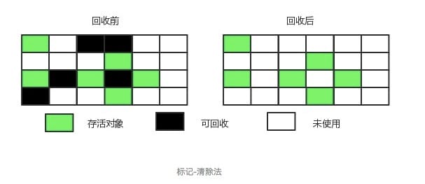 |
| :----------------------------------------------------------: |

算法分为`标记`和`清除`两个阶段：先标记出所有需要回收的对象，完成后统一回收掉所有被标记的对象。

缺陷：①标记和清除过程的效率不高；②极易造成空间碎片问题


将存活的对象进行标记，然后清理掉未被标记的对象。

不足:

- 标记和清除过程效率都不高；
- 会产生大量不连续的内存碎片，导致无法给大对象分配内存。


### 二 复制收集算法（Copying）

- **原理**：将内存分为 **From** 和 **To** 两块，每次只用一块。

- 步骤：

    1. 将 From 中存活对象**复制**到 To；
    2. 清空 From，From/To 角色互换。

- **优点**：无碎片、效率高；

- **缺点**：**内存利用率 50%**；

- **适用**：**新生代**（朝生夕死，存活率低）。


- **过程**：将可用内存按容量划分为大小相等的两块，每次只使用其中的一块。当这一块的内存用完了，就将还存活着的对象**复制**到另外一块上面，然后再把已使用过的内存空间一次清理掉。
- **优点**：
    - 实现简单，运行高效。
    - 没有内存碎片。
- **缺点**：
    - **内存利用率低**：可用内存缩小为了原来的一半。
    - 当对象存活率较高时，需要进行大量的复制操作，效率会降低。
- **应用**：是**新生代**垃圾回收的理想算法。在 HotSpot VM 中，新生代的 Eden 区和 Survivor 区就是采用这种算法（比例通常是 **8:1:1**）。

| 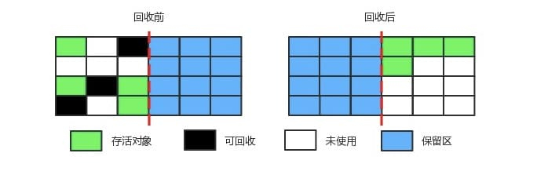 |
| :----------------------------------------------------------: |

复制收集算法将可用内存按容量划分为大小相等的两块，`survivor`区每次只使用其中的一块。当这一块的内存用完了，就将`eden`和`survivor`还存活着的对象复制到另外一块`survivor`上面，然后再把已使用过的内存空间一次清理掉。 这样内存分配时也就不用考虑内存碎片等复杂情况，实现简单运行高效。长期存活的对象移入`oldGen`区这里面的对象很少执行垃圾回收。


### 三 标记-整理算法（Mark-Compact）

- 步骤：

    1. **标记**存活对象；
    2. **整理**：将存活对象向一端移动；
    3. 清理边界外内存。

- **优点**：无碎片；

- **缺点**：移动对象开销大；

- **适用**：**老年代**（存活率高，不宜复制）。


- **过程**：
    1. **标记**：与“标记-清除”一样，标记所有需要回收的对象。
    2. **整理**：让所有存活的对象都向内存空间的一端移动，然后直接清理掉边界以外的内存。
- **优点**：
    - 没有内存碎片。
- **缺点**：
    - 移动存活对象并更新所有引用是一个负重操作，需要暂停用户应用程序（Stop The World）。
- **应用**：主要用于**老年代**的垃圾回收。

| 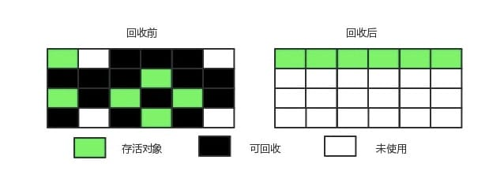 |
| :----------------------------------------------------------: |

当预估能回收的对象并不多时（例如老年代）采用复制收集算法就要执行较多的复制操作，效率将会变低且还浪费了大量空间，所以此时进行复制收集算法不明智。采用`标记-整理`算法较为合适，标记过程仍然与“标记-清除”算法一样，但后续步骤不是直接对可回收对象进行清理，而是让所有存活的对象都向一端移动，然后直接清理掉端边界以外的内存。且下次在此空间继续分配内存可以使用指针碰撞法提高速度。

让所有存活的对象都向一端移动，然后直接清理掉端边界以外的内存。


将内存划分为大小相等的两块，每次只使用其中一块，当这一块内存用完了就将还存活的对象复制到另一块上面，然后再把使用过的内存空间进行一次清理。

主要不足是只使用了内存的一半。

现在的商业虚拟机都采用这种收集算法来回收新生代，但是并不是将新生代划分为大小相等的两块，而是分为一块较大的 Eden 空间和两块较小的 Survivor 空间，每次使用 Eden 空间和其中一块 Survivor。在回收时，将 Eden 和 Survivor 中还存活着的对象一次性复制到另一块 Survivor 空间上，最后清理 Eden 和使用过的那一块 Survivor。

HotSpot 虚拟机的 Eden 和 Survivor 的大小比例默认为 8:1，保证了内存的利用率达到 90%。如果每次回收有多于 10% 的对象存活，那么一块 Survivor 空间就不够用了，此时需要依赖于老年代进行分配担保，也就是借用老年代的空间存储放不下的对象。


### 四 分区收集


### 分代收集算法（一切回收器的基础）

###### 核心思想（JVM 主流算法）：

- 基于 “对象生命周期不同” 的规律（大部分对象生命周期短，少数对象生命周期长），将堆分为新生代和老年代；
- 对不同代采用不同的回收算法（扬长避短）：
    - 新生代（对象存活率低）：采用**复制算法**（回收效率高，无碎片）；
    - 老年代（对象存活率高）：采用**标记 - 清除算法**或**标记 - 整理算法**（内存利用率高）。

###### 分代收集的优势：

- 结合了复制算法和标记 - 整理算法的优点，兼顾回收效率和内存利用率；
- 新生代 GC（Minor GC）频率高但耗时短，老年代 GC（Full GC）频率低但耗时久，平衡了 STW 影响。


- 核心思想：基于 “弱代假说”：

    - 大多数对象朝生夕死；
    - 少数对象长期存活。

- JVM 堆分代：

    - **新生代（Young）**：Eden + Survivor（From/To）→ 用**复制算法**；
    - **老年代（Old）**：长期存活对象 → 用**标记-整理/清除**。

> ✅ **分代优势**： 
>
> - 新生代 GC 快（存活少，复制快）；
> - 老年代 GC 少（存活多，但频率低）。


这是当前商业虚拟机垃圾收集器的设计原则。

###### 1. 弱分代假说

绝大多数对象都是**朝生夕死**的。即大多数对象的生命周期都非常短。

###### 2. 强分代假说

熬过越多次垃圾收集过程的对象，就越难以消亡。

基于以上假说，JVM 将 Java 堆划分为不同的区域，从而根据各个区域的特点，使用不同的垃圾收集算法。

下图清晰地展示了JVM堆的分代结构与对应的垃圾收集过程：

| 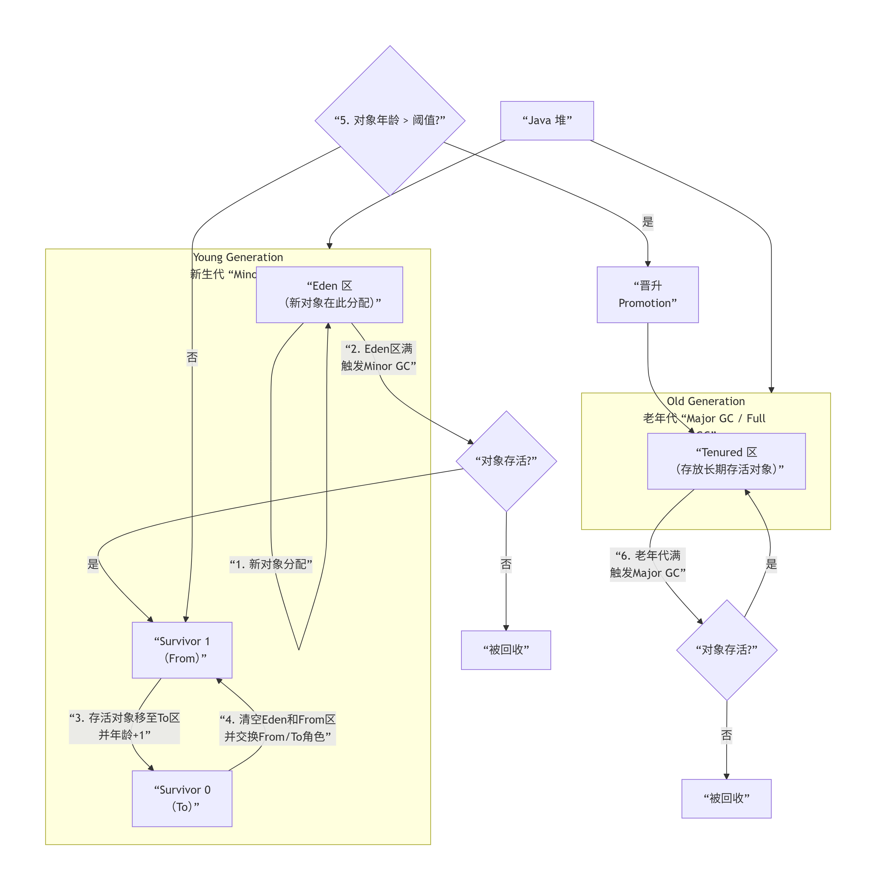 |
| :----------------------------------------------------------: |

- **新生代**：
    - 区域划分：一块较大的 **Eden** 空间和两块较小的 **Survivor** 空间。
    - 回收算法：**标记-复制**。
    - 回收过程：称为 **Minor GC** 或 **Young GC**。
        1. 新对象在 **Eden** 区分配。
        2. 当 Eden 区满时，触发一次 Minor GC。
        3. 将 Eden 和一块 Survivor（From）中仍然存活的对象，复制到另一块 Survivor（To）中。
        4. 清理掉 Eden 和刚才使用的 Survivor 空间。
        5. 对象在 Survivor 区中每熬过一次 Minor GC，年龄就增加 1 岁。
        6. 当年龄达到阈值（默认 15），对象被晋升到老年代。
- **老年代**：
    - 存放生命周期较长的对象。
    - 回收算法：**标记-清除**或**标记-整理**。
    - 回收过程：称为 **Major GC** 或 **Full GC**。速度通常比 Minor GC 慢 10 倍以上。


 把Java堆分为新生代和老年代，根据各个年代的特点采用最适当的收集算法。新生代每次垃圾收集时都有大量对象需要回收那就选用复制算法。而老年代中因为对象存活率高就使用`标记-清理`或`标记-整理`算法进行回收。


现在的商业虚拟机采用分代收集算法，它根据对象存活周期将内存划分为几块，不同块采用适当的收集算法。

一般将堆分为新生代和老年代。

- 新生代使用: 复制算法
- 老年代使用: 标记 - 清除 或者 标记 - 整理 算法


## 垃圾回收器

| GC 器                 | 堆布局                        | 特点                        |
| --------------------- | ----------------------------- | --------------------------- |
| **Serial / Parallel** | 传统分代（Eden/Survivor/Old） | 简单高效，适合单核/吞吐优先 |
| **CMS**               | 分代                          | 并发标记，低停顿（已废弃）  |
| **G1**                | **分区（Region）**            | 可预测停顿，大内存首选      |
| **ZGC / Shenandoah**  | 分页/分 Region                | 超低停顿（<10ms），TB 级堆  |


| 收集器                | 目标         | 区域   | 算法                    | 特点                                            |
| :-------------------- | :----------- | :----- | :---------------------- | :---------------------------------------------- |
| **Serial**            | 单线程、高效 | 新生代 | 复制                    | 简单高效，Client模式默认，会 **Stop The World** |
| **ParNew**            | 多线程并行   | 新生代 | 复制                    | Serial 的多线程版本，与 CMS 配合工作            |
| **Parallel Scavenge** | 吞吐量优先   | 新生代 | 复制                    | 关注吞吐量，可控的停顿时间                      |
| **Serial Old**        | 单线程       | 老年代 | 标记-整理               | Serial 的老年代版本                             |
| **Parallel Old**      | 吞吐量优先   | 老年代 | 标记-整理               | Parallel Scavenge 的老年代搭档                  |
| **CMS**               | 低停顿       | 老年代 | 标记-清除               | 并发收集，减少停顿时间，但有碎片问题            |
| **G1**                | 平衡         | 全堆   | 整体标记-整理，局部复制 | JDK 9+ 默认，可预测的停顿时间模型               |
| **ZGC**               | 超低停顿     | 全堆   | 染色指针                | JDK 15+ 生产可用，停顿 < 10ms                   |


1. 垃圾回收器分类（按特性）

| 分类         | 代表 GC 器                       | 适用场景                           | JDK 支持情况                                                 |
| ------------ | -------------------------------- | ---------------------------------- | ------------------------------------------------------------ |
| 吞吐量优先   | Parallel Scavenge + Parallel Old | 后台服务、大数据（追求高吞吐量）   | JDK 8 默认，JDK 14 标记为过时                                |
| 低延迟优先   | CMS、G1、ZGC、Shenandoah         | 互联网服务、实时系统（追求低 STW） | CMS（JDK 9 过时）、G1（JDK 9+ 默认）、ZGC/Shenandoah（JDK 11+） |
| 单线程 GC 器 | Serial + Serial Old              | 客户端应用、嵌入式系统（内存小）   | 所有 JDK 支持，仅适用于小内存                                |

1


| 回收器                               | 年代          | 并发/并行              | 停顿时间        | 适用场景                    |
| ------------------------------------ | ------------- | ---------------------- | --------------- | --------------------------- |
| **Serial**                           | 新生代+老年代 | 单线程                 | 高              | 单核、小内存                |
| **Parallel Scavenge + Parallel Old** | 全堆          | 多线程并行             | 高（吞吐优先）  | 后台计算                    |
| **CMS（Concurrent Mark Sweep）**     | 老年代        | 并发（用户线程可运行） | 低              | Web 应用（**JDK 14 移除**） |
| **G1（Garbage First）**              | 全堆（分区）  | 并发+并行              | 可预测（<0.5s） | 大内存（4GB~TB）            |
| **ZGC**                              | 全堆          | 并发（几乎无停顿）     | <10ms           | 超大堆、低延迟（JDK 11+）   |
| **Shenandoah**                       | 全堆          | 并发                   | <10ms           | 同 ZGC（Red Hat 主导）      |


| 回收器                       | 特点                   | 适用场景                        |
| ---------------------------- | ---------------------- | ------------------------------- |
| Serial                       | 单线程，Stop-The-World | 客户端模式、小内存应用          |
| Parallel（吞吐量优先）       | 多线程，高吞吐         | 后台计算、批处理                |
| CMS（Concurrent Mark Sweep） | 并发低停顿（已废弃）   | Web 应用（JDK 8 之前）          |
| G1（Garbage First）          | 分区回收，可预测停顿   | 大内存、低延迟要求              |
| ZGC / Shenandoah             | 超低停顿（<10ms）      | 超大堆、实时性要求高（JDK 11+） |

> JDK 17 默认使用 G1 GC。 


### 一 Serial + Serial Old（单线程）

- **特点**：单线程，Stop-The-World（STW）；
- **适用**：客户端模式、小内存应用；
- **组合**：Serial（新生代） + Serial Old（老年代）。


### 二 Parallel Scavenge + Parallel Old（吞吐量优先）

- **核心特点**：吞吐量优先（最大化单位时间内的程序运行时间，最小化 GC 时间占比）；
- **算法**：Parallel Scavenge（复制算法）、Parallel Old（标记 - 整理算法）；
- **优势**：GC 效率高，吞吐量高；
- **劣势**：STW 时间较长（不适合低延迟场景）；
- **适用场景**：后台任务、大数据处理（如 Hadoop）、非实时服务。


- 特点：

    - 多线程并行；
    - **高吞吐量**（最大化 CPU 利用率）；
    - STW 时间长。

- **适用**：后台计算、批处理；

- **参数**：

```bash
-XX:+UseParallelGC          # 新生代
-XX:+UseParallelOldGC       # 老年代（默认开启）
-XX:MaxGCPauseMillis=200    # 目标停顿时间
-XX:GCTimeRatio=99          # 吞吐量 = 1/(1+GCTimeRatio)
```


### 三 CMS（Concurrent Mark Sweep，低延迟）

- **核心特点**：低延迟优先（并发标记和清除，减少 STW 时间）；

- **算法**：标记 - 清除算法（老年代）、Parallel Scavenge（新生代）；

- 核心流程

    （4 阶段）：

    1. 初始标记（STW）：标记 GCRoots 直接引用的对象（快速）；
    2. 并发标记：与应用线程并行，遍历引用链（无 STW）；
    3. 重新标记（STW）：修正并发标记期间因应用线程修改导致的引用变化（快速）；
    4. 并发清除：与应用线程并行，回收垃圾对象（无 STW）；

- **优势**：STW 时间短（通常 10-50ms）；

- 劣势：

    - 产生内存碎片（标记 - 清除算法）；
    - 并发阶段占用 CPU 资源（影响程序吞吐量）；
    - 可能出现 “晋升失败”（新生代对象晋升时老年代无空间，触发 Full GC）；

- **现状**：JDK 9 标记为过时，JDK 14 移除（被 G1 替代）。


- **目标**：**低停顿时间**（<100ms）；

- 步骤（4 阶段）：

    1. **初始标记（STW）**：标记 GC Roots 直接引用对象；
    2. **并发标记**：与用户线程并发，标记所有存活对象；
    3. **重新标记（STW）**：修正并发标记期间的变化；
    4. **并发清除**：与用户线程并发，清除垃圾。

- 缺点：

    - **CPU 资源敏感**（并发阶段占用 CPU）；
    - **内存碎片**（标记-清除算法）；
    - **并发模式失败**（Concurrent Mode Failure）：老年代满时退化为 Serial Old（STW 很长）。

- **状态**：**JDK 14 起废弃**，JDK 17 移除。


### 四 G1收集器

#### G1 回收器特点：

- 将堆划分为 **Region**（默认 2048 个）；
- 优先回收垃圾最多的 Region（Garbage First）；
- 使用 **Remembered Set** 跟踪跨 Region 引用；
- 支持软实时（可设置最大停顿时间：`-XX:MaxGCPauseMillis=200`）。


###### G1 GC 示意图（Region化堆）

```
堆被划分为多个 Region（逻辑上分代）
每次只回收一部分 Region，避免全堆停顿
```

优点：

- 并行 + 并发；
- 预测停顿时间；
- 无碎片问题；
- 支持大内存。


- **核心特点**：平衡吞吐量和低延迟（JDK 9+ 默认 GC 器）；

- **底层创新**：将堆划分为多个大小相等的 “独立分区”（Region），每个分区可动态扮演 Eden、Survivor、老年代角色；

- **算法**：复制算法（新生代回收）+ 标记 - 整理算法（老年代回收）；

- 核心流程：

    1. 新生代回收（Minor GC）：复制 Eden 区存活对象到 Survivor 区；
    2. 混合回收（Mixed GC）：当老年代分区占比达到阈值（默认 45%），触发混合回收，同时回收新生代和部分老年代分区；
    3. Full GC：混合回收无法释放足够空间时触发（极少发生）；

- 优势：

    - 可预测的 STW 时间（通过 `-XX:MaxGCPauseMillis` 配置最大停顿时间）；
    - 无内存碎片（老年代回收采用标记 - 整理）；
    - 灵活分配内存（分区动态角色切换）；

- **适用场景**：中大型应用（堆大小 4GB+）、互联网服务、低延迟需求场景。


- **目标**：**大内存（4GB~TB）、可预测停顿**（<0.5s）；

- 革命性设计：

    - **堆分区（Region）**：将堆划分为 2048 个 Region（默认）；
    - **Remembered Set（RSet）**：记录 Region 间的引用，避免全堆扫描；
    - **优先回收垃圾最多的 Region**（Garbage First）。

- 回收模式：

    - **Young GC**：回收 Eden + Survivor Region；
    - **Mixed GC**：在 Young GC 基础上，加入部分老年代 Region。

- **参数**：

```bash
-XX:+UseG1GC
-XX:MaxGCPauseMillis=200    # 目标停顿时间
-XX:G1HeapRegionSize=16m    # Region 大小（1~32MB）
```

- **状态**：**JDK 9+ 默认 GC**。


#### G1 堆结构

```
G1 Heap
┌──────┬──────┬──────┬──────┐
│ Eden │ Old  │Surviv│ Old  │ ← Region (1~32MB)
├──────┼──────┼──────┼──────┤
│ Old  │ Eden │ Old  │Surviv│
└──────┴──────┴──────┴──────┘
```

#### Remembered Set（RSet）

- **问题**：回收一个 Region 时，需知道**哪些 Region 引用了它**；
- **解决方案**：每个 Region 有 RSet，记录**外部 Region 对它的引用**；
- **效果**：避免全堆扫描，提升 GC 效率。

#### G1 回收流程

1. Young GC：

    - STW，回收 Eden + Survivor Region；
    - 存活对象复制到新 Survivor/Old Region。

2. 并发标记：

    - 与用户线程并发，标记整个堆；
    - 构建 **Root Region Table**（存有指向老年代引用的 Region）。

3. Mixed GC：

    - STW，回收 Eden + 部分老年代 Region（垃圾最多的）；
    - 直到老年代占用率低于 `IHOP`（Initiating Heap Occupancy Percent）。

> 📌 **关键参数**： 

```
-XX:G1HeapOccupancyPercent=45  # 触发并发标记的老年代占用率
-XX:G1MixedGCCountTarget=8     # Mixed GC 次数目标
```


### 五 ZGC收集器

- **核心特点**：超低延迟（STW 时间 < 10ms，甚至 < 1ms）、支持超大堆（TB 级）；

- **底层创新**：基于 “着色指针” 和 “读屏障”，无需暂停应用线程即可完成标记和复制；

- **算法**：复制算法（分区回收）；

- 优势：

    - 几乎无感知的 STW 时间（适合实时系统、金融交易）；
    - 支持超大堆（无需担心 Full GC 耗时）；
    - 并发回收（几乎不影响吞吐量）；

- **现状**：JDK 11 引入（实验性），JDK 17 正式发布；

- **适用场景**：超大内存应用（堆大小 16GB+）、低延迟核心服务（如支付、交易）。


- **目标**：**停顿时间 < 10ms**，支持 **TB 级堆**；

- 核心技术：

    - **并发标记 + 并发转移**；
    - **着色指针（Colored Pointer）**：在对象指针中存储 GC 信息；
    - **读屏障（Load Barrier）**：修正指针地址。

- 停顿阶段：

    - **初始标记（STW）**：<1ms
    - **最终标记（STW）**：<1ms
    - **初始转移（STW）**：<1ms

- **参数**：

```bash
-XX:+UseZGC
-XX:+UnlockExperimentalVMOptions  # JDK 11 需要
```

- **状态**：JDK 11+（实验），JDK 15+（生产就绪）。


### 六 Shenandoah（Red Hat 主导）

- **目标**：与 ZGC 类似（停顿 <10ms）；

- 核心技术：

    - **Brooks Pointer**：每个对象头增加转发指针；
    - **并发压缩**。

- **参数**：

```bash
-XX:+UseShenandoahGC
```


## GC 日志

速读（G1 一条实战）

```bash
[0.514s][info][gc,start    ] GC(0) Pause Young (Normal) (G1 Evacuation Pause)
[0.514s][info][gc,task     ] GC(0) Using 8 workers
[0.515s][info][gc,heap     ] GC(0) Eden: 24.0M(24.0M)->0.0B(31.0M) Survivor: 0.0B->4096.0K
[0.515s][info][gc,heap     ] GC(0) Heap: 24.0M(256.0M)->4096.0K(256.0M)
[0.515s][info][gc,metaspace] GC(0) Metaspace: 120K->120K(1056768K)
[0.515s][info][gc          ] GC(0) Pause Young (Normal) 24M->4M(256M) 1.050ms
```

**解读**：

- **Eden 24 MB 全部清空** → 存活对象 4 MB 进入 Survivor
- **堆总量 256 MB 未变** → 本次仅新生代回收
- **停顿 1.05 ms** → 达到 `-XX:MaxGCPauseMillis=200` 目标


如何用 GC 日志分析 G1 的 Mixed GC 行为？


#### GC 日志 - 调优最重要的数据源

必须在启动参数中开启 GC 日志，这是分析 GC 问题的**第一手资料**。

```bash
# JDK 8 及之前
-XX:+PrintGCDetails -XX:+PrintGCDateStamps -XX:+PrintGCTimeStamps -Xloggc:/path/to/gc.log

# JDK 9+ 使用统一日志框架
-Xlog:gc*=info:file=/path/to/gc.log:time,uptime,level,tags:filecount=10,filesize=100m
```


**关键指标（从 GC 日志中获取）**：

- **Young GC 频率** 和 **平均耗时**
- **Young GC 后存活对象大小**
- **Full GC 频率** 和 **平均耗时**
- **老年代使用趋势**


关键指标：

- **GC 类型**：Young GC / Full GC
- **暂停时间（Pause Time）**
- **回收前后内存变化**
- **频率**


##  垃圾回收总结

### 常见误区澄清

###### 1. 误区 1：GC 会回收所有无用对象

- 纠正：GC 仅回收 “无可达引用” 的对象，若对象被静态引用、线程引用等 GCRoots 持有，即使无用也不会被回收（内存泄漏）。

###### 2. 误区 2：调用 System.gc () 会立即触发 Full GC

- 纠正：`System.gc()` 仅向 JVM 发送 GC 建议，JVM 可忽略（默认会触发 Full GC，但不保证）；生产环境禁止调用（可能导致 Full GC 频繁）。

###### 3. 误区 3：堆越大越好

- 纠正：堆过大可能导致 Full GC 耗时激增（如堆 32GB，Parallel Old 的 Full GC 耗时数秒）；且会占用过多物理内存，导致内存交换（swap）。

###### 4. 误区 4：ZGC 一定比 G1 好

- 纠正：ZGC 适合超大堆、低延迟场景，但小堆（<8GB）下性能可能不如 G1；且 ZGC 对 CPU 资源消耗较高，需根据业务场景选择。

###### 5. 误区 5：GC 器可以完全消除 STW

- 纠正：目前所有 GC 器都无法完全消除 STW（如 ZGC 的初始标记、重新标记阶段仍有微秒级 STW），仅能最小化 STW 时间。

JVM 垃圾回收的核心是 “识别垃圾→回收垃圾→优化内存”，核心要点可归纳为：

1. 垃圾识别：主流采用可达性分析算法，依赖 GCRoots 遍历引用链；
2. 回收算法：分代收集算法是基础，结合复制、标记 - 清除、标记 - 整理算法；
3. 分代模型：新生代（Minor GC，复制算法）+ 老年代（Full GC，标记 - 整理算法）；
4. GC 器选择：根据场景选择（吞吐量优先选 Parallel，低延迟选 G1/ZGC）；
5. 问题排查：通过 GC 日志 + 堆快照定位问题，优化核心是减少 Full GC 频率和耗时。


自 Sun 发布 Java 语言以来，开始使用 GC 技术来进行内存自动管理，避免了手动管理带来的悬挂指针（Dangling Pointer）问题，很大程度上提升了开发效率，从此 GC 技术也一举成名。GC 有着非常悠久的历史，1960 年有着“Lisp 之父”和“人工智能之父”之称的 John McCarthy 就在论文中发布了 GC 算法，60 年以来， GC 技术的发展也突飞猛进，但不管是多么前沿的收集器也都是基于三种基本算法的组合或应用，也就是说 GC 要解决的根本问题这么多年一直都没有变过。笔者认为，在不太远的将来， GC 技术依然不会过时，比起日新月异的新技术，GC 这门古典技术更值得学习。

目前，互联网上 Java 的 GC 资料要么是主要讲解理论，要么就是针对单一场景的 GC 问题进行了剖析，对整个体系总结的资料少之又少。前车之鉴，后事之师，美团的几位工程师搜集了内部各种 GC 问题的分析文章，并结合个人的理解做了一些总结，希望能起到“抛砖引玉”的作用，文中若有错误之处，还请大家不吝指正。

GC 问题处理能力能不能系统性掌握？一些影响因素都是互为因果的问题该怎么分析？比如一个服务 RT 突然上涨，有 GC 耗时增大、线程 Block 增多、慢查询增多、CPU 负载高四个表象，到底哪个是诱因？如何判断 GC 有没有问题？使用 CMS 有哪些常见问题？如何判断根因是什么？如何解决或避免这些问题？阅读完本文，相信你将会对 CMS GC 的问题处理有一个系统性的认知，更能游刃有余地解决这些问题，下面就让开始吧！


**概览**

想要系统性地掌握 GC 问题处理，笔者这里给出一个学习路径，整体文章的框架也是按照这个结构展开，主要分四大步。

| 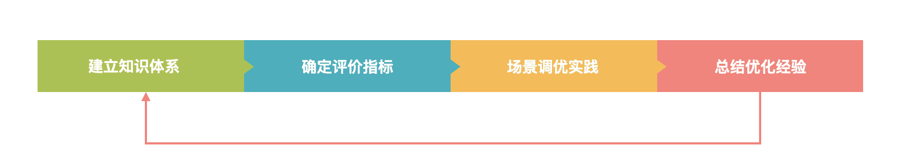 |
| :----------------------------------------------------------: |


**建立知识体系**： 从 JVM 的内存结构到垃圾收集的算法和收集器，学习 GC 的基础知识，掌握一些常用的 GC 问题分析工具。

**确定评价指标**： 了解基本 GC 的评价方法，摸清如何设定独立系统的指标，以及在业务场景中判断 GC 是否存在问题的手段。

**场景调优实践**： 运用掌握的知识和系统评价指标，分析与解决九种 CMS 中常见 GC 问题场景。

**总结优化经验**： 对整体过程做总结并提出笔者的几点建议，同时将总结到的经验完善到知识体系之中。


### GC 基础

在正式开始前，先做些简要铺垫，介绍下 JVM 内存划分、收集算法、收集器等常用概念介绍，基础比较好的同学可以直接跳过这部分。

#### 基础概念

- **GC**： GC 本身有三种语义，下文需要根据具体场景带入不同的语义：
    - **Garbage Collection**：垃圾收集技术，名词。
    - **Garbage Collector**：垃圾收集器，名词。
    - **Garbage Collecting**：垃圾收集动作，动词。
- **Mutator**： 生产垃圾的角色，也就是的应用程序，垃圾制造者，通过 Allocator 进行 allocate 和 free。
- **TLAB**： Thread Local Allocation Buffer 的简写，基于 CAS 的独享线程（Mutator Threads）可以优先将对象分配在 Eden 中的一块内存，因为是 Java 线程独享的内存区没有锁竞争，所以分配速度更快，每个 TLAB 都是一个线程独享的。
- **Card Table**： 中文翻译为卡表，主要是用来标记卡页的状态，每个卡表项对应一个卡页。当卡页中一个对象引用有写操作时，写屏障将会标记对象所在的卡表状态改为 dirty，卡表的本质是用来解决跨代引用的问题。


#### JVM 内存划分

从 JCP（Java Community Process）的官网中可以看到，目前 Java 版本最新已经到了 Java 16，未来的 Java 17 以及现在的 Java 11 和 Java 8 是 LTS 版本，JVM 规范也在随着迭代在变更，由于本文主要讨论 CMS，此处还是放 Java 8 的内存结构。

| 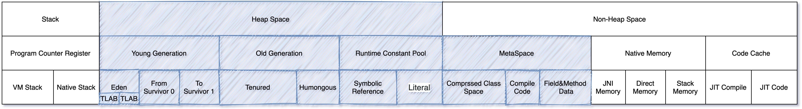 |
| :----------------------------------------------------------: |


GC 主要工作在 Heap 区和 MetaSpace 区（上图蓝色部分），在 Direct Memory 中，如果使用的是 DirectByteBuffer，那么在分配内存不够时则是 GC 通过 Cleanerclean 间接管理。

任何自动内存管理系统都会面临的步骤：为新对象分配空间，然后收集垃圾对象空间，下面就展开介绍一下这些基础知识。


#### 分配对象

Java 中对象地址操作主要使用 Unsafe 调用了 C 的 allocate 和 free 两个方法，分配方法有两种：

- **空闲链表**（free list）： 通过额外的存储记录空闲的地址，将随机 IO 变为顺序 IO，但带来了额外的空间消耗。
- **碰撞指针**（bump pointer）： 通过一个指针作为分界点，需要分配内存时，仅需把指针往空闲的一端移动与对象大小相等的距离，分配效率较高，但使用场景有限。


#### 收集对象

##### 识别垃圾

**引用计数法**（Reference Counting）： 对每个对象的引用进行计数，每当有一个地方引用它时计数器 +1、引用失效则 -1，引用的计数放到对象头中，大于 0 的对象被认为是存活对象。虽然循环引用的问题可通过 Recycler 算法解决，但是在多线程环境下，引用计数变更也要进行昂贵的同步操作，性能较低，早期的编程语言会采用此算法。

**可达性分析**，又称引用链法（Tracing GC）： 从 GC Root 开始进行对象搜索，可以被搜索到的对象即为可达对象，此时还不足以判断对象是否存活/死亡，需要经过多次标记才能更加准确地确定，整个连通图之外的对象便可以作为垃圾被回收掉。目前 Java 中主流的虚拟机均采用此算法。

> 备注：引用计数法是可以处理循环引用问题的，下次面试时不要再这么说啦~ ~


##### 收集算法

自从有自动内存管理出现之时就有的一些收集算法，不同的收集器也是在不同场景下进行组合。

**Mark-Sweep**（标记-清除）： 回收过程主要分为两个阶段，第一阶段为追踪（Tracing）阶段，即从 GC Root 开始遍历对象图，并标记（Mark）所遇到的每个对象，第二阶段为清除（Sweep）阶段，即回收器检查堆中每一个对象，并将所有未被标记的对象进行回收，整个过程不会发生对象移动。整个算法在不同的实现中会使用三色抽象（Tricolour Abstraction）、位图标记（BitMap）等技术来提高算法的效率，存活对象较多时较高效。

**Mark-Compact** （标记-整理）： 这个算法的主要目的就是解决在非移动式回收器中都会存在的碎片化问题，也分为两个阶段，第一阶段与 Mark-Sweep 类似，第二阶段则会对存活对象按照整理顺序（Compaction Order）进行整理。主要实现有双指针（Two-Finger）回收算法、滑动回收（Lisp2）算法和引线整理（Threaded Compaction）算法等。

**Copying**（复制）： 将空间分为两个大小相同的 From 和 To 两个半区，同一时间只会使用其中一个，每次进行回收时将一个半区的存活对象通过复制的方式转移到另一个半区。有递归（Robert R. Fenichel 和 Jerome C. Yochelson提出）和迭代（Cheney 提出）算法，以及解决了前两者递归栈、缓存行等问题的近似优先搜索算法。复制算法可以通过碰撞指针的方式进行快速地分配内存，但是也存在着空间利用率不高的缺点，另外就是存活对象比较大时复制的成本比较高。

三种算法在是否移动对象、空间和时间方面的一些对比，假设存活对象数量为 *L*、堆空间大小为 *H*，则：

| 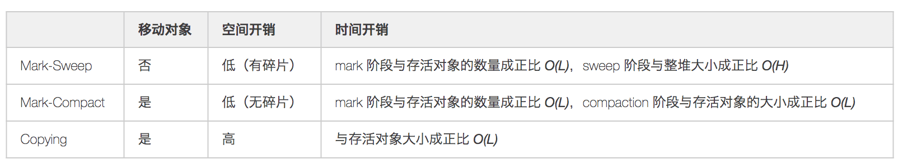 |
| :----------------------------------------------------------: |

把 mark、sweep、compaction、copying 这几种动作的耗时放在一起看，大致有这样的关系：

| 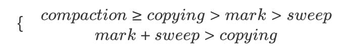 |
| :----------------------------------------------------------: |

虽然 compaction 与 copying 都涉及移动对象，但取决于具体算法，compaction 可能要先计算一次对象的目标地址，然后修正指针，最后再移动对象。copying 则可以把这几件事情合为一体来做，所以可以快一些。另外，还需要留意 GC 带来的开销不能只看 Collector 的耗时，还得看 Allocator 。如果能保证内存没碎片，分配就可以用 pointer bumping 方式，只需要挪一个指针就完成了分配，非常快。而如果内存有碎片就得用 freelist 之类的方式管理，分配速度通常会慢一些。


#### 收集器

目前在 Hotspot VM 中主要有分代收集和分区收集两大类，具体可以看下面的这个图，不过未来会逐渐向分区收集发展。在美团内部，有部分业务尝试用了 ZGC，其余基本都停留在 CMS 和 G1 上。另外在 JDK11 后提供了一个不执行任何垃圾回收动作的回收器 Epsilon（A No-Op Garbage Collector）用作性能分析。另外一个就是 Azul 的 Zing JVM，其 C4（Concurrent Continuously Compacting Collector）收集器也在业内有一定的影响力。

| 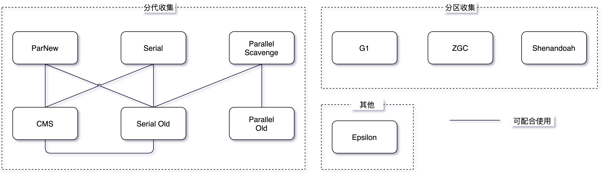 |
| :----------------------------------------------------------: |


> 备注：值得一提的是，早些年国内 GC 技术的布道者 RednaxelaFX （江湖人称 R 大）也曾就职于 Azul，本文的一部分材料也参考了他的一些文章。


##### 分代收集器

- **ParNew**： 一款多线程的收集器，采用复制算法，主要工作在 Young 区，可以通过 `-XX:ParallelGCThreads` 参数来控制收集的线程数，整个过程都是 STW 的，常与 CMS 组合使用。
- **CMS**： 以获取最短回收停顿时间为目标，采用“标记-清除”算法，分 4 大步进行垃圾收集，其中初始标记和重新标记会 STW ，多数应用于互联网站或者 B/S 系统的服务器端上，JDK9 被标记弃用，JDK14 被删除，详情可见 JEP 363


##### 分区收集器

- **G1**： 一种服务器端的垃圾收集器，应用在多处理器和大容量内存环境中，在实现高吞吐量的同时，尽可能地满足垃圾收集暂停时间的要求。
- **ZGC**： JDK11 中推出的一款低延迟垃圾回收器，适用于大内存低延迟服务的内存管理和回收，SPECjbb 2015 基准测试，在 128G 的大堆下，最大停顿时间才 1.68 ms，停顿时间远胜于 G1 和 CMS。
- **Shenandoah**： 由 Red Hat 的一个团队负责开发，与 G1 类似，基于 Region 设计的垃圾收集器，但不需要 Remember Set 或者 Card Table 来记录跨 Region 引用，停顿时间和堆的大小没有任何关系。停顿时间与 ZGC 接近，下图为与 CMS 和 G1 等收集器的 benchmark。

| 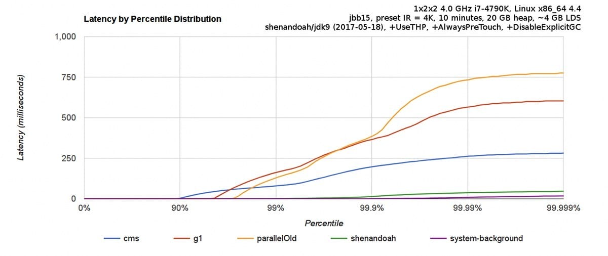 |
| :----------------------------------------------------------: |


##### 常用收集器

目前使用最多的是 CMS 和 G1 收集器，二者都有分代的概念，主要内存结构如下：

| 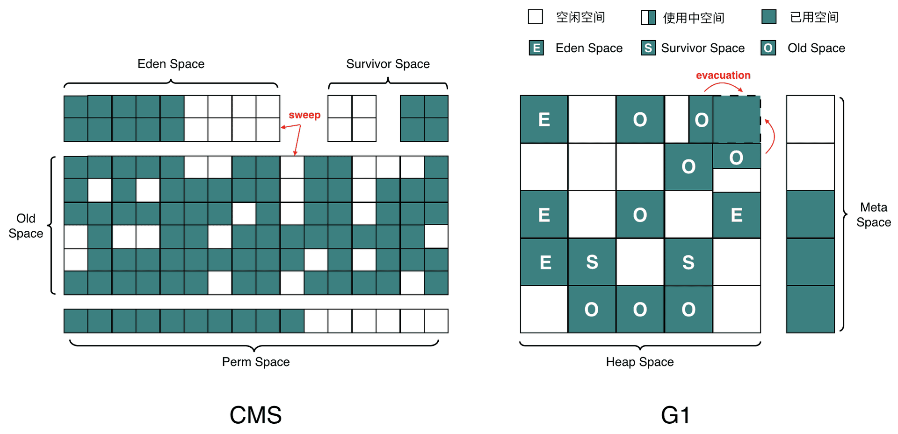 |
| :----------------------------------------------------------: |


##### 其他收集器

以上仅列出常见收集器，除此之外还有很多，如 Metronome、Stopless、Staccato、Chicken、Clover 等实时回收器，Sapphire、Compressor、Pauseless 等并发复制/整理回收器，Doligez-Leroy-Conthier 等标记整理回收器，由于篇幅原因，不在此一一介绍。


#### 常用工具

工欲善其事，必先利其器，此处列出一些笔者常用的工具，具体情况大家可以自由选择，本文的问题都是使用这些工具来定位和分析的。


##### 命令行终端

- 标准终端类：jps、jinfo、jstat、jstack、jmap
- 功能整合类：jcmd、vjtools、arthas、greys


##### 可视化界面

- 简易：JConsole、JVisualvm、HA、GCHisto、GCViewer
- 进阶：MAT、JProfiler
- 命令行推荐 [arthas](https://pdai.tech/md/java/jvm/java-jvm-agent-arthas.html) ，可视化界面推荐 JProfiler，此外还有一些在线的平台 gceasy、heaphero、fastthread ，美团内部的 Scalpel（一款自研的 JVM 问题诊断工具，暂时未开源）也比较好用。


### GC 问题判断

在做 GC 问题排查和优化之前，需要先来明确下到底是不是 GC 直接导致的问题，或者应用代码导致的 GC 异常，最终出现问题。


#### 判断 GC 有没有问题？

##### 设定评价标准

评判 GC 的两个核心指标：

- **延迟（Latency）**： 也可以理解为最大停顿时间，即垃圾收集过程中一次 STW 的最长时间，越短越好，一定程度上可以接受频次的增大，GC 技术的主要发展方向。
- **吞吐量（Throughput）**： 应用系统的生命周期内，由于 GC 线程会占用 Mutator 当前可用的 CPU 时钟周期，吞吐量即为 Mutator 有效花费的时间占系统总运行时间的百分比，例如系统运行了 100 min，GC 耗时 1 min，则系统吞吐量为 99%，吞吐量优先的收集器可以接受较长的停顿。

目前各大互联网公司的系统基本都更追求低延时，避免一次 GC 停顿的时间过长对用户体验造成损失，衡量指标需要结合一下应用服务的 SLA，主要如下两点来判断：

| 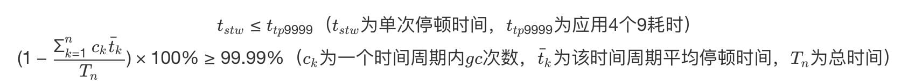 |
| :----------------------------------------------------------: |

简而言之，即为一次停顿的时间不超过应用服务的 TP9999，GC 的吞吐量不小于 99.99%。举个例子，假设某个服务 A 的 TP9999 为 80 ms，平均 GC 停顿为 30 ms，那么该服务的最大停顿时间最好不要超过 80 ms，GC 频次控制在 5 min 以上一次。如果满足不了，那就需要调优或者通过更多资源来进行并联冗余。（大家可以先停下来，看看监控平台上面的 gc.meantime 分钟级别指标，如果超过了 6 ms 那单机 GC 吞吐量就达不到 4 个 9 了。）

> 备注：除了这两个指标之外还有 Footprint（资源量大小测量）、反应速度等指标，互联网这种实时系统追求低延迟，而很多嵌入式系统则追求 Footprint。


##### GC Cause

拿到 GC 日志，就可以简单分析 GC 情况了，通过一些工具，可以比较直观地看到 Cause 的分布情况，如下图就是使用 gceasy 绘制的图表：

| 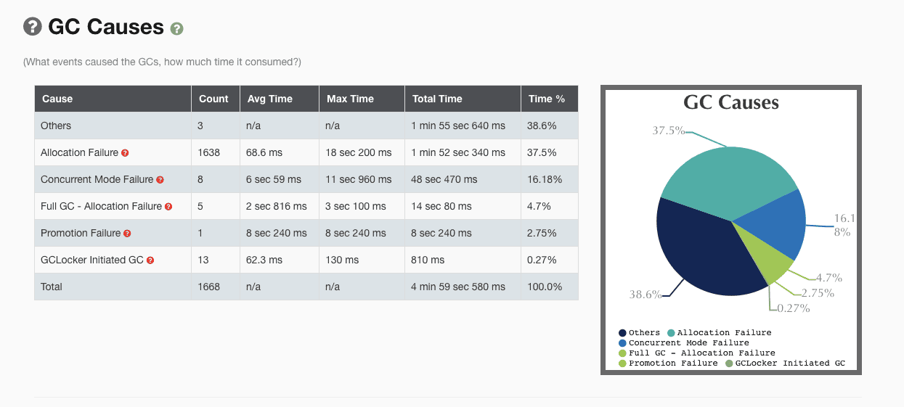 |
| :----------------------------------------------------------: |

如上图所示，很清晰的就能知道是什么原因引起的 GC，以及每次的时间花费情况，但是要分析 GC 的问题，先要读懂 GC Cause，即 JVM 什么样的条件下选择进行 GC 操作，具体 Cause 的分类可以看一下 Hotspot 源码：`src/share/vm/gc/shared/gcCause.hpp 和 src/share/vm/gc/shared/gcCause.cpp` 中。


重点需要关注的几个GC Cause：

- `System.gc()`： 手动触发GC操作。
- `CMS`： CMS GC 在执行过程中的一些动作，重点关注 CMS Initial Mark 和 CMS Final Remark 两个 STW 阶段。
- `Promotion Failure`： Old 区没有足够的空间分配给 Young 区晋升的对象（即使总可用内存足够大）。
- `Concurrent Mode Failure`： CMS GC 运行期间，Old 区预留的空间不足以分配给新的对象，此时收集器会发生退化，严重影响 GC 性能，下面的一个案例即为这种场景。
- `GCLocker Initiated GC`： 如果线程执行在 JNI 临界区时，刚好需要进行 GC，此时 GC Locker 将会阻止 GC 的发生，同时阻止其他线程进入 JNI 临界区，直到最后一个线程退出临界区时触发一次 GC。

什么时机使用这些 Cause 触发回收，大家可以看一下 CMS 的代码，这里就不讨论了，具体在 `/src/hotspot/share/gc/cms/concurrentMarkSweepGeneration.cpp` 中。


#### 判断是不是 GC 引发的问题？

到底是结果（现象）还是原因，在一次 GC 问题处理的过程中，如何判断是 GC 导致的故障，还是系统本身引发 GC 问题。这里继续拿在本文开头提到的一个 Case：“GC 耗时增大、线程 Block 增多、慢查询增多、CPU 负载高等四个表象，如何判断哪个是根因？”，笔者这里根据自己的经验大致整理了四种判断方法供参考：

- **时序分析**： 先发生的事件是根因的概率更大，通过监控手段分析各个指标的异常时间点，还原事件时间线，如先观察到 CPU 负载高（要有足够的时间 Gap），那么整个问题影响链就可能是：CPU 负载高 -> 慢查询增多 -> GC 耗时增大 -> 线程Block增多 -> RT 上涨。
- **概率分析**： 使用统计概率学，结合历史问题的经验进行推断，由近到远按类型分析，如过往慢查的问题比较多，那么整个问题影响链就可能是：慢查询增多 -> GC 耗时增大 -> CPU 负载高 -> 线程 Block 增多 -> RT上涨。
- **实验分析**： 通过故障演练等方式对问题现场进行模拟，触发其中部分条件（一个或多个），观察是否会发生问题，如只触发线程 Block 就会发生问题，那么整个问题影响链就可能是：线程Block增多 -> CPU 负载高 -> 慢查询增多 -> GC 耗时增大 -> RT 上涨。
- **反证分析**： 对其中某一表象进行反证分析，即判断表象的发不发生跟结果是否有相关性，例如从整个集群的角度观察到某些节点慢查和 CPU 都正常，但也出了问题，那么整个问题影响链就可能是：GC 耗时增大 -> 线程 Block 增多 -> RT 上涨。

不同的根因，后续的分析方法是完全不同的。如果是 CPU 负载高那可能需要用火焰图看下热点、如果是慢查询增多那可能需要看下 DB 情况、如果是线程 Block 引起那可能需要看下锁竞争的情况，最后如果各个表象证明都没有问题，那可能 GC 确实存在问题，可以继续分析 GC 问题了。


#### 问题分类导读

##### Mutator 类型

Mutator 的类型根据对象存活时间比例图来看主要分为两种，在弱分代假说中也提到类似的说法，如下图所示 “Survival Time” 表示对象存活时间，“Rate” 表示对象分配比例：

- **IO 交互型**： 互联网上目前大部分的服务都属于该类型，例如分布式 RPC、MQ、HTTP 网关服务等，对内存要求并不大，大部分对象在 TP9999 的时间内都会死亡， Young 区越大越好。
- **MEM 计算型**： 主要是分布式数据计算 Hadoop，分布式存储 HBase、Cassandra，自建的分布式缓存等，对内存要求高，对象存活时间长，Old 区越大越好。

当然，除了二者之外还有介于两者之间的场景，本篇文章主要讨论第一种情况。对象 Survival Time 分布图，对设置 GC 参数有着非常重要的指导意义，如下图就可以简单推算分代的边界。

| 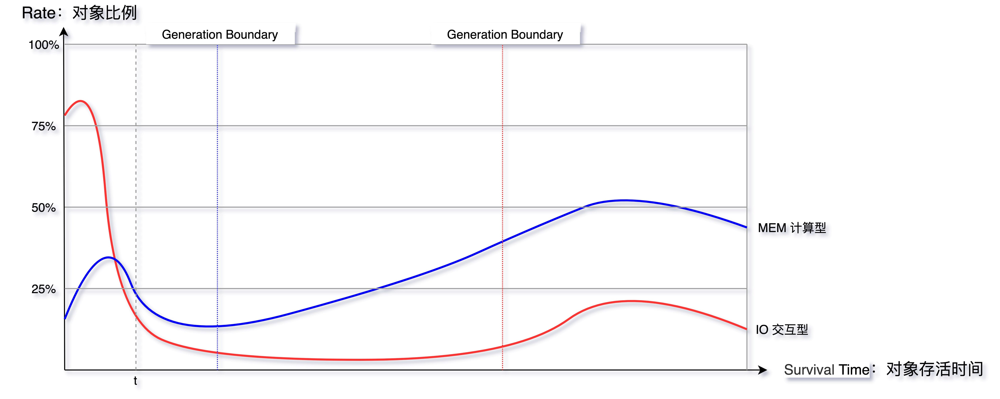 |
| :----------------------------------------------------------: |


##### GC 问题分类

笔者选取了九种不同类型的 GC 问题，覆盖了大部分场景，如果有更好的场景，欢迎在评论区给出。

- **Unexpected GC**： 意外发生的 GC，实际上不需要发生，可以通过一些手段去避免。

    - `Space Shock`： 空间震荡问题，参见“场景一：动态扩容引起的空间震荡”。
    - `Explicit GC`： 显示执行 GC 问题，参见“场景二：显式 GC 的去与留”。

- **Partial GC**： 部分收集操作的 GC，只对某些分代/分区进行回收。

    - ```
        Young GC
        ```

        ： 分代收集里面的 Young 区收集动作，也可以叫做 Minor GC。

        - `ParNew`： Young GC 频繁，参见“场景四：过早晋升”。

    - ```
        Old GC
        ```

        ： 分代收集里面的 Old 区收集动作，也可以叫做 Major GC，有些也会叫做 Full GC，但其实这种叫法是不规范的，在 CMS 发生 Foreground GC 时才是 Full GC，CMSScavengeBeforeRemark 参数也只是在 Remark 前触发一次Young GC。

        - CMS： Old GC 频繁，参见“场景五：CMS Old GC 频繁”。
        - CMS： Old GC 不频繁但单次耗时大，参见“场景六：单次 CMS Old GC 耗时长”。

- **Full GC**： 全量收集的 GC，对整个堆进行回收，STW 时间会比较长，一旦发生，影响较大，也可以叫做 Major GC，参见“场景七：内存碎片&收集器退化”。

- **MetaSpace**： 元空间回收引发问题，参见“场景三：MetaSpace 区 OOM”。

- **Direct Memory**： 直接内存（也可以称作为堆外内存）回收引发问题，参见“场景八：堆外内存 OOM”。

- **JNI**： 本地 Native 方法引发问题，参见“场景九：JNI 引发的 GC 问题”。


##### 排查难度

一个问题的**解决难度跟它的常见程度成反比**，大部分都可以通过各种搜索引擎找到类似的问题，然后用同样的手段尝试去解决。当一个问题在各种网站上都找不到相似的问题时，那么可能会有两种情况，一种这不是一个问题，另一种就是遇到一个隐藏比较深的问题，遇到这种问题可能就要深入到源码级别去调试了。以下 GC 问题场景，排查难度从上到下依次递增。


### 常见场景分析与解决


#### 场景一：动态扩容引起的空间震荡

##### 现象

服务刚刚启动时 GC 次数较多，最大空间剩余很多但是依然发生 GC，这种情况可以通过观察 GC 日志或者通过监控工具来观察堆的空间变化情况即可。GC Cause 一般为 Allocation Failure，且在 GC 日志中会观察到经历一次 GC ，堆内各个空间的大小会被调整，如下图所示：

| 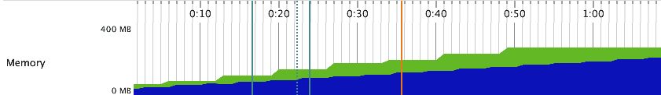 |
| :----------------------------------------------------------: |


##### 原因

在 JVM 的参数中 `-Xms` 和 `-Xmx` 设置的不一致，在初始化时只会初始 `-Xms` 大小的空间存储信息，每当空间不够用时再向操作系统申请，这样的话必然要进行一次 GC。具体是通过 `ConcurrentMarkSweepGeneration::compute_new_size()` 方法计算新的空间大小：


另外，如果空间剩余很多时也会进行缩容操作，JVM 通过 `-XX:MinHeapFreeRatio` 和 `-XX:MaxHeapFreeRatio` 来控制扩容和缩容的比例，调节这两个值也可以控制伸缩的时机，例如扩容便是使用 `GenCollectedHeap::expand_heap_and_allocate()` 来完成的，代码如下：


整个伸缩的模型理解可以看这个图，当 committed 的空间大小超过了低水位/高水位的大小，capacity 也会随之调整：

| 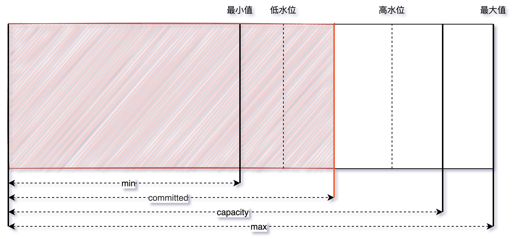 |
| :----------------------------------------------------------: |


##### 策略

**定位**：观察 CMS GC 触发时间点 `Old/MetaSpace `区的 committed 占比是不是一个固定的值，或者像上文提到的观察总的内存使用率也可以。

**解决**：尽量将**成对出现的空间大小配置参数设置成固定**的，如 `-Xms` 和 `-Xmx`，`-XX:MaxNewSize` 和 `-XX:NewSize`，`-XX:MetaSpaceSize` 和 `-XX:MaxMetaSpaceSize` 等。


##### 小结

一般来说，需要保证 Java 虚拟机的堆是稳定的，确保 `-Xms` 和 `-Xmx` 设置的是一个值（即初始值和最大值一致），获得一个稳定的堆，同理在 MetaSpace 区也有类似的问题。不过在不追求停顿时间的情况下震荡的空间也是有利的，可以动态地伸缩以节省空间，例如作为富客户端的 Java 应用。

这个问题虽然初级，但是发生的概率还真不小，尤其是在一些规范不太健全的情况下。


#### 场景二：显式 GC 的去与留

##### 现象

除了扩容缩容会触发 CMS GC 之外，还有 Old 区达到回收阈值、MetaSpace 空间不足、Young 区晋升失败、大对象担保失败等几种触发条件，如果这些情况都没有发生却触发了 GC ？这种情况有可能是代码中手动调用了 System.gc 方法，此时可以找到 GC 日志中的 GC Cause 确认下。那么这种 GC 到底有没有问题，翻看网上的一些资料，有人说可以添加 `-XX:+DisableExplicitGC` 参数来避免这种 GC，也有人说不能加这个参数，加了就会影响 Native Memory 的回收。先说结论，笔者这里建议保留 System.gc，那为什么要保留？一起来分析下。


##### 原因

找到 System.gc 在 Hotspot 中的源码，可以发现增加 `-XX:+DisableExplicitGC` 参数后，这个方法变成了一个空方法，如果没有加的话便会调用 `Universe::heap()::collect` 方法，继续跟进到这个方法中，发现 System.gc 会引发一次 STW 的 Full GC，对整个堆做收集。


**保留 System.gc**

此处补充一个知识点，**CMS GC 共分为 Background 和 Foreground 两种模式**，前者就是常规理解中的并发收集，可以不影响正常的业务线程运行，但 Foreground Collector 却有很大的差异，他会进行一次压缩式 GC。此压缩式 GC 使用的是跟 Serial Old GC 一样的 Lisp2 算法，其使用 Mark-Compact 来做 Full GC，一般称之为 MSC（Mark-Sweep-Compact），它收集的范围是 Java 堆的 Young 区和 Old 区以及 MetaSpace。由上面的算法章节中知道 compact 的代价是巨大的，那么使用 Foreground Collector 时将会带来非常长的 STW。如果在应用程序中 System.gc 被频繁调用，那就非常危险了。

**去掉 System.gc**

如果禁用掉的话就会带来另外一个内存泄漏问题，此时就需要说一下 DirectByteBuffer，它有着零拷贝等特点，被 Netty 等各种 NIO 框架使用，会使用到堆外内存。堆内存由 JVM 自己管理，堆外内存必须要手动释放，DirectByteBuffer 没有 Finalizer，它的 Native Memory 的清理工作是通过 `sun.misc.Cleaner` 自动完成的，是一种基于 PhantomReference 的清理工具，比普通的 Finalizer 轻量些。

为 DirectByteBuffer 分配空间过程中会显式调用 System.gc ，希望通过 Full GC 来强迫已经无用的 DirectByteBuffer 对象释放掉它们关联的 Native Memory，下面为代码实现：

```cpp
// These methods should be called whenever direct memory is allocated or
// freed.  They allow the user to control the amount of direct memory
// which a process may access.  All sizes are specified in bytes.
static void reserveMemory(long size) {

    synchronized (Bits.class) {
        if (!memoryLimitSet && VM.isBooted()) {
            maxMemory = VM.maxDirectMemory();
            memoryLimitSet = true;
        }
        if (size <= maxMemory - reservedMemory) {
            reservedMemory += size;
            return;
        }
    }

    System.gc();
    try {
        Thread.sleep(100);
    } catch (InterruptedException x) {
        // Restore interrupt status
        Thread.currentThread().interrupt();
    }
    synchronized (Bits.class) {
        if (reservedMemory + size > maxMemory)
            throw new OutOfMemoryError("Direct buffer memory");
        reservedMemory += size;
    }

}
```

HotSpot VM 只会在 Old GC 的时候才会对 Old 中的对象做 Reference Processing，而在 Young GC 时只会对 Young 里的对象做 Reference Processing。Young 中的 DirectByteBuffer 对象会在 Young GC 时被处理，也就是说，做 CMS GC 的话会对 Old 做 Reference Processing，进而能触发 Cleaner 对已死的 DirectByteBuffer 对象做清理工作。但如果很长一段时间里没做过 GC 或者只做了 Young GC 的话则不会在 Old 触发 Cleaner 的工作，那么就可能让本来已经死亡，但已经晋升到 Old 的 DirectByteBuffer 关联的 Native Memory 得不到及时释放。这几个实现特征使得依赖于 System.gc 触发 GC 来保证 DirectByteMemory 的清理工作能及时完成。如果打开了 -XX:+DisableExplicitGC，清理工作就可能得不到及时完成，于是就有发生 Direct Memory 的 OOM。


##### 策略

通过上面的分析看到，无论是保留还是去掉都会有一定的风险点，不过目前互联网中的 RPC 通信会大量使用 NIO，所以笔者在这里建议保留。此外 JVM 还提供了 -XX:+ExplicitGCInvokesConcurrent 和 -XX:+ExplicitGCInvokesConcurrentAndUnloadsClasses 参数来将 System.gc 的触发类型从 Foreground 改为 Background，同时 Background 也会做 Reference Processing，这样的话就能大幅降低了 STW 开销，同时也不会发生 NIO Direct Memory OOM。


##### 小结

不止 CMS，在 G1 或 ZGC中开启 `ExplicitGCInvokesConcurrent` 模式，都会采用高性能的并发收集方式进行收集，不过还是建议在代码规范方面也要做好约束，规范好 System.gc 的使用。

> P.S. HotSpot 对 System.gc 有特别处理，最主要的地方体现在一次 System.gc 是否与普通 GC 一样会触发 GC 的统计/阈值数据的更新，HotSpot 里的许多 GC 算法都带有自适应的功能，会根据先前收集的效率来决定接下来的 GC 中使用的参数，但 System.gc 默认不更新这些统计数据，避免用户强行 GC 对这些自适应功能的干扰（可以参考 `-XX:+UseAdaptiveSizePolicyWithSystemGC` 参数，默认是 false）。


#### 场景三：MetaSpace 区 OOM

##### 现象

JVM 在启动后或者某个时间点开始，**MetaSpace 的已使用大小在持续增长，同时每次 GC 也无法释放，调大 MetaSpace 空间也无法彻底解决**。


##### 原因

在讨论为什么会 OOM 之前，先来看一下这个区里面会存什么数据，Java7 之前字符串常量池被放到了 Perm 区，所有被 intern 的 String 都会被存在这里，由于 String.intern 是不受控的，所以 `-XX:MaxPermSize` 的值也不太好设置，经常会出现 `java.lang.OutOfMemoryError: PermGen space` 异常，所以在 Java7 之后常量池等字面量（Literal）、类静态变量（Class Static）、符号引用（Symbols Reference）等几项被移到 Heap 中。而 Java8 之后 PermGen 也被移除，取而代之的是 MetaSpace。

在最底层，JVM 通过 mmap 接口向操作系统申请内存映射，每次申请 2MB 空间，这里是虚拟内存映射，不是真的就消耗了主存的 2MB，只有之后在使用的时候才会真的消耗内存。申请的这些内存放到一个链表中 VirtualSpaceList，作为其中的一个 Node。

在上层，MetaSpace 主要由 Klass Metaspace 和 NoKlass Metaspace 两大部分组成。

- `Klass MetaSpace`： 就是用来存 Klass 的，就是 Class 文件在 JVM 里的运行时数据结构，这部分默认放在 Compressed Class Pointer Space 中，是一块连续的内存区域，紧接着 Heap。Compressed Class Pointer Space 不是必须有的，如果设置了 -XX:-UseCompressedClassPointers，或者 -Xmx 设置大于 32 G，就不会有这块内存，这种情况下 Klass 都会存在 NoKlass Metaspace 里。
- `NoKlass MetaSpace`： 专门来存 Klass 相关的其他的内容，比如 Method，ConstantPool 等，可以由多块不连续的内存组成。虽然叫做 NoKlass Metaspace，但是也其实可以存 Klass 的内容，上面已经提到了对应场景。 具体的定义都可以在源码 `shared/vm/memory/metaspace.hpp` 中找到：


MetaSpace 的对象为什么无法释放，看下面两点：

- **MetaSpace 内存管理**： 类和其元数据的生命周期与其对应的类加载器相同，只要类的类加载器是存活的，在 Metaspace 中的类元数据也是存活的，不能被回收。每个加载器有单独的存储空间，通过 ClassLoaderMetaspace 来进行管理 SpaceManager* 的指针，相互隔离的。
- **MetaSpace 弹性伸缩**： 由于 MetaSpace 空间和 Heap 并不在一起，所以这块的空间可以不用设置或者单独设置，一般情况下避免 MetaSpace 耗尽 VM 内存都会设置一个 MaxMetaSpaceSize，在运行过程中，如果实际大小小于这个值，JVM 就会通过 `-XX:MinMetaspaceFreeRatio` 和 `-XX:MaxMetaspaceFreeRatio` 两个参数动态控制整个 MetaSpace 的大小，具体使用可以看 `MetaSpaceGC::compute_new_size()` 方法（下方代码），这个方法会在 CMSCollector 和 G1CollectorHeap 等几个收集器执行 GC 时调用。这个里面会根据 `used_after_gc`，`MinMetaspaceFreeRatio` 和 `MaxMetaspaceFreeRatio` 这三个值计算出来一个新的 `_capacity_until_GC` 值（水位线）。然后根据实际的 _capacity_until_GC 值使用 `MetaspaceGC::inc_capacity_until_GC()` 和 `MetaspaceGC::dec_capacity_until_GC()` 进行 expand 或 shrink，这个过程也可以参照场景一中的伸缩模型进行理解。


由场景一可知，为了避免弹性伸缩带来的额外 GC 消耗，会将 `-XX:MetaSpaceSize` 和 `-XX:MaxMetaSpaceSize` 两个值设置为固定的，但是这样也会导致在空间不够的时候无法扩容，然后频繁地触发 GC，最终 OOM。所以关键原因就是 ClassLoader 不停地在内存中 load 了新的 Class ，一般这种问题都发生在动态类加载等情况上。


##### 策略

了解大概什么原因后，如何定位和解决就很简单了，可以 dump 快照之后通过 JProfiler 或 MAT 观察 Classes 的 Histogram（直方图） 即可，或者直接通过命令即可定位， jcmd 打几次 Histogram 的图，看一下具体是哪个包下的 Class 增加较多就可以定位了。不过有时候也要结合InstBytes、KlassBytes、Bytecodes、MethodAll 等几项指标综合来看下。如下图便是笔者使用 jcmd 排查到一个 Orika 的问题。

```bash
jcmd <PID> GC.class_stats|awk '{print$13}'|sed  's/\(.*\)\.\(.*\)/\1/g'|sort |uniq -c|sort -nrk1
```

| 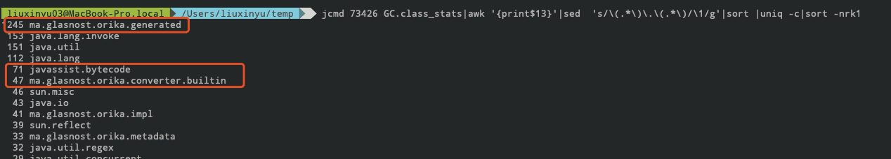 |
| :----------------------------------------------------------: |


如果无法从整体的角度定位，可以添加 `-XX:+TraceClassLoading` 和 `-XX:+TraceClassUnLoading` 参数观察详细的类加载和卸载信息。


##### 小结

原理理解比较复杂，但定位和解决问题会比较简单，经常会出问题的几个点有 Orika 的 classMap、JSON 的 ASMSerializer、Groovy 动态加载类等，基本都集中在反射、Javasisit 字节码增强、CGLIB 动态代理、OSGi 自定义类加载器等的技术点上。另外就是及时给 MetaSpace 区的使用率加一个监控，如果指标有波动提前发现并解决问题。


#### 场景四：过早晋升 

##### 现象

这种场景主要发生在分代的收集器上面，专业的术语称为“Premature Promotion”。90% 的对象朝生夕死，只有在 Young 区经历过几次 GC 的洗礼后才会晋升到 Old 区，每经历一次 GC 对象的 GC Age 就会增长 1，最大通过 `-XX:MaxTenuringThreshold` 来控制。

过早晋升一般不会直接影响 GC，总会伴随着浮动垃圾、大对象担保失败等问题，但这些问题不是立刻发生的，可以观察以下几种现象来判断是否发生了过早晋升。

分配速率接近于晋升速率，对象晋升年龄较小。

GC 日志中出现`“Desired survivor size 107347968 bytes, new threshold 1(max 6)”`等信息，说明此时经历过一次 GC 就会放到 Old 区。

**Full GC 比较频繁**，且经历过一次 GC 之后 Old 区的变化比例非常大。

比如说 Old 区触发的回收阈值是 80%，经历过一次 GC 之后下降到了 10%，这就说明 Old 区的 70% 的对象存活时间其实很短，如下图所示，Old 区大小每次 GC 后从 2.1G 回收到 300M，也就是说回收掉了 1.8G 的垃圾，**只有 300M 的活跃对象**。整个 Heap 目前是 4G，活跃对象只占了不到十分之一。

| 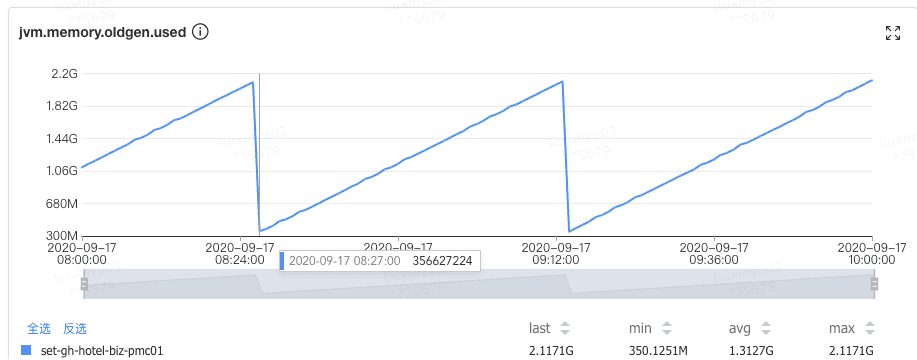 |
| :----------------------------------------------------------: |


过早晋升的危害：

- Young GC 频繁，总的吞吐量下降。
- Full GC 频繁，可能会有较大停顿。


##### 原因

主要的原因有以下两点：

- **Young/Eden 区过小**： 过小的直接后果就是 Eden 被装满的时间变短，本应该回收的对象参与了 GC 并晋升，Young GC 采用的是复制算法，由基础篇知道 copying 耗时远大于 mark，也就是 Young GC 耗时本质上就是 copy 的时间（CMS 扫描 Card Table 或 G1 扫描 Remember Set 出问题的情况另说），没来及回收的对象增大了回收的代价，所以 Young GC 时间增加，同时又无法快速释放空间，Young GC 次数也跟着增加。
- **分配速率过大**： 可以观察出问题前后 Mutator 的分配速率，如果有明显波动可以尝试观察网卡流量、存储类中间件慢查询日志等信息，看是否有大量数据被加载到内存中。

同时无法 GC 掉对象还会带来另外一个问题，引发动态年龄计算：JVM 通过 `-XX:MaxTenuringThreshold` 参数来控制晋升年龄，每经过一次 GC，年龄就会加一，达到最大年龄就可以进入 Old 区，最大值为 15（因为 JVM 中使用 4 个比特来表示对象的年龄）。设定固定的 MaxTenuringThreshold 值作为晋升条件：

- `MaxTenuringThreshold` 如果设置得过大，原本应该晋升的对象一直停留在 Survivor 区，直到 Survivor 区溢出，一旦溢出发生，Eden + Survivor 中对象将不再依据年龄全部提升到 Old 区，这样对象老化的机制就失效了。
- `MaxTenuringThreshold` 如果设置得过小，过早晋升即对象不能在 Young 区充分被回收，大量短期对象被晋升到 Old 区，Old 区空间迅速增长，引起频繁的 Major GC，分代回收失去了意义，严重影响 GC 性能。

相同应用在不同时间的表现不同，特殊任务的执行或者流量成分的变化，都会导致对象的生命周期分布发生波动，那么固定的阈值设定，因为无法动态适应变化，会造成和上面问题，所以 Hotspot 会使用动态计算的方式来调整晋升的阈值。

具体动态计算可以看一下 Hotspot 源码，具体在 `/src/hotspot/share/gc/shared/ageTable.cpp` 的 `compute_tenuring_threshold`方法中：


可以看到 Hotspot 遍历所有对象时，从所有年龄为 0 的对象占用的空间开始累加，如果加上年龄等于 n 的所有对象的空间之后，使用 Survivor 区的条件值（TargetSurvivorRatio / 100，TargetSurvivorRatio 默认值为 50）进行判断，若大于这个值则结束循环，将 n 和 MaxTenuringThreshold 比较，若 n 小，则阈值为 n，若 n 大，则只能去设置最大阈值为 MaxTenuringThreshold。**动态年龄触发后导致更多的对象进入了 Old 区，造成资源浪费**。


##### 策略

知道问题原因后就有解决的方向，如果是 **Young/Eden 区过小**，可以在总的 Heap 内存不变的情况下适当增大 Young 区，具体怎么增加？一般情况下 Old 的大小应当为活跃对象的 2~3 倍左右，考虑到浮动垃圾问题最好在 3 倍左右，剩下的都可以分给 Young 区。

拿笔者的一次典型过早晋升优化来看，原配置为 Young 1.2G + Old 2.8G，通过观察 CMS GC 的情况找到存活对象大概为 300~400M，于是调整 Old 1.5G 左右，剩下 2.5G 分给 Young 区。仅仅调了一个 Young 区大小参数（-Xmn），整个 JVM 一分钟 Young GC 从 26 次降低到了 11 次，单次时间也没有增加，总的 GC 时间从 1100ms 降低到了 500ms，CMS GC 次数也从 40 分钟左右一次降低到了 7 小时 30 分钟一次。

| 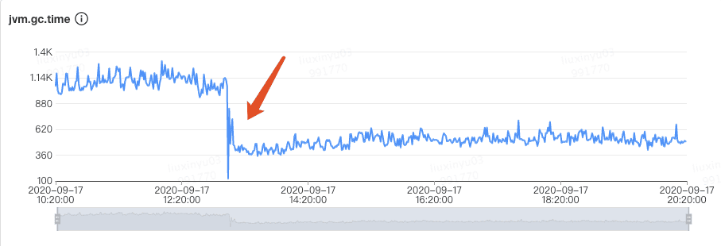 |
| :----------------------------------------------------------- |


如果是分配速率过大：

- **偶发较大**：通过内存分析工具找到问题代码，从业务逻辑上做一些优化。
- **一直较大**：当前的 Collector 已经不满足 Mutator 的期望了，这种情况要么扩容 Mutator 的 VM，要么调整 GC 收集器类型或加大空间。


##### 小结

过早晋升问题一般不会特别明显，但日积月累之后可能会爆发一波收集器退化之类的问题，所以还是要提前避免掉的，可以看看自己系统里面是否有这些现象，如果比较匹配的话，可以尝试优化一下。一行代码优化的 ROI 还是很高的。

如果在观察 Old 区前后比例变化的过程中，发现可以回收的比例非常小，如从 80% 只回收到了 60%，说明大部分对象都是存活的，Old 区的空间可以适当调大些。


##### 加餐

关于在调整 Young 与 Old 的比例时，如何选取具体的 NewRatio 值，这里将问题抽象成为一个蓄水池模型，找到以下关键衡量指标，大家可以根据自己场景进行推算。

| 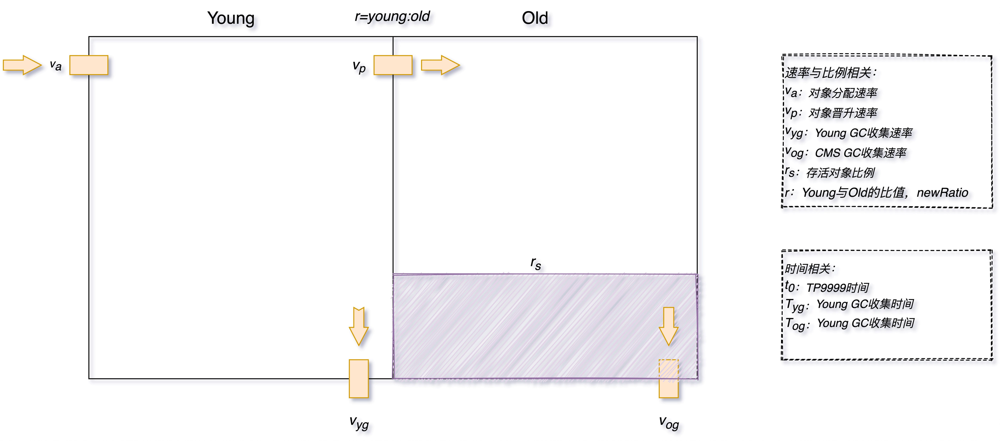 |
| :----------------------------------------------------------: |
| 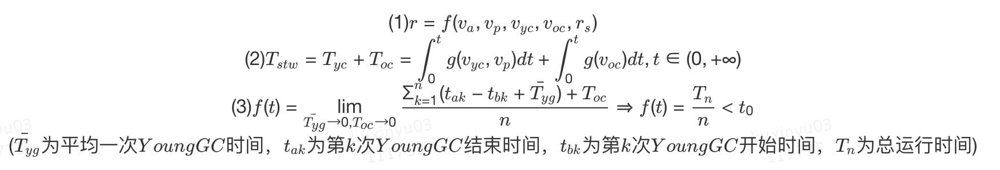 |

- `NewRatio` 的值 r 与 va、vp、vyc、voc、rs 等值存在一定函数相关性（rs 越小 r 越大、r 越小 vp 越小，…，之前尝试使用 NN 来辅助建模，但目前还没有完全算出具体的公式，有想法的同学可以在评论区给出你的答案）。
- 总停顿时间 T 为 Young GC 总时间 Tyc 和 Old GC 总时间 Toc 之和，其中 Tyc 与 vyc 和 vp 相关，Toc 与 voc相关。
- 忽略掉 GC 时间后，两次 Young GC 的时间间隔要大于 TP9999 时间，这样尽量让对象在 Eden 区就被回收，可以减少很多停顿。


#### 场景五：CMS Old GC 频繁*

##### 现象

Old 区频繁的做 CMS GC，但是每次耗时不是特别长，整体最大 STW 也在可接受范围内，但由于 GC 太频繁导致吞吐下降比较多。


##### 原因

这种情况比较常见，基本都是一次 Young GC 完成后，负责处理 CMS GC 的一个后台线程 concurrentMarkSweepThread 会不断地轮询，使用 shouldConcurrentCollect() 方法做一次检测，判断是否达到了回收条件。如果达到条件，使用 collect_in_background() 启动一次 Background 模式 GC。轮询的判断是使用 sleepBeforeNextCycle() 方法，间隔周期为 -XX:CMSWaitDuration 决定，默认为2s。

分析其中逻辑判断是否触发 GC，分为以下几种情况：

- **触发 CMS GC**： 通过调用 `_collector->collect_in_background()` 进行触发 Background GC 。
    - CMS 默认采用 JVM 运行时的统计数据判断是否需要触发 CMS GC，如果需要根据 `-XX:CMSInitiatingOccupancyFraction` 的值进行判断，需要设置参数 -XX:+UseCMSInitiatingOccupancyOnly。
    - 如果开启了 `-XX:UseCMSInitiatingOccupancyOnly` 参数，判断当前 Old 区使用率是否大于阈值，则触发 CMS GC，该阈值可以通过参数 `-XX:CMSInitiatingOccupancyFraction` 进行设置，如果没有设置，默认为 92%。
    - 如果之前的 Young GC 失败过，或者下次 Young 区执行 Young GC 可能失败，这两种情况下都需要触发 CMS GC。
    - CMS 默认不会对 MetaSpace 或 Perm 进行垃圾收集，如果希望对这些区域进行垃圾收集，需要设置参数 `-XX:+CMSClassUnloadingEnabled`。
- **触发 Full GC**： 直接进行 Full GC，这种情况到场景七中展开说明。
    - 如果 _full_gc_requested 为真，说明有明确的需求要进行 GC，比如调用 System.gc。
    - 在 Eden 区为对象或 TLAB 分配内存失败，导致一次 Young GC，在 GenCollectorPolicy 类的 satisfy_failed_allocation() 方法中进行判断。

大家可以看一下源码中的日志打印，通过日志就可以比较清楚地知道具体的原因，然后就可以着手分析了。


##### 策略

这里还是拿最常见的达到回收比例这个场景来说，与过早晋升不同的是这些对象确实存活了一段时间，Survival Time 超过了 TP9999 时间，但是又达不到长期存活，如各种数据库、网络链接，带有失效时间的缓存等。

处理这种常规内存泄漏问题基本是一个思路，主要步骤如下：

| 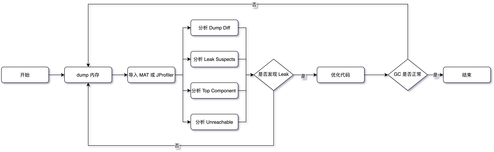 |
| :----------------------------------------------------------: |


Dump Diff 和 Leak Suspects 比较直观就不介绍了，这里说下其它几个关键点：

- **内存 Dump**： 使用 jmap、arthas 等 dump 堆进行快照时记得摘掉流量，同时分别在 CMS GC 的发生前后分别 dump 一次。
- **分析 Top Component**： 要记得按照对象、类、类加载器、包等多个维度观察 Histogram，同时使用 outgoing 和 incoming 分析关联的对象，另外就是 Soft Reference 和 Weak Reference、Finalizer 等也要看一下。
- **分析 Unreachable**： 重点看一下这个，关注下 Shallow 和 Retained 的大小。如下图所示，笔者之前一次 GC 优化，就根据 Unreachable Objects 发现了 Hystrix 的滑动窗口问题。

| 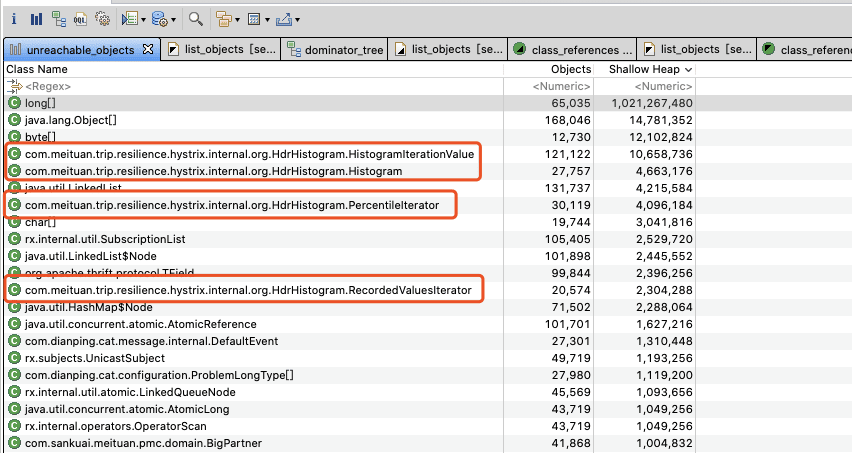 |
| :----------------------------------------------------------: |


##### 小结

经过整个流程下来基本就能定位问题了，不过在优化的过程中记得使用**控制变量**的方法来优化，防止一些会加剧问题的改动被掩盖。


#### 场景六：单次 CMS Old GC 耗时长*

##### 现象

CMS GC 单次 STW 最大超过 1000ms，不会频繁发生，如下图所示最长达到了 8000ms。某些场景下会引起“雪崩效应”，这种场景非常危险，应该尽量避免出现。

| 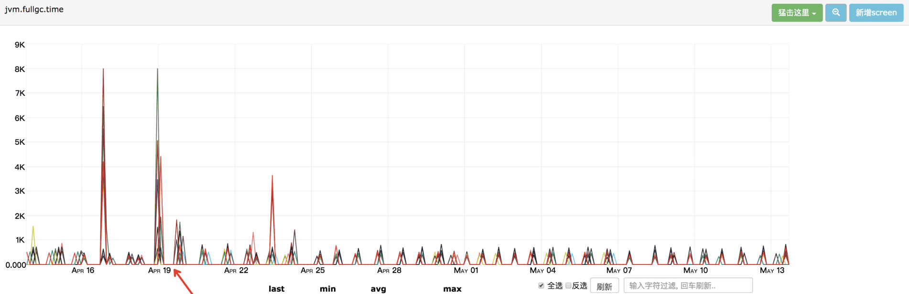 |
| :----------------------------------------------------------: |


##### 原因

CMS 在回收的过程中，STW 的阶段主要是 Init Mark 和 Final Remark 这两个阶段，也是导致 CMS Old GC 最多的原因，另外有些情况就是在 STW 前等待 Mutator 的线程到达 SafePoint 也会导致时间过长，但这种情况较少，在此处主要讨论前者。发生收集器退化或者碎片压缩的场景请看场景七。

想要知道这两个阶段为什么会耗时，需要先看一下这两个阶段都会干什么。

核心代码都在 /src/hotspot/share/gc/cms/concurrentMarkSweepGeneration.cpp 中，内部有个线程 ConcurrentMarkSweepThread 轮询来校验，Old 区的垃圾回收相关细节被完全封装在 CMSCollector 中，调用入口就是 ConcurrentMarkSweepThread 调用的 `CMSCollector::collect_in_background` 和 ConcurrentMarkSweepGeneration 调用的 `CMSCollector::collect` 方法，此处讨论大多数场景的 collect_in_background。整个过程中会 STW 的主要是 initial Mark 和 Final Remark，核心代码在 VM_CMS_Initial_Mark / VM_CMS_Final_Remark 中，执行时需要将执行权交由 VMThread 来执行。

- CMS Init Mark执行步骤，实现在 CMSCollector::checkpointRootsInitialWork() 和 CMSParInitialMarkTask::work 中，整体步骤和代码如下：

|  |
| :----------------------------------: |


整个过程比较简单，从 GC Root 出发标记 Old 中的对象，处理完成后借助 BitMap 处理下 Young 区对 Old 区的引用，整个过程基本都比较快，很少会有较大的停顿。

- CMS Final Remark 执行步骤，实现在 `CMSCollector::checkpointRootsFinalWork()` 中，整体代码和步骤如下：

|  |
| :----------------------------------: |

Final Remark 是最终的第二次标记，这种情况只有在 Background GC 执行了 InitialMarking 步骤的情形下才会执行，如果是 Foreground GC 执行的 InitialMarking 步骤则不需要再次执行 FinalRemark。Final Remark 的开始阶段与 Init Mark 处理的流程相同，但是后续多了 Card Table 遍历、Reference 实例的清理并将其加入到 Reference 维护的 pend_list 中，如果要收集元数据信息，还要清理 SystemDictionary、CodeCache、SymbolTable、StringTable 等组件中不再使用的资源。


##### 策略

知道了两个 STW 过程执行流程，分析解决就比较简单了，由于大部分问题都出在 Final Remark 过程，这里也拿这个场景来举例，主要步骤：

+【**方向**】 观察详细 GC 日志，找到出问题时 Final Remark 日志，分析下 Reference 处理和元数据处理 real 耗时是否正常，详细信息需要通过 -XX:+PrintReferenceGC 参数开启。基本在日志里面就能定位到大概是哪个方向出了问题，耗时超过 10% 的就需要关注。

```bash
2019-02-27T19:55:37.920+0800: 516952.915: [GC (CMS Final Remark) 516952.915: [ParNew516952.939: [SoftReference, 0 refs, 0.0003857 secs]516952.939: [WeakReference, 1362 refs, 0.0002415 secs]516952.940: [FinalReference, 146 refs, 0.0001233 secs]516952.940: [PhantomReference, 0 refs, 57 refs, 0.0002369 secs]516952.940: [JNI Weak Reference, 0.0000662 secs]
[class unloading, 0.1770490 secs]516953.329: [scrub symbol table, 0.0442567 secs]516953.373: [scrub string table, 0.0036072 secs][1 CMS-remark: 1638504K(2048000K)] 1667558K(4352000K), 0.5269311 secs] [Times: user=1.20 sys=0.03, real=0.53 secs]
```

+【**根因**】 有了具体的方向就可以进行深入的分析，一般来说最容易出问题的地方就是 Reference 中的 FinalReference 和元数据信息处理中的 scrub symbol table 两个阶段，想要找到具体问题代码就需要内存分析工具 MAT 或 JProfiler 了，注意要 dump 即将开始 CMS GC 的堆。在用 MAT 等工具前也可以先用命令行看下对象 Histogram，有可能直接就能定位问题。

- 对 FinalReference 的分析主要观察 `java.lang.ref.Finalizer` 对象的 dominator tree，找到泄漏的来源。经常会出现问题的几个点有 Socket 的 SocksSocketImpl 、Jersey 的 ClientRuntime、MySQL 的 ConnectionImpl 等等。
- scrub symbol table 表示清理元数据符号引用耗时，符号引用是 Java 代码被编译成字节码时，方法在 JVM 中的表现形式，生命周期一般与 Class 一致，当 `_should_unload_classes` 被设置为 true 时在 `CMSCollector::refProcessingWork()` 中与 Class Unload、String Table 一起被处理。

```cpp

```

+【**策略**】 知道 GC 耗时的根因就比较好处理了，这种问题不会大面积同时爆发，不过有很多时候单台 STW 的时间会比较长，如果业务影响比较大，及时摘掉流量，具体后续优化策略如下：

- FinalReference：找到内存来源后通过优化代码的方式来解决，如果短时间无法定位可以增加 -XX:+ParallelRefProcEnabled 对 Reference 进行并行处理。
- symbol table：观察 MetaSpace 区的历史使用峰值，以及每次 GC 前后的回收情况，一般没有使用动态类加载或者 DSL 处理等，MetaSpace 的使用率上不会有什么变化，这种情况可以通过 `-XX:-CMSClassUnloadingEnabled` 来避免 MetaSpace 的处理，JDK8 会默认开启 CMSClassUnloadingEnabled，这会使得 CMS 在 CMS-Remark 阶段尝试进行类的卸载。


##### 小结

正常情况进行的 Background CMS GC，出现问题基本都集中在 Reference 和 Class 等元数据处理上，在 Reference 类的问题处理方面，不管是 FinalReference，还是 SoftReference、WeakReference 核心的手段就是找准时机 dump 快照，然后用内存分析工具来分析。Class 处理方面目前除了关闭类卸载开关，没有太好的方法。

在 G1 中同样有 Reference 的问题，可以观察日志中的 Ref Proc，处理方法与 CMS 类似。


#### 场景七：内存碎片&收集器退化

##### 现象

并发的 CMS GC 算法，退化为 Foreground 单线程串行 GC 模式，STW 时间超长，有时会长达十几秒。其中 CMS 收集器退化后单线程串行 GC 算法有两种：

- 带压缩动作的算法，称为 MSC，上面介绍过，使用标记-清理-压缩，单线程全暂停的方式，对整个堆进行垃圾收集，也就是真正意义上的 Full GC，暂停时间要长于普通 CMS。
- 不带压缩动作的算法，收集 Old 区，和普通的 CMS 算法比较相似，暂停时间相对 MSC 算法短一些。


##### 原因

CMS 发生收集器退化主要有以下几种情况：

**晋升失败（Promotion Failed）**

顾名思义，晋升失败就是指在进行 Young GC 时，Survivor 放不下，对象只能放入 Old，但此时 Old 也放不下。直觉上乍一看这种情况可能会经常发生，但其实因为有 concurrentMarkSweepThread 和担保机制的存在，发生的条件是很苛刻的，除非是短时间将 Old 区的剩余空间迅速填满，例如上文中说的动态年龄判断导致的过早晋升（见下文的增量收集担保失败）。另外还有一种情况就是内存碎片导致的 Promotion Failed，Young GC 以为 Old 有足够的空间，结果到分配时，晋级的大对象找不到连续的空间存放。

使用 CMS 作为 GC 收集器时，运行过一段时间的 Old 区如下图所示，清除算法导致内存出现多段的不连续，出现大量的内存碎片。

| 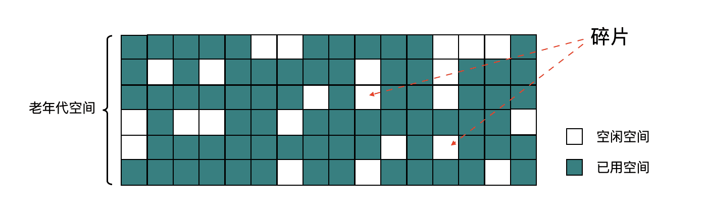 |
| :----------------------------------: |


碎片带来了两个问题：

- **空间分配效率较低**：上文已经提到过，如果是连续的空间 JVM 可以通过使用 pointer bumping 的方式来分配，而对于这种有大量碎片的空闲链表则需要逐个访问 freelist 中的项来访问，查找可以存放新建对象的地址。
- **空间利用效率变低**：Young 区晋升的对象大小大于了连续空间的大小，那么将会触发 Promotion Failed ，即使整个 Old 区的容量是足够的，但由于其不连续，也无法存放新对象，也就是本文所说的问题。 增量收集担保失败

分配内存失败后，会判断统计得到的 Young GC 晋升到 Old 的平均大小，以及当前 Young 区已使用的大小也就是最大可能晋升的对象大小，是否大于 Old 区的剩余空间。只要 CMS 的剩余空间比前两者的任意一者大，CMS 就认为晋升还是安全的，反之，则代表不安全，不进行Young GC，直接触发Full GC。

**显式 GC**

这种情况参见场景二。

**并发模式失败（Concurrent Mode Failure）**

最后一种情况，也是发生概率较高的一种，在 GC 日志中经常能看到 Concurrent Mode Failure 关键字。这种是由于并发 Background CMS GC 正在执行，同时又有 Young GC 晋升的对象要放入到了 Old 区中，而此时 Old 区空间不足造成的。

为什么 CMS GC 正在执行还会导致收集器退化呢？主要是由于 CMS 无法处理浮动垃圾（Floating Garbage）引起的。CMS 的并发清理阶段，Mutator 还在运行，因此不断有新的垃圾产生，而这些垃圾不在这次清理标记的范畴里，无法在本次 GC 被清除掉，这些就是浮动垃圾，除此之外在 Remark 之前那些断开引用脱离了读写屏障控制的对象也算浮动垃圾。所以 Old 区回收的阈值不能太高，否则预留的内存空间很可能不够，从而导致 Concurrent Mode Failure 发生。


##### 策略

分析到具体原因后，就可以针对性解决了，具体思路还是从根因出发，具体解决策略：

- **内存碎片**： 通过配置 -XX:UseCMSCompactAtFullCollection=true 来控制 Full GC的过程中是否进行空间的整理（默认开启，注意是Full GC，不是普通CMS GC），以及 -XX: CMSFullGCsBeforeCompaction=n 来控制多少次 Full GC 后进行一次压缩。
- **增量收集**： 降低触发 CMS GC 的阈值，即参数 -XX:CMSInitiatingOccupancyFraction 的值，让 CMS GC 尽早执行，以保证有足够的连续空间，也减少 Old 区空间的使用大小，另外需要使用 -XX:+UseCMSInitiatingOccupancyOnly 来配合使用，不然 JVM 仅在第一次使用设定值，后续则自动调整。
- **浮动垃圾**： 视情况控制每次晋升对象的大小，或者缩短每次 CMS GC 的时间，必要时可调节 NewRatio 的值。另外就是使用 -XX:+CMSScavengeBeforeRemark 在过程中提前触发一次 Young GC，防止后续晋升过多对象。

#### 小结

正常情况下触发并发模式的 CMS GC，停顿非常短，对业务影响很小，但 CMS GC 退化后，影响会非常大，建议发现一次后就彻底根治。只要能定位到内存碎片、浮动垃圾、增量收集相关等具体产生原因，还是比较好解决的，关于内存碎片这块，如果 -XX:CMSFullGCsBeforeCompaction 的值不好选取的话，可以使用 -XX:PrintFLSStatistics 来观察内存碎片率情况，然后再设置具体的值。

最后就是在编码的时候也要避免需要连续地址空间的大对象的产生，如过长的字符串，用于存放附件、序列化或反序列化的 byte 数组等，还有就是过早晋升问题尽量在爆发问题前就避免掉。


#### 场景八：堆外内存 OOM

##### 现象

内存使用率不断上升，甚至开始使用 SWAP 内存，同时可能出现 GC 时间飙升，线程被 Block 等现象，通过 top 命令发现 Java 进程的 RES 甚至超过了 -Xmx 的大小。出现这些现象时，基本可以确定是出现了堆外内存泄漏。


##### 原因

JVM 的堆外内存泄漏，主要有两种的原因：

- 通过 `UnSafeallocateMemory，ByteBufferallocateDirect` 主动申请了堆外内存而没有释放，常见于 NIO、Netty 等相关组件。
- 代码中有通过 JNI 调用 Native Code 申请的内存没有释放。


##### 策略

哪种原因造成的堆外内存泄漏？

首先，需要确定是哪种原因导致的堆外内存泄漏。这里可以使用 [NMT在新窗口打开](https://docs.oracle.com/javase/8/docs/technotes/guides/troubleshoot/tooldescr007.html)（NativeMemoryTracking） 进行分析。在项目中添加 -XX:NativeMemoryTracking=detail JVM参数后重启项目（需要注意的是，打开 NMT 会带来 5%~10% 的性能损耗）。使用命令 jcmd pid VM.native_memory detail 查看内存分布。重点观察 total 中的 committed，因为 jcmd 命令显示的内存包含堆内内存、Code 区域、通过 Unsafe.allocateMemory 和 DirectByteBuffer 申请的内存，但是不包含其他 Native Code（C 代码）申请的堆外内存。

如果 total 中的 committed 和 top 中的 RES 相差不大，则应为主动申请的堆外内存未释放造成的，如果相差较大，则基本可以确定是 JNI 调用造成的。

- **原因一：主动申请未释放**

JVM 使用 `-XX:MaxDirectMemorySize=size` 参数来控制可申请的堆外内存的最大值。在 Java8 中，如果未配置该参数，默认和 -Xmx 相等。

NIO 和 Netty 都会取 -XX:MaxDirectMemorySize 配置的值，来限制申请的堆外内存的大小。NIO 和 Netty 中还有一个计数器字段，用来计算当前已申请的堆外内存大小，NIO 中是 java.nio.BitstotalCapacity、Netty 中 io.netty.util.internal.PlatformDependentDIRECT_MEMORY_COUNTER。

当申请堆外内存时，NIO 和 Netty 会比较计数器字段和最大值的大小，如果计数器的值超过了最大值的限制，会抛出 OOM 的异常。

NIO 中是：OutOfMemoryError: Direct buffer memory。

Netty 中是：OutOfDirectMemoryError: failed to allocate capacity byte(s) of direct memory (used: usedMemory , max: DIRECT_MEMORY_LIMIT )。

可以检查代码中是如何使用堆外内存的，NIO 或者是 Netty，通过反射，获取到对应组件中的计数器字段，并在项目中对该字段的数值进行打点，即可准确地监控到这部分堆外内存的使用情况。

此时，可以通过 Debug 的方式确定使用堆外内存的地方是否正确执行了释放内存的代码。另外，需要检查 JVM 的参数是否有 -XX:+DisableExplicitGC 选项，如果有就去掉，因为该参数会使 System.gc 失效。（场景二：显式 GC 的去与留）

- **原因二：通过 JNI 调用的 Native Code 申请的内存未释放**

这种情况排查起来比较困难，可以通过 Google perftools + Btrace 等工具，帮助分析出问题的代码在哪里。

gperftools 是 Google 开发的一款非常实用的工具集，它的原理是在 Java 应用程序运行时，当调用 malloc 时换用它的 libtcmalloc.so，这样就能对内存分配情况做一些统计。使用 gperftools 来追踪分配内存的命令。如下图所示，通过 gperftools 发现 Java_java_util_zip_Inflater_init 比较可疑。


接下来可以使用 Btrace，尝试定位具体的调用栈。Btrace 是 Sun 推出的一款 Java 追踪、监控工具，可以在不停机的情况下对线上的 Java 程序进行监控。如下图所示，通过 Btrace 定位出项目中的 ZipHelper 在频繁调用 GZIPInputStream ，在堆外内存分配对象。


最终定位到是，项目中对 GIPInputStream 的使用错误，没有正确的 close()。


除了项目本身的原因，还可能有外部依赖导致的泄漏，如 Netty 和 Spring Boot，详细情况可以学习下这两篇文章，Spring Boot引起的“堆外内存泄漏”排查及经验总结、Netty堆外内存泄露排查盛宴。


##### 小结

首先可以使用 NMT + jcmd 分析泄漏的堆外内存是哪里申请，确定原因后，使用不同的手段，进行原因定位。

| 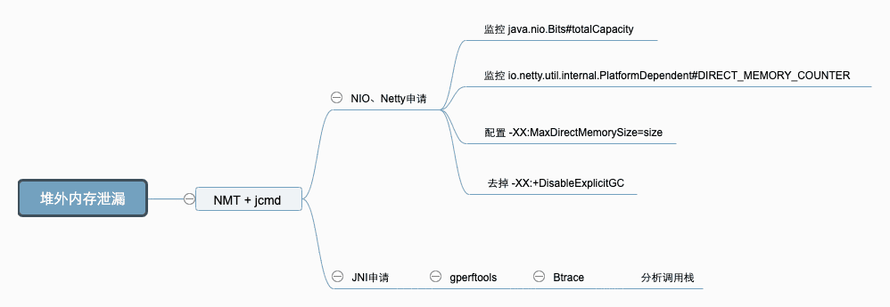 |
| :----------------------------------: |


#### 场景九：JNI 引发的 GC 问题

##### 现象

在 GC 日志中，出现 GC Cause 为 GCLocker Initiated GC。

```bash
2020-09-23T16:49:09.727+0800: 504426.742: [GC (GCLocker Initiated GC) 504426.742: [ParNew (promotion failed): 209716K->6042K(1887488K), 0.0843330 secs] 1449487K->1347626K(3984640K), 0.0848963 secs] [Times: user=0.19 sys=0.00, real=0.09 secs]
2020-09-23T16:49:09.812+0800: 504426.827: [Full GC (GCLocker Initiated GC) 504426.827: [CMS: 1341583K->419699K(2097152K), 1.8482275 secs] 1347626K->419699K(3984640K), [Metaspace: 297780K->297780K(1329152K)], 1.8490564 secs] [Times: user=1.62 sys=0.20, real=1.85 secs]
```


##### 原因

JNI（Java Native Interface）意为 Java 本地调用，它允许 Java 代码和其他语言写的 Native 代码进行交互。

JNI 如果需要获取 JVM 中的 String 或者数组，有两种方式：

- 拷贝传递。
- 共享引用（指针），性能更高。

由于 Native 代码直接使用了 JVM 堆区的指针，如果这时发生 GC，就会导致数据错误。因此，在发生此类 JNI 调用时，禁止 GC 的发生，同时阻止其他线程进入 JNI 临界区，直到最后一个线程退出临界区时触发一次 GC。

GC Locker 实验：

```java
public class GCLockerTest {

  static final int ITERS = 100;
  static final int ARR_SIZE =  10000;
  static final int WINDOW = 10000000;

  static native void acquire(int[] arr);
  static native void release(int[] arr);

  static final Object[] window = new Object[WINDOW];

  public static void main(String... args) throws Throwable {
    System.loadLibrary("GCLockerTest");
    int[] arr = new int[ARR_SIZE];

    for (int i = 0; i < ITERS; i++) {
      acquire(arr);
      System.out.println("Acquired");
      try {
        for (int c = 0; c < WINDOW; c++) {
          window[c] = new Object();
        }
      } catch (Throwable t) {
        // omit
      } finally {
        System.out.println("Releasing");
        release(arr);
      }
    }
  }
}
include <jni.h>
include "GCLockerTest.h"

static jbyte* sink;

JNIEXPORT void JNICALL Java_GCLockerTest_acquire(JNIEnv* env, jclass klass, jintArray arr) {
sink = (*env)->GetPrimitiveArrayCritical(env, arr, 0);
}

JNIEXPORT void JNICALL Java_GCLockerTest_release(JNIEnv* env, jclass klass, jintArray arr) {
(*env)->ReleasePrimitiveArrayCritical(env, arr, sink, 0);
}
```

运行该 JNI 程序，可以看到发生的 GC 都是 GCLocker Initiated GC，并且注意在 “Acquired” 和 “Released” 时不可能发生 GC。


GC Locker 可能导致的不良后果有：

- 如果此时是 Young 区不够 Allocation Failure 导致的 GC，由于无法进行 Young GC，会将对象直接分配至 Old 区。
- 如果 Old 区也没有空间了，则会等待锁释放，导致线程阻塞。
- 可能触发额外不必要的 Young GC，JDK 有一个 Bug，有一定的几率，本来只该触发一次 GCLocker Initiated GC 的 Young GC，实际发生了一次 Allocation Failure GC 又紧接着一次 GCLocker Initiated GC。是因为 GCLocker Initiated GC 的属性被设为 full，导致两次 GC 不能收敛。


##### 策略

- 添加 -XX+PrintJNIGCStalls 参数，可以打印出发生 JNI 调用时的线程，进一步分析，找到引发问题的 JNI 调用。
- JNI 调用需要谨慎，不一定可以提升性能，反而可能造成 GC 问题。
- 升级 JDK 版本到 14，避免导致的重复 GC。


##### 小结

JNI 产生的 GC 问题较难排查，需要谨慎使用。


### 总结

在这里，把整个文章内容总结一下，方便大家整体地理解回顾。


#### 处理流程（SOP）

下图为整体 GC 问题普适的处理流程，重点的地方下面会单独标注，其他的基本都是标准处理流程，此处不再赘述，最后在整个问题都处理完之后有条件的话建议做一下复盘。

| 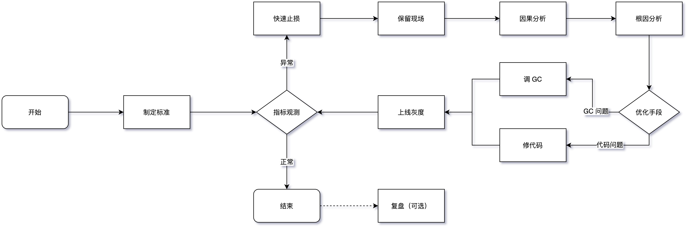 |
| :----------------------------------: |


- **制定标准**： 这块内容其实非常重要，但大部分系统都是缺失的，笔者过往面试的同学中只有不到一成的同学能给出自己的系统 GC 标准到底什么样，其他的都是用的统一指标模板，缺少预见性，具体指标制定可以参考 3.1 中的内容，需要结合应用系统的 TP9999 时间和延迟、吞吐量等设定具体的指标，而不是被问题驱动。
- **保留现场**： 目前线上服务基本都是分布式服务，某个节点发生问题后，如果条件允许一定不要直接操作重启、回滚等动作恢复，优先通过摘掉流量的方式来恢复，这样可以将堆、栈、GC 日志等关键信息保留下来，不然错过了定位根因的时机，后续解决难度将大大增加。当然除了这些，应用日志、中间件日志、内核日志、各种 Metrics 指标等对问题分析也有很大帮助。
- **因果分析**： 判断 GC 异常与其他系统指标异常的因果关系，可以参考笔者在 3.2 中介绍的时序分析、概率分析、实验分析、反证分析等 4 种因果分析法，避免在排查过程中走入误区。
- **根因分析**： 确实是 GC 的问题后，可以借助上文提到的工具并通过 5 why 根因分析法以及跟第三节中的九种常见的场景进行逐一匹配，或者直接参考下文的根因鱼骨图，找出问题发生根因，最后再选择优化手段。


#### 根因鱼骨图

送上一张问题根因鱼骨图，一般情况下在处理一个 GC 问题时，只要能定位到问题的“病灶”，有的放矢，其实就相当于解决了 80%，如果在某些场景下不太好定位，大家可以借助这种根因分析图通过排除法去定位。

| 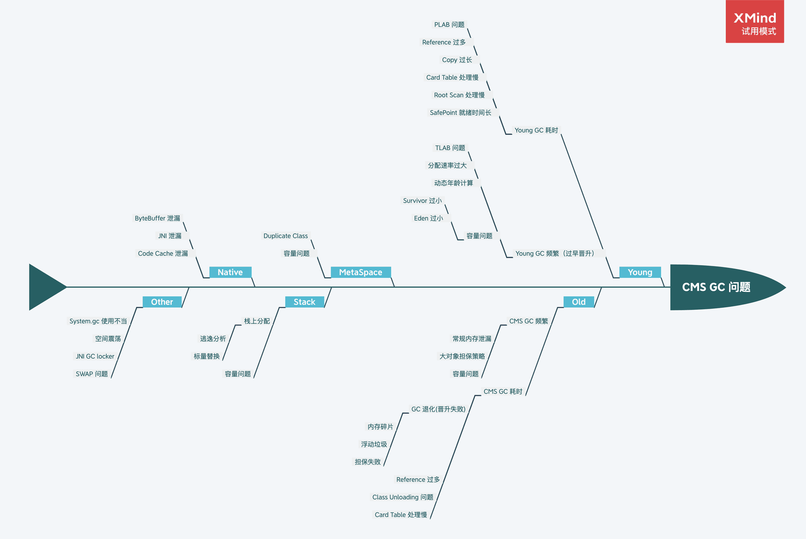 |
| :----------------------------------: |


#### 调优建议

- **Trade Off**： 与 CAP 注定要缺一角一样，GC 优化要在延迟（Latency）、吞吐量（Throughput）、容量（Capacity）三者之间进行权衡。
- **最终手段**： GC 发生问题不是一定要对 JVM 的 GC 参数进行调优，大部分情况下是通过 GC 的情况找出一些业务问题，切记上来就对 GC 参数进行调整，当然有明确配置错误的场景除外。
- **控制变量**： 控制变量法是在蒙特卡洛（Monte Carlo）方法中用于减少方差的一种技术方法，调优的时候尽量也要使用，每次调优过程尽可能只调整一个变量。
- **善用搜索**： 理论上 99.99% 的 GC 问题基本都被遇到了，要学会使用搜索引擎的高级技巧，重点关注 StackOverFlow、Github 上的 Issue、以及各种论坛博客，先看看其他人是怎么解决的，会让解决问题事半功倍。能看到这篇文章，你的搜索能力基本过关了~
- **调优重点**： 总体上来讲，开发的过程中遇到的问题类型也基本都符合正态分布，太简单或太复杂的基本遇到的概率很低，笔者这里将中间最重要的三个场景添加了“*”标识，希望阅读完本文之后可以观察下自己负责的系统，是否存在上述问题。
- **GC 参数**： 如果堆、栈确实无法第一时间保留，一定要保留 GC 日志，这样最起码可以看到 GC Cause，有一个大概的排查方向。关于 GC 日志相关参数，最基本的 -XX:+HeapDumpOnOutOfMemoryError 等一些参数就不再提了，笔者建议添加以下参数，可以提高分析问题的效率。


- **其他建议**： 上文场景中没有提到，但是对 GC 性能也有提升的一些建议。
    - **主动式 GC**： 也有另开生面的做法，通过监控手段监控观测 Old 区的使用情况，即将到达阈值时将应用服务摘掉流量，手动触发一次 Major GC，减少 CMS GC 带来的停顿，但随之系统的健壮性也会减少，如非必要不建议引入。
    - **禁用偏向锁**： 偏向锁在只有一个线程使用到该锁的时候效率很高，但是在竞争激烈情况会升级成轻量级锁，此时就需要先消除偏向锁，这个过程是 STW 的。如果每个同步资源都走这个升级过程，开销会非常大，所以在已知并发激烈的前提下，一般会禁用偏向锁 `-XX:-UseBiasedLocking` 来提高性能。
    - **虚拟内存**： 启动初期有些操作系统（例如 Linux）并没有真正分配物理内存给 JVM ，而是在虚拟内存中分配，使用的时候才会在物理内存中分配内存页，这样也会导致 GC 时间较长。这种情况可以添加 -XX:+AlwaysPreTouch 参数，让 VM 在 commit 内存时跑个循环来强制保证申请的内存真的 commit，避免运行时触发缺页异常。在一些大内存的场景下，有时候能将前几次的 GC 时间降一个数量级，但是添加这个参数后，启动的过程可能会变慢。


### 写在最后

最后，再说笔者个人的一些小建议，遇到一些 GC 问题，如果有精力，一定要探本穷源，找出最深层次的原因。另外，在这个信息泛滥的时代，有一些被“奉为圭臬”的经验可能都是错误的，尽量养成看源码的习惯，有一句话说到“源码面前，了无秘密”，也就意味着遇到搞不懂的问题，可以从源码中一窥究竟，某些场景下确有奇效。但也不是只靠读源码来学习，如果硬啃源码但不理会其背后可能蕴含的理论基础，那很容易“捡芝麻丢西瓜”，“只见树木，不见森林”，让“了无秘密”变成了一句空话，还是要结合一些实际的业务场景去针对性地学习。

**你的时间在哪里，你的成就就会在哪里**。笔者也是在前两年才开始逐步地在 GC 方向上不断深入，查问题、看源码、做总结，每个 Case 形成一个小的闭环，目前初步摸到了 GC 问题处理的一些门道，同时将经验总结应用于生产环境实践，慢慢地形成一个良性循环。

本篇文章主要是介绍了 CMS GC 的一些常见场景分析，另外一些，如 CodeCache 问题导致 JIT 失效、SafePoint 就绪时间长、Card Table 扫描耗时等问题不太常见就没有花太多篇幅去讲解。Java GC 是在“分代”的思想下内卷了很多年才突破到了“分区”，目前在美团也已经开始使用 G1 来替换使用了多年的 CMS，虽然在小的堆方面 G1 还略逊色于 CMS，但这是一个趋势，短时间无法升级到 ZGC，所以未来遇到的 G1 的问题可能会逐渐增多。目前已经收集到 Remember Set 粗化、Humongous 分配、Ergonomics 异常、Mixed GC 中 Evacuation Failure 等问题，除此之外也会给出 CMS 升级到 G1 的一些建议，接下来笔者将继续完成这部分文章整理，敬请期待。

“防火”永远要胜于“救火”，**不放过任何一个异常的小指标**（一般来说，任何不平滑的曲线都是值得怀疑的） ，就有可能避免一次故障的发生。作为 Java 程序员基本都会遇到一些 GC 的问题，独立解决 GC 问题是必须迈过的一道坎。开篇中也提到过 GC 作为经典的技术，非常值得学习，一些 GC 的学习材料，如《The Garbage Collection Handbook》《深入理解Java虚拟机》等也是常读常新，赶紧动起来，苦练 GC 基本功吧。

最后的最后，再多啰嗦一句，目前所有 GC 调优相关的文章，第一句讲的就是“不要过早优化”，使得很多同学对 GC 优化望而却步。在这里笔者提出不一样的观点，熵增定律（在一个孤立系统里，如果没有外力做功，其总混乱度（即熵）会不断增大）在计算机系统同样适用，如果不主动做功使熵减，系统终究会脱离你的掌控，在对业务系统和 GC 原理掌握得足够深的时候，可以放心大胆地做优化，因为基本可以预测到每一个操作的结果，放手一搏吧，少年！


