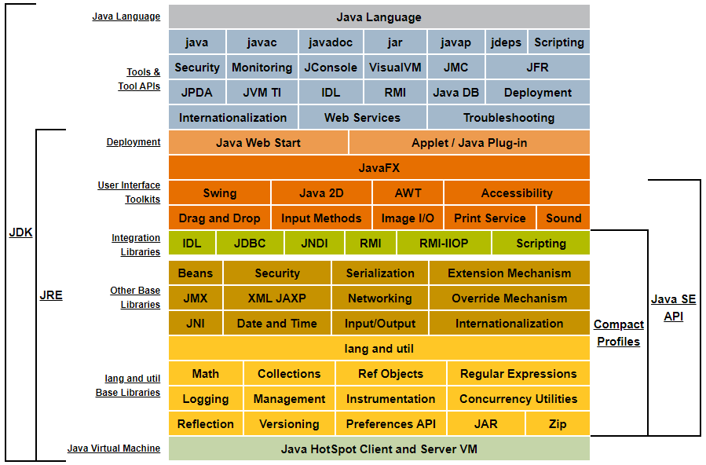
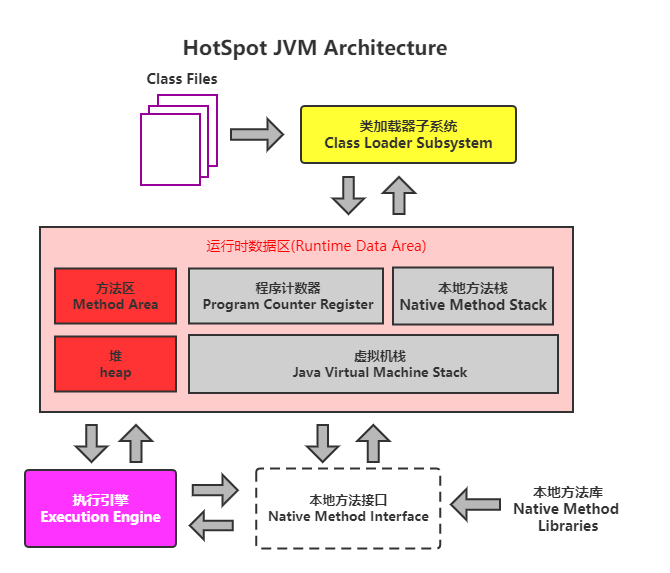
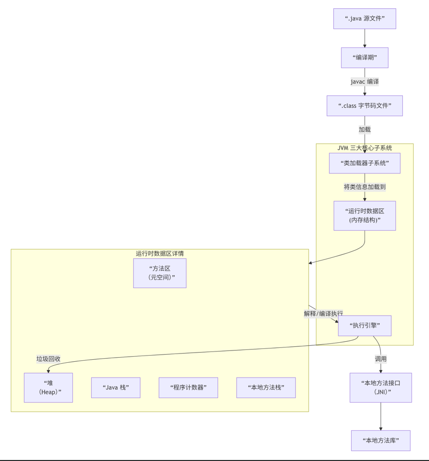
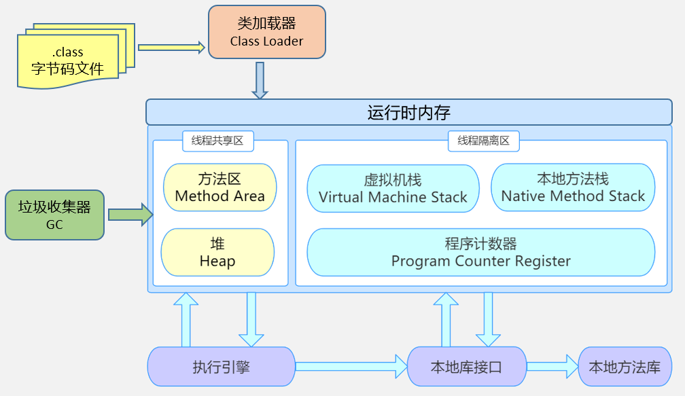
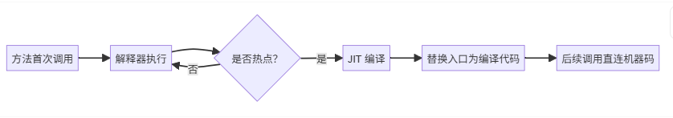
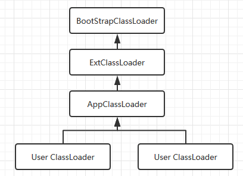
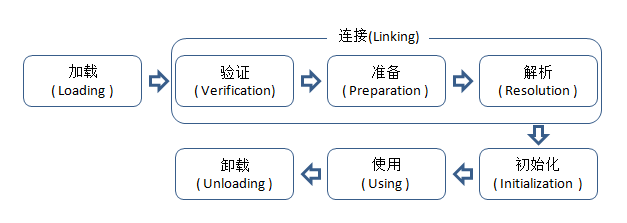
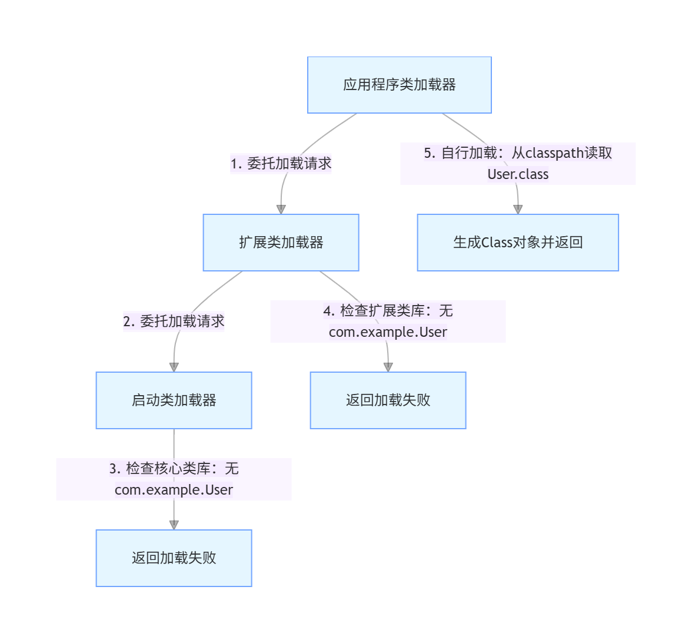

# JVM概述

## JVM简介

###### JVM是什么？

JVM（Java Virtual Machine）是一个**抽象的计算机**，它通过软件模拟硬件功能，提供一个运行 Java 字节码（bytecode）的环境。JVM 是平台相关的（不同操作系统有不同实现），但对上层 Java 程序透明，从而实现跨平台。

- **跨平台**：字节码 + JVM 实现；
- **自动内存管理**：GC 减轻开发者负担；
- **高性能**：JIT + 逃逸分析 + 优化编译；
- **安全性**：字节码验证、沙箱机制。

> ✅ **关键点**：JVM 不只运行 Java，还支持 Kotlin、Scala、Groovy 等编译为字节码的语言。 


######  JVM规范 vs JVM实现

- **JVM 规范**：由 Oracle 定义的标准（如《The Java Virtual Machine Specification》），规定了 JVM 应具备的行为。
- JVM 实现：具体厂商的实现
    - **HotSpot**（Oracle JDK 默认，最主流）
    - **OpenJ9**（IBM 开发，低内存占用）
    - **GraalVM**（支持多语言，含 Native Image）
    - **Zing**（Azul Systems，超低延迟）


###### JVM的作用

1. **执行字节码：** 负责将编译后的 `.class` 文件中的字节码转换为底层操作系统的机器指令。
2. **内存管理：** 管理程序运行时的内存分配和回收（通过垃圾回收器）。
3. **跨平台性：** 不同的操作系统（如 Windows、Linux、macOS）有各自的 JVM 实现，但它们都执行相同的字节码，从而实现了 Java 的跨平台特性。


###### Java程序执行流程

1. **编写源代码：** 编写 `.java` 源代码文件。
2. **编译：** 使用 **`javac` 编译器**将 `.java` 文件编译成 **`.class` 文件**（即 **Java 字节码**）。
3. **加载与执行：** JVM 的 **类加载器（ClassLoader）** 加载 `.class` 文件到内存，然后 **执行引擎（Execution Engine）** 执行字节码。


###### JDK&JRE&JVM之间的关系

|  |
| :----------------------------------------------------------: |


## JVM实现

### HotSpot VM（综合王者）

- **所属公司/社区**：Oracle / OpenJDK 社区
- **地位**：**绝对的主流和参考实现**。我们平时从 Oracle、OpenJDK、AdoptOpenJDK 等下载的 JDK，默认都包含 HotSpot VM。
- **名称由来**：它的名字源于其**热点代码探测技术**。
- **核心技术**：
    - **热点探测**：通过计数器（方法调用计数器、回边计数器）找出执行最频繁的代码。
    - **分层编译**：结合了**解释器**、**客户端编译器**和**服务端编译器**。
        - **C1 编译器**：编译速度快，优化较少，适用于启动速度要求高的客户端程序。
        - **C2 编译器**：编译速度慢，但进行激进优化，能生成高质量本地代码，适用于对峰值性能要求高的服务端程序。
    - **丰富的垃圾收集器**：提供了多种 GC 算法，适用于不同场景。
        - **Serial GC**：单线程，适合客户端应用。
        - **Parallel GC**：多线程，吞吐量优先。
        - **CMS GC**：并发标记清除，低停顿（已废弃）。
        - **G1 GC**：面向服务端，平衡吞吐量和停顿时间（JDK 9+ 默认）。
        - **ZGC**：可扩展的低延迟收集器（JDK 15+ 生产可用）。
        - **Shenandoah**：低延迟收集器（Red Hat 贡献）。
- **适用场景**：**几乎所有场景**，从桌面程序到大型分布式系统。


### OpenJ9（云原生利器）

- **所属公司/社区**：IBM -> Eclipse 基金会
- **地位**：与 HotSpot 齐名的三大商业级 JVM 之一（另外两个是 HotSpot 和 JRockit，JRockit 已被 Oracle 收购并整合进 HotSpot）。
- **特点**：
    - **极低的内存消耗和快速启动**：这是 OpenJ9 最突出的优点。在微服务和容器化环境中，它的内存占用通常比同版本的 HotSpot 低 **30% - 50%**。
    - **共享类缓存**：允许多个 JVM 进程共享已加载和已编译的类数据，极大地减少了重复类的内存占用和启动时间。
    - **更积极的即时编译策略**：其 JIT 编译器在编译速度和代码质量之间取得了很好的平衡。
- **适用场景**：
    - **云原生和微服务架构**：容器环境对内存和启动速度非常敏感，OpenJ9 优势明显。
    - **资源受限的环境**。
    - 大规模部署，需要节省内存成本的应用。


### GraalVM（多语言聚变）

- **所属公司**：Oracle
- **定位**：一款高性能的**多语言虚拟机**，不仅仅是一个 Java 虚拟机。
- **核心特性**：
    - **Graal JIT 编译器**：一个用 Java 编写的高性能即时编译器，可以替代 HotSpot 中的 C2 编译器，理论上能生成更优化的代码。
    - **Native Image**：**革命性技术**。它通过**提前编译**将 Java 应用程序直接编译成本地可执行文件。
        - **优点**：启动速度极快（毫秒级），内存占用极低，不需要传统的 JVM 来运行。
        - **缺点**：编译时间较长，运行时行为与传统 JVM 有差异（如反射、动态代理等需要配置）。
    - **多语言支持**：在 GraalVM 上可以运行 JavaScript、Python、Ruby、R 等多种语言，并且这些语言可以**无缝互操作**。
- **适用场景**：
    - **Serverless/无服务器计算**：需要极速启动和低内存开销。
    - **命令行工具**：希望像 Go 语言一样打包成单一可执行文件。
    - **微服务**：特别是需要快速扩缩容的场景。
    - **多语言混合编程**。


### Azul Zing（低延迟巅峰）

- **所属公司**：Azul Systems
- **定位**：商业级、面向关键任务、**极致低延迟**的 JVM。
- **核心技术**：
    - **C4 垃圾收集器**：其王牌技术。
        - **并发、压缩**：在应用程序运行的同时，**并发地**进行垃圾回收和**内存碎片整理**。这解决了几乎所有其他 GC 算法在 Full GC 时都会遇到的"停顿"问题。
        - **可预测的低延迟**：即使在 TB 级别的堆内存下，GC 停顿时间也能保持在 **10 毫秒**以下，并且不会随着堆大小的增加而增加。
    - **ReadyNow!**：通过预分析和预热，避免 JIT 编译在生产环境中带来的性能波动。
- **适用场景**：
    - **金融交易系统**：高频交易、实时风险计算。
    - **电信系统**：实时计费。
    - **大数据实时处理**。
    - 任何需要**可预测的、极致低延迟**的应用程序。


## JVM架构

```
┌───────────────────────────────────────┐
│            Class Loader               │ ← 加载 .class 文件
└───────────────────────────────────────┘
                    ↓
┌───────────────────────────────────────┐
│        Runtime Data Areas              │ ← 内存管理（堆、栈等）
└───────────────────────────────────────┘
                    ↓
┌───────────────────────────────────────┐
│         Execution Engine               │ ← 执行字节码（解释/JIT）
└───────────────────────────────────────┘
                    ↓
┌───────────────────────────────────────┐
│      Native Method Interface (JNI)    │ ← 调用本地代码（C/C++）
└───────────────────────────────────────┘
                    ↓
┌───────────────────────────────────────┐
│      Native Method Libraries          │ ← 本地库（如 libc）
└───────────────────────────────────────┘
```


|  |
| :----------------------------------------------------------: |
|  |
|  |


### 一 类加载子系统（Class Loader Subsystem）

* 类加载过程
* 类加载器
* 双亲委派机制


### 二 运行时数据区（Runtime Data Areas）

* 程序计数器（PC Register）
* Java 虚拟机栈（JVM Stack）
* 本地方法栈（Native Method Stack）
* 堆（Heap）

- 方法区（Method Area）/元空间（Metaspace）


### 三 执行引擎（Execution Engine）

* 解释器（Interpreter）
* 即时编译器（JIT Compiler）
* 垃圾回收器（GC）


### 四 本地接口（Native Interface）

提供与本地 C/C++ 库交互的能力（JNI）。

- 允许 Java 代码调用 C/C++ 编写的本地方法。
- 通过 JNI（Java Native Interface）实现。


# 执行引擎

## 知识总结

### 基本概念

#### 执行引擎

###### 什么是执行引擎

执行引擎是Java虚拟机的核心组件之一，负责将字节码指令解释/编译为对应平台上的本地机器指令。

**核心作用**：

- 输入：字节码文件（.class）
- 输出：平台相关的机器指令
- 目标：让Java程序能在不同操作系统上运行


###### 执行引擎在JVM中的位置

```
┌─────────────────────────────────────┐
│          Class Loader                │
│         （类加载子系统）               │
└───────────────┬─────────────────────┘
                ↓
┌─────────────────────────────────────┐
│         Runtime Data Areas            │
│      （运行时数据区：堆、栈、方法区等）   │
└───────────────┬─────────────────────┘
                ↓
┌─────────────────────────────────────┐
│         Execution Engine              │
│  ┌─────────────┐  ┌──────────────┐  │
│  │ Interpreter │  │ JIT Compiler │  │
│  │  （解释器）  │  │ （即时编译器）│  │
│  └─────────────┘  └──────────────┘  │
│  ┌───────────────────────────────┐  │
│  │        Garbage Collector       │  │
│  │         （垃圾收集器）          │  │
│  └───────────────────────────────┘  │
└─────────────────────────────────────┘
                ↓
         Operating System
           （操作系统）
```


###### 执行引擎整体架构

```
            字节码
               ↓
        ┌──────────────┐
        │  解释器       │
        └──────────────┘
               ↓
        ┌──────────────┐
        │  JIT 编译器   │
        │  (C1 / C2)    │
        └──────────────┘
               ↓
            机器码
               ↓
              CPU
```

**核心组成**

1. 解释器（Interpreter）
2. 即时编译器（JIT）
3. 垃圾回收器（辅助执行）
4. 本地方法接口（JNI）


###### 执行引擎与 GC 的关系

JIT 会：

- 减少对象创建
- 改变对象存活时间
- 优化锁竞争

所以：

> GC 表现，很大程度取决于 JIT 优化效果


###### 执行引擎完整生命周期

```
加载类
   ↓
解释执行
   ↓
热点探测
   ↓
C1 编译
   ↓
C2 优化编译
   ↓
机器码缓存
   ↓
直接执行
```


###### 执行引擎的三种""执行模式"

| 模式                               | 说明                                                         | 优点           | 缺点     |
| ---------------------------------- | ------------------------------------------------------------ | -------------- | -------- |
| **解释执行（Interpreter）**        | 逐条将字节码翻译成机器码并执行                               | 启动快         | 性能低   |
| **即时编译（JIT）**                | 将热点代码（频繁执行的方法）编译成本地机器码，后续直接执行编译后的代码 | 性能高         | 编译耗时 |
| **分层编译（Tiered Compilation）** | 结合解释执行和即时编译，启动时解释执行，同时后台编译热点代码 | 平衡启动与性能 | 实现复杂 |

> JVM 在运行中**动态切换模式**：启动时用解释器 → 收集热点数据 → JIT 编译热点 → 缓存机器码执行。

**执行引模式参数**

| 参数      | 模式             | 适用场景                     |
| :-------- | :--------------- | :--------------------------- |
| `-Xint`   | 纯解释执行       | 调试、启动最快的场景         |
| `-Xcomp`  | 纯编译执行       | 追求峰值性能，不care启动速度 |
| `-Xmixed` | 混合模式（默认） | 平衡启动速度和长期性能       |

**混合模式的优势**

```java
public class ExecutionModeDemo {
    public static void main(String[] args) {
        // 启动阶段：解释执行，快速启动
        initResources();
        
        // 运行阶段：热点代码被JIT编译
        for (int i = 0; i < 1000000; i++) {
            processRequest(); // 逐渐被JIT优化
        }
        
        // 稳定阶段：大部分热点代码已编译
        while (true) {
            handleRequest(); // 直接执行机器码
        }
    }
}
```


###### JVM中的线程类型

| 线程类型           | 作用               | 示例                          |
| :----------------- | :----------------- | :---------------------------- |
| **JavaThread**     | 执行Java代码的线程 | 主线程、业务线程              |
| **CompilerThread** | 执行JIT编译的线程  | C1/C2编译器线程               |
| **VMThread**       | 执行VM操作（如GC） | 垃圾回收协调线程              |
| **GC线程**         | 执行具体的GC任务   | Parallel GC线程、并发标记线程 |
| **WatcherThread**  | 执行周期性任务     | 内存抽样、ChunkPool清理       |


###### 栈帧作为GC Roots

栈帧中的局部变量是GC的重要根节点。

```java
public class StackFrameAsGCRoot {
    public void method() {
        // 局部变量obj是GC Root
        Object obj = new Object();
        
        // 此时obj引用的对象不会被回收
        
        obj = null;
        // 此时obj不再是GC Root，对象可被回收
        
        // 方法结束，栈帧销毁
    }
}

// GC根遍历流程[citation:9]
// 1. 获取JavaThread的JavaFrameAnchor
// 2. 根据sp、fp构造栈帧
// 3. 遍历所有栈帧，收集局部变量
// 4. 这些对象作为根开始标记
```


###### HotSpot VM执行引擎特色

- **混合模式**：同时使用解释器 + C1 + C2（分层编译）。
- **自适应优化**：运行时动态收集性能信息，智能选择编译层次。
- **CodeCache**：存放编译后的机器码，可设置大小（-XX:ReservedCodeCacheSize）。
- **性能监控工具**：JFR（Java Flight Recorder）、JMC（Java Mission Control）等可观察编译活动。


###### 执行引擎的发展趋势

- **AOT（Ahead-Of-Time）编译**：如GraalVM Native Image，直接将字节码编译成可执行文件，牺牲跨平台换取极速启动和低内存。
- **即时编译器的演进**：Graal编译器、JVMCI（JVM编译器接口）允许用户定制编译策略。
- **Project Lilliput**：尝试缩小对象头，提高缓存效率。
- **Project Valhalla**：引入内联类，减少对象开销


#### 解释器

###### 什么是解释器

解释器逐行读取字节码指令，将其翻译成对应平台的机器码并执行。


###### 解释器的优缺点

| 优点                     | 缺点                       |
| :----------------------- | :------------------------- |
| 启动速度快，无需编译等待 | 执行效率低，每次都需要解释 |
| 实现简单，跨平台性好     | 相同代码会被多次解释       |
| 占用内存少               | 不适合长时间运行的重复代码 |


###### 字节码示例

```java
public int add(int a, int b) {
    return a + b;
}

// 对应的字节码
0: iload_1          // 将局部变量1（参数a）压入操作数栈
1: iload_2          // 将局部变量2（参数b）压入操作数栈
2: iadd             // 栈顶两个int相加
3: ireturn          // 返回结果

// 解释器执行过程
// 第1步：读取iload_1，翻译为"从局部变量表索引1加载int值"
// 第2步：执行该操作，将值压栈
// 第3步：读取iload_2，翻译并执行
// 第4步：读取iadd，翻译为"将栈顶两个int相加"
// 第5步：执行加法，结果压栈
// 第6步：读取ireturn，翻译为"返回int值"
```


#### 执行器

###### 什么是执行器

**<font color='red'>将热点代码（频繁执行的方法或循环）编译成本地机器码，缓存到方法区的Code Cache中，下次直接执行机器码。</font>**

```
# 执行前
方法被频繁调用 → 达到阈值 → 编译成本地代码
# 执行后
直接跑机器码（绕过解释器）
```


###### JIT触发条件

使用两种计数器：

1. 方法调用计数器
2. 回边计数器（循环）

当超过阈值：-XX:CompileThreshold就会触发 JIT。


###### 字节码示例

```java
// 热点代码示例
public void hotMethod() {
    for (int i = 0; i < 1000000; i++) {
        // 循环体执行100万次
        process(data[i]);
    }
}

// JIT编译过程
// 第1次执行：解释执行，同时统计执行次数
// 第10000次执行：达到阈值，触发JIT编译
// 第10001次执行：直接执行编译后的机器码
```


#### Code Cache管理

##### Code Cache的作用

存放JIT编译生成的本地机器码。

```java
// Code Cache配置
-XX:InitialCodeCacheSize=160M   // 初始大小
-XX:ReservedCodeCacheSize=240M  // 最大大小
-XX:+PrintCodeCache              // 打印Code Cache使用情况

// 监控Code Cache
jcmd <pid> Compiler.codecache
```


##### Code Cache满的处理

```java
// 现象：Code Cache满，停止JIT编译
// 日志：Compiler thread failed to allocate code cache

// 解决方案：
// 1. 增加Code Cache大小
-XX:ReservedCodeCacheSize=512M

// 2. 启用Code Cache回收
-XX:+UseCodeCacheFlushing

// 3. 减少编译量
-XX:CICompilerCount=2  // 减少编译线程数
```

1


### 面试问题

###### 什么是 JIT编译器（Just-In-Time Compiler）？

热点代码在运行时被编译为本地机器码，以提升执行效率。

- C1（Client Compiler）；
- C2（Server Compiler）；
- Graal（JDK 11+ 新编译器）。


###### 解释器和 JIT 编译器的区别？为什么 JVM 需要两者结合？

- 解释器：逐行解释字节码为机器码，启动快但执行效率低。
- JIT 编译器：将热点代码（频繁执行）编译为机器码并缓存，执行效率高但编译耗时。
- 结合原因：平衡启动速度（解释器）和运行效率（JIT），实现 “启动快 + 后期快”，JVM 默认混合模式（`-Xmixed`），冷代码解释，热代码 JIT。

> JVM采用**分层编译**。代码首先由解释器执行，同时收集性能分析数据。热点代码再由 JIT 编译器进行深度编译优化。


###### JIT编译器有哪些常见的优化技术？

- **方法内联**：将被调用方法代码嵌入调用者，减少方法调用开销。
- **逃逸分析**：判断对象是否逃逸出方法，未逃逸的对象可栈分配（减少 GC），衍生出**栈上分配**、**标量替换**、**同步消除**。
- **循环优化**：循环展开、循环不变量外提（减少重复计算）。
- **公共子表达式消除**。


###### 什么是逃逸分析（Escape Analysis）？它能带来什么优化？

- **定义**：分析对象的作用域是否“逃逸”出当前方法或线程。
- 如果对象**没有逃逸**，JIT 可以进行：
    1. **栈上分配**：对象在栈上分配，随方法结束而销毁，减轻 GC 压力。
    2. **标量替换**：将对象分解成几个成员变量来代替。
    3. **同步消除(锁消除)**：如果对象不会线程逃逸，可以移除对其的同步锁。

> 🌰 示例：`StringBuilder` 在方法内使用，可能被优化为直接字符串拼接。 


###### 解释执行 + JIT 为什么共存？

因为：

| 阶段       | 适合方式 |
| ---------- | -------- |
| 启动初期   | 解释执行 |
| 运行中期   | C1       |
| 稳定高负载 | C2       |

这叫：

> “启动性能” vs “峰值性能”平衡


###### JVM 是解释型还是编译型？

两者结合（解释 + JIT）


###### 为什么 Java 运行快？

因为 JIT + 深度优化


###### 为什么第一次调用慢？

还没触发 JIT


###### 如何关闭分层编译？

```bash
-XX:-TieredCompilation
```


###### 不同场景的优化策略

| 场景         | 目标     | 优化策略                             |
| :----------- | :------- | :----------------------------------- |
| **CLI工具**  | 启动速度 | `-Xint` 或 `-XX:TieredStopAtLevel=0` |
| **Web服务**  | 平衡     | 默认配置（分层编译）                 |
| **批处理**   | 吞吐量   | `-server`，关闭热度衰减              |
| **实时系统** | 低延迟   | G1GC配合JIT监控                      |
| **微服务**   | 内存占用 | 控制Code Cache大小                   |


###### 什么是解释器？

解释器是JVM**执行引擎** 的基本组成部分。它的工作是：**逐条读取、解析并执行Java字节码指令**。

- **输入**：Java 字节码（`.class` 文件中的内容）。
- **处理**：将每一条字节码指令“翻译”成对应的一组本地机器指令。
- **输出**：执行这组本地机器指令，完成操作。


###### 为什么需要解释器？

**执行模型对比**

| 执行方式     | 启动速度       | 执行速度 | 内存占用               | 适用场景             |
| ------------ | -------------- | -------- | ---------------------- | -------------------- |
| **解释执行** | ⚡ 极快         | 🐢 慢     | 🟢 低                   | 程序启动、冷代码     |
| **JIT编译**  | 🐢 慢（需预热） | ⚡ 快     | 🔴 高（需存储编译代码） | 热点代码、长期运行   |
| **AOT编译**  | ⚡ 快           | ⚡ 快     | 🟢 低                   | GraalVM Native Image |

**解释器的核心价值**

>  - **零预热启动**：程序一启动即可执行；
>  - **简单可靠**：逻辑清晰，易于调试和移植；
>  - **兜底执行**：当 JIT 未启用或编译失败时，仍可运行。


###### 解释器的两大职责

1. **启动执行者：** 作为程序的默认执行引擎，保证应用快速启动（没有预热开销）。
2. **性能探针（Profiler）：** 在执行字节码的同时，对代码进行“性能分析”，找出哪些代码是“热点代码”，为 JIT 编译器提供优化所需的情报。


###### 解释器与 AOT（提前编译）的对比

| 特性     | 解释器           | AOT                        |
| -------- | ---------------- | -------------------------- |
| 编译时机 | 运行时           | 编译时                     |
| 启动速度 | 快               | 更快                       |
| 执行性能 | 一般             | 稳定但固定                 |
| 动态优化 | ✅ 支持 JIT 升级  | ❌ 静态固定                 |
| 适用场景 | 长时间运行的应用 | 快速启动的微服务、容器应用 |


### JVM参数

#### 核心参数

| 参数                        | 说明           | 默认值          |
| :-------------------------- | :------------- | :-------------- |
| `-XX:+PrintCompilation`     | 打印编译信息   | false           |
| `-XX:+PrintInlining`        | 打印内联信息   | false           |
| `-XX:CompileThreshold`      | 编译阈值       | 10000（Server） |
| `-XX:CICompilerCount`       | 编译线程数     | CPU核心数       |
| `-XX:ReservedCodeCacheSize` | Code Cache大小 | 240M            |
| `-XX:+DoEscapeAnalysis`     | 开启逃逸分析   | true            |
| `-XX:+EliminateAllocations` | 开启标量替换   | true            |
| `-XX:+EliminateLocks`       | 开启锁消除     | true            |
| `-XX:+UseCounterDecay`      | 开启热度衰减   | true            |
| `-XX:CounterHalfLifeTime`   | 半衰周期       | 30秒            |

#### 诊断命令

```bash
# 查看JIT编译统计
jstat -compiler <pid>

# 查看最近编译的方法
jstat -printcompilation <pid>

# 查看Code Cache使用
jcmd <pid> Compiler.codecache

# 查看JIT编译队列
jcmd <pid> Compiler.queue

# 触发重新编译
jcmd <pid> Compiler.directives_add directives.json
```


### 实践总结


## 解释器 (Interpreter)

- **作用**：逐条将字节码解释为本地机器码并执行。
- **特点**：
    - 启动速度快，无需编译，适合程序启动初期。
    - 执行效率较低（多次解释相同方法时重复工作）。
- **典型实现**：HotSpot VM中的模板解释器（Template Interpreter），为每条字节码生成对应的机器码模板，解释时直接跳转执行。


###### 解释器的核心作用

| 功能         | 描述                         |
| ------------ | ---------------------------- |
| 字节码解析   | 解释 `.class` 文件中的指令集 |
| 执行控制流   | 控制分支、循环、方法调用     |
| 运行时栈操作 | 维护操作数栈、局部变量表     |
| 异常处理     | 处理 try/catch、finally 逻辑 |
| 调试支持     | 支持断点、调试、反射等       |


###### HotSpot的两种解释器实现

HotSpot JVM 内部实现了两种解释器：

| 名称                                   | 特点                                   | 使用场景           |
| -------------------------------------- | -------------------------------------- | ------------------ |
| **Template Interpreter（模板解释器）** | 基于模板（每个字节码对应一段汇编模板） | 默认               |
| **C++ Interpreter（经典解释器）**      | 完全用 C++ 实现                        | 较旧版本或特定平台 |

**Template Interpreter 工作原理**

- JVM 启动时，根据 CPU 架构（x86、ARM 等）生成对应的指令模板；
- 每个字节码操作（如 `iadd`, `invokevirtual`）映射到一段机器指令；
- 执行时直接调用模板代码，性能较高。

> 🧩 HotSpot 采用这种解释器，是为了兼顾**可移植性与性能**。


###### 解释器在JVM架构中的位置

JVM 执行引擎包含两大核心组件：

```
字节码 (.class)
     ↓
┌──────────────┐
│  Class Loader │
└──────────────┘
     ↓
┌──────────────┐
│   Interpreter │ ← 初始执行所有方法
└──────────────┘
     ↓（监控热点）
┌──────────────┐
│   JIT Compiler│ ← 编译热点方法为机器码
└──────────────┘
     ↓
本地机器码（CPU 直接执行）
```

- 所有方法**最初都由解释器执行**。
- JIT 编译完成后，后续调用直接跳转到编译后的本地代码。
- 若 JIT 编译失败（如代码太复杂），仍回退到解释执行。


###### 解释器的工作原理

**基于栈的指令执行**

JVM 是**基于栈的虚拟机**（区别于基于寄存器的 Lua、V8 等），其字节码指令操作**操作数栈（Operand Stack）**。

示例：`int a = 1 + 2;`

编译后的字节码：

```java
iconst_1    // 将 int 1 压入操作数栈
iconst_2    // 将 int 2 压入操作数栈
iadd        // 弹出栈顶两个值，相加，结果压栈
istore_1    // 将栈顶值存入局部变量表 slot 1
```

解释器执行流程：

1. 读取 `iconst_1` → 栈 = [1]
2. 读取 `iconst_2` → 栈 = [1, 2]
3. 读取 `iadd` → 弹出 2 和 1，计算 3，压栈 → 栈 = [3]
4. 读取 `istore_1` → 弹出 3，存入局部变量表

> 📌 **关键数据结构**： 
>
> - **程序计数器（PC）**：指向下一条要执行的字节码；
> - **操作数栈**：用于指令间传递数据；
> - **局部变量表**：存储方法参数和局部变量。


###### 解释器的实现方式（HotSpot）

HotSpot JVM 的解释器有三种实现策略，按性能从低到高：

**1 字节码解释器（Bytecode Interpreter）**

- 纯 C++ 实现；
- 使用 `switch-case` 或函数指针分发指令；
- 可移植性强，但性能最差；
- 仅用于不支持模板解释器的平台。

**2 模板解释器（Template Interpreter）** ← **默认使用**

- 为每条字节码**预先生成对应的本地机器码片段**（称为“模板”）；
- 执行时直接跳转到对应模板，避免 C++ 函数调用开销；
- 性能比字节码解释器高 2~3 倍；
- 通过汇编或 JIT 生成模板（平台相关）。

**3 C++ 解释器（已废弃）**

- 早期实现，性能较差，JDK 9 后移除。

> ✅ **模板解释器优势**： 
>
> - 减少解释循环开销；
> - 可嵌入 profiling 代码（如计数器更新）；
> - 为 OSR（On-Stack Replacement）提供支持。


###### 解释器与 JIT 的协同机制

JVM 采用 **“解释 + JIT”混合执行模型**，两者紧密协作：

**执行流程**

|  |
| :----------------------------------------------------------: |

**计数器机制**

解释器在执行时维护两个关键计数器：

| 计数器                 | 作用         | 触发行为               |
| ---------------------- | ------------ | ---------------------- |
| **Invocation Counter** | 方法调用次数 | 达阈值 → 触发 JIT 编译 |
| **Back Edge Counter**  | 循环回边次数 | 达阈值 → 触发 OSR 编译 |

> 💡 这些计数器由解释器在执行字节码时**自动更新**。 

**入口替换（Patching）**

- 每个方法在方法区有一个 **“入口指针”**；
- 初始指向解释器入口；
- JIT 编译完成后，JVM **原子地修改该指针**指向编译后的代码；
- 后续调用直接跳转，无需再经过解释器。


###### 解释器的核心价值与重要性

尽管效率不如 JIT，但解释器在 JVM 中扮演着不可替代的角色：

**1. 快速启动**

- **零编译延迟**：程序无需等待漫长的编译过程，可以**立即开始执行**。这对于命令行工具、短生命周期的脚本任务以及对启动速度有严格要求的应用至关重要。

**2. 平台无关性的基石**

- Java 的“一次编写，到处运行”依赖于字节码和 JVM。解释器是这个链条的**最终执行环节**。只要有对应平台的 JVM（内含解释器），同一个字节码文件就能运行。JIT 编译器生成的代码是平台相关的，而解释器的行为是平台一致的。

**3. 为 JIT 编译器提供 Profiling 数据**

- 这是解释器一个**至关重要**的职责。在分层编译模型中，解释器并非“傻乎乎”地执行代码。
- 它在执行期间，会收集丰富的**运行时性能分析数据**，例如：
    - **方法调用次数**
    - **循环的回边次数**
    - **分支预测的成功率**
    - **对象的类型信息**
- 这些 **Profiling 数据** 为 JIT 编译器进行**激进优化**（如方法内联、虚方法内联、逃逸分析）提供了关键依据，使得 JIT 编译器的优化更加精准和高效。

**4. 编译退路与稳定性**

- 当 JIT 编译器由于某些原因（如编译失败、代码过于复杂）无法编译某个方法时，解释器可以作为**可靠的退路**，保证程序依然能够正常执行。
- 在调试时，解释器模式通常更易于设置断点和单步跟踪。


###### 解释器的实现与优化

现代 JVM 的解释器本身也是高度优化的。

**1. 模板解释器**

- HotSpot VM 默认使用**模板解释器**。
- **原理**：为每一条字节码指令**预先编写好一小段对应的本地机器码**（即“模板”）。当需要执行某条字节码时，直接跳转到对应的模板代码块执行。
- **优点**：
    - 比纯粹的 `switch` 循环解释器快很多，因为它避免了中央调度循环的开销。
    - 生成的代码质量更高。

**2. 字节码解释器**

- 另一种实现方式，更像我们上面描述的 `switch` 循环。
- 在某些平台上可能比模板解释器简单，但通常效率较低。


###### 解释器模式与相关JVM参数

虽然现代 JVM 默认使用解释器和 JIT 编译器协作的分层编译模式，但你仍然可以强制 JVM 使用纯解释器模式。

- **`-Xint`**：强制 JVM 以**纯解释模式**运行。JIT 编译器将被完全禁用。
    - **使用场景**：用于性能对比测试，或者在某些不支持 JIT 的嵌入式平台上。
    - **示例**：`java -Xint MyApp`
- **`-Xcomp`**：与 `-Xint` 相反，它强制 JVM 在**第一次调用方法时就进行编译**。
    - **注意**：此模式会导致极长的启动时间，并且由于缺乏 Profiling 数据，最终生成的代码优化效果可能还不如分层编译。**不推荐在生产环境使用**。
- **`-XX:+PrintInterpreter`**：打印解释器的相关信息（需要 Debug 版 JVM）。


###### 解释器的性能特点

优点

- **启动极快**：无需编译，立即执行；
- **内存占用低**：不生成额外机器码；
- **调试友好**：每条字节码可精确对应源码行；
- **平台无关**：字节码语义统一，解释器只需适配本地指令。

缺点

- **执行慢**：每条指令都要解析、分发、执行；
- **无法优化**：不能进行内联、常量折叠等优化；
- **分支预测失效**：解释循环导致 CPU 分支预测失败。

> 📊 性能对比（粗略）： 
>
> - 解释执行：约 10~50 倍慢于 JIT 编译代码；
> - 但仅占程序总执行时间的很小部分（因热点代码会被 JIT 替换）。


###### 如何控制解释器行为？

###### 强制禁用 JIT（仅用解释器）

```bash
# 禁用 JIT 编译器
-XX:+InterpretOnly

# 或
-Xint
```

> ⚠️ 仅用于调试或性能对比，**生产环境禁用**！ 


###### 查看解释执行情况

```bash
# 打印方法调用和编译信息
-XX:+PrintCompilation

# 示例输出：
#     100   25       java.lang.String::hashCode (67 bytes)
# 表示方法 25 在 100ms 时被 JIT 编译
# 未出现的方法仍在解释执行
```


###### 解释器的性能优化策略

1. **指令模板优化**
    不同平台（x86、ARM）使用最优机器指令模板。
2. **分层编译（Tiered Compilation）**
    在解释执行阶段收集性能数据（如分支频率、调用深度），供 JIT 使用。
3. **字节码缓存（Code Cache）**
    部分解释结果可缓存，减少重复解析。
4. **On-Stack Replacement（OSR）**
    在热点循环中，运行中途切换到 JIT 编译代码执行。


###### 解释器 vs 其他语言的执行引擎

| 语言/VM              | 执行方式                             | 特点                    |
| -------------------- | ------------------------------------ | ----------------------- |
| **JVM**              | 解释 + JIT                           | 启动快 + 长期高性能     |
| **CPython**          | 纯解释                               | 无 JIT（PyPy 有）       |
| **V8（JavaScript）** | Ignition（解释器） + TurboFan（JIT） | 类似 JVM 混合模型       |
| **Lua**              | 基于寄存器的解释器                   | 执行效率高于 JVM 栈模型 |

> 🔍 **JVM 解释器的独特性**： 
>
> - 严格的字节码验证；
> - 与 GC、线程模型深度集成；
> - 支持 OSR（栈上替换）。


###### 未来演进：解释器会消失吗？

尽管 JIT 和 AOT（如 GraalVM Native Image）越来越强大，**解释器短期内不会消失**，原因：

1. **冷启动不可替代**：AOT 无法覆盖所有动态场景（如反射、动态代理）；
2. **调试与开发体验**：IDE 调试依赖解释器的精确行号映射；
3. **资源受限环境**：嵌入式设备可能只运行解释器；
4. **安全沙箱**：解释器更易实现细粒度控制。

> 💡 GraalVM 的 **“JIT + 解释器”混合模式** 仍是主流。 


###### 解释器总结

| 关键点          | 说明                                               |
| --------------- | -------------------------------------------------- |
| **角色**        | JVM 的默认初始执行引擎                             |
| **工作方式**    | 逐条解释基于栈的字节码                             |
| **实现**        | HotSpot 默认使用模板解释器（高性能）               |
| **与 JIT 关系** | 协同工作：解释器启动 + JIT 优化热点                |
| **适用场景**    | 程序启动、冷代码、调试、资源受限环境               |
| **控制参数**    | `-Xint`（仅解释），`-XX:+PrintCompilation`（监控） |

> 理解解释器，是理解 JVM 执行模型的第一步**。它虽“慢”，却是 Java “快速启动 + 高性能运行”这一平衡的关键基石。 


## 即时编译器 (Just-In-Time Compiler)


- **作用**：将热点代码（频繁执行的方法/循环）编译为本地机器码，并缓存起来，以提高执行效率。
- **分类**：
    - **C1编译器（Client Compiler）**：优化少、编译快，适用于对启动速度敏感的客户端应用。
    - **C2编译器（Server Compiler）**：优化多、编译慢，生成的代码执行效率极高，适用于长时间运行的服务端应用。
    - **Graal编译器**：HotSpot原生支持的实验性编译器，用Java编写，可替代C2。
- **分层编译**（JDK 8+默认开启）：结合解释器、C1、C2的优点，分为5个层次：
    - 0：解释执行
    - 1：C1编译，无profiling（性能监控）
    - 2：C1编译，轻量级profiling
    - 3：C1编译，完全profiling
    - 4：C2编译


###### JIT编译器简介

将**热点代码**（Hot Spot Code，被频繁执行的代码）直接编译成**本地机器码**，并缓存起来。

* **优势：** 一旦编译完成，后续执行效率极高。

* JIT分为

    - **C1 编译器**：简单优化，启动快；

    - **C2 编译器**：深度优化，运行快；

    - **Graal JIT（JDK 11+）**：新一代高性能编译器。

- **热点探测**：判断一段代码是不是热点代码。主要方法有：
    - **基于采样的热点探测**：周期性检查线程的调用栈顶。
    - **基于计数器的热点探测**：为每个方法（或代码块）建立计数器，统计执行次数。JVM 主要使用此方法。
- **分层编译**：现代JVM采用多种编译级别。
    - **C1 编译器**：客户端编译器，编译速度快，优化策略简单。
    - **C2 编译器**：服务端编译器，编译耗时较长，但会进行一些激进的优化。


###### 为什么需要 JIT？

**解释执行的瓶颈**

Java 程序最初是通过**解释器**来执行的。解释器逐条读取字节码，逐条翻译成机器码并执行。

- **优点**：**启动速度快**，无需等待。
- **缺点**：**执行速度慢**。因为每次执行都需要经历“读取 -> 翻译 -> 执行”的循环，特别是循环体内的代码，会被重复翻译，效率低下。

**编译执行的对比**

像 C/C++ 这样的语言，使用**提前编译器**，在程序运行前就将源代码一次性全部编译成目标机器码。

- **优点**：**执行速度极快**。
- **缺点**：**编译时间长**，且编译后的程序无法跨平台。

**JIT的折中与优化**

JIT 编译器结合了二者的优点：

1. 程序首先通过 **解释器** 快速启动执行。
2. 在程序运行期间，JVM 会监控代码的执行情况，找出那些被频繁调用的“**热点代码**”。
3. 然后，JIT 编译器会将这些热点代码 **动态编译** 成本地机器码。
4. 当下次再执行这段代码时，就直接运行编译好的、优化过的本地机器码，从而**绕过解释器**，极大提升执行效率。

**简单比喻**：

- **解释器**：像一个**同声传译**，说一句，翻译一句。
- **AOT编译器**：像把一整本书**提前翻译**好。
- **JIT编译器**：像先让同声传译上场，同时派一个团队在后台观察，发现演讲者总是在重复某些段落，就把这些段落**提前精译并背下来**，等他再讲到这些时，直接流利地背诵出来。


###### 解释执行 vs 编译执行

| 方式                | 原理                                 | 优点                                   | 缺点                               |
| ------------------- | ------------------------------------ | -------------------------------------- | ---------------------------------- |
| **解释执行**        | 逐条读取字节码，翻译成机器指令执行   | 启动快、内存占用低                     | 执行慢（每条指令都要翻译）         |
| **静态编译（AOT）** | 编译时生成机器码（如 C++）           | 执行快                                 | 无跨平台性、无法根据运行时信息优化 |
| **JIT 编译**        | 运行时识别热点代码，动态编译为机器码 | 兼顾启动速度与执行性能，支持运行时优化 | 初期有编译开销                     |

> **JIT 的核心思想**：“**用时间换空间，用运行时信息换性能**” —— 只编译频繁执行的代码（热点代码），并利用运行时 profile 信息进行深度优化。 


###### JIT 在JVM中的位置

在 HotSpot JVM 中，执行引擎包含：

```
字节码
   ↓
┌─────────────┐
│ Interpreter │ ← 初始解释执行
└─────────────┘
       ↓（监控调用频率）
┌─────────────┐
│   JIT Compiler  │ ← 编译热点代码为本地机器码
└─────────────┘
       ↓
本地机器码（直接由 CPU 执行）
```


###### HotSpot 中的 JIT 编译器

HotSpot JVM内置**多层 JIT编译器**，根据优化级别不同分为

**1 C1编译器（Client Compiler）**

- **目标**：快速编译，减少启动延迟；
- **优化级别**：轻量级（如方法内联、常量传播、死代码消除）；
- **适用场景**：客户端应用、短生命周期程序；
- **触发条件**：方法调用次数达 **1500 次**（可通过 `-XX:CompileThreshold=1500` 调整）。

**2 C2编译器（Server Compiler）**

- **目标**：极致性能，高吞吐；
- **优化级别**：深度优化（如逃逸分析、循环展开、向量化、寄存器分配）；
- **适用场景**：服务端长期运行应用；
- **触发条件**：方法调用次数达 **10,000 次**（或 OSR 触发）。

**3 分层编译（Tiered Compilation）**

- **JDK 8+ 默认开启**（`-XX:+TieredCompilation`）；
- 结合 C1 和 C2 的优势：
    1. 先用解释器执行；
    2. 热点方法 → C1 编译（带 profiling 信息）；
    3. 更热的方法 → C2 编译（利用 C1 收集的运行时数据）；
- **优势**：更快达到高性能状态，避免 C2 长时间预热。

> 📊 分层编译级别（Tier）： 
>
> - Tier 0：解释执行
> - Tier 1：C1（无 profiling）
> - Tier 2：C1（带简单 profiling）
> - Tier 3：C1（带完整 profiling）
> - Tier 4：C2（深度优化）


###### JIT 如何识别“热点代码”？

JIT 编译的触发依赖于 **热点探测**。HotSpot VM 主要采用 **基于计数器的热点探测**。它为每个方法（甚至是代码块）建立计数器，根据计数器的值来判断是否为“热点”。

**1 方法调用计数器**

- **作用**：统计方法被调用的次数。
- **工作流程**：
    1. 默认情况下，方法被调用时，先由**解释器**执行。
    2. 方法每次被调用，该计数器值 **+1**。
    3. 当计数器的值超过一个 **阈值**时，JIT 编译器就会认为它是一个热点方法，并将其提交给 **即时编译器** 进行编译。
    4. 编译完成后，此方法的调用入口地址会被**系统自动改写**为新的、编译后的本地代码入口。下次调用该方法时，直接执行本地机器码。
- **热度衰减**：如果一段时间内方法的调用次数仍未达到阈值，该方法的调用计数器值会**减少一半**。这被称为方法的**热度衰减**，此过程是在**垃圾回收**期间顺便进行的。

**2. 回边计数器**

- **作用**：统计一个方法中**循环体代码执行的次数**（“回边”是指向循环起始位置跳转的字节码指令，如 `for`， `while`）。
- **重要性**：即使一个方法本身调用次数不多，但如果其内部有一个被循环上万次的代码块，那么这个代码块也是当之无愧的“热点”。回边计数器就是为了发现这种**代码块级别的热点**。
- 当回边计数器的值超过阈值时，会触发 **栈上替换**。


###### JIT 的核心优化技术

JIT 编译器利用**运行时信息**进行远超静态编译器的优化

**1 方法内联（Method Inlining）**

- 将被调用方法的代码直接嵌入调用处；
- 消除方法调用开销（压栈、跳转）；
- 为后续优化（如常量传播）创造条件。

```
// 原始代码
int x = Math.max(a, b);

// 内联后（伪代码）
int x = (a > b) ? a : b;
```

>  内联受 `-XX:MaxInlineSize`（默认 35 字节码）和 `-XX:FreqInlineSize` 限制。 

**2 逃逸分析（Escape Analysis）**

- 分析对象的作用域是否“逃逸”出当前方法或线程；
- 优化效果：
    - **栈上分配**：不逃逸的对象分配在栈上（避免堆分配 + GC）；
    - **标量替换**：将对象拆分为基本类型字段（消除对象头开销）；
    - **锁消除**：同步块中对象不逃逸 → 去掉无用的 synchronized。

```java
public void foo() {
    StringBuilder sb = new StringBuilder(); // 不逃逸
    sb.append("hello");
    System.out.println(sb.toString());
}
// JIT 可能将 sb 分配在栈上，甚至优化为直接字符串拼接
```

**3 其他关键优化**

| 优化技术           | 说明                                               |
| ------------------ | -------------------------------------------------- |
| **死代码消除**     | 移除永远不会执行的代码（如`if (false)`）           |
| **常量折叠/传播**  | 编译期计算常量表达式（如`int x = 2 + 3;`→`x = 5`） |
| **循环展开**       | 减少循环控制开销（如展开 4 次）                    |
| **虚方法内联**     | 即使是虚方法，若运行时只有一种实现，也可内联       |
| **向量化（SIMD）** | 利用 CPU 向量指令并行处理数组（需 C2 + 硬件支持）  |


###### 如何查看 JIT 行为

**1 开启 JIT 日志（JDK 9+）**

```bash
# 打印编译日志
-XX:+PrintCompilation

# 详细日志（含优化信息）
-XX:+UnlockDiagnosticVMOptions
-XX:+LogCompilation
-XX:+TraceClassLoading
```

输出示例：

```bash
    123   45 %     com.example.Test::hotMethod @ 2 (45 bytes)
    125   46       com.example.Test::hotMethod (45 bytes)
```

- `%` 表示 OSR 编译；
- 数字 45 是编译任务 ID；
- `45 bytes` 是字节码长度。

**2 使用工具分析**

- **JITWatch**：可视化分析 `LogCompilation` 输出，查看内联、去虚拟化等优化；
- **Async-Profiler**：采样 CPU，定位未被 JIT 编译的热点方法；
- **JMH（Java Microbenchmark Harness）**：编写微基准测试，验证 JIT 优化效果。


###### JIT的核心优化技术

JIT 通过多种优化手段将字节码转换为高效机器码，核心技术包括：

| 优化技术             | 作用                                                         | 示例                                                         |
| -------------------- | ------------------------------------------------------------ | ------------------------------------------------------------ |
| **方法内联**         | 将被调用的方法代码 “嵌入” 调用者方法中，减少方法调用开销（如栈帧创建 / 销毁）。 | 调用`add(a,b)`时，直接将`return a+b`嵌入调用处，避免函数调用。 |
| **常量折叠**         | 编译时计算常量表达式结果，避免运行时重复计算。               | `int x = 3 + 5`编译为`int x = 8`。                           |
| **逃逸分析**         | 分析对象是否 “逃逸” 出方法（如被外部引用），未逃逸的对象可优化为栈分配（减少 GC）。 | 方法内临时创建的`StringBuilder`未被返回，直接在栈上分配，无需进入堆。 |
| **标量替换**         | 将未逃逸的对象拆解为局部变量（标量），消除对象内存占用和访问开销。 | `Point p = new Point(1,2)`替换为`int x=1, y=2`，避免创建`Point`对象。 |
| **循环优化**         | 循环展开（减少循环判断次数）、循环不变量外提（将循环内不变的计算移到外部）。 | `for(int i=0;i<4;i++) sum += i`展开为`sum +=0+1+2+3`。       |
| **公共子表达式消除** | 重复计算的表达式仅计算一次，结果复用。                       | `int a = (x+y)*z; int b = (x+y)+1`中，`x+y`仅计算一次。      |


###### JIT的局限性与挑战

**冷启动问题**

- 程序刚启动时，代码未被 JIT 编译，性能较差；
- 解决方案：
    - 预热（Warm-up）：启动后先运行一段时间再提供服务；
    - 使用 GraalVM Native Image（AOT 编译，无 JIT 预热）。

**大方法不被内联**

- 方法字节码过长（> `-XX:MaxInlineSize`）不会被内联；
- **建议**：保持方法短小（SRP 原则）。

反射、**动态代理阻碍优化**

- JIT 难以优化 `Method.invoke()` 或动态生成的类；
- **建议**：关键路径避免反射。


###### 最佳实践建议

1. **避免大方法**：利于 JIT 内联；
2. **减少虚方法调用**：使用 final、private 提高内联概率；
3. **预热关键路径**：上线前执行热点方法；
4. **监控 JIT 行为**：用 `-XX:+PrintCompilation` 观察是否编译；
5. **慎用 synchronized**：JIT 可优化无竞争锁（锁粗化、锁消除），但仍有开销；
6. **不要过早优化**：先 profile，再针对性优化。


###### JIT编译器总结

| 特性         | 说明                                       |
| ------------ | ------------------------------------------ |
| **核心价值** | 动态优化，使 Java 性能接近原生代码         |
| **工作方式** | 识别热点代码 → 编译为机器码 → 替换解释执行 |
| **关键优化** | 内联、逃逸分析、锁消除、向量化             |
| **主流实现** | HotSpot 的 C1/C2，GraalVM 的 Graal JIT     |
| **调优重点** | 控制编译阈值、方法大小、减少动态特性       |

> **记住**：JIT 是 JVM 的“智能引擎”，它让 Java 既保持跨平台性，又具备高性能。理解 JIT，是成为 Java 高级工程师的关键一步。 


### 编译器

#### C1编译器（Client Compiler）

- 适用场景：对启动速度敏感的应用
- 优化策略：简单可靠的优化
- 优化项：方法内联、去虚拟化、冗余消除
- 特点：编译速度快，优化程度较低

#### C2编译器（Server Compiler）

- 适用场景：追求长期性能的服务器应用
- 优化策略：激进的深度优化
- 优化项：逃逸分析、锁消除、标量替换、栈上分配
- 特点：编译速度慢，优化程度高

#### 分层编译策略

现代JVM（JDK 8+默认开启）采用分层编译，结合了解释器、C1、C2的优势。

```
执行层级：
第0层：解释执行（不开启性能监控）
第1层：C1编译（简单优化，带性能监控）
第2层：C2编译（深度优化）

执行流程：
首次执行 → 解释执行（第0层）
         ↓
频繁调用 → C1编译（第1层）→ 收集性能数据
         ↓
超级热点 → C2编译（第2层）→ 生成高度优化代码
```


### AOT编译（提前编译）


### Graal JIT编译器

用Java编写的JIT编译器，可替代C2，具备更好的编译速度和优化能力，同时支持多语言（如Polyglot）。


### 热点代码探测技术

#### 什么是热点代码

热点代码是指被多次调用的方法或循环体。JVM通过热点探测技术识别这些代码，触发JIT编译。


#### 基于计数器的热点探测

HotSpot采用基于计数器的热点探测，为每个方法维护两个计数器。


##### 方法调用计数器

```java
// 阈值配置
// Client模式：1500次
// Server模式：10000次
// 可通过 -XX:CompileThreshold 自定义

// 执行流程
public void method() {
    // 1. 检查方法是否已编译
    if (已编译) {
        执行机器码();
        return;
    }
    
    // 2. 方法调用计数器 +1
    invocationCounter++;
    
    // 3. 判断是否达到阈值
    if (invocationCounter >= CompileThreshold) {
        提交JIT编译请求();
        后台编译();
    }
    
    // 4. 继续解释执行
    解释执行();
}
```


##### 回边计数器

统计循环体的执行次数，用于触发OSR（栈上替换）编译。

```java
public void loopMethod() {
    // 回边计数器统计循环次数
    for (int i = 0; i < 10000; i++) {
        // 每次循环结束（回边）计数器+1
        if (backEdgeCounter >= threshold) {
            // 触发OSR编译
            // 将整个循环编译为机器码
            // 当前执行到一半的循环切换到机器码版本
        }
        process(i);
    }
}
```


#### 热度衰减

方法调用计数器统计的是**相对执行频率**而非绝对次数。

```java
// 热度衰减机制
// 1. 半衰周期内计数器未达到阈值
// 2. GC时对计数器进行减半操作
// 3. 可通过 -XX:-UseCounterDecay 关闭衰减
// 4. 可通过 -XX:CounterHalfLifeTime 调整半衰期（秒）
```


### JIT深度优化

#### 一 方法内联

将频繁调用的小方法直接嵌入调用处，减少方法调用开销。

```java
public class MethodInlining {
    // 原始代码
    public int calculate(int a, int b) {
        return add(a, b) * multiply(a, b);
    }
    
    private int add(int x, int y) {
        return x + y;
    }
    
    private int multiply(int x, int y) {
        return x * y;
    }
    
    // JIT内联后的等效代码
    public int calculateOptimized(int a, int b) {
        // add和multiply被内联
        return (a + b) * (a * b);
    }
}
```


#### 二 逃逸分析

逃逸分析是C2编译器的核心优化技术，分析对象的作用域。

```java
public class EscapeAnalysis {
    /**
     * 对象逃逸的三种情况：
     * 1. 全局逃逸：对象被赋值给静态变量
     * 2. 参数逃逸：对象作为参数传递
     * 3. 无逃逸：对象仅在方法内部使用
     */
    
    private static Object globalObj;  // 全局变量
    
    // 示例1：全局逃逸
    public void globalEscape() {
        globalObj = new Object();  // 对象逃逸到全局
        // 无法进行优化
    }
    
    // 示例2：参数逃逸
    public void paramEscape() {
        Object obj = new Object();
        process(obj);  // 对象作为参数传递
        // 可能逃逸，取决于process的实现
    }
    
    // 示例3：无逃逸（可优化）
    public void noEscape() {
        // User对象只在方法内部使用
        User user = new User("张三", 25);
        String name = user.getName();
        System.out.println(name);
        // 对象不会逃逸，可进行优化
    }
}
```

##### 2.1 栈上分配

将原本在堆上分配的对象分配到栈上，随方法结束自动销毁。

```java
// 测试代码
public class StackAllocation {
    public static void main(String[] args) {
        long start = System.currentTimeMillis();
        
        for (int i = 0; i < 10000000; i++) {
            createObject();
        }
        
        System.out.println("耗时: " + (System.currentTimeMillis() - start) + "ms");
    }
    
    private static void createObject() {
        // 对象不会逃逸，可栈上分配
        StackAllocation obj = new StackAllocation();
    }
}

// 执行结果对比：
// -XX:-DoEscapeAnalysis 关闭逃逸分析 → 63ms（堆分配，有GC）
// -XX:+DoEscapeAnalysis 开启逃逸分析 → 4ms（栈分配，无GC）
```


##### 2.2 标量替换

将对象拆散为基本类型的成员变量，在栈上直接操作这些标量。

```java
public class ScalarSubstitution {
    static class Point {
        int x;
        int y;
    }
    
    public static void createPoint() {
        // 原始代码：创建Point对象
        Point p = new Point();
        p.x = 10;
        p.y = 20;
    }
    
    // JIT优化后的等效代码（标量替换）
    public static void createPointOptimized() {
        // 不创建对象，直接在栈上操作两个int
        int x = 10;
        int y = 20;
    }
}

// 性能对比：
// 开启逃逸分析 + 关闭标量替换 → 93ms
// 开启逃逸分析 + 开启标量替换 → 6ms
```


##### 2.3 锁消除

如果JIT分析出锁对象不会逃逸，可以消除同步操作。

```java
public class LockElimination {
    public void method() {
        // 原始代码：使用锁
        Object lock = new Object();
        synchronized (lock) {
            // 临界区代码
            doSomething();
        }
    }
    
    // JIT优化后的等效代码（锁消除）
    public void methodOptimized() {
        // 锁被消除，直接执行
        doSomething();
    }
}
```


#### 三 锁消除


#### 四 标量替换


#### 五 循环优化


## 知识拓展

### AOT编译（Ahead-Of-Time Compilation）

###### 什么是 AOT（Ahead-Of-Time Compilation）

**<font color='red'>在程序运行前（编译阶段）</font>**，将 Java字节码提前编译为 **机器码（Native Code）**，从而跳过 JVM 的即时编译（JIT）过程，使程序启动更快，占用更小的内存。


###### AOT（提前编译）与 JIT（即时编译）的区别

| 对比项   | JIT（Just-In-Time）      | AOT（Ahead-Of-Time）         |
| -------- | ------------------------ | ---------------------------- |
| 编译时机 | 程序运行时               | 程序构建时                   |
| 编译目标 | 热点代码                 | 整个应用                     |
| 性能特点 | 启动慢，运行快（自优化） | 启动快，运行稳定             |
| 占用资源 | 依赖 JVM、元空间较大     | 可生成独立二进制，无 JVM     |
| 典型应用 | 服务端应用、长期运行系统 | 微服务、函数计算、容器化部署 |


###### AOT举例

- 普通 Java 应用运行流程：

    ```
    源代码 (.java)
        ↓
    编译器 javac → 字节码 (.class)
        ↓
    JVM 加载 → JIT 编译热点代码 → 机器码
    ```

- AOT 应用运行流程：

    ```
    源代码 (.java)
        ↓
    javac → 字节码 (.class)
        ↓
    AOT 编译器 (GraalVM native-image)
        ↓
    直接生成本地可执行文件（无 JVM）
    ```


###### AOT 编译在 Spring Boot 3 中的作用

Spring Boot 3 引入了 **AOT 引擎（Spring AOT Engine）**，与 **GraalVM Native Image** 集成。

> 目标：将传统的 Spring 应用编译为一个「原生可执行文件」，启动速度提升 **10~100 倍**。


###### Spring Boot 3 AOT 编译流程

**步骤 1：代码编译为字节码**

Maven 或 Gradle 构建 `.class` 文件。

**步骤 2：AOT 生成优化代码**

Spring AOT 插件分析 Bean 定义、反射调用、资源文件等，生成优化后的代码。

生成文件位于：

```
target/spring-aot/main/sources/
```

**步骤 3：GraalVM 编译为 Native Image**

AOT 生成的源码会被 GraalVM 转为一个单一的二进制文件。

示意：

```
spring-boot-maven-plugin + spring-aot-maven-plugin
     ↓
GraalVM native-image
     ↓
可执行文件 (myapp)
```


###### 为什么 Spring 要用 AOT？

传统 Spring Boot 存在两个痛点：

1. **启动慢**：Bean 扫描、反射、动态代理、CGLIB。
2. **内存高**：元空间、JIT 编译缓存、类加载器开销。

AOT 编译通过以下方式解决：
 ✅ 消除运行时反射；
 ✅ 静态生成 Bean 注册代码；
 ✅ 提前推断依赖关系；
 ✅ 编译成无需 JVM 的二进制文件。


###### AOT编译的核心优化机制

| 优化项                    | 说明                                           |
| ------------------------- | ---------------------------------------------- |
| **静态 Bean 注册**        | 预生成 BeanFactory 代码，无需运行时扫描注解    |
| **反射元数据分析**        | 在编译期生成反射配置（reflection-config.json） |
| **资源分析**              | 分析 classpath 资源、META-INF 配置等           |
| **自动提示 GraalVM 配置** | 提供 native-image 构建所需的配置               |
| **条件装配优化**          | 剔除无用的自动配置类（按环境裁剪）             |


###### AOT编译的优势与劣势

| 优点                 | 缺点                         |
| -------------------- | ---------------------------- |
| ⚡ 启动极快           | ❗ 编译耗时长（几分钟）       |
| 🧠 占用内存小         | ❗ 调试困难（无 JVM）         |
| 🚀 部署轻量（几十MB） | ❗ 不支持所有 Java 动态特性   |
| ☁️ 适合云原生环境     | ❗ JIT 优化缺失，持续性能略低 |


###### AOT与GraalVM 的协同关系

Spring AOT ≠ GraalVM

- Spring AOT是**代码优化器**
- GraalVM 是 **AOT 编译器**

两者协同：

> Spring AOT → 分析代码并生成元数据
> GraalVM → 使用元数据生成可执行文件


###### AOT 与微服务的结合

AOT 尤其适合：

- 无服务器架构（Serverless，如 AWS Lambda）
- 短生命周期容器（K8s）
- 高密度部署环境（如 Function as a Service）

示例：

```dockerfile
FROM ghcr.io/graalvm/native-image:latest as builder
COPY . /app
RUN native-image -jar /app/demo.jar /app/demo
ENTRYPOINT ["/app/demo"]
```


###### AOT的常见问题与解决方案

| 问题                   | 原因             | 解决方式                                      |
| ---------------------- | ---------------- | --------------------------------------------- |
| 编译失败：反射调用缺失 | 无法分析反射目标 | 添加 `reflect-config.json`                    |
| 编译慢                 | 包含过多依赖     | 使用 `spring.native.remove-yaml-support=true` |
| 启动后资源加载失败     | 资源未被打包     | 添加 `resource-config.json`                   |
| 动态代理失效           | 代理类未注册     | 手动注册 `proxy-config.json`                  |


###### AOT与JIT的协作模式

在某些高性能服务中，可以：

- 启动阶段使用 AOT 提速；
- 运行中交给 JVM JIT 继续优化。

GraalVM 支持混合模式：

```bash
java -XX:+UnlockExperimentalVMOptions -XX:+EnableJVMCI -XX:+UseJVMCICompiler
```


###### AOT总结

> **AOT = 提前编译 + 反射分析 + 静态优化 + Native Image 输出**
> 它让 Spring Boot 在云原生时代实现「秒级启动 + 极致轻量」。


### GraalVM Graal Virtual Machine）

###### GraalVM 是什么

**GraalVM** 是 Oracle 开发的一个高性能多语言虚拟机，它不仅能运行 Java，还支持多种语言（如 JavaScript、Python、Ruby、R、LLVM 语言如 C/C++），并通过 **统一的运行时环境** 实现跨语言互操作。

> ✅ 简单理解：GraalVM 是一个超强版的 JVM + 多语言运行时，能让不同语言的代码在同一个虚拟机中协同执行。


###### GraalVM的核心组件

| 组件                  | 说明                                                         |
| --------------------- | ------------------------------------------------------------ |
| **JVM Runtime**       | 基于 HotSpot 的增强版 JVM，支持 JIT（即时编译）和 AOT（提前编译） |
| **Graal Compiler**    | 替代 HotSpot 的 C2 编译器，性能更高、可扩展性强              |
| **SubstrateVM**       | 用于生成 Native Image 的轻量级虚拟机                         |
| **Polyglot Engine**   | 实现多语言互操作的运行时引擎                                 |
| **Truffle Framework** | 构建解释器的框架，用于支持各种语言（JavaScript、Python、R 等） |


###### GraalVM 的运行模式

GraalVM 支持两种主要模式：

1️⃣ **JIT 模式（Just-In-Time Compilation）**

- 与传统 JVM 类似，在运行时将热点字节码编译为机器码。

- 替代了 HotSpot 的 C2 编译器，用 **Graal 编译器** 实现更高性能。

- 优点：启动较快，适合长时间运行的服务（如中大型微服务）。

- 命令：

    ```bash
    java -XX:+UnlockExperimentalVMOptions -XX:+UseJVMCICompiler -jar app.jar
    ```

2️⃣ **AOT 模式（Ahead-Of-Time Compilation）**

- 使用 **Native Image** 工具提前将 Java 应用编译为原生可执行文件。

- 不再需要 JVM 启动运行，启动极快，内存占用极低。

- 适合：Serverless、CLI 工具、微服务启动速度要求高的场景。

- 命令：

    ```bash
    native-image -jar app.jar
    ```


###### Native Image 工作原理

1. **静态分析（Static Analysis）**
    扫描代码中所有可达的类、方法和资源。
2. **闭包生成（Closure）**
    确定需要打包进可执行文件的类。
3. **提前编译（AOT Compilation）**
    使用 SubstrateVM 和 Graal 编译器生成机器码。
4. **镜像生成（Image Building）**
    打包为一个独立的二进制文件（如 `app` 或 `app.exe`）。

> ⚠️ 注意：因为反射、动态代理和类加载器机制在 AOT 环境中难以分析，所以常需手动配置反射元数据（或使用 Spring AOT 插件自动分析）。


###### 性能特征对比

| 特性     | HotSpot JVM | GraalVM JIT            | GraalVM AOT            |
| -------- | ----------- | ---------------------- | ---------------------- |
| 启动速度 | 中等        | 较快                   | **极快**               |
| 运行性能 | 高          | **更高**               | 稍低（优化受限）       |
| 内存占用 | 高          | 中                     | **低**                 |
| 适用场景 | 通用        | 微服务、计算密集型任务 | Serverless、容器化服务 |


###### GraalVM的典型应用场景

1. **高性能微服务**
2. **Serverless 应用**
3. **多语言互操作系统**
4. **AI/ML 推理系统（运行 Python / R / LLVM）**
5. **命令行工具（CLI）**


###### GraalVM总结

| 优点               | 缺点                                           |
| ------------------ | ---------------------------------------------- |
| 启动快、内存占用低 | 构建时间长、调试不便                           |
| 性能强、兼容多语言 | 不支持全部 Java 特性（反射、动态代理等需声明） |
| 适合容器化与云原生 | 构建依赖 GraalVM 环境                          |


###### GraalVM Native Image 结构剖析

生成的可执行文件包含：

- 应用代码（已编译为机器码）
- 必需的类库（libsupport、libjava）
- 精简版运行时（Substrate VM）


### Graal JIT

###### Graal JIT 是什么

**Graal JIT（Just-In-Time Compiler）** 是一个用 **Java 编写的高性能即时编译器（JIT Compiler）**，它在运行时将 Java 字节码编译为高效的机器码，从而大幅提升 Java 应用的执行效率。

Graal JIT 是 **JVMCI（Java Virtual Machine Compiler Interface）** 的一个实现，可以在 HotSpot 虚拟机中作为 C2 编译器的替代品运行。

> ✅ 简单理解：
>
> - C1：轻量级编译器，启动快；
> - C2：传统优化编译器，运行性能好；
> - **Graal JIT**：新一代高性能编译器，既快又智能，可扩展性强。


###### Graal JIT特点

- **用 Java 编写**的 JIT 编译器（替代 C2）；
- 支持更激进的优化（如部分求值、更优的逃逸分析）；
- 是 GraalVM 的核心组件；
- 可通过参数启用

```bash
-XX:+UnlockExperimentalVMOptions
-XX:+UseJVMCICompiler
```

> ✅ 优势：开发效率高、优化更灵活；
> ❌ 劣势：目前性能略逊于 C2（但在某些场景已超越）。 


###### Graal JIT 的设计目标

| 目标               | 说明                                                         |
| ------------------ | ------------------------------------------------------------ |
| 🧩 **可移植性**     | Graal JIT 使用 Java 实现，而非 C++，更易于维护与移植         |
| ⚡ **高性能**       | 利用高级优化（如逃逸分析、内联、循环优化）                   |
| 🧠 **可扩展性**     | 提供 API 接口（JVMCI），可插拔替换 HotSpot 编译器            |
| 🔍 **可视化与调试** | 可输出中间 IR 表示（Intermediate Representation）进行优化分析 |
| 🔗 **多语言支持**   | 可与 Truffle 语言框架集成，实现跨语言编译（如 JS、R、Python） |


###### Graal JIT 的体系结构

```
Java Bytecode
       ↓
   Graal Frontend
       ↓
   High-Level IR（Hir）
       ↓
   Mid-Level IR（Mir）
       ↓
   Low-Level IR（Lir）
       ↓
   Machine Code（x86 / ARM）
```

编译过程分为多个阶段：

1. **解析与构建 IR（Intermediate Representation）**
    - 生成中间表示（Hir、Mir、Lir）
    - 比 C2 更灵活，可自定义优化阶段
2. **优化阶段**
    - 内联（Inlining）
    - 常量折叠（Constant Folding）
    - 死代码消除（Dead Code Elimination）
    - 逃逸分析（Escape Analysis）
    - 环路优化（Loop Unrolling）
3. **寄存器分配与机器码生成**
    - 根据目标架构生成机器码
    - 执行期间缓存已编译方法


###### Graal JIT 的优势

| 优势                      | 说明                                                     |
| ------------------------- | -------------------------------------------------------- |
| 🧠 **纯 Java 实现**        | 易于维护、调试、跨平台                                   |
| ⚡ **优化能力强**          | 比 C2 具备更多编译优化阶段                               |
| 🔄 **即时替换 HotSpot C2** | 无需修改 JVM 核心                                        |
| 💡 **更好的可视化支持**    | 可通过 Graal Visualizer 工具分析 IR                      |
| 🧩 **多语言支持**          | 与 Truffle 框架结合，可优化 JavaScript、R、Python 等语言 |


###### 启用 Graal JIT

在 JDK 11+（或 GraalVM）中启用 Graal JIT 非常简单：

```bash
java -XX:+UnlockExperimentalVMOptions -XX:+UseJVMCICompiler -jar app.jar
```

说明：

- `+UseJVMCICompiler` 启用 Graal 编译器；
- `+UnlockExperimentalVMOptions` 解锁实验选项。

> 💡 如果使用 **GraalVM CE（Community Edition）**，Graal JIT 默认已启用。


###### 性能优化原理举例

1️⃣ **内联优化（Method Inlining）**

将小方法直接嵌入调用处，减少方法调用开销：

```
int sum(int a, int b) { return a + b; }

int compute() {
    return sum(3, 4); // 内联后直接编译为 return 7;
}
```

2️⃣ **逃逸分析（Escape Analysis）**

分析对象是否逃逸出当前线程范围；
 若未逃逸，则可在栈上分配，减少 GC 压力。

```
void work() {
    User u = new User(); // 无逃逸，可栈分配
}
```

3️⃣ **循环展开（Loop Unrolling）**

减少循环控制开销，提高 CPU 指令并行度。


###### 监控与调试 Graal JIT

**查看 JIT 编译信息**

```
java -XX:+PrintCompilation -XX:+UnlockExperimentalVMOptions -XX:+UseJVMCICompiler MyApp
```

**导出 IR 优化流程（可视化）**

```
java -Dgraal.PrintGraph=Network -XX:+UnlockExperimentalVMOptions -XX:+UseJVMCICompiler MyApp
```

配合 **Ideal Graph Visualizer (IGV)** 工具可以直观地查看 Graal 的优化流程。


###### Graal JIT与 C2 编译器对比

| 对比项     | C2（HotSpot） | Graal JIT          |
| ---------- | ------------- | ------------------ |
| 实现语言   | C++           | Java               |
| 可扩展性   | 弱            | 强（可自定义优化） |
| 优化能力   | 强            | 更强               |
| 可维护性   | 复杂          | 简洁、模块化       |
| 可视化调试 | 较弱          | ✅ IGV 支持         |
| 多语言支持 | 无            | ✅ 与 Truffle 集成  |


###### Graal JIT 在生产中的价值

| 应用场景           | 效果                                |
| ------------------ | ----------------------------------- |
| 🔥 **高性能微服务** | 吞吐量提升 10%～40%                 |
| 🧩 **复杂计算任务** | 数学密集计算性能接近 C++            |
| 💡 **多语言系统**   | 可优化 JS / R / Python 脚本执行速度 |
| 🚀 **云原生环境**   | 启动性能 + 运行性能兼顾             |


###### Graal JIT总结

| 特性           | 说明                                   |
| -------------- | -------------------------------------- |
| 📚 **定义**     | JVM 的下一代 JIT 编译器                |
| 💡 **核心优势** | 纯 Java 实现、高扩展性、优化能力强     |
| 🔧 **使用方式** | `-XX:+UseJVMCICompiler` 启动 Graal JIT |
| ⚙️ **运行模式** | 即时编译（JIT），可与 AOT 结合         |
| 🚀 **典型场景** | 高性能微服务、计算密集型系统           |


## 工作原理

每个方法调用对应一个栈帧，保存方法的上下文数据。


### 一 局部变量表（Local Variables）


### 二 操作数栈（Operand Stack）  


### 三 动态连接（Dynamic Linking）  


### 四 方法返回地址（Return Address）


# 类加载系统

## 知识总结

### 问题思考

###### 类加载系统的特性

- `全盘负责`，当一个类加载器负责加载某个Class时，该Class所依赖的和引用的其他Class也将由该类加载器负责载入，除非显示使用另外一个类加载器来载入。
- `父类委托`，先让父类加载器试图加载该类，只有在父类加载器无法加载该类时才尝试从自己的类路径中加载该类。
- `缓存机制`，缓存机制将会保证所有加载过的Class都会被缓存，当程序中需要使用某个Class时，类加载器先从缓存区寻找该Class，只有缓存区不存在，系统才会读取该类对应的二进制数据，并将其转换成Class对象，存入缓存区。这就是为什么修改了Class后，必须重启JVM，程序的修改才会生效。
- `双亲委派机制`, 如果一个类加载器收到了类加载的请求，它首先不会自己去尝试加载这个类，而是把请求委托给父加载器去完成，依次向上，因此，所有的类加载请求最终都应该被传递到顶层的启动类加载器中，只有当父加载器在它的搜索范围中没有找到所需的类时，即无法完成该加载，子加载器才会尝试自己去加载该类。


###### 类加载子系统总结

1. **核心机制**：通过**双亲委派模型**保证了 Java 程序的稳定运行和核心类库的绝对安全。
2. **动态性基础**：实现了**运行时加载**，为 Java 的“动态扩展”提供了可能，是 SPI、OSGi、热部署等高级特性的基石。
3. **隔离与安全**：通过**命名空间**实现了类隔离，是安全沙箱和复杂应用服务器（如 Tomcat）的重要组成部分。
4. **设计模式**：类加载器本身是**父委托**和**模板方法**设计模式的经典应用。

| 关键点             | 说明                                     |
| ------------------ | ---------------------------------------- |
| **作用**           | 把类文件加载到 JVM 内存，生成 Class 对象 |
| **阶段**           | 加载 → 验证 → 准备 → 解析 → 初始化       |
| **核心模型**       | 双亲委派（Parent Delegation）            |
| **三大内置加载器** | Bootstrap → Ext → AppClassLoader         |
| **自定义方式**     | 继承 ClassLoader，重写`findClass()`      |
| **破坏场景**       | SPI、热部署、Web 容器、OSGi              |
| **隔离机制**       | 命名空间 + 可见性规则                    |
| **安全作用**       | 支持沙箱、权限控制                       |
| **卸载条件**       | 加载器与类实例均无引用                   |


###### 类加载过程包括哪几个阶段？

1. 加载（Loading）：
2. 验证（Verification）：
3. 准备（Preparation）：
4. 解析（Resolution）：
5. 初始化（Initialization）：


###### 哪个阶段执行静态代码块？

初始化阶段


###### static 变量何时赋默认值？

准备阶段


###### 何时执行 `<clinit>` 方法？

初始化阶段


###### 什么是双亲委派模型？为什么要用？

- **定义**：类加载请求先委托父加载器处理，父加载器无法加载时，子加载器才尝试加载。
- 优点：
    1. 避免重复加载（保证类唯一性）；
    2. 保证核心类安全（如 `java.lang.String` 不会被用户替换）；
    3. 简化类加载逻辑。

> 🔁 **破坏场景**：SPI（JDBC）、Tomcat(为每个 Web 应用提供独立的类加载器)、OSGi。 


###### 如何打破双亲委派？

1. **重写 `loadClass()` 方法**（不推荐，破坏结构）。
2. **使用线程上下文类加载器**（推荐）。

```java
ClassLoader cl = Thread.currentThread().getContextClassLoader();
Class.forName("com.mysql.Driver", true, cl);
```

> 🌰 **典型应用**：JDBC驱动加载、Spring的`@ComponentScan`。 


###### 类何时卸载？


###### 什么是类加载器？

负责加载 class 字节码并生成 Class 对象


###### 有哪些类加载器？分别加载哪些类？

- **启动类加载器（BootstrapClassLoader）**：加载 `JAVA_HOME/lib` 下的核心库。
- **扩展类加载器（ExtClassLoader / PlatformClassLoader））**：加载 `JAVA_HOME/lib/ext` 下的扩展库。
- **应用程序类加载器（）**：加载用户类路径上的类。是程序的默认类加载器。
- **自定义类加载器（CustomClassLoader）**：加载指定字节码


###### 两个类相等的条件？

**必须由同一个 ClassLoader 加载**，且类全名相同。


###### Tomcat为什么要破坏双亲委派？

实现 Web 应用隔离，避免不同应用的类冲突。

```java
obj1.getClass() == obj2.getClass()  // 可能为 false，即使类名相同！
```


###### 类加载器可以卸载吗？

以，但需满足：ClassLoader 被 GC + 所有 Class 实例被 GC + Class 对象无引用


###### 为什么 `String.class.getClassLoader()` 为 null？

因为它由 Bootstrap 加载器加载


###### 符号引用和直接引用的区别？

- **符号引用**：Class 文件中的逻辑名称（如 `java/lang/String`），平台无关；
- **直接引用**：运行时的内存地址（指针、偏移量），平台相关；
- **转换时机**：类加载的“解析阶段”。

> **类比**：符号引用 = 人名，直接引用 = 身份证号。


###### 类加载是线程安全的吗？

是。JVM 对类加载的 **初始化阶段** 加了锁，保证同一个类只被加载一次。


###### 如何设计一个插件化系统？类加载器如何应用？

- 为每个插件创建独立的 **自定义 ClassLoader**；
- 插件间类隔离，避免冲突；
- 主程序通过接口与插件交互（接口由 AppClassLoader 加载）；
- 支持插件热加载/卸载（ClassLoader 可被 GC）。


###### 类加载器与模块化

从 JDK 9 开始，Java 引入了官方的模块系统（JPMS）。类加载器也随之演进：

- **扩展类加载器被废弃**，由**平台类加载器**取代。
- 类加载器现在与模块系统紧密集成。每个类加载器都知道哪些模块可以由它定义。
- 双亲委派模型依然存在，但委托关系现在也考虑了模块的可见性和可读性。一个模块必须明确声明它依赖于另一个模块，相应的类加载器才能进行委托。


###### 类加载器的命名空间与可见性

- **命名空间**：每个 ClassLoader 实例及其父加载器构成一个命名空间；
- 可见性规则：
    - 子加载器**可见**父加载器加载的类；
    - 父加载器**不可见**子加载器加载的类；
    - 同级加载器**互相不可见**（除非显式共享）。

> - AppClassLoader 可访问 `java.lang.String`（Bootstrap 加载）；
> - 但 Bootstrap 无法访问 `MyClass`（AppClassLoader 加载）。


###### 类加载流程总结

| 阶段                            | 是否由 ClassLoader 主导 | 说明                           |
| ------------------------------- | ----------------------- | ------------------------------ |
| **1. 加载（Loading）**          | ✅                       | 获取字节流，生成 Class 对象    |
| **2. 验证（Verification）**     | ❌                       | 确保字节码安全合法（JVM 完成） |
| **3. 准备（Preparation）**      | ❌                       | 为静态变量分配内存并设默认值   |
| **4. 解析（Resolution）**       | ❌                       | 符号引用 → 直接引用            |
| **5. 初始化（Initialization）** | ❌                       | 执行`<clinit>`（静态代码块）   |
| 6. 使用（Using）                | -                       | 程序运行                       |
| 7. 卸载（Unloading）            | -                       | GC 回收无用 Class              |

> * **ClassLoader 主要负责“加载”阶段**，但整个流程由 JVM 协调完成。 
> * **准备阶段**只赋默认值，**初始化阶段**才执行赋值语句。


###### 类加载方式

* 命令行启动应用时候由JVM初始化加载。
* 通过Class.forName()方法动态加载。
* 通过ClassLoader.loadClass()方法动态加载。

```java
public class loaderTest { 
        public static void main(String[] args) throws ClassNotFoundException { 
                ClassLoader loader = HelloWorld.class.getClassLoader(); 
                System.out.println(loader); 
                //使用ClassLoader.loadClass()来加载类，不会执行初始化块 
                loader.loadClass("Test2"); 
                //使用Class.forName()来加载类，默认会执行初始化块 
//                Class.forName("Test2"); 
                //使用Class.forName()来加载类，并指定ClassLoader，初始化时不执行静态块 
//                Class.forName("Test2", false, loader); 
        } 
}

public class Test2 { 
        static { 
                System.out.println("静态初始化块执行了！"); 
        } 
}
```


###### 准备阶段给 static 赋什么值？

0/false/null；**final 编译期常量直接真值**


###### 何时触发初始化？

new/反射/子类/main/MethodHandle/default 方法


###### 多线程初始化会阻塞吗？

会，JVM 对 `<clinit>` 加锁，可死锁


###### 实例变量的初始化时机

实例变量（非静态变量）的内存分配和初始化不在类加载流程中，而是在new对象时（对象创建流程）：

1. 类加载完成后，执行`new User()`时，JVM 在堆中为对象分配内存（包括实例变量）；
2. 调用对象构造器`<init>()`方法，完成实例变量的赋值（如`name = "Tom"`）。


###### 类加载的 “唯一性” 保证

一个类仅加载一次，由 “全限定名 + 类加载器” 共同决定：

- 即使两个类的全限定名相同，若由不同类加载器加载，也会被视为不同类（`Class.equals()`返回`false`）；
- 双亲委派模型通过 “先委托父加载器” 避免重复加载。


###### 解析阶段的延迟执行

解析阶段可延迟到 “首次使用时”，典型场景是动态绑定（多态）：

- 如`List list = new ArrayList()`，调用`list.add()`时，编译时仅知道`list`是`List`接口类型，无法确定具体实现类，解析阶段不转换`add()`方法的符号引用，而是在运行时根据`list`的实际类型（`ArrayList`）动态解析。


###### 初始化阶段的异常处理

若`<clinit>()`方法执行时抛出异常，类的初始化会失败，后续所有尝试使用该类的操作都会抛出`NoClassDefFoundError`。


###### 类加载流程与对象创建流程的区别

| 维度     | 类加载流程                     | 对象创建流程                       |
| -------- | ------------------------------ | ---------------------------------- |
| 核心目标 | 加载类元数据，生成 Class 对象  | 创建实例对象，初始化实例变量       |
| 操作对象 | 类（静态结构）                 | 实例（堆中的对象）                 |
| 关键阶段 | 加载→验证→准备→解析→初始化     | 分配内存→初始化实例变量→调用构造器 |
| 触发时机 | 首次主动使用类（如 new、反射） | 执行 new 关键字或反射创建实例      |
| 关联阶段 | 类加载完成后，才能创建对象     | 对象创建依赖已加载的类元数据       |


###### 使用 JVM 参数监控

```bash
# 打印类加载信息
-verbose:class

# 打印初始化过程
-XX:+TraceClassInitialization

# 示例输出：
[Loaded java.lang.Object from /modules/java.base]
[Loaded Main from file:/app/]
[Initializing Main]
```


###### 常见问题与陷阱

为什么 static 块能访问后面的 static 变量？

准备阶段已为 `x` 分配内存并设默认值 `0`，初始化阶段按顺序执行。 

```java
static {
    System.out.println(x); // 输出 0，不是编译错误！
}
static int x = 100;
```


类加载和类初始化有什么区别？

- **类加载**：将 .class 字节码加载到 JVM（包含加载、验证、准备、解析）；
- **类初始化**：执行 `<clinit>`（静态代码块和静态变量赋值）；
- **关系**：初始化是加载流程的最后一步


接口会初始化吗？

- 会！JDK 8+ 接口可有 `static` 代码块和 `static` 变量；
- 但**访问接口的常量不会触发初始化**（编译期已优化）；
- **调用接口的 static 方法会触发初始化**。


如何知道一个类是否被加载？

```java
// 方式1：监控 JVM
jstat -class <pid>

// 方式2：代码检查（不推荐，无标准 API）
// 可通过反射或 JVMTI，但复杂
```


###### 类加载流程在框架中的应用

**Spring 的 Bean 加载**

- `@Component` 扫描 → 触发类加载；
- 依赖注入时可能触发其他类的初始化；
- **循环依赖**问题与类初始化顺序密切相关。

MyBatis 的 Mapper 代理

- 动态生成 Mapper 接口的代理类；
- 通过自定义 ClassLoader 加载；
- 利用类加载的动态性实现 SQL 与接口绑定。

**热部署（HotSwap）**

- 自定义 ClassLoader 加载新版本类；
- 旧 ClassLoader 被 GC → 旧类卸载；
- 新 ClassLoader 加载新类 → 实现热更新。


###### 并发与初始化锁、安全性、异常处理

- JVM 使用**类初始化锁**（per-class lock）保证 `<clinit>` 的原子性：只有一个线程执行 `<clinit>`，其他线程等待或在异常时抛出 `NoClassDefFoundError`。
- 如果初始化线程抛异常：后续尝试初始化该类的线程会收到 `NoClassDefFoundError`（原因可以是 `ExceptionInInitializerError`）。
- **死锁风险**：类 A 的 `<clinit>` 在执行过程中访问 B，B 的 `<clinit>` 又访问 A，可能引起类初始化的相互等待（JVM 处理能避免僵局但可导致线程阻塞）。这是面试中可能问到的点。


###### 与反射、动态代理、热部署的关系

- `Class.forName("A")`：默认会触发初始化（等同于 `forName(name, true, loader)`），可用 `forName(name, false, loader)` 避免初始化。
- `ClassLoader.defineClass` 与 `URLClassLoader`：框架常用来自定义加载逻辑（热部署、插件化）。
- 动态 proxy / CGLIB / ASM 会在运行时生成字节数组并 `defineClass`，这些类也会进入类加载流程并受初始化约束。


###### 类加载总结

| 阶段       | 核心任务                    | 是否可跳过           | 线程安全            |
| ---------- | --------------------------- | -------------------- | ------------------- |
| **加载**   | 获取字节流，生成 Class 对象 | ❌                    | ✅（ClassLoader 锁） |
| **验证**   | 确保字节码安全              | ⚠️（`-Xverify:none`） | ✅                   |
| **准备**   | static 变量设默认值         | ❌                    | ✅                   |
| **解析**   | 符号引用 → 直接引用         | 部分可延迟           | ✅                   |
| **初始化** | 执行`<clinit>`              | ❌                    | ✅（JVM 保证）       |


###### Class.forName()和ClassLoader.loadClass()区别?

- Class.forName(): 将类的.class文件加载到jvm中之外，还会对类进行解释，执行类中的static块；
- ClassLoader.loadClass(): 只干一件事情，就是将.class文件加载到jvm中，不会执行static中的内容,只有在newInstance才会去执行static块。
- Class.forName(name, initialize, loader)带参函数也可控制是否加载static块。并且只有调用了newInstance()方法采用调用构造函数，创建类的对象 。


###### 静态常量 `public static final int X = 1` 为什么访问不触发类初始化？

编译期常量会被内联到调用方的常量池，访问时直接从调用类常量池读取。


###### 类卸载的条件是什么？

类实例被回收、`Class` 没有被引用、加载它的 ClassLoader 被回收。


###### 双亲委派为什么重要？

| 好处                     | 解释                                                         |
| ------------------------ | ------------------------------------------------------------ |
| 避免重复加载             | 父加载器已加载直接返回，节省内存                             |
| 核心类防篡改             | 黑客无法替换 `java.lang.String`，因为 Bootstrap 已加载       |
| 保证 Java 类型体系一致性 | 不同加载器加载的同名类在 JVM 属于**不同命名空间**，强制统一入口 |


###### 线程上下文类加载器（ContextClassLoader）

- 设置：`Thread.currentThread().setContextClassLoader(loader);`
- 使用：`ServiceLoader.load(Driver.class)` → 内部用 `contextClassLoader` 加载实现类 `com.mysql.cj.jdbc.Driver`
- 本质：**父加载器请求子加载器加载**，打破双亲方向，因此称为“**逆向委派**”


###### 为何 Bootstrap 返回 null？

C++ 实现，无 Java 对象


###### 如何并行加载？

JDK7 起 `parallelLockMap` 按类名分段锁，不同类可并行


###### 上下文加载器作用？

让父加载器逆向调用子加载器，解决 SPI 实现类加载


###### 同名类是否相等？

**全限定名 + 加载器** 都相同才 `equals` & `instanceof` 返回 true


###### String 类为什么加载器为 null？

因为它由 BootstrapClassLoader（C++实现）加载。


###### 不同加载器加载相同类名的类，会怎样？

属于不同 Class 对象，类型不兼容。


###### 双亲委派模型的演进（JDK 9+ 模块化）

从 JDK 9 开始，Java 引入了官方的模块系统（JPMS）。类加载器也随之演进：

- **扩展类加载器被废弃**，由**平台类加载器**取代。
- 双亲委派模型依然存在，但委托关系现在也考虑了**模块的可见性和可读性**。一个模块必须明确声明它依赖于另一个模块，相应的类加载器才能进行委托。这使类加载的隔离和依赖管理更加精细和严格。


###### Java9 模块化后双亲委派变化？

* 平台类加载器替代 Ext
* 引导加载器只加载 `java.base`，其余模块走平台/应用加载器


### 实践总结

#### 线上排障

###### 查看实际加载器

`obj.getClass().getClassLoader()` // 若为 null → Bootstrap

###### 跟踪加载链

`-XX:+TraceClassLoading` | grep YourClass

###### 发现重复加载

`jmap -clstats <pid>` → 统计同名类+不同加载器数量，排查 Metaspace 泄漏

###### 查看加载器链

`java -XX:+TraceClassLoading MainApp | grep java.lang.String`

###### 统计各类加载器数量

`jmap -clstats <pid>`  # 每秒刷新，观察自定义加载器是否泄漏

###### 类卸载诊断

`-XX:+TraceClassUnloading`  +  GC 日志，确认 Metaspace 是否下降


#### 常见问题

###### 类加载器冲突（`ClassCastException`）

- 现象：`com.example.User cannot be cast to com.example.User`。
- 原因：同一类被不同类加载器加载（如自定义加载器未遵循双亲委派，重复加载了应用程序类加载器已加载的类）。
- 解决：确保自定义类加载器重写`findClass()`而非`loadClass()`，遵循双亲委派逻辑；通过`Class.getClassLoader()`检查类的加载器。

###### 核心类加载失败（`ClassNotFoundException`）

- 现象：加载`java.lang.String`等核心类时抛出异常。
- 原因：自定义类加载器重写`loadClass()`时，未委托启动类加载器，而是尝试自行加载核心类（核心类仅启动类加载器可加载）。
- 解决：重写`loadClass()`时，保留双亲委派逻辑（先委托父加载器）。

###### 如何验证双亲委派机制？

通过断点调试`ClassLoader.loadClass()`方法，观察委托流程；或通过`Class.getClassLoader()`打印类的加载器：

```java
// String类由启动类加载器加载，返回null
System.out.println(String.class.getClassLoader()); // null

// 扩展类库中的类（如javax.swing.JFrame）由扩展类加载器加载
System.out.println(javax.swing.JFrame.class.getClassLoader().getClass().getName()); 
// 输出：sun.misc.Launcher$ExtClassLoader

// 用户自定义类由应用程序类加载器加载
System.out.println(com.example.User.class.getClassLoader().getClass().getName());
// 输出：sun.misc.Launcher$AppClassLoader
```


## 类加载器

```
┌──────────────────────────────┐
│        BootstrapClassLoader  │
│   (C/C++, 核心类加载器)      │
│   -> java.base 模块           │
└───────────────▲──────────────┘
                │
┌───────────────┴──────────────┐
│     PlatformClassLoader      │
│   -> java.sql, java.xml 等   │
└───────────────▲──────────────┘
                │
┌───────────────┴──────────────┐
│   ApplicationClassLoader     │
│   -> 用户 classpath 下的类    │
└───────────────▲──────────────┘
                │
┌───────────────┴──────────────┐
│   CustomClassLoader          │
│   -> 动态加载、隔离机制等     │
└──────────────────────────────┘
```

|  |
| :----------------------------------------------------------: |

> **<font color='red'>这里父类加载器并不是通过继承关系来实现的，而是采用组合实现的。</font>**


**什么是类加载器**

**类加载器（ClassLoader）** 是 JVM 的一个核心组件，它负责 **将 `.class` 文件（字节码）加载到内存中**，并在方法区（或 Metaspace）中创建类的元数据结构。最终在堆中创建一个代表该类的 `java.lang.Class` 对象，作为程序访问这些类型数据的外部接口。

> ✅ 简单理解：ClassLoader 就像“装货员”，把 `.class` 文件送进 JVM。

```java
Class<?> clazz = Class.forName("com.example.User");
```


**加载阶段3件原子事**

1. 通过「全限定名」获取二进制字节流（来源最灵活：文件、jar、网络、JSP、代理运行时生成）
2. 把静态结构转化为方法区运行时数据结构
3. 在堆生成 `Class` 对象，作为方法区访问入口


**类加载器的核心作用**

1. **加载（Loading）**：通过类的全限定名（Fully Qualified Name）获取其二进制字节流（.class 文件、网络、数据库等）。
2. **生成 Class 对象**：将字节流转换为 JVM 内部的 `java.lang.Class` 实例。
3. **支持动态性**：允许在运行时加载新类（如插件、热更新）。
4. **实现类隔离**：不同类加载器加载的同名类在 JVM 中被视为不同类。
5. **保障安全性**：防止恶意代码替换核心类库。


**类加载器的作用机制**

1. **查找类**：根据类的全限定名找到 `.class` 文件。
2. **读取类**：将字节码内容读入内存。
3. **定义类**：把字节码转化为 `java.lang.Class` 对象。
4. **连接其他类加载器**：通过双亲委派模型协作完成加载。
5. **支持动态性**：允许在运行时加载新类（如插件、热更新）。 

> - 类加载器是**Java 语言实现动态性的基石**；
> - 它使得 JVM 能在运行时决定“哪些类可用、从哪里加载、如何隔离”。
> - **ClassLoader 主要负责“加载”阶段**，但整个流程由 JVM 协调完成。 


**类加载器总结**

| 类加载器                    | 实现语言                                   | 加载路径                                  | 加载内容                                       | 特点                                                         |
| --------------------------- | ------------------------------------------ | ----------------------------------------- | ---------------------------------------------- | ------------------------------------------------------------ |
| **Bootstrap ClassLoader**   | C++（JVM 内置）                            | `<JAVA_HOME>/lib` （如 rt.jar）           | 核心 Java 类 （`java.lang.*`,`java.util.*`等） | 无父加载器 无法被 Java 代码直接引用 `ClassLoader.getSystemClassLoader().getParent() == null` |
| **Extension ClassLoader**   | Java（`sun.misc.Launcher$ExtClassLoader`） | `<JAVA_HOME>/lib/ext` 或`-Djava.ext.dirs` | 扩展类库 （如 DNS、加密扩展）                  | 父加载器为 Bootstrap JDK 9+ 模块化后弱化                     |
| **Application ClassLoader** | Java（`sun.misc.Launcher$AppClassLoader`） | `-classpath` 或`-cp`指定路径              | 用户应用程序类                                 | 父加载器为 Extension 默认系统类加载器                        |


### 加载器分类

#### 启动（Bootstrap）类加载器

* **实现**：由 C/C++ 代码实现，是 JVM 自身的一部分，不属于 Java 类库。
* **职责**：加载 `<JAVA_HOME>/lib` 目录下的核心类库（如 `rt.jar`, `resources.jar`, `charsets.jar` 等），或者被 `-Xbootclasspath` 参数指定的路径中的类。
* **特点**：
    - 是最高级别的类加载器，是 `null`，无法在 Java 代码中直接获取其引用。
    - 它加载的类，作为所有其他类加载器的父委托终点。

> 由于虚拟机是按照文件名识别加载jar包的，如rt.jar，如果文件名不被虚拟机识别，即使把jar包丢到lib目录下也是没有作用的(出于安全考虑，Bootstrap启动类加载器只加载包名为java、javax、sun等开头的类)。


#### 扩展（Extension）类加载器

* **实现**：Java 实现，是 `sun.misc.Launcher$ExtClassLoader` 类。
* **职责**：加载 `<JAVA_HOME>/lib/ext` 目录下的类库，或者被 `java.ext.dirs` 系统变量所指定的路径中的所有类库。
* **特点**：
    - 由启动类加载器加载。它是应用程序类加载器的父加载器。
    - 开发者可以将通用的库文件放入扩展目录，供所有应用程序使用。

> Java9 引入模块系统后，更名为 **Platform ClassLoader**，**平台类加载器不再加载 ext 目录**，而是加载 `java.se` 等模块；扩展目录机制已标记为过期


#### 系统（System）类加载器

* **实现**：Java 实现，是 `sun.misc.Launcher$AppClassLoader` 类。
* **职责**：加载**用户类路径**上的类库。这个路径通常就是我们设置的 `-cp` 或 `-classpath` 参数，或者系统环境变量 `CLASSPATH`。
* **特点**：
    - 是 Java 程序中**默认的类加载器**。`ClassLoader.getSystemClassLoader()` 返回的就是它。
    - 由扩展类加载器加载。如果Java应用中没有自定义类加载器，这个就是程序中绝大多数类的加载器。


#### 自定义（Custom）类加载器

* 继承 `java.lang.ClassLoader`
* 可加载：
    - 动态生成的字节码；
    - 网络字节流；
    - 加密后的类文件；
    - 插件（如 OSGi、Tomcat、Spring Boot）。

> * 自定义类加载器由第三方实现，建议满足双亲委派模式。
> * Tomcat 每个 Web 应用都有独立的 ClassLoader，防止类冲突。
> * 只有被同一个类加载器加载的类才会相等，相同的字节码被不同的类加载器加载的类不相同。


###### 为什么要自定义？

- 从**非标准来源**加载类（网络、数据库、加密文件）。
- 实现**类隔离**（如插件系统）。
- **热更新**（替换已加载的类）。
- **代码加密/混淆**（解密后加载）。


###### 应用场景

- **从非标准来源加载类**：如网络、加密文件、数据库等。
- **实现类隔离与热部署**：在同一个 JVM 中运行不同版本的类库，或动态重新加载类。
- **代码加密与保护**：对字节码进行加密，在加载时解密，防止反编译。


###### 自定义类加载器实现-保持双亲委派

```java
public class CustomClassLoader extends ClassLoader {
    // 自定义类加载路径（示例：本地加密类目录）
    private final String loadPath;

    public CustomClassLoader(String loadPath) {
        this.loadPath = loadPath;
    }

    // 核心：重写findClass()，实现自定义字节流获取逻辑
    @Override
    protected Class<?> findClass(String fullyQualifiedName) throws ClassNotFoundException {
        try {
            // 1. 自定义逻辑：读取字节流（此处模拟解密，实际需根据加密算法解密）
            byte[] classBytes = loadAndDecryptClass(fullyQualifiedName);
            // 2. 调用defineClass()生成Class对象（JVM native方法）
            return defineClass(fullyQualifiedName, classBytes, 0, classBytes.length);
        } catch (IOException e) {
            throw new ClassNotFoundException("类加载失败：" + fullyQualifiedName, e);
        }
    }

    // 模拟：从指定路径读取.class文件并解密（实际需实现真实加密算法）
    private byte[] loadAndDecryptClass(String fullyQualifiedName) throws IOException {
        // 转换类名到文件路径（com.example.User → com/example/User.class）
        String filePath = loadPath + File.separator + fullyQualifiedName.replace('.', File.separator) + ".class";
        // 读取字节流
        try (InputStream is = new FileInputStream(filePath);
             ByteArrayOutputStream baos = new ByteArrayOutputStream()) {
            byte[] buffer = new byte[1024];
            int len;
            while ((len = is.read(buffer)) != -1) {
                // 模拟解密：简单异或（实际场景需用AES、RSA等算法）
                for (int i = 0; i < len; i++) {
                    buffer[i] ^= 0x99; // 加密时也用相同逻辑，此处解密
                }
                baos.write(buffer, 0, len);
            }
            return baos.toByteArray();
        }
    }

    // 测试：加载自定义加密类
    public static void main(String[] args) throws Exception {
        // 加密类存储路径
        CustomClassLoader cl = new CustomClassLoader("D:/encryptedClasses");
        // 加载类
        Class<?> userClass = cl.loadClass("com.example.User");
        // 反射调用方法
        Object user = userClass.getConstructor().newInstance();
        userClass.getMethod("sayHello").invoke(user); // 输出：Hello from encrypted class!
    }
}
```

**核心方法 defineClass**

这是类加载器的核心方法，它负责：

1. 解析字节数组，验证其是否符合 Class 文件格式。
2. 将字节流所代表的静态存储结构转换为方法区的运行时数据结构。
3. 在堆中生成一个 `java.lang.Class` 对象。


### 源码解析

###### 源码级流程（JDK 17 ）

```java
protected Class<?> loadClass(String name, boolean resolve)
    throws ClassNotFoundException
{
    // 类维度锁，JDK7+ 分段
    synchronized (getClassLoadingLock(name)) {
        // 1. 检查是否已加载（native 方法）
        Class<?> c = findLoadedClass(name);
        if (c == null) {
            try {
                // 2. 委托父加载器
                if (parent != null) {
                    c = parent.loadClass(name, false);
                } else {
                    // 3. 顶层则调Bootstrap
                    c = findBootstrapClassOrNull(name);
                }
            } catch (ClassNotFoundException e) {
                // 父加载器无法完成，仍继续向下
            }
            if (c == null) {
                // 4. 真正自己加载
                c = findClass(name);
            }
        }
        if (resolve) {
            resolveClass(c);
        }
        return c;
    }
}
```

**注意事项**

* `findLoadedClass` 保证**同一命名空间**（类名+加载器）只加载一次
* 父加载器返回 `null` 才自己 `findClass`
* 整个过程**同步**，但 JDK7 起用 **并行类加载锁**（`ConcurrentHashMap<String, Object> parallelLockMap`），多线程初始化同一类不会全局阻塞。

> `findClass(String name)`
>
> - 由子类实现，负责具体的字节码获取和 `defineClass` 调用。
>
> - 被 `loadClass` 调用，符合双亲委派。


###### 关键方法

`java.lang.ClassLoader`是所有类加载器的父类（启动类加载器除外），核心方法如下：

| 方法名                                    | 作用                                                         | 可重写？     |
| ----------------------------------------- | ------------------------------------------------------------ | ------------ |
| `loadClass(String name)`                  | 核心加载方法，实现双亲委派逻辑，返回`Class`对象。            | 是（不推荐） |
| `findClass(String name)`                  | 自定义加载逻辑的核心，获取字节流并调用`defineClass()`。      | 是（推荐）   |
| `defineClass(byte[] b, int off, int len)` | 将字节流转换为`Class`对象（native 方法，JVM 实现），不可重写。 | 否           |
| `findLoadedClass(String name)`            | 检查当前类加载器是否已加载过该类，避免重复加载。             | 否           |
| `getParent()`                             | 获取父加载器（启动类加载器返回`null`）。                     | 否           |
| `getSystemClassLoader()`                  | 获取系统类加载器（应用程序类加载器）。                       | 否           |


###### 并行类加载锁（JDK7+ 优化）

- 以前：整个 `loadClass` 方法 `synchronized` → 吞吐量低
- 现在：
    - 若加载器注册为 `parallel capable`（默认 `URLClassLoader` 及其子类），则使用 `parallelLockMap` 按类名分段锁
    - 不同类名可并行加载，**单类仍保持串行** → 既安全又提速


### 实践总结

#### 类的唯一性

**<font color='red'>类加载器 + 全限定名</font>**

一个类在 JVM 中的唯一性，是由 **加载它的类加载器** 和 **类的全限定名** 共同决定的。即使是同一个字节码文件，被两个不同的类加载器加载，在 JVM 看来也是两个完全不同的类型。

> 为**类隔离**（如 Tomcat 部署多个 Web 应用）提供了基础。


#### 常见问题

###### ClassNotFoundException` vs `NoClassDefFoundError

- **`ClassNotFoundException`**：类加载器在指定路径下未找到要加载的类（如类路径配置错误、jar 包缺失、全限定名写错）。
- **`NoClassDefFoundError`**：类编译时存在，但运行时无法加载其依赖的类（如依赖的类被删除、类加载器冲突）。


###### 类加载器冲突（同一类被多个加载器加载）

- 现象：`ClassCastException`（如`com.example.User cannot be cast to com.example.User`）。
- 原因：同一类被不同类加载器加载（如自定义加载器未遵循双亲委派，重复加载了应用程序类加载器已加载的类）。
- 解决：确保自定义类加载器重写`findClass()`而非`loadClass()`，遵循双亲委派逻辑。


###### 核心类被自定义类加载器加载

- 现象：`SecurityException`（如 “禁止定义`java.lang`包下的类”）。
- 原因：尝试用自定义类加载器加载`java.lang`等核心包下的类，JVM 通过安全机制禁止（防止核心类被篡改）。
- 解决：核心类由启动类加载器加载，自定义类加载器仅加载用户自定义类或第三方类。


## 类加载流程

```
加载（Loading）
  ↓
链接（Linking）
  ├─ 验证（Verification）
  ├─ 准备（Preparation）
  └─ 解析（Resolution）
  ↓
初始化（Initialization）


触发（new/getstatic/invokestatic/Class.forName） 
    ↓
loadClass → findLoadedClass? → parent.loadClass → findClass → defineClass
    ↓
验证（格式、元数据、字节码、符号引用）
    ↓
准备（static fields 分配并置默认值）
    ↓
解析（符号引用 → 直接引用）
    ↓
初始化（父类先行 → 执行 <clinit>）
    ↓
类就绪，可以创建实例与调用方法
```

类加载的过程包括了`加载`、`验证`、`准备`、`解析`、`初始化`五个阶段。在这五个阶段中，`加载`、`验证`、`准备`和`初始化`这四个阶段发生的顺序是确定的，*而`解析`阶段则不一定，它在某些情况下可以在初始化阶段之后开始，这是为了支持Java语言的运行时绑定(也成为动态绑定或晚期绑定)*。另外注意这里的几个阶段是按顺序开始，而不是按顺序进行或完成，因为这些阶段通常都是互相交叉地混合进行的，通常在一个阶段执行的过程中调用或激活另一个阶段。

|  |
| :----------------------------------------------------------: |


### 一 加载（Loading）

通过**类加载器**查找并载入二进制字节流（`.class` 文件），在堆中创建一个 `java.lang.Class` 对象，作为方法区这个类的各种数据的访问入口。

1. **定位**：通过类的全限定名（如 `com.example.MyClass`）获取定义此类的二进制字节流。
2. **转换**：**<font color='red'>将这个字节流所代表的静态存储结构转换为方法区的运行时数据结构。</font>**
3. **创建**：在**堆**中生成一个代表这个类的 `java.lang.Class` 对象，作为方法区这个类的各种数据的访问入口。

> * 数组类本身不通过类加载器创建，而是由 JVM 直接在内存中动态构造。但数组类的元素类型（Element Type）最终还是要靠类加载器来完成加载。
> * **交叉优化**：加载未完成即可并行做 **部分验证**（格式检查），缩短整体耗时。
> * 拟机加载Class文件是`懒加载`机制。
> * 一个Java对象的创建过程往往包括两个阶段：**类初始化阶段** 和 **类实例化阶段**。


###### 关键动作

- 由 **ClassLoader** 完成；
- 生成 `Class` 对象（作为方法区数据的访问入口）；
- **符号引用**存入运行时常量池。

> 加载阶段**可以不从 `.class` 文件获取**，这是 Java 动态性的基础。 


###### 类加载器的来源

- 从本地文件系统加载（最常见的 `classpath`）。
- 从 JAR、WAR、EAR 等归档文件中加载。
- 从网络中加载（Applet）。
- 运行时计算生成（动态代理，如 `Proxy.getProxyClass(...)`）。
- 由其他文件生成（JSP 应用）。


###### 类加载过程

加载时类加载过程的第一个阶段，在加载阶段，虚拟机需要完成以下三件事情

- 通过一个类的全限定名来获取其定义的二进制字节流。
- 将这个字节流所代表的静态存储结构转化为方法区的运行时数据结构。
- 在Java堆中生成一个代表这个类的java.lang.Class对象，作为对方法区中这些数据的访问入口。


### 二 验证（Verification）

保字节码文件符合 JVM 规范，防止恶意代码破坏内存安全。

- **文件格式验证**：验证字节流是否符合 Class 文件格式的规范（魔数、版本号、常量池类型等）。
    - **只有通过这个阶段的验证，字节流才会进入方法区的数据结构存储，后续三个验证都是基于方法区的存储结构进行的。**
- **元数据验证**：对字节码描述的信息进行语义分析。
    - 这个类是否有父类（除了 `java.lang.Object` 之外，所有类都应当有父类）。
    - 这个类是否继承了不允许被继承的类（被 `final` 修饰的类）。
    - 如果这个类不是抽象类，是否实现了其父类或接口之中要求实现的所有方法。
    - 类中的字段、方法是否与父类产生矛盾（例如覆盖了父类的 `final` 字段）。
- **字节码验证**：通过数据流和控制流分析，确定程序语义是合法的、符合逻辑的。这是最复杂的一个阶段。
    - 保证任意时刻操作数栈的数据类型与指令代码序列都能配合工作（例如不会出现“在操作栈放置了一个 int 类型的数据，使用时却按 long 类型来加载”）。
    - 保证跳转指令不会跳转到方法体以外的字节码指令上。
    - 保证方法体中的类型转换是有效的（例如子类对象可以赋值给父类数据类型，但父类对象赋值给子类数据类型则是危险和不合法的）。
- **符号引用验证**：发生在解析阶段，确保解析动作能正常执行（能否通过字符串描述的全限定名找到对应的类、访问性是否可达等）。
    - 符号引用中通过字符串描述的全限定名是否能找到对应的类。
    - 在指定类中是否存在符合方法的字段描述符及简单名称所描述的方法和字段。
    - 符号引用中的类、字段、方法的可访问性（`private`, `protected`, `public`, `<package>`）是否可被当前类访问。

> 验证阶段是非常重要的，但不是必须的，它对程序运行期没有影响，*如果所引用的类经过反复验证，那么可以考虑关闭大部分的类验证措施，以缩短虚拟机类加载的时间。*
>
> **-XX 开关**：`-XX:-VerifyNone` 关闭可省 5~10 % 启动时间，但首次加载风险上升；JDK17 默认开启全部验证。


### 三 准备（Preparation）

**为类变量分配内存并设置类变量初始值**（零值）的阶段。

- **分配内存**：这些变量所使用的内存都将在**方法区**中进行分配。
- **初始值**：这里所说的初始值，通常是**数据类型的零值**。
    - 例如：`public static int value = 123;` 在准备阶段过后，`value` 的值为 `0`，而不是 `123`。因为此时尚未开始执行任何 Java 方法。
    - 但对于 `final static` 修饰的常量，在准备阶段就会被赋予代码中指定的值。
        - 例如：`public static final int value = 123;` 在准备阶段过后，`value` 的值就是 `123`。

> * 这里分配内存的仅包括**类变量**（被 `static` 修饰的变量），而不包括实例变量。
> * **基本类型**置 0 / false，**引用类型**置 null
> * **static final 编译期常量**（基本类型 or String）直接赋真实值，**不等初始化阶段**
> * **内存区域**：JDK7 及之前放在「方法区」；JDK8+ 随 Class 对象放在 **Java 堆**尾部，降低 Metaspace 压力


### 四 解析（Resolution）

将类、方法、字段的**符号引用**（Symbolic Reference）替换为**直接引用**（Direct Reference）。

> * 把常量池中的符号引用（字符串形式）解析为直接内存引用（指针/句柄）——比如把 `Lpkg/Class;` 引用解析为类内存地址，把 `Methodref` 解析为具体方法表项。
> * “解析”让类之间的依赖关系从**<font color='yellow'>字符串名</font>**，变成**<font color='red'>真实内存引用</font>**。
> * 先解析父类 → 再解析自身
> * 解析失败会抛出 `NoClassDefFoundError`、`IllegalAccessError`、`NoSuchMethodError` 等


###### 解析的对象类型

- **类或接口**：`CONSTANT_Class_info`
- **字段**：`CONSTANT_Fieldref_info`
- **类方法**：`CONSTANT_Methodref_info`
- **接口方法**：`CONSTANT_InterfaceMethodref_info`
- **方法类型、调用点等**（JDK 7+ 动态调用）

>  **解析时机**： 
>
> - 可在**初始化前**（静态解析，如 `private`、`static`、`final` 方法）；
> - 也可在**运行时**（动态解析，如 `invokevirtual` 虚方法）。


###### 关键细节

- **解析时机**：默认在准备阶段后、初始化阶段前执行，但可延迟到 “首次使用时”（动态绑定场景）。
- 静态绑定 vs 动态绑定：
    - 静态绑定（早期绑定）：如静态方法、私有方法、`final`方法，解析阶段直接转换为直接引用（编译时可确定目标）；
    - 动态绑定（晚期绑定）：如接口方法、非`final`实例方法（可能被重写），解析阶段不转换，延迟到运行时根据对象实际类型动态解析。


###### 符号引用（符号表层面）

编译时生成的 “逻辑标识”，如类的全限定名（`java.lang.String`）、方法签名（`sayHello:()V`），与具体内存地址无关。

```
"java/lang/String"
"println(Ljava/lang/String;)V"
```


###### 直接引用（指针层面）

指向目标在内存中的具体地址（如方法区中类的起始地址、字段的偏移量），与当前 JVM 内存布局强相关。

- 直接指向目标的指针：比如指向Class对象、类变量、类方法的直接引用可能是指向方法区的指针
- 相对偏移量：比如指向实例变量、实例方法的直接引用都是偏移量

* 一个能间接定位到目标的句柄


###### 引用总结

| 类型         | 核心定义                                                     | 本质特点                                       | 示例（对应常量池中的内容）                                   |
| ------------ | ------------------------------------------------------------ | ---------------------------------------------- | ------------------------------------------------------------ |
| **符号引用** | 用 “符号字符串” 描述目标的逻辑位置，与具体内存布局无关，仅存在于编译后的字节码中。 | 1. 不依赖内存地址2. 跨平台通用3. 是 “间接标识” | - 类的符号引用：`java/lang/String`- 方法的符号引用：`java/lang/System.out.println:(Ljava/lang/String;)V` |
| **直接引用** | 指向目标在内存中的具体地址（或能直接定位地址的指针、偏移量），与当前 JVM 内存布局强相关。 | 1. 依赖内存地址2. 与平台绑定3. 是 “直接定位”   | - 类的直接引用：方法区中`String`类的内存起始地址（如`0x000001`）- 方法的直接引用：`println`方法在方法区中的入口地址 |


### 五 初始化（Initialization）

执行类构造器方法 `<clinit>`，即静态变量显示赋值与 static { ... } 块按在源代码中顺序执行。

- 执行**类构造器 `<clinit>()` 方法**的过程。
- `<clinit>()` 方法是由编译器自动收集类中的所有**类变量的赋值动作**和**静态语句块**中的语句合并产生的。编译器收集的顺序是由语句在源文件中出现的顺序决定的。

> * 如果 `<clinit>` 抛出异常（比如运行时异常），该异常会传播并导致类进入**错误状态**（后续再使用会抛出 `NoClassDefFoundError` 或 `ExceptionInInitializerError`）。
> * 接口的初始化更懒惰；只有在主动使用接口的静态方法或读取非 compile-time 常量时才初始化。
> * **并发安全**：JVM 内部对 `<clinit>()` 加锁，**多线程首次初始化同一类会阻塞**，可观测「**类初始化死锁**
> * **代码顺序**：静态语句块 & 静态字段赋值按 **源代码顺序** 合并进 `<clinit>()`；**父类 <clinit>**


###### `<clinit>()`方法是什么？

- 它是由编译器自动收集类中的所有**类变量的赋值动作**和**静态语句块**中的语句合并产生的。
- 收集的顺序是由语句在源文件中**出现的顺序**决定的。
- 静态语句块中只能访问到定义在静态语句块之前的变量，定义在它之后的变量，在前面的静态语句块可以赋值，但是不能访问。


###### `<clinit>()` 方法的特点

1. JVM 会保证在子类的 `<clinit>()` 方法执行之前，父类的 `<clinit>()` 方法已经执行完毕。因此，在 JVM 中第一个被执行的 `<clinit>()` 方法的类型肯定是 `java.lang.Object`。
2. 如果一个类/接口中没有静态变量赋值或静态块，编译器可以不为这个类生成 `<clinit>()` 方法。
3. 接口的 `<clinit>()` 方法执行不需要先执行父接口的 `<clinit>()` 方法。只有当父接口中定义的变量被使用时，父接口才会初始化。
4. JVM 必须保证一个类的 `<clinit>()` 方法在多线程环境下被正确地加锁、同步。如果多个线程同时去初始化一个类，那么只会有一个线程去执行这个类的 `<clinit>()` 方法，其他线程都需要阻塞等待。**这意味着，如果 `<clinit>()` 方法中有耗时很长的操作，就可能造成多个进程阻塞。**
5. **只执行一次**（JVM 保证线程安全）；
6. 父类 `<clinit>` 先于子类执行；
7. 接口也有 `<clinit>`（JDK 8+ 默认方法）。
8. **不主动调用**：`<clinit>()`方法由 JVM 自动调用，用户无法直接调用（反射也不行）。

> * 接口初始化不会触发父接口初始化（除非用到父接口的静态字段）。
>
> - 虚拟机会保证在子类的 `<clinit>()` 方法执行之前，父类的 `<clinit>()` 方法已经执行完毕。
> - 如果一个类/接口中没有静态变量赋值或静态块，编译器可以不为这个类生成 `<clinit>()` 方法。
> - 虚拟机会保证一个类的 `<clinit>()` 方法在多线程环境下被正确地加锁、同步。如果多个线程同时去初始化一个类，那么只会有一个线程去执行这个类的 `<clinit>()` 方法，其他线程都需要阻塞等待。


###### `<clinit>()`方法执行过程中可能会影响程序运行行为

- `<clinit>()`方法是由编译器自动收集类中的所有类变量的赋值动作和静态语句块中的语句合并产生的，==编译器收集的顺序是由语句在源文件中出现的顺序所决定的，静态语句块中只能访问到定义在静态语句块之前的变量，定义在它之后的变量，在前面的静态语句块中可以赋值，但不能访问，属于非法向前引用==。

```
public class Test {
    static {
        v = 3;
        System.out.println(v);		//编译报错，只能赋值不能访问
    }
    static int v = 1;
}
// 顺序执行最后v的值为"1"
```

- `<clinit>()`方法与类的构造函数（即类的实例构造器`<init>()`方法）不同，它不需要显式地调用父类构造器，虚拟机会保证在子类的`<clinit>()`方法执行之前，父类的`<clinit>()`方法已经执行完毕。因此在虚拟机中第一个被执行的`<clinit>()`方法一定是java.lang.Object。

- `<clinit>()`方法对于类（抽象类）或接口来说并不是必需的，**<font color='red'>如果一个类中没有静态语句块，也没有对变量的赋值操作，那么编译器可以不为这个类生成`<clinit>()`方法</font>**。

- 接口中不能使用静态语句块，但仍然有变量初始化的赋值操作，因此接口与类一样都会生成`<clinit>()`方法。但接口与类不同的是，执行接口的`<clinit>()`方法**不需要先执行父接口的`<clinit>()`方法**。只有当父接口中定义的变量使用时，父接口才会初始化。另外，接口的实现类在初始化时也一样**不会执行接口的`<clinit>()`方法**。

- 虚拟机会保证一个类的`<clinit>()`方法在多线程环境中被正确的**加锁**，同步，如果多个线程同时去初始化一个类，那么只会有一个线程去执行这个类的`<clinit>()`方法，其他线程都需要阻塞等待，直到活动线程执行`<clinit>()`方法完毕。在实际应用中这种阻塞引起的问问往往是很隐蔽。


###### 初始化过程

 类初始化时类加载过程的最后一步，前面的类加载过程中，除了在加载阶段（类加载过程的一个阶段）应用程序可以通过自定义类加载器参与之外，其余动作完全由虚拟机主导和控制。到了初始化阶段，才真正开始执行类中定义的java程序代码。初始化阶段是执行类构造器`<clinit>()`方法的过程。


###### 初始化步骤

- 假如这个类还没有被加载和连接，则程序先加载并连接该类。
- 假如该类的直接父类还没有被初始化，则先初始化其直接父类。
- 假如类中有初始化语句，则系统依次执行这些初始化语句。


###### 初始化时机

对于初始化阶段，虚拟机规范严格规定了有且只有5种情况必须对类进行初始化（加载、验证、准备自然需在此之前开始）。

①遇到`new`、`getstatic`、`putstatic`、`invokestatic`这四条字节码指令时，如果类没有进行过初始化，则需要先触发其初始化。生成这四条指令的最常见的java代码场景。

- 使用new关键字实例化对象的时候。
- 读取或设置一个类的静态字段【被`final`修饰己在编译器把结果放入常量池的静态字段除外】。
- 调用一个类的静态方法的时候。

②使用`java.lang.reflect`包的方法对类进行反射调用的时，如果类没有进行过初始化则需要先触发其初始化。

③当初始化一个类的时候，如果发现其父类还没有进行过初始化，则需要先触发其父类的初始化。

④当虚拟机启动时，用户需要指定一个要执行的主类（包含main()方法的那个类），虚拟机会先初始化这个主类。

⑤当使用 JDK 7 新加入的动态语言支持时，如果一个 `java.lang.invoke.MethodHandle` 实例最后的解析结果为 `REF_getStatic`, `REF_putStatic`, `REF_invokeStatic`, `REF_newInvokeSpecial` 四种类型的方法句柄，并且这个方法句柄对应的类没有进行过初始化，则需要先触发其初始化。

⑥当一个接口中定义了 JDK 8 新加入的默认方法（被 `default` 关键字修饰的接口方法）时，如果有这个接口的实现类发生了初始化，那该接口要在其之前被初始化。

> **加载 ≠ 初始化**！被动引用可能触发加载（如验证），但不会触发 `<clinit>`。


###### 不执行初始化的例子

- 调用类常量【public static final】。
- 通过数组定义来引用类【Base[] car = new Base[5]】。
- 通过子类引用父类的静态字段【Base.ParentVariable】时，**`子类不会被初始化`**。


###### JVM保证初始化线程安全

对一个类的初始化由一个线程负责，且初始化过程是线程安全的（使用类初始化锁）


### 六 使用（Using）

类访问方法区内的数据结构的接口， 对象是Heap区的数据。

- JVM 正常执行程序，使用已加载的类；
- 可能触发其他类的加载（如调用新方法）；
- 对象创建、方法调用、字段访问等。


### 七 卸载（Class Unloading）

* **Bootstrap/Ext/AppClassLoader 几乎不会被卸载**（生命周期与 JVM 相同）；
* **自定义 ClassLoader 可被卸载** → 实现热部署的关键。

> 要卸载类，关键点通常是 ClassLoader 的可回收性（因此类加载器泄露是内存/PermGen/Metaspace leak 的常见原因）。


###### 类卸载条件

1. 该类的所有实例都被 GC 回收；
2. 加载它的 ClassLoader 被 GC 回收；
3. 该类对应的 `Class` 对象也没有被引用。

> 举例：动态部署的 Web 应用关闭后，Tomcat 的自定义 ClassLoader 被回收，则整个应用的类也会被卸载。

**现实情况**：

* **Bootstrap/Ext/AppClassLoader** 生命周期与 JVM 相同 → **几乎不会卸载**
* **自定义 ClassLoader** 可被卸载 → **热部署的基础**。


###### Java虚拟机将结束生命周期的几种情况

- 执行了System.exit()方法。
- 程序正常执行结束。
- 程序在执行过程中遇到了异常或错误而异常终止。
- 由于操作系统出现错误而导致Java虚拟机进程终止。


### 常见问题

- **静态块中不要做昂贵或外部依赖操作**（数据库连接等），这会导致类初始化失败或延长启动时间。
- **避免在 `<clinit>` 中进行锁等待或网络调用**，容易引起启动阻塞或死锁。
- **Web 容器类加载器泄露**：使用线程池/静态集合/第三方库保存 Class 或 Thread 的上下文类加载器会阻止类卸载。
- **序列化/反序列化**：在不同 ClassLoader 环境下要特别注意类的解析和兼容。
- **Package sealing / Signers / ProtectionDomain**：`defineClass` 时 JVM 会检查包是否 sealed 与签名一致。


## 双亲委派模式(Parent Delegation Model)

### 工作流程

|  |
| :----------------------------------------------------------: |

当一个类加载器收到了类加载的请求，它首先不会自己去尝试加载这个类，而是把这个请求**委派给父类加载器**去完成。只有当父加载器反馈自己无法完成这个加载请求时，子加载器才会尝试自己去加载。

✅ **优点**：

- **防止重复加载**：一个类只会被加载一次（由第一个成功加载它的加载器定义）。
- **安全性**：防止用户自定义类覆盖核心类，保证核心类库安全（如 `java.lang.Object` 不会被用户替换）。
- **简化类加载逻辑**：高层加载器无需关心底层类的存在。

❌ **破坏双亲委派的场景**：

- SPI（Service Provider Interface）：如 JDBC 驱动（使用线程上下文类加载器 `Thread.currentThread().getContextClassLoader()`）；
- 热部署、模块化（OSGi）。

> 父加载器的 “逻辑关联” 并非通过继承实现，而是通过 “组合”（子类加载器内部持有父加载器的引用）。例如，应用程序类加载器的父加载器是扩展类加载器，但前者并非后者的子类，而是通过`getParent()`方法获取父加载器引用。


###### 设计目标（核心价值）

双亲委派机制的诞生是为了解决分布式类加载的两个核心问题：

- **保证类的唯一性**：同一全限定名的类（如`com.example.User`）只会被一个类加载器加载，避免 “同一类被不同加载器加载导致的类型不兼容”（如`ClassCastException`）。
- **防止核心类篡改**：Java 核心类库（如`java.lang.String`、`java.lang.Object`）只能由顶层的启动类加载器加载，用户无法自定义同名类覆盖核心类（即使自定义`java.lang.String`，也会被委托给启动类加载器，而启动类加载器仅加载核心库，最终加载失败）。


###### 关键规则

1. **自底向上委派**：从最底层加载器开始，逐级向上委托。
2. **自顶向下加载**：从 Bootstrap 开始尝试加载，失败则下放。
3. **父加载器优先**：父加载器能加载的类，子加载器绝不会加载。


###### 核心源码实现

双亲委派模型的核心代码体现在 java.lang.ClassLoader 的 loadClass() 方法中。

```java
// 简化代码
protected Class<?> loadClass(String name, boolean resolve) throws ClassNotFoundException {
    synchronized (getClassLoadingLock(name)) {
        // 第一步：检查请求的类是否已经被本加载器加载过
        Class<?> c = findLoadedClass(name);
        if (c == null) {
            try {
                if (parent != null) {
                    // 第二步：如果父加载器存在，则委托给父加载器加载
                    c = parent.loadClass(name, false);
                } else {
                    // 第三步：如果父加载器不存在，则委托给启动类加载器
                    c = findBootstrapClassOrNull(name);
                }
            } catch (ClassNotFoundException e) {
                // 父加载器抛出异常，表示无法完成加载
            }

            if (c == null) {
                // 第四步：如果父加载器都无法加载，则调用自己的findClass方法进行加载
                c = findClass(name);
            }
        }
        if (resolve) {
            resolveClass(c);
        }
        return c;
    }
}
```

**流程拆解（对应`ClassLoader.loadClass()`源码逻辑）**

1. **检查缓存**：当前加载器（应用程序类加载器）先调用`findLoadedClass(name)`，检查该类是否已被加载（避免重复加载），若已加载直接返回`Class`对象。
2. **委托父加载器**：若未加载，判断父加载器是否存在（应用程序类加载器的父是扩展类加载器），将加载请求委托给父加载器，父加载器重复 “检查缓存→委托父加载器” 的逻辑。
3. **顶层加载尝试**：当请求委托到启动类加载器（无父加载器）时，启动类加载器尝试从核心类库路径加载`com.example.User`，发现该类不属于核心类库，返回加载失败。
4. **父加载器尝试加载**：扩展类加载器接收启动类加载器的失败结果，尝试从扩展类库路径加载，发现无该类，返回加载失败。
5. **当前加载器自行加载**：应用程序类加载器接收扩展类加载器的失败结果，调用`findClass(name)`方法，从 classpath 读取`User.class`字节流，通过`defineClass()`方法生成`Class`对象并返回。


###### 关键点解析

| 代码段                           | 作用                                   |
| -------------------------------- | -------------------------------------- |
| `findLoadedClass(name)`          | 检查 JVM 是否已加载该类（缓存）        |
| `parent.loadClass(...)`          | **递归委托给父加载器**（双亲委派核心） |
| `findBootstrapClassOrNull(name)` | 委托给 Bootstrap（C++ 实现）           |
| `findClass(name)`                | **子类需重写此方法**，实现具体加载逻辑 |

> ✅ **最佳实践**：自定义 ClassLoader 时，**重写 `findClass()`，而非 `loadClass()`**，以保持双亲委派。 


###### 类与类加载器的关系

**一个类在 JVM 中的唯一性**

在 JVM 中，类的唯一性由「类的全限定名 + 加载它的 ClassLoader」共同决定。即使两个类的全限定名相同，只要加载它们的 ClassLoader 不同，它们就被认为是**两个不同的类**。

```
ClassLoader cl1 = new MyClassLoader();
ClassLoader cl2 = new MyClassLoader();
Class<?> c1 = cl1.loadClass("com.example.User");
Class<?> c2 = cl2.loadClass("com.example.User");

System.out.println(c1 == c2); // false
```


###### 常用方法

| 方法                                                   | 说明                      |
| ------------------------------------------------------ | ------------------------- |
| `loadClass(String name)`                               | 加载类（包含委托逻辑）    |
| `findClass(String name)`                               | 自定义类查找逻辑          |
| `defineClass(String name, byte[] b, int off, int len)` | 将字节码转化为 Class 对象 |
| `getParent()`                                          | 获取父加载器              |
| `getResource()`                                        | 查找资源文件              |
| `getSystemClassLoader()`                               | 获取系统类加载器          |


###### 双亲委派机制的问题与优化

| 问题                     | 描述                                                       |
| ------------------------ | ---------------------------------------------------------- |
| **无法重载 JDK 类**      | 用户无法重写核心类（如 String）                            |
| **不支持热部署**         | 类加载后无法轻易替换                                       |
| **类版本冲突**           | 多版本库（如两个不同版本的 commons-logging）可能被加载多次 |
| **自定义框架需突破机制** | 比如插件系统中，必须使用自己的 ClassLoader                 |

> 解决方式：自定义类加载器 + 模块化设计（Tomcat、OSGi、Spring Boot 已解决）


### 打破双亲委派模型

- **完全打破**：重写 `loadClass()` 方法，不调用 `parent.loadClass(...)`。
- **推荐方式**：重写 `findClass()` 方法。这样既保证了双亲委派的规则（因为 `loadClass` 方法逻辑不变），又能实现自定义的类加载逻辑。这是 Java 官方推荐的做法。
- 不建议随意打破，除非明确需要，不然可能引发 **类冲突、ClassCastException、NoClassDefFoundError**。


#### 重写 `loadClass()` 方法

自定义类加载器时，若直接重写`loadClass()`方法且不实现双亲委派逻辑，会绕过父加载器。

```java
public class MyClassLoader extends ClassLoader {
    @Override
    protected Class<?> loadClass(String name, boolean resolve)
            throws ClassNotFoundException {

        // 优先尝试自己加载
        if (name.startsWith("com.myapp")) {
            byte[] data = loadClassData(name);
            return defineClass(name, data, 0, data.length);
        }

        // 否则交给父类
        return super.loadClass(name, resolve);
    }
}
```

> 风险：可能导致核心类被篡改（如加载自定义的`java.lang.String`），仅用于特殊场景（如 OSGi 模块化框架，需同一类被不同加载器加载以实现模块隔离）。


#### 重写 `findClass()` 方法

```java
// 推荐的自定义类加载器写法，不破坏双亲委派
public class MyClassLoader extends ClassLoader {
    private String classPath;

    @Override
    protected Class<?> findClass(String name) throws ClassNotFoundException {
        // 1. 根据name找到字节码文件，读取为byte[]
        byte[] classData = loadClassData(name);
        if (classData == null) {
            throw new ClassNotFoundException();
        } else {
            // 2. 调用defineClass，将字节数组转换为Class对象
            return defineClass(name, classData, 0, classData.length);
        }
    }
    // ... loadClassData 方法实现
}
```


#### 线程上下文类加载器

某些 SPI（服务提供者接口）如 JDBC、JNDI，其核心接口由启动类加载器加载（如`java.sql.Driver`），但实现类（如 MySQL 的`com.mysql.cj.jdbc.Driver`）在 classpath 下（需应用程序类加载器加载）。此时启动类加载器无法直接加载实现类，需通过 “线程上下文类加载器”（默认是应用程序类加载器）反向委托加载，打破了 “单向委托” 原则。

示例（JDBC 加载驱动）：

```java
// 1. Class.forName()加载MySQL驱动类（应用程序类加载器加载）
Class.forName("com.mysql.cj.jdbc.Driver");
// 2. DriverManager（启动类加载器加载）通过线程上下文类加载器获取驱动实现
Connection conn = DriverManager.getConnection(url, username, password);
```


#### 应用场景

###### 场景一：SPI（Service Provider Interface）

- **问题**：JDBC、JNDI 等接口由 Bootstrap 加载，但实现类（如 `com.mysql.cj.jdbc.Driver`）在用户 classpath 中。
- **矛盾**：Bootstrap 无法加载用户类。
- **解决方案**：使用**线程上下文类加载器（Thread Context ClassLoader）**。

```java
// DriverManager 源码片段（JDK 8）
public static Connection getConnection(String url, ... ) {
    // 使用当前线程的上下文类加载器
    ClassLoader cl = Thread.currentThread().getContextClassLoader();
    if (cl == null) cl = ClassLoader.getSystemClassLoader();
    // 通过 cl 加载 Driver 实现类
    Class.forName("com.mysql.cj.jdbc.Driver", true, cl);
}
```

> 设置上下文类加载器：Thread.currentThread().setContextClassLoader(myClassLoader);


###### 场景二：Web 容器（如 Tomcat）

- **需求**：不同 Web 应用可能依赖**不同版本的相同 jar**（如 Spring 4 vs Spring 5）。
- **问题**：若用 AppClassLoader，会导致类冲突。
- **解决方案**：**每个应用独立的 WebAppClassLoader**（先自己加载，再委派），**优先加载 WEB-INF/lib**。

Tomcat 类加载器结构：

```
Bootstrap
  └── Platform (Ext)
        └── Common
              ├── Catalina (Tomcat 核心)
              └── WebAppClassLoader (每个应用一个)
```

> **破坏方式**：重写 `loadClass()`，先尝试自己加载，再委托父加载器。


###### 场景三：热部署 / 模块化（OSGi）

热部署框架（如 JRebel、Spring Boot DevTools）需要在不重启 JVM 的情况下替换类，核心原理是：每次修改类后，用新的类加载器加载新的类（旧类由旧加载器加载，新类由新加载器加载）。此时同一类名会有两个`Class`对象，打破了双亲委派的 “唯一性” 原则。

- OSGi 为每个 Bundle（模块）分配独立 ClassLoader；
- 模块间通过声明式依赖（Import-Package）共享类；
- **不遵循双亲委派**，而是“平级委托”或“网状委托”


**热加载示例**

```java
public class HotSwapClassLoader extends ClassLoader {
    private final Path classesDir;

    public HotSwapClassLoader(Path classesDir) {
        this.classesDir = classesDir;
    }

    @Override
    protected Class<?> findClass(String name) throws ClassNotFoundException {
        byte[] classBytes = loadClassBytes(name);
        return defineClass(name, classBytes, 0, classBytes.length);
    }

    private byte[] loadClassBytes(String name) throws ClassNotFoundException {
        String file = name.replace('.', '/') + ".class";
        try {
            return Files.readAllBytes(classesDir.resolve(file));
        } catch (IOException e) {
            throw new ClassNotFoundException(name, e);
        }
    }

    public static void main(String[] args) throws Exception {
        Path dir = Paths.get("build/classes");
        while (true) {
            HotSwapClassLoader loader = new HotSwapClassLoader(dir);
            Class<?> clz = loader.loadClass("com.example.Foo");
            Object foo = clz.getDeclaredConstructor().newInstance();
            clz.getMethod("bar").invoke(foo);
            Thread.sleep(3000);
            // 丢弃旧加载器，GC 后可卸载类
        }
    }
}
```

> 运行期替换 `Foo.class` 文件，控制台即刻打印新逻辑，实现“Java 热部署”。


## 打破双亲委派模型


