# 字节码

## 问题思考

### 基础概念

###### 什么是字节码

JVM 字节码是**Java 源代码经编译器编译后生成的中间代码**，不是机器码，而是 JVM 的**指令集**（类似汇编语言），以**二进制形式存储在.class 文件**中。每个字节码指令由**1字节的操作码（opcode）**和零个或多个**操作数（operand）**组成。 这些指令不是直接在操作系统或硬件上运行的，而是由 **Java 虚拟机（JVM）解释或即时编译（JIT）执行**。

> * JVM 基于栈
> * 局部变量表 slot
> * new ≠ 构造
> * 种方法调用 + invokedynamic
> * try-finally 靠异常表
> * JIT 才是性能关键


###### 为什么需要字节码？

```java
Java源代码
    ↓ (javac编译)
字节码(.class文件)
    ↓ (JVM加载/验证)
JVM解释执行 → JIT编译 → 本地机器码
```

- 为了解决"编译型语言"（如C/C++）的平台依赖问题
- 实现"一次编写，到处运行"的跨平台特性
- 为JVM提供优化空间（如JIT编译）


###### 字节码 vs 机器码

| 对比项       | JVM 字节码            | 本地机器码                   |
| ------------ | --------------------- | ---------------------------- |
| **平台依赖** | 无关（JVM 屏蔽差异）  | 强相关（x86/ARM 不同）       |
| **执行方式** | 解释/JIT 编译         | CPU 直接执行                 |
| **指令集**   | 基于栈（Stack-based） | 基于寄存器（Register-based） |
| **性能**     | 较慢（有解释开销）    | 极快                         |

> 💡 **为什么 JVM 用基于栈的指令集**？ 
>
> - 设计简单、移植方便；
> - 代码紧凑（指令短）；
> - 适合 JIT 优化（现代 JIT 已弥补性能差距）。


###### 字节码的核心作用

1. **跨平台**：Java 代码编译为字节码后，任何实现 JVM 规范的平台都能执行，无需重新编译（JVM 屏蔽了硬件和系统差异）；
2. **解耦编译与执行**：编译（javac）和执行（JVM）分离，编译只需要关注生成符合规范的字节码，执行只需要关注解析字节码；
3. **支撑 JVM 高级特性**：JIT 编译、垃圾回收、反射、动态代理、AOP 等，都基于字节码实现；
4. **轻量高效**：字节码指令简洁，基于**栈式执行模型**（无需寄存器，跨平台性更好），执行效率高于纯解释型语言。


###### 字节码的本质

- 字节码是**单字节指令**（ opcode，占 1 字节）+ 可选操作数（operand）组成的指令序列
- 指令集设计简洁（共 200+ 条指令），面向栈（而非寄存器），无需依赖硬件寄存器分配（进一步提升跨平台性）
- 每条指令都有固定的语义，JVM 严格按照规范执行。


###### 执行模型：基于栈而非寄存器

JVM 执行字节码的核心是**基于栈的解释器**（而非寄存器）

**栈帧（Frame）= 局部变量表 + 操作数栈 + 动态链接 + 返回地址**

- **局部变量表**：按 **Slot**（4 B）索引，long/double 占 2 Slot
- **操作数栈**：**后进先出**，所有运算通过 **push/pop** 完成
- **动态链接**：常量池的方法/字段引用，运行时解析为直接地址

> 示例：`int i = a + b;` 对应指令：

```shell
iload_1      // 加载 a
iload_2      // 加载 b
iadd         // 相加
istore_3     // 存入 i
```


###### 字节码与 JIT 编译

- **解释执行**：JVM 逐条解释字节码；
- **JIT 编译**：热点方法被编译为本地机器码；
- **字节码是 JIT 的输入**：C1/C2 编译器基于字节码生成优化代码。

> ✅ **字节码设计优势**： 
>
> - 为 JIT 提供丰富信息（类型、控制流）；
> - 支持运行时优化（如去虚拟化、内联）


###### 字节码验证

```bash
# 验证类文件
javap -verify MyClass.class

# 运行时验证
java -Xverify:all MyClass
java -noverify MyClass       # 关闭验证（生产环境不推荐）
```


###### 字节码的实际应用

**理解 Java 底层特性**

- **多态的底层**：`invokevirtual`的**动态分派**（运行期根据实际对象类型找到对应的方法）；
- **自动装箱 / 拆箱**：底层是`valueOf()`/`xxxValue()`方法的调用（通过字节码可看清）；
- **字符串拼接**：`String s = a + b`的底层是`StringBuilder.append()`（而非直接拼接，字节码可验证）；
- **foreach 循环**：底层是`Iterator`迭代器（字节码可看清`hasNext()`/`next()`的调用）。

**框架底层实现（Spring/MyBatis/AOP）**

主流框架大量使用**字节码增强技术**，本质是**动态生成 / 修改.class 文件的字节码**，实现无侵入的功能扩展：

- **Spring AOP**：JDK 动态代理（基于接口，生成代理类字节码）、CGLIB（基于继承，生成子类字节码）；
- **MyBatis**：动态代理生成 Mapper 接口的实现类（字节码生成）；
- **Spring Boot**：自动配置、注解解析（底层通过 ASM 操作字节码）。

**性能优化 / 问题排查**

- **排查性能问题**：通过字节码分析方法的执行逻辑，找到隐藏的性能损耗（如频繁的对象创建、无用的方法调用）；
- **避免代码陷阱**：有些 Java 代码看起来简单，字节码却有隐藏的性能损耗（如循环中创建对象，字节码可看清）；
- **验证 JIT 编译**：高频执行的字节码会被 JIT 编译为本地机器码，通过字节码可分析热点代码。


###### 字节码在框架中的真实用途

| 框架            | 用字节码干嘛 |
| --------------- | ------------ |
| Spring          | AOP / CGLIB  |
| MyBatis         | Mapper 代理  |
| Hibernate       | 懒加载       |
| ASM / ByteBuddy | 动态增强     |


###### 字节码优化方向

- **减少方法调用开销**（JIT 内联优化）
- **消除冗余加载与存储**
- **逃逸分析（Escape Analysis）** → 栈上分配、锁消除
- **方法内联、循环展开** → 减少解释执行


###### JVM 执行路径

1. **类加载器**加载 `.class`
2. **字节码验证器**检查安全性
3. **解释器（Interpreter）**初次执行字节码
4. **JIT 编译器**将热点代码编译成本地机器码
5. **GC 与内存模型**负责运行时管理


### 字节码指令

###### 什么是字节码指令集？

JVM 使用基于栈的指令集（而非寄存器）

```kotlin
aload_0    // 加载引用
invokevirtual #5 // 调用虚方法
return
```


###### if / for / while 是怎么实现的？

```java
if (a > b) {
    x = 1;
}
```

**字节码本质**

```text
if_icmple L1
iconst_1
istore_x
L1:
```

>  **本质：跳转指令 + label**


###### try-catch-finally

* `finally` **一定执行**
* 不是复制代码，是异常表控制

```text
Exception table:
from  to  target  type
0     10   20      any
```

> finally 是靠 **异常表 + goto** 实现的


###### 方法调用指令

| 指令                | 场景                  | 示例                         |
| :------------------ | :-------------------- | :--------------------------- |
| **invokevirtual**   | 实例方法（虚方法）    | `obj.hashCode()`             |
| **invokeinterface** | 接口方法              | `List.add()`                 |
| **invokespecial**   | 构造方法、私有、super | `new T()`                    |
| **invokestatic**    | 静态方法              | `Math.max()`                 |
| **invokedynamic**   | Lambda、动态语言      | `() -> System.out.println()` |

> **invokedynamic** 实现 **Lambda 表达式**与 **Stream API**，底层用 **BootstrapMethod** + **MethodHandle**。


###### 同步字节码：synchronized 的底层

```java
synchronized(obj){
    i++;
}
```

编译后：

```bash
monitorenter
iload_1
iconst_1
iadd
istore_1
monitorexit
```

> **Monitor 对象**关联 **ObjectMonitor**（C++ 结构），**monitorenter** 进入，**monitorexit** 退出，**异常路径也保证释放**。


###### i++ vs ++i 字节码差异

```java
int i = 0;
int a = i++;   // 先读再增
int b = ++i;   // 先增再读
```

**i++**：

```
iconst_0
istore_1        // i=0
iload_1         // 压入 0
iinc 1 by 1     // i=1（局部变量表）
istore_2        // a=0
```

**++i**：

```
iconst_0
istore_1
iinc 1 by 1     // 先增
iload_1         // 压入 1
istore_3        // b=1
```

> **结果**：`a=0, b=1`；**i++ 多一次栈操作**，**性能略低**。


###### 字节码操作库的应用场景

- **AOP**：Spring 通过 CGLib（基于 ASM）生成代理类；
- **Mock 测试**：Mockito 动态修改方法字节码；
- **热部署**：Arthas/JRebel 修改运行中类的字节码；
- **性能监控**：SkyWalking 插桩（Instrumentation）。


###### 语法糖的底层实现

- **自动装箱 / 拆箱**：`Integer a = 10` 对应 `Integer.valueOf(10)`（`invokestatic` 指令）；
- **foreach 循环**：数组 foreach 对应 `istore`/`iload` 循环指令，集合 foreach 对应迭代器（`iterator()` 方法调用）；
- **lambda 表达式**：编译为匿名内部类，字节码中生成 `invokedynamic` 指令（动态调用点）；
- **try-with-resources**：编译为 `finally` 块，自动调用 `close()` 方法（`invokevirtual` 指令）。


###### 多态的底层实现

多态通过 `invokevirtual` 指令的**动态分派**实现：

- `invokevirtual` 指令执行时，JVM 会根据栈顶对象的实际类型，动态查找对应的方法（而非编译时类型）；
- 核心逻辑：通过对象的 `klass` 指针（指向类元数据），找到方法表（vtable），根据方法索引找到实际要执行的方法。


###### 泛型的底层实现（类型擦除）

Java 泛型是 “编译时泛型”，字节码中无泛型信息，编译时会擦除类型参数，生成原始类型的字节码：

- `List<String>` 擦除为 `List`；
- 泛型方法 `public <T> T get()` 擦除为 `public Object get()`；
- 类型转换通过 `checkcast` 指令实现（如 `String s = (String) list.get()`）。


### 字节码工具

###### javac

编译生成.class 文件

```java
# 基础用法：将HelloWorld.java编译为HelloWorld.class
javac HelloWorld.java

# 若有包名：需按包结构存放，编译后保留包结构
javac -d . com/xxx/HelloWorld.java # -d . 表示在当前目录生成包结构
```


###### javap

JDK自带的字节码反汇编工具

|       参数       |                           核心作用                           |                  适用场景                  |
| :--------------: | :----------------------------------------------------------: | :----------------------------------------: |
|      **-c**      | 反编译**方法的 Code 属性**，生成字节码指令助记符（**最常用**） |          分析方法的字节码执行逻辑          |
| **-v/--verbose** |  输出详细信息（魔数、常量池、方法表、Code 属性、行号表等）   |    深度分析.class 文件结构、常量池引用     |
|      **-l**      |                    输出行号表和局部变量表                    | 关联字节码与 Java 源代码行号、分析局部变量 |
|      **-s**      |           输出方法 / 字段的签名信息（泛型、类型）            |             分析泛型相关字节码             |
|   **-public**    |                 仅输出公共的类 / 方法 / 字段                 |          过滤非公共信息，简化输出          |

```bash
# 基本用法
javap -c MyClass.class                    # 反汇编
javap -v MyClass.class                    # 详细输出
javap -p MyClass.class                    # 包含私有成员
javap -s MyClass.class                    # 输出类型签名
javap -l MyClass.class                    # 输出行号和局部变量表

# 组合使用
javap -v -p -c MyClass.class              # 完整反汇编
javap -c MyClass | grep -A 10 "public void" # 只看特定方法

# 查看特定版本
javap -cp . -c com.example.MyClass
```


###### ASM Bytecode Viewer 

IDEA插件

- 实时查看字节码
- 支持Java/Kotlin/Scala
- 显示CFG控制流图


###### ASM Bytecode Outline

IDEA 插件，实时查看 Java 代码对应的字节码（开发时快速对比）


###### JClassLib 

图形化查看字节码的工具


###### JOL

Java Object Layout，查看对象内存布局


### 性能分析

```bash
# 查看JIT编译的字节码
java -XX:+UnlockDiagnosticVMOptions \
     -XX:+PrintAssembly \
     -XX:PrintAssemblyOptions=intel \
     MyClass

# 使用JITWatch分析
java -XX:+UnlockDiagnosticVMOptions \
     -XX:+TraceClassLoading \
     -XX:+LogCompilation \
     -XX:LogFile=jit.log \
     MyClass
```


### 实践总结


#### 常见问题

###### StackMapTable问题

```bash
# 问题：类文件版本不匹配导致StackMapTable错误
# 解决方案：
# 1. 确保编译和运行使用相同版本的JDK
# 2. 使用-XX:-UseSplitVerifier（Java 7之前）
# 3. 使用ASM等工具正确生成StackMapTable
```

###### 方法字节码过长

```bash
// 问题：单个方法的字节码超过65535字节
// 解决方案：
// 1. 重构方法，拆分为多个小方法
// 2. 使用代码生成技术
// 3. 考虑使用动态代理或字节码增强
```

###### 常量池溢出

```bash
// 问题：常量池项超过65535个
// 解决方案：
// 1. 减少字符串字面量使用
// 2. 合并重复的常量
// 3. 使用运行时生成字符串
```


#### 实际应用

###### 代码保护与混淆

通过字节码优化实现代码保护：

- 代码压缩：移除未使用的类、方法和字段
- 名称混淆：将有意义的方法名和变量名替换为无意义字符
- 控制流混淆：改变程序执行流程
- 字符串加密：保护硬编码的敏感信息

###### 性能优化

- 通过分析字节码找到性能瓶颈
- 优化算法实现，减少不必要的字节码指令
- 避免不必要的对象创建

###### 动态代码生成

- 使用ASM、Javassist等库动态生成字节码
- 实现AOP（面向切面编程）
- 实现框架的底层功能（如Spring的代理机制）


#### 常见误区

###### 1. 误区 1：字节码是机器指令

- 纠正：字节码是 JVM 的 “中间指令”，不是硬件直接执行的机器指令；JVM 需通过解释器或 JIT 编译器（将热点字节码编译为机器指令）执行。

###### 2. 误区 2：字节码的执行顺序与源码完全一致

- 纠正：编译器会优化字节码指令（如重排序），只要不影响单线程语义，字节码顺序可能与源码不同；但多线程场景下，需依赖 `volatile` 等关键字禁止重排序。

###### 3. 误区 3：看懂字节码就能写出高性能代码

- 纠正：字节码是底层实现，高性能代码还需结合 JVM 优化（如 JIT 编译、逃逸分析）、内存模型、GC 机制等；但理解字节码能帮助你避免写出 “字节码层面低效” 的代码（如频繁创建临时对象）。

###### 4. 误区 4：所有 Java 特性都能通过字节码直接实现

- 纠正：部分特性（如模块系统、密封类）依赖 JVM 层面的支持（如类文件版本号、访问标志扩展），字节码仅负责存储相关信息，最终由 JVM 解析执行。


## 字节码文件

### 文件结构

| 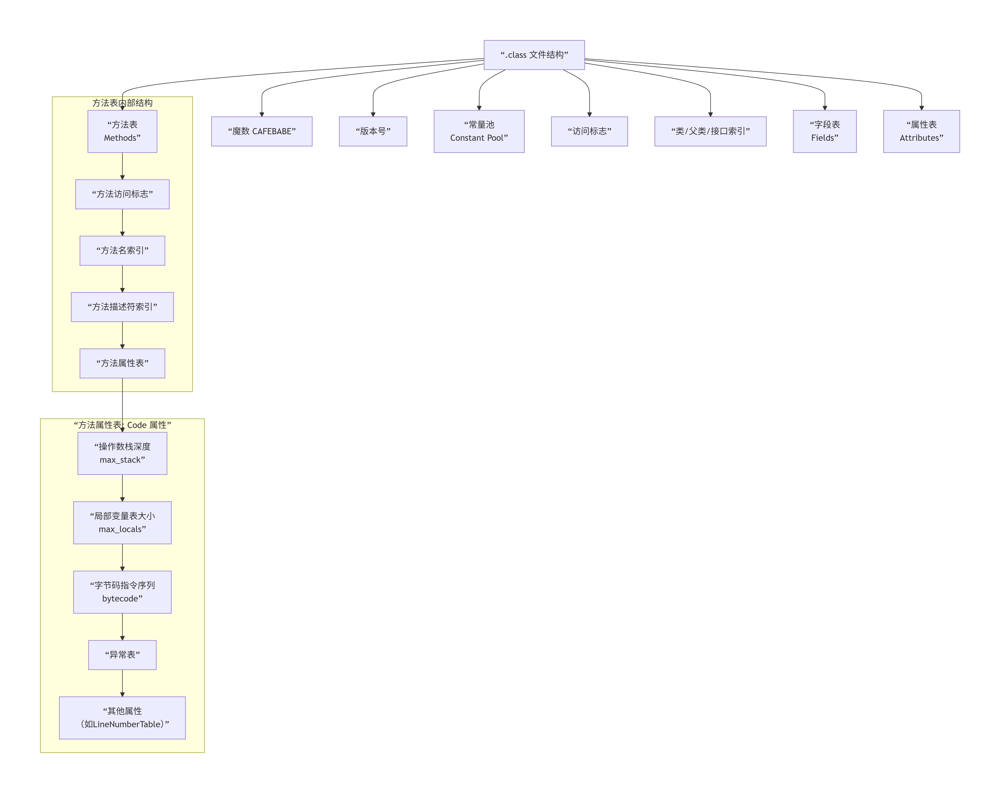 |
| :----------------------------------------------------------: |
| 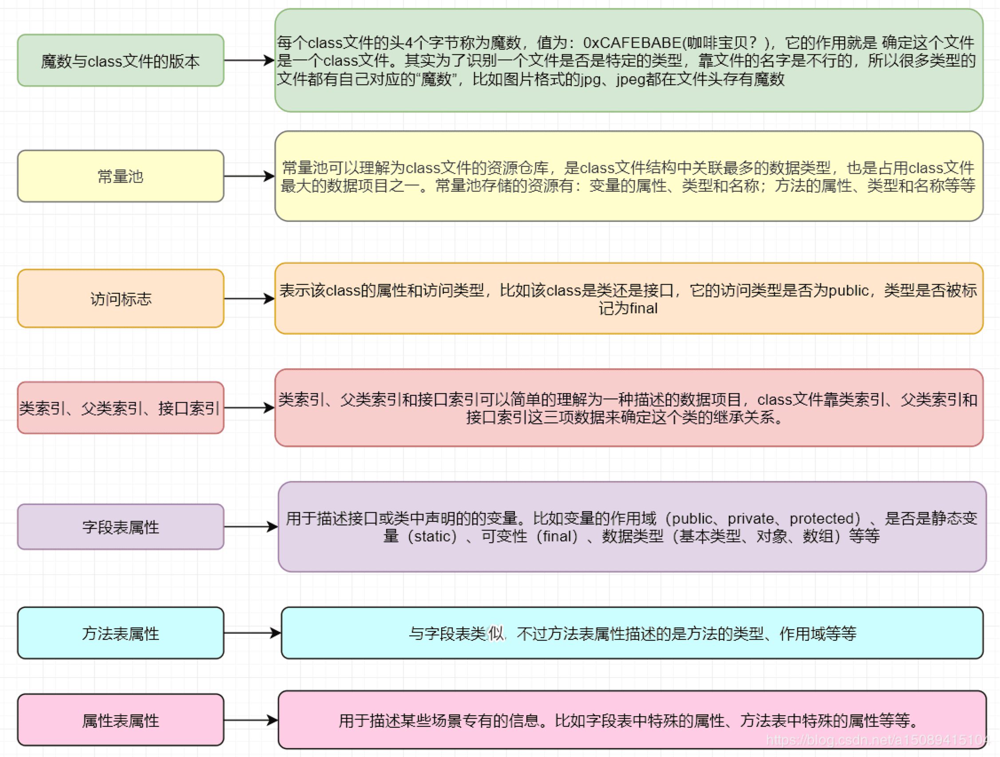 |

```bash
ClassFile {
    u4 magic;                     // 魔数：0xCAFEBABE
    u2 minor_version;             // 次版本号
    u2 major_version;             // 主版本号（JDK8=52，JDK11=55）
    u2 constant_pool_count;       // 常量池计数
    cp_info constant_pool[];      // 常量池
    u2 access_flags;              // 访问标志
    u2 this_class;                // 类索引
    u2 super_class;               // 父类索引
    u2 interfaces_count;          // 接口计数
    u2 interfaces[];              // 接口表
    u2 fields_count;              // 字段计数
    field_info fields[];          // 字段表
    u2 methods_count;             // 方法计数
    method_info methods[];        // 方法表
    u2 attributes_count;          // 属性计数
    attribute_info attributes[];  // 属性表
}
```

> Class文件是一组以8位字节为基础单位的二进制流，采用**大端序**存储。

#### 一 魔数（Magic Number）

- 固定值：`0xCAFEBABE`
- 作用：标识文件为Java类文件，确保JVM能正确识别
- 占用：4字节

> Java类文件以一个4字节的魔数开始，它的作用是确定这个文件是否为Java虚拟机所能够识别的class文件。魔数的固定值为0xCAFEBABE。

#### 二 版本信息

- 包含次版本号（minor_version）和主版本号（major_version）
- 作用：确认JVM的兼容性
- 占用：4字节

> **知识库依据**：[7]指出"Java虚拟机规范要求，如果一个class文件的主版本号为M，次版本号为m，并且M和m的取值范围分别在45到52之间（包含45和52），那么该class文件的版本号应该能够被虚拟机识别"。

#### 三 常量池（Constant Pool）

常量池是 `.class` 文件的 “字典”，所有字符串、类名、方法名等都存储在这里，通过索引（如 `#1`、`#2`）引用，避免重复存储

- 作用：存储类、方法、接口、字段等的引用
- 组成：

    - 常量池计数器(constant_pool_count)：占用前两个字节，记录着常量池的组成元素个数

    - 常量池项(cp_info)：元素信息，一共`constant_pool_count-1`个数量
- 类型：`CONSTANT_Class_info`等
    - `CONSTANT_Class_info`：类/接口符号（如 `java/lang/String`）
    - `CONSTANT_Fieldref_info`：字段符号（如 `java/lang/System.out`）
    - `CONSTANT_Methodref_info`：方法符号（如 `java/lang/Object.toString`）
    - `CONSTANT_String_info`：字符串字面量
    - `CONSTANT_Integer_info`：整数字面量
    - ...

- 存储：类中所有常量（字符串、数字、类名、方法名、字段名等），字节码指令会通过**索引**引用常量池中的内容（类似数组）
    - 字面量(Literal)：文本字符串、`final`常量值
    - 符号引用(Symbolic References)：类和接口全限定名、字段名称和描述符、方法名称和描述符
        - 类和接口的全限定名(Fully Qualified Name)
        - 字段的名称和描述符号(Descriptor)
        - 方法的名称和描述符

> * **常量池是字节码指令的操作数来源**：`getstatic #2` 中的 `#2` 是常量池索引。
> * 长度不固定，先用两个字节描述长度，真实长度为描述长度减一【0位置代表无引用，它也占一位】
> * 不同于C/C++, JVM是在加载Class文件的时候才进行的动态链接，也就是说这些字段和方法符号引用只有在运行期转换后才能获得真正的内存入口地址。当虚拟机运行时，需要从常量池获得对应的符号引用，再在类创建或运行时解析并翻译到具体的内存地址中。

```java
public class Hello {
    public static final String GREETING = "Hello";
    public void say() {}
}
```

常量池包含：`Hello`类名、`GREETING`字段名、`Ljava/lang/String;`描述符、`"Hello"`字符串常量、`say`方法名、`()V`描述符。

**cp_info的类型**

| 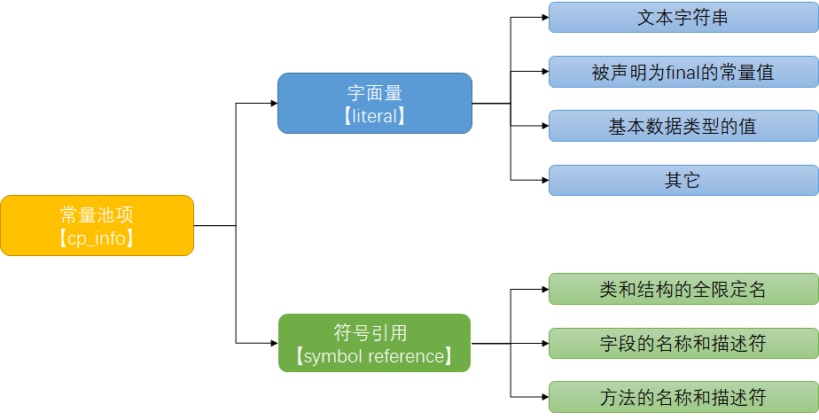 |
| :----------------------------------------------------------: |

| 常量类型                    | 值   |
| :-------------------------- | :--- |
| CONSTANT_CLASS              | 7    |
| CONSTANT_Fieldref           | 9    |
| CONSTANT_Methodref          | 10   |
| CONSTANT_InterfaceMethodref | 11   |
| CONSTANT_String             | 8    |
| CONSTANT_Integer            | 3    |
| CONSTANT_Float              | 4    |
| CONSTANT_Long               | 5    |
| CONSTANT_Double             | 6    |
| CONSTANT_NameAndType        | 12   |
| CONSTANT_Utf8               | 1    |
| CONSTANT_MethodHandle       | 15   |
| CONSTANT_MethodType         | 16   |
| CONSTANT_InvokeDynamic      | 18   |


**字节码的类型对应**

| 标识字符 | 含义                                       |
| -------- | ------------------------------------------ |
| B        | 基本类型byte                               |
| C        | 基本类型char                               |
| D        | 基本类型double                             |
| F        | 基本类型float                              |
| I        | 基本类型int                                |
| J        | 基本类型long                               |
| S        | 基本类型short                              |
| Z        | 基本类型boolean                            |
| V        | 特殊类型void                               |
| L        | 对象类型，以分号结尾，如Ljava/lang/Object; |

对于数组类型，每一位使用一个前置的`[`字符来描述，如定义一个`java.lang.String[][]`类型的维数组，将被记录为`[[Ljava/lang/String`。


**cp_info结构**

```
cp_info {
  ul tag;
  ul info[];
}
```

> 常量池数量是从1开始计数的并非从0开始，所有元素真实个数需要减一，将第0项常量空出来是为了满足执向常量池的索引数据在特定情况下表达“不引用任何一个常量池项”的含义。


#### 四 访问标志

类的访问标志：ACC_PUBLIC, ACC_SUPER

`access_flages`占有两个字节，没有使用到的标志为要求一律为0

| 标志名称       | 标志值  | 含义                                                 |
| :------------- | :------ | :--------------------------------------------------- |
| ACC_PUBLIC     | 0x00 01 | 是否为public类型                                     |
| ACC_FINAL      | 0x00 10 | 是否被声明为final，只有类可以设置                    |
| ACC_SUPER      | 0x00 20 | 是否允许使用invoke special字节码指令的新语义         |
| ACC_INTERFACE  | 0x02 00 | 标志这是一个接口                                     |
| ACC_ABSTRACT   | 0x04 00 | 是否为abstract类型，对于接口或者抽象类来说标志值为真 |
| ACC_SYNTHETIC  | 0x10 00 | 标志这个类并非由用户代码产生                         |
| ACC_ANNOTATION | 0x20 00 | 标志这是一个注解                                     |
| ACC_ENUM       | 0x40 00 | 标志这是一个枚举                                     |


#### 五 类及成员信息

- 包含访问标志（access_flags）
- 类索引（this_class）
- 父类索引（super_class）
- 接口索引集合（interfaces）

类索引：占用两个字节，指向常量池中的引用

父类索引：占用两个字节，指向常量池中的引用

接口索引集合：统计个数`interfaces_count`占用两个字节，`interfaces`占用`interfaces_count`*2个字节，每个interfaces指向常量池中的引用


#### 六 字段表集合

字段表【field_info】用于描述类中声明的变量，但是不包括在方法内部声明的局部变量

字段表的结构：

| 长度           | 名称             | 数量             |
| :------------- | :--------------- | :--------------- |
| u2             | access_flags     | 1                |
| u2             | name_index       | 1                |
| u2             | descriptor_index | 1                |
| u2             | attributes_count | 1                |
| attribute_info | attributes       | attributes_count |

`access_flags`访问标志值：

| 标志名称      | 标志值  | 含义                       |
| :------------ | :------ | :------------------------- |
| ACC_PUBLIC    | 0x00 01 | 字段是否为public           |
| ACC_PRIVATE   | 0x00 02 | 字段是否为private          |
| ACC_PROTECTED | 0x00 04 | 字段是否为protected        |
| ACC_STATIC    | 0x00 08 | 字段是否为static           |
| ACC_FINAL     | 0x00 10 | 字段是否为final            |
| ACC_VOLATILE  | 0x00 40 | 字段是否为volatile         |
| ACC_TRANSTENT | 0x00 80 | 字段是否为transient        |
| ACC_SYNCHETIC | 0x10 00 | 字段是否为由编译器自动产生 |
| ACC_ENUM      | 0x40 00 | 字段是否为enum             |


#### 七 方法表集合

**方法表（Method Info）**：存储类的所有方法，每个方法包含 **`Code`属性 **——**字节码指令的核心载体**，还包含局部变量表大小、操作数栈大小等执行信息。

在常量池之后的是对类内部的方法描述，在字节码中以表的集合形式表现，暂且不管字节码文件的16进制文件内容如何，直接看反编译后的内容。

```java
private int m;
  descriptor: I
  flags: ACC_PRIVATE
```

此处声明了一个私有变量m，类型为int，返回值为int

```java
public com.rhythm7.Main();
   descriptor: ()V
   flags: ACC_PUBLIC
   Code:
     stack=1, locals=1, args_size=1
        0: aload_0
        1: invokespecial 1                  // Method java/lang/Object."<init>":()V
        4: return
     LineNumberTable:
       line 3: 0
     LocalVariableTable:
       Start  Length  Slot  Name   Signature
           0       5     0  this   Lcom/rhythm7/Main;
```

这里是构造方法：Main()，返回值为void, 公开方法。

code内的主要属性为:

- **stack**: 最大操作数栈，JVM运行时会根据这个值来分配栈帧(Frame)中的操作栈深度,此处为1
- **locals**: 局部变量所需的存储空间，单位为Slot, Slot是虚拟机为局部变量分配内存时所使用的最小单位，为4个字节大小。方法参数(包括实例方法中的隐藏参数this)，显示异常处理器的参数(try catch中的catch块所定义的异常)，方法体中定义的局部变量都需要使用局部变量表来存放。值得一提的是，locals的大小并不一定等于所有局部变量所占的Slot之和，因为局部变量中的Slot是可以重用的。
- **args_size**: 方法参数的个数，这里是1，因为每个实例方法都会有一个隐藏参数this
- **attribute_info**: 方法体内容，0,1,4为字节码"行号"，该段代码的意思是将第一个引用类型本地变量推送至栈顶，然后执行该类型的实例方法，也就是常量池存放的第一个变量，也就是注释里的`java/lang/Object."":()V`, 然后执行返回语句，结束方法。
- **LineNumberTable**: 该属性的作用是描述源码行号与字节码行号(字节码偏移量)之间的对应关系。可以使用 -g:none 或-g:lines选项来取消或要求生成这项信息，如果选择不生成LineNumberTable，当程序运行异常时将无法获取到发生异常的源码行号，也无法按照源码的行数来调试程序。
- **LocalVariableTable**: 该属性的作用是描述帧栈中局部变量与源码中定义的变量之间的关系。可以使用 -g:none 或 -g:vars来取消或生成这项信息，如果没有生成这项信息，那么当别人引用这个方法时，将无法获取到参数名称，取而代之的是arg0, arg1这样的占位符。 start 表示该局部变量在哪一行开始可见，length表示可见行数，Slot代表所在帧栈位置，Name是变量名称，然后是类型签名。

同理可以分析Main类中的另一个方法"inc()":

方法体内的内容是：将this入栈，获取字段2并置于栈顶, 将int类型的1入栈，将栈内顶部的两个数值相加，返回一个int类型的值。


#### 八 属性表集合

在class文件，字段表，方法表都可以携带自己的属性表集合用于描述某些场景专有的信息

| 属性名称                            | 使用位置           | 含义                                                         |
| :---------------------------------- | :----------------- | :----------------------------------------------------------- |
| Code                                | 方法表             | Java代码编译成的字节码指令                                   |
| ConstantValue                       | 字段表             | final关键字定义的常量池                                      |
| Deprecated                          | 类，方法表，字段表 | 被声明为deprecated的方法和字段                               |
| Exceptions                          | 方法表             | 方法抛出的异常                                               |
| EnclosingMethod                     | 类文件             | 仅当一个类为局部类或者匿名类是才能拥有这个属性，这个属性用于标识这个类所在的外围方法 |
| InnerClass                          | 类文件             | 内部类列表                                                   |
| LineNumberTable                     | Code属性           | Java源码的行号与字节码指令的对应关系                         |
| LocalVariableTable                  | Code属性           | 方法的局部变量描述                                           |
| StackMapTable                       | Code属性           | 供新的类型检查检验器检查和处理目标方法的局部变量和操作数有所需要的类是否匹配 |
| Signature                           | 类，方法表，字段表 | 用于支持泛型情况下的方法签名                                 |
| SourceFile                          | 类文件             | 记录源文件名称                                               |
| SourceDebugExtension                | 类文件             | 用于存储额外的调试信息                                       |
| Synthetic                           | 类，方法表，字段表 | 标志方法或字段为编译器自动生成的                             |
| LocalVariableTypeTable              | 类                 | 使用特征签名代替描述符，是为了引入泛型语法之后能描述泛型参数化类型而添加 |
| RuntimeVisibleAnnotations           | 类，方法表，字段表 | 为动态注解提供支持                                           |
| RuntimeInvisibleAnnotations         | 表，方法表，字段表 | 用于指明哪些注解是运行时不可见的                             |
| RuntimeVisibleParameterAnnotation   | 方法表             | 作用与RuntimeVisibleAnnotations属性类似，只不过作用对象为方法 |
| RuntimeInvisibleParameterAnnotation | 方法表             | 作用与RuntimeInvisibleAnnotations属性类似，作用对象哪个为方法参数 |
| AnnotationDefault                   | 方法表             | 用于记录注解类元素的默认值                                   |
| BootstrapMethods                    | 类文件             | 用于保存invokeddynamic指令引用的引导方式限定符               |


### JVM栈帧结构

```text
+---------------------------------------+
|             栈帧 (Stack Frame)        |
+---------------------------------------+
|        1. 局部变量表 (LocalVars)      |  <-- 存参数、局部变量、this
+---------------------------------------+
|        2. 操作数栈   (Operand Stack)  |  <-- 字节码计算、赋值、调用的“临时工作台”
+---------------------------------------+
|        3. 动态链接   (Dynamic Link)    |  <-- 指向运行时常量池，方法/字段的符号引用
+---------------------------------------+
|        方法返回地址 (Return Address)   |  <-- 执行完回到哪里（辅助，非核心）
+---------------------------------------+
```

JVM 执行方法时，会为每个方法创建一个**栈帧**（存放在 Java 虚拟机栈中），栈帧是方法执行的**上下文环境**，字节码的所有指令都在栈帧中执行。

* 每个方法调用 = 一个栈帧
* JVM 是“基于栈”的（没有寄存器，只有操作数栈）
* **字节码指令的执行，本质就是对「操作数栈」和「局部变量表」的操作**（入栈、出栈、赋值、取值）。


#### 局部变量表（Local Variable Table）

存储方法的局部变量（包括方法参数、局部变量、this 指针），通过**索引**访问（索引从 0 开始，类似数组）

######  是什么

- 一个**索引数组**，下标从 `0` 开始
- 存储：
    - 方法参数
    - 方法内定义的局部变量
- 单位：**槽 (Slot)**，long/double 占 2 个槽，其它类型占 1 个槽

> * 实例方法：索引 0 为`this`指针，参数从索引 1 开始；
> * 静态方法：无`this`指针，参数从索引 0 开始；

###### 可视化结构

以 **实例方法** `public void test(int a, long b)` 为例：

```
局部变量表 (LocalVars)
下标(index)：  0        1        2        3
内容：        this      a     b(高32)  b(低32)
类型：       引用类型    int     long(占2槽)
```

- 静态方法没有 `this`，下标从 `0` 直接是第一个参数
- 字节码指令 `iload_n`、`istore_n`、`aload_n` 就是**读写这个数组**

###### 作用

- 给字节码提供**变量的读写位置**
- 所有局部变量、参数、this 都在这里，不存于堆


#### 操作数栈 （Operand Stack）

**栈式执行模型的核心**，字节码指令的操作数入栈 / 出栈的地方，类似临时计算器（如执行`1+1`时，先将两个 1 压入栈，再弹出相加，结果压回栈）

###### 是什么

JVM 是 **栈式执行引擎**，所有计算、赋值、方法调用、对象操作，**全部在操作数栈上完成**。

- 后进先出 (LIFO)
- 字节码指令只做两件事：**压栈 (push)、出栈 (pop)**
- 方法执行时，深度固定（编译器已算好，存在 Code 属性里：`Stack=xxx`）

###### 作用

**字节码的 “计算器工作台”**

- 加载变量：`iload_1` → 从局部变量表取值 **压栈**
- 运算：`iadd` → 弹出两个数，计算，结果 **压栈**
- 赋值：`istore_2` → 栈顶值 **出栈** 存入局部变量表
- 方法调用：参数先压栈，再执行 `invokexxx`

> **字节码最核心的执行场所**，没有之一。


#### 动态链接（Dynamic Linking）

指向当前类的常量池，字节码指令通过索引引用常量池中的内容（如获取字符串、调用方法）

###### 是什么

栈帧中保存一个**引用**，指向当前类的 **运行时常量池**。

作用：

- 字节码里调用方法、访问字段，写的不是内存地址，而是**常量池索引**（如 `#2`、`#5`）
- 运行时，通过动态链接去常量池查：
    - 类名
    - 方法名、描述符
    - 字段名
- 然后把**符号引用**解析为**直接引用**（内存地址）

###### 简单示意

```
栈帧
+---------------------------+
| 动态链接                   |
|  (指向运行时常量池的引用)   |
+---------------------------+
          ↓
运行时常量池：
#1 = Methodref  #2.#3   // java/lang/Object."<init>":()V
#2 = Class      #4      // java/lang/Object
#3 = NameAndType #5:#6   // "<init>":()V
...
```

###### 作用

- 支撑 **多态、动态分派**
- 支撑字节码的跨平台、可移植性（编译只存符号，不写死内存地址）


#### 返回地址


#### 一次完整的字节码执行过程

```java
public class Demo {
    public void test() {
        int a = 1;
        int b = 2;
        int c = a + b;
    }
}
```

##### 字节码

```
0: iconst_1
1: istore_1
2: iconst_2
3: istore_2
4: iload_1
5: iload_2
6: iadd
7: istore_3
8: return
```

##### 逐指令 + 栈帧可视化

初始状态：这是实例方法，局部变量表下标 `0 = this`。

```
局部变量表： [ this | 空 | 空 | 空 ]
下标：         0     1    2    3

操作数栈：    [ 空 ]  ← 栈顶
```

###### 指令 0：`iconst_1`

把常量 1 **压栈**

```
操作数栈：    [ 1 ]
```

###### 指令 1：`istore_1`

栈顶 1 **出栈**，存入局部变量表下标 1 → 即 `a=1`

```
局部变量表： [ this | 1 | 空 | 空 ]
操作数栈：    [ 空 ]
```

###### 指令 2：`iconst_2`

压入 2

```
操作数栈：    [ 2 ]
```

###### 指令 3：`istore_2`

出栈 2 → 存入下标 2 → `b=2`

```
局部变量表： [ this | 1 | 2 | 空 ]
操作数栈：    [ 空 ]
```

###### 指令 4：`iload_1`

取局部变量表 1 号，压栈

```
操作数栈：    [ 1 ]
```

###### 指令 5：`iload_2`

取局部变量表 2 号，压栈

```
操作数栈：    [ 1 | 2 ]  ← 栈顶是2
```

###### 指令 6：`iadd`

弹出 2、弹出 1 → 1+2=3 → 压入 3

```
操作数栈：    [ 3 ]
```

###### 指令 7：`istore_3`

出栈 3 → 存入下标 3 → `c=3`

```
局部变量表： [ this | 1 | 2 | 3 ]
操作数栈：    [ 空 ]
```

###### 指令 8：`return`

方法结束，栈帧弹出，销毁。


### 常量池详解

#### 常量池类型

```java
// 常量池主要类型（tag值）
CONSTANT_Class = 7              // 类或接口符号引用
CONSTANT_Fieldref = 9           // 字段符号引用
CONSTANT_Methodref = 10         // 方法符号引用
CONSTANT_InterfaceMethodref = 11 // 接口方法符号引用
CONSTANT_String = 8             // 字符串字面量
CONSTANT_Integer = 3            // int字面量
CONSTANT_Float = 4              // float字面量
CONSTANT_Long = 5               // long字面量
CONSTANT_Double = 6             // double字面量
CONSTANT_NameAndType = 12       // 字段或方法的部分符号引用
CONSTANT_Utf8 = 1               // UTF-8编码字符串
CONSTANT_MethodHandle = 15      // 方法句柄
CONSTANT_MethodType = 16        // 方法类型
CONSTANT_InvokeDynamic = 18     // 动态调用点
```

#### 常量池示例

```text
Constant pool:
   #1 = Methodref          #6.#20         // java/lang/Object."<init>":()V
   #2 = Fieldref           #21.#22        // java/lang/System.out:Ljava/io/PrintStream;
   #3 = Methodref          #23.#24        // java/io/PrintStream.println:(I)V
   #4 = Class              #25            // java/lang/ArithmeticException
   #5 = Methodref          #4.#26         // java/lang/ArithmeticException.printStackTrace:()V
   #6 = Class              #27            // java/lang/Object
   #7 = Utf8               <init>
   #8 = Utf8               ()V
   #9 = Utf8               Code
  #10 = Utf8               LineNumberTable
  #11 = Utf8               LocalVariableTable
  #12 = Utf8               this
  #13 = Utf8               Lcom/example/MyClass;
  #14 = Utf8               loop
  #15 = Utf8               tryCatch
  #16 = Utf8               StackMapTable
  #17 = Utf8               add
  #18 = Utf8               (II)I
  #19 = Utf8               SourceFile
  #20 = NameAndType        #7:#8          // "<init>":()V
  #21 = Class              #28            // java/lang/System
  #22 = NameAndType        #29:#30        // out:Ljava/io/PrintStream;
  #23 = Class              #31            // java/io/PrintStream
  #24 = NameAndType        #32:#33        // println:(I)V
  #25 = Utf8               java/lang/ArithmeticException
  #26 = NameAndType        #34:#8         // printStackTrace:()V
  #27 = Utf8               java/lang/Object
  #28 = Utf8               java/lang/System
  #29 = Utf8               out
  #30 = Utf8               Ljava/io/PrintStream;
  #31 = Utf8               java/io/PrintStream
  #32 = Utf8               println
  #33 = Utf8               (I)V
  #34 = Utf8               printStackTrace
```


### 字节码属性表

#### Code属性

```text
Code:
  stack=2                     // 操作数栈最大深度
  locals=4                    // 局部变量表大小
  args_size=3                // 参数数量（包括this）
  // 字节码指令
  // 异常表
  // 各种子属性...
```

#### 常见属性

```java
LineNumberTable:       // 源码行号与字节码偏移量映射
LocalVariableTable:    // 局部变量表信息
StackMapTable:        // 用于类型检查（Java 6+）
Exceptions:           // 方法声明的受检异常
InnerClasses:         // 内部类信息
BootstrapMethods:     // invokedynamic引导方法
Signature:            // 泛型签名信息
SourceFile:           // 源文件名称
```


## 字节码指令

JVM指令由**操作码（Opcode，1字节）** + **操作数（Operand，0-N字节）**组成。

| 类型          | 前缀/范围                                      | 用途                         |
| ------------- | ---------------------------------------------- | ---------------------------- |
| **加载/存储** | `iload`, `istore`, `aload`, `astore`           | 局部变量表与操作数栈数据传输 |
| **常量加载**  | `iconst`, `ldc`, `bipush`, `sipush`            | 将常量压入操作数栈           |
| **运算**      | `iadd`, `isub`, `imul`, `idiv`, `irem`         | 算术运算                     |
| **类型转换**  | `i2l`, `i2f`, `l2i`, `checkcast`               | 基本类型/引用类型转换        |
| **对象操作**  | `new`, `getfield`, `putfield`, `invokevirtual` | 创建对象、访问字段、调用方法 |
| **操作数栈**  | `pop`, `dup`, `swap`                           | 直接操作栈                   |
| **控制转移**  | `ifeq`, `goto`, `tableswitch`                  | 条件/无条件跳转              |
| **方法返回**  | `ireturn`, `areturn`, `return`                 | 方法返回                     |
| **同步**      | `monitorenter`, `monitorexit`                  | synchronized实现             |

> new ≠ 构造完成


**数据类型前缀**

| 前缀  |        数据类型        |               示例                |
| :---: | :--------------------: | :-------------------------------: |
|   i   |  int（整数，最常用）   |        iload、iadd、istore        |
|   l   |          long          |        lload、ladd、lstore        |
|   f   |         float          |        fload、fadd、fstore        |
|   d   |         double         |        dload、dadd、dstore        |
|   a   | 引用类型（对象、数组） |     aload、anewarray、astore      |
| s/b/c |    short/byte/char     | 会自动提升为 int 处理，无单独指令 |
| void  |        无返回值        |              return               |

> **boolean** 用 **int** 指令：`0=false, 1=true`。

**操作行为后缀**

|  关键字 / 后缀  |                操作行为                |                             示例                             |
| :-------------: | :------------------------------------: | :----------------------------------------------------------: |
|      load       | 从**局部变量表**加载数据到**操作数栈** |         iload_1（从局部变量表索引 1 加载 int 到栈）          |
|      store      | 从**操作数栈**弹出数据到**局部变量表** |         istore_2（将栈顶 int 存入局部变量表索引 2）          |
|      const      |         将**常量**压入操作数栈         |    iconst_1（将常量 1 压入栈）、ldc（加载常量池中的常量）    |
| add/sub/mul/div |     算术运算（加 / 减 / 乘 / 除）      |    iadd（栈顶两个 int 相加）、lsub（栈顶两个 long 相减）     |
|       cmp       |                比较运算                |       icmpgt（int 大于比较）、lcmpeq（long 等于比较）        |
|       if        |          条件分支（if 判断）           |        ifeq（等于 0 则跳转）、ifne（不等于 0 则跳转）        |
|      goto       |               无条件跳转               |            goto 10（跳转到指令偏移量 10 的位置）             |
|    invokexxx    |                调用方法                | invokevirtual（调用实例方法）、invokestatic（调用静态方法）  |
|  new/anewarray  |            创建对象 / 数组             |       new（创建类实例）、anewarray（创建引用类型数组）       |
|     return      |                方法返回                | ireturn（返回 int）、areturn（返回引用类型）、return（无返回） |

**类型描述符**

| 描述符         | 含义                                                         |
| -------------- | ------------------------------------------------------------ |
| `I`            | int                                                          |
| `L`            | long                                                         |
| `F`            | float                                                        |
| `D`            | double                                                       |
| `Z`            | boolean                                                      |
| `B`            | byte                                                         |
| `C`            | char                                                         |
| `S`            | short                                                        |
| `V`            | void                                                         |
| `L类名;`       | 对象类型（如`Ljava/lang/String;`）                           |
| `[类型`        | 数组（如`[I`表示int\[]，`[[Ljava/lang/Object;`表示Object\[]\[]） |
| `(参数)返回值` | 方法描述符（如`(II)I`表示两个int参数返回int）                |


#### 常量 / 变量操作指令

用于将局部变量压入操作数栈，或从操作数栈弹出到局部变量表：

| 指令                | 作用                                    | 示例场景                          |
| ------------------- | --------------------------------------- | --------------------------------- |
| `iload_n`           | 将局部变量表索引 n 的 int 值压入栈      | `iload_0`（压入索引 0 的 int）    |
| `lload_n`           | 将局部变量表索引 n 的 long 值压入栈     | `lload_1`（压入索引 1 的 long）   |
| `fload_n`/`dload_n` | 压入 float/double 值                    | -                                 |
| `aload_n`           | 将局部变量表索引 n 的引用值压入栈       | `aload_0`（压入 this 指针）       |
| `istore_n`          | 弹出栈顶 int 值，存入局部变量表索引 n   | `istore_2`（存入索引 2）          |
| `astore_n`          | 弹出栈顶引用值，存入局部变量表索引 n    | `astore_1`（存入引用变量）        |
| `bipush`            | 将单字节常量压入栈（范围 -128~127）     | `bipush 10`（压入 10）            |
| `sipush`            | 将双字节常量压入栈（范围 -32768~32767） | `sipush 1000`（压入 1000）        |
| `ldc`               | 从常量池加载常量（如字符串、int 常量）  | `ldc #3`（加载常量池索引 3 的值） |

示例代码与字节码：

```java
public static void testLoadStore() {
    int a = 10;
    int b = 20;
    int c = a + b;
}
```

编译后的字节码（`javap -c 类名` 查看

```plaintext
public static void testLoadStore();
  Code:
     0: bipush        10          // 压入常量 10
     2: istore_0       // 弹出 10，存入局部变量表索引 0（a=10）
     3: bipush        20          // 压入常量 20
     5: istore_1       // 弹出 20，存入局部变量表索引 1（b=20）
     6: iload_0        // 压入 a（10）
     7: iload_1        // 压入 b（20）
     8: iadd           // 10+20=30，压入结果
     9: istore_2       // 弹出 30，存入局部变量表索引 2（c=30）
    10: return         // 方法返回
```


|            指令            |                       功能                       |                           示例场景                           |
| :------------------------: | :----------------------------------------------: | :----------------------------------------------------------: |
|     iconst_n（n=0~5）      |            将 int 常量 n 压入操作数栈            |                  赋值`int a=1;` → iconst_1                   |
|            ldc             | 从**常量池**加载常量（int>5、字符串、float 等）  | 赋值`int a=10;` → ldc #1（#1 是常量池索引）；`String s="hello"` → ldc #2 |
|  iload_n/lload_n/aload_n   |   从局部变量表索引 n 加载对应类型到栈（n=0~3）   | 实例方法中`this.xxx` → aload_0（加载 this）；参数`int a` → iload_1 |
| istore_n/lstore_n/astore_n |     将栈顶数据存入局部变量表索引 n（n=0~3）      |             赋值`int a=1;` → iconst_1 → istore_1             |
|       bipush/sipush        | 加载单字节 / 双字节常量（-128~127/-32768~32767） |    `int a=100;` → bipush 100；`int a=2000;` → sipush 2000    |

###### 从局部变量表加载到操作数栈

- `iload_<n>`：加载int类型变量
- `aload_<n>`：加载引用类型变量
- `lload_<n>`：加载long类型变量
- `fload_<n>`：加载float类型变量
- `dload_<n>`：加载double类型变量

###### 从操作数栈存储到局部变量表

- `istore_<n>`：存储int类型变量
- `astore_<n>`：存储引用类型变量
- `lstore_<n>`：存储long类型变量
- `fstore_<n>`：存储float类型变量
- `dstore_<n>`：存储double类型变量

###### 常量加载到操作数栈

- `iconst_<i>`：加载int常量
- `bipush`：加载-128～127的int常量
- `sipush`：加载-32768～32767的int常量
- `ldc`：从常量池加载复杂常量


#### 算术 / 比较指令（处理运算、条件判断）

算术运算指令（操作数栈上的计算）

对操作数栈顶的数值执行算术运算，结果压回栈（指令后缀 `i`=int、`l`=long、`f`=float、`d`=double）：

| 指令          | 作用                               | 示例                           |
| ------------- | ---------------------------------- | ------------------------------ |
| `iadd`/`ladd` | 栈顶两个 int/long 值相加，结果压栈 | `iload_0 iload_1 iadd`（a+b）  |
| `isub`/`lsub` | 栈顶两个值相减（后弹值 - 先弹值）  | `iload_1 iload_0 isub`（b-a）  |
| `imul`/`lmul` | 相乘                               | -                              |
| `idiv`/`ldiv` | 相除（整数除法，向下取整）         | `bipush 10 bipush 3 idiv`（3） |
| `irem`/`lrem` | 取余                               | `bipush 10 bipush 3 irem`（1） |
| `ineg`        | 栈顶 int 值取反                    | `bipush 5 ineg`（-5）          |


|         指令         |                        功能                         |                注意点                |
| :------------------: | :-------------------------------------------------: | :----------------------------------: |
| iadd/ladd/fadd/dadd  |             栈顶两个数相加，结果压回栈              |  操作数栈：弹出 2 个→计算→压入 1 个  |
| isub/lsub/fsub/dsub  |                        减法                         |                 同上                 |
| imul/lmul/fmul/dmul  |                        乘法                         |                 同上                 |
| idiv/ldiv/fdiv/ddiv  |                        除法                         |                 同上                 |
| icmpgt/icmplt/icmpeq | int 比较：大于 / 小于 / 等于，结果压入栈（1/-1/ 0） |        用于 if 判断的前置操作        |
|         lcmp         |          long 比较，结果压入栈（1/-1/ 0）           | float/double 有单独的 cmpg/cmpl 指令 |

###### 算术与逻辑运算指令

- **整型运算**：`iadd`、`isub`、`imul`、`idiv`、`irem`
- **浮点运算**：`fadd`、`fsub`、`fmul`、`fdiv`
- **位运算**：`ishl`、`ishr`、`iand`、`ior`、`ixor`
- **自增指令**：`iinc`（直接对局部变量表中的int值自增）


#### 类型转换指令

用于不同数值类型之间的转换（宽化转换自动完成，窄化转换需显式指令）：

| 指令  | 作用           | 说明                     |
| ----- | -------------- | ------------------------ |
| `i2l` | int → long     | 宽化转换（无精度损失）   |
| `i2f` | int → float    | 可能损失精度             |
| `l2i` | long → int     | 窄化转换（截断高位）     |
| `f2d` | float → double | 宽化转换                 |
| `d2i` | double → int   | 窄化转换（截断小数部分） |

#### 示例：

```java
public static long intToLong(int a) {
    return (long) a;
}
```

字节码：

```plaintext
0: iload_0        // 压入 int a
1: i2l            // int → long
2: lreturn        // 返回 long 值
```


#### 分支 / 跳转指令（处理 if、for、while、switch）

控制流指令（分支、循环、跳转）

用于改变字节码的执行顺序（对应 if、for、while 等语法）：

| 指令                          | 作用                           | 示例场景                                          |
| ----------------------------- | ------------------------------ | ------------------------------------------------- |
| `ifeq`                        | 栈顶 int 值为 0 则跳转         | `iload_0 ifeq 10`（if (a==0) 跳转到第 10 行）     |
| `ifne`                        | 栈顶 int 值不为 0 则跳转       | `iload_0 ifne 10`（if (a!=0)）                    |
| `iflt`/`ifgt`                 | 栈顶 int 值 <0 />0 则跳转      | `iload_0 ifgt 10`（if (a>0)）                     |
| `if_icmpeq`                   | 栈顶两个 int 值相等则跳转      | `iload_0 iload_1 if_icmpeq 10`（if (a==b)）       |
| `if_acmpeq`                   | 栈顶两个引用值相等则跳转       | `aload_0 aload_1 if_acmpeq 10`（if (obj1==obj2)） |
| `goto`                        | 无条件跳转                     | `goto 5`（跳转到第 5 行）                         |
| `tableswitch`                 | switch 语句（case 是连续整数） | -                                                 |
| `lookupswitch`                | switch 语句（case 是离散整数） | -                                                 |
| `return`                      | 方法返回（无返回值）           | -                                                 |
| `ireturn`/`lreturn`/`areturn` | 返回 int/long/ 引用类型值      | -                                                 |

示例（if-else 分支）：

```java
public static int max(int a, int b) {
    if (a > b) {
        return a;
    } else {
        return b;
    }
}
```

```plaintext
public static int max(int, int);
  Code:
     0: iload_0        // 压入 a
     1: iload_1        // 压入 b
     2: if_icmple     7  // 若 a <= b，跳转到第 7 行（else 分支）
     5: iload_0        // 压入 a（if 分支）
     6: ireturn        // 返回 a
     7: iload_1        // 压入 b（else 分支）
     8: ireturn        // 返回 b
```


|           指令           |                 功能                 |                       适用场景                        |
| :----------------------: | :----------------------------------: | :---------------------------------------------------: |
|           ifeq           |         栈顶 int 为 0 则跳转         |                       if(a==0)                        |
|           ifne           |        栈顶 int 不为 0 则跳转        |                       if(a!=0)                        |
|      ifgt/iflt/ifeq      | 栈顶 int 大于 / 小于 / 等于 0 则跳转 |              if(a>0)、if(a<0)、if(a==0)               |
|   if_icmpgt/if_icmplt    |       弹出两个 int，比较后跳转       |                   if(a>b)、if(a<b)                    |
|           goto           |        无条件跳转到指定偏移量        |              for/while 循环的循环体跳转               |
| tableswitch/lookupswitch |           处理 switch 语句           | tableswitch（连续 case）、lookupswitch（非连续 case） |

###### 控制流指令

- 条件跳转：
    - `ifeq`：等于0跳转
    - `ifne`：不等于0跳转
    - `if_icmpeq`：两个int相等跳转
    - `if_icmpne`：不相等跳转
- 无条件跳转：
    - `goto`：直接跳转到指定偏移量
- 表跳转：
    - `tableswitch`：适用于连续的case值（如switch语句）
    - `lookupswitch`：适用于稀疏的case值


#### 方法调用 / 返回指令（处理方法调用、返回值）

|          指令           |                    功能                     |                 核心特点                 |
| :---------------------: | :-----------------------------------------: | :--------------------------------------: |
|    **invokestatic**     |         调用**静态方法**（static）          |      直接通过类名调用，无虚方法分派      |
|    **invokevirtual**    | 调用**实例方法**（非 static/final/private） | 最常用，支持**虚方法分派**（多态的核心） |
|      invokespecial      | 调用**构造方法、private 方法、super 方法**  |          无虚方法分派，直接调用          |
|     invokeinterface     |              调用**接口方法**               |              支持虚方法分派              |
|      invokedynamic      |      调用动态方法（Lambda、动态代理）       |       JDK7 新增，支持动态语言特性        |
| ireturn/lreturn/areturn |         返回 int/long/ 引用类型数据         |      将栈顶数据作为返回值，弹出栈帧      |
|       **return**        |            无返回值（void 方法）            |               直接弹出栈帧               |

> 核心重点：**invokevirtual 是多态的底层实现**，JVM 会通过「动态分派」找到实际的实现类方法；invokestatic/invokespecial 是静态分派，编译期确定调用的方法。

###### 方法返回指令

- `ireturn`：返回int
- `lreturn`：返回long
- `freturn`：返回float
- `dreturn`：返回double
- `areturn`：返回对象引用
- `return`：返回void


#### 对象 / 数组操作指令（处理 new 对象、数组）

用于对象的创建、字段访问、方法调用等核心操作：

| 指令              | 作用                                          | 示例场景                                          |
| ----------------- | --------------------------------------------- | ------------------------------------------------- |
| `new`             | 创建对象（分配堆内存，返回引用）              | `new #2`（创建常量池索引 2 的类实例）             |
| `invokespecial`   | 调用构造方法、私有方法、父类方法              | `invokespecial #3`（调用构造方法 `<init>`）       |
| `invokevirtual`   | 调用实例方法（支持多态，动态分派）            | `aload_0 invokevirtual #4`（调用对象的方法）      |
| `invokeinterface` | 调用接口方法                                  | -                                                 |
| `invokestatic`    | 调用静态方法                                  | `invokestatic #5`（调用 `Math.abs()`）            |
| `getfield`        | 获取对象的实例字段值                          | `aload_0 getfield #6`（获取 `this.name`）         |
| `putfield`        | 给对象的实例字段赋值                          | `aload_0 ldc #7 putfield #6`（`this.name="Tom"`） |
| `getstatic`       | 获取类的静态字段值                            | `getstatic #8`（获取 `User.count`）               |
| `putstatic`       | 给类的静态字段赋值                            | `bipush 10 putstatic #8`（`User.count=10`）       |
| `checkcast`       | 类型强制转换检查（失败抛 ClassCastException） | `aload_0 checkcast #2`（`(User) obj`）            |
| `instanceof`      | 检查对象是否是某个类的实例（返回 boolean）    | `aload_0 instanceof #2`（`obj instanceof User`）  |

示例（对象创建与方法调用）：

```java
class User {
    private String name;
    public User(String name) {
        this.name = name;
    }
    public String getName() {
        return name;
    }
}

public static void testObject() {
    User user = new User("Tom");
    String name = user.getName();
}
```

```plaintext
public static void testObject();
  Code:
     0: new           #2                  // class User（创建 User 实例，引用压栈）
     3: dup                               // 复制引用（一个用于调用构造方法，一个用于赋值）
     4: ldc           #3                  // String "Tom"（压入构造方法参数）
     6: invokespecial #4                  // Method User."<init>":(Ljava/lang/String;)V（调用构造方法）
     9: astore_0                          // 弹出 User 引用，存入局部变量表索引 0（user=实例）
    10: aload_0                           // 压入 user 引用
    11: invokevirtual #5                  // Method User.getName:()Ljava/lang/String;（调用实例方法，多态）
    14: astore_1                          // 弹出 name 引用，存入局部变量表索引 1（name="Tom"）
    15: return
```


|         指令         |                功能                 |                             示例                             |
| :------------------: | :---------------------------------: | :----------------------------------------------------------: |
|       **new**        |        创建**类的实例对象**         |       `new Object();` → new #1（常量池中的 Object 类）       |
|         dup          |            复制栈顶数据             |         new 对象后必须 dup（为了调用构造方法和赋值）         |
| invokespecial <init> |          调用**构造方法**           |           所有 new 对象后都会调用，完成对象初始化            |
|  anewarray/newarray  | 创建**引用类型数组 / 基本类型数组** | `String[] arr = new String[5];` → anewarray；`int[] arr = new int[5];` → newarray |
|     arraylength      |            获取数组长度             |                    将数组长度压入操作数栈                    |
|    aaload/iaload     |        从数组中加载元素到栈         |                 引用数组 /int 数组的元素取值                 |
|    aastore/istore    |         将栈顶数据存入数组          |                 引用数组 /int 数组的元素赋值                 |

###### 对象操作指令

- `new`：创建新对象
- `invokespecial`：调用构造函数、私有方法或父类方法
- `invokevirtual`：调用实例方法（动态分派）
- `invokestatic`：调用静态方法
- `invokeinterface`：调用接口方法
- `getfield`/`putfield`：读写实例字段
- `getstatic`/`putstatic`：读写静态字段


#### 其他常用指令

|   指令   |           功能           |                     场景                     |
| :------: | :----------------------: | :------------------------------------------: |
|   dup    |       复制栈顶数据       | new 对象后（需要一份给构造方法，一份给赋值） |
| pop/pop2 | 弹出栈顶 1 个 / 2 个数据 |       清理操作数栈（无使用的临时数据）       |
|   swap   |     交换栈顶两个数据     |               调整操作数栈顺序               |

###### 类型转换指令

- `i2l`：int转long
- `f2d`：float转double
- `d2i`：double转int
- `i2f`：int转float

###### 异常处理指令

- `athrow`：抛出异常
- 异常表：在Code属性中定义try-catch块的捕获范围

###### 同步指令

- `monitorenter`：进入同步块（获取对象锁）
- `monitorexit`：退出同步块（释放对象锁）

###### 数组操作指令

- `newarray`：创建基本类型数组
- `anewarray`：创建对象数组
- `arraylength`：获取数组长度
- `iaload`/`aaload`：加载数组元素
- `iastore`/`aastore`：存储数组元素


方法调用

| 指令            | 使用场景       |
| --------------- | -------------- |
| invokevirtual   | 普通实例方法   |
| invokespecial   | 构造 / private |
| invokestatic    | 静态方法       |
| invokeinterface | 接口           |
| invokedynamic   | lambda         |


#### 异常处理指令（try-catch-finally）

JVM 不直接有 `try`/`catch` 指令，而是通过**异常表（Exception Table）** 实现异常处理：

- 异常表存储在方法的 Code 属性中，记录 “异常类型、捕获范围（起始行号 - 结束行号）、处理逻辑入口”；
- 执行时若发生异常，JVM 遍历异常表，匹配异常类型和当前指令行号，找到对应的处理逻辑；
- `athrow` 指令：手动抛出异常（对应 `throw` 关键字）。

示例（try-catch）：

```java
public static void testException() {
    try {
        int a = 10 / 0;
    } catch (ArithmeticException e) {
        System.out.println("除数为0");
    }
}
```

字节码（核心部分）：

```plaintext
public static void testException();
  Code:
     0: bipush        10
     2: iconst_0
     3: idiv           // 10/0，可能抛出 ArithmeticException
     4: pop
     5: goto          13
     8: astore_0       // 捕获异常，存入局部变量表索引 0（e）
     9: getstatic     #6                  // Field java/lang/System.out:Ljava/io/PrintStream;
    12: invokevirtual #7                  // Method java/io/PrintStream.println:(Ljava/lang/String;)V
    15: goto          23
  Exception table:
     from    to  target type
         0     5     8   Class java/lang/ArithmeticException // 0-5 行发生该异常，跳转到 8 行处理
```

- 异常表说明：若在指令 0-5 行（try 块）发生 `ArithmeticException`，则跳转到指令 8 行（catch 块）处理。


#### 同步指令（synchronized 锁机制）

`synchronized` 块的底层通过 `monitorenter` 和 `monitorexit` 指令实现：

- `monitorenter`：进入同步块，获取对象的监视器锁（monitor），若锁被占用则阻塞；
- `monitorexit`：退出同步块，释放监视器锁（异常退出时也会执行，确保锁释放）。

示例（synchronized 块）

```java
public static void testSync() {
    Object lock = new Object();
    synchronized (lock) {
        System.out.println("同步块");
    }
}
```

字节码（核心部分）：

```plaintext
10: aload_1                           // 压入 lock 对象引用
11: monitorenter                      // 获取 lock 的监视器锁
12: getstatic     #6                  // 执行同步块内逻辑（打印）
15: invokevirtual #7
18: aload_1                           // 压入 lock 引用
19: monitorexit                       // 释放锁（正常退出）
20: goto          28
23: astore_2                          // 捕获异常
24: aload_1                           // 压入 lock 引用
25: monitorexit                       // 释放锁（异常退出）
26: aload_2
27: athrow
```

- 注意：字节码中会生成两个 `monitorexit` 指令，确保正常执行和异常退出时都能释放锁。


#### 操作数栈管理指令

- `pop`：弹出栈顶一个元素。
- `dup`：复制栈顶数值，并将复制值压入栈顶。
- 一个元素和两个元素出栈指令：`pop`、`pop2`
- 复制栈顶一个或两个数值并将复制或双份复制值重新压入栈顶：`dup`、`dup2`、`dup_x1`、`dup_x2`
- 将栈顶的两个数值替换：`swap`


#### 异常处理指令

 `athrow`用于显示抛出异常时（明确throw new RuntimeException和Exception均会），但是对于”i/0“这种未显示表明的抛出是不会使用athrow的。


## 字节码分析

### 简单方法

* 案例一

```java
// Java源代码
public int add(int a, int b) {
    int c = a + b;
    return c;
}
```

```text
// 对应的字节码
public int add(int, int);
  descriptor: (II)I
  flags: (0x0001) ACC_PUBLIC
  Code:
    stack=2, locals=4, args_size=3
       0: iload_1        // 加载第一个参数a到栈（非静态方法局部变量0是this）
       1: iload_2        // 加载第二个参数b到栈
       2: iadd           // 栈顶两个int相加
       3: istore_3       // 结果存储到局部变量c（索引3）
       4: iload_3        // 加载c到栈
       5: ireturn        // 返回结果
    LineNumberTable:
      line 10: 0
      line 11: 4
    LocalVariableTable:
      Start  Length  Slot  Name   Signature
          0       6     0  this   Lcom/example/MyClass;
          0       6     1     a   I
          0       6     2     b   I
          4       2     3     c   I
```

* 案例二

```java
public class Demo {
    public static void main(String[] args) {
        int a = 1;
        int b = 2;
        System.out.println(a + b);
    }
}
```

```
public class Demo {
  public Demo();
    Code:
        0: aload_0
        1: invokespecial #1                  // Method java/lang/Object."<init>":()V
        4: return

  public static void main(java.lang.String[]);
    Code:
        0: iconst_1
        1: istore_1
        2: iconst_2
        3: istore_2
        4: iload_1
        5: iload_2
        6: iadd
        7: istore_3
        8: getstatic     #2                  // Field java/lang/System.out:Ljava/io/PrintStream;
        11: iload_3
        12: invokevirtual #3                  // Method java/io/PrintStream.println:(I)V
        15: return
}
```

**执行过程**：

1. `iconst_1`：将常量1压入操作数栈
2. `istore_1`：将栈顶的1存储到局部变量表的第1个槽位（a=1）
3. `iconst_2`：将常量2压入操作数栈
4. `istore_2`：将栈顶的2存储到局部变量表的第2个槽位（b=2）
5. `iload_1`：将局部变量a（1）压入操作数栈
6. `iload_2`：将局部变量b（2）压入操作数栈
7. `iadd`：弹出栈顶两个值（1和2）相加，将结果3压入栈
8. `istore_3`：将结果3存储到局部变量表的第3个槽位
9. `getstatic #2`：获取System.out
10. `iload_3`：将结果3压入操作数栈
11. `invokevirtual #3`：调用println方法，打印3


### 循环结构

```java
// Java源代码
public void loop() {
    for (int i = 0; i < 10; i++) {
        System.out.println(i);
    }
}
```

```text
public void loop();
  descriptor: ()V
  flags: (0x0001) ACC_PUBLIC
  Code:
    stack=2, locals=2, args_size=1
       0: iconst_0           // 常量0入栈
       1: istore_1           // 存储到局部变量i
       2: iload_1            // 加载i到栈
       3: bipush        10   // 常量10入栈
       5: if_icmpge     22   // 如果i>=10，跳转到22（循环结束）
       8: getstatic     #2   // Field java/lang/System.out:Ljava/io/PrintStream;
      11: iload_1
      12: invokevirtual #3   // Method java/io/PrintStream.println:(I)V
      15: iinc          1, 1 // i自增1
      18: goto          2    // 跳转到位置2继续循环
      21: return
    LineNumberTable: ...
```

### 条件判断

```java
public class ByteCodeDemo {
    public int test3(int a) {
        if (a > 0) {
            return 1;
        } else {
            return 0;
        }
    }
}
```

```text
public int test3(int);
  Code:
   0: iload_1          // 步骤1：加载方法参数a（局部变量表索引1）到操作数栈
   1: ifle          6  // 步骤2：判断栈顶a是否≤0，若是则跳转到指令偏移量6的位置（else分支）
   4: iconst_1         // 步骤3：若a>0（不跳转），将1压入栈（if分支）
   5: ireturn          // 步骤4：返回栈顶的1，方法结束
   6: iconst_0         // 步骤5：若a≤0（跳转至此），将0压入栈（else分支）
   7: ireturn          // 步骤6：返回栈顶的0，方法结束
```

**核心总结**

1. if-else 的底层是 **「比较指令 + 条件跳转指令」**，`ifle`表示**int less or equal**（≤0 则跳转）；
2. 指令偏移量：字节码指令的行号（0、1、4、5、6、7），跳转指令指定的是**偏移量**；
3. 分支执行后，通过`ireturn`返回对应值，方法提前结束。


### 对象创建

new/dup/invokespecial，对象初始化核心

```java
public class ByteCodeDemo {
    public void test4() {
        Object obj = new Object(); // 创建对象并赋值
    }
}
```

```text
public void test4();
  Code:
   0: new           #2  // 步骤1：创建Object类的实例，将对象引用压入栈（#2是常量池中的Object类）
   3: dup             // 步骤2：复制栈顶的对象引用（此时栈有两个相同的引用）
   4: invokespecial #1 // 步骤3：调用Object的构造方法<init>()（#1是常量池中的构造方法）
   7: astore_1        // 步骤4：将栈顶的对象引用弹出，存入局部变量表索引1（obj）
   8: return          // 步骤5：方法返回
```

**核心问题：为什么要执行`dup`指令？**

new 创建对象后，栈顶是**对象的引用**，需要做两件事：

1. 调用构造方法`invokespecial <init>()`：需要消耗对象引用；

2. 将对象引用赋值给变量obj：需要对象引用；

    因此必须通过dup复制一份引用，一份给构造方法，一份给赋值 ——这是 new 对象的固定字节码流程：new → dup → invokespecial → astore_n。

**对象创建的字节码固定模板**

```text
new #N（类的常量池索引） → dup → invokespecial #M（构造方法索引） → astore_n（局部变量表存储）
```


### 方法调用

invokestatic/invokevirtual，多态的底层

* 案例一

```java
public class ByteCodeDemo {
    public static void staticMethod() {
        // 静态方法
    }
    public void instanceMethod() {
        // 实例方法
    }
    public void test5() {
        staticMethod(); // 调用静态方法
        this.instanceMethod(); // 调用实例方法
        new ByteCodeDemo().instanceMethod(); // 新建对象调用实例方法
    }
}
```

```java
public void test5();
  Code:
   0: invokestatic  #3  // 调用静态方法staticMethod() → invokestatic
   3: aload_0            // 加载this（局部变量表索引0）到栈
   4: invokevirtual #4  // 调用实例方法instanceMethod() → invokevirtual
   7: new           #5  // 新建ByteCodeDemo实例
  10: dup               // 复制引用
  11: invokespecial #6  // 调用构造方法<init>() → invokespecial
  14: invokevirtual #4  // 调用实例方法instanceMethod() → invokevirtual
  17: return
```

* 案例二

```java
public void objectOp() {
    String s = new String("Hello");  // new, dup, ldc, invokespecial
    int len = s.length();            // invokevirtual
}
```

```bash
0: new           #2    // class java/lang/String  分配内存，压入引用
3: dup                 // 复制栈顶引用（用于构造函数调用后保持引用）
4: ldc           #3    // String "Hello"  从常量池加载字符串
6: invokespecial #4    // Method java/lang/String."<init>":(Ljava/lang/String;)V
9: astore_1            // 存入slot 1（变量s）
10: aload_1            // 加载s
11: invokevirtual #5   // Method java/lang/String.length:()I
14: istore_2           // 存入slot 2（变量len）
15: return
```

* 案例三

```java
public class BytecodeDemo {
    private int count = 0;
    
    public void increment() {
        count++;
    }
    
    public synchronized void syncMethod() {
        count++;
    }
    
    public static void main(String[] args) {
        BytecodeDemo demo = new BytecodeDemo();
        demo.increment();
    }
}
```

```bash
// 构造方法
public BytecodeDemo();
    Code:
       0: aload_0
       1: invokespecial #1   // Object.<init>
       4: aload_0
       5: iconst_0
       6: putfield      #2   // Field count:I
       9: return

// increment方法（非线程安全）
public void increment();
    Code:
       0: aload_0           // this
       1: dup               // 复制this引用
       2: getfield      #2  // 获取count值压栈
       5: iconst_1          // 压入1
       6: iadd              // count + 1
       7: putfield      #2  // 存回count字段
      10: return

// syncMethod（synchronized方法）
public synchronized void syncMethod();
    Code:
       0: aload_0
       1: dup
       2: getfield      #2
       5: iconst_1
       6: iadd
       7: putfield      #2
      10: return
    // 注意：synchronized修饰方法时，字节码中没有monitorenter/exit，
    // 而是在方法访问标志中有ACC_SYNCHRONIZED，由JVM隐式处理

// main方法
public static void main(java.lang.String[]);
    Code:
       0: new           #3   // class BytecodeDemo
       3: dup
       4: invokespecial #4   // <init>
       7: astore_1           // demo
       8: aload_1
       9: invokevirtual #5   // increment
      12: return
```


**方法调用指令区别**：

- `invokevirtual`：虚方法调用（大多数实例方法，支持多态）
- `invokeinterface`：接口方法调用（运行时搜索实现类）
- `invokespecial`：构造方法、私有方法、父类方法（静态绑定）
- `invokestatic`：静态方法调用
- `invokedynamic`：动态调用（JDK7+，支持Lambda、方法引用）

**核心总结**

1. **静态方法**：用`invokestatic`，编译期确定调用者，无虚方法分派；
2. **实例方法**：用`invokevirtual`，运行期动态分派（多态的核心）；
3. **构造方法**：用`invokespecial`，直接调用，无虚方法分派；
4. 新建对象调用实例方法：遵循`new→dup→invokespecial→invokevirtual`的流程。


### 异常处理

* 简单异常

```java
// Java源代码
public void tryCatch() {
    try {
        int i = 1 / 0;
    } catch (ArithmeticException e) {
        e.printStackTrace();
    }
}
```

```text
public void tryCatch();
  descriptor: ()V
  flags: (0x0001) ACC_PUBLIC
  Code:
    stack=2, locals=3, args_size=1
       0: iconst_1
       1: iconst_0
       2: idiv               // 可能抛出ArithmeticException
       3: istore_1
       4: goto          16   // 正常执行，跳转到16
       7: astore_1           // 异常对象存储到局部变量e
       8: aload_1            // 加载e
       9: invokevirtual #4   // Method java/lang/ArithmeticException.printStackTrace:()V
      12: goto          16   // 跳转到方法结束
      15: return
      16: return
    Exception table:
       from    to  target type
           0     4     7   Class java/lang/ArithmeticException
```

* 复杂异常

```java
public class TestCode {
    public int foo() {
        int x;
        try {
            x = 1;
            return x;
        } catch (Exception e) {
            x = 2;
            return x;
        } finally {
            x = 3;
        }
    }
}
```

试问当不发生异常和发生异常的情况下，foo()的返回值分别是多少。

```java
javac TestCode.java
javap -verbose TestCode.class
```

查看字节码的foo方法内容:

```java
public int foo();
    descriptor: ()I
    flags: ACC_PUBLIC
    Code:
      stack=1, locals=5, args_size=1
         0: iconst_1 //int型1入栈 ->栈顶=1
         1: istore_1 //将栈顶的int型数值存入第二个局部变量 ->局部2=1
         2: iload_1 //将第二个int型局部变量推送至栈顶 ->栈顶=1
         3: istore_2 //!!将栈顶int型数值存入第三个局部变量 ->局部3=1
         
         4: iconst_3 //int型3入栈 ->栈顶=3
         5: istore_1 //将栈顶的int型数值存入第二个局部变量 ->局部2=3
         6: iload_2 //!!将第三个int型局部变量推送至栈顶 ->栈顶=1
         7: ireturn //从当前方法返回栈顶int数值 ->1
         
         8: astore_2 // ->局部3=Exception
         9: iconst_2 // ->栈顶=2
        10: istore_1 // ->局部2=2
        11: iload_1 //->栈顶=2
        12: istore_3 //!! ->局部4=2
        
        13: iconst_3 // ->栈顶=3
        14: istore_1 // ->局部1=3
        15: iload_3 //!! ->栈顶=2
        16: ireturn // -> 2
        
        17: astore        4 //将栈顶引用型数值存入第五个局部变量=any
        19: iconst_3 //将int型数值3入栈 -> 栈顶3
        20: istore_1 //将栈顶第一个int数值存入第二个局部变量 -> 局部2=3
        21: aload         4 //将局部第五个局部变量(引用型)推送至栈顶
        23: athrow //将栈顶的异常抛出
      Exception table:
         from    to  target type
             0     4     8   Class java/lang/Exception //0到4行对应的异常，对应8中储存的异常
             0     4    17   any //Exeption之外的其他异常
             8    13    17   any
            17    19    17   any
```

在字节码的4,5，以及13,14中执行的是同一个操作，就是将int型的3入操作数栈顶，并存入第二个局部变量。这正是源码在finally语句块中内容。也就是说，JVM在处理异常时，会在每个可能的分支都将finally语句重复执行一遍。

通过一步步分析字节码，可以得出最后的运行结果是：

- 不发生异常时: return 1
- 发生异常时: return 2
- 发生非Exception及其子类的异常，抛出异常，不返回值


### 双锁检查

```java
// Java源代码
public class Singleton {
    private static volatile Singleton instance;
    
    public static Singleton getInstance() {
        if (instance == null) {
            synchronized (Singleton.class) {
                if (instance == null) {
                    instance = new Singleton();
                }
            }
        }
        return instance;
    }
}
```

```text
// 对应的字节码（注意monitorenter/monitorexit）
getstatic     #2      // Field instance:LSingleton;
ifnonnull     37
ldc           #3      // class Singleton
dup
astore_0
monitorenter
getstatic     #2
ifnonnull     28
new           #3
dup
invokespecial #4      // Method "<init>":()V
putstatic     #2      // Field instance:LSingleton;
aload_0
monitorexit
goto          37
// 异常处理...
```


### Lambda表达式

```java
// Java 8 lambda
Runnable r = () -> System.out.println("Hello");
```

```text
// 使用invokedynamic
invokedynamic #5, 0   // InvokeDynamic #0:run:()Ljava/lang/Runnable;
astore_1

// BootstrapMethods:
BootstrapMethods:
  0: #27 REF_invokeStatic java/lang/invoke/LambdaMetafactory.metafactory:
     (Ljava/lang/invoke/MethodHandles$Lookup;
      Ljava/lang/String;
      Ljava/lang/invoke/MethodType;
      Ljava/lang/invoke/MethodType;
      Ljava/lang/invoke/MethodHandle;
      Ljava/lang/invoke/MethodType;)Ljava/lang/invoke/CallSite;
```


### try-with-resources

```java
// Java 7+ try-with-resources
try (BufferedReader br = new BufferedReader(new FileReader("file.txt"))) {
    br.readLine();
}
```

```text
// 自动生成finally块调用close()
// 使用异常表确保资源关闭
Code:
  // 创建资源
  // try块代码
  // 异常处理
Exception table:
  // 处理异常并确保调用close()
```

### synchronized代码块

```java
public void syncBlock() {
    synchronized (this) {
        count++;
    }
}
```

```bash
0: aload_0
1: dup
2: astore_2              // 存储锁对象到slot 2
3: monitorenter          // 获取监视器锁
4: aload_0
5: dup
6: getfield      #2      // count
9: iconst_1
10: iadd
11: putfield      #2     // count++
14: aload_2              // 加载锁对象
15: monitorexit          // 释放锁
16: goto          24     // 正常结束
19: astore_3             // 异常处理开始（确保异常时也能释放锁）
20: aload_2
21: monitorexit
22: aload_3
23: athrow               // 抛出异常
24: return
```

> 编译器会自动生成异常处理表，确保`monitorexit`一定会执行。


### kotlin函数扩展的实现

kotlin提供了扩展函数的语言特性，借助这个特性，可以给任意对象添加自定义方法。

以下示例为Object添加"sayHello"方法

```java
//SayHello.kt
package com.rhythm7

fun Any.sayHello() {
    println("Hello")
}
```

编译后，使用javap查看生成SayHelloKt.class文件的字节码。

```java
Classfile /E:/JavaCode/TestProj/out/production/TestProj/com/rhythm7/SayHelloKt.class
Last modified 2018-4-8; size 958 bytes
 MD5 checksum 780a04b75a91be7605cac4655b499f19
 Compiled from "SayHello.kt"
public final class com.rhythm7.SayHelloKt
 minor version: 0
 major version: 52
 flags: ACC_PUBLIC, ACC_FINAL, ACC_SUPER
Constant pool:
    //省略常量池部分字节码
{
 public static final void sayHello(java.lang.Object);
   descriptor: (Ljava/lang/Object;)V
   flags: ACC_PUBLIC, ACC_STATIC, ACC_FINAL
   Code:
     stack=2, locals=2, args_size=1
        0: aload_0
        1: ldc           9                  // String $receiver
        3: invokestatic  15                 // Method kotlin/jvm/internal/Intrinsics.checkParameterIsNotNull:(Ljava/lang/Object;Ljava/lang/String;)V
        6: ldc           17                 // String Hello
        8: astore_1
        9: getstatic     23                 // Field java/lang/System.out:Ljava/io/PrintStream;
       12: aload_1
       13: invokevirtual 28                 // Method java/io/PrintStream.println:(Ljava/lang/Object;)V
       16: return
     LocalVariableTable:
       Start  Length  Slot  Name   Signature
           0      17     0 $receiver   Ljava/lang/Object;
     LineNumberTable:
       line 4: 6
       line 5: 16
   RuntimeInvisibleParameterAnnotations:
     0:
       0: 7()
}
SourceFile: "SayHello.kt"
```

观察头部发现,koltin为文件SayHello生成了一个类，类名"com.rhythm7.SayHelloKt".

由于一开始编写SayHello.kt时并不希望SayHello是一个可实例化的对象类，所以，SayHelloKt是无法被实例化的，SayHelloKt并没有任何一个构造器。

再观察唯一的一个方法：发现Any.sayHello()的具体实现是静态不可变方法的形式:

```java
public static final void sayHello(java.lang.Object);
```

所以当在其他地方使用Any.sayHello()时，事实上等同于调用java的SayHelloKt.sayHello(Object)方法。

顺便一提的是，当扩展的方法为Any时，意味着Any是non-null的，这时，编译器会在方法体的开头检查参数的非空，即调用 `kotlin.jvm.internal.Intrinsics.checkParameterIsNotNull(Object value, String paramName)` 方法来检查传入的Any类型对象是否为空。如果扩展的函数为`Any?.sayHello()`，那么在编译后的文件中则不会有这段字节码的出现。


## 字节码优化

### JIT 优化

- **常量折叠**：`int x = 2 + 3;` → `int x = 5;`
- **死代码消除**：移除不可能执行的代码
- **方法内联**：小方法调用替换为方法体

###### 逃逸分析

```java
public void test() {
    Object o = new Object();
}
```

👉 对象不逃逸：

- 不进堆
- 栈上分配
- 不触发 GC

###### 锁消除

```java
synchronized (new Object()) {
}
```

👉 字节码有锁
 👉 JIT 直接消除

###### synchronized 字节码

```java
monitorenter
monitorexit
```


### 循环优化

```java
// 优化前（每次循环调用size()）
for (int i = 0; i < list.size(); i++) {
    // ...
}

// 优化后（缓存size()结果）
for (int i = 0, n = list.size(); i < n; i++) {
    // ...
}
```

```text
# 优化前（每次循环调用size()）
  5: aload_1
  6: invokeinterface #2, 1   // InterfaceMethod java/util/List.size:()I
 11: if_icmpge      ...

# 优化后（缓存size）
  5: aload_1
  6: invokeinterface #2, 1
 11: istore_2
 12: iload_1
 13: iload_2
 14: if_icmpge      ...
```


### 装箱优化

```java
// 自动装箱会产生额外开销
Integer sum = 0;
for (int i = 0; i < 100; i++) {
    sum += i;  // 每次循环都装箱
}

// 优化：使用基本类型
int sum = 0;
for (int i = 0; i < 100; i++) {
    sum += i;
}
```


###  字符串优化

```java
// Java 8及之前：StringBuilder
String s = "a" + "b" + "c";
// 编译为：new StringBuilder().append("a").append("b").append("c").toString()

// Java 9+：invokedynamic（动态拼接）
// 使用StringConcatFactory优化
```


### Lambda表达式

```java
// 源代码
Runnable r = () -> System.out.println("Hello");

// 编译后
private static void lambda$main$0() {
    System.out.println("Hello");
}

// 创建时
Runnable r = new Runnable() {
    public void run() {
        lambda$main$0();
    }
};

// Java 8+ 实际使用invokedynamic
```

**字节码特点**：

- 生成私有静态方法存放Lambda体
- 使用`invokedynamic`指令绑定方法引用
- 无类膨胀问题（相比匿名内部类）


## 字节码增强

### 增强工具

| 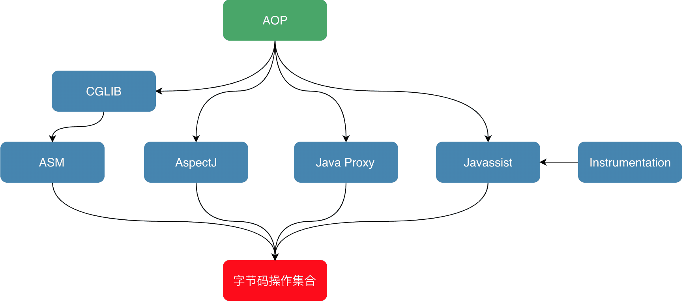 |
| :----------------------------------------------------------: |


#### ASM

对于需要手动操纵字节码的需求，可以使用ASM，它可以直接生产 .class字节码文件，也可以在类被加载入JVM之前动态修改类行为（如下图17所示）。ASM的应用场景有AOP（Cglib就是基于ASM）、热部署、修改其他jar包中的类等。

| 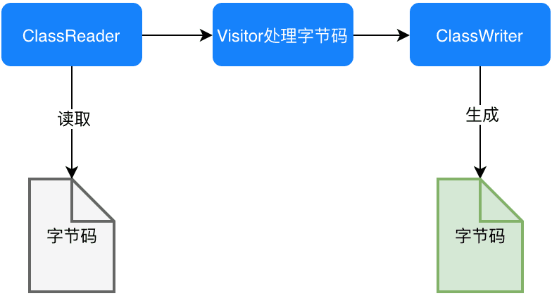 |
| :----------------------------------------------------------: |


##### ASM API

###### 核心API

ASM Core API可以类比解析XML文件中的SAX方式，不需要把这个类的整个结构读取进来，就可以用流式的方法来处理字节码文件。好处是非常节约内存，但是编程难度较大。然而出于性能考虑，一般情况下编程都使用Core API。

- ClassReader：用于读取已经编译好的.class文件。
- ClassWriter：用于重新构建编译后的类，如修改类名、属性以及方法，也可以生成新的类的字节码文件。
- 各种Visitor类：如上所述，CoreAPI根据字节码从上到下依次处理，对于字节码文件中不同的区域有不同的Visitor，比如用于访问方法的MethodVisitor、用于访问类变量的FieldVisitor、用于访问注解的AnnotationVisitor等。为了实现AOP，重点要使用的是MethodVisitor。


###### 树形API

ASM Tree API可以类比解析XML文件中的DOM方式，把整个类的结构读取到内存中，缺点是消耗内存多，但是编程比较简单。TreeApi不同于CoreAPI，TreeAPI通过各种Node类来映射字节码的各个区域，类比DOM节点，就可以很好地理解这种编程方式。


##### 利用ASM实现AOP

利用ASM的CoreAPI来增强类。这里不纠结于AOP的专业名词如切片、通知，只实现在方法调用前、后增加逻辑，通俗易懂且方便理解。首先定义需要被增强的Base类：其中只包含一个process()方法，方法内输出一行“process”。增强后，期望的是，方法执行前输出“start”，之后输出”end”。

```java
public class Base {
    public void process(){
        System.out.println("process");
    }
}
```

为了利用ASM实现AOP，需要定义两个类：一个是MyClassVisitor类，用于对字节码的visit以及修改；另一个是Generator类，在这个类中定义ClassReader和ClassWriter，其中的逻辑是，classReader读取字节码，然后交给MyClassVisitor类处理，处理完成后由ClassWriter写字节码并将旧的字节码替换掉。Generator类较简单，先看一下它的实现，如下所示，然后重点解释MyClassVisitor类。

```java
public class Generator {
    public static void main(String[] args) throws Exception {
		//读取
        ClassReader classReader = new ClassReader("meituan/bytecode/asm/Base");
        ClassWriter classWriter = new ClassWriter(ClassWriter.COMPUTE_MAXS);
        //处理
        ClassVisitor classVisitor = new MyClassVisitor(classWriter);
        classReader.accept(classVisitor, ClassReader.SKIP_DEBUG);
        byte[] data = classWriter.toByteArray();
        //输出
        File f = new File("operation-server/target/classes/meituan/bytecode/asm/Base.class");
        FileOutputStream fout = new FileOutputStream(f);
        fout.write(data);
        fout.close();
        System.out.println("now generator cc success!!!!!");
    }
}
```

MyClassVisitor继承自ClassVisitor，用于对字节码的观察。它还包含一个内部类MyMethodVisitor，继承自MethodVisitor用于对类内方法的观察，它的整体代码如下：

```java
public class MyClassVisitor extends ClassVisitor implements Opcodes {
    public MyClassVisitor(ClassVisitor cv) {
        super(ASM5, cv);
    }
    @Override
    public void visit(int version, int access, String name, String signature,
                      String superName, String[] interfaces) {
        cv.visit(version, access, name, signature, superName, interfaces);
    }
    @Override
    public MethodVisitor visitMethod(int access, String name, String desc, String signature, String[] exceptions) {
        MethodVisitor mv = cv.visitMethod(access, name, desc, signature,
                exceptions);
        //Base类中有两个方法：无参构造以及process方法，这里不增强构造方法
        if (!name.equals("<init>") && mv != null) {
            mv = new MyMethodVisitor(mv);
        }
        return mv;
    }
    class MyMethodVisitor extends MethodVisitor implements Opcodes {
        public MyMethodVisitor(MethodVisitor mv) {
            super(Opcodes.ASM5, mv);
        }

        @Override
        public void visitCode() {
            super.visitCode();
            mv.visitFieldInsn(GETSTATIC, "java/lang/System", "out", "Ljava/io/PrintStream;");
            mv.visitLdcInsn("start");
            mv.visitMethodInsn(INVOKEVIRTUAL, "java/io/PrintStream", "println", "(Ljava/lang/String;)V", false);
        }
        @Override
        public void visitInsn(int opcode) {
            if ((opcode >= Opcodes.IRETURN && opcode <= Opcodes.RETURN)
                    || opcode == Opcodes.ATHROW) {
                //方法在返回之前，打印"end"
                mv.visitFieldInsn(GETSTATIC, "java/lang/System", "out", "Ljava/io/PrintStream;");
                mv.visitLdcInsn("end");
                mv.visitMethodInsn(INVOKEVIRTUAL, "java/io/PrintStream", "println", "(Ljava/lang/String;)V", false);
            }
            mv.visitInsn(opcode);
        }
    }
}
```

利用这个类就可以实现对字节码的修改。详细解读其中的代码，对字节码做修改的步骤是：

- 首先通过MyClassVisitor类中的visitMethod方法，判断当前字节码读到哪一个方法了。跳过构造方法 `<init>` 后，将需要被增强的方法交给内部类MyMethodVisitor来进行处理。
- 接下来，进入内部类MyMethodVisitor中的visitCode方法，它会在ASM开始访问某一个方法的Code区时被调用，重写visitCode方法，将AOP中的前置逻辑就放在这里。 MyMethodVisitor继续读取字节码指令，每当ASM访问到无参数指令时，都会调用MyMethodVisitor中的visitInsn方法。判断了当前指令是否为无参数的“return”指令，如果是就在它的前面添加一些指令，也就是将AOP的后置逻辑放在该方法中。
- 综上，重写MyMethodVisitor中的两个方法，就可以实现AOP了，而重写方法时就需要用ASM的写法，手动写入或者修改字节码。通过调用methodVisitor的visitXXXXInsn()方法就可以实现字节码的插入，XXXX对应相应的操作码助记符类型，比如mv.visitLdcInsn(“end”)对应的操作码就是ldc “end”，即将字符串“end”压入栈。 完成这两个visitor类后，运行Generator中的main方法完成对Base类的字节码增强，增强后的结果可以在编译后的target文件夹中找到Base.class文件进行查看，可以看到反编译后的代码已经改变了。然后写一个测试类MyTest，在其中new Base()，并调用base.process()方法，可以看到下图右侧所示的AOP实现效果：

| 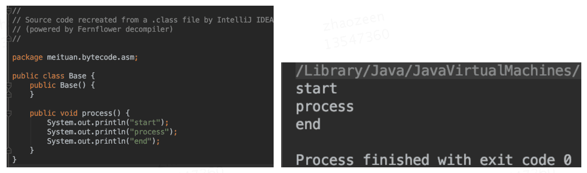 |
| :----------------------------------------------------------: |


##### ASM工具

利用ASM手写字节码时，需要利用一系列visitXXXXInsn()方法来写对应的助记符，所以需要先将每一行源代码转化为一个个的助记符，然后通过ASM的语法转换为visitXXXXInsn()这种写法。第一步将源码转化为助记符就已经够麻烦了，不熟悉字节码操作集合的话，需要将代码编译后再反编译，才能得到源代码对应的助记符。第二步利用ASM写字节码时，如何传参也很令人头疼。ASM社区也知道这两个问题，所以提供了工具ASM ByteCode Outline。

安装后右键选择“Show Bytecode Outline”，在新标签页中选择“ASMified”这个tab，如图所示，就可以看到这个类中的代码对应的ASM写法了。图中上下两个红框分别对应AOP中的前置逻辑于后置逻辑，将这两块直接复制到visitor中的visitMethod()以及visitInsn()方法中，就可以了。

| 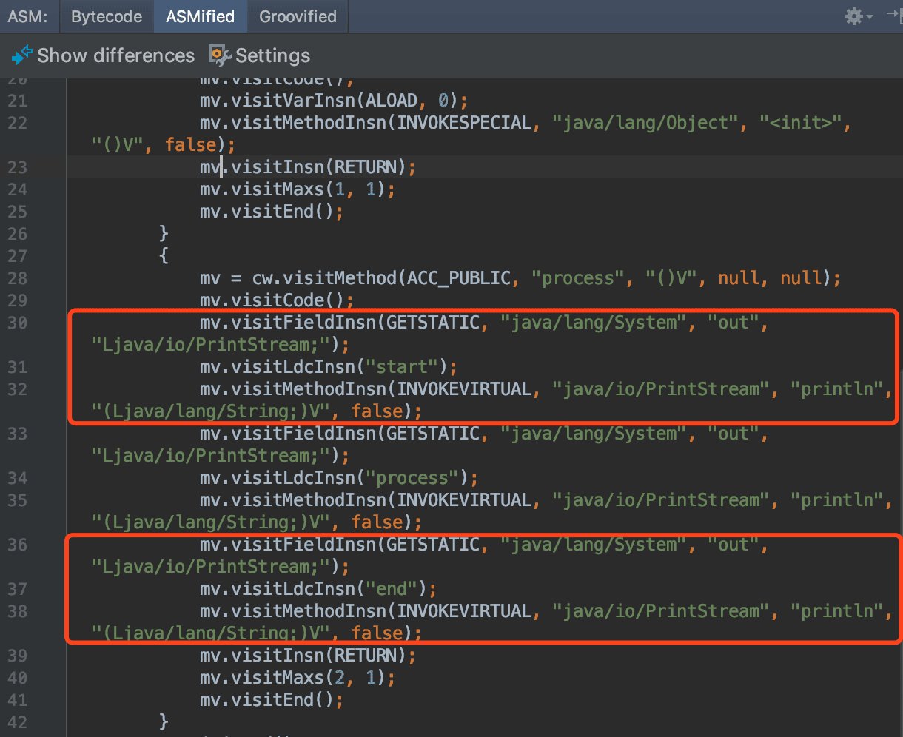 |
| :----------------------------------------------------------: |


##### 字节码插桩实战：方法耗时统计（ASM 模板）

```java
class MethodTimerAdapter extends MethodVisitor {
    public MethodTimerAdapter(MethodVisitor mv) {
        super(Opcodes.ASM9, mv);
    }
    @Override
    public void visitCode() {
        mv.visitMethodInsn(INVOKESTATIC, "java/lang/System", "nanoTime", "()J", false);
        mv.visitVarInsn(LSTORE, 1);           // long start
        super.visitCode();
    }
    @Override
    public void visitInsn(int opcode) {
        if ((opcode >= IRETURN && opcode <= RETURN)) {
            mv.visitMethodInsn(INVOKESTATIC, "java/lang/System", "nanoTime", "()J", false);
            mv.visitVarInsn(LLOAD, 1);
            mv.visitInsn(LSUB);               // nanoTime - start
            mv.visitMethodInsn(INVOKESTATIC, "com/demo/Logger", "log", "(J)V", false);
        }
        super.visitInsn(opcode);
    }
}
```

> **无侵入**：**启动时 JavaAgent** 挂载，**线上全链路方法耗时** 0.1 μs 级采集。


#### CGLIB


#### Javassist

利用Javassist实现字节码增强时，可以无须关注字节码刻板的结构，其优点就在于编程简单。直接使用java编码的形式，而不需要了解虚拟机指令，就能动态改变类的结构或者动态生成类。其中最重要的是ClassPool、CtClass、CtMethod、CtField这四个类：

- CtClass（compile-time class）：编译时类信息，它是一个class文件在代码中的抽象表现形式，可以通过一个类的全限定名来获取一个CtClass对象，用来表示这个类文件。
- ClassPool：从开发视角来看，ClassPool是一张保存CtClass信息的HashTable，key为类名，value为类名对应的CtClass对象。当需要对某个类进行修改时，就是通过pool.getCtClass(“className”)方法从pool中获取到相应的CtClass。
- CtMethod、CtField：这两个比较好理解，对应的是类中的方法和属性。

了解这四个类后，可以写一个小Demo来展示Javassist简单、快速的特点。依然是对Base中的process()方法做增强，在方法调用前后分别输出”start”和”end”，实现代码如下。需要做的就是从pool中获取到相应的CtClass对象和其中的方法，然后执行method.insertBefore和insertAfter方法，参数为要插入的Java代码，再以字符串的形式传入即可，实现起来也极为简单。

```java
public class JavassistTest {
    public static void main(String[] args) throws NotFoundException, CannotCompileException, IllegalAccessException, InstantiationException, IOException {
        ClassPool cp = ClassPool.getDefault();
        CtClass cc = cp.get("meituan.bytecode.javassist.Base");
        CtMethod m = cc.getDeclaredMethod("process");
        m.insertBefore("{ System.out.println(\"start\"); }");
        m.insertAfter("{ System.out.println(\"end\"); }");
        Class c = cc.toClass();
        cc.writeFile("/Users/zen/projects");
        Base h = (Base)c.newInstance();
        h.process();
    }
}
```


#### ByteBuddy


#### Instrument

##### 运行时类的重载

上一章重点介绍了两种不同类型的字节码操作框架，且都利用它们实现了较为粗糙的AOP。其实，为了方便大家理解字节码增强技术，在上文中避重就轻将ASM实现AOP的过程分为了两个main方法：第一个是利用MyClassVisitor对已编译好的class文件进行修改，第二个是new对象并调用。这期间并不涉及到JVM运行时对类的重加载，而是在第一个main方法中，通过ASM对已编译类的字节码进行替换，在第二个main方法中，直接使用已替换好的新类信息。另外在Javassist的实现中，也只加载了一次Base类，也不涉及到运行时重加载类。

如果在一个JVM中，先加载了一个类，然后又对其进行字节码增强并重新加载会发生什么呢？模拟这种情况，只需要在上文中Javassist的Demo中main()方法的第一行添加Base b=new Base()，即在增强前就先让JVM加载Base类，然后在执行到c.toClass()方法时会抛出错误，如下图20所示。跟进c.toClass()方法中，会发现它是在最后调用了ClassLoader的native方法defineClass()时报错。也就是说，JVM是不允许在运行时动态重载一个类的。

| 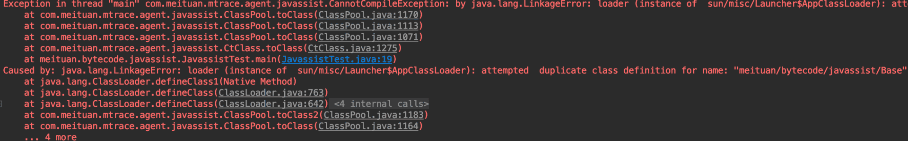 |
| :----------------------------------------------------------: |

显然，如果只能在类加载前对类进行强化，那字节码增强技术的使用场景就变得很窄了。期望的效果是：在一个持续运行并已经加载了所有类的JVM中，还能利用字节码增强技术对其中的类行为做替换并重新加载。为了模拟这种情况，将Base类做改写，在其中编写main方法，每五秒调用一次process()方法，在process()方法中输出一行“process”。

的目的就是，在JVM运行中的时候，将process()方法做替换，在其前后分别打印“start”和“end”。也就是在运行中时，每五秒打印的内容由”process”变为打印”start process end”。那如何解决JVM不允许运行时重加载类信息的问题呢？为了达到这个目的，接下来一一来介绍需要借助的Java类库。

```java
public class Base {
    public static void main(String[] args) {
        String name = ManagementFactory.getRuntimeMXBean().getName();
        String s = name.split("@")[0];
        //打印当前Pid
        System.out.println("pid:"+s);
        while (true) {
            try {
                Thread.sleep(5000L);
            } catch (Exception e) {
                break;
            }
            process();
        }
    }

    public static void process() {
        System.out.println("process");
    }
}
```


##### Instrument简介

instrument是JVM提供的一个可以修改已加载类的类库，专门为Java语言编写的插桩服务提供支持。它需要依赖JVMTI的Attach API机制实现，JVMTI这一部分，将在下一小节进行介绍。在JDK 1.6以前，instrument只能在JVM刚启动开始加载类时生效，而在JDK 1.6之后，instrument支持了在运行时对类定义的修改。要使用instrument的类修改功能，需要实现它提供的ClassFileTransformer接口，定义一个类文件转换器。接口中的transform()方法会在类文件被加载时调用，而在transform方法里，可以利用上文中的ASM或Javassist对传入的字节码进行改写或替换，生成新的字节码数组后返回。

定义一个实现了ClassFileTransformer接口的类TestTransformer，依然在其中利用Javassist对Base类中的process()方法进行增强，在前后分别打印“start”和“end”，代码如下：

```java
public class TestTransformer implements ClassFileTransformer {
    @Override
    public byte[] transform(ClassLoader loader, String className, Class<?> classBeingRedefined, ProtectionDomain protectionDomain, byte[] classfileBuffer) {
        System.out.println("Transforming " + className);
        try {
            ClassPool cp = ClassPool.getDefault();
            CtClass cc = cp.get("meituan.bytecode.jvmti.Base");
            CtMethod m = cc.getDeclaredMethod("process");
            m.insertBefore("{ System.out.println(\"start\"); }");
            m.insertAfter("{ System.out.println(\"end\"); }");
            return cc.toBytecode();
        } catch (Exception e) {
            e.printStackTrace();
        }
        return null;
    }
}
```

现在有了Transformer，那么它要如何注入到正在运行的JVM呢？还需要定义一个Agent，借助Agent的能力将Instrument注入到JVM中。将在下一小节介绍Agent，现在要介绍的是Agent中用到的另一个类Instrumentation。在JDK 1.6之后，Instrumentation可以做启动后的Instrument、本地代码（Native Code）的Instrument，以及动态改变Classpath等等。可以向Instrumentation中添加上文中定义的Transformer，并指定要被重加载的类，代码如下所示。这样，当Agent被Attach到一个JVM中时，就会执行类字节码替换并重载入JVM的操作。

```java
import java.lang.instrument.Instrumentation;

public class TestAgent {
    public static void agentmain(String args, Instrumentation inst) {
        //指定自己定义的Transformer，在其中利用Javassist做字节码替换
        inst.addTransformer(new TestTransformer(), true);
        try {
            //重定义类并载入新的字节码
            inst.retransformClasses(Base.class);
            System.out.println("Agent Load Done.");
        } catch (Exception e) {
            System.out.println("agent load failed!");
        }
    }
}
```


### 实战案例

#### AOP实现原理

```java
// 原始代码
public void service() {
    // 业务逻辑
}

// 增强后
public void service() {
    try {
        // 前置通知
        // 业务逻辑
        // 后置通知
    } catch (Exception e) {
        // 异常通知
    } finally {
        // 最终通知
    }
}
```

**字节码实现要点**：

1. 在方法开头插入前置通知代码
2. 在所有返回指令前插入后置通知
3. 在异常处理器入口插入异常通知
4. 在finally块插入最终通知


#### Lombok注解工作原理

```java
@Getter
public class User {
    private String name;
}
```

编译期通过注解处理器生成：

```java
public String getName() {
    return this.name;
}
```

**字节码操作**：

- 在编译阶段修改AST（抽象语法树）
- 通过JSR-269注解处理器生成字节码


#### 热部署技术

- **JRebel原理**：监控类变化，生成修改后的字节码，通过自定义ClassLoader加载
- **字节码差异计算**：仅替换修改的方法，保持对象状态


#### 性能监控探针

```java
// 原始方法
public void process() { ... }

// 增强后
public void process() {
    long start = System.currentTimeMillis();
    try {
        // 原始代码
    } finally {
        Metrics.record("process", System.currentTimeMillis() - start);
    }
}
```


#### 方法执行时间监控

```java
// 使用ASM在方法前后插入计时逻辑
public class TimingMethodAdapter extends MethodVisitor {
    public TimingMethodAdapter(MethodVisitor mv, String methodName) {
        super(Opcodes.ASM9, mv);
        this.methodName = methodName;
    }
    
    @Override
    public void visitCode() {
        // 方法开始：记录开始时间
        mv.visitMethodInsn(Opcodes.INVOKESTATIC, 
                          "java/lang/System", "nanoTime", "()J", false);
        mv.visitVarInsn(Opcodes.LSTORE, startTimeVar);
        super.visitCode();
    }
    
    @Override
    public void visitInsn(int opcode) {
        if (opcode >= Opcodes.IRETURN && opcode <= Opcodes.RETURN) {
            // 方法返回前：计算耗时
            mv.visitMethodInsn(Opcodes.INVOKESTATIC, 
                              "java/lang/System", "nanoTime", "()J", false);
            mv.visitVarInsn(Opcodes.LLOAD, startTimeVar);
            mv.visitInsn(Opcodes.LSUB);
            // 记录耗时...
        }
        super.visitInsn(opcode);
    }
}
```

**ASM**

```java
public class TimingClassVisitor extends ClassVisitor {
    public TimingClassVisitor(ClassVisitor cv) {
        super(Opcodes.ASM9, cv);
    }
    
    @Override
    public MethodVisitor visitMethod(int access, String name, String descriptor, 
                                     String signature, String[] exceptions) {
        MethodVisitor mv = cv.visitMethod(access, name, descriptor, signature, exceptions);
        return new TimingMethodVisitor(mv, name);
    }
}

class TimingMethodVisitor extends MethodVisitor {
    private String methodName;
    
    public TimingMethodVisitor(MethodVisitor mv, String methodName) {
        super(Opcodes.ASM9, mv);
        this.methodName = methodName;
    }
    
    @Override
    public void visitCode() {
        // 方法开始：插入 long start = System.currentTimeMillis();
        mv.visitMethodInsn(Opcodes.INVOKESTATIC, "java/lang/System", 
                          "currentTimeMillis", "()J", false);
        mv.visitVarInsn(Opcodes.LSTORE, 1); // 存储到slot 1
        
        mv.visitCode(); // 调用原方法内容
    }
    
    @Override
    public void visitInsn(int opcode) {
        if (opcode >= Opcodes.IRETURN && opcode <= Opcodes.RETURN) {
            // 返回前：插入 System.out.println(methodName + " cost: " + (now - start));
            mv.visitFieldInsn(Opcodes.GETSTATIC, "java/lang/System", "out", 
                            "Ljava/io/PrintStream;");
            mv.visitLdcInsn(methodName + " cost: ");
            mv.visitMethodInsn(Opcodes.INVOKESTATIC, "java/lang/System", 
                             "currentTimeMillis", "()J", false);
            mv.visitVarInsn(Opcodes.LLOAD, 1);
            mv.visitInsn(Opcodes.LSUB);
            mv.visitMethodInsn(Opcodes.INVOKEVIRTUAL, "java/io/PrintStream", 
                             "println", "(J)V", false);
        }
        mv.visitInsn(opcode);
    }
}
```

**Javassist**

```java
ClassPool pool = ClassPool.getDefault();
CtClass ctClass = pool.get("com.example.Service");

// 修改方法
CtMethod method = ctClass.getDeclaredMethod("execute");
method.insertBefore("System.out.println(\"Enter method\");");
method.insertAfter("System.out.println(\"Exit method, cost: \" + ($end - $start) + \"ms\");");

// 加载修改后的类
Class<?> clazz = ctClass.toClass();
```

**ByteBuddy**

```java
new ByteBuddy()
    .subclass(Service.class)
    .method(ElementMatchers.named("execute"))
    .intercept(MethodDelegation.to(Interceptor.class))
    .make()
    .load(getClass().getClassLoader())
    .getLoaded();

public class Interceptor {
    @RuntimeType
    public static Object intercept(@Origin Method method, 
                                   @SuperCall Callable<?> callable) throws Exception {
        long start = System.currentTimeMillis();
        try {
            return callable.call();
        } finally {
            System.out.println(method.getName() + " cost: " + 
                             (System.currentTimeMillis() - start));
        }
    }
}
```


#### 安全检查注入

```java
// 在敏感操作前插入权限检查
public class SecurityCheckAdapter extends MethodVisitor {
    @Override
    public void visitCode() {
        // 在方法开始插入权限检查
        mv.visitMethodInsn(Opcodes.INVOKESTATIC, 
                          "com/example/SecurityManager", 
                          "checkPermission", "()V", false);
        super.visitCode();
    }
}
```


#### 动态生成类

```java
// 运行时生成字节码并加载
public class DynamicClassLoader extends ClassLoader {
    public Class<?> defineClass(String name, byte[] b) {
        return defineClass(name, b, 0, b.length);
    }
}

// 使用示例
ClassLoader loader = new DynamicClassLoader();
Class<?> dynamicClass = loader.defineClass("DynamicClass", bytecode);
Object instance = dynamicClass.newInstance();
```


### 应用场景

#### Lombok原理

通过注解处理器（Annotation Processor）在编译期修改AST，生成getter/setter/构造方法的字节码。

#### Hibernate延迟加载

通过字节码生成代理类（如`User$$EnhancerByCGLIB`），拦截方法调用，在访问未加载数据时触发SQL查询。

#### Lambda表达式（invokedynamic）

```java
List<String> list = Arrays.asList("a", "b");
list.forEach(s -> System.out.println(s));
```

**字节码**：

```bytecode
0: invokedynamic #0:accept:()Ljava/util/function/Consumer;
```

使用`invokedynamic`延迟绑定，通过`LambdaMetafactory`在运行时生成实现类。

#### 热更新（Arthas redefine）

通过Instrumentation API替换已加载类的字节码，实现不重启更新代码。


# 监控工具

```
┌─────────────────────────────────────────────────────────────┐
│                    JVM 工具生态体系                          │
├──────────────┬──────────────┬──────────────┬────────────────┤
│   监控诊断    │   内存分析    │   性能剖析    │    云端/容器    │
├──────────────┼──────────────┼──────────────┼────────────────┤
│ • Arthas     │ • Eclipse MAT│ • async-prof  │ • Prometheus   │
│ • VisualVM   │ • JProfiler  │ • JFR        │ • Grafana      │
│ • JConsole   │ • YourKit    │ • perf       │ • SkyWalking   │
│ • JDK工具     │ • HeapHero   │ • FlameGraph │ • Pinpoint     │
└──────────────┴──────────────┴──────────────┴────────────────┘
```

| 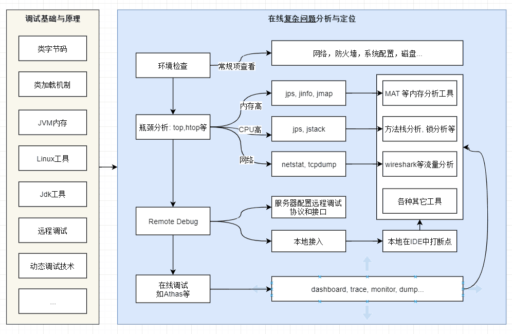 |
| :----------------------------------------------------------: |


## 问题思考

###### 常见问题对应工具

| 问题          | 工具         |
| ------------- | ------------ |
| 服务 CPU 100% | top + jstack |
| Full GC 频繁  | jstat        |
| OOM           | jmap + MAT   |
| 线程死锁      | jstack       |
| 参数不确定    | jinfo        |
| 堆结构        | jmap / jcmd  |
| 接口慢        | Arthas       |


###### 线上 JVM 排障“黄金流程”

1️⃣ `jps` → 找 PID
 2️⃣ `jstat -gc` → 看 GC 是否异常
 3️⃣ `top` → CPU / 内存
 4️⃣ `jstack` → 线程状态
 5️⃣ `jmap -dump` → 内存分析
 6️⃣ MAT / Arthas → 精准定位


###### 生产注意事项（血泪经验）

⚠️ **慎用**

- `jmap -dump`（大堆会 STW）
- 高峰期 dump 堆

✅ **建议**

- 低峰操作
- 用 `jcmd` 替代老工具
- 堆 > 8G，优先 G1


###### 关键避坑点

1. 所有会触发 FullGC 的命令（jmap -live、jmap -dump:live、jstat -gccause 无影响），线上必须**低峰期执行**；
2. 堆快照文件体积大，导出前务必检查磁盘空间，建议压缩后传输；
3. 动态修改 JVM 参数仅支持**Manageable 类型**，核心参数（-Xms/-Xmx、GC 收集器）需重启服务；
4. 排查线程问题时，多次采样线程栈（间隔 1~2 秒），避免单次采样的偶然性。


###### 工具总结

| 工具       | 主要用途      | 生产环境风险           | 替代命令              |
| ---------- | ------------- | ---------------------- | --------------------- |
| **jps**    | 查Java进程    | 无                     | `ps -ef \| grep java` |
| **jstat**  | 监控GC        | 无                     | jcmd GC.class\_stats  |
| **jstack** | 线程栈/死锁   | 低（线程多时会卡几秒） | jcmd Thread.print     |
| **jmap**   | 堆dump        | **高**（触发FGC）      | jcmd GC.heap\_dump    |
| **jcmd**   | 万能工具      | 低                     | 整合以上所有          |
| **jinfo**  | 查看/修改参数 | 中（改错参数可能崩溃） | jcmd VM.flags         |
| **jhsdb**  | 分析core dump | 无（离线分析）         | -                     |

|              核心问题场景               |           线上首选工具            |         线下首选工具          |      辅助工具      |
| :-------------------------------------: | :-------------------------------: | :---------------------------: | :----------------: |
|           查询 Java 进程 PID            |          jps/jcmd/Arthas          |         jps/jvisualvm         |         -          |
|      实时监控 GC / 排查频繁 FullGC      |    Arthas(dashboard/gc)、jstat    |     jvisualvm(Visual GC)      | Prometheus+Grafana |
|      排查死锁 / 线程阻塞 / 高 CPU       |      Arthas(thread)、jstack       |     jvisualvm (线程面板)      | jcmd(Thread.print) |
|           排查内存泄漏 / OOM            | Arthas (heapdump) → 本地 MAT 分析 | jvisualvm (堆分析)、JProfiler |     MAT、jmap      |
|             定位堆内大对象              |      Arthas(heapdump/histo)       | jvisualvm (堆面板)、JProfiler |    jmap(-histo)    |
|        验证 / 动态修改 JVM 参数         |        Arthas(jvm)、jinfo         |   jvisualvm (JVM 参数面板)    |   jcmd(VM.flags)   |
| 业务代码无侵入排查（反编译 / 方法监控） |      Arthas(jad/watch/trace)      |     JProfiler (方法分析)      |         -          |
|           线上长期监控 / 告警           |        Prometheus+Grafana         |               -               |         -          |
|         JVM 新生代调优（核心）          |            Arthas(gc)             |     jvisualvm(Visual GC)      |   jstat(-gcutil)   |


###### jstat -gc 关键列解读

| 列           | 说明                      |
| ------------ | ------------------------- |
| **S0C/S1C**  | Survivor 0/1 容量（KB）   |
| **S0U/S1U**  | Survivor 0/1 使用量（KB） |
| **EC/EU**    | Eden 容量/使用量          |
| **OC/OU**    | 老年代容量/使用量         |
| **MC/MU**    | Metaspace 容量/使用量     |
| **YGC/YGCT** | Young GC 次数/总耗时      |
| **FGC/FGCT** | Full GC 次数/总耗时       |

> 💡 **健康指标**： 
>
> - 老年代使用率持续增长 → 内存泄漏；
> - FGC 频繁（>1次/分钟）→ 需优化；
> - YGC 间隔 < 1 秒 → Eden 太小。


## 工具分类

### 一 命令行工具

**工具对比**

| 具         | 主要用途     | 优点       | 缺点               | 适用场景         |
| :--------- | :----------- | :--------- | :----------------- | :--------------- |
| **jps**    | 查看Java进程 | 快速、简单 | 信息有限           | 快速定位进程ID   |
| **jstat**  | 实时监控     | 轻量、实时 | 需要持续监控       | GC分析、内存趋势 |
| **jinfo**  | 参数查看     | 可动态修改 | 部分参数不支持修改 | 参数调试         |
| **jmap**   | 内存分析     | 功能强大   | 可能暂停应用       | 内存泄漏分析     |
| **jstack** | 线程分析     | 线程快照   | 瞬时状态           | 死锁、高CPU分析  |
| **jcmd**   | 综合工具     | 功能全面   | 需要JDK7+          | 一站式诊断       |
| **jhat**   | 堆分析       | 内置分析   | 功能简单、性能差   | 简单堆分析       |


#### jps - Java进程状态工具

**功能**：列出系统中所有Java虚拟机进程

**注意事项**

- 仅查询当前**同用户**的 Java 进程，root 用户需加`sudo jps`；
- 比`ps -ef | grep java`更优：不会查到`grep`自身的进程，结果更干净。

**使用场景**

- 服务器上有多个 Java 服务
- Docker / k8s 中确认 JVM 是否存在

**实战技巧**：

- 快速确认目标Java进程ID，为其他工具提供输入
- 在容器环境中，需要进入容器内部执行或使用`docker exec`命令

```bash
# 基本用法
jps [options] [hostid]

# 常用参数
jps -l           # 显示完整主类名
jps -m           # 显示传递给main方法的参数
jps -v           # 显示JVM参数
jps -V           # 显示通过flag文件传递的参数
jps -q           # 只显示进程ID

# 组合使用
jps -lmv         # 显示详细信息
jps -l | grep keyword  # 筛选特定应用

# 示例输出
$ jps -lmv
1234 com.example.Main -Xms512m -Xmx2g -Dapp.name=test
5678 org.springframework.boot.loader.JarLauncher --server.port=8080
```


#### jstat - JVM统计监控工具

**功能**：监控JVM各种运行状态信息

**实战技巧**：

- 频繁Young GC：观察E区波动频率
- Full GC问题：观察O区是否持续增长
- 10秒间隔监控：`jstat -gcutil 12345 10000`
- 采样间隔不要太小（如 10ms），会轻微占用 CPU，建议 500ms~5s；
- 该工具仅能看**实时趋势**，无历史数据，生产需配合 GC 日志做离线分析。

| 列名  |                    含义                    |                         核心关注点                         |
| :---: | :----------------------------------------: | :--------------------------------------------------------: |
| S0/S1 | 新生代 Survivor0/Survivor1 区的使用率（%） |   交替变化是正常现象，若长期为 0 可能是 Survivor 区太小    |
|   E   |             Eden 区使用率（%）             |    快速上涨→Minor GC 即将触发，上涨越快 Minor GC 越频繁    |
|   O   |             老年代使用率（%）              | 持续上涨→FullGC 风险，超过 80% 需警惕（CMS/G1 需提前触发） |
|   M   |       元空间 (Metaspace) 使用率（%）       |          超过 90% 需调大元空间（避免元空间 OOM）           |
|  YGC  |        新生代 GC（Minor GC）总次数         |         频率过高（如每分钟数十次）→ 新生代内存不足         |
| YGCT  |           Minor GC 总耗时（秒）            |           单次耗时 = YGCT/YGC，正常应**毫秒级**            |
|  FGC  |               Full GC 总次数               |      **调优核心关注**，生产要求尽可能为 0 或极低频率       |
| FGCT  |            Full GC 总耗时（秒）            |       单次耗时通常百毫秒～秒级，次数多则总耗时占比高       |
|  GCT  |            所有 GC 总耗时（秒）            |         占业务运行时间比例过高→JVM 内存配置不合理          |

```bash
# 语法
jstat [options] <vmid> [<interval> [<count>]]

jstat -gc <pid> [interval] [count]    # 显示GC相关信息
jstat -gccapacity <pid>                # 显示各代容量
jstat -gcutil <pid>                    # 显示GC统计信息
jstat -compiler <pid>                  # 显示JIT编译器信息
jstat -class <pid>                     # 显示类加载信息
```

**类加载统计**

```bash
jstat -class <pid> 1000 5
# 输出：Loaded Bytes Unloaded Bytes Time
# 示例：5000 10240K 200 2048K 3.45
```

**GC统计**

```bash
# 堆内存和GC概况
jstat -gc <pid> 1000 3
# 输出列说明：
# S0C/S1C: Survivor 0/1容量(KB)
# S0U/S1U: Survivor 0/1使用量(KB)
# EC/EU: Eden容量/使用量
# OC/OU: 老年代容量/使用量
# MC/MU: 元空间容量/使用量
# CCSC/CCSU: 压缩类空间容量/使用量
# YGC/YGCT: Young GC次数/耗时
# FGC/FGCT: Full GC次数/耗时
# GCT: 总GC耗时

# 每250ms输出一次GC统计，共10次
jstat -gcutil 12345 250 10

# GC使用率（百分比）
jstat -gcutil <pid> 1000
# S0 S1 E O M CCS YGC YGCT FGC FGCT GCT
# 0.00 50.00 65.50 75.20 95.30 90.10 100 5.234 5 1.234 6.468

# 最近一次GC原因
jstat -gccause <pid> 1000
# 在gcutil基础上增加LGCC（最近GC原因）和GCC（当前GC原因）
```

**内存池容量**

```bash
# 各内存代容量
jstat -gccapacity <pid> 1000
# NGCMN NGCMX NGC S0C S1C EC OGCMN OGCMX OGC OC MCMN MCMX MC CCSMN CCSMX CCSC YGC FGC

# 新生代统计
jstat -gcnew <pid> 1000
jstat -gcnewcapacity <pid> 1000

# 老年代统计
jstat -gcold <pid> 1000
jstat -gcoldcapacity <pid> 1000

# 元空间统计
jstat -gcmetacapacity <pid> 1000
```

**编译统计**

```bash
# JIT编译统计
jstat -compiler <pid>
# Compiled Failed Invalid Time FailedType FailedMethod
# 1000 5 0 15.23 1 java/lang/String.equals

# 打印编译方法
jstat -printcompilation <pid> 1000
# Compiled Size Type Method
# 1234 45 2 java/util/HashMap.put
```


#### jinfo - 配置信息工具

**功能**：查看和修改虚拟机参数

**实战技巧**：

- 验证JVM参数是否生效
- 部分参数支持运行时动态调整，如GC日志相关参数
- 注意：不是所有JVM参数都支持运行时修改

```bash
# 语法
jinfo [option] <pid>
jinfo [option] <executable <core>
jinfo [option] [server_id@]<remote server IP or hostname>

jinfo <pid>                  # 打印所有系统属性和JVM命令行标志
jinfo -flags <pid>           # 只打印JVM标志
jinfo -sysprops <pid>        # 只打印系统属性
jinfo -flag <name> <pid>     # 打印指定JVM标志的值
jinfo -flag [+|-]<name> <pid> # 启用或禁用指定的布尔JVM标志

# 查看所有参数
jinfo -flags <pid>
# 输出非默认参数

# 查看特定参数
jinfo -flag MaxHeapSize <pid>
jinfo -flag UseG1GC <pid>

# 查看系统属性
jinfo -sysprops <pid>
# 相当于 System.getProperties()

# 动态修改参数（部分参数支持）
jinfo -flag +PrintGCDetails <pid>     # 开启GC日志
jinfo -flag -PrintGCDetails <pid>     # 关闭GC日志
jinfo -flag MaxGCPauseMillis=200 <pid> # 修改参数值

# 常用场景
# 1. 查看实际生效的堆大小
jinfo -flag InitialHeapSize <pid>
jinfo -flag MaxHeapSize <pid>

# 2. 开启诊断参数
jinfo -flag +HeapDumpOnOutOfMemoryError <pid>
jinfo -flag HeapDumpPath=/path/to/dumps <pid>
```

**注意事项**：

- 不是所有参数都支持动态修改
- 生产环境谨慎使用动态修改功能


#### jmap - 内存映射工具

**功能**：生成堆转储、查看堆内存详情

**参数说明**：

- `format=b`：指定快照格式为二进制（必须加，否则无法被 MAT 分析）；
- `live`：**仅导出堆中的存活对象**（会触发**FullGC**，导出前会回收垃圾对象，快照文件更小）；
- `file`：快照存储路径，建议放在日志目录，避免占满系统盘。

**注意事项**：

- `jmap -dump`会暂停应用，生产环境谨慎使用
- 建议在流量低峰期操作
- 大堆应用可能生成数GB的dump文件
- 内存泄漏分析时，先用`-histo`快速定位大对象
- 生成堆dump时使用`live`参数只保存存活对象，减小文件体积
- 堆快照文件可能很大（和堆内存大小一致，如 4G 堆内存→4G 快照）：导出前务必检查磁盘空间，建议压缩后传输（`gzip heapdump.hprof`）

**使用场景**

- OOM
- 老年代持续上涨
- 内存泄漏怀疑

```bash
# 语法
jmap [option] <pid>
jmap [option] <executable <core>
jmap [option] [server_id@]<remote server IP or hostname>

jmap -heap <pid>                  # 显示堆内存详细信息
jmap -histo[:live] <pid>          # 显示对象统计信息，live表示只统计存活对象
jmap -dump:[live,]format=b,file=<filename> <pid>  # 生成堆转储文件
```

**堆内存概要**

```bash
# 显示堆内存使用概况
jmap -heap <pid>
# 输出：
# Attaching to process ID 1234, please wait...
# Debugger attached successfully.
# Server compiler detected.
# JVM version is 11.0.12+7
# 
# using thread-local object allocation.
# Garbage-First (G1) GC
# 
# Heap Configuration:
#    MinHeapFreeRatio         = 40
#    MaxHeapFreeRatio         = 70
#    MaxHeapSize              = 4294967296 (4096.0MB)
#    NewSize                  = 1363144 (1.2999954223632812MB)
#    ...
# 
# Heap Usage:
# G1 Heap:
#    regions  = 250
#    capacity = 4294967296 (4096.0MB)
#    used     = 1073741824 (1024.0MB)
#    free     = 3221225472 (3072.0MB)
#    25.0% used
```

**对象直方图**

```bash
# 显示对象统计（按类）
jmap -histo <pid> | head -20
# 输出：
# num     #instances         #bytes  class name
# ----------------------------------------------
#   1:         12345        1073741824  [B
#   2:          6789         268435456  [Ljava.lang.Object;
#   3:          4567          67108864  java.lang.String
#   4:          2345          33554432  java.util.HashMap$Node

# 只统计存活对象
jmap -histo:live <pid> > live_histo.txt

# 统计到文件并排序
jmap -histo <pid> | sort -k 3 -nr | head -20
```

**生成堆转储**

```bash
# 生成堆转储文件（二进制格式）
jmap -dump:format=b,file=heap.bin <pid>

# 只转存活对象
jmap -dump:live,format=b,file=heap_live.bin <pid>

# 设置转储参数
jmap -dump:format=b,file=/path/to/heap.hprof,compress=9 <pid>

# 在OOM时自动转储（需提前配置）
jmap -dump:format=b,file=oom.hprof -F <pid>  # -F 强制模式

# 使用gzip压缩
jmap -dump:live,format=b,file=- <pid> | gzip > heap.hprof.gz
```

> `live`：只 dump 存活对象（减少干扰）

**Finalizer队列**

```bash
# 显示等待finalize的对象
jmap -finalizerinfo <pid>
```


#### jstack - 栈跟踪工具

**功能**：生成线程快照（thread dump）

**实战技巧**：

- 死锁检测：`jstack`输出中会明确提示"Found one Java-level deadlock"
- 多次采样：连续执行3-5次jstack，对比分析，找出持续处于相同状态的线程
- 分析线程状态：重点关注RUNNABLE(可能CPU高)、BLOCKED(可能锁竞争)、WAITING/TIMED_WAITING(可能资源等待)状态

**注意事项**

1. 排查线程问题时，**建议多次导出线程栈（间隔 1~2 秒）**，对比线程状态变化，避免单次采样的偶然性；
2. 线程名建议业务自定义（如`new Thread("order-pay-thread")`），方便快速定位业务线程，避免默认的`Thread-0`/`pool-1-thread-1`；
3. 使用`-F`参数强制导出时，进程可能处于挂起状态，导出后建议重启服务（避免进程异常）。

**锁状态**

| 状态     | 含义     |
| -------- | -------- |
| RUNNABLE | 正在执行 |
| BLOCKED  | 锁竞争   |
| WAITING  | 等待     |

**参数含义**

| 参数 |                          作用                          |                实战场景                 |
| :--: | :----------------------------------------------------: | :-------------------------------------: |
| 无参 |                   导出所有线程栈信息                   |              常规线程排查               |
| `-F` |    强制导出线程栈（当进程挂起、jstack 无响应时用）     |     线上进程卡死，普通 jstack 失败      |
| `-l` | 导出线程栈时，**附加锁的详细信息**（如持有锁、等待锁） |            排查死锁、锁竞争             |
| `-m` |     导出**Java 线程 + 本地方法（C/C++）** 的栈信息     | 排查 NIO/Netty 等调用本地方法的阻塞问题 |

```bash
# 语法
jstack [option] <pid>
jstack [option] <executable <core>
jstack [option] [server_id@]<remote server IP or hostname>

jstack [-l] <pid>     # -l 选项会额外显示关于锁的附加信息
jstack -F <pid>       # 当jstack无响应时强制执行
jstack -m <pid>       # 打印Java和本地帧（mixed mode）
```

**基本使用**

```bash
# 生成线程快照
jstack <pid> > thread_dump.txt

# 显示锁信息
jstack -l <pid> > thread_dump_with_locks.txt

# 强制生成快照（当jstack无响应时）
jstack -F <pid> > thread_dump_force.txt

# 混合模式（包含native栈）
jstack -m <pid> > thread_dump_mixed.txt
```

**线程快照分析**

```bash
# 查找死锁
jstack <pid> | grep -A 10 "deadlock"

# 统计线程状态
jstack <pid> | grep java.lang.Thread.State | sort | uniq -c
# 输出：
#   15 java.lang.Thread.State: RUNNABLE
#    8 java.lang.Thread.State: TIMED_WAITING (on object monitor)
#    3 java.lang.Thread.State: WAITING (on object monitor)

# 查看特定线程
jstack <pid> | grep -B 5 -A 10 "Thread-0"

# 查找等待资源的线程
jstack <pid> | grep -B 5 "parking to wait for"
```

**线程CPU分析**

```bash
# 结合top找出高CPU线程
top -Hp <pid>
# 记下高CPU的线程ID（十进制）

# 转换为十六进制
printf "%x\n" <thread_id>

# 在jstack输出中查找
jstack <pid> | grep -A 10 <nid_hex>

# 保存线程堆栈到文件
jstack -l 12345 > thread_dump.log

# 定位CPU高占用线程
top -H -p 12345      # 先找出高CPU占用的线程ID(十进制)
printf "%x\n" 12345  # 转换为十六进制
jstack 12345 | grep -A 50 "nid=0x3039"  # 搜索对应线程
```


####  jcmd - 多功能命令行工具（JDK7+）

**功能**：一个工具替代多个工具

**优势**：

- 单一工具替代多个工具功能
- 更安全的诊断操作，减少对生产环境影响
- 支持更多现代JVM功能

**注意事项**

1. JDK8 及以上推荐优先使用 jcmd，逐步替代传统工具；
2. `GC.run`命令会触发 FullGC，线上**严格禁止**使用；
3. 导出堆快照的参数和 jmap 一致，需注意磁盘空间和 FullGC 问题。

|              jcmd 命令              |     等价的传统工具     |               作用                |
| :---------------------------------: | :--------------------: | :-------------------------------: |
|       `jcmd 1234 VM.version`        |           无           |      查看 JVM 版本、JDK 版本      |
|        `jcmd 1234 VM.flags`         |  `jinfo -flags 1234`   |      查看 JVM 手动设置的参数      |
|  `jcmd 1234 VM.system_properties`   | `jinfo -sysprops 1234` |           查看系统属性            |
|      `jcmd 1234 GC.heap_info`       |   `jmap -heap 1234`    |     查看堆内存配置 + 使用状态     |
|   `jcmd 1234 GC.class_histogram`    |   `jmap -histo 1234`   |  查看堆内对象统计（定位大对象）   |
| `jcmd 1234 GC.heap_dump /xxx.hprof` |   `jmap -dump 1234`    |  导出堆快照（格式自动为二进制）   |
|     `jcmd 1234 Thread.print -l`     |    `jstack -l 1234`    |  导出线程栈 + 锁信息（排查死锁）  |
|         `jcmd 1234 GC.run`          |     `System.gc()`      |  手动触发 FullGC（线上禁止使用）  |
|    `jcmd 1234 PerfCounter.print`    |    `jstat -gc 1234`    | 查看 JVM 性能计数器（GC、内存等） |

```bash
# 列出当前Java进程
jcmd -l

# 显示指定进程可用命令
jcmd <pid> help

jcmd <pid> VM.version           # 显示JVM版本
jcmd <pid> VM.flags             # 显示JVM标志
jcmd <pid> GC.run               # 强制执行GC
jcmd <pid> GC.heap_dump <file>  # 生成堆dump
jcmd <pid> Thread.print         # 打印线程堆栈
jcmd <pid> VM.native_memory     # 分析本地内存使用情况(JDK 11+)

# 不带pid列出所有Java进程
jcmd

# 生成安全的堆dump(比jmap更安全)
jcmd 12345 GC.heap_dump /tmp/heap.hprof

# 查看JVM启动参数
jcmd 12345 VM.command_line
```

**内存相关**

```bash
# GC.run - 触发Full GC
jcmd <pid> GC.run

# GC.heap_info - 显示堆信息
jcmd <pid> GC.heap_info

# GC.class_stats - 类统计（需要-XX:+UnlockDiagnosticVMOptions）
jcmd <pid> GC.class_stats

# GC.finalizer_info - finalizer队列
jcmd <pid> GC.finalizer_info
```

**线程相关**

```bash
# Thread.print - 线程快照（相当于jstack -l）
jcmd <pid> Thread.print

# Thread.print - 指定格式
jcmd <pid> Thread.print -l > thread.txt
```

**JVM信息**

```bash
# VM.version - JVM版本
jcmd <pid> VM.version

# VM.command_line - 启动命令行
jcmd <pid> VM.command_line

# VM.flags - 所有JVM参数
jcmd <pid> VM.flags

# VM.system_properties - 系统属性
jcmd <pid> VM.system_properties

# VM.uptime - 运行时间
jcmd <pid> VM.uptime
```

**性能计数器**

```bash
# PerfCounter.print - 性能计数器
jcmd <pid> PerfCounter.print | grep gc
```

**Native内存**

```bash
# VM.native_memory - Native内存使用（需要-XX:NativeMemoryTracking=summary/detail）
jcmd <pid> VM.native_memory summary
jcmd <pid> VM.native_memory detail
jcmd <pid> VM.native_memory baseline  # 建立基线
jcmd <pid> VM.native_memory summary.diff  # 查看差异
```

**诊断命令**

```bash
# ManagementAgent.start - 启动JMX代理
jcmd <pid> ManagementAgent.start jmxremote.port=9090 jmxremote.ssl=false jmxremote.authenticate=false

# VM.print_touched_methods - 打印被调用的方法
jcmd <pid> VM.print_touched_methods

# Compiler.queue - 打印编译队列
jcmd <pid> Compiler.queue
```


#### jhsdb - 基于服务性代理的调试器（JDK9+）

**功能**：替代jmap、jstack等工具

```bash
# 启动调试会话
jhsdb clhsdb --pid <pid>
jhsdb hsdb --pid <pid>  # 图形界面

# 命令模式
jhsdb jmap --pid <pid> --heap
jhsdb jmap --pid <pid> --histo
jhsdb jmap --pid <pid> --binaryheap [file]

jhsdb jstack --pid <pid>
jhsdb jstack --pid <pid> --locks

jhsdb jinfo --pid <pid>
```


#### JFR - 高性能诊断和分析工具

**功能**：Java Flight Recorder（JFR）是HotSpot JVM内置的低开销性能数据收集框架，以前是商业功能，从JDK 11开始开源。能够在生产环境中以<1%的性能开销持续收集JVM和应用数据。

**实战技巧**：

- 低开销(通常<1%)，适合生产环境
- 可捕获CPU、内存、线程、I/O、锁等多种数据
- 配合JMC(Java Mission Control)分析

```bash
# 启动10秒的飞行记录
jcmd <pid> JFR.start duration=10s filename=recording.jfr

# 检查记录状态
jcmd <pid> JFR.check

# 停止记录
jcmd <pid> JFR.stop name=<recording_id>

# 最简单方式 - 启动30秒记录
jcmd <pid> JFR.start duration=30s

# 指定名称和文件
jcmd <pid> JFR.start name=myrecording duration=60s filename=/tmp/recording.jfr

# 使用预设配置（profile.jfc开销更低）
jcmd <pid> JFR.start settings=profile duration=2m filename=profile_recording.jfr

# 延迟启动和持续记录
jcmd <pid> JFR.start delay=10s duration=5m name=delayed_recording

# JVM退出时自动保存记录
jcmd <pid> JFR.start dumponexit=true filename=exit_recording.jfr

# 快速性能分析组合
jcmd <pid> JFR.start duration=60s name=quick_profile && \
sleep 65 && \
jfr summary quick_profile.jfr && \
jfr print --events jdk.ExecutionSample,jdk.GarbageCollection quick_profile.jfr

# 内存泄漏分析组合
jcmd <pid> JFR.start duration=5m name=leak_check jdk.OldObjectSample#enabled=true && \
sleep 310 && \
jfr print --events jdk.OldObjectSample leak_check.jfr

# 启动性能分析
java -XX:StartFlightRecording=duration=30s,filename=startup.jfr -jar app.jar && \
jfr summary startup.jfr
```

**查看摘要信息**

```bash
# 基本摘要
jfr summary recording.jfr

# 详细摘要
jfr summary --verbose recording.jfr

# 输出示例：
# Version: 2.1
# Chunks: 1
# Start: 2024-01-15 10:30:00
# Duration: 30 s
# Event Types: 87
# Event Count: 123456
# Size: 15.2 MB
```

**查看元数据**

```bash
# 显示所有事件类型
jfr metadata recording.jfr

# 显示特定事件的元数据
jfr metadata --events jdk.GarbageCollection recording.jfr

# 输出为JSON格式
jfr metadata --json recording.jfr
```


##### 案例脚本

###### 性能问题诊断脚本

```bash
#!/bin/bash
# diagnose_perf.sh

PID=$1
DURATION=${2:-60}
RECORDING_NAME="perf_analysis_$(date +%Y%m%d_%H%M%S)"

echo "开始性能诊断，PID: $PID，持续时间: ${DURATION}秒"

# 1. 启动详细记录
jcmd $PID JFR.start \
  name=$RECORDING_NAME \
  settings=default \
  duration=${DURATION}s \
  filename=/tmp/${RECORDING_NAME}.jfr \
  jdk.ExecutionSample#enabled=true \
  jdk.NativeMethodSample#enabled=true \
  jdk.OldObjectSample#enabled=true

echo "记录已启动: $RECORDING_NAME"
echo "等待 ${DURATION} 秒..."

# 2. 监控关键指标
for i in $(seq 1 $DURATION); do
    echo -n "."
    sleep 1
    if [ $((i % 10)) -eq 0 ]; then
        echo -n " ${i}s"
    fi
done
echo

# 3. 自动分析关键事件
echo -e "\n分析GC事件:"
jfr print --events jdk.GarbageCollection /tmp/${RECORDING_NAME}.jfr | \
  awk '/jdk.GarbageCollection/ {printf "GC: cause=%-30s pause=%-8s sum=%-8s\n", $5, $6, $7}' | \
  tail -20

echo -e "\n分析CPU热点方法:"
jfr print --events jdk.ExecutionSample /tmp/${RECORDING_NAME}.jfr | \
  grep "method=" | \
  cut -d'=' -f2 | \
  sort | uniq -c | sort -rn | head -10

echo -e "\n分析文件IO:"
jfr print --events jdk.FileRead,jdk.FileWrite /tmp/${RECORDING_NAME}.jfr | \
  awk '/jdk.File/ {print $0}' | \
  tail -10

echo -e "\n记录文件: /tmp/${RECORDING_NAME}.jfr"
echo "使用 JMC 或 'jfr print' 进一步分析"
```


###### 内存泄漏检测脚本

```bash
#!/bin/bash
# leak_detector.sh

PID=$1
DURATION=${2:-300}  # 5分钟

echo "内存泄漏检测启动，PID: $PID"

# 启动长时间记录，重点监控对象分配
jcmd $PID JFR.start \
  name=leak_detection \
  settings=default \
  duration=${DURATION}s \
  filename=leak_detection.jfr \
  jdk.ObjectAllocationSample#enabled=true \
  jdk.ObjectAllocationInNewTLAB#enabled=true \
  jdk.OldObjectSample#threshold=1m \  # 1分钟以上的对象
  jdk.OldObjectSample#enabled=true

# 监控内存增长
echo "监控内存使用情况..."
jstat -gcutil $PID 10000 30

# 分析结果
echo -e "\n分析潜在内存泄漏对象:"
jfr print --events jdk.OldObjectSample leak_detection.jfr | \
  awk -F'[,=]' '
  /old/ { 
    for(i=1;i<=NF;i++) {
      if ($i ~ /object:/) {obj=$(i+1)}
      if ($i ~ /age:/) {age=$(i+1)}
      if ($i ~ /allocationTime:/) {time=$(i+1)}
    }
    printf "对象: %-40s 年龄: %-8s 分配时间: %s\n", obj, age, time
  }
  ' | head -20
```


###### 生产环境监控脚本

```bash
#!/bin/bash
# jfr_monitor.sh

PID=$(jps | grep MyApp | awk '{print $1}')
REPO_PATH="/var/log/jfr"
RETENTION_DAYS=7

# 确保目录存在
mkdir -p $REPO_PATH

# 清理旧文件
find $REPO_PATH -name "*.jfr" -mtime +$RETENTION_DAYS -delete

# 启动连续记录（循环记录最近24小时）
jcmd $PID JFR.configure repositorypath=$REPO_PATH
jcmd $PID JFR.start \
  name=continuous \
  disk=true \
  maxage=24h \
  maxsize=10G \
  dumponexit=true

# 定期转储（每小时转储一次最近15分钟数据）
while true; do
    TIMESTAMP=$(date +%Y%m%d_%H%M%S)
    jcmd $PID JFR.dump \
      name=continuous \
      filename=$REPO_PATH/dump_$TIMESTAMP.jfr \
      maxage=15m
    
    # 简单分析GC情况
    LATEST_DUMP=$(ls -t $REPO_PATH/dump_*.jfr | head -1)
    if [ -f "$LATEST_DUMP" ]; then
        GC_COUNT=$(jfr print --events jdk.GarbageCollection "$LATEST_DUMP" | wc -l)
        echo "$(date): 转储完成，最近15分钟GC次数: $((GC_COUNT-1))"
    fi
    
    sleep 3600  # 每小时执行一次
done
```


###### 异常监控脚本

```bash
#!/bin/bash
# exception_monitor.sh

PID=$1
CHECK_INTERVAL=30

echo "异常监控启动，PID: $PID，检查间隔: ${CHECK_INTERVAL}秒"

while true; do
    TIMESTAMP=$(date +%Y%m%d_%H%M%S)
    
    # 转储最近30秒的数据
    jcmd $PID JFR.dump \
      name=continuous \
      filename=/tmp/exceptions_${TIMESTAMP}.jfr \
      maxage=30s
    
    # 检查异常
    EXCEPTION_COUNT=$(jfr print --events jdk.ExceptionThrown /tmp/exceptions_${TIMESTAMP}.jfr 2>/dev/null | wc -l)
    
    if [ $EXCEPTION_COUNT -gt 1 ]; then
        echo "[$(date)] 检测到异常！数量: $((EXCEPTION_COUNT-1))"
        
        # 保存详细的异常信息
        jfr print --events jdk.ExceptionThrown /tmp/exceptions_${TIMESTAMP}.jfr | \
          grep -v "eventType" > /tmp/exceptions_detail_${TIMESTAMP}.txt
        
        # 发送告警（示例）
        # send_alert "应用异常" "/tmp/exceptions_detail_${TIMESTAMP}.txt"
        
        # 保留文件用于分析
        mv /tmp/exceptions_${TIMESTAMP}.jfr /var/log/exceptions/
    else
        rm -f /tmp/exceptions_${TIMESTAMP}.jfr
    fi
    
    sleep $CHECK_INTERVAL
done
```


##### 高级配置

###### 自定义配置模板

```xml
<!-- custom.jfc -->
<?xml version="1.0" encoding="UTF-8"?>
<configuration version="2.0" name="CustomProfile" description="自定义监控配置">
    <event name="jdk.CPULoad">
        <setting name="enabled">true</setting>
        <setting name="period">1 s</setting>
    </event>
    
    <event name="jdk.GarbageCollection">
        <setting name="enabled">true</setting>
    </event>
    
    <event name="jdk.ExecutionSample">
        <setting name="enabled">true</setting>
        <setting name="period">10 ms</setting>
    </event>
    
    <event name="jdk.ThreadSleep">
        <setting name="enabled">true</setting>
        <setting name="threshold">20 ms</setting>
    </event>
    
    <event name="jdk.FileRead">
        <setting name="enabled">true</setting>
        <setting name="threshold">1 ms</setting>
    </event>
</configuration>
```

###### 使用自定义配置

```bash
# 启动时使用自定义配置
java -XX:StartFlightRecording=settings=custom.jfc,filename=recording.jfr -jar app.jar

# 运行时使用自定义配置
jcmd <pid> JFR.start settings=/path/to/custom.jfc
```

###### 性能开销控制

```bash
# 低开销配置（< 0.5%）
jcmd <pid> JFR.start settings=profile \
  disk=false \
  maxchunksize=5M \
  bufferSize=5M

# 均衡配置（< 1%）
jcmd <pid> JFR.start settings=default \
  jdk.ExecutionSample#period=20ms \
  jdk.NativeMethodSample#period=100ms

# 高精度配置（< 2%）
jcmd <pid> JFR.start settings=default \
  jdk.ExecutionSample#period=1ms \
  jdk.ObjectAllocationSample#enabled=true
```


##### 问题排查

###### 性能热点分析

```bash
# 1. 记录性能热点
jcmd <pid> JFR.start duration=30s name=hotspot

# 2. 分析方法执行时间
jfr print --events jdk.ExecutionSample hotspot.jfr | \
  grep "method=" | \
  awk -F'method=' '{print $2}' | \
  cut -d',' -f1 | \
  sort | uniq -c | sort -rn | head -10

# 3. 查看方法调用栈
jfr print --events jdk.ExecutionSample --stack-depth 5 hotspot.jfr | \
  head -50
```

######  延迟问题诊断

```bash
# 1. 记录延迟事件
jcmd <pid> JFR.start duration=1m name=latency \
  jdk.ThreadSleep#enabled=true \
  jdk.ThreadPark#enabled=true \
  jdk.JavaMonitorWait#enabled=true

# 2. 分析等待时间
jfr print --events jdk.ThreadSleep,jdk.JavaMonitorWait latency.jfr | \
  awk '/time=/ {split($0,a,"time="); split(a[2],b," "); print b[1]}' | \
  sort -rn | head -10
```

###### I/O瓶颈分析

```bash
# 1. 记录I/O事件
jcmd <pid> JFR.start duration=2m name=io_analysis \
  jdk.FileRead#enabled=true \
  jdk.FileWrite#enabled=true \
  jdk.SocketRead#enabled=true \
  jdk.SocketWrite#enabled=true

# 2. 分析I/O延迟
jfr print --events jdk.FileRead,jdk.FileWrite io_analysis.jfr | \
  awk '
  /FileRead/ || /FileWrite/ {
    for(i=1;i<=NF;i++) {
      if ($i ~ /duration=/) {dur=substr($i,9)}
      if ($i ~ /path=/) {path=$(i+1)}
    }
    printf "%-40s %12s\n", path, dur
  }
  ' | sort -k2 -rn | head -20
```


### 二 可视化工具


#### VisualVM

必装插件（jvisualvm）

jvisualvm 默认功能有限，安装插件后直接拉满，**核心必装**：

- **<font color='red'>Visual GC</font>**：GC 可视化插件，直观展示新生代 / 老年代 GC 频率、内存变化，调优新生代的神器；
- **MBeans**：查看 JVM MBean 信息，支持修改部分动态参数；
- **Java VisualVM Remote**：支持远程连接线上 Java 进程（需开启 JMX，线上慎用）。


#### JConsole


#### JFR

```bash
# 查看记录摘要
jfr summary recording.jfr

# 打印事件
jfr print recording.jfr
jfr print --events jdk.GarbageCollection recording.jfr
jfr print --events jdk.ExecutionSample recording.jfr

# 过滤事件
jfr filter --include-events jdk.ExceptionThrown recording.jfr filtered.jfr

# 查看元数据
jfr metadata recording.jfr
```


#### JMC

- 与Java Flight Recorder (JFR) 配合使用
- 低开销(通常<1%)的生产环境监控
- 深度分析GC、锁竞争、I/O操作和方法热点


#### MAT

```bash
# 下载地址：https://www.eclipse.org/mat/
# 分析堆转储文件
java -jar mat/plugins/org.eclipse.equinox.launcher_*.jar \
  -application org.eclipse.mat.api.parse \
  heap.hprof

# 常用分析功能：
# 1. Leak Suspects Report - 泄漏嫌疑报告
# 2. Histogram - 对象直方图
# 3. Dominator Tree - 支配树
# 4. Path to GC Roots - 到GC根的路径
# 5. OQL - 对象查询语言
```


#### Visual GC


#### Thread Dump

#### btrace


#### Greys

#### Arthas

```bash
# 启动
java -jar arthas-boot.jar

# 选择进程后常用命令：

# 监控面板
dashboard

# 查看线程
thread
thread -n 3  # 最忙的3个线程
thread -b    # 查找死锁

# 方法监控
watch com.example.MyClass myMethod "{params,returnObj}" -x 3
trace com.example.MyClass myMethod

# 类加载信息
sc -d com.example.MyClass
jad com.example.MyClass  # 反编译

# 火焰图生成
profiler start
profiler stop --format svg

# 监控方法调用统计
monitor -c 5 com.example.MyClass myMethod

# 记录方法调用并回放
tt -t com.example.MyClass myMethod
tt -l  # 列出记录
tt -i 1001 -p  # 回放记录

# 修改运行时日志级别
logger --name ROOT --level debug

# 热更新代码（实验性）
retransform /path/to/MyClass.class
```


#### javOSize


#### JProfiler


#### dmesg


#### GCEasy

```bash
# 在线工具：https://gceasy.io
# 或使用本地版本
java -jar gceasy.jar gc.log
```


#### GCViewer

```bash
# 下载：https://github.com/chewiebug/GCViewer
java -jar gcviewer-1.36.jar gc.log

# 命令行分析
java -jar gcviewer-1.36.jar gc.log summary.csv chart.png
```


#### JProfiler


#### BTrace


#### async-profiler

```bash
# 下载：https://github.com/jvm-profiling-tools/async-profiler

# CPU火焰图
./profiler.sh -d 30 -f flamegraph.html <pid>

# 内存分配火焰图
./profiler.sh -e alloc -d 30 -f alloc.svg <pid>

# 锁分析
./profiler.sh -e lock -d 30 -f lock.html <pid>

# 同时分析CPU和内存
./profiler.sh -e cpu,alloc -d 60 -f combined.svg <pid>

# 指定采样频率
./profiler.sh -e cpu -i 10ms -d 30 <pid>
```


#### perf-map-agent

```bash
# 为perf生成Java符号表
java -agentpath:/path/to/libperfmap.so <app_args>

# 然后使用perf
perf record -F 99 -a -g -- sleep 30
perf script | ./stackcollapse-perf.pl | ./flamegraph.pl > flamegraph.svg
```


### 三 其他工具


#### OpenTelemetry


#### Prometheus + Grafana


#### SkyWalking


#### Pinpoint


#### CAT（链路追踪 + JVM 监控一体化）


## 实践总结

### 问题排查

#### 一 CPU飙高

```bash
# 1. 找到高CPU进程
top

# 2. 找到高CPU线程
top -Hp <pid>

# 3. 转换线程ID为十六进制
printf "%x\n" <thread_id>

# 4. 查看线程栈
jstack <pid> | grep -A 20 <nid_hex>

# 5. 批量分析（前5个高CPU线程）
top -Hp <pid> -b -n 1 | head -12 | tail -5 | awk '{print $1}' | while read tid; do
    echo "=== Thread $tid (0x$(printf "%x" $tid)) ==="
    jstack <pid> | sed -n "/0x$(printf "%x" $tid)/,/^$/p"
done
```

```bash
# 1. 找出高CPU占用的Java进程
top

# 2. 找出该进程中高CPU占用的线程(十进制ID)
top -H -p 12345

# 3. 将线程ID转换为十六进制
printf "%x\n" 23456  # 假设23456是高CPU线程ID

# 4. 查看对应线程堆栈
jstack 12345 | grep -A 50 "nid=0x5ba0"
```


#### 二 内存泄漏

```bash
# 1. 监控内存增长
jstat -gcutil <pid> 30000

# 2. 生成直方图对比
jmap -histo:live <pid> > histo_$(date +%H%M).txt

# 3. 比较两次直方图差异
diff histo_1100.txt histo_1130.txt | grep "^[<>]"

# 4. 生成堆转储分析
jmap -dump:live,format=b,file=heap_$(date +%Y%m%d_%H%M%S).bin <pid>
```

```bash
# 1. 确认进程
jps -lv

# 2. 持续监控GC情况
jstat -gcutil 12345 5000

# 3. 分析对象分布(重点关注持续增长的对象)
jmap -histo:live 12345 | head -30

# 4. 生成堆dump进行深入分析
jcmd 12345 GC.heap_dump /tmp/heap.hprof
```


#### 三 死锁检测

```bash
# 1. 查找死锁信息
jstack <pid> | grep -A 10 "deadlock"
jstack <pid> | grep -B 5 "waiting to lock"

# 2. 使用jcmd检测
jcmd <pid> Thread.print | grep -i deadlock

# 3. 使用脚本分析
jstack <pid> | 
awk '/^Java Threads:/{flag=1} /^JNI global references:/{flag=0} flag' |
grep -E "locked|waiting"
```


#### 四 状态检查

```bash
# 1. 查看关键JVM参数
jcmd 12345 VM.flags | grep -E "HeapSize|GC"

# 2. 检查GC状态
jstat -gcutil 12345 1000 3

# 3. 检查线程状态
jcmd 12345 Thread.print | grep "java.lang.Thread.State" | sort | uniq -c
```


### 案例脚本

###### 一键诊断脚本

```bash
#!/bin/bash
# diagnose_jvm.sh

PID=$1
LOG_DIR="jvm_diagnose_$(date +%Y%m%d_%H%M%S)"
mkdir -p $LOG_DIR

echo "开始收集JVM诊断信息，PID: $PID"

# 1. 基础信息
jps -lmv > $LOG_DIR/jps.txt
jinfo -flags $PID > $LOG_DIR/jinfo_flags.txt
jinfo -sysprops $PID > $LOG_DIR/sysprops.txt

# 2. 内存信息
jmap -heap $PID > $LOG_DIR/jmap_heap.txt 2>/dev/null || echo "heap信息不可用"
jmap -histo $PID > $LOG_DIR/jmap_histo.txt
jmap -histo:live $PID > $LOG_DIR/jmap_histo_live.txt 2>/dev/null

# 3. GC信息（收集10次，间隔1秒）
jstat -gcutil $PID 1000 10 > $LOG_DIR/jstat_gcutil.txt
jstat -gccapacity $PID 1000 5 > $LOG_DIR/jstat_gccapacity.txt

# 4. 线程信息
jstack $PID > $LOG_DIR/jstack.txt
jstack -l $PID > $LOG_DIR/jstack_locks.txt

# 5. jcmd综合信息
jcmd $PID VM.version > $LOG_DIR/jcmd_version.txt
jcmd $PID VM.command_line >> $LOG_DIR/jcmd_version.txt
jcmd $PID Thread.print > $LOG_DIR/jcmd_thread.txt
jcmd $PID GC.heap_info > $LOG_DIR/jcmd_heap.txt

# 6. 类加载信息
jstat -class $PID 1000 3 > $LOG_DIR/class_loading.txt

echo "诊断信息已保存到: $LOG_DIR"
```


###### 监控脚本示例

```bash
#!/bin/bash
# jvm_monitor.sh

PID=$1
INTERVAL=${2:-5}
DURATION=${3:-300}

echo "监控JVM状态，PID: $PID，间隔: ${INTERVAL}秒，时长: ${DURATION}秒"
echo "时间戳,堆使用(M),堆提交(M),Eden(%),Old(%),YGC,YGCT,FGC,FGCT,线程数,CPU(%)" > monitor.csv

END_TIME=$((SECONDS + DURATION))
while [ $SECONDS -lt $END_TIME ]; do
    TIMESTAMP=$(date '+%H:%M:%S')
    
    # 获取GC信息
    GC_INFO=$(jstat -gcutil $PID | tail -1)
    YGC=$(echo $GC_INFO | awk '{print $7}')
    YGCT=$(echo $GC_INFO | awk '{print $8}')
    FGC=$(echo $GC_INFO | awk '{print $9}')
    FGCT=$(echo $GC_INFO | awk '{print $10}')
    EDEN=$(echo $GC_INFO | awk '{print $3}')
    OLD=$(echo $GC_INFO | awk '{print $4}')
    
    # 获取堆信息
    HEAP_INFO=$(jcmd $PID GC.heap_info | grep -E "(used|committed)" | head -2)
    USED=$(echo $HEAP_INFO | grep -oP 'used \K[0-9]+')
    COMMITTED=$(echo $HEAP_INFO | grep -oP 'committed \K[0-9]+')
    
    # 获取线程数
    THREADS=$(jcmd $PID Thread.print | grep "java.lang.Thread" | wc -l)
    
    # 获取CPU使用率（简化版）
    CPU=$(top -bn1 -p $PID | tail -1 | awk '{print $9}')
    
    # 输出到CSV
    echo "$TIMESTAMP,$((USED/1024/1024)),$((COMMITTED/1024/1024)),$EDEN,$OLD,$YGC,$YGCT,$FGC,$FGCT,$THREADS,$CPU" >> monitor.csv
    
    # 控制台输出
    printf "\r%s | 堆: %dM/%dM | Eden: %s%% | Old: %s%% | YGC: %d | 线程: %d | CPU: %s%%" \
        "$TIMESTAMP" "$((USED/1024/1024))" "$((COMMITTED/1024/1024))" \
        "$EDEN" "$OLD" "$YGC" "$THREADS" "$CPU"
    
    sleep $INTERVAL
done

echo -e "\n监控完成，数据保存到 monitor.csv"
```


###### 自动化集成

```bash
# 集成到监控系统
#!/bin/bash
ALARM_GC_TIME=5  # GC时间超过5秒告警

while true; do
    GC_TIME=$(jstat -gcutil <pid> | tail -1 | awk '{print $11}')
    if (( $(echo "$GC_TIME > $ALARM_GC_TIME" | bc -l) )); then
        send_alert "GC时间异常: ${GC_TIME}s"
    fi
    sleep 60
done
```


###### 内存泄漏检测脚本

```bash
#!/bin/bash
# memory_leak_detector.sh

PID=$1
CHECK_INTERVAL=300  # 5分钟
MAX_CHECKS=12      # 监控1小时

echo "内存泄漏检测启动，PID: $PID"
echo "时间,堆使用(M),Old使用(%),Full GC次数" > leak_detection.csv

for ((i=1; i<=MAX_CHECKS; i++)); do
    TIMESTAMP=$(date '+%H:%M:%S')
    
    # 获取堆信息
    HEAP_INFO=$(jcmd $PID GC.heap_info 2>/dev/null)
    if [ $? -ne 0 ]; then
        echo "进程已退出"
        break
    fi
    
    USED=$(echo "$HEAP_INFO" | grep -oP 'used \K[0-9]+' | head -1)
    OLD_INFO=$(jstat -gcutil $PID | tail -1)
    OLD_USAGE=$(echo $OLD_INFO | awk '{print $4}')
    FGC=$(echo $OLD_INFO | awk '{print $9}')
    
    # 记录数据
    echo "$TIMESTAMP,$((USED/1024/1024)),$OLD_USAGE,$FGC" >> leak_detection.csv
    
    # 分析趋势（简单判断）
    if [ $i -gt 2 ]; then
        # 计算最近3次的平均增长率
        awk -F',' 'END {
            if(NR>=3) {
                growth = ($2 - first)/first * 100;
                if(growth > 10) print "警告：堆内存增长超过10%";
                if($4 > prev_fgc+2) print "警告：Full GC频繁";
            }
        }' leak_detection.csv
    fi
    
    echo "检查 $i/$MAX_CHECKS 完成: 堆使用 $((USED/1024/1024))MB, Old区 $OLD_USAGE%"
    
    if [ $i -lt $MAX_CHECKS ]; then
        sleep $CHECK_INTERVAL
    fi
done

echo "检测完成，分析数据..."
echo "生成趋势图："
echo "使用 'gnuplot' 或导入Excel查看 leak_detection.csv"
```


###### 内存分析自动化

```bash
#!/bin/bash
# auto_heap_analysis.sh

# 定时生成堆转储并分析
while true; do
    DATE=$(date +%Y%m%d_%H%M)
    PID=$(jps | grep MyApp | awk '{print $1}')
    
    if [ -n "$PID" ]; then
        # 生成堆转储
        jmap -dump:live,format=b,file=/dumps/heap_${DATE}.hprof $PID
        
        # 生成直方图
        jmap -histo:live $PID > /dumps/histo_${DATE}.txt
        
        # 简单分析
        echo "=== 分析报告 ${DATE} ===" > /dumps/report_${DATE}.txt
        echo "Top 10 对象类型:" >> /dumps/report_${DATE}.txt
        head -15 /dumps/histo_${DATE}.txt >> /dumps/report_${DATE}.txt
        
        # 检查可疑增长
        if [ -f "/dumps/histo_prev.txt" ]; then
            echo -e "\n对象增长对比:" >> /dumps/report_${DATE}.txt
            # 简单对比逻辑...
        fi
        
        cp /dumps/histo_${DATE}.txt /dumps/histo_prev.txt
    fi
    
    sleep 3600  # 每小时执行一次
done
```


###### JVM参数优化助手

```bash
#!/bin/bash
# jvm_optimizer.sh

PID=$1
echo "分析JVM配置优化建议..."

# 收集当前配置
jinfo -flags $PID > current_flags.txt

# 分析GC日志（如果有）
if [ -f "gc.log" ]; then
    echo "=== GC分析 ==="
    # 分析暂停时间
    awk '/^[0-9]/ {print $0}' gc.log | \
      awk '{print "YGC暂停:", $9, "FGC暂停:", $11}' | \
      tail -20
fi

# 分析堆使用模式
echo -e "\n=== 堆使用分析 ==="
jstat -gc $PID 1000 5 | tail -1 | \
  awk '{
    eden_ratio = $7/$6*100;
    old_ratio = $9/$8*100;
    printf "Eden使用率: %.1f%%\n", eden_ratio;
    printf "Old使用率: %.1f%%\n", old_ratio;
    if(eden_ratio > 90) print "建议：增大新生代或优化对象分配";
    if(old_ratio > 85) print "建议：增大堆内存或优化内存使用";
  }'

# 分析线程情况
echo -e "\n=== 线程分析 ==="
THREADS=$(jstack $PID | grep "java.lang.Thread.State" | wc -l)
WAITING=$(jstack $PID | grep "WAITING" | wc -l)
BLOCKED=$(jstack $PID | grep "BLOCKED" | wc -l)
echo "总线程数: $THREADS"
echo "等待线程: $WAITING"
echo "阻塞线程: $BLOCKED"
```


### 最佳实践

###### 生产环境使用建议

```bash
# 使用nohup后台运行
nohup jstat -gcutil <pid> 5000 > gc.log 2>&1 &

# 限制jmap影响
jmap -histo:live <pid>  # 比直接dump影响小

# 定时收集信息
(crontab -l 2>/dev/null; echo "*/5 * * * * jstack <pid> > /logs/thread_dump_$(date +\\%H\\%M).txt") | crontab -
```

```bash
# 启动参数加入监控支持
java -XX:+PrintGCDetails \
     -XX:+PrintGCDateStamps \
     -Xloggc:/logs/gc.log \
     -XX:+HeapDumpOnOutOfMemoryError \
     -XX:HeapDumpPath=/logs \
     -XX:NativeMemoryTracking=summary \
     -Dcom.sun.management.jmxremote \
     -jar app.jar
```

**生产环境使用原则：**

- 避免在高峰期使用jmap生成dump文件
- 优先使用jcmd替代旧工具，减少对应用影响
- 诊断操作尽量在测试环境复现后执行


###### 容器环境使用

**Docker环境**

```bash
# 进入容器执行
docker exec -it container_name jps

# 不进入容器执行
docker exec container_name jstat -gcutil 1 1000
```

**Kubernetes环境**

```bash
# 进入Pod执行
kubectl exec -it pod-name -- jps

# 查看特定命名空间下的Pod
kubectl exec pod-name -n namespace -- jstat -gcutil 1 1000
```

**权限问题**：

- 容器内可能没有安装JDK调试工具，需要使用完整JDK镜像
- 有些容器环境以非root用户运行，可能需要额外权限


###### 注意事项

- 确保工具与目标JVM版本匹配
- 生产环境谨慎使用`jmap -dump`和`jmap -histo:live`
- 注意文件权限，避免敏感信息泄露
- 监控工具本身资源消耗


###### 性能影响

1. **低影响**：jps、jinfo、jstat
2. **中影响**：jstack、jmap -histo
3. **高影响**：jmap -dump、jmap -histo:live


###### 火焰图生成流程

```bash
# 方法1：使用async-profiler
./profiler.sh -d 60 -f flamegraph.html <pid>

# 方法2：使用perf + perf-map-agent
# 步骤1：启动应用时附加perf-map-agent
java -agentpath:/path/to/libperfmap.so -jar app.jar

# 步骤2：收集perf数据
perf record -F 99 -a -g -- sleep 30

# 步骤3：生成火焰图
perf script | ./stackcollapse-perf.pl | ./flamegraph.pl > flamegraph.svg

# 方法3：使用Arthas
profiler start
profiler stop --format svg
```


# 性能调优

## 问题思考

### 基础概念

###### JVM 调优的核心目标是什么

| 目标           | 适用场景           | 关键指标                  | 调优方向                        |
| -------------- | ------------------ | ------------------------- | ------------------------------- |
| **高吞吐量**   | 批处理、科学计算   | CPU 利用率、GC 总时间占比 | Parallel GC、大堆、减少 GC 频率 |
| **低延迟**     | Web 服务、API 网关 | P99 延迟、GC 停顿时间     | G1/ZGC、小停顿、避免 Full GC    |
| **低内存占用** | 容器化、Serverless | 堆内存、Metaspace 大小    | 小堆、限制 Metaspace、对象复用  |

**平衡策略：**

- **延迟 vs 吞吐**：降低延迟通常需要更频繁的 GC，会降低吞吐量
- **内存 vs 延迟**：增大堆可以减少 Full GC，但单次 GC 时间可能变长

**实战建议：**

- **Web服务**：优先保证低延迟（P99 < 200ms）
- **批处理**：优先保证高吞吐量
- **微服务/容器**：优先保证小内存占用

```bash
# 不同场景的调优方向
# 延迟敏感型：G1/ZGC + 小停顿目标 + 足够新生代
# 吞吐量型：Parallel GC + 大新生代 + 适度堆大小
# 内存敏感型：字符串去重 + 元空间限制 + 合理Xmx
```


###### 调优的核心优先级原则

**<font color='red'>业务代码优化 > JVM 参数调优 > JDK 版本升级 > 硬件资源扩容</font>**


###### 调优核心流程

| 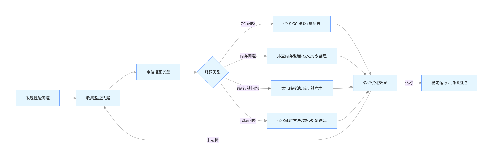 |
| :----------------------------------------------------------: |

> **明确业务目标 → 开启监控 / 日志采集 → 分析 GC 日志 / 堆内存数据 → 定位核心问题 → 制定调优方案 → 小范围灰度验证 → 全量上线 → 持续监控复盘**

**调优步骤**

1. 明确性能指标（RT、QPS、TP99）
2. 开启 GC 日志
3. 分析 GC 情况
4. 判断瓶颈（内存 / 线程 / 锁）
5. 调整参数
6. 压测验证

📌 **加分：**

> 不通过 GC 日志直接调参数，属于“盲调”

**关键原则：**

- 先优化代码，再调 JVM 配置：代码层面的低效（如频繁创建大对象、死循环），无法通过 JVM 调参弥补；
- 一次只改一个参数：避免多参数同时修改，无法定位有效优化项；
- 基于数据决策：不依赖 “经验值”，所有优化都需通过监控数据验证效果。


###### JVM 调优思路

1. 明确问题（CPU、GC、OOM？）；
2. 采样分析（jstat、VisualVM、Arthas）；
3. 找出热点类 / 方法；
4. 调整 GC 策略或内存参数；
5. 代码优化（对象复用、异步化）。


###### 必监控的核心指标

1. **GC 相关（核心中的核心）**：Minor GC 的频率、单次耗时；Full GC 的频率、单次耗时；
    - 健康标准：Minor GC 几秒～几十秒一次，单次耗时 < 20ms；Full GC 几小时～几天一次，单次耗时 < 500ms；
    - 异常标准：**1 分钟内多次 Full GC、Full GC 耗时 > 1s、Minor GC 频繁且单次耗时 > 50ms** → 必须立即排查。
2. **内存相关**：堆内存（新生代 / 老年代）的使用率、内存增长趋势；元空间使用率；直接内存使用率；
3. **业务相关**：接口响应时间（TP50/TP90/TP99）、服务吞吐量（QPS）、线程数、CPU 使用率；
4. **异常相关**：是否出现 OOM、内存泄漏、线程阻塞、死锁等。


###### 对象生命周期

- 临时对象（方法内局部变量）：在Eden区分配，Minor GC即可回收
- 短期对象（请求上下文）：在Survivor区经历几次GC后回收
- 长期对象（缓存、单例）：最终进入老年代，触发Full GC


###### 建立量化指标

- 吞吐量：业务逻辑执行时间/(业务逻辑时间+GC时间)，金融系统要求>95%
- 延迟：99.9%响应时间<500ms（根据业务调整）
- GC健康度：
    - Minor GC间隔>10s，单次耗时<100ms
    - Full GC间隔>1h，单次耗时<1s


###### 快速定位性能问题

| 现象              | 大概率问题                |
| ----------------- | ------------------------- |
| Young GC 非常频繁 | 新生代太小 / 对象创建过多 |
| Full GC 频繁      | 老年代压力大              |
| Full GC 很慢      | 堆太大 / CMS 碎片         |
| RT 抖动明显       | Stop-The-World            |
| OOM               | 泄漏 / 堆配置不合理       |


###### 常见性能问题

| 问题类型         | 关键线索                                | 主要工具/命令                               | 调优方向                                                     |
| :--------------- | :-------------------------------------- | :------------------------------------------ | :----------------------------------------------------------- |
| **频繁Full GC**  | `FGC` 次数快速增加，`OU` 居高不下       | `jstat`, `jmap` + **MAT**                   | 1. 分析内存泄漏 (根本) 2. 增大堆/老年代 (临时) 3. 调整GC策略 |
| **频繁Young GC** | `YGC` 频率高，Eden区小，分配速率高      | GC日志分析，`jstat`                         | 1. **增大新生代** (-Xmn) 2. 优化对象分配                     |
| **容器OOM**      | 容器内进程被 kill，JVM堆大小 > 容器限制 | 容器监控，`jmap -heap`                      | **显式设置`-Xmx`等参数**，总内存留有余量                     |
| **元空间溢出**   | `OOM: Metaspace`，MC/MU持续增长         | `jstat`, Metaspace GC日志                   | 1. 设置 `MaxMetaspaceSize` 2. 解决类加载泄漏                 |
| **高CPU**        | CPU占用高，但负载不高                   | `top -Hp`, `jstack`, **Arthas**             | 定位热点线程/代码：死循环、锁竞争、频繁GC                    |
| **长STW停顿**    | 单次GC停顿时间过长 (e.g., > 1s)         | GC日志（关注 `[Times: user=... real=...]`） | 1. 切换低延迟GC器 (如G1, ZGC) 2. 调整Region大小、目标停顿时间等 |

| 症状         | 可能原因               | 检查方向               |
| :----------- | :--------------------- | :--------------------- |
| CPU持续100%  | 死循环、频繁GC、锁竞争 | top→jstack→GC日志      |
| 响应时间波动 | GC停顿、资源竞争       | GC日志、线程dump       |
| 内存缓慢增长 | 内存泄漏、缓存过大     | jmap、MAT分析          |
| Full GC频繁  | 内存不足、晋升过快     | Survivor区、晋升阈值   |
| Young GC频繁 | Eden区过小、分配速率高 | 对象分配速率、Eden大小 |

| 问题现象          | 可能原因                           | 解决方案                                    |
| ----------------- | ---------------------------------- | ------------------------------------------- |
| 频繁 Full GC      | 内存泄漏 / 堆太小 / 老年代过早填满 | 分析 heap dump；增大堆；优化对象生命周期    |
| Young GC 过于频繁 | Eden 区太小 / 对象分配速率高       | 增大年轻代；减少临时对象创建                |
| GC 停顿时间长     | 使用了 Serial/Parallel GC；堆过大  | 切换到 G1/ZGC；合理设置 MaxGCPauseMillis    |
| Metaspace OOM     | 动态类加载过多（如反射、CGLib）    | 增加 `-XX:MaxMetaspaceSize`；避免重复类加载 |


###### 推荐工具链

1. **监控**：Prometheus + Grafana + JMX Exporter
2. **分析**：GCViewer, GCEasy, MAT
3. **压测**：JMeter, Gatling
4. **APM**：SkyWalking, Pinpoint, Arthas
5. **容器环境**：JDK的容器感知特性（-XX:+UseContainerSupport）


###### 调优最关心哪些 JVM 指标

- Full GC 次数和耗时
- Young GC 频率
- 堆使用率
- Old 区增长趋势
- STW 时间
- 对象分配速率


###### 如何判断JVM是否需要调优

- Full GC 频繁
- RT 抖动明显
- CPU 使用异常
- OOM 或接近 OOM
- GC 时间 > 10%


###### 调优关键衡量指标

| 指标类型     | 核心指标                          | 正常范围                         | 异常判断标准                     |
| ------------ | --------------------------------- | -------------------------------- | -------------------------------- |
| **GC 相关**  | Minor GC 频率 / 耗时              | 频率 < 1 次 / 秒，耗时 < 10ms    | 频率 > 5 次 / 秒或耗时 > 50ms    |
|              | Full GC 频率 / 耗时               | 频率 < 1 次 / 小时，耗时 < 500ms | 频率 > 1 次 / 10 分钟或耗时 > 1s |
|              | GC 时间占比（吞吐量）             | < 5%                             | > 10%（吞吐量严重下降）          |
| **内存相关** | 堆内存使用率（老年代 / 新生代）   | 稳定在 40%-70%                   | 持续增长至 90%+（内存泄漏）      |
|              | 元空间使用率                      | < 70%                            | 频繁扩容或占满（需调大元空间）   |
| **线程相关** | 线程数（活跃线程 / 阻塞线程）     | 匹配 CPU 核心数或业务需求        | 线程数暴增（如线程池无界）       |
|              | 锁竞争（等待锁时间 / 锁冲突次数） | 等待时间 < 1ms                   | 等待时间 > 10ms（锁竞争激烈）    |
| **业务相关** | 接口响应时间（P95/P99）           | 按业务定义（如 < 50ms）          | P99 延迟持续高于阈值             |
|              | 吞吐量（QPS/TPS）                 | 达到设计目标                     | 低于设计值 30%+（性能瓶颈）      |


###### JIT 编译与性能优化

- **解释执行**：逐行解释字节码，启动快但运行慢
- **JIT（Just-In-Time）编译**：热点代码编译为机器码，加速执行
- **AOT（Ahead-Of-Time）编译**（JDK9+）：提前编译为本地代码，减少启动时间


###### JIT（即时编译）优化

JIT（Just-In-Time Compiler）在热点代码上自动优化：

| 优化类型        | 含义           |
| --------------- | -------------- |
| 方法内联        | 小方法直接展开 |
| 循环展开        | 减少跳转       |
| 逃逸分析        | 栈上分配       |
| 锁消除 / 锁粗化 | 降低锁竞争     |

可观察 JIT 编译情况：

```
-XX:+PrintCompilation
```


###### 线程与并发调优

| 参数                          | 说明                             |
| ----------------------------- | -------------------------------- |
| `-XX:+UseBiasedLocking`       | 启用偏向锁                       |
| `-XX:-UseBiasedLocking`       | 禁用偏向锁（Java 15+ 默认移除）  |
| `-XX:+UseStringDeduplication` | 字符串去重                       |
| `-XX:+AlwaysPreTouch`         | 提前内存页映射，避免动态分配开销 |


###### 虚拟线程与平台线程调度差异？

- **平台线程** 1:1 映射 OS 线程，**阻塞=OS 阻塞**
- **虚拟线程** M:N 用户态调度，**阻塞→Yield**，**载体线程被复用**

```bash
-Djdk.virtualThreadScheduler.parallelism=CPU
```


###### 如何快速判定当前 JVM 是“客户端”还是“服务器”模式

```bash
java -version
```

输出含 **Server VM** 即服务器模式；**容器 2 vCPU 以上自动 Server**。


###### 衡量 JVM 性能关注哪些核心指标

1. **吞吐量**（TP99/TP999 延迟）
2. **GC 停顿频次与耗时**（Young/Full GC 次数，Pause Time）
3. **资源利用率**（CPU、内存、线程数）

```bash
-Xlog:gc*,safepoint:file=gc.log:time,level,tags
```

用 GCViewer 打开 → 看 **Max Pause** & **Throughput %**。


###### 如何评估 JVM 调优是否成功

| 指标              | 调优前   | 调优后   | 目标 |
| ----------------- | -------- | -------- | ---- |
| **Young GC 频率** | 10次/秒  | 2次/秒   | ↓    |
| **Full GC 次数**  | 1次/小时 | 0        | =0   |
| **平均 GC 停顿**  | 200ms    | 50ms     | ↓    |
| **应用吞吐量**    | 1000 TPS | 1500 TPS | ↑    |
| **P99 延迟**      | 800ms    | 200ms    | ↓    |

> 工具：JMeter 压测 + GC 日志分析（GCEasy.io）+ APM（SkyWalking/Prometheus）


###### “Stop-The-World”是什么，如何减少 STW 时间

GC 时暂停所有应用线程，确保对象引用一致性

**什么是 STW？**

- GC 过程中，**所有应用线程暂停**，由 GC 线程执行内存回收。
- Young GC、Full GC、部分 G1 的 Mixed GC 都有 STW 阶段。

**减少 STW 的方法**

1. **选择低停顿 GC**：G1 / ZGC / Shenandoah 替代 Parallel/CMS
2. **控制堆大小**：堆越大，STW 越长（但 GC 频率降低）→ 需权衡
3. **减少对象分配速率**：避免频繁 Young GC
4. **避免大对象**：防止直接进入老年代触发 Full GC
5. **升级 JDK**：新版本 GC 算法更高效（如 G1 的 string deduplication）

**触发操作**

1. **Minor GC**（Serial/Parallel）；
2. **Full GC**（所有 GC 器）；
3. **G1 的 Mixed GC**（部分阶段）；
4. **类加载的初始化阶段**（`<clinit>`）；
5. **偏向锁撤销**（大量线程竞争时）。

> 💡 **加分点**：
> “ZGC/Shenandoah 通过并发标记+转移，将 STW 降至 <1ms，适合金融交易系统。”


###### JIT编译如何影响性能

- **JIT 作用**：将热点代码编译为本地机器码，执行速度提升 10~100 倍；

- 监控方式：

    ```bash
    # 打印 JIT 编译日志
    -XX:+PrintCompilation
    
    # 生成详细日志（需解锁）
    -XX:+UnlockDiagnosticVMOptions -XX:+LogCompilation
    ```

- 关键指标：

    - `CompileThreshold`：方法调用达 10000 次触发 C2 编译；
    - `%` 符号：OSR 编译（循环中替换代码）。

> 💡 **调优建议**：
> “避免大方法（>35 字节码），利于 JIT 内联；关键路径用 `final` 提高虚方法内联概率。”


###### 逃逸分析（Escape Analysis）是什么，有什么优化效果

- **定义**：分析对象作用域是否“逃逸”出当前方法/线程；

- 优化效果：

    1. **栈上分配**：不逃逸对象分配在栈上（避免 GC）；
    2. **标量替换**：拆分对象为基本类型（消除对象头开销）；
    3. **锁消除**：同步块中对象不逃逸 → 去掉无用 `synchronized`。

> 🌰 **示例**：

```java
void foo() {
    StringBuilder sb = new StringBuilder(); // 不逃逸
    sb.append("hello");
    System.out.println(sb.toString());
}
```

> JIT 可能优化为直接字符串拼接，**无对象分配**。


###### 调优禁忌

**错误调优**

- 盲目增大堆内存：堆过大导致 Full GC 耗时激增（如 64GB 堆用 Parallel Old，Full GC 耗时 10s+）；
- 过度优化：单线程场景调优 GC 器、低并发场景优化锁竞争（优化收益为 0）；
- 禁用 GC：通过 `-XX:+DisableGC` 禁用 GC（最终必然 OOM）；
- 忽略代码优化：只调 JVM 参数，不修复代码层面的低效（如内存泄漏、死循环）。

**常见误区**

- 误区 1：`-Xmx` 越大越好 → 纠正：堆大小需匹配物理内存，且避免 Full GC 耗时过长；
- 误区 2：使用 G1 就一定低延迟 → 纠正：G1 需合理配置 `MaxGCPauseMillis`、`InitiatingHeapOccupancyPercent`，否则性能不如 Parallel；
- 误区 3：频繁 Minor GC 一定是问题 → 纠正：Minor GC 耗时短（< 10ms）、频率适中（1 次 / 秒）是正常现象，无需优化；
- 误区 4：锁越多越好 → 纠正：过多锁会导致锁竞争加剧，应优先使用无锁并发工具（如原子类、并发集合）。


### 参数配置

###### 常用JVM调优参数

| 类别          | 参数                        | 说明                        |
| ------------- | --------------------------- | --------------------------- |
| **堆内存**    | `-Xms4g -Xmx4g`             | 初始/最大堆（建议设为相同） |
| **新生代**    | `-Xmn2g`或`-XX:NewRatio=2`  | 新生代大小                  |
| **GC 选择**   | `-XX:+UseG1GC`              | 使用 G1                     |
| **GC 日志**   | `-Xlog:gc*:gc.log`          | JDK 9+ GC 日志              |
| **Metaspace** | `-XX:MaxMetaspaceSize=512m` | 防止元空间无限增长          |

> **避坑**：避免 `-Xms` ≠ `-Xmx`，防止堆动态扩展带来性能抖动。


###### 生产堆大小如何定

**堆 = 机器物理内存 × 50% ~ 60%**
**初始 = 最大**（`-Xms=-Xmx`）避免扩容抖动。


###### 什么情况下应该选择 ZGC 而不是 G1

| 对比项         | G1 GC           | ZGC                                  |
| -------------- | --------------- | ------------------------------------ |
| **停顿时间**   | 目标 100~300ms  | **< 10ms**（官方目标）               |
| **堆大小支持** | 几 GB ~ 数十 GB | **TB 级**                            |
| **JDK 支持**   | JDK 7u4+        | **JDK 11+（实验），JDK 15+（正式）** |
| **适用场景**   | 通用低延迟      | 超低延迟要求（金融交易、实时系统）   |

✅ **选 ZGC 当：**

- 应用 P99 延迟要求 **< 10ms**
- 堆内存 **> 16GB**
- 使用 **JDK 17+（LTS）**，ZGC 更成熟

> ⚠️ 注意：ZGC 对 CPU 开销略高，且不支持 `-XX:+UseStringDeduplication`（截至 JDK 21）。


###### G1 GC 调优的关键参数有哪些

G1 的核心目标是 **可控的停顿时间**。

| 参数                                    | 作用                             | 建议值                                      |
| --------------------------------------- | -------------------------------- | ------------------------------------------- |
| `-XX:MaxGCPauseMillis=200`              | **目标最大停顿时间**（非保证！） | 根据 SLA 设定（如 100~300ms）               |
| `-XX:G1HeapRegionSize=<size>`           | Region 大小（1~32MB）            | 默认自动计算，堆 > 32GB 可设为 16/32MB      |
| `-XX:G1NewSizePercent=5`                | 新生代最小占比                   | 默认 5%，可适当调高（如 10~20%）            |
| `-XX:G1MaxNewSizePercent=60`            | 新生代最大占比                   | 默认 60%                                    |
| `-XX:InitiatingHeapOccupancyPercent=45` | 触发并发标记的堆占用阈值         | 默认 45%，若 Mixed GC 不及时可降低（如 35） |

**💡 调优技巧：**

- 若 **Mixed GC 回收效率低** → 降低 `IHOP`，提前启动并发标记
- 若 **Young GC 太频繁** → 增大新生代比例（`G1NewSizePercent`）
- 若 **停顿仍超预期** → 检查是否有大对象（Humongous Object），考虑拆分


###### Parallel GC 和 G1 GC 如何选择

| 对比项       | Parallel GC      | G1 GC                       |
| ------------ | ---------------- | --------------------------- |
| **目标**     | 吞吐量优先       | 延迟可控                    |
| **STW 时间** | 长（秒级）       | 短（<500ms）                |
| **堆大小**   | < 10GB           | 4GB ~ TB                    |
| **内存碎片** | 有（标记-整理）  | 无（分区回收）              |
| **适用场景** | 批处理、离线任务 | Web 服务、实时系统          |
| **调优难度** | 低（参数少）     | 高（需调 Region、停顿时间） |

> ✅ **选择建议**：
>
> - **吞吐量 > 延迟** → Parallel；
> - **延迟敏感** → G1；
> - **超大堆 + 超低延迟** → ZGC。


###### 为什么要设置 `-XX:MaxMetaspaceSize`

- **原因**：Metaspace 使用**本地内存**（Native Memory），默认无上限；

- 后果：

    - 动态生成类过多（如 Spring AOP 代理、Groovy 脚本）→ 耗尽系统内存；
    - OS 触发 OOM Killer，**直接杀死 JVM 进程**（无 OOM 日志）；

- 解决方案：

    - 设置 `-XX:MaxMetaspaceSize=256m`；
    - 监控：`jstat -gcmetacapacity <pid>`。

> ⚠️ **注意**：
> “Metaspace OOM 在 JDK 8+ 表现为 `java.lang.OutOfMemoryError: Metaspace`，但系统内存耗尽可能直接 kill 进程。”


###### 在 Kubernetes 中，JVM内存如何配置才不会 OOM

正确配置（JDK 8u191+ / JDK 10+）：

```yaml
# Kubernetes Pod 资源限制
resources:
  limits:
    memory: "2Gi"
  requests:
    memory: "2Gi"

# JVM 参数
-XX:MaxRAMPercentage=75.0  # 使用容器内存的 75%（≈1.5G）
-XX:MaxMetaspaceSize=128m
```

**错误配置：**

- **不设 `-XX:MaxRAMPercentage`** → JVM 按**宿主机内存**分配堆（如 32G），导致容器 OOM 被 kill；
- **只设 `-Xmx`** → 若容器内存变化，需手动调整。

**验证命令**：

```bash
kubectl exec <pod> -- java -XX:+PrintFlagsFinal -version | grep MaxHeapSize
```


### 典型问题

###### 只能改一个参数提升吞吐量

**答案**：`-XX:+UseParallelGC`（**吞吐量优先**），**比 G1 提升 5-10 % CPU 利用率**，**牺牲 200 ms 级别停顿**。


###### 如何让方法强制编译

- **JIT 热点**：`java -XX:CompileCommandFile=hotspot.conf`

    ```bash
    compileonly java/util/HashMap::get
    ```

- **AOT 库**：`jaotc --output libHashMap.so HashMap.class`

    ```bash
    -XX:AOTLibrary=./libHashMap.so
    ```


###### 静态变量过大导致堆 OOM，如何快速定位

1. `jmap -histo:live` 看 **类名 $$ 实例**（mirror）大小；
2. `jfr` → `jdk.ObjectAllocationSample` → 过滤类名；
3. 解决：**拆散 Map**、**懒加载**、**弱引用**


###### 压缩指针失效条件

**堆 > 32 GB** 自动关闭；**可用 `-XX:+UseCompressedOops` 强制开**（需 OS 支持）。
**替代方案**：**分堆**（多 JVM）或 **ZGC**（支持 16 TB 且默认压缩）。


###### 直接内存泄漏怎么查

```bash
jcmd <pid> VM.native_memory | grep Direct
```

看 **Reserved/Committed**；**MemoryUsed > Max** ⇒ leak。
解决：

- 显式 `-XX:MaxDirectMemorySize=2g`
- **显式释放** `DirectByteBuffer.cleaner().clean()`。


###### 元空间 OOM 如何定位与解决

1. `jcmd <pid> VM.native_memory | grep Metaspace`
2. `jmap -clstats` 看 **加载类数量**；
3. 解决：
    - 调大 `-XX:MaxMetaspaceSize=1g`
    - **减少动态代理**（MyBatis/JSON 序列化缓存类）。

```bash
-XX:+TraceClassLoading
```


###### 压测得到 TP99=400 ms，如何拆 JVM 责任

1. 看 **GC 日志**是否与 TP99 尖峰对齐；
2. `jstack` 抓 **锁/阻塞**；
3. `jfr` 看 **JIT 编译热点** & **异常分配**。

```bash
jfr start --maxsize=100M --filename=app.jfr
```


###### 新生代和老年代的调优思路

**新生代调优（核心目标：减少 Minor GC 频率 / 耗时）**

- 调优逻辑：新生代越大，Minor GC 频率越低，但单次耗时越长；需平衡 “频率” 和 “单次耗时”。

- 核心参数（Parallel/CMS）：

    1. `-Xmn`：直接设置新生代大小（建议占堆的 1/3~1/2）；
    2. `-XX:NewRatio=<n>`：老年代 / 新生代比例（如 `NewRatio=2` → 老：新 = 2:1）；
    3. `-XX:SurvivorRatio=<n>`：Eden/Survivor 比例（默认 8，即 Eden:From:To=8:1:1）；
    4. `-XX:MaxTenuringThreshold=<n>`：对象晋升老年代的年龄阈值（默认 15，增大可减少提前晋升）。

- G1 注意：G1 自动管理新生代大小，**禁止手动设置 `-Xmn`**，通过 `-XX:G1NewSizePercent`/`G1MaxNewSizePercent` 限制新生代比例。

**老年代调优（核心目标：避免 Full GC 频繁 / 停顿过长）**

- 调优逻辑：老年代需容纳新生代晋升的对象，避免因空间不足触发 Full GC。
- 核心参数：
    1. ParallelGC：`-XX:+UseParallelOldGC`（老年代并行回收，提升吞吐量）；
    2. CMS：`-XX:CMSInitiatingOccupancyFraction=<n>`（老年代使用率达到 n% 触发 CMS，默认 68，建议 75~80）；
    3. G1：`-XX:InitiatingHeapOccupancyPercent=<n>`（堆使用率达到 n% 触发 Mixed GC，默认 45）；
    4. 通用：`-XX:+UseCMSCompactAtFullCollection`（CMS Full GC 后压缩内存，避免碎片）。


###### 高并发场景下，JVM 调优的核心策略是什么

高并发场景（如秒杀、高 QPS 接口）的核心痛点是 “线程数多、GC 频繁、锁竞争激烈”，调优策略：

1. 内存调优：

    - 堆配置：`-Xms=-Xmx`（固定堆，避免扩容），堆大小按服务器内存 1/2~2/3 设置；
    - 新生代：适当增大（占堆 1/2），减少 Minor GC 频率；
    - 元空间：设置 `MaxMetaspaceSize`（如 512m），避免元空间 OOM；

2. GC 调优：

    - 收集器：JDK 8+ 用 G1GC（`-XX:+UseG1GC`），设置 `MaxGCPauseMillis=100`（接口场景）；
    - 禁用手动 GC：`-XX:+DisableExplicitGC`，避免框架触发 Full GC；

3. 线程调优：

    - 线程栈：减小 `-Xss`（如 256k），增加最大线程数；
    - 线程池：核心线程数设为 CPU 核心数 * 2（IO 密集），避免线程数过多导致上下文切换；

4. 代码 / 并发调优：

    - 锁优化：减小锁粒度（如分段锁）、改用无锁并发（`Atomic` 类、`ConcurrentHashMap`）；
    - 减少对象创建：复用对象（如对象池）、避免频繁创建临时对象（减少 Minor GC）；
    - `ThreadLocal`：使用后调用 `remove()`，避免线程池核心线程持有对象导致内存泄漏。


######  JVM调优常见的误区

**高频误区**

1. **盲目增大堆内存**：如 8GB 服务器设置 `-Xmx8g`，导致系统内存不足（OOM Killer 杀死 JVM）；
2. **过度追求低停顿**：将 G1 的 `MaxGCPauseMillis` 设为 50ms，导致 GC 频率翻倍，吞吐量下降；
3. **混用收集器参数**：如 G1GC 配置 `-XX:NewRatio`（G1 不识别，无效）；
4. **忽略元空间 / 直接内存**：只配置堆内存，未设置 `MaxMetaspaceSize`/`MaxDirectMemorySize`，导致非堆 OOM；
5. **调优不验证**：修改参数后未对比基准指标，凭 “感觉” 认为调优有效。

**规避方法**

1. 堆内存设置原则：物理内存的 1/2 ~ 3/4，预留内存给系统 / 非堆；
2. 调优前先定基准指标（如 GC 停顿时间、QPS），调优后量化验证；
3. 参考官方文档：确保参数与收集器兼容（如 G1 仅支持 `G1HeapRegionSize` 等专属参数）；
4. 必配兜底参数：`-XX:+HeapDumpOnOutOfMemoryError`、GC 日志滚动、`MaxMetaspaceSize`。


###### 如何判断JVM调优已经达到最优状态

1. 业务指标达标：

    - 接口 P99 延迟 < 调优目标（如 200ms），无超时；
    - 吞吐量（QPS/TPS）达到业务要求，且无波动；

2. JVM 状态稳定：

    - GC：Minor GC 频率合理（如每 1~5 分钟 1 次），Full GC 极少（如每天 <1 次），GC 停顿时间 < 目标值；
    - 内存：堆 / 非堆内存使用率稳定在 60%~70%，无持续上涨；
    - 线程：无死锁、无大量阻塞线程，线程数稳定在合理范围；

3. 资源利用率合理：

    - CPU 利用率：70%~80%（避免空耗或满载）；
    - 内存：无交换分区使用（swap），避免 JVM 使用虚拟内存导致性能下降。


###### 如何避免 Full GC？Full GC 的常见原因

| 原因                | 说明                   | 解决方案                          |
| ------------------- | ---------------------- | --------------------------------- |
| **老年代满**        | 对象过早晋升、内存泄漏 | 增大堆、优化代码、分析堆转储      |
| **Metaspace 满**    | 动态生成类过多         | 设置 `-XX:MaxMetaspaceSize`       |
| **System.gc()**     | 代码或库显式调用       | `-XX:+DisableExplicitGC`          |
| **G1 并发模式失败** | 老年代增长过快         | 降低 `-XX:G1HeapOccupancyPercent` |
| **堆外内存满**      | DirectByteBuffer 过多  | `-XX:MaxDirectMemorySize`         |

**避免策略：**

1. **监控老年代**：`jstat -gc` 观察 `OU` 是否持续增长；
2. **禁用显式 GC**：`-XX:+DisableExplicitGC`；
3. **G1 调优**：提前触发并发标记（`-XX:G1HeapOccupancyPercent=35`）。

> ✅ **面试技巧**：
> “我们在日志服务中发现 Full GC 频繁，通过 MAT 分析发现是静态 Map 缓存未清理，修复后 Full GC 消失。”


###### G1 GC的Mixed GC是什么

- **Mixed GC**：G1 在 Young GC 基础上，**回收部分老年代 Region**；

- **触发条件**：老年代占用率 > `G1HeapOccupancyPercent`（默认 45%）；

- 优化策略：

    1. 控制回收集大小：

        - `-XX:G1MixedGCCountTarget=8`（默认 8 次 Mixed GC 回收完老年代）
        - 值太小 → 单次 Mixed GC 时间长
        - 值太大 → 老年代回收慢

    2. **提前触发**：降低 `G1HeapOccupancyPercent`（如 35%）

    3. **监控**：`jstat -gc` 观察 `FGC` 是否 >0（G1 的 Full GC 是单线程，应避免！）

> 💡 **实战经验**：
> “Mixed GC 时间过长时，我们通过 `-XX:G1MixedGCLiveThresholdPercent=85` 跳过存活率高的 Region，提升效率。”


###### CPU 占用 100%，如何定位 Java 进程中的问题线程

1. `top -Hp <pid>`：找出高 CPU 的线程 ID（TID）；
2. `printf "%x\n" <tid>`：转为 16 进制（如 `1a2b`）；
3. `jstack <pid> > thread.txt`：生成线程快照；
4. `grep -A 20 "nid=0x1a2b" thread.txt`：定位线程堆栈；
5. **分析代码**：死循环、复杂计算、频繁 GC。

> 🔥 **工具推荐**：
> `async-profiler` 直接生成火焰图：

```bash
./profiler.sh -d 30 -f profile.html <pid>
```


###### 频繁 Young GC 但老年代不增长，说明什么

- **现象**：YGC 频率高（如 1 秒/次），但 `OU`（老年代使用量）稳定；

- 原因：

    1. **Eden 区太小**：对象创建快，Eden 迅速填满；
    2. **临时对象过多**：如循环内创建对象、字符串拼接用 `+`；

- 解决方案：

    - 增大新生代：`-Xmn2g`；
    - 优化代码：对象复用、`StringBuilder` 替代字符串 `+`。

> 💡 **监控命令**：
> `jstat -gc <pid> 1s`：观察 `EU`（Eden 使用量）是否快速波动。


###### 如何分析 GC 日志定位问题？

**GC日志关键模式识别：**

1. **频繁 Young GC**

    ```
    [GC pause (G1 Evacuation Pause) (young), 0.0233456 secs]
    频繁出现 → 新生代过小或分配速率过快
    ```

2. **Full GC 发生**

    ```
    [Full GC (Allocation Failure) ...]
    原因：分配失败，堆内存不足
    
    [Full GC (System.gc()) ...]
    原因：代码中调用了System.gc()
    
    [Full GC (Metadata GC Threshold) ...]
    原因：元空间不足
    ```

3. **疏散失败（严重问题）**

    ```
    [Evacuation Failure] 或 [to-space exhausted]
    原因：没有足够空间容纳存活对象
    解决方案：增加-XX:G1ReservePercent
    ```

4. **并发模式失败（CMS）**

    ```
    [CMS-concurrent-mark-start]
    [CMS-concurrent-mark: 1.234/2.345 secs]
    并发标记时间过长 → 增加-XX:ConcGCThreads
    ```


###### 大数据量处理应用如何调优？

**场景特点：** 大堆内存（32GB+），长时间运行，吞吐量优先

**调优策略：**

1. **大堆内存配置**

    ```bash
    # 堆大小设置
    -Xms32g -Xmx32g                # 固定大堆
    
    # G1 Region优化
    -XX:G1HeapRegionSize=16m       # 大堆使用大Region
    -XX:G1ReservePercent=15        # 增加预留空间
    
    # 字符串去重（节省大量内存）
    -XX:+UseStringDeduplication
    -XX:StringDeduplicationAgeThreshold=3
    ```

2. **避免 Full GC**

    ```bash
    # 调整IHOP阈值
    -XX:InitiatingHeapOccupancyPercent=40  # 更早开始标记
    
    # 增加并发线程
    -XX:ConcGCThreads=4            # 大堆需要更多并发线程
    
    # 定期触发并发标记
    -XX:G1PeriodicGCInvokesConcurrent=true
    -XX:G1PeriodicGCInterval=10000  # 10秒间隔
    ```

3. **内存分配优化**

    ```bash
    # 避免大对象直接进入老年代
    -XX:PretenureSizeThreshold=0   # 禁用（让G1管理）
    
    # 调整晋升阈值
    -XX:MaxTenuringThreshold=15    # 默认值，允许充分回收
    
    # 监控大对象分配
    -Xlog:gc+humongous=info        # 大对象分配日志
    ```

4. **批处理特定优化**

    ```bash
    # 减少GC开销（如果允许较长停顿）
    -XX:MaxGCPauseMillis=500       # 允许更长停顿
    
    # 调整混合GC行为
    -XX:G1MixedGCLiveThresholdPercent=90  # 只回收存活<90%的Region
    -XX:G1MixedGCCountTarget=32           # 更多次，每次更少
    
    # 关闭偏向锁（减少竞争开销）
    -XX:-UseBiasedLocking
    ```


###### 高并发低延迟应用如何调优

**场景特点：** 要求 P99/P999 延迟稳定，GC 停顿必须短

**调优策略：**

1. **选择低延迟收集器**

    ```bash
    # ZGC（JDK15+生产可用）
    -XX:+UseZGC
    -XX:MaxGCPauseMillis=10        # 目标10ms停顿
    -XX:ConcGCThreads=2            # 控制并发线程数
    
    # 或 Shenandoah（RedHat）
    -XX:+UseShenandoahGC
    -XX:ShenandoahGCHeuristics=adaptive  # 自适应启发式
    ```

2. **内存分配优化**

    ```bash
    # 使用大页面减少TLB miss
    -XX:+UseLargePages
    -XX:LargePageSizeInBytes=2m
    
    # NUMA优化（多CPU插槽）
    -XX:+UseNUMA
    
    # 线程本地分配缓冲（TLAB）
    -XX:+UseTLAB                    # 默认开启
    -XX:TLABSize=512k               # 调整TLAB大小
    ```

3. **锁与同步优化**

    ```bash
    # 锁消除优化
    -XX:+EliminateLocks             # 消除不必要的锁
    -XX:+DoEscapeAnalysis           # 逃逸分析（默认开启）
    
    # 偏向锁优化（JDK15+默认禁用）
    -XX:+UseBiasedLocking           # JDK15前可启用
    -XX:BiasedLockingStartupDelay=0 # 立即启用偏向锁
    
    # 自旋锁优化
    -XX:+UseSpinning                # 启用自旋
    -XX:PreBlockSpin=10             # 自旋次数
    ```

4. **JIT编译优化**

    ```bash
    # 激进内联
    -XX:MaxInlineSize=325           # 增大内联大小
    -XX:FreqInlineSize=6000         # 频繁方法内联
    
    # 编译策略
    -XX:+TieredCompilation          # 分层编译
    -XX:CompileThreshold=1000       # 降低编译阈值
    -XX:OnStackReplacePercentage=80 # OSR百分比
    ```

5. **监控与验证**

    ```bash
    # 详细GC日志
    -Xlog:gc*=trace:file=gc.log     # trace级别日志
    
    # JFR记录
    -XX:StartFlightRecording=disk=true,maxsize=1g
    
    # 延迟监控
    # 使用Micrometer + Prometheus监控P99/P999
    ```


###### 常见 GC 问题有哪些？

| 问题          | 原因                |
| ------------- | ------------------- |
| Full GC 频繁  | 老年代不足          |
| Young GC 频繁 | Eden 太小           |
| GC 时间长     | 堆太大 / 算法不合适 |
| GC 后内存不降 | 内存泄漏            |


###### 如何减少 Full GC？

**标准答案：**

- 增大老年代
- 减少大对象
- 减少对象晋升
- 使用 G1 / ZGC
- 控制动态类加载

📌 **加分：Full GC 多半不是参数问题，而是代码问题**


###### 堆内存如何设置比较合理？

**通用原则：**

- Xms = Xmx
- 新生代占 30%~50%
- Survivor 足够大

📌 **反例：**

- 堆太大 → GC 时间过长
- 堆太小 → GC 频繁


###### Metaspace OOM 怎么处理

- 增大 Metaspace
- 排查类加载泄漏
- 检查动态代理 / SPI


###### CPU 很高但 GC 不多，可能原因

- 死循环
- 锁竞争
- 线程过多
- 热点方法未被 JIT 优化


###### 线程数太多会带来什么问题

- 上下文切换频繁
- 栈内存耗尽
- CPU 利用率下降

📌 **经验值：**

```text
线程数 ≈ CPU 核数 * 2
```


###### Docker 中 JVM 内存为什么容易 OOM

- JVM 不识别容器限制
- 使用宿主机内存

📌 解决：

```
-XX:MaxRAMPercentage
```


###### 为什么容器里不能随便用 `-Xmx`

- 容器内存动态
- 固定 Xmx 风险大


###### 如何排查 OOM 问题

1. 配置参数`-XX:+HeapDumpOnOutOfMemoryError -XX:HeapDumpPath=./heap.hprof`，让 JVM 在 OOM 时生成堆快照。
2. 使用 MAT（Memory Analyzer Tool）分析堆快照，定位大对象或泄漏对象（如查看对象引用链）。
3. 结合业务代码，修复内存泄漏（如释放无用对象引用）或调整堆大小。


###### 如何查看 JVM 的 GC 日志和线程状态

- GC 日志：通过`-verbose:gc -XX:+PrintGCDetails -Xloggc:./gc.log`输出，分析 GC 频率、耗时、内存变化。
- 线程状态：用`jstack <pid>`导出线程栈，排查死锁（`Found one Java-level deadlock`）、阻塞线程（`BLOCKED`状态）。


###### 如何排查内存泄漏

1. **监控**：`jstat -gc <pid>` 观察老年代是否持续增长；
2. **堆转储**：`jmap -dump:format=b,file=heap.hprof <pid>`；
3. **分析**：用 **MAT（Memory Analyzer Tool）** 或 **VisualVM** 分析 dominator tree；
4. **定位**：查找 GC Roots 到泄漏对象的引用链，找出未释放的集合、缓存、监听器等。


###### 如何排查 OOM（OutOfMemoryError）和 SOF（StackOverflowError）

- **OOM**：使用 `-XX:+HeapDumpOnOutOfMemoryError` 参数在 OOM 时自动生成堆转储文件，然后用 **Eclipse MAT** 或 **JVisualVM** 分析，看是内存泄漏还是内存设置过小。
- **SOF**：通常由无限递归或过深的调用栈引起，查看线程栈信息即可定位。


###### OOM（OutOfMemoryError）有哪些类型

| 错误类型                           | 含义             |
| ---------------------------------- | ---------------- |
| Java heap space                    | 堆内存不足       |
| GC overhead limit exceeded         | GC 过度耗时      |
| Metaspace                          | 类元数据空间不足 |
| StackOverflowError                 | 栈深度过大       |
| Direct buffer memory               | 直接内存不足     |
| Unable to create new native thread | 系统线程数受限   |


###### SpringBoot 启动优化

1. **固定堆** `-Xms1g -Xmx1g`

2. **TieredStopAtLevel=1` 提前编译**

3. **Spring AOT** 生成 `META-INF/native-image`

4. **CRaC 快照** 冷启动 **毫秒级**。


###### 云原生

| 场景         | 参数                                              |
| :----------- | :------------------------------------------------ |
| **K8s 限制** | `-XX:MaxRAMPercentage=75.0` **代替固定 -Xmx**     |
| **大页**     | `-XX:+UseLargePages -XX:LargePageSizeInBytes=1g`  |
| **ZGC 容器** | `-XX:+UseZGC -XX:+ZGenerational` **16 TB 堆支持** |


###### 如果Eden没满也频繁 GC

- 分配速率过高
- QPS / 对象创建太多


###### 常见GC日志问题

| 日志现象    | 真正含义          | 行动        |
| ----------- | ----------------- | ----------- |
| YGC 很频繁  | 新生代小 / 分配快 | 扩新生代    |
| Survivor 满 | 晋升过早          | 调 Survivor |
| Old 持续涨  | 缓存/泄漏         | jmap        |
| Full GC     | 老年代失控        | G1 / 代码   |
| STW 长      | 堆过大            | 缩堆        |


###### 调优总结

| 你看到的现象           | 第一步该做什么                 |
| ---------------------- | ------------------------------ |
| P99抖动 + GC日志长暂停 | 分析GC类型（Young/Mixed/Full） |
| 内存涨到顶不回落       | Dump分析，怀疑泄漏             |
| CPU常年高              | async-profiler火焰图           |
| OOM但堆不大            | 查Direct/Metaspace/线程        |
| 容器频繁OOMKilled      | 检查RAMPercentage和堆外内存    |


###### 调优常见误区

- ❌ **只看堆，不看堆外/线程/元空间**
- ❌ **GC暂停长就疯狂调MaxGCPauseMillis**（会牺牲吞吐）
- ❌ **不做基线，改完靠感觉**
- ❌ **一次改一堆参数**，最后不知哪个有效
- ❌ **把泄漏当作"堆不够"**（短期能活，长期必炸）
- ❌ **容器里照搬物理机参数**

**核心总结**：JVM调优是**测量驱动**的工程实践，不是背参数。90%的问题靠**代码优化+给足堆**解决，参数只是最后10%的微调。务必先建立基线，小步验证，持续监控。


### 调优步骤

| 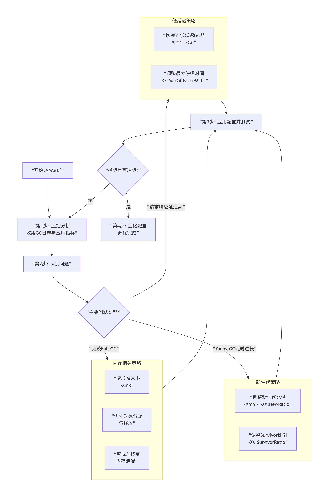 |
| :----------------------------------------------------------: |

#### 一 明确调优目标

- **低延迟**：P99/P999响应时间稳定，GC暂停可控（适合微服务、API）
- **高吞吐**：单位时间处理更多请求，允许一定暂停（适合批处理、计算密集）
- **低成本**：更少内存/CPU，同样吞吐（适合容器/云环境）

> **经验**：
>
> * 线上80%问题是**延迟毛刺**和**内存失控**，吞吐往往不是第一位。
> * 调优的核心观测指标是 **GC 次数 + GC 停顿时间 + FullGC 频率**
> * Minor GC（新生代 GC）：正常现象，单次停顿**毫秒级**，频率稍高可接受
> * Full GC（整堆 GC）：**调优的核心优化对象**，单次停顿**百毫秒～秒级**，生产要求：**尽可能杜绝 FullGC，或 FullGC 频率降到小时 / 天级别**


#### 二 标准调优流程

> 建立基线 → 2. 定位瓶颈 → 3. 小步实验 → 4. 验证效果 → 5. 固化经验

##### 1 建立基线（Baseline）

- **业务指标**：QPS、P99延迟、错误率、超时率
- **JVM指标**：GC次数/暂停时间、堆使用率、线程数、元空间
- **系统指标**：CPU、Load、RSS内存、IO

##### 2 定位瓶颈类型

- GC压力大（分配太快/回收慢/老年代膨胀）
- 堆外内存吃满（DirectBuffer/Netty）
- 元空间泄漏（动态代理生成类过多）
- 线程太多（上下文切换/锁竞争）
- CPU热点（对象创建、序列化、正则）

##### 3 小步实验原则

- 一次只改**一个**参数或代码点
- 压测**相同流量**对比
- 用**数据说话**，杜绝拍脑袋


#### 三 监控预警配置

```bash
# GC日志监控告警规则（示例）
- Young GC耗时 > 100ms
- Full GC频率 > 1次/小时  
- Full GC耗时 > 1秒
- 堆内存使用率 > 80%持续5分钟
- 老年代使用率 > 75%
```

**常用诊断命令速查**

```bash
# 快速诊断脚本
#!/bin/bash
PID=$1
echo "=== JVM诊断报告 ==="
echo "1. GC统计:"
jstat -gcutil $PID 1000 5
echo -e "\n2. 线程状态:"
jstack $PID | grep "java.lang.Thread.State" | sort | uniq -c
echo -e "\n3. 堆内存摘要:"
jmap -heap $PID | grep -A 10 "Heap Configuration"
echo -e "\n4. TOP类实例:"
jmap -histo:live $PID | head -15
```


## 调优思路

### 编译调优

| 层级 | 描述                | 参数                              |
| :--- | :------------------ | :-------------------------------- |
| 0    | 解释执行            | 默认                              |
| 1    | C1 快速编译         | `-XX:Tier3CompileThreshold=2000`  |
| 2    | C1 + 轻量 Profiling | 默认                              |
| 3    | 重 Profiling        | 默认                              |
| 4    | C2 深度优化         | `-XX:Tier4CompileThreshold=15000` |

> 云原生冷启动敏感：`-XX:TieredStopAtLevel=1` 可 **提前编译**，**启动提速 30 %**。


######  JIT 相关参数

```bash
-XX:+TieredCompilation        # 分层编译（默认）
-XX:TieredStopAtLevel=1       # 禁用 C2，只用 C1（快速启动）
-XX:+UnlockDiagnosticVMOptions
-XX:+PrintCompilation         # 打印 JIT 编译日志

# JIT编译器优化
-XX:+TieredCompilation       # 分层编译（推荐）
-XX:CICompilerCount=4        # 编译线程数
-XX:ReservedCodeCacheSize=512m
```

> 关注热点方法编译，使用`-XX:+PrintCompilation`


###### 代码层优化建议

| 问题                 | 优化方案                                 |
| -------------------- | ---------------------------------------- |
| **频繁创建临时对象** | 对象复用、StringBuilder                  |
| **大方法**           | 拆分为小方法（利于 JIT 内联）            |
| **虚方法调用**       | 用 final/private 提高内联概率            |
| **反射**             | 关键路径避免反射，或缓存 Method          |
| **锁竞争**           | 减小锁粒度、用 LongAdder 替代 AtomicLong |

> 💡 **逃逸分析优化**： 
>
> - 不逃逸的对象可能**栈上分配**；
> - 同步块中对象不逃逸 → **锁消除**。


### CPU调优

| 问题           | 参数/工具                 | 说明                            |
| :------------- | :------------------------ | :------------------------------ |
| **线程数飙高** | `jstack + top -H`         | 定位 TID → 十六进制 → 栈        |
| **死锁**       | `jcmd <pid> Thread.print` | 自动检测死锁                    |
| **偏向锁撤销** | `-XX:-UseBiasedLocking`   | JDK15+ 默认禁用，**省 5 % CPU** |
| **虚假唤醒**   | `LockSupport.park()`      | 减少 `Object.wait()`            |

###### 线程池调优

- **问题**：线程过多 → 上下文切换开销大；

- 建议：

    - CPU 密集型：线程数 = CPU 核数；
    - IO 密集型：线程数 = CPU 核数 * (1 + 平均等待时间/平均工作时间)；

- **监控**：`jstack` 查看 BLOCKED/WAITING 线程。


### 内存调优

- **元空间**：`-XX:MetaspaceSize=256m -XX:MaxMetaspaceSize=512m`
- **直接内存**：`-XX:MaxDirectMemorySize=256m`
- **对象晋升**：`-XX:MaxTenuringThreshold=3`（对象年龄阈值）

```bash
-XX:+AlwaysPreTouch           # 启动时分配所有内存，避免运行时缺页中断
-XX:+DisableExplicitGC        # 忽略 System.gc()（慎用，某些 NIO 框架依赖）
-XX:ReservedCodeCacheSize=256m # JIT 编译代码缓存
-Djava.security.egd=file:/dev/./urandom  # 加快 SecureRandom 初始化（容器环境）

# 基础堆内存配置（必配，根据服务器内存调整，示例：4核8G服务器）
-Xms4g -Xmx4g -Xmn2g
# 元空间配置
-XX:MetaspaceSize=256m -XX:MaxMetaspaceSize=256m
# 核心：指定G1收集器（JDK8需要手动指定，JDK9+默认G1）
-XX:+UseG1GC
# G1核心调优参数（生产最优值，无需修改）
-XX:G1HeapRegionSize=16m          # 每个Region的大小，默认自动分配，推荐16m
-XX:MaxGCPauseMillis=200          # G1的核心目标：单次GC的STW时长不超过200ms（核心）
-XX:G1NewSizePercent=50           # 新生代最小占比，默认5%，推荐50%
-XX:G1MaxNewSizePercent=60        # 新生代最大占比，默认60%，推荐60%
# 通用优化配置
-XX:+DisableExplicitGC -XX:MaxTenuringThreshold=15 -XX:+DoEscapeAnalysis -XX:+EliminateAllocations
# GC日志配置（必配）
-XX:+PrintGCDetails 
-XX:+PrintGCDateStamps 
-XX:+PrintGCApplicationStoppedTime 
-Xloggc:/data/logs/app/gc-%t.log 
-XX:+UseGCLogFileRotation 
-XX:NumberOfGCLogFiles=10 
-XX:GCLogFileSize=100M

-Xms8g -Xmx8g -XX:MetaspaceSize=256m -XX:MaxMetaspaceSize=256m
-XX:+UseZGC  # 指定ZGC收集器
-XX:+DisableExplicitGC
# GC日志配置
-XX:+PrintGCDetails 
-XX:+PrintGCDateStamps 
-Xloggc:/data/logs/app/gc-%t.log 
-XX:+UseGCLogFileRotation 
-XX:NumberOfGCLogFiles=10 
-XX:GCLogFileSize=100M

# 对象晋升老年代策略
-XX:MaxTenuringThreshold=15  # 最大年龄阈值
-XX:+NeverTenure             # 测试时禁用晋升
-XX:+AlwaysTenure            # 测试时直接晋升
-XX:TargetSurvivorRatio=50   # Survivor区目标使用率

-XX:CICompilerCount=4        // JIT编译器线程数
-XX:ParallelGCThreads=8      // 并行GC线程数
-XX:ConcGCThreads=4          // 并发GC线程数


# 生产环境推荐配置
-Xms4g -Xmx4g      # 堆内存固定大小，避免动态调整
-Xmn2g             # 新生代大小（通常占堆的1/3到1/2）
-XX:MetaspaceSize=256m
-XX:MaxMetaspaceSize=256m
-XX:MaxDirectMemorySize=512m

# Survivor区优化
-XX:SurvivorRatio=8         # Eden:Survivor=8:1:1
-XX:+UseAdaptiveSizePolicy  # 根据应用自动调整

# 线程栈配置
-Xss1m                       # 线程栈大小，微服务可调小至256k

# JDK8永久代替换为元空间
-XX:MetaspaceSize=256m
-XX:MaxMetaspaceSize=512m

# 开启指针压缩（堆 <32G 时有效）
-XX:+UseCompressedOops 
```


| 区域          | 生产推荐   | 关键参数                     | 常见报错               |
| :------------ | :--------- | :--------------------------- | :--------------------- |
| **Heap**      | 固定大小   | `-Xms=-Xmx`                  | `Java heap space`      |
| **Young**     | 1/4~3/8 堆 | `-Xmn` 或 `-XX:NewRatio=3`   | 频繁 Minor GC          |
| **Metaspace** | 512 MB 起  | `-XX:MaxMetaspaceSize=1g`    | `Metaspace`            |
| **Direct**    | 显式限制   | `-XX:MaxDirectMemorySize=2g` | `Direct buffer memory` |

**关键参数：**

```bash
-XX:+UseParallelGC
-Xms4g -Xmx4g
-XX:NewRatio=2                 # 老年代:新生代 = 2:1
-XX:SurvivorRatio=8            # Eden:Survivor = 8:1
-XX:+UseAdaptiveSizePolicy     # 自适应调整（默认开启）
```

**调优策略：**

- **最大化吞吐量**：`-XX:GCTimeRatio=99`（GC 时间占比 <1%）；
- **控制停顿**：`-XX:MaxGCPauseMillis=200`（但可能降低吞吐量）；
- **关闭自适应**（高级）：

```bash
-XX:-UseAdaptiveSizePolicy
-XX:NewSize=1g -XX:MaxNewSize=1g  # 固定新生代
```


###### 堆大小设置

```
-Xms4g -Xmx4g  # 初始=最大，避免动态扩展抖动
```

**`-Xms`必须等于`-Xmx`**

* 为什么必须相等？如果不相等，JVM 在运行过程中需要「扩容堆内存」，这个过程会触发**FullGC**，且会导致内存波动，是生产环境的大忌
* 作用：让 JVM 堆内存「固定大小」，避免内存扩容 / 缩容带来的 FullGC 和性能损耗。

**堆内存大小设置**

堆内存大小 = **物理内存的 1/2 ~ 3/4**

* 服务器 8G 内存 → 堆内存设为 4G~6G（`-Xms4g -Xmx4g`）
* 服务器 16G 内存 → 堆内存设为 8G~12G（`-Xms8g -Xmx8g`）
* 服务器 32G 内存 → 堆内存设为 16G~24G（`-Xms16g -Xmx16g`）

> * JVM 运行需要「非堆内存」：元空间 (Metaspace)、直接内存 (DirectMemory)、线程栈、JVM 自身运行内存，这些都需要占用物理内存
> * 操作系统本身也需要内存（至少 1-2G），如果堆内存占满物理内存，会导致操作系统「内存交换 (swap)」，性能暴跌 10 倍以上


###### 新生代调优

- **原则**：新生代越大，Minor GC 间隔越长，但单次时间越长；
- **建议**：新生代 = 堆的 1/3 ~ 1/2；
- **参数**：

```bash
-Xmn2g          # 新生代大小
# 或
-XX:NewRatio=2  # 老年代:新生代=2:1
```

* 核心思想：**尽可能让对象在新生代的 Minor GC 中回收，减少对象进入老年代的数量** → 老年代对象越少，FullGC 的频率越低，这是 JVM 调优的「黄金法则」。
* 新生代占比参数：`-XX:NewRatio=2` → 新生代：老年代 = 1:2（默认值，JDK8），**生产建议调整为 1:1**（`-XX:NewRatio=1`），即新生代占堆的 1/2
    * 给新生代更大的空间，减少 Minor GC 的频率，同时让更多临时对象在新生代回收
* 新生代内部比例：`-XX:SurvivorRatio=8` → Eden:S0:S1 = 8:1:1（默认值），**生产建议调整为 6:3:1 或 5:4:1**
    * 默认的 Survivor 区太小，很多存活时间短的对象会「过早进入老年代」，导致老年代内存增长过快，触发 FullGC；调大 Survivor 区，能过滤更多临时对象。


###### Survivor 调优

- **目的**：避免对象过早晋升老年代；
- **监控**：`jstat -gc` 中 `S0U`/`S1U` 是否频繁切换？
- **调整**：

```
-XX:SurvivorRatio=8  # Eden:Survivor=8:1（默认）
```

>  **对象过早晋升的后果**：老年代快速填满 → Full GC。 


###### 元空间设置

**问题**：默认无上限 → 可能耗尽系统内存

原则：`初始值=最大值`，避免扩容；大小建议：256M 足够 99% 的业务，微服务多模块可设为 512M。

```bash
-XX:MetaspaceSize=256m        # 初始元空间大小
-XX:MaxMetaspaceSize=512m     # 最大元空间大小（必须设置！）
```

**监控：**

```			bash
jstat -gcmetacapacity <pid>  # 查看 MC（已提交）、MU（使用量）
```

> **Metaspace OOM 常见原因**： 
>
> - 动态生成类（CGLib、Spring AOP）；
> - 未设置 `MaxMetaspaceSize`。


###### 直接内存调优

NIO、Netty 等框架会使用，默认大小等于堆内存，不足会触发 OOM，按需配置

- **问题**：`ByteBuffer.allocateDirect()` 不受 `-Xmx` 限制；
- **参数**：

```bash
-XX:MaxDirectMemorySize=512m  # 默认 64MB（但实际可能更大）
```

**监控**：通过 Native Memory Tracking（NMT）：

```bash
-XX:NativeMemoryTracking=summary
jcmd <pid> VM.native_memory summary
```


### GC调优

| 场景              | 选器       | 日志参数              | 目标     |
| :---------------- | :--------- | :-------------------- | :------- |
| **≤4 GB 吞吐量**  | Parallel   | `-XX:+PrintGCDetails` | 最大吞吐 |
| **≤16 GB 低延迟** | G1（默认） | `-Xlog:gc*`           | <200 ms  |
| **≥16 GB 亚毫秒** | 分代 ZGC   | `-Xlog:gc*,safepoint` | <10 ms   |

**G1 黄金 3 参数**：

```bash
-XX:MaxGCPauseMillis=150
-XX:InitiatingHeapOccupancyPercent=35
-XX:ConcGCThreads=4
```

> 实战：订单服务 FullGC 40 次/天 → 调后 10 天 1 次 。


```bash
-XX:+UseG1GC
-XX:MaxGCPauseMillis=100      # 目标停顿时间（非保证）
-XX:G1HeapRegionSize=16m      # Region 大小（1~32M，根据堆大小调整）
-XX:G1NewSizePercent=20       # Young 区最小占比
-XX:G1MaxNewSizePercent=40    # Young 区最大占比
-XX:+G1PrintRegionLivenessInfo # 打印 Region 存活信息（调试用）
```

> 若 Mixed GC 频繁，可调高 `-XX:G1HeapWastePercent`（默认 5%）或降低 `-XX:G1MixedGCLiveThresholdPercent`（默认 85%）。


```bash
-XX:+UseG1GC
-XX:MaxGCPauseMillis=200
-XX:InitiatingHeapOccupancyPercent=35
-XX:G1HeapRegionSize=16m
-XX:+ParallelRefProcEnabled
-XX:G1MixedGCCountTarget=8

# 开启GC日志
-XX:+PrintGCDetails -XX:+PrintGCDateStamps -XX:+PrintTenuringDistribution
-XX:+PrintGCApplicationStoppedTime -XX:+PrintAdaptiveSizePolicy
-Xloggc:/path/to/gc.log -XX:+UseGCLogFileRotation -XX:NumberOfGCLogFiles=5
-XX:GCLogFileSize=50M

# G1基础配置
-XX:+UseG1GC
-XX:MaxGCPauseMillis=200    # 目标最大停顿时间
-XX:G1HeapRegionSize=4m     # Region大小（1-32M）
-XX:InitiatingHeapOccupancyPercent=45  # 触发Mixed GC的堆占用率

# G1高级调优
-XX:G1MixedGCLiveThresholdPercent=85   # 混合GC中Region存活对象阈值
-XX:G1HeapWastePercent=5               # 允许的堆浪费比例
-XX:G1OldCSetRegionThresholdPercent=10 # 混合GC时一次收集的老年代Region上限

# JDK 17+ 推荐配置
-XX:+UseZGC
-XX:ZAllocationSpikeTolerance=2.0
-XX:ZCollectionInterval=5    # 最大GC间隔(秒)
-XX:ZUncommitDelay=300       # 内存延迟释放时间(秒)
-Xmx16g -Xms16g

-XX:+UseShenandoahGC
-XX:ShenandoahGCMode=iu      # 增量更新模式
-XX:ShenandoahGuaranteedGCInterval=10000  # 保证GC间隔(ms)
```


```bash
# 基础参数
-XX:+UseG1GC
-Xms4g -Xmx4g                  # 堆大小（建议 Xms=Xmx）
-XX:MaxGCPauseMillis=200       # 目标停顿时间（ms）

# 高级参数
-XX:G1HeapRegionSize=16m       # Region 大小（1~32MB）
-XX:G1NewSizePercent=20        # 新生代最小占比（默认 5%）
-XX:G1MaxNewSizePercent=30     # 新生代最大占比（默认 60%）
-XX:G1MixedGCCountTarget=8     # Mixed GC 次数目标
-XX:G1HeapOccupancyPercent=45  # 触发并发标记的老年代占用率


# GC日志（必须开启）
-Xloggc:/data/logs/gc.log
-XX:+PrintGCDetails
-XX:+PrintGCDateStamps
-XX:+UseGCLogFileRotation
-XX:NumberOfGCLogFiles=10
-XX:GCLogFileSize=100M
# OOM时生成堆转储
-XX:+HeapDumpOnOutOfMemoryError
-XX:HeapDumpPath=/data/dumps
```

**调优策略：**

1. **控制停顿时间**：调整 `MaxGCPauseMillis`（G1 会动态调整新生代大小）；

2. 避免 Full GC：

    - 监控老年代增长，防止内存泄漏；
    - 调整 `G1HeapOccupancyPercent`（默认 45%），提前触发并发标记；

3. 优化 Mixed GC：

    - 如果 Mixed GC 时间长，增大 `G1MixedGCCountTarget`；
    - 如果回收效果差，降低 `G1HeapOccupancyPercent`。


### 容器调优

容器环境下，JVM **默认会读取宿主机资源**，而非容器限制，导致 OOM。

```bash
# 容器感知（默认开启，无需显式设置）
-XX:+UseContainerSupport

# 限制 Metaspace
-XX:MaxMetaspaceSize=256m

# 设置堆内存占容器内存的百分比
-XX:MaxRAMPercentage=75.0        # 最大堆 = 容器内存 × 75%
-XX:InitialRAMPercentage=50.0    # 初始堆 = 容器内存 × 50%
-XX:MinRAMPercentage=25.0        # 最小堆 = 容器内存 × 25%

# CPU核心数限制
-XX:ActiveProcessorCount=2       # 手动指定CPU数（覆盖自动检测）

# 避免容器环境中的OOM
-XX:+UnlockExperimentalVMOptions
```

> 避免使用 Swap：Docker 启动时加 `--memory-swappiness=0`


###### Docker配置

```dockerfile
FROM openjdk:11-jre

# 设置JVM参数
ENV JAVA_OPTS="-XX:+UseContainerSupport \
               -XX:MaxRAMPercentage=75.0 \
               -XX:+UseG1GC \
               -XX:MaxGCPauseMillis=100 \
               -Xlog:gc*:file=/logs/gc.log:time,uptime"

# 创建日志目录
RUN mkdir -p /logs

# 复制应用
COPY target/app.jar /app.jar

# 启动
ENTRYPOINT ["sh", "-c", "java ${JAVA_OPTS} -jar /app.jar"]
```


###### Kubernetes中JVM最佳实践

**资源配置策略：**

```yaml
apiVersion: apps/v1
kind: Deployment
spec:
  template:
    spec:
      containers:
      - name: app
        image: myapp:latest
        resources:
          # 请求资源（调度依据）
          requests:
            memory: "2Gi"     # 必须设置，影响调度
            cpu: "500m"       # 0.5核
          
          # 限制资源（硬限制）
          limits:
            memory: "4Gi"     # 容器内存上限
            cpu: "2"          # 2核
            
        env:
        - name: JAVA_OPTS
          value: >
            -XX:+UseContainerSupport
            -XX:MaxRAMPercentage=75.0
            -XX:InitialRAMPercentage=50.0
            -XX:ActiveProcessorCount=2
            -XX:+UseG1GC
            -XX:MaxGCPauseMillis=100
            -XX:G1HeapRegionSize=4m
            -Xlog:gc*:file=/dev/stdout:time,uptime,level,tags
            
        # 挂载目录
        volumeMounts:
        - name: gc-logs
          mountPath: /logs
          
      volumes:
      - name: gc-logs
        emptyDir: {}
```

**重要配置说明：**

1. **requests 必须设置**：影响 Pod 调度，建议为 limits 的 50-70%
2. **limits 限制内存**：JVM 的 MaxRAMPercentage 基于此值
3. **ActiveProcessorCount**：设置为 limits.cpu 的整数部分
4. **日志输出到 stdout**：便于 Kubernetes 日志收集
5. **使用 emptyDir**：存储 GC 日志等临时数据

**监控配置：**

```yaml
# Prometheus监控（添加注解）
metadata:
  annotations:
    prometheus.io/scrape: "true"
    prometheus.io/port: "8080"
    prometheus.io/path: "/actuator/prometheus"
    
# 健康检查
livenessProbe:
  httpGet:
    path: /actuator/health/liveness
    port: 8080
  initialDelaySeconds: 60  # JVM启动需要时间
  periodSeconds: 10
  
readinessProbe:
  httpGet:
    path: /actuator/health/readiness
    port: 8080
  initialDelaySeconds: 30
  periodSeconds: 5
```


### 代码调优


## 典型场景

### 一 CPU维度

#### CPU 使用率很高，但应用吞吐很低

| 线程栈特征                       | 核心原因                                                     |
| -------------------------------- | ------------------------------------------------------------ |
| 频繁 GC 相关线程（如 GC Thread） | Minor GC/Full GC 频繁，CPU 用于对象回收（需调优堆 / 收集器） |
| 业务线程执行死循环               | 代码逻辑问题（如循环条件错误、集合遍历死循环）               |
| 大量线程阻塞 / 等待锁            | 锁竞争激烈（如 synchronized锁粒度太大，需优化锁 / 改用无锁并发 |
| JIT 编译线程（CompilerThread）   | JVM 正在编译热点代码（短期高 CPU，属于正常现象）             |

###### 可能原因：

**JIT 未生效**

- 方法未达到编译阈值（`-XX:CompileThreshold`）
- Code Cache 满了（看日志 `"CodeCache is full"`）→ 增大 `-XX:ReservedCodeCacheSize`

```bash
# 减少JIT编译线程
-XX:CICompilerCount=2          # 减少编译线程数
```

**频繁 GC**

- GC 线程占用大量 CPU（用 `jstat` 或 GC 日志确认）

```bash
# 减少GC线程（如果GC导致CPU高）
-XX:ParallelGCThreads=4        # 默认=CPU核心数，可适当减少
-XX:ConcGCThreads=2            # G1并发线程
```

**锁竞争严重**

- 大量线程阻塞在 synchronized 或 ReentrantLock
- 用 `jstack <pid>` 抓线程栈，看 BLOCKED 状态线程

```bash
# 调整锁策略
-XX:+UseBiasedLocking          # 偏向锁（已默认）
-XX:+UseSpinning               # 自旋锁
-XX:PreBlockSpin=10            # 自旋次数
```

**正则回溯 / 死循环**

- 某个线程陷入无限计算（如 `.*` 正则匹配长字符串）

###### 排查命令：

```bash
# 1. top查看Java进程CPU
top -H -p <pid>

# 2. 将线程ID转为16进制
printf "%x\n" <thread_id>

# 3. jstack查看线程栈
jstack <pid> > thread_dump.txt
grep -A 10 "nid=0x<hex>" thread_dump.txt
jstack <pid> | grep -A 20 <hex_tid>
```

###### 解决方案

- 若为 GC 导致：调整堆大小 / 收集器参数（如增大新生代、切换 G1GC）

- 若为代码死循环：修复业务逻辑

- 若为锁竞争：减小锁粒度、改用 `ConcurrentHashMap`/ 原子类


#### CPU飙高但GC 正常

可能 JIT 未生效或锁竞争


#### 线程数狂飙


#### 应用假死

“假死”指应用不响应请求，但进程还在、CPU 很低。

###### 常见原因

- **线程死锁**（synchronized / Lock）
- **线程池耗尽**（任务堆积，无空闲线程）
- **I/O 阻塞**（数据库慢查询、外部 API 卡住）

###### 排查步骤

1. `jstack <pid> > thread.txt` 抓线程栈
2. 搜索 `deadlock`、`BLOCKED`、`WAITING on ...`
3. 检查线程池状态（如 Tomcat 的 `http-nio` 线程是否全 busy）
4. 结合 APM 查慢接口、DB 慢 SQL

> 💡 预防：设置合理的超时（HTTP、DB、线程池）、使用异步、避免嵌套锁。


#### 锁竞争激烈

**现象**：

- 线程 Dump 中大量线程处于 `BLOCKED` 状态（等待锁）；
- 接口响应时间波动大，高并发下吞吐量下降明显；
- Arthas 查看锁竞争：`thread -b` 显示阻塞线程的锁持有者。

**核心原因**：

- 锁粒度太粗：如整个方法加 `synchronized`，导致所有线程竞争同一把锁；
- 锁持有时间过长：如锁内执行数据库查询、IO 操作（耗时久）；
- 无界线程池：高并发下线程数暴增，加剧锁竞争。

**优化方案**：

1. **减小锁粒度**：
    - 锁拆分：将大对象的锁拆分为多个小对象锁（如 `ConcurrentHashMap` 的分段锁思想）；
    - 锁消除：移除不必要的锁（如单线程场景的锁、局部变量的锁）；
    - 锁粗化：避免频繁加锁解锁（如循环内加锁改为循环外加锁）。
2. **使用非阻塞锁 / 并发工具**：
    - 替换 `synchronized` 为 `ReentrantLock`：支持公平锁、超时锁，减少阻塞时间；
    - 使用原子类：`AtomicInteger`、`LongAdder`（高并发计数场景，无锁 CAS 操作）；
    - 并发集合：`ConcurrentHashMap` 替代 `HashMap+锁`，`CopyOnWriteArrayList` 替代 `ArrayList+锁`（读多写少场景）。
3. **优化锁持有时间**：
    - 锁内只做核心操作：将 IO、数据库查询等耗时操作移出锁范围；
    - 异步处理：锁内仅记录关键数据，后续异步处理耗时逻辑。
4. **优化线程池**：
    - 使用有界线程池：如 `ThreadPoolExecutor` 核心线程数设为 CPU 核心数 * 2，最大线程数设为 100（避免线程暴增）；
    - 合理设置队列：使用 `LinkedBlockingQueue` 并指定容量（如 1000），避免队列无界导致内存溢出。

**示例代码优化**（锁粒度优化）：

```java
// 优化前：粗粒度锁（整个方法加锁）
synchronized void update(User user) {
    updateName(user); // 核心操作（快）
    sendEmail(user);  // IO 操作（慢，锁持有时间长）
}

// 优化后：细粒度锁（仅核心操作加锁）
void update(User user) {
    synchronized (this) {
        updateName(user); // 锁内仅核心操作
    }
    sendEmail(user); // IO 操作移出锁
}
```


### 二 内存维度

#### 内存泄漏

###### 判断依据：

- **Old 区使用率持续上升**，即使 Full GC 后也无法释放（`jstat -gcutil` 观察 O 列）
- 应用运行越久，响应越慢，最终 OOM
- Heap Dump 中对象数量异常增长

###### 定位步骤：

1. **监控**

    1. `jstat -gc <pid>`：观察老年代（`OU`）是否持续增长
    2. `jmap -heap <pid>`：查看内存分布

2. **开启自动堆转储**（生产必备）：

    ```bash
    -XX:+HeapDumpOnOutOfMemoryError -XX:HeapDumpPath=/logs/
    ```

3. **生成堆快照**（运行中也可手动触发）：

    ```
    jmap -dump:format=b,file=heap.hprof <pid>
    ```

4. **用 MAT（Memory Analyzer Tool）分析**：

    - 查看 **Dominator Tree** 找占用最大的对象
    - 使用 **Histogram** 按类统计实例数
    - 通过 **GC Roots** 追溯引用链，找到不该存活的对象（如静态集合缓存未清理）

###### 常见内存泄漏场景

- 监听器未注销
- 静态集合（`static Map`）未清理，持续添加元素
- 自定义类加载器未释放，导致类无法卸载
- 线程池核心线程持有外部对象（如 `ThreadLocal` 未调用 `remove()`）
- 资源未关闭（如数据库连接、IO 流）导致对象无法回收
- 线程池核心线程持有任务引用（如任务内引用大对象，线程池长期不销毁）；
- 未关闭的资源（如 `ThreadLocal` 未调用 `remove()`，导致线程池线程持有对象）。


#### 内存溢出

**现象**：

- 抛出 `java.lang.OutOfMemoryError: Java heap space`（堆溢出）或 `Metaspace`（元空间溢出）；
- 程序崩溃，无法继续运行。

**核心原因**：

- 堆溢出：堆配置过小，或内存泄漏导致对象无法回收；
- 元空间溢出：元空间配置过小，或频繁动态生成类（如 CGLIB 动态代理、反射）导致类元数据堆积。
- 合理配置 `-Xms`/`-Xmx`（根据物理内存调整，如物理内存 32GB，堆设为 24GB）；
- 定期清理无用对象引用（如关闭数据库连接、清空集合）；
- 监控堆内存使用趋势，提前扩容或优化代码。

**优化方案：**

1. **堆溢出（Java heap space）**：
    - 临时解决方案：增大堆大小（`-Xms`/`-Xmx`），但需先排查内存泄漏（否则增大后仍会溢出）；
    - 根本解决方案：按 “场景 2” 排查内存泄漏，修复泄漏点（如清理静态集合、关闭 `ThreadLocal`）。
2. **元空间溢出（Metaspace）**：
    - 增大元空间配置：`-XX:MetaspaceSize=512m -XX:MaxMetaspaceSize=1024m`（元空间默认无上限，需限制最大大小）；
    - 排查类元数据堆积：如频繁创建动态代理类（CGLIB）、未卸载的类加载器（如自定义类加载器未回收）；
    - 优化：复用动态代理类、避免不必要的类加载器创建。
3. **栈溢出（StackOverflowError）**：
    - 原因：递归调用过深、线程栈过小；
    - 优化：增大线程栈大小（`-Xss1m`，默认 1m）、修复递归深度问题（如改为迭代）。

**示例配置**：

```bash
-XX:MetaspaceSize=512m -XX:MaxMetaspaceSize=1024m  # 元空间初始 512m，最大 1g
-XX:+TraceClassUnloading  # 打印类卸载日志，排查未卸载的类
```


### 三 GC维度


#### 1 频繁 Young GC

新生代太小 or 对象生命周期过长

**原因：**

- 对象创建太快
- 对象生命周期过长
- 新生代过小，无法容纳短期存活的对象；
- 频繁创建临时对象（如循环内创建字符串、集合），导致 Eden 区快速占满
- Survivor 区过小，对象提前晋升到老年代。
- 增大新生代大小（调整 `-XX:NewRatio` 减小比例，如 `-XX:NewRatio=2`，新生代占比 1/3）；
- 减少临时对象创建（如复用对象、使用对象池）；
- 调整 Survivor 比例（增大 Survivor 区，减少对象提前晋升）。

**问题现象：** Young GC 单次停顿 > 100ms，影响响应时间

**优化策略：**

1. **减少单次处理量**

    ```bash
    # 减小新生代大小（但会增加GC频率）
    -Xmn1g                         # 从2g减到1g
    
    # G1：设置更严格的停顿目标
    -XX:MaxGCPauseMillis=50        # 从200ms降到50ms
    # G1会自动调整新生代大小以满足目标
    ```

2. **优化复制过程**

    ```bash
    # G1：调整Region大小
    -XX:G1HeapRegionSize=4m        # 小Region减少单次处理量
    
    # 减少存活对象（优化代码）
    # 检查：减少短生命周期大对象，避免在循环内创建临时对象
    ```

3. **并行化优化**

    ```bash
    # 增加GC线程（需充足CPU）
    -XX:ParallelGCThreads=8        # 默认=CPU核心数
    
    # G1：减少混合GC影响
    -XX:G1MixedGCCountTarget=16    # 增加混合GC次数，每次回收更少
    ```

4. **监控验证**

    ```bash
    # 调优后检查
    # Young GC时间应下降，但频率可能上升
    # 需要平衡：总停顿时间 = 单次时间 × 频率
    
    # 计算总影响
    # 优化前：100ms/次 × 10次/分 = 1000ms/分
    # 优化后：50ms/次 × 20次/分 = 1000ms/分
    # → 没有改善，需要进一步优化
    ```

**优化方案：**

1. **增大新生代大小**：
    - 调整 `-XX:NewRatio`（新生代与老年代比例，默认 2，即新生代占 1/3）：如 `-XX:NewRatio=1`（新生代占 1/2）；
    - 直接指定新生代大小：`-Xmn4g`（配合 `-Xmx8g`，新生代 4g，老年代 4g）；
    - 原则：新生代大小不超过堆总大小的 1/2（避免老年代过小导致 Full GC）。
2. **优化 Survivor 区比例**：
    - 调整 `-XX:SurvivorRatio`（Eden 与单个 Survivor 比例，默认 8，即 Eden:From:To=8:1:1）；
    - 增大 Survivor 区：如 `-XX:SurvivorRatio=4`（Eden:From:To=4:3:3），减少对象提前晋升。
3. **代码优化（根本解决）**：
    - 复用临时对象：如使用 StringBuffer 替代 String 拼接、使用对象池（线程池、连接池）；
    - 避免循环内创建对象：如循环内创建 `new ArrayList<>()` 改为外部创建后复用；
    - 减少大对象创建：拆分大对象（如超大集合分批处理），避免直接分配到 Eden 区导致快速占满。

**示例配置：**

```bash
-Xms8g -Xmx8g -Xmn4g  # 新生代 4g，老年代 4g
-XX:SurvivorRatio=4    # Eden:From:To=4:3:3
-XX:MaxTenuringThreshold=10  # 晋升老年代年龄阈值（默认 15，适当降低提前筛选长期对象）
```


#### 2 频繁Full GC

**问题现象**：FGC 计数器快速增长，应用周期性卡顿

**可能原因与对策**：

1. **内存泄漏**：
    - **诊断**：使用 `jmap` 生成堆转储，用 **Eclipse MAT** 分析，找到占用内存最大的对象及其引用链。
    - **解决**：修复代码，如关闭数据库连接、移除无效的缓存条目、清理静态集合等。
2. **老年代空间过小**：
    - **对策**：增大堆大小 (`-Xmx`) 或调整新生代与老年代的比例 (`-XX:NewRatio`)。
3. **大对象分配**：
    - **现象**：没有 Young GC，直接发生 Full GC。
    - **对策**：避免创建过大的对象（如长字符串、大数组）。可以通过 `-XX:PretenureSizeThreshold` 设置大对象阈值，让其直接进入老年代，但治标不治本。
4. **Young GC 后存活对象过多，晋升过快**：
    - **对策**：增大新生代大小 (`-Xmn`)，让对象在新生代经历更多次 GC，避免过早晋升。

现象：

- 每几分钟触发一次 Full GC，STW 时间长（如每次 2s）
- 老年代内存使用率持续增长，最终占满触发 Full GC

核心原因：

- 内存泄漏（最常见）：静态集合、未关闭的资源（如数据库连接、线程池）持有对象引用，导致对象无法回收；
- 大对象频繁晋升：大对象直接分配到老年代，或 Survivor 区无法容纳导致提前晋升；
- 长期存活对象过多：如缓存未设置过期时间，对象长期占用老年代。
- 排查内存泄漏（修复静态集合、未关闭资源等问题）；
- 合理设置缓存过期时间（避免缓存对象长期占用老年代）；
- 调整对象晋升阈值（`MaxTenuringThreshold`），让短生命周期对象在新生代回收；
- 避免大对象频繁创建（拆分大对象、使用 `PretenureSizeThreshold` 让大对象直接进入老年代）。

原因：

- 老年代对象太多；
- 代码中缓存未清理；
- CMS 碎片多。

```bash
-XX:+UseG1GC
-XX:InitiatingHeapOccupancyPercent=45
```


###### 常见原因

| 原因                            | 说明                                                     |
| ------------------------------- | -------------------------------------------------------- |
| **内存泄漏**                    | 对象无法被回收，老年代占满                               |
| **System.gc() 被调用**          | 显式触发 Full GC（可通过 `-XX:+DisableExplicitGC` 禁用） |
| **Metaspace 不足**              | JDK 8+ 元空间满会触发 Full GC                            |
| **大对象直接进入老年代**        | `-XX:PretenureSizeThreshold` 设置不当                    |
| **Young GC 后 Survivor 放不下** | 对象过早晋升到老年代                                     |

###### 如何定位

第一步：确认 Full GC 类型和触发原因，通过 GC 日志（-XX:+PrintGCDetails）查看 Full GC 触发原因

- `Allocation Failure`：老年代空间不足；
- `Metadata GC Threshold`：元空间不足；
- `System.gc()`：手动调用（代码 / 框架触发）；
- `CMS Concurrent Mode Failure`：CMS 并发回收失败；

第二步：针对性排查

|       触发原因        |                           排查方向                           |
| :-------------------: | :----------------------------------------------------------: |
|    老年代空间不足     | 1. 用 `jmap -histo <pid>` 查看老年代大对象（如大集合、未释放的缓存）；2. 检查对象晋升年龄（`-XX:MaxTenuringThreshold`）是否过小；3. 新生代配置过小，导致 Minor GC 频繁，对象提前晋升 |
|      元空间不足       | 1. 检查 `MaxMetaspaceSize` 是否未配置（JDK 8+ 默认无限制）；2. 用 `jmap -clstats <pid>` 查看类加载数量（是否存在类重复加载） |
| 手动调用 System.gc () | 1. 搜索代码中 `System.gc()`/`Runtime.getRuntime().gc()`；2. 检查框架（如 Redis 客户端）是否触发（可通过 `-XX:+DisableExplicitGC` 禁用） |
|   CMS 并发模式失败    | 1. 调整 CMS 触发阈值（`CMSInitiatingOccupancyFraction`）；2. 增大老年代空间，避免并发回收时内存不足 |


**优化老年代配置与 GC 器**

- 增大老年代大小：调整 `-XX:NewRatio` 减小新生代比例（如 `-XX:NewRatio=3`，老年代占 3/4）；
- 调整大对象阈值：`-XX:PretenureSizeThreshold=10485760`（10MB，大对象直接进入老年代，避免新生代频繁晋升）；
- 更换低延迟 GC 器：如将 Parallel Old 改为 G1（`-XX:+UseG1GC`），减少 Full GC 耗时。


**业务优化**

- 缓存设置过期时间：如 Redis 缓存、本地缓存（Caffeine）设置 TTL，避免对象长期存活；
- 大对象分批处理：如读取 1GB 文件时，分块读取（每块 100MB），避免一次性加载到大对象；
- 减少长期存活对象：如将频繁访问的小对象放入缓存，而非长期持有大对象。

**示例配置**

```bash
-Xms16g -Xmx16g -XX:NewRatio=3  # 新生代 4g，老年代 12g
-XX:PretenureSizeThreshold=10485760  # 10MB 以上大对象直接进入老年代
-XX:+UseG1GC -XX:MaxGCPauseMillis=50  # 使用 G1，最大 STW 时间 50ms
-XX:InitiatingHeapOccupancyPercent=45  # 老年代占用 45% 时触发 G1 混合回收
```


###### 常见场景

**场景1：分配失败（Allocation Failure）**

```bash
# 表现：[Full GC (Allocation Failure) ...]
# 原因：堆空间不足或碎片化

# 解决方案：
# a) 增加堆大小
-Xms8g -Xmx8g                    # 从4g增加到8g

# b) 调整新生代比例（对象过早晋升）
-Xmn3g                           # 增大新生代
# 或
-XX:NewRatio=2                   # 老年代:新生代=2:1

# c) G1优化（预留空间不足）
-XX:G1ReservePercent=15          # 从10%增加到15%
-XX:G1HeapRegionSize=16m         # 增大Region减少碎片
```

**场景2：元空间不足**

```bash
# 表现：[Full GC (Metadata GC Threshold) ...]
# 原因：动态类加载过多（反射、代理、动态脚本）

# 解决方案：
# a) 增大元空间
-XX:MaxMetaspaceSize=1g          # 从512m增加到1g
-XX:MetaspaceSize=512m           # 初始阈值

# b) 限制动态类生成
-XX:+TraceClassLoading           # 跟踪类加载
# 检查：CGLib、ASM、Groovy等动态代码生成
```

**场景3：System.gc() 调用**

```bash
# 表现：[Full GC (System.gc()) ...]
# 原因：代码中或第三方库调用System.gc()

# 解决方案：
# a) 禁用显式GC
-XX:+DisableExplicitGC           # 完全禁止（可能影响NIO）

# b) 更好的方案：使用并发GC
-XX:+ExplicitGCInvokesConcurrent  # System.gc()触发并发GC
-XX:+UseG1GC                     # 需要配合G1

# c) 查找并移除调用
# 使用-XX:+PrintGC或GC日志定位调用位置
```


###### 解决方案：

1. **分析 Heap Dump**，确认是否泄漏
2. **增大老年代或整体堆**（谨慎！治标不治本）
3. **限制 Metaspace**：`-XX:MaxMetaspaceSize=512m`
4. **禁用显式 GC**：`-XX:+DisableExplicitGC`
5. **优化对象生命周期**：避免 long-lived 临时对象


#### 3 GC 停顿时间长

堆太大 or GC 算法不适合

**现象：**

- 单次 Full GC 耗时 > 1s，导致业务超时（如接口响应时间暴增）；
- 老年代过大（如 32GB），使用 Parallel Old GC 器时 Full GC 耗时达数秒。

**核心原因：**

- GC 器选择不当：Parallel Old 是吞吐量优先 GC 器，老年代过大时 Full GC 耗时久；
- 老年代内存碎片严重：使用标记 - 清除算法（如 CMS）导致碎片，Full GC 时整理碎片耗时；
- 存活对象过多：老年代存活对象占比高，标记 - 整理阶段移动对象耗时。
- 更换 GC 器（如 Parallel Old 换 G1/ZGC）；
- 减小老年代大小（但需平衡 OOM 风险）；
- 开启老年代并发回收（如 G1 的混合回收）。

**优化方案：**

1. **更换低延迟 GC 器（核心方案）**：
    - 推荐 G1 GC（中大型堆首选）：
        - 配置：`-XX:+UseG1GC -XX:MaxGCPauseMillis=50 -XX:ParallelGCThreads=8`；
        - 优势：分区域回收，混合回收（部分老年代），STW 时间可控；
    - 超大堆场景（16GB+）：使用 ZGC（JDK 11+）：
        - 配置：`-XX:+UseZGC -Xms32g -Xmx32g -XX:ZGCParallelGCThreads=8`；
        - 优势：STW 时间 < 10ms，支持 TB 级堆。
2. **优化老年代大小与回收策略**：
    - 减小老年代大小：若堆过大（如 64GB），拆分堆（如分布式部署），避免单堆老年代过大；
    - 开启并发整理：G1 自动支持老年代整理，CMS 需开启 `-XX:+UseCMSCompactAtFullCollection`（Full GC 时整理碎片）；
    - 调整并行线程数：`-XX:ParallelGCThreads=N`（N 为 CPU 核心数，如 8 核设为 8），提升标记 - 整理效率。
3. **减少老年代存活对象**：
    - 清理无用对象：如过期缓存、未使用的大集合；
    - 优化对象存储：如使用更紧凑的数据结构（如 `TObjectIntHashMap` 替代 `HashMap`），减少内存占用。

**示例配置：**

```bash
-Xms32g -Xmx32g -XX:+UseZGC  # 使用 ZGC，支持超大堆低延迟
-XX:ZGCParallelGCThreads=16  # 并行 GC 线程数（匹配 CPU 核心数）
-XX:ZGCConcGCThreads=4       # 并发 GC 线程数
-XX:+UnlockDiagnosticVMOptions -XX:-ZGCUseLargePages  # 禁用大页（部分环境优化）
```


###### Young GC 耗时过长

**现象**：Young GC 单次停顿时间超过预期（如 50ms）。

**可能原因与对策**：

1. **新生代过大**：
    - **分析**：新生代越大，GC 时需要复制的存活对象就越多，耗时越长。
    - **对策**：适当减小新生代大小，但需注意可能会增加晋升频率，引发 Full GC。这是一个权衡。
2. **Survivor 区过小，导致对象过早晋升**：
    - **对策**：调整 `-XX:SurvivorRatio`（如从 8 调整为 6），增大 Survivor 区容量。
3. **对象分配速率过高**：
    - **对策**：优化代码，减少短生命周期对象的创建（如循环内的临时对象）。


#### 4 GC 后内存不降

内存泄漏


### 四 应用维度

#### 应用启动慢

**启动阶段特点：** 类加载多，JIT 编译少，内存分配模式不同

**优化策略：**

1. **类加载优化**

    ```bash
    # 使用类数据共享（CDS）
    # 1. 生成归档文件
    java -Xshare:dump -XX:SharedArchiveFile=app.jsa -jar app.jar
    
    # 2. 使用归档文件启动
    java -Xshare:on -XX:SharedArchiveFile=app.jsa -jar app.jar
    # 可提升启动速度10-30%
    
    # 调整类加载参数
    -XX:+AlwaysPreTouch           # 启动时接触所有内存页（稍慢启动，快运行）
    -XX:+UseAppCDS                # 应用类数据共享（JDK10+）
    ```

2. **JIT 编译优化**

    ```bash
    # 分层编译调整
    -XX:+TieredCompilation        # 启用分层编译（默认）
    -XX:TieredStopAtLevel=1       # 只编译到C1，加快启动
    
    # 编译阈值调整（对启动阶段友好）
    -XX:CompileThresholdScaling=0.5  # 降低编译阈值，提前编译
    -XX:InitialCodeCacheSize=32m     # 初始代码缓存
    
    # 禁用激进优化（启动阶段）
    -XX:-UseOnStackReplacement     # 禁用OSR（可能影响热循环）
    ```

3. **堆内存优化**

    ```bash
    # 避免堆调整开销
    -Xms2g -Xmx2g                  # 固定堆大小
    
    # 调整新生代比例（启动期创建对象多）
    -XX:NewRatio=1                 # 增大新生代比例
    -Xmn1g                         # 或显式设置
    ```

4. **特定框架优化**

    ```bash
    # Spring Boot 优化
    -Dspring.main.lazy-initialization=true  # 延迟初始化
    -Dspring.main.register-shutdown-hook=false  # 不注册关闭钩子
    
    # Tomcat 优化
    -Djava.security.egd=file:/dev/./urandom  # 加速随机数生成
    -Dtomcat.util.http.parser.HttpParser.requestTargetAllow=|{}  # 放宽解析
    ```


#### 请求延迟高

G1 的设计目标是在延迟可控的情况下获得尽可能高的吞吐量。

```bash
# 基础堆设置
-Xms4g -Xmx4g

# 使用 G1 收集器
-XX:+UseG1GC

# 最大 GC 停顿时间目标（软目标，G1会尽力达成）
-XX:MaxGCPauseMillis=200

# 设置 Region 大小（可选，通常让G1自行决定）
-XX:G1HeapRegionSize=8m

# 开启并行标记线程数的自适应策略（JDK 10+）
-XX:+UseDynamicNumberOfGCThreads

# 开启 G1 的混合 GC，回收老年代（重要！）
-XX:+UnlockExperimentalVMOptions -XX:G1MixedGCLiveThresholdPercent=65 -XX:G1HeapWastePercent=10
```

**如果 G1 并发周期耗时过长**：

- 可以尝试减少 `-XX:ConcGCThreads`（并发垃圾收集线程数），但这可能会让垃圾收集速度跟不上分配速度。


## 实践总结

### 生产案例

#### G1 Mixed GC 触发过早

1. **现象**：订单服务 **FullGC 40 次/天**，**单次 3 s**
2. **定位**：`gc.log` 显示 **G1 Mixed GC 触发过早**，`IHOP=45` 太高
3. **调参**：`-XX:InitiatingHeapOccupancyPercent=35` + **-XX:MaxGCPauseMillis=150`**
4. **结果**：**FullGC 降到 10 天 1 次**，**P99 从 3 s → 280 ms**


#### 电商大促场景调优

**背景：** 双11大促，预期流量增长10倍，现有配置频繁Full GC

**现有配置：**

```
-Xms4g -Xmx4g
-XX:+UseConcMarkSweepGC
-XX:CMSInitiatingOccupancyFraction=68
```

**调优方案：**

1. **容量规划**

    ```bash
    # 堆内存增加（根据压测数据）
    -Xms8g -Xmx8g                    # 堆大小翻倍
    ```

2. **切换到G1（更稳定）**

    ```bash
    -XX:+UseG1GC                    # 替换CMS
    -XX:MaxGCPauseMillis=100        # 保证响应速度
    -XX:G1HeapRegionSize=8m
    -XX:InitiatingHeapOccupancyPercent=40  # 更早开始标记
    ```

3. **大促特定优化**

    ```bash
    # 预热JIT（提前编译热点代码）
    -XX:CompileThreshold=1000       # 降低编译阈值
    
    # 字符串去重（商品名称、用户地址等重复多）
    -XX:+UseStringDeduplication
    
    # 缓存优化（堆外缓存减少GC压力）
    -XX:MaxDirectMemorySize=2g      # 堆外内存
    ```

4. **监控与应急预案**

    ```bash
    # 详细监控
    -Xlog:gc*:file=./logs/gc-%t.log:time,uptime:filecount=50,filesize=100m
    
    # OOM自动重启
    -XX:+HeapDumpOnOutOfMemoryError
    -XX:OnOutOfMemoryError="kill -9 %p && ./restart.sh"
    
    # 动态参数（通过JMX可调整）
    -Dcom.sun.management.jmxremote.port=9010
    ```

    


#### 对象过早晋升

* **背景：** “我们有一个处理支付回调的服务，每逢大促响应时间会从 100ms 抖动到 2s。”
* **发现：** “通过 `jstat` 发现老年代增长极快，频繁触发 Full GC。查看日志发现是 G1 的 `Evacuation Failure`（空间溢出）。”
* **分析：** “用 MAT 分析堆快照发现，是因为高峰期由于下游响应慢，导致本地产生了大量的临时 `Object` 数组，它们过早地晋升到了老年代。”
* **解决：** * 调大了堆内存，由 4G 增加到 8G。
    * 调整了 `-XX:MaxGCPauseMillis=200`，允许稍长的停顿。
    * 调低了 `-XX:InitiatingHeapOccupancyPercent=35`。

* **结果：** “Full GC 彻底消失，响应时间稳定在 150ms 以内。”


#### Minor GC频繁，P99抖动

**症状**：YGC次数飞涨，CPU 被 GC 吃光

**定位**：`jstat -gcutil` + JFR分配火焰图

**方案**：

1. **代码优化**：减少临时对象（JSON、字符串拼接、集合）
2. **扩大新生代**：

```bash
# G1给足堆即可，别死抠NewRatio
-Xms8g -Xmx8g

# CMS/Parallel可显式调
-XX:NewRatio=2  # 新生代:老年代=1:2
-XX:SurvivorRatio=8  # Eden:Survivor=8:1:1
```

3. **处理大对象**：避免频繁创建`>50% region`的大数组/ByteBuffer

> **<font color='red'>新生代 = 峰值并发请求 × 单请求对象大小 × 安全系数</font>**


#### Full GC 频繁执行

**现象**：Full GC 1 分钟几次，甚至几十秒一次，STW 时长 > 1s，接口响应变慢、超时，吞吐量下降；

**根因排序（从高到低）**：① 内存泄漏 → ② 新生代过小，对象频繁晋升老年代 → ③ 老年代内存不足 → ④ 大对象直接进入老年代 → ⑤ GC 收集器选择不当；

**核心判断**：看 GC 日志中「老年代使用率」，如果每次 Full GC 后老年代使用率依然很高（>80%），大概率是**内存泄漏**；如果 Full GC 后老年代使用率骤降，大概率是**内存分配不合理 / 大对象过多**。


优先排查**内存泄漏**：用 MAT 分析堆快照，定位无用但存活的对象，修改代码解除引用（根因解决）；

调大**新生代内存（Xmn）**：让更多对象在新生代消亡，减少晋升老年代的对象数量；

更换收集器为**G1/ZGC**，替代 ParallelGC；

检查是否有**大对象**（如大集合、大字符串），代码中优化大对象的创建（如分批处理、复用对象）；

加参数 `-XX:+PretenureSizeThreshold=10485760` ：设置大对象阈值（10M），超过该值的对象直接进入老年代，避免新生代频繁 GC（按需配置）


#### Minor GC 频繁 + 单次耗时过长

**现象**：Minor GC 每秒 1 次甚至几次，单次耗时 > 50ms，接口 TP99 飙升，服务有轻微卡顿；

**根因排序**：① 新生代内存过小 → ② 代码中频繁创建临时对象（如循环创建 String、集合） → ③ Survivor 区过小，对象提前晋升老年代。


调大**新生代内存（Xmn）**：这是最直接有效的方案，新生代越大，Minor GC 频率越低；

代码优化：减少循环中创建临时对象（如 String 拼接用 StringBuilder，集合复用，避免频繁 new 对象）；

调大**Survivor 区**：加参数 `-XX:SurvivorRatio=8` （默认 8:1:1，无需修改），让更多对象在 Survivor 区存活，避免提前晋升老年代。


#### OOM 内存溢出

OOM 不是单一问题，是「内存不足」的最终表现，**不同 OOM 类型对应不同根因**，必须先看日志中的 OOM 具体类型：

1. `java.lang.OutOfMemoryError: Java heap space` ：堆内存不足 → 最常见，根因：堆内存配置过小、内存泄漏、大对象过多；
2. `java.lang.OutOfMemoryError: Metaspace` ：元空间不足 → 类加载过多（如热部署、动态代理生成大量类）、元空间配置过小；
3. `java.lang.OutOfMemoryError: GC overhead limit exceeded` ：GC 回收效率过低 → 98% 的 CPU 时间都在做 GC，但只回收了 2% 的内存，JVM 主动终止进程，根因：内存泄漏 / 堆内存不足；
4. `java.lang.OutOfMemoryError: Direct buffer memory` ：直接内存不足 → NIO 程序常用，Netty/Redis 客户端等，直接内存配置过小。


**堆内存 OOM（Java heap space）**：① 排查内存泄漏；② 适当调大 Xmx；③ 优化大对象；

**元空间 OOM（Metaspace）**：调大 `-XX:MaxMetaspaceSize=512m`，同时排查是否有类加载泄漏（如热部署、动态代理）；

**直接内存 OOM（Direct buffer memory）**：加参数 `-XX:MaxDirectMemorySize=1g` 配置直接内存大小；

**GC overhead limit exceeded**：优先解决内存泄漏，其次调大堆内存，最后更换收集器。


#### 内存泄漏

**定义**：对象不再被业务使用，但依然被 GC Roots 引用，导致 GC 无法回收，内存占用持续升高，最终触发频繁 Full GC→OOM；

**核心特征**：堆内存使用率持续上涨，Full GC 后内存无法回落，老年代使用率越来越高；

**排查工具**：导出堆快照（jmap）后，用 **MAT（Memory Analyzer Tool）** 或 **JProfiler** 分析，定位「大对象、无用但存活的对象、引用链」。


#### Full GC/Mixed GC卡顿

**症状**：秒级暂停，老年代高位 

**定位**：堆曲线是否回不去（泄漏）vs 业务峰值 

**方案**：

1. **排除泄漏**：Dump堆 + MAT分析Dominator Tree
2. **给足堆**（最简单有效）：`-Xms12g -Xmx12g`
3. **调整G1阈值**

```bash
-XX:MaxGCPauseMillis=200  # 别设太小，会牺牲吞吐
-XX:InitiatingHeapOccupancyPercent=30  # 提前触发Mixed GC
```


#### CPU高但GC不频繁

**症状**：CPU 80%+，GC日志平稳 

**定位**：async-profiler火焰图 

**方案**：JVM参数通常不是主因，重点在：

- 减少序列化/正则热点
- 控制线程池大小
- 避免锁竞争


#### OOM但堆没满

**典型报错**：

- `OutOfMemoryError: Direct buffer memory` → Netty buffer泄漏，限制`-XX:MaxDirectMemorySize`
- `OutOfMemoryError: Metaspace` → 动态类过多，检查反射代理
- `unable to create new native thread` → 线程数爆，减少线程/调小`-Xss`

> 80% 的 OOM 是代码问题，不是 JVM 参数问题


#### 老年代爆满 / Full GC 频繁

**常见原因：**

- 大对象直接进老年代
- 缓存无限增长
- 内存泄漏

**参数层面：**

```bash
-XX:SurvivorRatio=8
-XX:MaxTenuringThreshold=8
```

**代码层面（更重要）：**

- 缓存加上限
- 避免 List / Map 无界增长


#### 频繁Full GC/停顿过长

**症状：**监控到周期性长暂停、P99延迟飙升。老年代使用率在GC后下降不明显。

**方案：**

* **核心**：选择合适的GC器。高并发API服务避免用Parallel GC。
* **调整堆与代大小**：`-Xms4g -Xmx4g` 设置一致；年轻代过小易致对象过早晋升。


#### 大对象引发的GC问题

**症状：** YGC（年轻代GC）的Object Copy阶段耗时异常长（如200ms）。存在巨型对象（Humongous Object）分配。

**目标**：减少大对象在年轻代的复制。

**方案：**

* **接晋升老年代**：`-XX:MaxTenuringThreshold=0`，让大对象第一次YGC就进老年代。
* **调整G1 Region**：`-XX:G1HeapRegionSize=16M` 避免大对象被判定为巨型对象。
* **代码优化**：避免创建生命周期短的大对象。


#### 高频大对象创建

（如内存索引、缓存）

原因：大对象在年轻代频繁拷贝，导致**Young GC停顿时间过长**，引发服务抖动。

方案：调整对象晋升策略，**让大对象直达老年代**，避免在Survivor区反复复制。

**案例**：一个QPS超10万的高并发系统，因0.5GB内存索引切换导致YGC暂停超200ms。
**优化**：设置 `-XX:MaxTenuringThreshold=0`，使新索引在第一次YGC时直接从Eden区晋升到老年代，将复制次数从2次降为1次。
**效果**：系统可用率从95%提升至**99.995%**。


#### 延迟敏感服务GC毛刺消除

**场景**：金融交易API，要求P99<200ms

**调优前数据**：

| 指标        | 调优前    |
| ----------- | --------- |
| TP99延迟    | 2500ms    |
| Full GC频率 | 每分钟3次 |
| 吞吐量      | 1200 QPS  |
| CPU使用率   | 80%       |

**调优方案**：

1. **代码层**：优化序列化，复用ByteBuffer
2. **GC切换**：CMS → G1
3. **参数调整**：

```bash
-Xms8g -Xmx8g
-XX:+UseG1GC
-XX:MaxGCPauseMillis=150
-XX:InitiatingHeapOccupancyPercent=35
```

**调优后数据**：

| 指标        | 调优后        | 改善     |
| ----------- | ------------- | -------- |
| TP99延迟    | **180ms**     | **↓93%** |
| Full GC频率 | **每小时1次** | **↓99%** |
| 吞吐量      | **4800 QPS**  | **4倍**  |
| CPU使用率   | **45%**       | **↓44%** |


#### 电商大促期间频繁Full GC

**问题现象**：

- 高峰期间每5-10分钟一次Full GC，停顿3-5秒
- 年轻代收集频繁，对象晋升快
- CPU使用率90%+

**监控分析**：

```bash
# 使用jstat分析
jstat -gcutil <pid> 1000 10

# 输出显示
 S0     S1     E      O      M     CCS    YGC     YGCT    FGC    FGCT     GCT   
 0.00  95.35  84.23  85.67  94.23  90.45  1234   45.678   56    230.456  276.134
# 老年代(O)达到85%，频繁Full GC
```

**根因定位**：

1. **jmap分析内存对象**：

```bash
jmap -histo:live <pid> | head -20
# 发现大量CacheEntry对象无法释放
```

2. **jstack分析线程**：

```bash
jstack <pid> | grep -A 10 "WAITING"
# 发现线程池阻塞，任务堆积
```

**解决方案**：

```bash
# 调优前配置
-Xmx8g -Xms8g -XX:+UseParallelGC

# 调优后配置
-Xmx12g -Xms12g -Xmn6g
-XX:+UseG1GC
-XX:MaxGCPauseMillis=200
-XX:InitiatingHeapOccupancyPercent=35  # 降低触发阈值
-XX:ConcGCThreads=4                    # 并发GC线程数
-XX:ParallelGCThreads=8                # 并行GC线程数

# 代码层面优化
1. 缓存优化：添加TTL，使用弱引用缓存
2. 线程池调优：根据业务调整核心线程数和队列大小
```

**优化效果**：

- Full GC频率：从每小时6次降低到每天1-2次
- 平均停顿时间：从3.5秒降低到200ms以内
- 吞吐量提升40%


#### 微服务应用内存泄漏

**问题现象**：

- 服务运行48小时后内存使用率100%
- Young GC效果变差，每次回收后内存下降不明显
- 必须重启服务才能恢复

**排查过程**：

```bash
# 1. 生成堆转储文件
jmap -dump:live,format=b,file=heapdump.hprof <pid>

# 2. 使用MAT分析
发现ThreadLocal对象未清理，累计占用1.2GB内存

# 3. 查看线程增长
ps -eLf | grep java | wc -l  # 线程数持续增长
```

**解决方案**：

```java
// 代码修复：正确使用ThreadLocal
public class RequestContext {
    private static final ThreadLocal<Context> context = new ThreadLocal<>();
    
    // 必须在使用后清理
    public static void clear() {
        context.remove();
    }
    
    // 使用try-finally确保清理
    public void process() {
        try {
            context.set(new Context());
            // 业务逻辑
        } finally {
            RequestContext.clear();
        }
    }
}

// JVM参数优化
-XX:MaxMetaspaceSize=256m
-XX:NativeMemoryTracking=detail  # 开启Native内存跟踪
```


#### 大对象导致的GC长暂停

- **背景**：一个高并发系统（十万级QPS）在发布一个约0.5GB的内存索引时，出现服务抖动，成功率跌至95%。
- **排查**：通过GC日志分析，发现索引切换时触发两次连续的长耗时YGC（每次约200ms）。原因是这个大对象在年轻代的`Object Copy`阶段耗时过长。
- **优化**：调整 `-XX:MaxTenuringThreshold=0`，让索引对象在第一次YGC时直接晋升到老年代，**将复制次数从2次降为1次，总暂停时间减半**。
- **效果**：**系统成功率从95%提升至99.995%**，且未增加机器或改动业务代码。


#### 微服务内存泄漏

**问题现象**：

- 服务运行3天后内存使用率达到95%
- 重启后恢复正常，但随时间增长而增加
- 年轻代GC频繁，但每次回收效率低

**诊断工具**：

```bash
# 1. 追踪对象创建
-XX:+HeapDumpOnOutOfMemoryError
-XX:HeapDumpPath=/path/to/dump

# 2. 实时监控
jcmd <pid> GC.heap_info
jcmd <pid> VM.native_memory

# 3. 使用async-profiler分析
./profiler.sh -d 60 -f flamegraph.html <pid>
```

**根本原因**：

```java
// 代码中的问题：静态Map缓存未清理
public class CacheManager {
    private static Map<String, Object> cache = new ConcurrentHashMap<>();
    
    public void put(String key, Object value) {
        cache.put(key, value);
        // 缺少淘汰策略
    }
}
```

**解决方案**：

1. **代码修复**：

```java
// 使用Guava Cache替代
Cache<String, Object> cache = CacheBuilder.newBuilder()
    .maximumSize(10000)
    .expireAfterWrite(10, TimeUnit.MINUTES)
    .build();
```

2. **JVM参数调整**：

```bash
// 增加堆内存，使用G1收集器
-Xms4g -Xmx4g -XX:+UseG1GC
-XX:+ExplicitGCInvokesConcurrent  // 避免System.gc()触发Full GC
-XX:NativeMemoryTracking=detail   // 监控Native内存
```


#### 高并发下的CPU飙高

**问题现象**：

- CPU使用率持续在90%以上
- 线程数从200增加到1000+
- 大量线程处于BLOCKED状态

**诊断步骤**：

```bash
# 1. 查找CPU占用高的线程
top -Hp <pid>
printf "%x\n" <thread_id>  # 转换为16进制

# 2. 分析线程栈
jstack <pid> > jstack.txt
jstack <pid> | grep -A 10 <nid_hex>

# 3. 查看线程状态统计
jstack <pid> | grep java.lang.Thread.State | sort | uniq -c
```

**问题定位**：

- 发现大量线程等待同一个锁
- 锁竞争导致线程上下文切换频繁
- JIT编译线程占用大量CPU

**优化措施**：

```java
// 1. 优化锁机制（改为分段锁）
// 优化前
public synchronized void process() { ... }

// 优化后
private final Striped<Lock> locks = Striped.lock(64);
public void process(String key) {
    Lock lock = locks.get(key);
    lock.lock();
    try { ... } finally { lock.unlock(); }
}

// 2. JVM参数调整
-XX:CICompilerCount=2           // 减少JIT编译线程
-XX:-TieredCompilation          // 关闭分层编译（根据场景）
-XX:ReservedCodeCacheSize=512m  // 增加CodeCache
-XX:+UseNUMA                    // NUMA优化
```


#### 后端批量任务

**现象：ParallelGC 调优，解决频繁 Minor GC、偶发 FullGC**

#### 1. 业务场景

- 业务：电商每日凌晨的订单对账批处理任务，服务器配置：8 核 16G，JDK8，原堆内存参数：`-Xms2g -Xmx4g`；
- 问题现象：任务执行缓慢，日志中每分钟触发 3~5 次 Minor GC，每小时触发 1 次 FullGC，任务耗时从 2 小时增至 4 小时。

#### 2. 问题分析

1. GC 日志分析：Minor GC 频繁是因为新生代内存太小（仅 600M），堆内存初始值≠最大值，JVM 频繁扩容堆内存；
2. FullGC 原因：堆内存扩容触发 + 老年代对象增长过快（新生代 Survivor 区太小，对象过早进入老年代）。

#### 3. 调优方案（仅修改 JVM 参数，无代码改动）

```bash
-Xms8g -Xmx8g
-XX:NewRatio=1 -XX:SurvivorRatio=6
-XX:+UseParallelGC -XX:+UseParallelOldGC
-XX:MaxGCPauseMillis=300
-XX:+UseAdaptiveSizePolicy
```

4. 调优效果

- Minor GC 频率从每分钟 3~5 次 → 每 10 分钟 1 次，单次停顿从 50ms → 30ms；
- FullGC 完全消失，任务耗时从 4 小时 → 1.5 小时，吞吐量提升 160%；
- 无任何副作用，服务器负载从 80% 降至 40%。


#### 电商微服务 - 接口超时 + Full GC 每分钟 3 次

#### 背景】

- 环境：JDK8 + SpringCloud 微服务，服务器配置 4 核 8G，JVM 参数：`-Xms2g -Xmx2g`（无其他配置，默认 ParallelGC）；
- 现象：大促期间，商品详情接口响应时间从 20ms 飙升到 500ms+，大量超时，GC 日志显示**Full GC 每分钟 3 次，单次 STW 时长 1.5s**，老年代使用率 90% 以上。

#### 【诊断过程】

1. 查看 GC 日志：Full GC 后老年代使用率从 90% 降到 70%，**无内存泄漏**（如果是内存泄漏，Full GC 后使用率不会下降）；
2. 查看内存配置：堆内存仅 2G，新生代默认只有 500M 左右，**新生代过小**，导致对象频繁晋升老年代，老年代快速填满触发 Full GC；
3. 代码排查：无明显内存泄漏，但是接口中循环创建大量临时对象（如商品图片 URL 拼接、集合遍历）。

#### 【调优方案】

1. 调整核心内存参数：`-Xms4g -Xmx4g -Xmn2.5g`（堆内存调到 4G，新生代 2.5G，占堆的 62.5%）；
2. 更换 GC 收集器为 G1：`-XX:+UseG1GC -XX:MaxGCPauseMillis=200`；
3. 代码优化：循环中用 StringBuilder 替代 String 拼接，复用集合对象，减少临时对象创建；
4. 开启 GC 日志 + 禁用手动 GC。

#### 【调优效果】

- Full GC 频率：从每分钟 3 次 → **每天 1~2 次**；
- Minor GC 频率：从每秒 1 次 → 每 30 秒 1 次，单次耗时 < 15ms；
- 接口响应时间：从 500ms+ → 稳定在 20~30ms，超时率为 0；
- 服务吞吐量提升 3 倍。


#### 微服务容器 OOMKilled（K8s 环境）

**现象**：

- Pod 频繁被 OOMKilled，但 JVM 堆内存未满（-Xmx=2g，容器 limit=3g）。

**分析**：

- JVM 堆外内存（Metaspace + Direct Memory + 线程栈）占用过高。
- 默认线程栈 1M，应用创建了 500+ 线程 → 栈内存 500MB+。
- Netty 使用大量 Direct Buffer，未限制。

**解决方案**：

1. 设置容器内存 limit = JVM 堆 + 1.5G（预留堆外）。

2. 添加 JVM 参数：

    ```bash
    -XX:MaxMetaspaceSize=256m
    -XX:CompressedClassSpaceSize=64m
    -Xss256k                      # 减小线程栈
    -Dio.netty.maxDirectMemory=512m
    ```

3. 使用 `-XX:+UseContainerSupport`（Java 10+ 默认开启）让 JVM 感知容器限制。

**结果**：Pod 稳定运行，OOMKilled 消失。


#### 实时风控系统延迟突刺（ZGC 实战）

**背景**：

- Java 17 + ZGC，要求 P99 < 10ms。
- 偶发 50~100ms 延迟。

**分析**：

- ZGC 日志显示“Mark”阶段耗时突增。
- 应用在风控计算中生成大量临时对象（如 Map、List）。

**优化**：

1. 对象复用：使用 `ThreadLocal` + 对象池（谨慎使用）。
2. 减少 Lambda 和 Stream（隐式对象创建）。
3. 调整 ZGC 并发线程数：

```bash
-XX:ConcGCThreads=4  # 默认为 CPU 核数的 1/4，适当增加
```

**结果**：P99 稳定在 8ms 以内。


#### CPU飙升 + 接口响应慢

- **现象**：服务CPU使用率90%+，接口超时。
- 排查：
    - `top -H` 找出高CPU线程ID；
    - `jstack <pid>` 转储线程栈，定位热点方法；
    - 发现某循环内频繁创建临时对象，导致Young GC频繁。
- **优化**：对象复用 + 增大新生代 → Young GC从每秒5次降至每10秒1次，CPU下降至40%5。


#### Spring Boot服务Full GC事故

- **问题**：线上Full GC事故，原因是业务层缓存对象过大 + AOP动态代理泛滥 6

- 调优过程

    ：

    1. 使用Arthas分析内存占用
    2. 优化缓存策略，减少大对象创建
    3. 规范AOP使用，避免代理对象过多
    4. 调整JVM参数，增大新生代空间

- **结果**：Full GC频率从每分钟数次降低到几小时一次 6


#### **跨境支付系统内存泄漏问题**

**问题现象**：

- 系统运行数小时后频繁触发Full GC
- 服务响应时间从平均50ms飙升至2秒以上

**原因分析**：

- ConcurrentHashMap缓存了历史风控规则对象（500万条，占老年代85%）
- 规则缓存未设置有效期，导致内存泄漏

**解决方案**：

1. 优化规则引擎逻辑：在规则更新时清理过期规则
2. 引入弱引用管理缓存：

```java
class RuleCache {
    private static Map<WeakReference<String>, Rule> ruleCache = new HashMap<>();
    
    public static void addRule(String key, Rule rule) {
        ruleCache.put(new WeakReference<>(key), rule);
    }
    
    public static Rule getRule(String key) {
        for (Map.Entry<WeakReference<String>, Rule> entry : ruleCache.entrySet()) {
            if (key.equals(entry.getKey().get())) {
                return entry.getValue();
            }
        }
        return null;
    }
}
```


#### 网关服务GC优化（日均百亿请求）

**问题现象**：

- P99延迟高，Full GC频繁
- CPU使用率高，系统卡顿

**解决方案**（最终黄金参数）：

```bash
-Xms31g -Xmx31g
-XX:+UseG1GC
-XX:MaxGCPauseMillis=80
-XX:InitiatingHeapOccupancyPercent=35
-XX:G1HeapRegionSize=16m
-XX:G1NewSizePercent=20
-XX:G1MaxNewSizePercent=50
-XX:MaxTenuringThreshold=3
-XX:G1MixedGCLiveThresholdPercent=80
-XX:G1OldCSetRegionThreshold=5
-XX:+UnlockExperimentalVMOptions
-XX:+UseStringDeduplication
-XX:+UseLargePages
-Dio.netty.allocator.type=pooled
-Dio.netty.recycler.maxCapacityPerThread=32768
```

**效果**：

| 指标       | 调优前 | 调优后   | 提升    |
| ---------- | ------ | -------- | ------- |
| P99延迟    | 300ms  | 82ms     | 72.7%   |
| Full GC    | 40/天  | 0/天     | 100%    |
| 峰值CPU    | 95%    | 60%      | 36.8%   |
| 机器数量   | 120台  | 90台     | 缩容25% |
| 年节省成本 | -      | ≈180万元 | -       |


### 参数模板

#### G1收集器

```bash
// 生产环境推荐配置（8核16G服务器）
-server
-Xms8g -Xmx8g
-Xmn3g
-XX:MetaspaceSize=256m
-XX:MaxMetaspaceSize=512m
-XX:+UseG1GC
-XX:MaxGCPauseMillis=200
-XX:ParallelGCThreads=8
-XX:ConcGCThreads=4
-XX:InitiatingHeapOccupancyPercent=45
-XX:+PrintGCDetails
-Xloggc:/logs/gc.log
-XX:+HeapDumpOnOutOfMemoryError
-XX:HeapDumpPath=/logs/heapdump.hprof
-XX:ErrorFile=/logs/hs_err_pid%p.log
-Djava.security.egd=file:/dev/./urandom
```


# 参数大全

## 问题思考

### 基础概念

###### 参数分类

| 参数类型   | 标识特征      | 稳定性               | 示例                             |
| ---------- | ------------- | -------------------- | -------------------------------- |
| 标准参数   | 以 `-` 开头   | 稳定，跨版本兼容     | `-version`、`-cp`                |
| 非标准参数 | 以 `-X` 开头  | 基本稳定，部分跨版本 | `-Xms`、`-Xmx`、`-Xss`           |
| 高级参数   | 以 `-XX` 开头 | 不稳定，可能随版本变 | `-XX:+UseG1GC`、`-XX:NewRatio=2` |

> 高级参数语法规则：
>
> - `-XX:+<option>`：启用某个功能（如 `-XX:+UseG1GC`）；
> - `-XX:-<option>`：禁用某个功能（如 `-XX:-UseParallelGC`）；
> - `-XX:<option>=<value>`：设置参数值（如 `-XX:HeapDumpPath=/tmp/dump.hprof`）。


###### 最佳实践

* **参数优先级**：命令行参数 > 环境变量 > JVM 默认值。
* **调优原则**：先监控（如 jstat、jvisualvm），再调优，避免盲目修改参数。
* **设置 `-Xms` 和 `-Xmx` 相等**：减少由于堆内存动态调整带来的停顿。
* **日志管理**：GC 日志文件需配置滚动（如 JDK 9+ 的 filecount/filesize），避免占满磁盘。
* **设置元空间上限**：不要依赖默认的无限制，防止元空间溢出导致整机挂掉。
* **务必开启堆转储**：线上环境必须带上 `-XX:+HeapDumpOnOutOfMemoryError`，否则 OOM 后很难复现分析。
* **堆大小设置**：物理内存的 1/2 ~ 3/4（如 8GB 内存设 4~6GB 堆），预留内存给系统和非堆区域。
* `新生代：老年代 = 1:2` 通常较为合理。

> 1. **谨慎使用 -XX 参数**：不是所有参数都适合所有场景，生产环境更改前要充分测试
> 2. **版本差异**：不同JDK版本参数可能不同，特别是GC相关参数
> 3. **默认值**：了解默认值很重要，很多时候默认值已经足够好
> 4. **监控先行**：调优前一定要有监控数据，调优后要对比效果
> 5. **一次只改一个参数**：便于定位问题

**关键原则**

| 原则     | 说明                                                         |
| -------- | ------------------------------------------------------------ |
| **内存** | `-Xms = -Xmx`，设置 `MaxMetaspaceSize`                       |
| **GC**   | Web 服务用 G1，批处理用 Parallel，低延迟用 ZGC               |
| **日志** | 开启 GC 日志、OOM Dump                                       |
| **容器** | 显式设置内存或使用 `MaxRAMPercentage`                        |
| **安全** | 不要随意开启实验性参数（如 `-XX:+UnlockExperimentalVMOptions`） |

**常用单位与缩写**

| 单位  | 说明      |
| ----- | --------- |
| `k/K` | 1024 字节 |
| `m/M` | 1024 KB   |
| `g/G` | 1024 MB   |
| `ms`  | 毫秒      |
| `ns`  | 纳秒      |

| 缩写 | 全称                           |
| ---- | ------------------------------ |
| GC   | Garbage Collection             |
| JIT  | Just-In-Time Compiler          |
| OOM  | OutOfMemoryError               |
| STW  | Stop-The-World                 |
| TLAB | Thread Local Allocation Buffer |


###### 如何查看 JVM 的所有参数和默认值？

```bash
# 查看所有参数的初始默认值
java -XX:+PrintFlagsInitial

# 查看所有参数的最终值（包括JVM自动调整的）
java -XX:+PrintFlagsFinal

# 查看被修改过的参数
java -XX:+PrintCommandLineFlags -version

# 运行时查看
jinfo -flags <pid>
```


### 内存相关

###### `-Xms` 和 `-Xmx` 有什么区别？

- `-Xms`：堆初始大小
- `-Xmx`：堆最大大小

**最佳实践：**

- 生产环境 **`Xms = Xmx`**，避免堆扩缩容导致 Full GC

📌 **加分点：**

- 动态扩容会触发 STW
- 扩容伴随内存重排，影响响应时间


###### 为什么生产环境要设置 `Xms = Xmx`？

- **避免堆动态扩展**：堆扩展会触发 Full GC，影响性能
- **避免内存碎片**：一次性分配连续内存，减少碎片
- **稳定性能**：避免运行时的内存调整开销

> 如果两者不等，当堆内存不够用时会触发扩容，当 GC 后空闲比例过高时会触发缩容。这种频繁的调整（Resizing）会导致额外的停顿和性能抖动。


###### -Xmn 参数的作用是什么？如何设置合理值？

**作用**：设置新生代（Young Generation）大小。

**设置原则**：

1. **经验值**：新生代占整个堆的 1/3 到 1/2
2. **依据活跃数据大小**：新生代应能容纳一次 Young GC 后的存活对象
3. **避免过大或过小**：
    - 过小：导致频繁 Young GC，对象过早晋升
    - 过大：单次 Young GC 停顿时间变长


###### 如何调整新生代和老年代的比例？

使用 -XX:NewRatio。

* 默认值通常是 2，表示 **老年代 : 新生代 = 2 : 1**。
* 如果你的应用产生大量短命对象，可以适当调大新生代比例。


###### -Xss 参数的作用是什么？设置过大会有什么问题？

**作用**：设置每个线程的栈大小（Thread Stack Size）。

**默认值**：JDK 5+ 默认 1MB，之前版本默认 256KB。

**设置过大的问题**：

1. **内存浪费**：线程越多，浪费越严重
2. **限制线程数**：最大线程数 = 可用内存 / Xss
3. **可能引发OOM**：创建过多线程时

```bash
# 推荐设置（根据应用调整）
-Xss256k    # 轻量级应用
-Xss512k    # 一般应用
-Xss1m      # 默认值，计算密集型应用
```

>  **经验值：**Web 服务：`512k ~ 1m`


###### 什么是 `-XX:MetaspaceSize`？

元空间初始大小（不是最大）

> 📌 超过该值会触发 **Full GC（类卸载）**


###### 为什么元空间在本地内存？

- 避免 PermGen OOM
- 类元数据大小难以预估
- 本地内存更灵活


###### 如何调优 Metaspace？

**Metaspace 相关问题：**

1. **默认无限制**：可能导致占用过多 native memory
2. **内存泄漏**：类加载器泄漏导致 Metaspace 不释放
3. **Full GC 触发**：达到 `MetaspaceSize` 会触发 Full GC

**调优参数：**

```bash
# 设置初始大小和最大限制
-XX:MetaspaceSize=256m          # 初始阈值，达到后触发Full GC
-XX:MaxMetaspaceSize=512m       # 最大限制，防止无限增长

# 详细监控
-XX:+TraceClassLoading          # 跟踪类加载
-XX:+TraceClassUnloading        # 跟踪类卸载
-XX:NativeMemoryTracking=detail # 原生内存跟踪

# 针对频繁类加载的应用
-XX:+UseCompressedClassPointers # 使用压缩类指针（64位系统默认）
-XX:CompressedClassSpaceSize=1g # 压缩类空间大小
```


###### JDK 8 为什么要用 -XX:MaxMetaspaceSize？不设置会有什么风险？

- **原因**：JDK 8 移除了永久代（PermGen），改用**元空间**（Metaspace） 存储类元数据；

- **风险**：

    - 元空间使用**本地内存**（Native Memory），默认无上限；
    - 若应用动态生成大量类（如 Spring AOP、CGLib），可能**耗尽系统内存**，导致 OS 杀进程（OOM Killer）；

    

- **解决方案**：设置 `-XX:MaxMetaspaceSize=256m`（根据应用类数量调整）。

> 💡 **加分点**：提到“可通过 `jstat -gcmetacapacity <pid>` 监控元空间使用”。


### 垃圾收集器

如何选择垃圾收集器？各有什么特点？

| 收集器         | 启用参数                  | 特点                     | 适用场景                 |
| :------------- | :------------------------ | :----------------------- | :----------------------- |
| **Serial**     | `-XX:+UseSerialGC`        | 单线程，简单高效         | 客户端应用、单核服务器   |
| **Parallel**   | `-XX:+UseParallelGC`      | 多线程，吞吐量优先       | 批处理、科学计算         |
| **CMS**        | `-XX:+UseConcMarkSweepGC` | 并发收集，低停顿         | Web服务（JDK8及之前）    |
| **G1**         | `-XX:+UseG1GC`            | 分区收集，平衡延迟和吞吐 | JDK9+默认，通用场景      |
| **ZGC**        | `-XX:+UseZGC`             | 超低延迟，TB级堆         | 延迟敏感型应用（JDK15+） |
| **Shenandoah** | `-XX:+UseShenandoahGC`    | 低延迟，并发回收         | RedHat贡献，通用低延迟   |


###### CMS、G1、ZGC 该怎么选？

| 场景       | 选择          |
| ---------- | ------------- |
| Web 服务   | G1            |
| 大堆低延迟 | ZGC           |
| 批处理     | Parallel      |
| 老系统     | CMS（已淘汰） |

📌 **加分点：**

- CMS 有碎片问题
- G1 Region 化，支持预测停顿
- ZGC 几乎全并发


###### G1 收集器的核心调优参数有哪些？

```bash
# 1. 停顿时间目标
-XX:MaxGCPauseMillis=200    # 最大停顿目标，默认200ms

# 2. Region大小
-XX:G1HeapRegionSize=8m     # Region大小，1-32M，2的幂

# 3. 并发标记触发阈值
-XX:InitiatingHeapOccupancyPercent=45  # 堆占用45%时开始标记

# 4. 预留空间
-XX:G1ReservePercent=10     # 预留10%空间防晋升失败

# 5. 混合GC阈值
-XX:G1MixedGCLiveThresholdPercent=85   # Region存活>85%则不回收

# 6. 并行 GC 线程
-XX:ParallelGCThreads=8

# 7. 并发 GC 线程
-XX:ConcGCThreads=4
```

**优化 G1 停顿时间的思路**

1. 合理设置 `MaxGCPauseMillis`：不追求 “极致小”（如 <50ms），否则会导致 GC 频率升高；
2. 避免手动设置 `-Xmn`：G1 自动管理新生代大小，手动设置会破坏 G1 的自适应策略；
3. 监控 Mixed GC：确保老年代 Region 回收及时，避免 Full GC；
4. 增大堆内存：若停顿时间超标，适当提高 `-Xmx`，减少 GC 频率。


###### ZGC 的主要优势是什么？关键参数有哪些？

**主要优势：**

1. **亚毫秒停顿**：最大停顿时间 < 10ms
2. **堆大小无关**：停顿时间不随堆增大而增加
3. **高吞吐量**：并发处理，应用停顿时间短

**关键参数：**

```bash
# 启用ZGC（JDK15+生产可用）
-XX:+UseZGC

# 停顿时间目标
-XX:MaxGCPauseMillis=10     # 默认10ms

# 并发线程数
-XX:ConcGCThreads=4         # 并发GC线程数

# 容器环境
-XX:MaxRAMPercentage=75.0   # 使用容器内存的75%
```


###### 生产环境如何选择 GC 收集器？

- **追求高吞吐量（后台批处理）：** 使用 `-XX:+UseParallelGC`。
- **追求低延迟（互联网 Web 应用）：** 优先使用 `-XX:+UseG1GC`。
- **超大内存（32GB+）且极致低延迟：** 考虑使用 `-XX:+UseZGC`。

> **面试技巧**：结合业务场景回答，如“我们的 API 服务 P99 延迟要求 < 100ms，选 G1 并设置 `-XX:MaxGCPauseMillis=100`”。


###### G1 调优最看重哪个参数？

**`-XX:MaxGCPauseMillis=n`**：这是 G1 的灵魂，设置期望的最大停顿时间。JVM 会尽量调整 Region 的回收数量来满足这个目标。


###### -XX:InitiatingHeapOccupancyPercent 有什么用？

是 G1 触发并发标记周期的阈值。默认 45%。如果老年代增长过快导致频繁 Full GC，应该调低这个值，让回收更早开始。


###### `-XX:MaxGCPauseMillis` 一定生效吗？

- ❌ 不是硬性保证
- ✔ 是 **目标值**

📌 JVM 会 **尽量调整策略** 去逼近该值


###### 如何减少 Full GC？

- 增大堆
- 减少大对象
- 合理设置新生代比例
- 使用 G1 / ZGC
- 避免频繁动态生成类

###### -XX:+DisableExplicitGC 的作用是什么？什么场景下需要它？

- **作用**：忽略代码中的 `System.gc()` 调用；
- **场景**：
    1. **避免 Full GC 风暴**：某些库（如 NIO DirectByteBuffer）会触发 `System.gc()`，在高并发下导致频繁 Full GC；
    2. **容器化环境**：Full GC 停顿时间长，影响服务 SLA；
- **替代方案**：
    - 使用 `-XX:+ExplicitGCInvokesConcurrent`（G1/CMS 下触发并发 GC，非 Full GC）。

> ⚠️ **注意**：JDK 9+ 的 `DirectByteBuffer` 已优化，不再强依赖 `System.gc()`。


###### G1 的 `-XX:MaxGCPauseMillis` 是如何工作的？

- **作用**：设置**目标停顿时间**（非保证值）；

- **工作原理**：

    1. G1 根据历史 GC 数据**动态调整新生代大小**；
    2. 新生代越小 → Minor GC 越频繁但停顿越短；
    3. 新生代越大 → Minor GC 越少但停顿越长；

    

- **局限性**：

    - 仅影响 **Young GC** 和 **Mixed GC**；
    - **Full GC 停顿时间不受此参数控制**（需避免 Full GC）。

> 💡 **实战经验**：设为 100ms 可能导致新生代过小，YGC 频繁，需通过 `jstat` 监控 YGC 频率。


###### 如何强制一次 Full GC？

```bash
jcmd <pid> GC.run
```

**注意**：**System.gc()** 只是**建议**，**JVM 可忽略**。


### 性能调优

###### JIT 编译相关的参数有哪些？

```bash
# 分层编译（默认启用）
-XX:+TieredCompilation          # 启用分层编译
-XX:TieredStopAtLevel=1         # 指定编译停止的层级

# 编译阈值
-XX:CompileThreshold=10000      # Server模式默认10000次调用后编译
-XX:CompileThresholdScaling=1.0 # 编译阈值缩放因子

# 代码缓存
-XX:ReservedCodeCacheSize=240M  # JIT代码缓存大小
-XX:InitialCodeCacheSize=32M    # 初始代码缓存大小

# 内联优化
-XX:MaxInlineSize=35            # 字节码大小<=35的方法会被内联
-XX:FreqInlineSize=325          # 频繁调用方法的内联大小限制

# 调试信息
-XX:+PrintCompilation           # 打印编译信息
-XX:+PrintInlining              # 打印内联决策
-XX:+UnlockDiagnosticVMOptions  # 解锁诊断选项
```


###### -XX:+UseStringDeduplication 参数的作用是什么？

**作用**：自动检测并合并相同的字符串，节省堆内存。

**工作原理**：

1. G1 在并发标记阶段识别重复的 `char[]`
2. 将重复的字符串指向同一个 `char[]`
3. 适用于长期存活的对象（年龄阈值默认3）

**相关参数：**

```bash
# 启用字符串去重（G1特有）
-XX:+UseStringDeduplication

# 去重年龄阈值（经历多少次GC）
-XX:StringDeduplicationAgeThreshold=3

# 打印统计信息
-XX:+PrintStringDeduplicationStatistics

# 示例输出：
# [GC concurrent-string-deduplication, 465.3ms]
#    [Last Exec: 465.3ms, Idle: 0.0ms, Blocked: 0/0.0ms]
#      [Inspected:          27385012]
#      [Skipped:              26908(  0.10%)]
#      [Hashed:              
```


###### 如何配置 GC 日志？JDK 8 和 JDK 9+ 有什么区别？

**JDK 8 及之前（传统方式）：**

```bash
-XX:+PrintGCDetails              # 详细GC信息
-XX:+PrintGCDateStamps           # 日期时间戳
-XX:+PrintGCTimeStamps           # 相对时间戳
-Xloggc:/path/to/gc.log          # 日志文件
-XX:+UseGCLogFileRotation        # 日志轮转
-XX:NumberOfGCLogFiles=5         # 保留5个文件
-XX:GCLogFileSize=20M            # 每个文件20M
```

**JDK 9+（统一日志框架）：**

```bash
# 基础配置
-Xlog:gc:file=gc.log:time,uptime,level,tags

# 详细配置
-Xlog:gc*:file=gc.log:time,uptime:filecount=10,filesize=100m

# 滚动日志
-Xlog:gc*:file=gc.log:time,uptime:filecount=10,filesize=100m
```


###### 什么情况下会发生 OOM？如何诊断？

**OOM 类型及原因：**

1. **java.lang.OutOfMemoryError: Java heap space**
    - 原因：堆内存不足
    - 诊断：`jmap -heap <pid>`, `jstat -gc <pid>`
2. **java.lang.OutOfMemoryError: Metaspace**
    - 原因：元空间不足（类加载过多）
    - 诊断：检查动态类生成（反射、代理等）
3. **java.lang.OutOfMemoryError: unable to create new native thread**
    - 原因：线程创建过多
    - 诊断：`jstack <pid>`, 检查 `-Xss` 设置
4. **java.lang.OutOfMemoryError: GC overhead limit exceeded**
    - 原因：GC时间超过98%，回收内存不足2%
    - 诊断：内存泄漏或堆大小设置不当

**诊断工具：**

```bash
# 1. OOM时自动生成堆转储
-XX:+HeapDumpOnOutOfMemoryError
-XX:HeapDumpPath=./heap.hprof

# 2. 使用MAT分析堆转储
# 3. 使用jvisualvm实时监控
```

-XX:+HeapDumpOnOutOfMemoryError 参数的作用是什么？

当发生 OOM 时，JVM 会自动生成堆转储文件（heap dump），用于事后分析内存泄漏。

```bash
# OOM时生成堆转储
-XX:+HeapDumpOnOutOfMemoryError

# 指定堆转储文件路径
-XX:HeapDumpPath=./java_pid%p.hprof  # %p会被替换为进程ID

# OOM时执行脚本
-XX:OnOutOfMemoryError="kill -9 %p"  # 强制终止进程

# 示例：完整的OOM处理配置
-XX:+HeapDumpOnOutOfMemoryError \
-XX:HeapDumpPath=/logs/heapdump.hprof \
-XX:OnOutOfMemoryError="~/scripts/restart.sh" \
-XX:+CrashOnOutOfMemoryError
```

###### 什么是 TLAB？

- 线程私有分配区
- 减少对象分配时的锁竞争

```bash
-XX:+UseTLAB
```


###### 什么是逃逸分析？

断对象是否逃出方法

> 可进行：
>
> - 栈上分配
> - 标量替换
> - 锁消除


###### Docker 中 JVM 内存为什么不准？

- 老版本 JVM 不识别 cgroup
- 使用宿主机内存

📌 解决：

```bash
-XX:+UseContainerSupport
-XX:MaxRAMPercentage
```

###### `MaxRAMPercentage` 和 `Xmx` 的区别？

- `Xmx`：固定堆
- `MaxRAMPercentage`：按容器内存比例


###### JVM 参数能不能线上改？

- ❌ 绝大多数不能
- ✔ 部分如 GC 日志级别可动态调整（JDK9+


###### 设置了 `Xmx` 就不会 OOM 了吗？

❌ 不会

> 可能：
>
> - Metaspace OOM
> - Direct Memory OOM
> - Native OOM


###### G1 一定比 CMS 好吗？

- ❌ 不一定
- 小堆、低并发场景 CMS 可能更稳


###### JVM 参数越多越好吗？

- ❌ 越多越危险
- ✔ **只调必要参数**


###### JVM 参数如何线上修改

不能，需重启


###### -XX:+TieredCompilation 是什么？分层编译有哪几个级别？

- **作用**：结合 C1（快速编译）和 C2（深度优化）的优势；
- **分层编译级别**（Tier）：

| 级别   | 说明                   |
| ------ | ---------------------- |
| Tier 0 | 解释执行               |
| Tier 1 | C1（无 profiling）     |
| Tier 2 | C1（简单 profiling）   |
| Tier 3 | C1（带完整 profiling） |
| Tier 4 | C2（深度优化）         |

- **优势**：更快达到高性能状态，避免 C2 长时间预热。

> 💡 **默认状态**：JDK 8+ 默认开启。


###### 线程栈设多大？1 万线程需多少内存？

`-Xss256k`；**≈ 2.5 GB**（256 k × 10 000），**默认 1 MB 需 10 GB**。


###### 启动慢如何 3 步优化？

1. **固定堆** `-Xms=-Xmx`
2. **TieredStopAtLevel=1` 提前 C1 编译**
3. **Spring AOT + CRaC 快照**（毫秒级）


###### 偏向锁现在还用吗？

**JDK15 起默认关闭**，**-XX:-UseBiasedLocking**；**短临界区直接用 synchronized** 即可。


### 故障排查

###### 如何查看当前 JVM 用了哪些参数？

```bash
jcmd <pid> VM.flags -all
```

**包含** **命令行 + 默认值 + 被修改值**。


###### OOM怎么处理？

1. 查看 HeapDump
2. 用 MAT / VisualVM 分析
3. 找出 GC Root
4. 确认是内存泄漏还是容量不足

###### 线上应用频繁 OOM，启动时会带哪些参数来保命？

* **`-XX:+HeapDumpOnOutOfMemoryError`**：发生 OOM 时自动生成堆快照。
* **`-XX:HeapDumpPath=/data/logs/`**：指定快照存放位置。
* **`-XX:+ExitOnOutOfMemoryError`**：发生 OOM 时立即重启，防止僵尸进程。

###### 如何查看当前 JVM 生效的参数？

* **命令行工具：** `jinfo -flags <pid>` 或 `jps -v`。
* **参数：** `-XX:+PrintCommandLineFlags`（启动时在日志里打印出被修改过的参数）。


###### 如何调优一个吞吐量下降的系统？

**第一步：开启日志**

- 使用 `-Xlog:gc*` (Java 9+) 或 `-XX:+PrintGCDetails` (Java 8) 收集数据。

**第二步：分析数据**

- 观察 GC 频率和停顿时间。如果 Minor GC 频繁，说明 Eden 区小了；如果 Full GC 频繁，检查是否有内存泄漏或老年代太小。

**第三步：针对性调整**

- 如果停顿长，尝试减小堆或切换 G1；如果为了吞吐量，增加堆内存并使用 Parallel 收集器。

**第四步：验证与回归**

- 对比调整前后的监控指标。


###### CPU 100% 时怎么看 JVM 参数？

- GC 线程数是否过多
- 是否发生 GC 风暴
- 是否使用了不合适的 GC 算法


###### JVM 调优的步骤？

1. 明确目标（延迟 / 吞吐）
2. 开 GC 日志
3. 分析 GC
4. 调整参数
5. 压测验证

📌 **加分：反对“盲调参数”**


###### 如何让 JVM 在 OOM 时自动生成堆转储？

- **参数**：

```bash
-XX:+HeapDumpOnOutOfMemoryError
-XX:HeapDumpPath=/logs/heap.hprof
```

- **分析工具**：MAT（Memory Analyzer）、VisualVM；
- **注意**：
    - 堆转储文件大小 ≈ 堆内存大小，需预留磁盘空间；
    - 可配合 `-XX:OnOutOfMemoryError="kill -9 %p"` 自动重启。

> ✅ **面试技巧**：强调“这是线上 OOM 问题排查的黄金标准”。


###### `jstat -gc <pid> `输出中，OU 持续增长说明什么？

- **`OU`**：老年代已使用内存（Old Used）；

- **持续增长**：

    1. **内存泄漏**：对象被 GC Roots 意外持有（如静态 Map、未关闭的连接）；
    2. **缓存未过期**：如 Guava Cache 未设大小限制；

    

- **下一步**：

    - 触发堆转储：`jmap -dump:format=b,file=heap.hprof <pid>`；
    - 用 MAT 分析 **Dominator Tree** 和 **Path to GC Roots**。


### 容器参数

###### 在 Docker/K8s 中运行 Java 应用要注意哪些参数？

**关键问题**：JVM 默认读取的是宿主机的内存和CPU信息，而不是容器限制。

**解决方案：**

**JDK 8u191+ / JDK 10+（推荐）：**

```bash
# 启用容器支持（默认开启）
-XX:+UseContainerSupport

# 设置堆内存占容器内存的比例
-XX:MaxRAMPercentage=75.0    # 最大堆占75%容器内存
-XX:InitialRAMPercentage=50.0 # 初始堆占50%
-XX:MinRAMPercentage=25.0    # 最小堆占25%

# CPU核心数限制
-XX:ActiveProcessorCount=2   # 手动指定CPU核心数
```

**旧版本 JDK（手动设置）：**

```bash
# 必须手动设置，不能使用容器感知
# 从环境变量读取容器限制
CONTAINER_MEM=$(cat /sys/fs/cgroup/memory/memory.limit_in_bytes)
HEAP_SIZE=$((CONTAINER_MEM * 75 / 100 / 1024 / 1024))

# 设置JVM参数
-Xmx${HEAP_SIZE}m -Xms${HEAP_SIZE}m
-XX:MaxMetaspaceSize=256m
```


###### 如何为微服务配置合适的 JVM 参数？

**微服务特点**：内存小、实例多、快速启动、易于管理。

**推荐配置：**

```bash
# 基础配置（2-4GB堆）
-Xms2g -Xmx2g                    # 固定堆大小，避免伸缩
-XX:+UseG1GC                    # G1平衡延迟和吞吐
-XX:MaxGCPauseMillis=100        # 适中的停顿目标

# 内存优化
-XX:+UseStringDeduplication     # 字符串去重，节省内存
-XX:MaxMetaspaceSize=256m       # 限制元空间
-XX:G1HeapRegionSize=4m         # 小堆使用小Region

# 快速启动优化
-XX:+TieredCompilation          # 分层编译（默认）
-XX:TieredStopAtLevel=1         # 只编译到C1，加快启动

# 容器环境
-XX:MaxRAMPercentage=75.0       # 使用容器内存的75%

# 监控和诊断
-XX:+HeapDumpOnOutOfMemoryError
-XX:HeapDumpPath=./heap.hprof
-Xlog:gc*:file=gc.log:time,uptime:filecount=5,filesize=100m
```

###### -XX:+UseContainerSupport 的作用是什么？默认开启吗？

- **作用**：使 JVM **识别容器的内存/CPU 限制**（如 Docker 的 `-m`、`--cpus`）；
- **默认状态**：
    - **JDK 10+**：默认开启；
    - **JDK 8u191+**：默认开启；
- **效果**：
    - 堆大小、GC 线程数、JIT 编译线程数基于容器限制计算。


### 实战场景

###### 线上服务 Full GC 频繁，如何分析和调优？

**分析步骤：**

1. **监控确认**：

```bash
jstat -gc <pid> 1s 10        # 查看GC频率
jmap -heap <pid>             # 查看堆使用情况
```

2. **分析GC日志**：

```bash
# 查看Full GC原因
grep "Full GC" gc.log
# 常见原因：System.gc(), Promotion Failed, Concurrent Mode Failure
```

3. **常见调优方案**：

**情况1：内存泄漏**

```bash
# 生成堆转储分析
jmap -dump:live,format=b,file=heap.hprof <pid>
# 使用MAT分析对象引用链
```

**情况2：新生代过小，晋升过快**

```bash
# 增大新生代
-Xmn2g                      # 或增加比例
-XX:NewRatio=2              # 老年代:新生代=2:1

# 调整晋升阈值
-XX:MaxTenuringThreshold=15 # 最大年龄阈值
```

**情况3：G1 IHOP设置不合理**

```bash
# 降低触发并发标记的阈值
-XX:InitiatingHeapOccupancyPercent=40

# 增加预留空间
-XX:G1ReservePercent=15
```


###### 如何为 Spring Boot 应用配置 JVM 参数？

**方式1：启动脚本**

```bash
#!/bin/bash
java \
  -Xms2g -Xmx2g \
  -XX:+UseG1GC \
  -XX:MaxGCPauseMillis=100 \
  -XX:+HeapDumpOnOutOfMemoryError \
  -XX:HeapDumpPath=./heap.hprof \
  -jar myapp.jar
```

**方式2：application.yml（Spring Boot 2.3+）**

```yaml
spring:
  application:
    name: myapp
  
  jpa:
    hibernate:
      ddl-auto: none

# JVM参数（通过环境变量）
---
spring:
  config:
    activate:
      on-profile: prod

java:
  # JVM参数
  -Xms2g
  -Xmx2g
  -XX:+UseG1GC
  -XX:MaxGCPauseMillis=100
```

**方式3：Dockerfile**

```dockerfile
FROM openjdk:11-jre

# 设置环境变量
ENV JAVA_OPTS="-Xms2g -Xmx2g \
               -XX:+UseG1GC \
               -XX:MaxGCPauseMillis=100 \
               -Xlog:gc*:file=/logs/gc.log:time,uptime"

# 复制应用
COPY target/myapp.jar /app.jar

# 启动命令
ENTRYPOINT ["sh", "-c", "java ${JAVA_OPTS} -jar /app.jar"]
```

###### 生产环境 JVM 参数配置清单应该包含哪些？

**必需配置：**

```bash
# 1. 堆内存（必须相等）
-Xms4g -Xmx4g

# 2. 垃圾收集器
-XX:+UseG1GC                    # JDK8+推荐

# 3. GC日志（必须开启）
-Xlog:gc*:file=./logs/gc.log:time,uptime:filecount=10,filesize=100m

# 4. OOM处理
-XX:+HeapDumpOnOutOfMemoryError
-XX:HeapDumpPath=./logs/heap.hprof
```

**推荐配置：**

```bash
# 5. G1调优
-XX:MaxGCPauseMillis=200
-XX:G1HeapRegionSize=8m
-XX:InitiatingHeapOccupancyPercent=45

# 6. 元空间限制
-XX:MaxMetaspaceSize=512m
-XX:MetaspaceSize=256m

# 7. 字符串去重（节省内存）
-XX:+UseStringDeduplication

# 8. 禁止显式GC
-XX:+DisableExplicitGC
# 或使用并发GC
-XX:+ExplicitGCInvokesConcurrent

# 9. 容器支持（如适用）
-XX:+UseContainerSupport
-XX:MaxRAMPercentage=75.0
```

**可选配置（根据需求）：**

```bash
# 10. 线程栈大小
-Xss512k

# 11. 直接内存
-XX:MaxDirectMemorySize=1g

# 12. JMX监控
-Dcom.sun.management.jmxremote.port=9010
-Dcom.sun.management.jmxremote.authenticate=false
-Dcom.sun.management.jmxremote.ssl=false
```


###### 如何设计一个 JVM 参数调优方案？

**四步法**：

1. **明确目标**：吞吐量？延迟？内存占用？
2. **监控基线**：
    - GC 日志（`-Xlog:gc*`）；
    - `jstat -gc` 实时监控；
3. **调优迭代**：
    - 选 GC 器 → 设堆大小 → 调 GC 参数 → 验证；
4. **压测验证**：
    - 对比调优前后 P99 延迟、GC 频率、吞吐量。

> 🌰 **示例**：
> “电商大促前，我们将 G1 的 `MaxGCPauseMillis` 从 200 调至 100，YGC 频率从 5s/次升至 2s/次，但 P99 延迟从 300ms 降至 80ms，符合 SLA。”


###### 常见配置错误

**配置错误**

1. 堆内存设置过大：如 8GB 服务器设置 `-Xmx8g`，导致系统内存不足（OOM Killer 杀死 JVM）；
2. 忽略元空间配置：JDK 8 未设置 `MaxMetaspaceSize`，导致元空间无限扩容触发 OOM；
3. 滥用 `-XX:+UseConcMarkSweepGC`：CMS 在大堆场景下易产生内存碎片，导致 Full GC 停顿过长；
4. GC 日志未滚动：未配置 `UseGCLogFileRotation`，日志文件占满磁盘；
5. 手动设置 G1 的 `-Xmn`：破坏 G1 自适应策略，导致停顿时间失控。

**规避方法**

1. 堆内存设置原则：物理内存的 1/2 ~ 3/4（如 8GB 内存设 `-Xmx4g`），预留内存给系统 / 非堆；
2. 必配参数：`-Xms=-Xmx`、`MaxMetaspaceSize`、GC 日志滚动、OOM dump；
3. 调优前先监控：用 `jstat`/`Arthas` 分析 GC 状态，再调整参数，避免 “凭经验配置”；
4. 验证参数生效：启动后用 `jinfo -flags <pid>` 查看参数实际值（避免拼写错误，如 `-XX:UseG1GC` 漏 `+`）。


## 参数分类

### 标准参数

这类参数以 `-` 开头，所有的 JVM 实现都必须支持，且非常稳定。

| **参数**             | **说明**             | **示例**                 |
| -------------------- | -------------------- | ------------------------ |
| `-version`           | 输出 Java 版本并退出 | `java -version`          |
| `-cp` / `-classpath` | 指定类搜索路径       | `java -cp lib/*:. MyApp` |
| `-D<name>=<value>`   | 设置系统属性         | `-Dfile.encoding=UTF-8`  |
| `-verbose:gc`        | 在 GC 发生时输出信息 | (同 `-XX:+PrintGC`)      |
| `-jar <jarfile>`     | 执行 JAR 文件        | `java -jar app.jar`      |


### 一 内存参数

| 参数                           | 默认值       | 说明                   | 推荐值        |
| :----------------------------- | :----------- | :--------------------- | :------------ |
| **-Xms**                       | 物理内存1/64 | **初始堆大小**         | = -Xmx        |
| **-Xmx**                       | 物理内存1/4  | **最大堆大小**         | 活跃数据3-4倍 |
| **-Xmn**                       | 无           | 新生代大小             | 堆的1/3-1/2   |
| **-Xss**                       | 1MB (JDK5+)  | 线程栈大小             | 512k-2MB      |
| **-XX:MetaspaceSize**          | 20.8M        | 元空间初始阈值         | 256M          |
| **-XX:MaxMetaspaceSize**       | 无限制       | 最大元空间             | 512M          |
| **-XX:MaxDirectMemorySize**    | = -Xmx       | 直接内存上限           | 按需设置      |
| **-XX:NewRatio**               | 2            | 老年代:新生代比例      | 2-3           |
| **-XX:SurvivorRatio**          | 8            | Eden:Survivor比例      | 6-8           |
| **-XX:PretenureSizeThreshold** | 0            | 大对象直接进老年代阈值 | 1M            |


#### 堆内存

```bash
# 初始堆大小，默认物理内存1/64，推荐与-Xmx相同
-Xms<size>
# 最大堆大小，默认物理内存1/4
-Xmx<size>
# 新生代大小，推荐为堆的1/3到1/2
-Xmn<size>

# 新生代初始大小
-XX:NewSize=<size>
# 新生代最大大小
-XX:MaxNewSize=<size>

 # 老年代:新生代比例，默认2（即新生代占1/3）
-XX:NewRatio=<n>
# Eden:Survivor比例，默认8（即S0:S1:Eden=1:1:8）
-XX:SurvivorRatio=<n>

# 启用大页内存（提升内存访问效率）,高性能计算、超大堆场景
-XX:+UseLargePages					 
```

>  **单位**：`k/K`（KB）、`m/M`（MB）、`g/G`（GB），如 `-Xmx4g`


#### 线程栈

```bash
# 每个线程的栈大小，默认1MB（JDK5+）
-Xss<size>           
```


#### 元空间

```bash
# 初始元空间大小，触发FullGC的阈值
-XX:MetaspaceSize=<size>   
# 最大元空间大小，默认无限制（防止占用过量物理内存）
-XX:MaxMetaspaceSize=<size>    
# 压缩类指针空间大小,默认1G
-XX:CompressedClassSpaceSize=<size>  
# 元空间最大空闲比例（控制收缩）
-XX:MaxMetaspaceFreeRatio=<n>
# 元空间最小空闲比例
-XX:MinMetaspaceFreeRatio=<n>

# 老版本永久代（JDK7及之前）
-XX:PermSize=<size>            # 永久代初始大小
-XX:MaxPermSize=<size>         # 永久代最大大小
```


#### 直接内存

```bash
# 最大直接内存，默认与-Xmx相同
-XX:MaxDirectMemorySize=<size> 
```


### 二 垃圾回收

#### GC收集器             

| 参数                      | 作用                                             | 适用场景                                                    |
| ------------------------- | ------------------------------------------------ | ----------------------------------------------------------- |
| `-XX:+UseSerialGC`        | 启用串行收集器（新生代 + 老年代均串行）          | 单核服务器、小内存应用（<2GB）                              |
| `-XX:+UseParallelGC`      | 启用并行收集器（新生代并行，老年代串行）         | **高吞吐量**。适合后台离线计算任务                          |
| `-XX:+UseConcMarkSweepGC` | 启用 CMS 收集器（老年代并发标记清除）            | **老牌低延迟**。Java 9 已弃用，Java 14 已移除               |
| `-XX:+UseG1GC`            | 启用 G1 收集器（区域化分代式，兼顾吞吐量和延迟） | **Java 9+ 默认**。平衡吞吐量与停顿时间，适合大内存，堆 >4GB |
| `-XX:+UseZGC`             | 启用 ZGC 收集器（超低延迟，JDK 11+ 正式支持）    | **超低延迟**。停顿时间通常在 10ms 以内，适合 TB 级大内存    |
| `-XX:+UseShenandoahGC`    | 启用 Shenandoah 收集器（低延迟，OpenJDK 特性）   | 对停顿时间敏感的场景                                        |

| 回收器         | 启用参数                         | 黄金调优                                             |
| -------------- | -------------------------------- | ---------------------------------------------------- |
| **Parallel**   | `-XX:+UseParallelGC`             | `-XX:ParallelGCThreads=N`                            |
| **G1**（默认） | 无需显式                         | `-XX:MaxGCPauseMillis=150` `-XX:G1HeapRegionSize=8m` |
| **ZGC**        | `-XX:+UseZGC -XX:+ZGenerational` | `-XX:MaxGCPauseMillis=10`                            |
| **Shenandoah** | `-XX:+UseShenandoahGC`           | `-XX:ShenandoahGCHeuristics=adaptive`                |


#### GC调优

##### 通用GC参数

```bash
# 禁止代码中调用System.gc()
-XX:+DisableExplicitGC    
# System.gc()触发并发GC（配合CMS/G1）
-XX:+ExplicitGCInvokesConcurrent 
# 最大GC停顿时间目标（软目标，G1/ZGC等使用）
-XX:MaxGCPauseMillis=<n> 
# GC时间与应用时间比，默认99（即1%时间用于GC）
-XX:GCTimeRatio=<n>  
# 强制频繁 Minor GC（调试用）
-XX:+ScavengeALot							 
```

##### Parallel GC参数

```bash
# 并行GC的线程数，默认CPU核心数
-XX:ParallelGCThreads=<n>     
# 对象晋升老年代的年龄阈值，默认15
-XX:MaxTenuringThreshold=<n>   
# 自适应大小策略（Parallel Scavenge默认启用）
-XX:+UseAdaptiveSizePolicy     
# 吞吐量 = 1/(1+n)，默认 99（99% 时间用于应用）
-XX:GCTimeRatio=<n>						 
# 目标停顿时间（可能降低吞吐量）
-XX:MaxGCPauseMillis=<n>			 
```


CMS GC参数（JDK9+废弃）

```bash
# 老年代使用率触发CMS，默认68
-XX:CMSInitiatingOccupancyFraction=<n> 
# 仅使用上述阈值，不用JVM自适应
-XX:+UseCMSInitiatingOccupancyOnly    
# CMS同时回收永久代/元空间
-XX:+CMSClassUnloadingEnabled   
# 启用并行重新标记
-XX:+CMSParallelRemarkEnabled   
# 重新标记前先做Young GC
-XX:+CMSScavengeBeforeRemark    
# 启用CMS
-XX:+UseConcMarkSweepGC               
```


##### G1 GC参数

| 参数             | 默认值         | 描述                   | 调优建议                |
| :--------------- | :------------- | :--------------------- | :---------------------- |
| **启用G1**       | `-XX:+UseG1GC` | 启用 G1 收集器         | JDK9+默认，无需显式设置 |
| **最大停顿时间** | 200ms          | 最大GC停顿时间目标     | 50-200ms（根据SLA调整） |
| **Region大小**   | 自动计算       | Heap Region大小        | 1-32MB，2的幂           |
| **堆内存**       | `-Xmx` 决定    | 最大堆内存             | 活跃数据 3-4 倍         |
| **IHOP阈值**     | 45%            | 触发并发标记的堆占用率 | 40-50%                  |
| **预留内存**     | 10%            | 预留空间防晋升失败     | 5-15%                   |


**最佳实践总结**

1. **从CMS迁移到G1**：G1比CMS更稳定，无碎片问题
2. **设置合理的停顿目标**：不要设置过低（<20ms）导致性能下降
3. **监控Full GC**：G1设计上应避免Full GC，如有发生需要调查
4. **大堆使用大Region**：32GB+堆建议使用16MB或32MB Region
5. **容器环境使用百分比**：使用MaxRAMPercentage而非固定值
6. **启用字符串去重**：对大多数应用都有显著内存节省
7. **循序渐进调优**：一次只调整1-2个参数，观察效果


**G1 常见问题与解决**

* 频繁Full GC

```bash
# 可能原因：IHOP设置过高，并发标记跟不上分配速率
# 解决方案：
-XX:InitiatingHeapOccupancyPercent=40      # 降低IHOP阈值
-XX:ConcGCThreads=3                        # 增加并发标记线程
-XX:+G1PeriodicGCInvokesConcurrent         # 定期触发并发标记
```

* 疏散失败（Evacuation Failure）

```bash
# 可能原因：预留空间不足，碎片化严重
# 解决方案：
-XX:G1ReservePercent=20                    # 增加预留空间
-XX:G1HeapRegionSize=16m                   # 增大Region减少碎片
-XX:G1MixedGCLiveThresholdPercent=75       # 降低混合GC阈值
```

* Young GC停顿时间过长

```bash
# 可能原因：新生代过大，复制开销大
# 解决方案：
-XX:MaxGCPauseMillis=50                    # 降低停顿目标
-XX:G1MaxNewSizePercent=40                 # 限制新生代最大比例
-XX:G1NewSizePercent=10                    # 增大新生代最小比例
```

* 并发标记周期过长

```bash
# 可能原因：堆过大或并发线程不足
# 解决方案：
-XX:ConcGCThreads=4                        # 增加并发线程
-XX:G1ConcRefinementThreads=8              # 增加 refinement 线程
-XX:G1RSetUpdatingPauseTimePercent=10      # 减少RSet更新时间
```

* 大对象分配问题

```bash
# 可能原因：大对象过多导致碎片
# 解决方案：
-XX:G1HeapRegionSize=16m                   # 增大Region
-XX:G1MixedGCLiveThresholdPercent=70       # 更积极回收大对象Region
-XX:+PrintAdaptiveSizePolicy               # 监控大对象分配
```


**G1 监控指标与健康检查**

* 关键监控指标

```bash
# 使用jstat监控的关键指标
# Young GC频率：YGC计数增长速率
# Young GC时间：YGCT/YGC
# Mixed GC频率：FGC计数增长速率（G1中FGC指混合GC）
# 老年代使用率：OU/OC
# 晋升速率：观察OU增长速率

# 健康阈值参考
# Young GC频率：< 1次/秒
# Young GC时间：< 50ms
# Mixed GC频率：< 1次/分钟
# 老年代增长：< 5MB/秒
```

* GC日志分析要点

```bash
# 重点关注日志中的：
1. [Eden: ...]        # Eden使用情况
2. [Survivors: ...]   # Survivor使用情况
3. [Heap: ...]        # 整个堆使用情况
4. [PSYoungGen]       # Young GC详情
5. [Full GC]          # 出现Full GC需要警惕
6. evacuation failure # 疏散失败（严重问题）
7. to-space exhausted # 空间耗尽
```


**性能调优检查清单**

```bash
# 调优前检查
1. ✅ 确认使用JDK 8u40+（G1稳定版）
2. ✅ 堆大小设置合理（-Xms == -Xmx）
3. ✅ Region大小合适（2048个左右Region）
4. ✅ IHOP设置合理（40-50%）
5. ✅ 预留空间足够（10-15%）
6. ✅ 停顿目标合理（50-200ms）
7. ✅ GC线程数合理（不超过CPU核心数）
8. ✅ 启用字符串去重（大堆必选）
9. ✅ 配置详细GC日志
10. ✅ 监控Full GC发生频率
```


###### 启用与基础配置

```bash
# 启用 G1（JDK9+ 默认启用）
-XX:+UseG1GC

# 如果使用其他GC想切换回G1
-XX:+UseG1GC -XX:-UseParallelGC -XX:-UseConcMarkSweepGC

# 堆内存设置
-Xms4g -Xmx4g                    # 推荐设置为相同值，避免堆伸缩
-Xms8g -Xmx8g                    # 生产环境常见配置
```

###### 停顿时间目标

```bash
# 最大停顿时间目标（毫秒）- G1的核心调优参数
-XX:MaxGCPauseMillis=200         # 默认200ms
-XX:MaxGCPauseMillis=100         # 更严格的延迟要求
-XX:MaxGCPauseMillis=50          # 延迟敏感型应用

# G1会尽力达成此目标，但非严格保证
# 设置过低可能导致：1) Young GC更频繁 2) 混合GC更早启动
```

###### Region 大小与堆布局

```bash
# Region大小设置（必须为2的幂，1MB-32MB）
-XX:G1HeapRegionSize=8m          # 常用值：8M, 16M, 32M
-XX:G1HeapRegionSize=16m         # 大堆推荐使用较大Region
-XX:G1HeapRegionSize=1m          # 小堆或测试环境

# 如何计算Region数量？
# Region数量 = 堆大小 / G1HeapRegionSize
# 建议Region数量在2048个左右
```

###### 并发标记触发阈值

```bash
# IHOP - Initiating Heap Occupancy Percent
-XX:InitiatingHeapOccupancyPercent=45    # 默认45%
-XX:InitiatingHeapOccupancyPercent=40    # 更早开始标记，避免Full GC
-XX:InitiatingHeapOccupancyPercent=50    # 更晚开始标记，减少标记开销

# 使用固定阈值（不推荐动态调整）
-XX:+UseG1GC -XX:G1UseAdaptiveIHOP -XX:InitiatingHeapOccupancyPercent=45
```

###### 预留空间与安全边际

```bash
# 预留空间百分比（防止晋升失败）
-XX:G1ReservePercent=10          # 默认10%
-XX:G1ReservePercent=15          # 增加预留，更安全但浪费空间
-XX:G1ReservePercent=5           # 减少预留，更冒险但空间利用率高

# 堆浪费百分比（触发混合GC）
-XX:G1HeapWastePercent=5         # 默认5%
```

###### 新生代调优

```bash
# 最小新生代比例（占堆百分比）
-XX:G1NewSizePercent=5           # 默认5%，不建议修改

# 最大新生代比例
-XX:G1MaxNewSizePercent=60       # 默认60%

# 新生代目标暂停时间比例
-XX:G1MaxPauseIntervalMillis=200 # 最大暂停间隔
-XX:G1PauseIntervalMillis=150    # 目标暂停间隔
```

###### 混合GC调优

```bash
# 混合GC存活对象阈值
-XX:G1MixedGCLiveThresholdPercent=85    # 默认85%
# Region中存活对象超过85%则跳过回收

# 一次混合GC回收的最大老年代Region数
-XX:G1OldCSetRegionThresholdPercent=10  # 默认10%
# 一次混合GC最多回收10%的老年代Region

# 混合GC周期数
-XX:G1MixedGCCountTarget=8       # 默认8次混合GC完成一轮回收
```

###### 并行与并发线程

```bash
# 并行GC线程数（Young GC和混合GC）
-XX:ParallelGCThreads=<n>        # 默认CPU核心数
-XX:ParallelGCThreads=8          # 手动指定

# 并发标记线程数（并发阶段）
-XX:ConcGCThreads=<n>            # 默认ParallelGCThreads/4
-XX:ConcGCThreads=2              # 减少并发标记对应用的影响

# 动态线程数调整（JDK10+）
-XX:+UseDynamicNumberOfGCThreads # 根据负载动态调整GC线程数
-XX:-UseDynamicNumberOfGCThreads # 禁用动态调整
```

###### 引用处理优化

```bash
# 并行引用处理
-XX:+ParallelRefProcEnabled      # 启用并行引用处理（默认开启）
-XX:ReferencesPerThread=1000     # 每个线程处理的引用数

# 软引用清除策略
-XX:SoftRefLRUPolicyMSPerMB=1000 # 每MB堆内存软引用存活时间（毫秒）
```

###### 字符串去重

```bash
# 启用字符串去重（节省大量内存）
-XX:+UseStringDeduplication      # 启用字符串去重
-XX:StringDeduplicationAgeThreshold=3  # 字符串年龄阈值，默认3

# 去重统计信息
-XX:+PrintStringDeduplicationStatistics  # 打印去重统计
```

###### 大对象处理

```bash
# 大对象Region（Humongous Region）
-XX:G1HeapRegionSize=8m          # 决定大对象阈值
# 对象大小 ≥ 1/2 RegionSize 即为大对象

# 大对象分配统计
-XX:+PrintAdaptiveSizePolicy     # 打印自适应大小策略
-XX:+PrintTenuringDistribution   # 打印对象年龄分布
```

###### 疏散失败与回退

```bash
# 疏散失败处理
-XX:+G1EvacuationFailureALot     # 测试用：模拟疏散失败
-XX:+G1TestSurvivorAlignment     # 测试用：Survivor对齐

# Full GC回退策略
-XX:G1FullGCCountLimit=3         # 连续Full GC次数限制
```

###### G1日志

**传统GC日志**

```bash
# 基础GC日志
-XX:+PrintGC
-XX:+PrintGCDetails              # 详细GC信息（推荐）
-XX:+PrintGCDateStamps           # 日期时间戳
-XX:+PrintGCTimeStamps           # 相对时间戳

# G1特定日志
-XX:+PrintG1GC                   # G1特定信息
-XX:+PrintAdaptiveSizePolicy     # 自适应策略决策
-XX:+PrintTenuringDistribution   # 对象年龄分布
-XX:+PrintReferenceGC            # 引用处理信息

# 日志文件输出
-Xloggc:/path/to/gc.log          # GC日志文件
-XX:+UseGCLogFileRotation        # 日志轮转
-XX:NumberOfGCLogFiles=5         # 保留文件数
-XX:GCLogFileSize=20M            # 单个文件大小
```

**JDK 9+ 统一日志框架**

```bash
# 基础G1日志
-Xlog:gc:file=gc.log:time,uptime,level,tags

# 详细G1信息
-Xlog:gc*=debug:file=gc.log:time,uptime

# 分模块日志
-Xlog:gc+heap=info               # 堆信息
-Xlog:gc+ergo=debug              # 自适应决策
-Xlog:gc+phases=debug            # GC阶段详情
-Xlog:gc+humongous=info          # 大对象信息
-Xlog:gc+age=debug               # 对象年龄信息

# 滚动日志
-Xlog:gc*:file=gc.log:time,uptime:filecount=10,filesize=100m
```

**诊断级别日志**

```bash
# 用于问题诊断
-Xlog:gc+phases=trace            # 最详细的阶段信息
-Xlog:gc+ref=trace               # 详细的引用处理
-Xlog:gc+heap+region=trace       # Region级别详细信息
-Xlog:gc+ergo+cset=trace         # 收集集选择详情
```

###### 容器环境配置

**JDK 8u191+ / JDK 10+ 容器感知**

```bash
# 启用容器支持
-XX:+UseContainerSupport         # 启用容器感知（默认开启）

# 内存限制百分比
-XX:MaxRAMPercentage=75.0        # 最大堆占容器内存比例
-XX:InitialRAMPercentage=50.0    # 初始堆占容器内存比例
-XX:MinRAMPercentage=25.0        # 最小堆占容器内存比例

# 手动覆盖自动检测
-XX:MaxRAM=2g                    # 显式设置最大内存
```

**容器环境G1调优**

```bash
# 容器环境推荐配置
-Xmx2g -Xms2g                    # 固定堆大小
-XX:+UseG1GC                     # 使用G1
-XX:MaxGCPauseMillis=100         # 适中的停顿目标
-XX:G1HeapRegionSize=4m          # 较小的Region（容器内存小）
-XX:InitiatingHeapOccupancyPercent=40  # 更早开始标记
-XX:G1ReservePercent=15          # 增加预留空间

# 限制GC线程数（避免占用过多CPU）
-XX:ParallelGCThreads=2
-XX:ConcGCThreads=1
```

**Docker示例**

```bash
FROM openjdk:11-jre

# 设置JVM参数
ENV JAVA_OPTS="-XX:+UseG1GC \
               -XX:MaxGCPauseMillis=100 \
               -XX:InitiatingHeapOccupancyPercent=45 \
               -XX:G1HeapRegionSize=4m \
               -Xlog:gc*:file=/logs/gc.log:time,uptime"

CMD java ${JAVA_OPTS} -jar app.jar
```

###### G1监控

**jstat监控G1**

```bash
# 监控G1 GC状态
jstat -gc <pid> 1s 10           # 基础GC统计
jstat -gccapacity <pid>         # 堆容量
jstat -gcnew <pid>              # 新生代
jstat -gcold <pid>              # 老年代
jstat -gcutil <pid>             # 使用率汇总

# G1特定统计
jstat -gccause <pid>            # GC原因
```

**jcmd 诊断命令**

```bash
# GC运行
jcmd <pid> GC.run               # 触发Full GC（谨慎使用）
jcmd <pid> GC.run_finalization  # 运行finalization

# 堆信息
jcmd <pid> GC.heap_info         # 堆信息
jcmd <pid> GC.class_stats       # 类统计
jcmd <pid> GC.finalizer_info    # finalizer信息

# 触发堆转储
jcmd <pid> GC.heap_dump filename=heap.hprof
```

**可视化监控参数**

```bash
# JMX监控
-Dcom.sun.management.jmxremote
-Dcom.sun.management.jmxremote.port=9010
-Dcom.sun.management.jmxremote.ssl=false
-Dcom.sun.management.jmxremote.authenticate=false

# JFR（飞行记录器）
-XX:StartFlightRecording=duration=60s,filename=recording.jfr
-XX:FlightRecorderOptions=stackdepth=128
```

###### 示例配置

**微服务/Web应用（8GB堆）**

```bash
# 平衡延迟和吞吐
-Xms8g -Xmx8g
-XX:+UseG1GC
-XX:MaxGCPauseMillis=100
-XX:G1HeapRegionSize=8m
-XX:InitiatingHeapOccupancyPercent=45
-XX:G1ReservePercent=10
-XX:ParallelGCThreads=8
-XX:ConcGCThreads=2
-XX:+UseStringDeduplication
-Xlog:gc*:file=gc.log:time,uptime:filecount=5,filesize=100m
```

**大数据处理（32GB大堆）**

```bash
# 大堆内存优化
-Xms32g -Xmx32g
-XX:+UseG1GC
-XX:MaxGCPauseMillis=200
-XX:G1HeapRegionSize=16m
-XX:InitiatingHeapOccupancyPercent=50
-XX:G1ReservePercent=15
-XX:G1MixedGCLiveThresholdPercent=90
-XX:G1OldCSetRegionThresholdPercent=15
-XX:ParallelGCThreads=16
-XX:ConcGCThreads=4
```

**延迟敏感型应用（低延迟要求）**

```bash
# 追求低延迟
-Xms4g -Xmx4g
-XX:+UseG1GC
-XX:MaxGCPauseMillis=50
-XX:G1HeapRegionSize=4m
-XX:InitiatingHeapOccupancyPercent=40
-XX:G1ReservePercent=15
-XX:G1MixedGCLiveThresholdPercent=80
-XX:G1MixedGCCountTarget=16      # 更多次混合GC，每次回收更少
-XX:ParallelGCThreads=4
-XX:ConcGCThreads=1
```

**开发/测试环境**

```bash
# 开发环境配置
-Xms2g -Xmx2g
-XX:+UseG1GC
-XX:MaxGCPauseMillis=150
-XX:+PrintGCDetails
-XX:+PrintGCDateStamps
-XX:+PrintTenuringDistribution
-XX:+HeapDumpOnOutOfMemoryError
-XX:HeapDumpPath=./heap.hprof
```


##### ZGC/Shenandoah GC 参数

| 参数             | 默认值                         | 描述                     | 调优建议        |
| :--------------- | :----------------------------- | :----------------------- | :-------------- |
| **启用ZGC**      | `-XX:+UseZGC`                  | 启用 ZGC 收集器          | **必须启用**    |
| **堆大小**       | `-Xmx` 决定                    | 最大堆内存               | 活跃数据 3-4 倍 |
| **最大停顿时间** | `-XX:MaxGCPauseMillis=10`      | 最大停顿时间目标（毫秒） | 1-10ms          |
| **并发GC线程数** | 自动计算                       | 并发GC线程数             | 按CPU核心数调整 |
| **堆内存比例**   | `-XX:SoftMaxHeapSize`          | 软最大堆大小（百分比）   | 容器环境使用    |
| **页面大小**     | `-XX:+UseLargePages`           | 使用大页面提升性能       | 如有大页支持    |
| **透明大页**     | `-XX:+UseTransparentHugePages` | 使用透明大页             | Linux 系统推荐  |

***内存要求***

```bash
# ZGC需要额外的内存开销
实际可用内存 ≈ 堆大小 × (1 - 0.15)  # 约15%开销

# 大页面要求（推荐）
# 配置系统大页：echo 2048 > /proc/sys/vm/nr_hugepages
```

***常见问题解决***

```bash
# 1. 如果遇到"Unable to allocate large pages"
# 检查系统大页配置或禁用大页
-XX:-UseLargePages

# 2. 容器中内存超限
# 启用容器感知并设置百分比
-XX:MaxRAMPercentage=75.0

# 3. CPU使用率过高
# 减少并发线程数
-XX:ConcGCThreads=2

# 4. 分配停顿
# 增加堆大小或调整停顿目标
-XX:MaxGCPauseMillis=20
```

***ZGC vs G1 参数对比***

| 特性         | ZGC                       | G1                         |
| :----------- | :------------------------ | :------------------------- |
| 最大停顿目标 | `-XX:MaxGCPauseMillis=10` | `-XX:MaxGCPauseMillis=200` |
| 堆大小影响   | 停顿时间不随堆增大而增加  | 停顿时间随堆增大而增加     |
| 内存开销     | ~15% 额外内存             | ~10% 额外内存              |
| 区域大小     | 自动，2MB倍数             | `-XX:G1HeapRegionSize`     |
| 线程控制     | `-XX:ConcGCThreads`       | `-XX:ConcGCThreads`        |
| 适用堆大小   | 任意（测试到16TB）        | 建议<100GB                 |

***最佳实践总结***

1. **从G1迁移到ZGC**：直接替换 `-XX:+UseG1GC` 为 `-XX:+UseZGC`
2. **设置合理的停顿目标**：通常5-20ms，根据应用需求调整
3. **监控Full GC**：ZGC设计上应避免Full GC，如有发生需要调查
4. **使用统一日志**：`-Xlog:gc*` 替代传统GC日志参数
5. **容器环境**：使用 `-XX:MaxRAMPercentage` 而非固定值
6. **生产部署**：先在预发环境验证，逐步切换流量
7. **性能基准测试**：对比切换前后的P99/P999延迟


###### 启用与基础配置

```bash
# 启用 ZGC（JDK 15+ 生产可用）
-XX:+UseZGC

# 并行启用 Shenandoah（不要同时启用两个低延迟GC）
# ❌ 错误：-XX:+UseZGC -XX:+UseShenandoahGC

# 堆内存设置（与普通GC相同）
-Xms4g -Xmx4g                    # 初始和最大堆
-Xms8g -Xmx8g                    # 推荐设置为相同值
```

###### 延迟目标参数

```bash
# 最大停顿时间目标（毫秒）
-XX:MaxGCPauseMillis=10          # 默认10ms，ZGC的核心承诺
-XX:MaxGCPauseMillis=5           # 更激进的目标
-XX:MaxGCPauseMillis=20          # 更宽松的目标

# 软最大堆大小（容器环境重要参数）
-XX:SoftMaxHeapSize=6g           # 软限制，ZGC会尽量控制在此大小内
-XX:SoftMaxHeapSize=80%          # 容器内存的80%
```

###### 线程与并行度

```bash				
# 并发GC线程数（默认自动计算）
-XX:ConcGCThreads=4              # 手动指定并发线程数
-XX:ConcGCThreads=2              # 减少并发线程，降低CPU占用

# 并行GC线程数
-XX:ParallelGCThreads=8          # 并行阶段线程数

# 设置活跃处理器数（容器环境）
-XX:ActiveProcessorCount=4       # 覆盖自动检测的CPU核心数
```

###### 内存与页面优化

```bash
# 大页面支持（显著提升性能）
-XX:+UseLargePages               # 使用大页面
-XX:LargePageSizeInBytes=2m      # 大页面大小

# 透明大页面（Linux）
-XX:+UseTransparentHugePages     # 使用透明大页

# NUMA 感知（多CPU插槽服务器）
-XX:+UseNUMA                     # 启用NUMA优化
```

###### ZGC日志

```bash
# 基础GC日志
-Xlog:gc:file=gc.log:time,uptime,level,tags

# 详细GC信息
-Xlog:gc*:file=gc.log:time,uptime,level,tags

# 分级别日志
-Xlog:gc=info:file=gc.log
-Xlog:gc*=debug:file=gc.log      # 调试时使用

# 特定ZGC阶段日志
-Xlog:gc+heap=info               # 堆信息
-Xlog:gc+phases=debug            # GC阶段详情
-Xlog:gc+relocation=info         # 对象重定位信息

# 滚动日志文件
-Xlog:gc*:file=gc.log:time,uptime:filecount=10,filesize=100m
```

###### 堆区域控制

```bash
# ZGC区域大小（ZGC将堆划分为固定大小的区域）
-XX:ZAllocationSpikeTolerance=2.0    # 分配峰值容忍度
-XX:ZCollectionInterval=0            # 强制GC间隔（秒，0=禁用）
-XX:ZFragmentationLimit=25           # 碎片化限制（%）
```

###### 性能调优

```bash
# 引用处理优化
-XX:+ZUncommit                         # 启用未使用内存返还（默认开启）
-XX:ZUncommitDelay=300                 # 未使用内存返还延迟（秒）

# 分配策略
-XX:ZStallDuration=10                  # GC停顿前最大分配失败时间（毫秒）

# 自适应优化
-XX:+ZProactive                        # 启用主动GC（默认开启）
-XX:ZProactiveInterval=300             # 主动GC间隔（秒）
```

###### 诊断与调试

```bash
# 内存压力指标
-XX:ZStatisticsInterval=10             # 统计信息输出间隔（秒）

# 调试信息
-XX:+ZVerifyViews                      # 验证内存视图（调试用，性能影响）
-XX:+ZVerifyForwarding                 # 验证对象转发（调试用）
-XX:+ZSymbolTableStatistics            # 符号表统计

# 堆转储支持
-XX:+HeapDumpOnOutOfMemoryError        # OOM时生成堆转储
-XX:HeapDumpPath=./java_pid%p.hprof    # 堆转储路径
```

###### JDK 15+ 容器感知

```bash
# 自动容器感知（JDK 15+）
-XX:+UseContainerSupport               # 启用容器支持（默认开启）

# 内存限制百分比
-XX:MaxRAMPercentage=75.0              # 最大堆占容器内存比例
-XX:InitialRAMPercentage=50.0          # 初始堆占容器内存比例
-XX:MinRAMPercentage=25.0              # 最小堆占容器内存比例

# CPU限制感知
-XX:ActiveProcessorCount=4             # 手动指定CPU核心数
```

###### Docker/K8s 示例配置

```dockerfile
# Dockerfile 示例
FROM openjdk:17-jdk

# 设置JVM参数
ENV JAVA_OPTS="-XX:+UseZGC \
               -XX:MaxGCPauseMillis=10 \
               -XX:MaxRAMPercentage=75.0 \
               -Xlog:gc*:file=/logs/gc.log:time,uptime,level,tags"

CMD java ${JAVA_OPTS} -jar app.jar
```

```yaml
# Kubernetes Deployment 示例
apiVersion: apps/v1
kind: Deployment
spec:
  template:
    spec:
      containers:
      - name: app
        image: myapp:latest
        resources:
          limits:
            memory: "4Gi"
            cpu: "2"
          requests:
            memory: "2Gi"
            cpu: "1"
        env:
        - name: JAVA_OPTS
          value: >
            -XX:+UseZGC
            -XX:MaxGCPauseMillis=10
            -XX:MaxRAMPercentage=75.0
            -XX:ActiveProcessorCount=2
            -Xlog:gc*:file=/dev/stdout:time,uptime,level,tags
```

###### jcmd 诊断命令

```bash
# 查看ZGC统计信息
jcmd <pid> GC.heap_info
jcmd <pid> GC.class_stats
jcmd <pid> GC.run_finalization

# ZGC特定信息
jcmd <pid> JFR.start duration=60s filename=recording.jfr
```

###### 可视化监控

```bash
# 启用JMX监控
-Dcom.sun.management.jmxremote
-Dcom.sun.management.jmxremote.port=9010
-Dcom.sun.management.jmxremote.ssl=false
-Dcom.sun.management.jmxremote.authenticate=false

# 飞行记录器（JFR）
-XX:StartFlightRecording=disk=true,maxsize=1g,maxage=1d
-XX:FlightRecorderOptions=stackdepth=128
```

###### 性能调优示例配置

**微服务/API服务（延迟敏感）**

```bash
# 8GB堆，极致低延迟
-Xms8g -Xmx8g
-XX:+UseZGC
-XX:MaxGCPauseMillis=5
-XX:ConcGCThreads=2
-XX:ParallelGCThreads=8
-XX:+UseLargePages
-Xlog:gc:file=gc.log:time,uptime:filecount=5,filesize=100m
```

**大数据处理（大堆内存）**

```bash
# 64GB大堆，保持低延迟
-Xms64g -Xmx64g
-XX:+UseZGC
-XX:MaxGCPauseMillis=20
-XX:ConcGCThreads=8
-XX:ParallelGCThreads=16
-XX:+UseNUMA
-XX:SoftMaxHeapSize=48g
```

**容器化应用（资源受限）**

```bash
# 容器内运行，2GB限制
-XX:+UseZGC
-XX:MaxGCPauseMillis=10
-XX:MaxRAMPercentage=75.0
-XX:ActiveProcessorCount=2
-XX:ConcGCThreads=1
-Xlog:gc*:file=/dev/stdout:time,uptime,level,tags
```

**开发/测试环境**

```bash
# 开发环境配置
-Xms2g -Xmx2g
-XX:+UseZGC
-XX:MaxGCPauseMillis=10
-Xlog:gc:stdout:time,uptime
-XX:+HeapDumpOnOutOfMemoryError
```


#### GC日志

###### 日志参数

```bash
# GC日志输出路径
-Xlog:gc:<file>         
# 打印GC简要信息
-XX:+PrintGC      
# 打印GC详细信息（常用）
-XX:+PrintGCDetails     
# 打印GC发生的时间戳
-XX:+PrintGCTimeStamps         					
# 打印GC发生的日期时间（常用）
-XX:+PrintGCDateStamps  
# GC前后打印堆信息
-XX:+PrintHeapAtGC             	
# 打印对象年龄分布
-XX:+PrintTenuringDistribution 				
# 打印引用处理信息
-XX:+PrintReferenceGC          
# 打印 STW（Stop-The-World）时间
-XX:+PrintGCApplicationStoppedTime				
# 打印字符串去重统计（G1/ZGC 支持）
-XX:+PrintStringDeduplicationStatistics   
# 输出 JVM 启动时的所有参数,验证参数是否生效
-XX:+PrintVMOptions						 			
# 输出 JVM 所有参数的最终值（含默认值）,调优时查看参数实际值
-XX:+PrintFlagsFinal					 						
# 类加载/卸载
-Xlog:class+load=info
-Xlog:class+unload=info
# JIT编译
-Xlog:jit+compilation=info
# 打印对象年龄分布
-Xlog:gc+age=trace
```


**生产环境 GC 日志需包含的关键信息**

1. **时间维度**：具体日期（`PrintGCDateStamps`）+ 相对时间戳（`PrintGCTimeStamps`），便于定位问题时间；
2. **内存维度**：GC 前后各区域（新生代 / Eden/Survivor/ 老年代）的内存变化（`PrintGCDetails`）；
3. **GC 类型**：区分 Minor GC/Full GC/G1 Mixed GC，便于分析 GC 原因；
4. **耗时维度**：GC 停顿时间（核心调优指标）；
5. **日志滚动**：必须启用（`UseGCLogFileRotation`），避免日志占满磁盘。


###### JDK8

```bash
-Xloggc:/tmp/gc.log \          # 日志输出文件
-XX:+PrintGCDetails \          # 输出详细 GC 日志（区域内存变化）
-XX:+PrintGCDateStamps \       # 输出 GC 发生的具体日期时间（如 2025-12-27T10:00:00.123+0800）
-XX:+PrintGCTimeStamps \       # 输出 GC 时间戳（相对于 JVM 启动）
-XX:+PrintHeapAtGC \           # GC 前后打印堆内存状态（可选，排查内存泄漏用）
-XX:+UseGCLogFileRotation \    # 启用日志滚动（避免单文件过大）
-XX:NumberOfGCLogFiles=5 \     # 日志文件最大数量
-XX:GCLogFileSize=100M         # 单个日志文件大小（达到后滚动）
```


###### JDK9+

JDK 9 引入了新的统一日志框架，取代了杂乱的 `-XX:+PrintGC` 等参数。

**基本语法**

```bash
-Xlog:[选择器]:[输出]:[装饰器]:[输出选项]
```

**常用示例**

```bash
# 基本GC日志
-Xlog:gc*:file=gc.log:time,uptime,level,tags

# 详细GC信息
-Xlog:gc*:file=gc.log:time,uptime,level,tags:filecount=10,filesize=100m

# 滚动日志
-Xlog:gc*=debug:file=/tmp/gc.log:time,pid:filecount=5,filesize=100m
```

**日志模板**

```bash
-Xlog:gc*,safepoint:file=/logs/gc.log:time,tid,level:filecount=5,filesize=100M
-XX:+HeapDumpOnOutOfMemoryError -XX:HeapDumpPath=/logs/heap.hprof
-XX:+PrintClassHistogram     # jcmd GC.class_histogram
-XX:+UnlockDiagnosticVMOptions -XX:+DebugNonSafepoints # 更好 JIT 采样
```


### 三 调优参数

#### 线程

| 功能           | 参数                                           |               |
| -------------- | ---------------------------------------------- | ------------- |
| 线程栈大小     | `-Xss256k`                                     |               |
| 偏向锁关闭     | `-XX:-UseBiasedLocking`                        | JDK15+ 默认关 |
| 虚拟线程调度器 | `-Djdk.virtualThreadScheduler.parallelism=CPU` |               |
| Tiered 编译    | `-XX:+TieredCompilation`                       | 默认开        |
| AOT 编译库     | `-XX:UseAOT` / `-XX:AOTLibrary=lib.so`         |               |
| 分层停止级别   | `-XX:TieredStopAtLevel=1`                      | 冷启动提速    |

```bash
# 线程栈大小（等价于 -Xss）
-XX:ThreadStackSize=<size>	
# 启用线程优先级（默认）
-XX:+UseThreadPriorities											
# 并发GC线程数（CMS/G1）
-XX:ConcGCThreads=<n>           
# JIT编译器线程数
-XX:CICompilerCount=<n>     
# 启用自旋锁（已弃用）
-XX:+UseSpinning            
# 自旋次数
-XX:PreBlockSpin=<n>            							
# 虚拟线程调度器并行度
-Djdk.virtualThreadScheduler.parallelism=<n>	
# 线程优先级策略（0 = 兼容模式，1 = 原生 OS 优先级）
-XX:MaxTenuringThreshold=<n>									
# 确保感知CPU核心数
-XX:ActiveProcessorCount=4
```


#### 锁优化

```bash
# 启用偏向锁（JDK 15+ 默认关闭）
-XX:+UseBiasedLocking						
# 立即启用偏向锁（避免延迟）
-XX:BiasedLockingStartupDelay=0	
```


#### 对象分配

```bash
# 线程本地分配缓冲
-XX:+UseTLAB                 
-XX:TLABSize=512k
 # 逃逸分析
-XX:+DoEscapeAnalysis       
# 标量替换
-XX:+EliminateAllocations    
# 锁消除
-XX:+EliminateLocks          

# 大对象处理,大于此值的对象直接分配在老年代
-XX:PretenureSizeThreshold=<size>
# 对象晋升老年代年龄阈值（默认 15）
-XX:MaxTenuringThreshold=n
# 启用压缩指针（64 位 JVM 减少内存占用）,64位JVM 堆 <32GB 自动启用
-XX:+UseCompressedOops	
```


#### 故障诊断

| 参数                               | 作用            |
| :--------------------------------- | :-------------- |
| `-XX:+HeapDumpOnOutOfMemoryError`  | OOM时生成堆转储 |
| `-XX:HeapDumpPath=./heap.hprof`    | 堆转储文件路径  |
| `-XX:OnOutOfMemoryError="cmd"`     | OOM时执行命令   |
| `-XX:+CrashOnOutOfMemoryError`     | OOM时直接崩溃   |
| `-XX:ErrorFile=./hs_err_pid%p.log` | 错误日志文件    |

```bash
# OOM时生成堆转储文件
-XX:+HeapDumpOnOutOfMemoryError 
# 堆转储文件路径
-XX:HeapDumpPath=<path>         
# JVM 崩溃时输出错误日志到指定文件,-XX:ErrorFile=/tmp/jvm_error.log
-XX:ErrorFile=<path>						
# 当JVM 抛出OOM时，该参数会强制JVM立即退出（终止进程）,不产生额外文件
-XX:+ExitOnOutOfMemoryError			
# 当JVM 抛出OOM时，立即退出并产生崩溃日志
-XX:+CrashOnOutOfMemoryError		
# OOM 时执行指定命令（如告警、重启）,-XX:OnOutOfMemoryError="sh /opt/restart.sh"
-XX:OnOutOfMemoryError=<cmd>		
```


#### 类加载相关

```bash
# 跟踪类加载
-XX:+TraceClassLoading          			
# 跟踪类卸载
-XX:+TraceClassUnloading   
# 最大元空间大小
-XX:MaxMetaspaceSize=<size>  
# 初始元空间大小
-XX:MetaspaceSize=<size>        	
# 压缩类空间大小
-XX:CompressedClassSpaceSize=<size> 	
# 并行加载类（提升类加载速度）,多核服务器、大量类加载场景
-XX:+UseParallelClassLoading					
```


#### 容器支持

```bash
# 启用容器支持
-XX:+UseContainerSupport  
# 最大堆占容器内存比例,代替固定-Xmx
-XX:MaxRAMPercentage=75.0      
# 最小堆占容器内存比例
-XX:MinRAMPercentage=50.0 
# # 初始堆占容器内存比例
-XX:InitialRAMPercentage=50.0 
# 手动指定 CPU 核数（JDK 10+）
-XX:ActiveProcessorCount=<n>
# 大页支持
-XX:+UseLargePages         
# 字符串去重
-XX:+UseStringDeduplication        
```


#### JIT编译

| 参数                             | 作用                 |
| :------------------------------- | :------------------- |
| `-XX:+TieredCompilation`         | 启用分层编译（默认） |
| `-XX:TieredStopAtLevel=1`        | 指定编译层级         |
| `-XX:CompileThreshold=10000`     | 方法调用编译阈值     |
| `-XX:ReservedCodeCacheSize=240M` | JIT代码缓存大小      |
| `-XX:+PrintCompilation`          | 打印编译信息         |
| `-XX:+UnlockDiagnosticVMOptions` | 解锁诊断选项         |
| `-XX:+PrintInlining`             | 打印内联决策         |

###### 编译器选择

```bash
# 启用JIT编译（默认）
-XX:+UseCompiler                
# JIT代码缓存大小
-XX:ReservedCodeCacheSize=<size> 
# 初始代码缓存大小
-XX:InitialCodeCacheSize=<size>  
# 打印方法内联决策
-XX:+PrintInlining               
```

######  JIT 控制

```bash
# 仅解释执行（禁用 JIT）
-Xint										
 # 启动时强制编译所有方法
-Xcomp										
# 混合模式（默认）
-Xmixed											
# 分层编译（默认，JDK 8+）
-XX:+TieredCompilation			 
# 分层编译级别（1=仅 C1，4=C2）
-XX:TieredStopAtLevel=<1-4>  
```

###### 编译阈值

```bash
# 方法调用次数达阈值触发 JIT,Client=1500，Server=10000
-XX:CompileThreshold=<n>				 
# OSR 编译阈值（循环回边）,默认值933
-XX:OnStackReplacePercentage=<n> 
```

###### JIT日志

```bash
# 打印 JIT 编译日志
-XX:+PrintCompilation			
# 解锁诊断参数
-XX:+UnlockDiagnosticVMOptions  
# 成详细编译日志（需配合 -XX:+UnlockDiagnosticVMOptions）
-XX:+LogCompilation							
```


### 四 其他参数

#### 调试参数

###### 断言

```bash
-ea    # 启用断言
-da    # 禁用断言
```

###### JMX 监控

```bash
# 启用 JMX 远程监控
-Dcom.sun.management.jmxremote
# JMX 监控端口
-Dcom.sun.management.jmxremote.port=9010
# 关闭 JMX 认证（测试环境）
-Dcom.sun.management.jmxremote.authenticate=false
# 关闭 JMX SSL（测试环境）
-Dcom.sun.management.jmxremote.ssl=false
# 启用远程调试（端口 8000）,开发 / 排查问题时使用
-agentlib:jdwp=transport=dt_socket,server=y,suspend=n,address=8000
```

###### 远程调试

```bash
-agentlib:jdwp=transport=dt_socket,server=y,suspend=n,address=5005

-Xdebug
-Xrunjdwp:transport=dt_socket,server=y,suspend=n,address=5005
```


#### 系统属性

```bash
-Dfile.encoding=UTF-8 					# 指定文件编码
-Duser.timezone=Asia/Shanghai		# 指定时区
-Djava.awt.headless=true				# 无头模式（服务器无 GUI）
-Dspring.profiles.active=prod		# 激活Spring环境
# 启用 SecurityManager（JDK 17+ 废弃）
-Djava.security.manager		
# 指定安全策略文件
-Djava.security.policy=<file> 
```

> 应用层可通过System获取:System.getProperty("key")


### 查看命令

| 参数                                       | 作用               |
| :----------------------------------------- | :----------------- |
| `-XX:+PrintFlagsFinal`                     | 打印所有参数最终值 |
| `-XX:+PrintCommandLineFlags`               | 打印命令行参数     |
| `-XX:+PerfDataSaveToFile`                  | 保存性能数据到文件 |
| `-Dcom.sun.management.jmxremote`           | 启用JMX远程监控    |
| `-Dcom.sun.management.jmxremote.port=9010` | JMX端口            |


#### 查看参数

```bash
# 查看所有参数初始值
java -XX:+PrintFlagsInitial
# 查看所有参数最终值（包含JVM自动调整的）
java -XX:+PrintFlagsFinal
# 只查看被修改过的参数
java -XX:+PrintCommandLineFlags -version
# 搜索某个参数
java -XX:+PrintFlagsFinal | grep Metaspace
# 仅查看非默认参数
java -XX:+PrintFlagsFinal -version | grep -v "\(=.*\|notproduct\)"
# 查看所有参数最终值（含默认值）
java -XX:+PrintFlagsFinal -version | grep -E "HeapSize|UseG1GC|GC"
```


#### 运行时查看

```bash
# 使用jinfo查看运行中JVM的参数
jinfo -flags <pid>
jinfo -flag <参数名> <pid>

# 查看 JVM 启动参数
jcmd <pid> VM.flags
# 查看系统属性
jcmd <pid> VM.system_properties
```


## 配置模板

### 一 生产通用

```bash
# 内存区域
-Xms8g -Xmx8g                 # 堆固定，避免抖动
-Xmn2g                        # Young 区（G1 可省略）
-XX:MetaspaceSize=256m        # 初始元空间
-XX:MaxMetaspaceSize=512m     # 上限，防动态代理爆炸
-XX:MaxDirectMemorySize=2g    # Netty/NIO 显式限制
-Xss256k                      # 线程栈，1 k 线程省 750 MB

# GC
-XX:+UseG1GC                  # JDK9+ 默认，低延迟
-XX:MaxGCPauseMillis=150      # G1 目标停顿
-XX:InitiatingHeapOccupancyPercent=35 # 并发标记触发
-XX:+UseStringDeduplication   # G1 字符串去重
-XX:+HeapDumpOnOutOfMemoryError  # OOM 留快照
-XX:HeapDumpPath=/logs/heap.hprof
-Xlog:gc*,safepoint:file=/logs/gc.log:time,tid,level:filecount=5,filesize=100M

# OOM & 崩溃
-XX:+HeapDumpOnOutOfMemoryError
-XX:HeapDumpPath=/data/dump
-XX:+ExitOnOutOfMemoryError
-XX:ErrorFile=/data/logs/hs_err_pid%p.log

# 基础系统属性
-Dfile.encoding=UTF-8
-Duser.timezone=Asia/Shanghai
```


### 二 Web / Spring Boot / 微服务场景（高并发、低延迟）

**场景特点**

- 对响应时间敏感
- 对 Full GC 非常敏感
- 对稳定性要求高

**调优要点**

- `Xms = Xmx` 防止堆抖动
- G1 控制停顿时间
- String 去重减少内存占用（日志多的系统效果明显）


#### 生产环境(JDK 8+ G1 收集器)

```bash
java -Xms4g -Xmx4g \
  -XX:+UseG1GC \
  -XX:MaxGCPauseMillis=200 \
  -XX:G1HeapRegionSize=16m \
  -XX:MetaspaceSize=256m \
	-XX:MaxMetaspaceSize=512m \
  -XX:ParallelGCThreads=8 \
  -XX:ConcGCThreads=4 \
  -XX:+HeapDumpOnOutOfMemoryError \
  -XX:HeapDumpPath=/tmp/oom.hprof \
  -Xloggc:/tmp/gc.log \
  -XX:+PrintGCDetails -XX:+PrintGCDateStamps \
  -Dfile.encoding=UTF-8 \
  -Duser.timezone=Asia/Shanghai \
  -jar myapp.jar
```


#### 生产环境（JDK 11+，G1GC）

```bash
java -Xms4g -Xmx4g \
     -XX:+UseG1GC \
     -XX:MaxGCPauseMillis=200 \
     -XX:G1HeapRegionSize=8m \
     -XX:InitiatingHeapOccupancyPercent=45 \
     -Xlog:gc*:file=./logs/gc.log:time,uptime,level,tags:filecount=10,filesize=100m \
     -XX:+HeapDumpOnOutOfMemoryError \
     -XX:HeapDumpPath=./logs/heap.hprof \
     -jar myapp.jar
```


#### 生产环境（JDK 17+，ZGC超低延迟）

```bash
java -Xms8g -Xmx8g \
     -XX:+UseZGC \
     -XX:MaxGCPauseMillis=10 \
     -XX:ConcGCThreads=4 \
     -Xlog:gc*:file=./logs/gc.log:time,uptime,level,tags \
     -jar myapp.jar
```


### 三 高吞吐后台任务 / 批处理 / 定时任务

**场景特点**

- 吞吐优先
- 可以接受较长 GC 停顿
- 内存大，对延迟不敏感

**原因**

- Parallel GC **吞吐量最高**
- GC 停顿集中但次数少

```bash
-Xms8g -Xmx8g \
-Xss1m \
-XX:GCTimeRatio=9 \
-XX:+UseAdaptiveSizePolicy \
-XX:+UseParallelGC \
-XX:GCTimeRatio=99 \
-XX:MaxGCPauseMillis=200 \
-XX:MetaspaceSize=128m \
-XX:MaxMetaspaceSize=256m \
-XX:+PrintGCDetails -Xloggc:gc.log \
-XX:+HeapDumpOnOutOfMemoryError
```


### 四 内存敏感型容器（Docker / K8s）

**场景特点**

- 物理内存有限
- 容易 OOMKilled
- CPU 资源共享

**关键点**

- 不要直接写 `-Xmx`
- 让 JVM 感知容器内存限制

```bash
# JDK8/JDK11+
-Xss512k
-XX:+UseG1GC
-Xmx4g \  # 显式设置，避免容器内存识别问题
-XX:+UseContainerSupport \  # 默认开启
-XX:MaxRAMPercentage=75.0 \  # 使用容器内存的 75%
-XX:InitialRAMPercentage=75.0 \ # 初始化容器内存的 75%
-XX:+UseG1GC

# 旧版本需要显式设置
java -Xmx2g -Xms2g \
     -XX:MaxMetaspaceSize=256m \
     -jar myapp.jar
```

> 💡 **容器内存计算**：`-XX:MaxRAMPercentage=75.0` 比 `-Xmx` 更灵活，自动适配容器限制。


### 五 大内存服务（≥ 32G）

**场景特点**

- 堆极大
- Full GC 极其危险

```bash
-Xms32g
-Xmx32g

# 优先 ZGC
-XX:+UseZGC
-XX:MaxGCPauseMillis=200
-XX:G1HeapRegionSize=16m
```


### 六 低延迟金融 / 实时系统（亚毫秒级）

**场景特点**

- 几乎不能停顿
- 对 GC 极端敏感

> ZGC / Shenandoah 是唯一选择

```bash
-Xms16g
-Xmx16g

-XX:+UseZGC
-XX:MaxGCPauseMillis=10
```

### 七 CPU 密集型计算服务

**场景特点**

- 运算多
- 对 GC 频率敏感

```bash
-Xms8g
-Xmx8g

-XX:+UseParallelGC
-XX:ParallelGCThreads=8
```


### 八 IO 密集 / Netty / 网关服务

**场景特点**

- 大量网络 IO
- 对 Direct Memory 敏感

```bash
-Xms4g
-Xmx4g

-XX:MaxDirectMemorySize=2g
-XX:+UseG1GC
```

> 避免OutOfDirectMemoryError


### 九 开发 / 测试环境（本地）

```bash
java -Xms512m -Xmx1g -Xss512k \
	-XX:+UseG1GC \
  -XX:+PrintGCDetails -XX:+PrintGCTimeStamps \
  -XX:+HeapDumpOnOutOfMemoryError \
  -XX:HeapDumpPath=./heap.hprof \
  -agentlib:jdwp=transport=dt_socket,server=y,suspend=n,address=8000 \
  -Dfile.encoding=UTF-8 \
  -jar myapp.jar
```


### 启动脚本

```bash
#!/bin/bash
JAVA_OPTS="
-server
-Xms8g -Xmx8g
-Xmn2g
-XX:MetaspaceSize=256m
-XX:MaxMetaspaceSize=512m
-XX:MaxDirectMemorySize=2g
-Xss256k
-XX:+UseG1GC
-XX:MaxGCPauseMillis=150
-XX:InitiatingHeapOccupancyPercent=35
-XX:+UseStringDeduplication
-XX:+HeapDumpOnOutOfMemoryError
-XX:HeapDumpPath=/logs/heap.hprof
-Xlog:gc*,safepoint:file=/logs/gc.log:time,tid,level:filecount=5,filesize=100M
-XX:+UnlockDiagnosticVMOptions
-XX:+DebugNonSafepoints
-Dfile.encoding=UTF-8
-Djava.awt.headless=true
-Dspring.profiles.active=prod
"

java $JAVA_OPTS -jar app.jar "$@"
```


