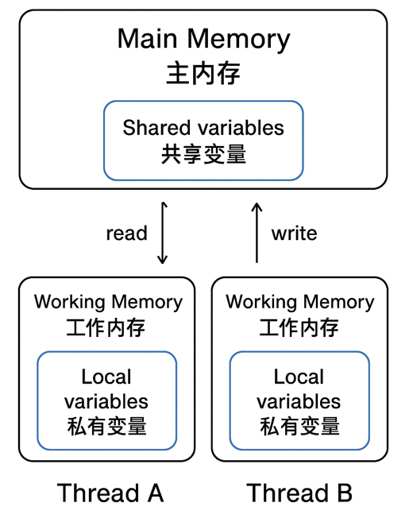
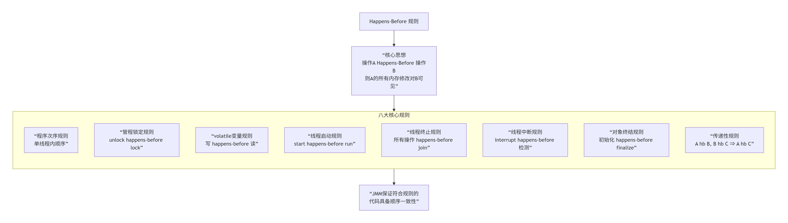
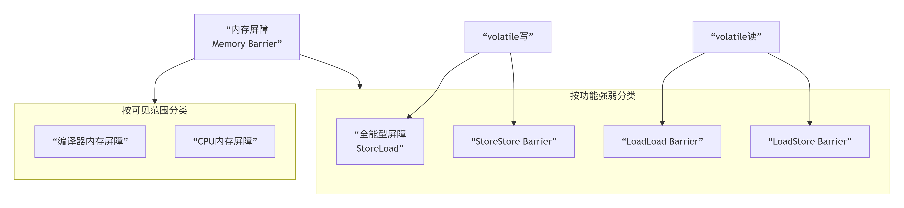
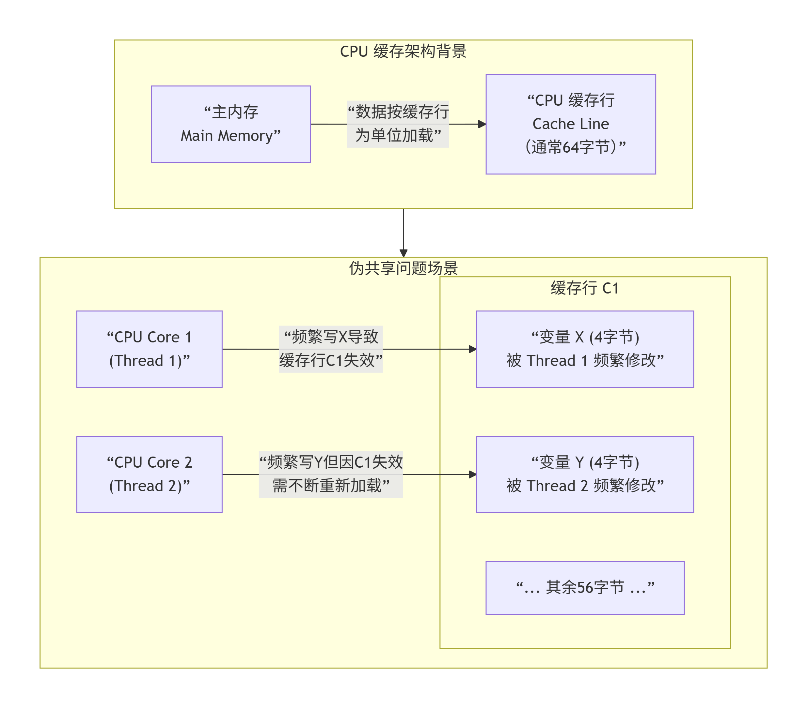

# 内存模型


## 问题思考

###### 请谈谈你对 JMM（Java Memory Model）的理解。

- JMM 是一个**抽象规范**，定义了程序中各个变量的访问规则，屏蔽了底层硬件内存模型的差异。
- 围绕**原子性、可见性、有序性**展开。
- 核心概念：**主内存** 和 **工作内存**。
- 关键关键字：`volatile`、`synchronized`，以及 **happens-before** 原则。


###### JMM 是什么？

**Java 内存模型（JMM）** 是 Java 虚拟机定义的一组**规范（规则）**，用于解决 **多线程共享内存时的数据一致性问题**。

* 变量在 **主内存（Main Memory）** 和 **工作内存（Working Memory）** 中的关系；
* 以及各种同步机制（如 `volatile`、`synchronized`、`final`）如何影响可见性和有序性。

> **JMM 不是实际存在的内存结构**，而是一种**抽象的规范模型**，帮助开发者理解线程与内存交互的行为。


###### JMM内存结构模型

```
┌────────────────────────────────────┐
│             主内存（Main Memory）    │
│  存放所有共享变量（实例字段、静态字段、数组元素）│
└────────────────────────────────────┘
        ▲                 ▲
        │                 │
   read/write         read/write
        │                 │
┌──────────────────┐  ┌──────────────────┐
│ 工作内存（线程A） │  │ 工作内存（线程B） │
│ 保存主内存变量副本 │  │ 保存主内存变量副本 │
└──────────────────┘  └──────────────────┘
```

* **主内存（Main Memory）**：所有线程共享的变量都存储在这里；
* **工作内存（Working Memory）**：每个线程私有，保存主内存中变量的副本；
* **线程之间不直接通信**，必须通过主内存来完成数据共享

- **主内存**：
    - 存储所有共享变量（实例变量、静态变量、数组元素），是所有线程共享的内存区域（对应物理内存的一部分）；
    - 变量的 “真实值” 存储于此，线程对变量的修改最终需同步到主内存才对其他线程可见。
- **工作内存**：
    - 线程私有，每个线程独立拥有（对应 CPU 的寄存器、缓存）；
    - 线程操作变量时，不能直接访问主内存，必须先将变量从主内存**加载**到工作内存，形成 “变量副本”；
    - 线程对变量的所有操作（读、写）都基于工作内存的副本，修改后需通过**存储**、**写入**操作同步回主内存。


###### JMM 是什么？

定义多线程读写共享变量的内存可见性规范。


###### 为什么需要 JMM？

屏蔽底层硬件差异，保证并发语义一致。


###### volatile 的作用？

保证可见性、有序性，不能保证原子性。


###### happens-before 是什么？

判断两个操作的执行顺序与可见性规则。


###### 指令重排是什么？

编译器/CPU 改变执行顺序的优化行为。


###### synchronized 和 volatile 区别？

前者保证原子性+可见性+有序性，后者仅保证可见性+有序性。


###### 为什么需要 JMM？

在多核 CPU + 多级缓存 + 编译器优化的现代计算机中，**并发程序面临三大问题**：

| 问题                     | 原因                                   | 后果                         |
| ------------------------ | -------------------------------------- | ---------------------------- |
| **可见性（Visibility）** | CPU 缓存：线程修改变量后未及时写回主存 | 其他线程读到旧值             |
| **原子性（Atomicity）**  | 非原子操作（如`i++`）被中断            | 结果不符合预期               |
| **有序性（Ordering）**   | 编译器/CPU 重排序优化                  | 程序执行顺序与代码顺序不一致 |

多线程并发时，若没有统一的内存访问规则，会因硬件和编译器的优化导致程序行为不可预测，核心原因有 3 点：

- **CPU 缓存**：为提升效率，CPU 会将主内存数据缓存到 L1/L2/L3 缓存（对应 JMM 的工作内存），线程读取数据时优先从缓存获取，导致不同线程看到的数据不一致（可见性问题）；
- **指令重排序**：编译器和 CPU 为优化执行效率，会在不影响单线程语义的前提下，调整指令执行顺序（有序性问题）；
- **CPU 并行执行**：多线程并行操作共享变量时，操作可能被拆分执行（如 i++ 拆分为 “读 - 改 - 写”），导致结果异常（原子性问题）。

JMM 的核心作用：通过定义内存访问规则（如缓存同步机制、禁止重排序规则），解决上述 3 大问题，让并发程序的执行结果可预测。


###### JMM 与 CPU 缓存的关系

JMM 的模型与现代 CPU 缓存一致：

```
CPU 寄存器 → CPU 缓存（L1/L2/L3）→ 主内存
```

Java 的 JMM 保证在多核 CPU 下的**缓存一致性**，即通过**内存屏障和缓存同步协议（MESI）**确保不同线程看到的变量值一致。


###### JMM的3大核心保障

JMM 通过规范和关键字（volatile、synchronized、final），为并发程序提供 3 大核心保障：

| 保障类型   | 定义                                                         | 问题场景                                            | JMM 解决方案                                                 |
| ---------- | ------------------------------------------------------------ | --------------------------------------------------- | ------------------------------------------------------------ |
| **可见性** | 一个线程修改共享变量后，其他线程能立即看到修改后的结果       | 线程 A 修改 i=1，线程 B 仍读取到 i=0                | volatile（缓存立即同步到主内存）、synchronized（解锁时同步） |
| **原子性** | 一个操作或多个操作要么全部执行且执行过程不被中断，要么全部不执行 | i++（读 - 改 - 写）被拆分，多线程执行后结果小于预期 | synchronized（排他锁）、java.util.concurrent.locks（锁机制） |
| **有序性** | 线程内的操作按代码顺序执行，线程间观察到的操作顺序符合预期   | 编译器重排序导致 “先执行后定义” 的指令              | volatile（禁止重排序）、synchronized（串行执行）             |


###### JMM 与硬件内存模型的关系

JMM 是**抽象模型**，硬件内存模型（CPU 缓存 + 物理内存）是**实际实现**，JMM 通过以下方式适配硬件：

1. **屏蔽硬件差异**：不同 CPU（如 x86、ARM）的缓存一致性协议（如 MESI）不同，JMM 通过定义统一的内存访问规则，让 Java 程序在不同硬件下表现一致；
2. **利用硬件优化**：JMM 不禁止所有重排序和缓存，仅禁止 “会导致并发问题” 的优化，允许编译器和 CPU 在单线程内进行合理优化（如重排序、缓存）；
3. **底层依赖硬件**：JMM 的 volatile、synchronized 最终依赖 CPU 的内存屏障、锁机制（如 CAS）实现。


###### volatile 能保证原子性

volatile**不能保证原子性**，仅能保证可见性和有序性。例如`volatile int i = 0; i++`仍会出现线程安全问题（i++ 是读 - 改 - 写非原子操作）。


###### synchronized 和 volatile 可以混用

无需混用。synchronized 已能保证可见性、原子性、有序性，volatile 的可见性和有序性保障已被 synchronized 覆盖，混用不会额外提升性能，反而可能增加复杂度。


###### JMM 的工作内存就是 CPU 缓存

工作内存是 JMM 的**抽象概念**，对应 CPU 的寄存器、缓存、写缓冲器等，但不等同于 CPU 缓存（工作内存的范围更广）。


###### 先行发生原则意味着 “时间上先执行”

先行发生是**逻辑顺序**，而非物理时间顺序。例如线程 A 的操作 A 在物理时间上后于线程 B 的操作 B，但 A 仍可能先行发生于 B（如通过 volatile 变量传递）。


###### JMM的核心总结

1. 抽象结构：主内存（共享变量）+ 工作内存（线程私有副本），线程操作变量必须通过工作内存；
2. 3 大保障：volatile（可见性 + 有序性）、synchronized（可见性 + 原子性 + 有序性）；
3. 底层实现：volatile 依赖内存屏障，synchronized 依赖锁机制，均适配硬件内存模型；
4. 先行发生原则：无需显式同步时，通过规则保证并发安全。

> - `volatile`：解决可见性和有序性，最轻量级。
> - `synchronized`：解决原子性、可见性和有序性，重量级但功能全面。
> - 原子类：基于 CAS，解决原子性问题。


###### JMM 的核心结构

JMM 规定了所有变量都存储在主内存中。每个线程还有自己的**工作内存**。

- **主内存**：
    - 存储所有**共享变量**。
    - 对应于物理硬件的**主内存（RAM）**。
- **工作内存**：
    - 每个线程**私有**的存储空间。
    - 存储了该线程使用到的变量的**主内存副本**。
    - 线程对变量的所有操作（读、取、赋值）都必须在工作内存中进行，**不能直接读写主内存中的变量**。
    - 对应于 CPU 的**高速缓存（L1, L2, L3 Cache）和寄存器**。

**交互协议**：JMM 通过定义8种原子操作来规定线程、工作内存和主内存之间的交互关系：

- `lock`（锁定）、`unlock`（解锁）、`read`（读取）、`load`（载入）、`use`（使用）、`assign`（赋值）、`store`（存储）、`write`（写入）。


###### synchronized 与 Happens-Before 的关系

synchronized 的解锁操作 happens-before 对同一锁的加锁操作。

**答：**

- 解锁时会将工作内存中的变量刷新到主内存；
- 加锁后会从主内存重新读取；
- 所以加锁线程能看到前一个解锁线程的修改。


###### volatile 如何保证可见性？

> volatile 写 → volatile 读 建立了 Happens-Before 关系。
>
> 写时强制刷新主内存，读时从主内存读取。


###### Happens-Before 与“实际执行顺序”是否一致？

> 不一定。
> Happens-Before 是**逻辑顺序（语义保证）**，实际执行可能乱序，但最终结果必须符合该规则。


###### Happens-Before 是什么？

可见性规则

定义操作间可见性与顺序关系


###### volatile 的 Happens-Before 规则？

volatile 写 → 读

写入先于后续读


###### synchronized 的规则？

解锁 → 加锁

前者先行发生


###### start/join 的关系？

启动/终止可见性

start 先于子线程，join 先于主线程


###### 有 Happens-Before 是否保证原子性？

否

仅保证可见性与顺序性


###### Happens-Before 与 JMM 的关系

JMM 允许编译器和处理器进行优化，但要求它们必须遵守 **Happens-Before** 规则。也就是说，**JMM 为程序员提供的承诺是：只要你的程序遵守了 Happens-Before 规则，那么其执行结果就一定具备顺序一致性（即像没有重排序一样）**。


###### 原子类 VS volatile

| 场景   | volatile        | AtomicInteger                         |
| :----- | :-------------- | :------------------------------------ |
| 可见性 | ✅               | ✅                                     |
| 原子性 | ❌（i++ 非原子） | ✅（CAS 指令）                         |
| 原理   | 内存屏障        | `sun.misc.Unsafe.compareAndSwapInt()` |
| 使用   | 状态标志        | 计数器                                |


###### 锁的内存语义（synchronized / Lock）

- **进入锁** → 隐式 **load-load + load-store** 屏障 ⇒ **刷新工作内存**
- **退出锁** → 隐式 **store-store + store-load** 屏障 ⇒ **同步回主内存**
    ⇒ 因此 **锁既能禁止重排，也能保证可见**


###### volatile 的作用

1. **保证可见性**：写后立即刷新主存，读后立即从主存加载；
2. **禁止重排序**：插入内存屏障（StoreStore + StoreLoad）。


###### volatile 内存屏障（x86）

```java
// volatile 写
store barrier (StoreStore + StoreLoad)

// volatile 读
load barrier (LoadLoad + LoadStore)
```


###### volatile 的适用场景

- **状态标志**：`volatile boolean shutdownRequested;`
- **单次写入的共享变量**：配置参数、单例对象引用；
- **与 synchronized 配合**：DCL 单例模式。

###### 正确的 DCL 单例：

```java
public class Singleton {
    private static volatile Singleton instance;

    public static Singleton getInstance() {
        if (instance == null) { // 第一次检查
            synchronized (Singleton.class) {
                if (instance == null) { // 第二次检查
                    instance = new Singleton(); // volatile 禁止重排序！
                }
            }
        }
        return instance;
    }
}
```

> ⚠️ **没有 volatile 时**：
> `instance = new Singleton()` 可能重排序为： 
>
> 1. 分配内存
> 2. 赋值给 instance（此时对象未初始化！）
> 3. 调用构造函数 → 其他线程可能拿到**未初始化的对象**！

**volatile 作用**：
① 禁止 `INSTANCE = new Singleton()` 指令重排（分配内存→成员初始化→引用赋值）
② 保证 **构造完成** 才对其他线程可见


**1. 内存语义**

- **写内存语义**：当写一个 `volatile` 变量时，JMM 会把该线程对应的本地内存中的共享变量值**刷新到主内存**。
- **读内存语义**：当读一个 `volatile` 变量时，JMM 会把该线程对应的本地内存置为无效，然后从**主内存中读取共享变量**。


**实现机制**

JMM 通过插入**内存屏障**来限制重排序。

- **在每个 `volatile` 写操作的前面插入一个 StoreStore 屏障**。
- **在每个 `volatile` 写操作的后面插入一个 StoreLoad 屏障**。
- **在每个 `volatile` 读操作的后面插入一个 LoadLoad 屏障**。
- **在每个 `volatile` 读操作的后面插入一个 LoadStore 屏障**。


**使用场景**

`volatile` 非常适合用于**状态标志位**，其特点是只有一个线程修改，多个线程读取。

```java
public class ShutdownThread extends Thread {
    private volatile boolean shutdownRequested = false;

    public void shutdown() {
        shutdownRequested = true;
    }

    @Override
    public void run() {
        while (!shutdownRequested) {
            // ... do work
        }
    }
}
```


| 作用   | 说明                               |
| ------ | ---------------------------------- |
| 可见性 | 修改后立刻同步主内存，其他线程可见 |
| 有序性 | 禁止指令重排                       |
| 原子性 | 仅对单次读写操作有效（非复合操作） |

例如：

```java
volatile int count = 0;

void add() {
    count++;  // 非原子操作：read → add → write
}
```

> `volatile` 不能保证 `count++` 的原子性，要用 `AtomicInteger` 或 `synchronized`。


###### synchronized 的内存语义

| 阶段                         | 内存语义                                |
| ---------------------------- | --------------------------------------- |
| 进入同步块                   | 读取共享变量最新值（主内存 → 工作内存） |
| 退出同步块                   | 刷新工作内存变量（工作内存 → 主内存）   |
| 保证原子性 + 可见性 + 有序性 | 全面同步                                |

底层是 **monitorenter / monitorexit** 指令（JVM 内部锁实现）。


`synchronized` 的实现机制与 JMM 紧密相关，它同时保证了**原子性、可见性和有序性**。为了在性能和开销之间取得平衡，HotSpot VM 实现了**锁升级**机制：

1. **偏向锁**：假设只有一个线程会访问同步块。当线程访问时，会在对象头和栈帧中记录偏向的线程ID，以后该线程进入和退出同步块时不需要进行 CAS 操作来加锁和解锁。
2. **轻量级锁**：当有第二个线程尝试获取锁时，偏向锁会升级为轻量级锁。通过**CAS 操作**和**自旋**来尝试获取锁，避免直接进入重量级锁的阻塞。
3. **重量级锁**：当轻量级锁竞争激烈（线程自旋超过一定次数），会升级为重量级锁。此时未获取到锁的线程会**进入阻塞状态**，依赖于操作系统底层的互斥量来实现，开销最大。


`synchronized` 通过**监视器锁（Monitor Lock）** 实现 JMM 保障：

- **进入 synchronized 块**：清空工作内存，从主存加载变量；
- **退出 synchronized 块**：将工作内存变量刷新到主存；
- **隐式遵循监视器锁规则**（unlock hb lock）。

> ✅ **synchronized 同时保证三大特性**：
> 原子性（互斥） + 可见性（刷新主存） + 有序性（禁止重排序）。 


###### 什么是内存屏障？

防止指令重排并保证内存可见性的指令


###### volatile 是怎么实现可见性的？

写入后插入 StoreStore+StoreLoad，读后插入 LoadLoad+LoadStore


###### synchronized 的底层原理？

MonitorEnter/Exit + 屏障指令 + happens-before 语义


###### Happens-Before 和内存屏障的关系？

前者是逻辑语义，后者是物理实现


###### x86 为什么性能好？

因为内存模型天然较强，屏障指令少


###### JMM 与硬件内存模型

JMM 是对**底层硬件内存模型**的抽象：

| 层级        | 模型                   | 特点                     |
| ----------- | ---------------------- | ------------------------ |
| **硬件层**  | x86-TSO, ARM, POWER    | 弱内存模型（允许重排序） |
| **JVM 层**  | JMM                    | 通过内存屏障屏蔽硬件差异 |
| **Java 层** | synchronized, volatile | 提供高层并发语义         |

> ✅ **JMM 的价值**：
> **让 Java 程序员无需关心 CPU 架构差异，写出跨平台的正确并发代码**。


###### JMM 核心要点

| 概念               | 关键说明                                                     |
| ------------------ | ------------------------------------------------------------ |
| **三大问题**       | 可见性、原子性、有序性                                       |
| **三大特性**       | volatile（可见+有序）、synchronized（三者）、final（安全发布） |
| **happens-before** | JMM 的核心规则，定义操作间的先行关系                         |
| **内存屏障**       | volatile/synchronized 的底层实现机制                         |
| **安全发布**       | 正确共享对象的关键（final/volatile/synchronized）            |

> 🧠 **一句话理解 JMM**：
> **“它不是内存结构，而是并发编程的‘交通规则’——规定线程如何安全地共享数据，避免‘内存事故’。**


## JMM简介

JMM（Java Memory Model）是 Java 虚拟机规范定义的**抽象内存模型**，核心目标是解决多线程环境下 “可见性、原子性、有序性” 问题，为并发编程提供统一的内存访问规则 —— 它不直接对应物理硬件内存，而是通过规范线程与内存的交互方式，屏蔽不同硬件、操作系统的内存差异，让 Java 并发程序在不同平台下表现一致。

简单来说：JMM 定义了 “线程如何访问内存”，规定了所有变量（实例变量、静态变量、数组元素）存储在**主内存**，线程操作变量时必须通过**工作内存**（线程私有缓存），且需遵循特定规则（如 volatile 的可见性保证、synchronized 的原子性 + 有序性保证）。

- **目标**：屏蔽掉各种硬件和操作系统的内存访问差异，以实现让 Java 程序在各种平台下都能达到一致的内存访问效果。
- **解决的问题**：
    1. **可见性**：一个线程修改了共享变量的值，其他线程能够**立即看到**这个修改。
    2. **有序性**：程序执行的顺序不一定就是代码编写的顺序。编译器和处理器为了优化性能，可能会对指令进行**重排序**。JMM 确保在特定情况下，这种重排序不会对多线程程序的正确性造成影响。
    3. **原子性**：一个或多个操作，要么全部执行成功，要么全部不执行，不会被打断。


**为什么需要解决这些问题？**

- **硬件差异**：现代计算机系统为了提升性能，普遍采用了**多级缓存**、**多核CPU**，这导致了每个线程可能在自己的工作内存（缓存）中操作数据，而不是直接在主内存中操作，从而引发**可见性**问题。
- **编译器/处理器优化**：指令重排序可以极大提升执行效率，但在多线程环境下，可能导致程序出现与预期不符的行为，即**有序性**问题。


### 结构模型

|  |
| :----------------------------------------------------------: |

| 维度 | JMM 抽象                   | 硬件真实                       | 关系                 |
| ---- | -------------------------- | ------------------------------ | -------------------- |
| 存储 | 主内存（Main Memory）      | 物理内存 / DRAM                | 所有线程共享         |
| 缓存 | 工作内存（Working Memory） | CPU 缓存（L1/L2/L3）+ 写缓冲区 | 线程私有，可缓存副本 |

**结论**：线程对变量的 **所有读写** 都必须经过 **工作内存**；**不能直接操作主内存** ⇒ 可见性问题的根源。


**三大特性**

| 特性   | JMM 保证                     | 实现手段                | 关键字/工具           |
| ------ | ---------------------------- | ----------------------- | --------------------- |
| 原子性 | 基本类型读写、引用读写       | 硬件总线锁 / cache lock | 无需干预              |
| 可见性 | 一个线程修改，另一个立即可见 | **store-load 内存屏障** | `volatile`、锁        |
| 有序性 | 程序顺序 ≠ 执行顺序          | **禁止指令重排**        | `volatile`、锁、final |


### 交互规则

JMM 定义了**线程与主内存之间的抽象关系**：

- **所有变量都存储在主内存（Main Memory）中**；
- **每个线程有自己的工作内存（Working Memory）**；
- **线程对变量的操作（读/写）必须在工作内存中进行**；
- **不同线程无法直接访问对方的工作内存**，必须通过主内存通信。

JMM 明确规定了线程操作变量的 8 种原子操作，确保内存访问的规范性（以下操作均为原子不可拆分）：

1. `lock`   – 主内存地址锁定
2. `unlock` – 解锁
3. `read`   – 主内存 → 工作内存（传输）
4. `load`   – 工作内存 → 线程副本（赋值）
5. `use`    – 线程执行引擎使用变量
6. `assign` – 线程把值赋给变量副本
7. `store`  – 工作内存 → 主内存（传输）
8. `write`  – 主内存写入变量值

| 操作名称         | 作用              | 说明                                                      |
| ---------------- | ----------------- | --------------------------------------------------------- |
| `lock`（锁定）   | 主内存            | 将主内存中的变量标记为 “线程独占”，其他线程无法访问       |
| `unlock`（解锁） | 主内存            | 释放被锁定的变量，允许其他线程锁定                        |
| `read`（读取）   | 主内存→工作内存   | 将主内存的变量值读取到工作内存的 “变量副本”               |
| `load`（加载）   | 工作内存          | 将`read`获取的变量值存入工作内存的变量副本中              |
| `use`（使用）    | 工作内存→执行引擎 | 将工作内存的变量副本值传递给 CPU 执行引擎（如计算、判断） |
| `assign`（赋值） | 执行引擎→工作内存 | 将 CPU 执行引擎的结果赋值给工作内存的变量副本             |
| `store`（存储）  | 工作内存→主内存   | 将工作内存的变量副本值传递到主内存（准备写入）            |
| `write`（写入）  | 主内存            | 将`store`传递的值写入主内存的变量中（覆盖原值）           |

**关键约束（确保规则不被破坏）**

1. 线程对变量执行`use`/`assign`前，必须先执行`read`/`load`（必须先加载变量副本）；
2. 线程对变量执行`store`/`write`前，必须先执行`assign`（只有修改过的变量才需要同步回主内存）；
3. 同一变量同一时间只能被一个线程`lock`，但`lock`可被同一线程多次执行（需对应多次`unlock`）；
4. `unlock`前，必须将变量的修改同步回主内存（`store`/`write`）；
5. 禁止线程 “凭空”`unlock`未`lock`的变量，或`lock`其他线程`lock`的变量。

> **volatile 写**：`assign → store → write` 后插入 **store-load 屏障**
> **volatile 读**：`read → load → use` 前插入 **load-load + load-store 屏障**

💡 举例：

```java
i = 1;
```

对应步骤为：

```
read(i) → load(i) → assign(1) → store(i) → write(i)
```


## 三大并发问题

### 可见性（Visibility） 

**定义**：一个线程修改变量后，其他线程能立即看到最新值。

**问题**：线程A修改了共享变量 `flag` 的值，但线程B可能在一段时间内（甚至永远）读取到的还是旧的 `flag` 值，因为修改还在线程A的工作内存中，未刷新到主内存，而线程B的工作内存中还是旧的副本。

**JMM 解决方案**：

- **`synchronized`**：在释放锁之前，会将工作内存中修改过的变量**同步到主内存**。在获取锁时，会**清空工作内存**，从主内存重新加载变量。
- **`volatile`**：这是最轻量级的可见性解决方案。
    - 当一个变量被声明为 `volatile` 后，**对它的写操作会立即刷新到主内存**。
    - **对它的读操作会从主内存中重新读取**，而不是使用工作内存中的副本。
- **`final`**：被 `final` 修饰的字段，在构造器一旦初始化完成，并且构造器没有把 `this` 的引用传递出去（`this` 引用逃逸），那么其他线程就能看到 `final` 字段的值。

| 机制                     | 原理                                           |
| ------------------------ | ---------------------------------------------- |
| **volatile**             | 写操作后立即刷新到主存，读操作前从主存加载     |
| **synchronized**         | 释放锁前将工作内存变量刷新到主存               |
| **final**                | final 字段在构造函数中初始化后，对其他线程可见 |
| **java.util.concurrent** | 基于 volatile/CAS 实现                         |


#### 可见性问题举例

```java
public class VisibilityExample {
    private static boolean flag = false;

    public static void main(String[] args) throws InterruptedException {
        new Thread(() -> {
            while (!flag) { } // 期望 flag=true 时退出
            System.out.println("Exit!");
        }).start();

        Thread.sleep(1000);
        flag = true; // 主线程修改 flag
        System.out.println("Set flag to true");
    }
}
```

**现象**：程序可能**永远不退出**！
**原因**：子线程的 `flag` 读取可能来自**本地缓存**，而非主存。


#### 解决方案

###### volatile 关键字

- 线程修改 volatile 变量后，会立即执行`store`/`write`操作，将修改同步回主内存；
- 线程读取 volatile 变量前，会立即执行`read`/`load`操作，从主内存加载最新值（清空工作内存的旧副本）；
- 禁止对该变量的指令重排（保证有序性）。
- 本质：禁止 volatile 变量的工作内存副本与主内存不一致，强制缓存可见。

> volatile 不能保证原子性！ 


###### synchronized 关键字

- 线程进入`synchronized`代码块（`lock`操作）时，会清空工作内存的变量副本，需从主内存重新加载；
- 线程退出`synchronized`代码块（`unlock`操作）时，会将工作内存的变量修改同步回主内存；
- 本质：通过 “排他锁 + 同步机制” 保证同一时间只有一个线程操作变量，且修改立即可见。


### 原子性（Atomicity）

#### 问题本质

**定义**：一个操作不可中断，要么全部执行，要么都不执行。

**问题**：Java 中即使是简单的 `count++` 操作，在底层也是由多条指令完成的（读取、增加、存储），在多线程环境下可能被中断，导致结果不符预期。

**JMM 保证**：

- 对基本数据类型（除 `long` 和 `double` 外）的读写操作是原子的。
- 对于 `long` 和 `double` 的非原子性协定：允许虚拟机将64位数据的读写操作划分为两次32位的操作，但这在商用JVM中已基本不会发生。

```java
/ 非原子操作
i++; // 等价于：read i → i+1 → write i

// 原子操作
AtomicInteger atomicI = new AtomicInteger(0);
atomicI.incrementAndGet(); // CAS 保证原子性
```

> * **long/double 的特殊性**：64 位 JVM 中，`long`/`double` 的读写也是原子的（JVM 规范要求）。
> * 复合操作（如 `i++`）不是原子的。

**  AL**

- 使用 `synchronized` 关键字（ monitorenter/monitorexit 指令）。
- 使用 `java.util.concurrent.atomic` 包下的原子类（如 `AtomicInteger`，基于 CAS 操作）。


#### 解决方案

###### synchronized 关键字

- 提供 “排他锁”：同一时间只有一个线程能进入`synchronized`代码块，其他线程阻塞；
- 保证代码块内的所有操作构成一个原子整体（要么全执行，要么全不执行）。

###### Lock 接口

- 与`synchronized`功能类似，但提供更灵活的锁控制（如可中断锁、公平锁），同样保证原子性。

###### 原子类

如 `AtomicInteger`，基于 CAS 操作


### 有序性（Ordering）

**什么是指令重排**

*问题来源*

为了优化性能，编译器或 CPU 可能改变指令执行顺序，但逻辑上仍然正确。

例如：

```java
int a = 0;
boolean flag = false;

a = 1;          // ①
flag = true;    // ②
```

可能在 CPU 层面变为：

```java
flag = true;   // ②
a = 1;         // ①
```

*解决方案*

`volatile`、`synchronized`、内存屏障等机制能阻止这种重排。


#### 问题本质

编译器或 CPU 为优化效率，会重排序代码指令（如 “先执行后定义” 的指令），单线程下无影响，但多线程下会导致执行顺序混乱。

- **问题**：为了优化性能，编译器和处理器可能会对指令进行**重排序**。

```java
// 初始状态
int a = 0;
boolean flag = false;

// 线程A执行
a = 1;          // 语句1
flag = true;    // 语句2

// 线程B执行
if (flag) {     // 语句3
    int i = a; // 语句4
}
```

由于重排序，线程A可能先执行 `语句2`，再执行 `语句1`。如果此时线程B在 `语句2` 执行后、`语句1` 执行前检查 `flag`，就会读到 `a` 的旧值 `0`，导致错误。

- **定义**：程序执行顺序与代码顺序一致。

- **重排序类型**：

| 类型                 | 说明                     | 是否影响单线程 |
| -------------------- | ------------------------ | -------------- |
| **编译器重排序**     | 编译期优化（如指令重排） | 否             |
| **指令级并行重排序** | CPU 指令并行执行         | 否             |
| **内存系统重排序**   | 缓存/总线导致写操作乱序  | 是（多线程）   |

- **JMM 如何禁止重排序**？

    - **内存屏障（Memory Barrier）**：CPU 指令，阻止屏障前后的指令重排序；
    - **happens-before 规则**：JMM 的高层抽象。

**JMM 解决方案：内存屏障**

- JMM 通过插入**内存屏障**指令来禁止特定类型的处理器重排序。
- **`volatile`**：对 `volatile` 变量的写操作，会在写后插入一个**写屏障**，确保之前的操作都对其他线程可见。对 `volatile` 变量的读操作，会在读前插入一个**读屏障**，确保之后的操作都能读到最新的值。
- **`synchronized`**：一个变量在同一时刻只允许一条线程对其进行 `lock` 操作。这个规则决定了持有同一个锁的两个同步块只能**串行**地进入，从而保证了有序性。


#### 重排序示例（单线程无影响，多线程有问题）

```java
// 单线程下，编译器可能重排序为：a=1 → flag=true → b=2（不影响结果）
int a = 0, b = 0;
boolean flag = false;

// 线程A
a = 1;      // 操作1
flag = true; // 操作2

// 线程B
if (flag) { // 操作3
    System.out.println(a + b); // 可能输出1（b未赋值），而非3
}
b = 2;      // 操作4
```

> 重排序后可能的执行顺序：线程 A 执行`flag=true`（操作 2）→ 线程 B 执行`if(flag)`（操作 3）→ 线程 B 输出`a+b=1+0=1` → 线程 A 执行`a=1`（操作 1）→ 线程 B 执行`b=2`（操作 4），导致结果异常。


#### 解决方案

###### volatile 关键字

- 禁止 volatile 变量前后的指令重排序（通过 “内存屏障” 实现）；
- volatile 变量的写操作**先行发生于**后续的读操作（JMM 的先行发生原则）。


###### synchronized 关键字

- 同一时间只有一个线程进入`synchronized`代码块，代码块内的指令按顺序执行（串行化），避免重排序导致的混乱。


## final关键字与JMM

`final` 字段在 JMM 中有特殊语义：

- **final 字段的写入 hb 对象引用的写入**；
- **其他线程读取对象引用时，能保证看到 final 字段的正确值**。

```java
public class FinalExample {
    final int x;
    int y;
    static FinalExample obj;

    public FinalExample() {
        x = 1; // final 写入
        y = 2; // 普通写入
    }

    public static void writer() {
        obj = new FinalExample(); // 对象引用写入
    }

    public static void reader() {
        FinalExample f = obj;
        if (f != null) {
            int i = f.x; // 保证看到 x=1
            int j = f.y; // 可能看到 y=0（未初始化值）！
        }
    }
}
```

>  **安全发布（Safe Publication）**：通过 `final`、`volatile`、`synchronized` 或 `java.util.concurrent` 容器发布对象。 


## Happens-Before规则

### Happens-Before 是什么？

什么是 Happens-Before（HB）

**JSR-133 定义**：如果操作 A 对操作 B 存在 Happens-Before 关系，那么 **A 的执行结果（写入变量、释放锁等）对 B 可见**，且 **A 的执行顺序排在 B 之前**（禁止重排）。
**本质**：JMM 向程序员提供的 **可见性 + 有序性** 契约，**与 CPU 架构无关**。


**Happens-Before（先行发生）规则** 是 Java 内存模型（JMM）的**核心机制**，它定义了多线程环境下操作之间的**可见性与顺序性**。

> **如果操作 A Happens-Before 操作 B，那么 A 的执行结果对 B 可见，且 A 的执行顺序在 B 之前。** 


如果操作 A **Happens-Before** 操作 B，那么 A 操作所产生的所有**内存修改**（写操作）对 B 操作来说都是**可见的**，并且 A 操作按顺序排在 B 操作之前。

Happens-Before 关系向 Java 程序员提供了一个**强大的内存可见性保证**。它的存在是为了在**严格的顺序一致性模型**（性能极差）和**松散的物理硬件内存模型**（存在重排序和可见性问题）之间找到一个平衡点。

> **只要你的程序遵守了 Happens-Before 规则，那么其执行结果就一定与在顺序一致性内存模型中执行的结果相同。** 你无需关心底层复杂的重排序和缓存同步问题，JMM 会为你搞定这一切。


**Happens-Before 不等于时间上的先后**

Happens-Before 强调的是**内存可见性的保证**，而不是时间上的先后顺序。

- 如果 A Happens-Before B，**并不一定**意味着 A 在时间上先于 B 执行完成。
- 但它**一定**意味着，当 B 操作执行时，它一定能看到 A 操作所产生的所有内存影响。


**Happens-Before（先行发生）** 是 **Java 内存模型（JMM）** 用来描述**操作之间可见性与有序性**的一种规则体系。

如果操作 A *happens-before* 操作 B，那么在 **A 的结果对 B 可见**，并且 **A 的执行顺序在 B 之前**。

但反之并不一定成立：即 “A happens-before B” ≠ “B happens-before A”。


| 编号 | 口诀           | 官方描述                                        | 典型代码片段                              |
| :--- | :------------- | :---------------------------------------------- | :---------------------------------------- |
| ①    | 程序次序       | 单线程内，**控制流顺序**前面操作 HB 于后面      | `a=1; b=a;` 不允许重排为 `b=a; a=1`       |
| ②    | 解锁→加锁      | `unlock` HB 于后续对**同一把锁**的 `lock`       | `synchronized(obj){...}` 退出后进入下一个 |
| ③    | volatile 写→读 | `volatile` 写 HB 于后续对该变量的**任意读**     | `v=true` HB 于 `if(v)`                    |
| ④    | 线程启动       | `Thread.start()` HB 于新线程**所有动作**        | `t.start()` HB 于 `t.run()`               |
| ⑤    | 线程终止       | 线程 B 所有操作 HB 于 `B.join()` 成功返回       | `B.join()` 返回后能看到 B 的全部结果      |
| ⑥    | 中断           | `t.interrupt()` HB 于被中断线程检测到中断       | `Thread.interrupted()` 返回 true          |
| ⑦    | 终结           | 对象构造函数 **finish** HB 于 `finalize()` 开始 | `new T()` HB 于 `T.finalize()`            |
| ⑧    | 传递性         | A HB B，B HB C ⇒ A HB C                         | 组合推导，**跨规则桥梁**                  |


关键本质

- **逻辑顺序≠物理顺序**：Happens-Before 是 JMM 定义的 “逻辑顺序”，而非 CPU 执行的 “物理时间顺序”。例如：线程 A 的操作在物理时间上后于线程 B，但 A 仍可能 Happens-Before B（如通过 volatile 传递）。
- **可见性 + 有序性保障**：Happens-Before 规则同时保证 “可见性”（A 的修改对 B 可见）和 “有序性”（A 不会被重排序到 B 之后）。
- **原子性不直接保障**：Happens-Before 仅定义顺序和可见性，原子性需依赖锁（synchronized/Lock）或原子类（AtomicXXX）。


传递性实战（面试连环问）

```java
int a = 0;
volatile boolean flag = false;

// 线程 A
a = 1;        // ①
flag = true;  // ②  volatile 写

// 线程 B
if (flag) {   // ③  volatile 读
    int i = a;// ④
}
```

推导链：**① HB ②**（程序次序） → **② HB ③**（volatile 写→读） → **③ HB ④**（程序次序）⇒ **① HB ④**（传递性） ⇒ **i 一定能读到 1** 


与 CPU 屏障的映射（HotSpot C++ 源码级）

| HB 规则           | 插入屏障（x86 示例）    | HotSpot 宏                 |
| :---------------- | :---------------------- | :------------------------- |
| volatile 写       | `lock addl $0, 0(%rsp)` | `OrderAccess::storeload()` |
| volatile 读       | `lfence`（可选）        | `OrderAccess::loadload()`  |
| synchronized 退出 | `lock addl`             | `release()`                |
| synchronized 进入 | 无（x86 锁自带）        | `acquire()`                |

> **结论**：HB 是 **规范**，屏障是 **实现**；**不同 CPU 架构插入指令不同，但 HB 语义一致**。


锁的 HB 全景（synchronized / Lock）

```java
synchronized(lock){
    // 临界区
}
```

- **进入锁** ⇒ **acquire 屏障** ⇒ **刷新工作内存**（拿到最新）
- **退出锁** ⇒ **release 屏障** ⇒ **同步回主内存**（别人立即可见）
    ⇒ **因此锁既能禁止重排，也能保证可见**


常见问题

| 误区                            | 反例                            | 正确                      |
| :------------------------------ | :------------------------------ | :------------------------ |
| **锁不是同一个对象**            | `synchronized(new Object())`    | 必须**同一个对象引用**    |
| **volatile 仅保证变量本身可见** | `volatile boolean flag; int a;` | **a 仍需 volatile 或锁**  |
| **join() 失败不算**             | `join(10)` 超时返回             | **只有正常返回**才保证 HB |


只要操作 A happens-before 操作 B，JMM 就保证：

1. A 的执行结果对 B 可见；
2. A 的执行顺序在 B 之前（语义上）。


### 为什么需要 Happens-Before？

在多线程环境中，由于：

- **编译器优化**（指令重排序）
- **CPU 乱序执行**
- **CPU 缓存不一致**

导致**代码顺序 ≠ 执行顺序**，引发可见性与有序性问题。


**没有 Happens-Before 的灾难**

```java
// 线程 A
context = new Context(); // 1
ready = true;            // 2

// 线程 B
if (ready) {             // 3
    use(context);        // 4
}
```

**问题**：

- 操作 1 和 2 可能重排序 → `ready = true` 先执行；
- 操作 3 和 4 无依赖 → `use(context)` 可能读到未初始化的 `context`。

> **Happens-Before 的作用**：**建立操作间的“因果关系”，确保关键操作的顺序与可见性**。 


JMM 屏蔽了底层 CPU 缓存和指令重排的复杂性。编译器、CPU 可能会改变代码执行顺序（只要不影响单线程语义）。

为此，JMM 提出了一组**可见性和有序性的判定规则**——让开发者判断：“线程 B 是否能看到线程 A 的修改？”


### 如何正确使用 Happens-Before 规则？

1. **判断并发安全的核心步骤**：
    - 明确多线程间的操作关系；
    - 检查是否满足上述 Happens-Before 规则；
    - 若满足，则操作安全（可见性、有序性）；若不满足，则需添加同步机制（volatile/synchronized）。
2. **开发中的实践建议**：
    - 优先使用基础规则（如 volatile 规则、管程锁定规则），避免复杂推导；
    - 若需传递性推导，需明确每一步的基础规则（如程序次序、volatile 等）；
    - 避免依赖 “物理时间顺序” 判断可见性，必须通过 Happens-Before 规则验证。

总结

Happens-Before 规则是 JMM 并发安全的 “判断基石”，核心要点可归纳为：

1. 核心定义：逻辑上的先行关系，保证可见性和有序性，不直接保证原子性；
2. 6 条核心规则：程序次序、管程锁定、volatile 变量、线程启动、线程终止、传递性（可推导所有场景）；
3. 衍生规则：线程中断、final 字段（高频实用）；
4. 应用场景：验证同步机制（volatile/synchronized）的安全性、判断无同步代码的并发风险。


### 八大规则

JMM 定义了 **8 条 Happens-Before 规则**，分为**单线程规则**和**多线程同步规则**。

|  |
| :----------------------------------------------------------: |

| #    | 规则名称              | 含义                                                         | 举例                                                  |
| ---- | --------------------- | ------------------------------------------------------------ | ----------------------------------------------------- |
| 1️⃣    | **程序次序规则**      | 同一线程内，代码按照书写顺序执行（语义上）                   | 线程 A 中：`x=1; y=2;` → 先发生于 `y=2`               |
| 2️⃣    | **监视器锁定规则**    | 对同一锁的解锁（unlock）先行发生于后续加锁（lock）           | A 执行 `synchronized(lock){}` 结束 → B 获取同一锁之前 |
| 3️⃣    | **volatile 变量规则** | 对 volatile 变量的写先行发生于后续对该变量的读               | `volatile int v`：A 写 v=1 → B 读 v==1                |
| 4️⃣    | **线程启动规则**      | Thread.start() 先行发生于启动线程中的任何操作                | 主线程调用 `t.start()` → 子线程 run() 内操作          |
| 5️⃣    | **线程终止规则**      | 线程内的所有操作先行发生于该线程终止检测（join/isAlive）     | t.run() 完成 → 主线程 join() 返回                     |
| 6️⃣    | **线程中断规则**      | 调用 interrupt() 先行发生于线程检测到中断事件                | A 调用 `t.interrupt()` → B 检测 `isInterrupted()`     |
| 7️⃣    | **对象终结规则**      | 对象的构造完成先行发生于 finalize() 方法执行                 | 构造函数完成 → finalize() 执行                        |
| 8️⃣    | **传递性规则**        | 若 A happens-before B，B happens-before C，则 A happens-before C | transitivity：A→B, B→C ⇒ A→C                          |


| 规则              | 场景                                                    | 示例                                |
| ----------------- | ------------------------------------------------------- | ----------------------------------- |
| 程序顺序          | 单线程内每个操作 hb 于后续操作                          | `x=1; y=x;` 不允许重排为 `y=x; x=1` |
| 解锁先于加锁      | 监视器解锁 hb 于后续加锁                                | `unlock M → lock M`                 |
| volatile 写先于读 | volatile 写 hb 于后续任意读                             | `v=true` hb 于 `if(v)`              |
| 线程启动          | `Thread.start()` hb 于新线程所有动作                    | `t.start()` hb 于 `t.run()`         |
| 线程终结          | 线程所有操作 hb 于 `join()/isAlive()` 成功返回          | `t.join()` 返回后能看到线程内结果   |
| 中断              | `interrupt()` hb 于检测到中断（`InterruptedException`） | ——                                  |
| 终结              | 对象构造函数完成 hb 于 `finalize()`                     | ——                                  |
| 传递性            | A hb B，B hb C ⇒ A hb C                                 | 组合推导                            |

> **面试金句**：**如果 A happens-before B，则 A 的结果对 B 可见，且执行顺序受约束**。


#### 1 程序顺序规则（Program Order Rule）

- **规则**：在**一个线程内**，按照控制流顺序，书写在前面的操作 Happens-Before 书写在后面的操作。

- **注意**：这里说的是**控制流顺序**，不是代码顺序。因为要考虑分支、循环等结构。

```java
public void test() {
    int a = 1; // 操作A
    int b = a + 2; // 操作B
    System.out.println(b); // 操作C
}
```

- 推导：A Happens-Before B，B Happens-Before C → A Happens-Before C；
- 结论：操作 A 的结果（a=1）对 B、C 可见，且 A 不会被重排序到 B/C 之后。

> ⚠️ **注意**：此规则**仅保证单线程内**的顺序，**不保证多线程间**的可见性！ 


#### 2 管程锁定规则（Monitor Lock Rule）/监视器锁规则（Monitor Lock Rule）

- **规则**：一个对锁的 `unlock` 操作 Happens-Before 后面对**同一个锁**的 `lock` 操作。
    - 锁必须是**同一把**（如同一 Object 锁、同一 ReentrantLock 实例）

    - 解锁时会将工作内存的修改同步到主内存，加锁时会清空工作内存缓存并从主内存加载最新值（保证可见性）

- **理解**：这个规则是 `synchronized` 关键字能够保证可见性的根本原因。

```java
private final Object lock = new Object();
private int x = 0;

// 线程A
new Thread(() -> {
    synchronized (lock) { // 加锁
        x = 1; // 操作A（修改）
    } // 解锁（操作B）
}).start();

// 线程B
new Thread(() -> {
    synchronized (lock) { // 加锁（操作C）
        System.out.println(x); // 操作D（读取）
    } // 解锁
}).start();
```

- 推导：B（解锁）Happens-Before C（加锁），A Happens-Before B（程序次序规则），C Happens-Before D（程序次序规则）→ A Happens-Before D；
- 结论：线程 A 对 x 的修改（x=1）对线程 B 可见，线程 B 必然输出 1。

> ✅ **synchronized 同时保证**：原子性（互斥） + 可见性（hb 规则） + 有序性（禁止重排序）。 


#### 3 volatile 变量规则（Volatile Variable Rule）

- **规则**：对一个 `volatile` 变量的**写**操作 Happens-Before 后面对这个变量的**读**操作。
    - 仅适用于**同一 volatile 变量**

    - 写操作会强制将修改同步到主内存，读操作会强制从主内存加载最新值（可见性）

    - 写操作禁止后续读操作重排序到其之前，读操作禁止之前的写操作重排序到其之后（有序性）

- **理解**：这是 `volatile` 关键字保证可见性的直接体现。

```java
private volatile boolean flag = false;
private int x = 0;

// 线程A
new Thread(() -> {
    x = 1; // 操作A
    flag = true; // 操作B（volatile写）
}).start();

// 线程B
new Thread(() -> {
    if (flag) { // 操作C（volatile读）
        System.out.println(x); // 操作D，必然输出1
    }
}).start();
```

- 推导：A Happens-Before B（程序次序规则），B Happens-Before C（volatile 规则），C Happens-Before D（程序次序规则）→ A Happens-Before D；
- 结论：线程 A 对 x 的修改（x=1）通过 volatile 变量 flag 的 “写 - 读” 传递，对线程 B 可见。

> 💡 **这是 DCL 单例模式正确性的关键**！ 


#### 4 线程启动规则（Thread Start Rule）

* **规则**：`Thread` 对象的 `start()` 方法调用 Happens-Before 此线程的每一个动作（即 `run()` 方法中的操作）。
    * 主线程在 `start()` 前对共享变量的修改，子线程启动后均可看到
    * 反之，子线程启动后对共享变量的修改，主线程若未通过同步机制（如 join），则不保证可见。

```java
private int x = 0;

public static void main(String[] args) {
    x = 1; // 操作A
    Thread t = new Thread(() -> {
        System.out.println(x); // 操作B，必然输出1
    });
    t.start(); // 操作C（启动子线程）
}
```

- 推导：A Happens-Before C（程序次序规则），C Happens-Before B（线程启动规则）→ A Happens-Before B；
- 结论：主线程在 `start()` 前对 x 的修改（x=1），子线程内可见。


#### 5 线程终止规则（Thread Join Rule）

* **规则**：线程中的所有操作都 Happens-Before 对此线程的终止检测（如 `Thread.join()` 方法返回，或 `Thread.isAlive()` 返回 `false`）。
    * 子线程终止前对共享变量的修改，主线程通过 `join()` 等方式等待子线程结束后，均可看到
    * 若主线程未等待子线程终止，直接读取共享变量，则不保证可见。

```java
private int x = 0;

public static void main(String[] args) throws InterruptedException {
    Thread t = new Thread(() -> {
        x = 1; // 操作A（子线程修改）
    });
    t.start();
    t.join(); // 操作B（主线程等待子线程终止）
    System.out.println(x); // 操作C，必然输出1
}
```

- 推导：A Happens-Before B（线程终止规则），B Happens-Before C（程序次序规则）→ A Happens-Before C；
- 结论：子线程对 x 的修改（x=1），主线程在 `join()` 后可见。


#### 6 线程中断规则（Thread Interruption Rule）

* **规则**：对线程 `interrupt()` 方法的调用 Happens-Before 被中断线程的代码检测到中断事件的发生（即通过 `Thread.interrupted()` 或 `isInterrupted()` 方法检测到中断）。

```java
Thread t = new Thread(() -> {
    while (!Thread.currentThread().isInterrupted()) {
        // work
    }
});
t.start();
t.interrupt(); // A
```

- A hb `isInterrupted()` 返回 true → **中断状态对线程可见**。


#### 7  对象终结规则（Finalizer Rule）

**规则**：一个对象的初始化完成（构造器执行结束） Happens-Before 它的 `finalize()` 方法的开始。

```java
public class FinalizeExample {
    int x = 0;
    
    public FinalizeExample() {
        x = 1; // A
    }
    
    @Override
    protected void finalize() {
        System.out.println(x); // B
    }
}
```

- A hb B → **finalize() 中 x=1**。

> ⚠️ **注意**：`finalize()` 已废弃（JDK 9+），不推荐使用。 


#### 8 传递性（Transitivity）

- **规则**：如果 A Happens-Before B，且 B Happens-Before C，那么 A Happens-Before C。
    - 是推导复杂场景 Happens-Before 关系的关键规则
    - 需基于前 5 条基础规则，通过传递性扩展到更多操作。
- **重要性**：这是最强大的规则之一，它允许我们将多个简单的 Happens-Before 关系组合起来，证明更复杂的可见性保证。

```java
private volatile int x = 0;
private int y = 0;
private int z = 0;

// 线程A
y = 1; // A1
x = 1; // A2（volatile写）

// 线程B
if (x == 1) { // B1（volatile读）
    z = y; // B2
}

// 线程C
System.out.println(z); // C1
```

- 推导：A1 Happens-Before A2（程序次序）→ A2 Happens-Before B1（volatile 规则）→ B1 Happens-Before B2（程序次序）→ B2 Happens-Before C1（假设线程 C 等待 B 执行完）→ A1 Happens-Before C1；
- 结论：线程 A 对 y 的修改（y=1），通过传递性对线程 C 可见，z 最终为 1。


#### final 字段规则（Final Field Rule）

* **规则**：对象的构造函数中对 final 字段的赋值操作，Happens-Before 该对象被其他线程可见（如通过 `new` 创建对象后，其他线程读取该 final 字段）。
    * inal 字段一旦在构造函数中赋值完成，且对象引用未逸出（未在构造函数中暴露 this 引用），则其他线程看到的 final 字段必然是构造函数中赋值的最终值；
    * 避免了 final 字段被重排序导致的 “部分初始化” 问题。

```java
class FinalDemo {
    final int x; // final字段
    public FinalDemo() {
        x = 1; // 构造函数赋值（操作A）
    }
}

// 主线程
FinalDemo demo = new FinalDemo(); // 操作B（对象创建完成）

// 线程A
new Thread(() -> {
    System.out.println(demo.x); // 操作C，必然输出1
}).start();
```

- 推导：A Happens-Before B（程序次序规则），B Happens-Before C（线程启动规则 + 传递性）→ A Happens-Before C；
- 结论：线程 A 看到的 demo.x 必然是构造函数中赋值的 1，不会出现 0（默认值）。


### 实战应用

#### Double-Checked Locking（DCL）单例

```java
public class Singleton {
    private static volatile Singleton instance; // 关键：volatile

    public static Singleton getInstance() {
        if (instance == null) { // 1st check
            synchronized (Singleton.class) {
                if (instance == null) { // 2nd check
                    instance = new Singleton(); // A
                }
            }
        }
        return instance; // B
    }
}
```

**为什么需要 volatile**？

- instance = new Singleton()分三步：
    1. 分配内存
    2. 调用构造函数
    3. 赋值给 `instance`

- **无 volatile 时**：步骤 2 和 3 可能重排序 → 其他线程拿到**未初始化对象**；

- 有 volatile 时：

    - A（volatile write）hb B（volatile read）；
    - 保证构造函数（步骤 2）在赋值（步骤 3）前完成。


#### 安全发布（Safe Publication）

```java
// 错误：无同步
Context context;
boolean ready = false;

// 线程 A
context = new Context(); // A
ready = true;            // B

// 线程 B
if (ready) {             // C
    use(context);        // D
}
```

**问题**：A 与 D 无 hb 关系 → `context` 可能未初始化。

**正确方案 1：volatile**

```java
volatile boolean ready = false; // B hb C ⇒ A hb D
```

**正确方案 2：synchronized**

```java
// 线程 A
synchronized (lock) {
    context = new Context(); // A
    ready = true;            // B
}

// 线程 B
synchronized (lock) {
    if (ready) {             // C
        use(context);        // D
    }
}
// B（unlock）hb C（lock） ⇒ A hb D
```


#### 缺乏同步的共享变量

```java
public class NoVisibility {
    private static boolean ready = false;
    private static int number = 0;

    private static class ReaderThread extends Thread {
        public void run() {
            while (!ready) {
                // 可能一直循环下去!
            }
            System.out.println(number); // 可能输出 0!
        }
    }

    public static void main(String[] args) {
        new ReaderThread().start();
        number = 42;    // 操作 A
        ready = true;   // 操作 B
    }
}
```

**问题分析**：

- 主线程和 `ReaderThread` 之间**没有任何同步机制**。
- 因此，主线程中的操作 A 和 B 与 `ReaderThread` 中的操作之间**不存在任何的 Happens-Before 关系**。
- 导致的结果可能是：
    1. `ReaderThread` 可能永远看不到 `ready` 被改为 `true`，导致死循环。
    2. `ReaderThread` 可能看到了 `ready` 为 `true`，但却没有看到 `number = 42`，从而输出 `0`。


**利用 Happens-Before 规则**

使用 **volatile 变量规则** 来修复这个问题。

```java
public class VisibilityFixed {
    private static volatile boolean ready = false; // 使用 volatile
    private static int number = 0;

    private static class ReaderThread extends Thread {
        public void run() {
            while (!ready) {
                // ...
            }
            System.out.println(number); // 保证输出 42
        }
    }

    public static void main(String[] args) {
        new ReaderThread().start();
        number = 42;    // 操作 A
        ready = true;   // 操作 B: volatile 写
    }
}
```

**Happens-Before 关系推理**：

1. 根据**程序次序规则**：A Happens-Before B。
2. 根据 **volatile 变量规则**：B (volatile写) Happens-Before `ReaderThread` 中对 `ready` 的读操作（在循环中）。
3. 根据**程序次序规则**（在线程内），对 `ready` 的读操作 Happens-Before 打印 `number` 的操作。
4. 根据**传递性**：A Happens-Before 打印 `number` 的操作。

因此，`ReaderThread` 在退出循环后，一定能看到 `number = 42`。


#### 验证 volatile 的可见性与有序性

通过 volatile 变量规则 + 传递性，可验证 volatile 如何保证多线程间的可见性和有序性：

```java
private volatile boolean ready = false;
private int data = 0;

// 线程A：初始化数据
new Thread(() -> {
    data = 100; // A1
    ready = true; // A2（volatile写）
}).start();

// 线程B：读取数据
new Thread(() -> {
    while (!ready) {} // B1（volatile读）
    System.out.println(data); // B2，必然输出100
}).start();
```

- 推导：A1 Happens-Before A2（程序次序）→ A2 Happens-Before B1（volatile 规则）→ B1 Happens-Before B2（程序次序）→ A1 Happens-Before B2；
- 结论：data 的修改对 B 可见，且 A1 不会被重排序到 A2 之后（避免 B1 看到 ready=true 但 data=0）。


#### 验证 synchronized 的并发安全

通过管程锁定规则 + 传递性，可解释 synchronized 为何能保证原子性、可见性、有序性

```java
private final Object lock = new Object();
private int count = 0;

// 线程A
new Thread(() -> {
    synchronized (lock) { // 加锁C1
        count++; // A1（原子操作）
    } // 解锁U1
}).start();

// 线程B
new Thread(() -> {
    synchronized (lock) { // 加锁C2
        System.out.println(count); // B1，必然输出1
    } // 解锁U2
}).start();
```

- 推导：A1 Happens-Before U1（程序次序）→ U1 Happens-Before C2（管程锁定规则）→ C2 Happens-Before B1（程序次序）→ A1 Happens-Before B1；
- 结论：A1 的修改对 B1 可见，且同一时间只有一个线程进入同步块（原子性）。


#### 判断无同步代码的并发安全性

若操作不满足任何 Happens-Before 规则，则 JMM 不保证并发安全，可能出现可见性或有序性问题：

```java
private boolean ready = false;
private int data = 0;

// 线程A
new Thread(() -> {
    data = 100; // A1
    ready = true; // A2
}).start();

// 线程B
new Thread(() -> {
    if (ready) { // B1
        System.out.println(data); // 可能输出0（A1未被B1看到）
    }
}).start();
```

- 分析：A2 与 B1 无任何 Happens-Before 关系（无锁、无 volatile、无线程启动 / 终止）；
- 问题：A1 可能被重排序到 A2 之后，或 A1 的修改未同步到主内存，导致 B1 看到 ready=true 但 data=0。


### Happens-Before与内存屏障

Happens-Before 是**高层抽象**，底层通过**内存屏障（Memory Barrier）** 实现：

| 同步机制                | 内存屏障               |
| ----------------------- | ---------------------- |
| **volatile write**      | StoreStore + StoreLoad |
| **volatile read**       | LoadLoad + LoadStore   |
| **synchronized unlock** | StoreLoad              |
| **synchronized lock**   | LoadLoad + LoadStore   |

> 💡 **内存屏障作用**： 
>
> - 禁止屏障前后的指令重排序；
> - 强制刷新缓存/失效缓存。


在 JVM 层面，Happens-Before 规则是通过**内存屏障**实现的。

| 规则                | 内存屏障实现           | 作用                              |
| ------------------- | ---------------------- | --------------------------------- |
| volatile 写         | StoreStore + StoreLoad | 禁止写后重排，刷新缓存            |
| volatile 读         | LoadLoad + LoadStore   | 禁止读前重排，强制从主内存读      |
| synchronized        | Lock/Unlock 隐式屏障   | 进入/退出同步块时刷新或读取主内存 |
| Thread.start / join | StoreLoad              | 保证线程创建与终止的可见性        |


### 实践总结

#### 常见误区

###### 误区 1：Happens-Before = 代码顺序

> **错误**！Happens-Before 是**逻辑顺序**，不是代码顺序。
> 例如：`volatile write` hb `volatile read`，但代码中 write 可能在 read 之后。 


###### 误区 2：Happens-Before 保证原子性

> **错误**！Happens-Before **只保证可见性与顺序性**，不保证原子性。
> 例如：`volatile int count; count++;` 仍可能丢失更新。 


###### 误区 3：synchronized 只保证临界区内操作 hb

> **错误**！synchronized 保证**临界区外的操作也可见**！ 

```java
// 线程 A
x = 1; // A
synchronized (lock) {
    y = 2; // B
}

// 线程 B
synchronized (lock) {
    int a = y; // C
}
int b = x; // D
```


###### 误区 1：Happens-Before 意味着 “时间上先执行”

* 纠正：Happens-Before 是 “逻辑顺序”，与物理时间无关。例如：

```java
// 线程A
new Thread(() -> {
    Thread.sleep(1000);
    x = 1; // A1（物理时间晚）
}).start();

// 线程B
new Thread(() -> {
    y = 2; // B1（物理时间早）
    synchronized (lock) {} // U1（解锁）
}).start();

// 线程C
new Thread(() -> {
    synchronized (lock) {} // C1（加锁）
    System.out.println(x); // C1（必然输出1）
}).start();
```

- 推导：B1 Happens-Before U1（程序次序）→ U1 Happens-Before C1（管程锁定）→ A1 与 C1 无直接关系，但实际运行中 A1 的修改可能对 C1 可见（物理时间上 A1 后执行，但逻辑上无约束）；
- 关键：Happens-Before 仅保证 “满足规则时的可见性和有序性”，不约束 “不满足规则时的物理顺序”。


###### 误区 2：满足 Happens-Before 就一定能保证原子性

- 纠正：Happens-Before 仅保证可见性和有序性，原子性需额外依赖锁或原子类。例如：

```java
private volatile int count = 0;

// 线程A
new Thread(() -> {
    for (int i = 0; i < 1000; i++) {
        count++; // 非原子操作（读-改-写）
    }
}).start();

// 线程B
new Thread(() -> {
    for (int i = 0; i < 1000; i++) {
        count++;
    }
}).start();
```

- 分析：count 是 volatile 变量，线程 A 的写操作 Happens-Before 线程 B 的读操作（可见性），但 `count++` 是非原子操作，仍可能出现线程安全问题（最终 count 可能小于 2000）；
- 结论：Happens-Before 不直接保障原子性，需结合 synchronized 或 AtomicInteger。


###### 误区 3：所有重排序都会被 Happens-Before 禁止

* 纠正：Happens-Before 仅禁止 “会破坏规则的重排序”，允许 “不影响规则的重排序”。例如：

```java
private volatile int x = 0;
private int a = 0, b = 0;

// 线程A
a = 1; // A1
b = 2; // A2
x = 3; // A3（volatile写）
```

- 分析：A1 和 A2 均在 A3 之前（程序次序规则），JMM 允许 A1 和 A2 重排序（因为不影响 A3 与后续读操作的 Happens-Before 关系）；
- 结论：Happens-Before 不禁止所有重排序，仅禁止 “破坏可见性和有序性” 的重排序。


#### 核心要点

| 关键点       | 说明                                             |
| ------------ | ------------------------------------------------ |
| **本质**     | 操作间的“因果关系”                               |
| **作用**     | 保证可见性 + 有序性（不保证原子性）              |
| **八大规则** | 程序顺序、锁、volatile、线程、中断、终结、传递性 |
| **实战价值** | DCL 单例、安全发布、并发组件设计                 |
| **常见错误** | 混淆 hb 与代码顺序、忽略传递性                   |

> 🧠 **一句话理解 Happens-Before**：**“它不是时间先后，而是逻辑因果——A 的结果必须对 B 可见，就像种子必须先于果实。”** 


#### Happens-Before与 as-if-serial语义的关系

- `as-if-serial`：保证**单线程**程序的执行结果不被改变。程序员感觉不到重排序的存在。
- `Happens-Before`：保证**正确同步的多线程**程序的执行结果不被改变。程序员感觉不到内存可见性问题的存在。


#### Happens-Before ≠ 执行顺序

Happens-Before 关注的是**可见性与同步保证**，
 而不是物理的执行先后。

例如：

```java
int x = 0;
x = 1;
x = 2;
```

虽然看起来顺序执行，但编译器可以优化成：

```java
x = 2;  // 覆盖前一次赋值
```

但对单线程语义没影响，因此 JMM 允许这种重排。


## 内存屏障（Memory Barrier）


### 内存屏障简介

**内存屏障** 是一种由 **CPU 指令** 或 **JVM 编译器** 插入的机制，用于限制指令的重排序（reordering）并保证不同线程之间的内存可见性。

👉 其核心作用有两个：

1️⃣ **防止指令重排**（Ordering）
 2️⃣ **保证内存可见性**（Visibility）


#### 内存屏障是什么

又称 **Memory Fence**，是 **CPU/编译器** 提供的 **指令级栅栏**，用来：

1. **禁止屏障前后的内存操作重排序**
2. **强制缓存刷新/失效，保证可见性**
    **本质**：牺牲部分性能，换取 **多线程环境下的顺序性与一致性**。


**内存屏障（Memory Barrier / Memory Fence）** 是 CPU 提供的**底层同步原语**，用于控制**指令重排序**和**缓存一致性**。它是 Java 内存模型（JMM）中 `volatile`、`synchronized` 等同步机制的**硬件基础**。


### 内存屏障的核心作用

内存屏障的核心目标是解决 CPU 缓存和指令重排序导致的并发问题，具体有 3 大作用：

1. **禁止重排序**：阻止屏障两侧的指令被编译器或 CPU 重排序（确保指令执行顺序符合预期）；

2. **强制缓存同步**：
    - 写屏障（Store Barrier）：强制将工作内存（CPU 缓存）中的修改同步到主内存；
    - 读屏障（Load Barrier）：强制清空工作内存的缓存，从主内存加载最新值；

3. **保障缓存一致性**：配合 CPU 缓存一致性协议（如 MESI），确保多核心 CPU 之间的缓存状态同步。


#### 核心问题：重排序

为了提升执行效率，现代计算机系统中的**编译器**和**处理器**会对指令进行**重排序**。

- **编译器重排序**：编译期间，在不改变单线程程序语义的前提下，重新安排指令的执行顺序。
- **处理器重排序**：运行期间，CPU采用**乱序执行**技术，让多条指令不按程序规定的顺序执行。

在**单线程**环境下，重排序不会影响最终结果（遵守 `as-if-serial` 语义）。但在**多线程**环境下，重排序可能导致程序出现意想不到的错误。


#### 内存屏障的定义

内存屏障，也称为**内存栅栏**，是一类特殊的CPU指令，它可以**限制指令的执行顺序**。

> **核心作用**：确保在屏障**之前**的所有内存操作（读/写）的结果，对于在屏障**之后**的操作是**可见的**。它就像一道“栅栏”，强制将计算任务分开，栅栏之前的结果必须对栅栏之后的操作可见。

###### 一个生动的比喻：装配流水线

想象一个汽车装配流水线：

- **没有屏障**：工人A安装发动机，工人B安装车门。为了效率，工人B可能提前开始安装车门，但这可能导致他需要等待发动机装好才能调整车门位置，或者装好的车门又需要拆下来调整。
- **有内存屏障**：在安装发动机和安装车门之间设置一个**检查点（屏障）**。规则是：“发动机不装好，绝对不能开始装车门”。这样虽然可能损失一点点并行度，但保证了装配过程的正确性和可预测性。


#### 为什么要屏障

| 元凶           | 说明                                | 后果                                   |
| :------------- | :---------------------------------- | :------------------------------------- |
| **指令重排**   | 编译器+CPU 为提速，**乱序执行**     | 写线程 A 的顺序，读线程 B 看到却是反的 |
| **缓存不一致** | 多核各自缓存，**MESI 协议异步失效** | 变量已改，其他核仍读到旧值             |

**屏障 = 给硬件和编译器一个“红绿灯”**：**红灯前必须写完刷回，绿灯后才能读**


###### 为什么需要内存屏障？

CPU 为了提升性能，会做很多优化：

- 缓存：每个核心有自己的 L1/L2 Cache；
- 写缓冲区：写操作先写到 buffer 再异步刷到主内存；
- 指令乱序执行（Out-of-Order Execution）；
- 编译器优化：重排指令以提高流水线效率。

⚠️ 问题来了：
 多线程共享内存时，这些优化可能导致：

- **线程 B 看不到线程 A 的最新修改**；
- **代码执行顺序被打乱，逻辑错误**。

因此 JMM 定义了“**内存屏障模型**”来约束这些行为。


#### 三大重排序来源

现代计算机为提升性能，会在多层进行重排序：

| 层级         | 重排序类型                             | 是否影响单线程 | 是否影响多线程 |
| ------------ | -------------------------------------- | -------------- | -------------- |
| **编译器**   | 指令重排（如`-O2`优化）                | 否             | 是             |
| **CPU**      | 指令乱序执行（Out-of-Order Execution） | 否             | 是             |
| **内存系统** | 写缓冲区、缓存一致性延迟               | 否             | 是             |


#### 重排序的后果

```
// 线程 A
a = 1; // 1
flag = true; // 2

// 线程 B
if (flag) { // 3
    print(a); // 4
}
```

**理想结果**：`print(1)`
**重排序后**：操作 2 先于 1 执行 → 线程 B 可能 `print(0)`

> ✅ **内存屏障的作用**：**禁止特定类型的重排序，确保关键操作的顺序与可见性**。 


### 内存屏障的分类与核心语义

根据作用方向（读 / 写），内存屏障可分为 4 类（JMM 规范定义，底层映射到 CPU 指令），核心语义如下：

| 屏障类型            | 英文全称            | 核心作用                                                     | 适用场景                                             |
| ------------------- | ------------------- | ------------------------------------------------------------ | ---------------------------------------------------- |
| **LoadLoad 屏障**   | Load-Load Barrier   | 禁止当前 Load 操作与后续 Load 操作重排序；确保前一个 Load 从主内存加载最新值。 | 多线程读取多个共享变量时                             |
| **StoreStore 屏障** | Store-Store Barrier | 禁止当前 Store 操作与后续 Store 操作重排序；确保前一个 Store 的修改同步到主内存。 | 多线程修改多个共享变量时                             |
| **LoadStore 屏障**  | Load-Store Barrier  | 禁止当前 Load 操作与后续 Store 操作重排序；确保 Load 读取的是最新值后，再执行 Store。 | 先读共享变量、再修改其他共享变量时                   |
| **StoreLoad 屏障**  | Store-Load Barrier  | 禁止当前 Store 操作与后续 Load 操作重排序；强制 Store 的修改同步到主内存，且后续 Load 从主内存加载。 | 先修改共享变量、再读取其他共享变量时（最强大的屏障） |

###### 关键特性：

- **StoreLoad 屏障是 “全能屏障”**：兼具其他 3 类屏障的部分功能，但性能开销最大（需等待缓存同步完成）；
- **屏障是 “双向约束”**：例如 LoadLoad 屏障既阻止前一个 Load 重排序到后一个 Load 之后，也阻止后一个 Load 重排序到前一个 Load 之前；
- **不同 CPU 对屏障的支持不同**：如 x86 CPU 仅支持 StoreLoad 屏障（其他屏障可通过硬件特性隐含实现），而 ARM CPU 需显式插入所有 4 类屏障（JMM 会屏蔽硬件差异，统一对外提供语义）。


### 屏障四大类型（JMM 规范）


| 屏障           | 作用（禁止重排方向）                                 | 典型插入位置                     |
| :------------- | :--------------------------------------------------- | :------------------------------- |
| **LoadLoad**   | 屏障前读 **完成** → 屏障后读才能执行                 | volatile 读前                    |
| **StoreStore** | 屏障前写 **完成** → 屏障后写才能执行                 | volatile 写前                    |
| **LoadStore**  | 屏障前读 **完成** → 屏障后写才能执行                 | 少见，读→写依赖                  |
| **StoreLoad**  | **最严格**：屏障前写 **刷回主存** → 屏障后读才能执行 | volatile 写后、退出 synchronized |

> StoreLoad = **全能屏障**，**x86 唯一需要LOCK前缀的屏障**


内存屏障的类型

内存屏障主要分为 **4 种**（按作用方向）：

| 类型           | 全称                | 作用                                   |
| -------------- | ------------------- | -------------------------------------- |
| **LoadLoad**   | Load-Load Barrier   | 禁止屏障前的读操作重排到屏障后         |
| **StoreStore** | Store-Store Barrier | 禁止屏障前的写操作重排到屏障后         |
| **LoadStore**  | Load-Store Barrier  | 禁止屏障前的读操作重排到屏障后的写操作 |
| **StoreLoad**  | Store-Load Barrier  | 禁止屏障前的写操作重排到屏障后的读操作 |

> 💡 **记忆技巧**： 
>
> - **前半部分** = 屏障前的操作类型；
> - **后半部分** = 屏障后的操作类型；
> - **禁止“前 → 后”的重排序**。

StoreLoad 屏障的特殊性

- **最强大**：同时具备 LoadLoad + StoreStore + LoadStore + StoreLoad 效果；
- **最昂贵**：通常需要**清空写缓冲区**并**等待所有缓存同步**；
- **唯一能保证“写后读”顺序**的屏障。  


CPU 架构与内存屏障指令

不同 CPU 架构的内存模型强度不同，提供的屏障指令也不同：

| 架构            | 内存模型              | 屏障指令                                                     |
| --------------- | --------------------- | ------------------------------------------------------------ |
| **x86/x64**     | **强内存模型**（TSO） | `mfence`（StoreLoad） `lfence`（LoadLoad + LoadStore） `sfence`（StoreStore） |
| **ARM/PowerPC** | **弱内存模型**        | `dmb`（Data Memory Barrier） `dsb`（Data Synchronization Barrier） |

> 📌 **x86 的特殊性**： 
>
> - **写操作不会重排序**（天然 StoreStore 顺序）；
> - **读操作不会重排序**（天然 LoadLoad 顺序）；
> - **唯一需要显式屏障的场景**：StoreLoad（写后读）。


### 内存屏障的性能影响

内存屏障的核心代价是**阻止编译器 / CPU 优化**和**强制缓存同步**，不同屏障的性能开销不同：

- **StoreLoad 屏障**：开销最大（需等待缓存同步到主内存，可能导致 CPU 流水线阻塞）；
- **StoreStore/LoadLoad/LoadStore 屏障**：开销较小（主要是阻止重排序，无需等待缓存同步）；
- 同一变量的 volatile 读 / 写操作比普通变量慢 2-3 倍（因插入屏障和缓存同步）。

###### 开发中的性能优化建议：

1. 避免过度使用 volatile：仅在需要保证可见性 / 有序性时使用，普通变量无需加 volatile；
2. 合并 volatile 操作：尽量将多个相关的 volatile 操作集中执行，减少屏障插入次数；
3. 优先使用局部变量：局部变量不会被多线程访问，无需屏障，性能更优。


### Java 层面的屏障插入（HotSpot 源码级）

| Java 代码             | 插入屏障                       | 底层 x86 指令（示例）                     |
| :-------------------- | :----------------------------- | :---------------------------------------- |
| `volatile 写`         | **StoreStore** + **StoreLoad** | `mov [addr], reg` + `lock addl $0,(%rsp)` |
| `volatile 读`         | **LoadLoad** + **LoadStore**   | `mov reg,[addr]`（lfence 可选）           |
| **退出 synchronized** | **StoreLoad**                  | `lock addl $0,(%rsp)`                     |
| **CAS/atomic**        | **Full**                       | `lock cmpxchg`                            |

> 可通过 `java -XX:+PrintAssembly` 观测 `lock` 前缀，验证屏障。


### 四种屏障指令

JMM 借鉴 CPU 的四种经典内存屏障：

| 屏障类型       | 英文名称  | 作用描述                                              |
| -------------- | --------- | ----------------------------------------------------- |
| **LoadLoad**   | 读-读屏障 | 保证前一个读操作完成后，再执行后续读操作              |
| **LoadStore**  | 读-写屏障 | 保证前一个读操作完成后，再执行后续写操作              |
| **StoreLoad**  | 写-读屏障 | 最强屏障，保证所有前面的写对后续的读可见（跨CPU同步） |
| **StoreStore** | 写-写屏障 | 保证前一个写操作完成后，再执行后续写操作              |

###### 🔍 示例：屏障作用图


### 内存屏障的分类

内存屏障主要从两个维度进行分类，理解这个分类是掌握内存屏障的关键。

下图清晰地展示了内存屏障的两种核心分类方式及其作用：

|  |
| :----------------------------------------------------------: |

这是最经典的分类方式，根据屏障所限制的操作类型来划分：

**a) LoadLoad 屏障**

- **指令序列**：`Load1; LoadLoad; Load2`
- **作用**：确保 `Load1` 的数据装载操作先于 `Load2` 及之后所有装载操作执行。
- **效果**：`Load1` 从内存读取的数据，在 `Load2` 及后续读操作执行前，一定已经完成。这可以防止处理器对读操作进行重排序。

**b) StoreStore 屏障**

- **指令序列**：`Store1; StoreStore; Store2`
- **作用**：确保 `Store1` 的数据刷新到内存操作先于 `Store2` 及之后所有存储操作执行。
- **效果**：`Store1` 的写结果对其他处理器可见（即刷新到内存）先于 `Store2` 及后续写操作。这可以防止处理器对写操作进行重排序。

**c) LoadStore 屏障**

- **指令序列**：`Load1; LoadStore; Store2`
- **作用**：确保 `Load1` 的数据装载操作先于 `Store2` 及之后所有存储操作执行。
- **效果**：防止将 `Store2` 及其后的写操作重排序到 `Load1` 之前。

**d) StoreLoad 屏障**

- **指令序列**：`Store1; StoreLoad; Load2`
- **作用**：确保 `Store1` 的数据刷新到内存操作先于 `Load2` 及之后所有装载操作执行。
- **效果**：这是一个 **“全能型”** 屏障，它同时具有其他三种屏障的效果。它会使该屏障之前的所有内存访问操作（存储和装载）完成之后，才执行该屏障之后的内存访问操作。
- **特点**：开销是四种屏障中**最昂贵**的，因为它需要先清空无效化队列，并完成所有在屏障之前的写操作。

#### **2. 按可见范围分类**

**a) 编译器内存屏障**

- **作用**：告诉编译器，不要将屏障前后的指令进行重排序。
- **示例**：在 C/C++ 中，`asm volatile("" ::: "memory")` 是一个编译器屏障。在 Java 中，`volatile` 和 `synchronized` 等关键字隐含了编译器屏障。

**b) CPU 内存屏障（硬件内存屏障）**

- **作用**：告诉 CPU，不要将屏障前后的内存访问指令进行重排序，并确保内存可见性。
- **示例**：x86 架构中的 `mfence`（全屏障）、`lfence`（读屏障）、`sfence`（写屏障）指令。


### JMM 如何使用内存屏障？

Java 层面没有直接操作屏障的语法，
 JMM 通过 **volatile、synchronized、final、Thread操作** 等机制隐式插入屏障。

#### ✅ 1. volatile 的内存屏障实现

JMM 要求 volatile 具备 **可见性 + 有序性**。
 为此，JVM 会在读写 volatile 变量时插入特定的屏障：

| 操作类型        | 插入的屏障                 | 效果                                            |
| --------------- | -------------------------- | ----------------------------------------------- |
| **volatile 写** | `StoreStore` + `StoreLoad` | 保证写操作不与之前的写重排，并立即刷新主内存    |
| **volatile 读** | `LoadLoad` + `LoadStore`   | 保证读操作不与之后的读/写重排，强制从主内存读取 |

🧩 **写屏障前**：保证之前的写都已执行完（刷新到主内存）
 🧩 **写屏障后**：禁止后续读写操作与此写重排
 🧩 **读屏障后**：强制从主内存读取，避免读取旧缓存

###### 📘 示例：

```
volatile boolean flag = false;
int a = 0;

Thread A:                   Thread B:
a = 1;                      if (flag) print(a);
flag = true;
```

插入的内存屏障序列如下：

- 线程 A：

    ```
    Store a
    StoreStore
    Store flag (volatile)
    StoreLoad
    ```

- 线程 B：

    ```
    Load flag (volatile)
    LoadLoad
    Load a
    ```

✅ 保证了 A 对 `a` 的修改对 B 可见。

#### ✅ 2. synchronized 的内存屏障实现

`synchronized` 会隐式插入屏障：

| 操作                 | 屏障类型               | 作用                 |
| -------------------- | ---------------------- | -------------------- |
| 进入 synchronized 块 | LoadLoad + LoadStore   | 从主内存加载最新数据 |
| 退出 synchronized 块 | StoreStore + StoreLoad | 将修改刷新到主内存   |

这对应了 **锁的 happens-before 规则**：
 解锁 → happens-before → 加锁。

#### ✅ 3. final 字段的内存屏障实现

在对象构造期间，final 字段的写入在构造函数末尾插入 StoreStore 屏障，防止构造未完成就被其他线程“偷读”未初始化值。


### JMM 屏障插入策略（Memory Barrier Placement）

| 语句类型          | 屏障位置                      | 屏障类型               |
| ----------------- | ----------------------------- | ---------------------- |
| 普通变量写        | 可优化，不插屏障              | —                      |
| volatile 写       | 前：StoreStore；后：StoreLoad | 防止重排与保证可见     |
| volatile 读       | 后：LoadLoad + LoadStore      | 强制从主内存读         |
| synchronized 进入 | LoadLoad + LoadStore          | 保证锁获取后的数据可见 |
| synchronized 退出 | StoreStore + StoreLoad        | 保证写入主内存         |


### CPU 层面的实现（不同架构差异）

不同 CPU 指令集提供不同级别的屏障支持：

| 平台    | 屏障指令                     | 是否强内存模型         |
| ------- | ---------------------------- | ---------------------- |
| x86     | `mfence`, `sfence`, `lfence` | ✅ 是（天然强一致）     |
| ARM     | `dmb`, `dsb`, `isb`          | ❌ 否（需显式插入屏障） |
| PowerPC | `sync`, `lwsync`             | ❌ 否                   |
| RISC-V  | `fence`                      | 可配置强度             |

💡 JVM 会根据运行平台自动选择合适的指令。


### Happens-Before 与内存屏障的关系

Happens-Before 是 **逻辑模型**，
 内存屏障是 **物理实现**。

| Happens-Before 规则      | 屏障对应实现               |
| ------------------------ | -------------------------- |
| 程序顺序规则             | 编译器保持顺序（可能省略） |
| 锁定规则（synchronized） | 进入/退出锁时插入屏障      |
| volatile 规则            | 读写时插入屏障             |
| 线程启动/终止            | StoreLoad 保证可见         |
| 传递性                   | 通过屏障序列实现           |

即：

> Happens-Before = JMM 的抽象语义
> Memory Barrier = CPU/编译器层面的具体实现


#### 内存屏障的执行效果图

```
┌─────────────────────────────┐
│        JVM 层 (JMM)         │
│ ┌─────────────────────────┐ │
│ │ Happens-Before 规则集    │ │
│ │  ↳ volatile, synchronized │ │
│ └─────────────────────────┘ │
│           ↓ 编译阶段         │
│       插入内存屏障 (Barrier) │
└──────────────┬──────────────┘
               ↓
       ┌──────────────────┐
       │  CPU 层执行屏障   │
       │  fence / sync 指令│
       └──────────────────┘
```


#### 内存屏障总结表

| 机制         | 语义保障                | 屏障类型                                   | 可见性    | 有序性 |
| ------------ | ----------------------- | ------------------------------------------ | --------- | ------ |
| 普通变量     | 无                      | 无                                         | ❌         | ❌      |
| volatile     | 写前后、读后插屏障      | StoreStore, StoreLoad, LoadLoad, LoadStore | ✅         | ✅      |
| synchronized | 锁进入/退出时插屏障     | StoreLoad                                  | ✅         | ✅      |
| final        | 构造完成前插 StoreStore | StoreStore                                 | ✅（只读） | ✅      |


### 内存屏障在 Java 中的实现

在 Java 中，我们不会直接插入内存屏障指令，而是通过语言级别的关键字，由 JVM 在编译生成字节码或机器码时，自动为我们插入相应的屏障。

#### **1. `volatile` 关键字的内存屏障策略**

JMM 对 `volatile` 变量的内存屏障插入策略非常保守，以确保在各种硬件平台上都能获得正确的语义。

**`volatile` 写操作**：

1. 在每个 `volatile` 写操作**之前**插入一个 **StoreStore** 屏障。
    - **目的**：禁止上面的普通写与 `volatile` 写重排序。
2. 在每个 `volatile` 写操作**之后**插入一个 **StoreLoad** 屏障。
    - **目的**：禁止 `volatile` 写与后面可能有的 `volatile` 读/写重排序。这是为了保证该写操作能立刻对其他线程可见。

**`volatile` 读操作**：

1. 在每个 `volatile` 读操作**之后**插入一个 **LoadLoad** 屏障。
    - **目的**：禁止下面的普通读与 `volatile` 读重排序。
2. 在每个 `volatile` 读操作**之后**插入一个 **LoadStore** 屏障。
    - **目的**：禁止下面的普通写与 `volatile` 读重排序。

#### **2. 代码示例与屏障分析**

java

```java
public class MemoryBarrierExample {
    private int x = 0;
    private volatile boolean flag = false;

    public void writer() {
        x = 42;          // 普通写 -> 操作 1
        // StoreStore 屏障 (由JVM自动插入)
        flag = true;     // volatile 写 -> 操作 2
        // StoreLoad 屏障 (由JVM自动插入)
    }

    public void reader() {
        if (flag) {      // volatile 读 -> 操作 3
            // LoadLoad 屏障 (由JVM自动插入)
            // LoadStore 屏障 (由JVM自动插入)
            int r = x;   // 普通读 -> 操作 4
            System.out.println(r); // 保证输出 42
        }
    }
}
```


**Happens-Before 与内存屏障的关系**：

- `volatile` 变量规则规定：**写操作 Happens-Before 读操作**。
- 这个可见性保证，正是通过 JVM 在 `volatile` 写之后和 `volatile` 读之前插入的**内存屏障**来实现的。
- 屏障确保了当线程B读到 `flag` 为 `true` 时，线程A在设置 `flag` 之前的所有写操作（`x = 42`）的结果，对线程B都是可见的。

#### **3. `synchronized` 关键字的内存屏障**

`monitorenter`（加锁）和 `monitorexit`（释放锁）的语义也隐含了内存屏障：

- **释放锁（monitorexit）**：相当于一个 **StoreLoad** 屏障，确保锁保护的所有写操作在释放锁时都对其他线程可见。
- **获取锁（monitorenter）**：相当于一个 **LoadLoad** 屏障，确保进入同步块后，能立即看到前一个线程释放锁时所做的所有修改。


### 内存屏障在 Java 中的应用（核心场景）

Java 中不会让开发者直接操作内存屏障，而是通过关键字（volatile、synchronized）和 JMM 规则，自动插入内存屏障。以下是两个核心应用场景：

#### 1. 场景 1：volatile 关键字的底层实现

volatile 能保证可见性和有序性，其核心就是 JMM 为 volatile 变量的读 / 写操作**自动插入内存屏障**。

###### （1）volatile 变量的内存屏障规则

JMM 对 volatile 变量的读 / 写操作制定了明确的屏障插入规则：

- 写 volatile 变量后：插入StoreStore 屏障 + StoreLoad 屏障；

    - StoreStore 屏障：确保 volatile 写操作之前的所有普通写操作（如修改非 volatile 变量），都已同步到主内存；
    - StoreLoad 屏障：确保 volatile 写操作的修改同步到主内存后，再执行后续的读操作（避免读操作重排序到写操作前）。

- 读 volatile 变量前：插入LoadLoad 屏障 + LoadStore 屏障；

    - LoadLoad 屏障：确保 volatile 读操作从主内存加载最新值，而非缓存旧值；
    - LoadStore 屏障：确保 volatile 读操作完成后，再执行后续的写操作（避免写操作重排序到读操作前）。

###### （2）可视化示例（volatile 变量 x）

```java
// 线程 A：写 volatile 变量 x
int a = 1; // 普通写操作（A1）
x = 2;    // volatile 写操作（A2）
int b = 3; // 普通写操作（A3）

// 线程 B：读 volatile 变量 x
int c = x; // volatile 读操作（B1）
int d = 4; // 普通写操作（B2）
int e = f; // 普通读操作（B3）
```

JMM 自动插入屏障后的执行顺序：

```plaintext
// 线程 A（写 x）
A1（a=1）
StoreStore 屏障 → 禁止 A1 重排序到 A2 之后，且 A1 同步到主内存
A2（x=2）→ volatile 写
StoreLoad 屏障 → 禁止 A3 重排序到 A2 之前，且 A2 同步到主内存
A3（b=3）

// 线程 B（读 x）
LoadLoad 屏障 → 禁止 B1 重排序到 B3 之前，且清空 x 的缓存
LoadStore 屏障 → 禁止 B2 重排序到 B1 之前
B1（c=x）→ volatile 读（从主内存加载 x=2）
B2（d=4）
B3（e=f）
```

###### （3）屏障如何保障 volatile 的语义？

- **可见性**：StoreStore 屏障强制 A1、A2 的修改同步到主内存；LoadLoad 屏障强制 B1 从主内存加载 x 的最新值，因此 A2 的修改对 B1 可见；
- **有序性**：StoreStore/StoreLoad 屏障禁止 A1、A3 重排序到 A2 周围；LoadLoad/LoadStore 屏障禁止 B2、B3 重排序到 B1 周围，确保指令顺序符合代码逻辑。

#### 2. 场景 2：synchronized 关键字的底层实现

synchronized 能保证原子性、可见性、有序性，其可见性和有序性也依赖内存屏障：

- **解锁（unlock）时**：JVM 会插入 StoreStore 屏障 + StoreLoad 屏障，强制将同步块内的所有修改（如修改共享变量）同步到主内存；
- **加锁（lock）时**：JVM 会插入 LoadLoad 屏障 + LoadStore 屏障，强制清空工作内存的缓存，从主内存加载最新的共享变量值。

###### 示例：

```java
private final Object lock = new Object();
private int x = 0;

// 线程 A：加锁修改 x
synchronized (lock) {
    x = 1; // 同步块内的写操作
} // 解锁时插入 StoreStore + StoreLoad 屏障，x=1 同步到主内存

// 线程 B：加锁读取 x
synchronized (lock) {
    System.out.println(x); // 加锁时插入 LoadLoad + LoadStore 屏障，读取主内存的 x=1
}
```

### 3. 场景 3：解决伪共享（通过屏障强制缓存同步）

伪共享的本质是 “同一缓存行的变量被无关线程修改，导致缓存失效”。虽然消除伪共享的核心是 “变量隔离”，但内存屏障可作为辅助：

- 通过 StoreLoad 屏障强制线程修改变量后，同步到主内存并失效其他 CPU 核心的对应缓存行；
- 但更高效的方式是通过 `@Contended` 注解（底层会插入填充字段 + 屏障），彻底避免变量同属一个缓存行。


### 硬件架构的差异

不同的 CPU 架构拥有不同的**内存模型**，其“天然”的有序性保证不同，因此需要内存屏障的程度也不同。

#### **1. 内存模型强度**

- **强内存模型**：如 x86/64 TSOMemory Model。它只允许 **“StoreLoad”** 一种重排序。这意味着，在这个平台上，对于 `volatile` 写操作，JVM 可能只需要插入一个 `StoreLoad` 屏障（`mfence` 指令），而其他屏障是空操作，因为硬件本身已经保证了所需的有序性。
- **弱内存模型**：如 ARM/POWER。它们允许更多的重排序类型（LoadLoad, StoreStore, LoadStore）。在这些平台上，JVM 需要插入**所有必要类型**的内存屏障，才能实现 Java 语言要求的内存语义。

#### **2. JMM 的价值体现**

Java 内存模型是一个**平台无关的抽象**。它定义了统一、严格的内存语义（Happens-Before规则）。而 JVM 的实现者负责在**不同的硬件平台**上，通过插入**相应类型和数量**的内存屏障，来满足这套统一的语义。

这实现了 **“一次编写，到处运行”** 在并发语义层面的承诺。Java 程序员只需理解 JMM，而无需关心底层的 x86 或 ARM 架构差异。


### JMM 与内存屏障的映射

Java 内存模型（JMM）通过**在字节码中插入内存屏障**，实现高级同步语义：

###### volatile 的内存屏障插入策略

根据 JSR-133，JVM 对 `volatile` 变量的读写插入屏障：

| 操作            | 插入的内存屏障           |
| --------------- | ------------------------ |
| **volatile 写** | `StoreStore`+`StoreLoad` |
| **volatile 读** | `LoadLoad`+`LoadStore`   |

###### 执行流程：

```
// volatile 写
x = 1;          // 普通写
// ← StoreStore 屏障
flag = true;    // volatile 写
// ← StoreLoad 屏障

// volatile 读
if (flag) {     // volatile 读
// ← LoadLoad + LoadStore 屏障
    y = x;      // 普通读
}
```

> ✅ **效果**： 
>
> - `x=1` 一定在 `flag=true` 之前执行；
> - `flag=true` 的结果对 `if(flag)` 可见；
> - `x=1` 的结果对 `y=x` 可见（通过传递性）。


###### synchronized 的内存屏障

`synchronized` 在**锁释放**和**锁获取**时插入屏障：

| 操作               | 插入的内存屏障         |
| ------------------ | ---------------------- |
| **解锁（unlock）** | `StoreLoad`            |
| **加锁（lock）**   | `LoadLoad`+`LoadStore` |

> 💡 **与 volatile 的区别**：
> `synchronized` 的屏障作用于**整个临界区**，而 `volatile` 仅作用于单个变量。 


###### 内存屏障与 Happens-Before 规则的关系

内存屏障是 Happens-Before 规则的**底层实现基础**—— 所有 Happens-Before 规则保证的 “可见性、有序性”，最终都通过内存屏障实现：

1. **volatile 变量规则**：通过 volatile 读 / 写前后的内存屏障，保证 “写操作先行发生于读操作”；
2. **管程锁定规则**：通过解锁时的 Store 屏障和加锁时的 Load 屏障，保证 “解锁先行发生于加锁”；
3. **程序次序规则**：通过线程内的隐含屏障，保证 “先执行的操作先行发生于后执行的操作”（禁止破坏单线程语义的重排序）。

例如，volatile 变量的 “写先行发生于读”：

- 线程 A 写 volatile 变量 x（插入 StoreLoad 屏障）；
- 线程 B 读 volatile 变量 x（插入 LoadLoad 屏障）；
- 屏障确保 A 的写操作同步到主内存后，B 的读操作才从主内存加载，因此 A 的写先行发生于 B 的读，且结果可见。


### 内存屏障的实战影响

###### DCL 单例模式（Double-Checked Locking）

```
public class Singleton {
    private static volatile Singleton instance;

    public static Singleton getInstance() {
        if (instance == null) {
            synchronized (Singleton.class) {
                if (instance == null) {
                    instance = new Singleton(); // 3 steps
                }
            }
        }
        return instance;
    }
}
```

**对象创建的 3 个步骤**：

1. 分配内存（`malloc`）
2. 调用构造函数（初始化）
3. 赋值给 `instance`

**无 volatile 时**：步骤 2 和 3 可能重排序 → 其他线程拿到**未初始化对象**。

**有 volatile 时**：

- 步骤 3（volatile 写）前插入 `StoreStore` → 步骤 1,2 在 3 前完成；
- 步骤 3 后插入 `StoreLoad` → 其他线程读到 `instance` 时，1,2 已完成。


###### 性能开销对比

| 同步机制         | 主要屏障类型           | 相对开销         |
| ---------------- | ---------------------- | ---------------- |
| **volatile 读**  | LoadLoad + LoadStore   | 1x（几乎无开销） |
| **volatile 写**  | StoreStore + StoreLoad | 10~100x          |
| **synchronized** | StoreLoad（解锁）      | 100~1000x        |

> 📊 **x86 实测**： 
>
> - `volatile` 读 ≈ 普通读；
> - `volatile` 写 ≈ 10~20 纳秒；
> - `synchronized` ≈ 100~500 纳秒（JVM 锁优化后）


### 无锁编程实战：屏障亲手写

```java
class RingBuffer {
    private volatile long cursor = 0;          // 尾指针
    private final long[] buffer = new long[16];

    void put(long v) {
        buffer[(int)(cursor & 15)] = v;        // 普通写
        cursor = cursor + 1;                   // volatile 写 → StoreLoad
    }

    long take() {
        long r = cursor;                       // volatile 读 → LoadLoad
        return buffer[(int)((r-1) & 15)];      // 保证读到 cursor 更新前的数据
    }
}
```

**cursor 的 volatile 写后插入 StoreLoad**，**cursor 读前插入 LoadLoad** ⇒ **保证 take() 看到最新尾指针**。


### 屏障≠性能杀手（使用原则）

| 场景         | 建议                                             |
| :----------- | :----------------------------------------------- |
| **单线程**   | **无需屏障**，别滥用 `volatile`                  |
| **状态标志** | **volatile + StoreLoad** 足够（低频）            |
| **高频计数** | **AtomicLong**（内部已 `@Contended` + CAS 屏障） |
| **强顺序**   | **锁**（退出自带 StoreLoad）                     |

> **过度屏障**会使 **CPU 流水线刷新**、**写缓冲停滞** ⇒ **性能下降 10~30%**


### 常见误区

###### 误区 1：内存屏障 = 刷新缓存

> **不完全对**！ 
>
> - 内存屏障主要**控制重排序**；
> - **缓存一致性**由 CPU 的 **MESI 协议** 保证；
> - 但 `StoreLoad` 屏障会**触发缓存同步**（如 x86 的 `lock`）。

###### 误区 2：Java 程序员不需要关心内存屏障

> **错误**！
> 理解内存屏障能帮助你： 
>
> - 正确使用 `volatile`；
> - 理解 DCL 单例为何需要 `volatile`；
> - 避免过度同步（如用 `volatile` 代替 `synchronized`）。

###### 误区 3：所有 CPU 都需要显式屏障

> **错误**！ 
>
> - **x86**：写操作天然有序，只需 `StoreLoad`；
> - **ARM**：所有重排序都可能发生，需更多屏障。


###### 1. 误区 1：内存屏障能保证原子性

- 纠正：内存屏障仅保证可见性和有序性，**不保证原子性**。例如 `volatile int x = 0; x++` 中，x++ 是 “读 - 改 - 写” 非原子操作，即使有内存屏障，多线程并发时仍会出现线程安全问题（需结合 synchronized 或 AtomicInteger）。

###### 2. 误区 2：Java 开发者可以直接调用内存屏障

- 纠正：Java 没有暴露直接操作内存屏障的 API（如 `sun.misc.Unsafe` 有相关方法，但属于非标准 API，不建议使用）。开发者只需通过 volatile/synchronized 等关键字，让 JMM 自动插入屏障即可。

###### 3. 误区 3：所有 CPU 都需要插入 4 类屏障

- 纠正：不同 CPU 的内存模型不同，x86 等强内存模型 CPU 仅需显式插入 StoreLoad 屏障，其他屏障由硬件隐含支持；而 ARM 等弱内存模型 CPU 需显式插入所有 4 类屏障（JVM 会自动适配，开发者无需关注）。

###### 4. 误区 4：内存屏障会阻止所有重排序

- 纠正：内存屏障仅阻止**屏障两侧**的指令重排序，不影响屏障之外的指令重排序。例如 LoadLoad 屏障仅阻止当前 Load 与后续 Load 重排序，不影响后续 Store 与其他指令的重排序。


### JVM 对内存屏障的优化

现代 JVM 会**移除不必要的内存屏障**：

###### 死代码消除

```
volatile int x = 0;
x = 1; // 如果后续无读操作，JVM 可能移除 StoreLoad 屏障
```

###### 锁消除（Lock Elision）

```
synchronized (obj) {
    // 如果 obj 是局部变量且无逃逸，JVM 可能移除锁及屏障
}
```

> ✅ **启示**：
> **JVM 会在保证语义正确的前提下，尽量减少屏障开销**。 


### 总结：内存屏障核心要点

| 关键点       | 说明                                                   |
| ------------ | ------------------------------------------------------ |
| **本质**     | CPU 指令，控制重排序与缓存同步                         |
| **四大类型** | LoadLoad、StoreStore、LoadStore、StoreLoad             |
| **JMM 映射** | volatile/synchronized 通过插入屏障实现语义             |
| **架构差异** | x86 强模型（只需 StoreLoad），ARM 弱模型（需更多屏障） |
| **性能影响** | StoreLoad 最昂贵，volatile 读几乎无开销                |

> 🧠 **一句话理解内存屏障**：
> **“它是 CPU 的‘交通警察’，在关键路口（屏障）禁止指令‘随意变道’（重排序），确保多线程程序的执行秩序。”** 


1. **内存屏障是什么**：是 CPU 或编译器提供的一种**同步指令**，用于**限制指令重排序**和**保证内存可见性**。
2. **核心类型**：
    - **LoadLoad**：防止读-读重排序。
    - **StoreStore**：防止写-写重排序。
    - **LoadStore**：防止读-写重排序。
    - **StoreLoad**：**全能型屏障**，开销最大，防止所有类型的重排序。
3. **在 Java 中的应用**：
    - `volatile` 的读写语义是通过在指令序列中插入**组合内存屏障**来实现的。
    - `synchronized` 的锁释放/获取也隐含了内存屏障。
4. **与 Happens-Before 的关系**：
    - **Happens-Before** 是 **JMM 提供给程序员的抽象承诺**（逻辑层面）。
    - **内存屏障**是 **JVM 和 CPU 实现这种承诺的底层机制**（物理层面）。
5. **重要性**：理解内存屏障，意味着你从本质上明白了 `volatile`、`final` 和锁等同步机制是如何工作的。这是深入理解 Java 并发编程、JVM 以及高性能计算的钥匙。


###### 内存屏障是 JMM 与 CPU 硬件交互的核心机制，核心要点可归纳为：

1. 核心作用：禁止重排序、强制缓存同步，保障可见性和有序性；
2. 4 类屏障：LoadLoad、StoreStore、LoadStore、StoreLoad（StoreLoad 开销最大，功能最强）；
3. Java 中的应用：volatile 依赖屏障实现可见性 / 有序性，synchronized 依赖屏障实现同步语义；
4. 与 Happens-Before 的关系：屏障是 Happens-Before 规则的底层实现基础；
5. 性能影响：屏障会带来一定开销，需避免过度使用。


## 伪共享（False Sharing）

**伪共享（False Sharing）** 指的是多个线程访问的不同变量**恰好位于同一个 CPU 缓存行（Cache Line）**中，导致即使这些线程操作的变量互不相关，也会触发**缓存一致性协议（MESI）**频繁失效，从而降低性能


###### 举个例子：

```java
class Counter {
    volatile long a;
    volatile long b;
}
```

假设：

- `a` 被线程 1 频繁修改；
- `b` 被线程 2 频繁修改；
- 它们在内存中**挨得很近（同一个缓存行 64 字节）**。

结果：

- 线程 1 修改 `a` → CPU1 缓存的整条缓存行变“脏”；
- 线程 2 读写 `b` → CPU2 必须重新同步该缓存行；
- 两个线程频繁无意义地同步，导致性能暴跌。

> ⚠️ 注意：这是“伪共享”——**看似没有共享数据，实际上共享了缓存行**。


###### CPU 缓存行（Cache Line）概念

CPU 读取内存的最小单位不是字节，而是 **缓存行（Cache Line）**，一般大小为 **64 字节**（大多数现代 CPU）。

| 级别       | 名称     | 大小                  | 作用                      |
| ---------- | -------- | --------------------- | ------------------------- |
| L1 Cache   | 一级缓存 | 32KB~64KB             | 每个 CPU 核独有，速度最快 |
| L2 Cache   | 二级缓存 | 256KB~1MB             | 每个核心独有              |
| L3 Cache   | 三级缓存 | 几 MB，共享给多个核心 |                           |
| Cache Line | 缓存行   | 通常 64 字节          | 缓存的最小同步单位        |

当线程修改一个变量时，CPU 实际上修改的是该变量所在的整个缓存行，
 因此同一缓存行上的其他变量都会被一并影响。


###### 伪共享引发的性能问题

| 现象                 | 原因                                  |
| -------------------- | ------------------------------------- |
| CPU 使用率高但吞吐低 | 缓存行频繁失效（Cache Invalidations） |
| L1/L2 命中率降低     | 被迫频繁访问主内存                    |
| 延迟增大             | 每次写入都触发缓存一致性协议          |
| 多线程性能下降       | 写竞争加剧                            |


伪共享（False Sharing）终结方案

- **根源**：CPU 缓存行（64 B）写回导致**无关变量**失效
- **检测**：Linux `perf c2c` 或 `java -XX:+PrintFieldLayout`
- **解决**：

```java
@jdk.internal.vm.annotation.Contended  // JDK17 已公开
static final class Counter {
    volatile long count;
}
```

启动加：`-XX:-RestrictContended -XX:ContendedPaddingWidth=128`


伪共享是什么

> **定义**：多线程分别读写**不同变量**，但这些变量**落在同一缓存行（Cache Line，64 B）**，由于 **MESI 缓存一致性协议**，任一核心写都会导致**整行失效**，其他核心被迫**重新从主存加载**——**代码层面无竞争，硬件层面却“互斥”**。


缓存行 & MESI 速览（x86/ARM 均 64 B）

| 状态   | 含义                     | 触发事件                    |
| ------ | ------------------------ | --------------------------- |
| M 修改 | 缓存行已改，与主存不一致 | 写命中                      |
| E 独占 | 仅当前核心持有，可安全写 | 读命中且其他核心无副本      |
| S 共享 | 多核心持有副本，只读     | 读命中                      |
| I 无效 | 数据不可用               | 收到其他核心 **写失效信号** |

**伪共享根因**：
`Core-0` 写变量 `a` ⇒ 行状态由 **S→M**，同时广播 **Invalidate** ⇒ `Core-1` 持有同一行变量 `b` 的副本被标记 **I** ⇒ `Core-1` 读 `b` 时必须 **穿透到主存**，**延迟暴涨 10 倍+**。


3 现场复现：4 行代码即可看到伪共享

```java
public class FalseSharingDemo {
    // 0. 无填充版本
    static final class Data {
        volatile long a = 0L;   // 8 B
        volatile long b = 0L;   // 8 B → 与 a 同一缓存行
    }

    public static void main(String[] args) throws InterruptedException {
        Data data = new Data();
        Thread t1 = new Thread(() -> {
            for (int i = 0; i < 100_000_000; i++) data.a++;
        });
        Thread t2 = new Thread(() -> {
            for (int i = 0; i < 100_000_000; i++) data.b++;
        });
        long start = System.nanoTime();
        t1.start(); t2.start(); t1.join(); t2.join();
        System.out.println(TimeUnit.NANOSECONDS.toMillis(System.nanoTime() - start) + " ms");
    }
}
```

> 实测（2.6 GHz SKL）：**3200 ms**；加上 **@Contended 隔离**后 → **700 ms**，**4.5 倍差距**。


检测手段（Linux 生产常用）

| 工具       | 命令                                   | 输出含义                                |
| :--------- | :------------------------------------- | :-------------------------------------- |
| `perf c2c` | `perf c2c record -a -- java Demo`      | `c2c.hist` 显示 **Cache Line 竞争次数** |
| JMH        | `@Group @Benchmark` + `-prof perfnorm` | 打印 `L1-dcache-load-misses`            |
| JFR        | JDK17+ `jdk.CacheLine` 事件            | 直接定位 **伪共享行地址**               |


消除方案 4 连击（JDK8 → JDK21 均适用）

| 方案                   | 代码级                                      | 优点                                         | 缺点                        |
| :--------------------- | :------------------------------------------ | :------------------------------------------- | :-------------------------- |
| **手动 Padding**       | `long p1,p2,p3,p4,p5,p6,p7;` **占满 56 B**  | 无额外参数                                   | 硬编码 64 B，维护难         |
| **@Contended**（官方） | 字段/类加注解                               | **自动计算填充**，**支持 128 B**（ARM 大线） | 需 `-XX:-RestrictContended` |
| **变量拆分**           | 每个线程**独立数组槽位**                    | **0 填充**，**空间线性**                     | 索引计算复杂                |
| **无锁结构**           | `LongAdder` 内部 `Cell[]` **已 @Contended** | **直接复用**                                 | 仅计数场景                  |

------

6 @Contended 实战（JDK17 正式 API）

```java
import jdk.internal.vm.annotation.Contended;   // JDK17 已 export
public class Data {
    @Contended
    volatile long a;
    @Contended
    volatile long b;
}
```

启动参数：

```bash
java -XX:-RestrictContended -XX:ContendedPaddingWidth=128  ...
```

> **128** 适应 **ARMv8 大缓存行**；JDK21 **默认宽度 128**（可 `-XX:ContendedPaddingWidth=64` 改回）。


7 无锁框架已帮你填好（直接复用）

- `LongAdder` / `LongAccumulator` **Striped64** 内部：

```java
@Contended static final class Cell {
    volatile long value;
}
```

- ⇒ **性能提升 5~10 倍**，**伪共享 0 竞争**
- **Disruptor** `Sequence`：

```java
class PaddedLong extends MutableLong {
    public long p1, p2, p3, p4, p5, p6, p7;   // 56 B 填充
}
```


###### 伪共享与 JMM 的关系

伪共享是 **JMM 与 CPU 缓存一致性协议（MESI）** 结合下的**性能问题**：

| 概念                     | 层次   | 说明                             |
| ------------------------ | ------ | -------------------------------- |
| JMM（Java Memory Model） | 语言级 | 定义线程间可见性、原子性、有序性 |
| Cache Line（缓存行）     | 硬件级 | CPU 缓存最小同步单位             |
| False Sharing（伪共享）  | 性能级 | 多线程竞争同一缓存行导致性能下降 |


###### 总结对比表

| 项目   | 含义                       | 是否影响正确性 | 是否影响性能 |
| ------ | -------------------------- | -------------- | ------------ |
| 可见性 | 内存写入是否对其他线程可见 | ✅              | ✅            |
| 有序性 | 指令重排的约束             | ✅              | ⚠️            |
| 伪共享 | 缓存行竞争                 | ❌              | ✅✅✅          |


###### 最佳实践总结

✅ 避免伪共享的技巧：

1. 将不同线程频繁修改的变量隔离到不同对象；
2. 使用 `@Contended` 或手动填充；
3. 避免将多个计数器放在同一数组或对象内；
4. 使用 `LongAdder`、`Striped64` 等 JDK 内置优化类；
5. 性能关键场景中结合 **JMH 基准测试** 验证是否存在伪共享。


### 线上排障 3 板斧

1. **可见性？**
    `java -XX:+PrintAssembly` 观察 `volatile` 写后是否生成 `lock addl` 屏障
2. **重排？**
    JMH `@jcstress` 测试：

```java
@JCStressTest
@Outcome(id="0, 0", expect=Expect.FORBIDDEN)
```

1. **伪共享？**
    `perf stat -e cache-misses` 运行前后对比，**miss 数量级下降**即修复成功


### 什么是伪共享？

伪共享（False Sharing）是 JMM（Java 内存模型）与 CPU 缓存架构交互时产生的**隐形性能问题**—— 多个线程操作独立的变量，但这些变量因存储在 CPU 同一缓存行（Cache Line）中，导致缓存行频繁失效（Cache Miss），最终引发性能下降。其核心本质是：**CPU 缓存的 “缓存行粒度” 与程序 “变量独立访问” 的逻辑需求不匹配**。


###### 1.1 核心定义

> **伪共享**：多个 CPU 核心频繁修改**同一个缓存行（Cache Line）中不同变量**，导致缓存行在核心间**无效化（Invalidate）和同步**，引发不必要的缓存一致性流量，严重降低性能。 

###### 1.2 为什么叫“伪”共享？

- **真共享**：多个线程操作**同一个变量**（需要同步，合理）；
- **伪共享**：多个线程操作**不同变量**，但这些变量**恰好落在同一个缓存行**（无需同步，但被迫同步）。

> 💡 **关键**：伪共享是**硬件层面的问题**，但通过 JMM 和编程技巧可避免。 


###### 1. 核心概念

**伪共享** 是一种性能瓶颈现象，它发生在多核处理器系统中。当**多个不同的线程同时修改位于同一个 CPU 缓存行中的、彼此独立的变量**时，会触发缓存一致性的**无效化**机制，导致原本无关的线程在缓存同步上产生激烈的竞争，从而显著降低性能。

###### 2. 一个生动的比喻

想象一个仓库（**主内存**）和多个工人的小推车（**CPU 缓存行**）。

- 仓库里有很多小盒子（**变量**），比如盒子A（装白糖）和盒子B（装食盐）。
- 一个小推车一次只能运一整排的盒子（比如一排4个，这就是**缓存行**）。
- **工人1** 只想取 **盒子A（白糖）**，但他不得不把 **整排盒子（包括盒子B）** 都装进小推车。
- **工人2** 只想取 **盒子B（食盐）**，但他也不得不把 **整排盒子（包括盒子A）** 都装进小推车。

现在问题来了：

- 如果 **工人1** 修改了盒子A里的白糖（比如换成了糖粉），他必须把**整排盒子（包括没动的盒子B）** 都运回仓库登记更新。
- 仓库管理员为了保证数据一致，会通知 **工人2**：“你小推车里的那排盒子（包括盒子B）已经过期了，请全部扔掉，重新去仓库拉取最新的一排。”
- **工人2** 虽然只关心盒子B，但他也不得不扔掉整排盒子，重新搬运。这个过程非常耗时。

**结果**：两个工人原本在**修改完全不同的资源**，却因为他们的资源被放在了**同一个最小搬运单位**里，导致了不必要的协调和等待。这就是**伪共享**——**“虚假的共享”**。


###### 伪共享的核心定义

当**多个线程操作不同的变量，但这些变量被 CPU 加载到同一缓存行**时，其中一个线程修改自己的变量会导致整个缓存行失效 —— 其他线程访问自己的变量时，原本缓存命中的操作变成缓存未命中，需要重新从主内存加载缓存行，这种 “因无关变量修改导致自身缓存失效” 的现象，就是伪共享。

简单说：**线程间本无数据竞争，却因缓存行 “捆绑” 导致间接的性能竞争**。


###### 伪共享的性能影响

伪共享的核心危害是**频繁的缓存失效与主内存访问**，在高并发场景下（如多线程计数、队列操作、缓存更新），性能损耗会被放大：

- 缓存命中时，CPU 访问时间约 1-3 纳秒；
- 缓存未命中时，访问主内存时间约 100-200 纳秒；
- 若伪共享导致缓存命中率从 90% 降至 10%，性能会下降一个数量级。


### CPU 缓存与缓存行（伪共享的根源）

要理解伪共享，必须先明确 CPU 缓存的核心设计 —— 缓存行（Cache Line），这是伪共享产生的底层基础。

###### 1. CPU 缓存的工作机制

- CPU 访问内存的速度远低于访问缓存（差距达 100 倍以上），因此 CPU 会将主内存中**连续的一块数据**加载到缓存中（而非单个变量），这块连续数据就是**缓存行**；
- 缓存行是 CPU 缓存的最小操作单位（类似磁盘 IO 的 “扇区”），大小通常为 **64 字节**（主流 CPU 如 x86、ARM 均采用此标准）；
- 线程操作变量时，先从 CPU 缓存读取（缓存命中，Cache Hit），若缓存中无数据（缓存未命中，Cache Miss），则从主内存加载整个缓存行到缓存，再读取变量。

###### 2. 缓存行的 “空间局部性” 优化

CPU 设计缓存行的初衷是利用 “空间局部性”—— 程序访问一个变量时，大概率会紧接着访问其相邻的变量（如数组、对象的连续字段）。例如：

```java
int[] arr = new int[16]; // int 占 4 字节，16 个 int 共 64 字节（刚好一个缓存行）
arr[0] = 1; // 加载 arr[0]-arr[15] 到缓存行
arr[1] = 2; // 直接从缓存读取，无需访问主内存
```

这种设计能大幅提升单线程 / 连续访问的性能，但在多线程并发访问**非连续但同缓存行的独立变量**时，会触发伪共享。


### 伪共享的底层原理

###### CPU 缓存行（Cache Line）机制

- 现代 CPU 以 **缓存行（Cache Line）** 为单位管理缓存；

- **主流 CPU 缓存行大小：64 字节**（x86/x64/ARM）；

- 当 CPU 修改缓存行中的任意字节，整个缓存行会被标记为 **Modified**；

- 其他 CPU 核心访问同一缓存行时，会触发 缓存一致性协议（如 MESI），导致：

    - 缓存行无效化；
    - 重新从内存或其他核心加载；
    - **总线流量激增，性能下降**。

###### 伪共享发生过程

```java
// 假设两个字段在内存中相邻（<64字节）
class SharedData {
    volatile long counter1 = 0; // 线程1修改
    volatile long counter2 = 0; // 线程2修改
}
```

**执行流程**：

1. 线程1（Core 0）修改 `counter1` → Core 0 的缓存行变为 **Modified**；
2. 线程2（Core 1）修改 `counter2` → 发现缓存行不在本地缓存（或为 Invalid）；
3. Core 1 通过总线请求缓存行 → Core 0 将缓存行写回内存；
4. Core 1 加载缓存行 → 修改 `counter2` → 缓存行变为 Modified；
5. **循环往复** → 大量无效的缓存同步！

> 📊 **性能影响**：
> 在极端情况下，伪共享可导致**性能下降 10~100 倍**！ 


#### 伪共享的技术原理

要理解伪共享，必须了解现代CPU的缓存架构。

下图清晰地展示了伪共享问题的产生原理：

|  |
| :----------------------------------------------------------: |

###### 1. CPU 缓存行

- CPU 从主内存中读取数据时，并不是按单个字节或变量来读取，而是以一个固定的块为单位，这个块称为**缓存行**。
- 在现代 x86 架构的处理器上，缓存行的大小通常是 **64 字节**。

###### 2. 缓存一致性协议（如 MESI）

- 为了保持多个 CPU 核心缓存中的数据与主内存一致，CPU 实现了缓存一致性协议，其中最著名的是 **MESI** 协议。
- MESI 协议为每个缓存行维护一个状态位，主要有以下状态：
    - **M (Modified)**：缓存行是脏的，与主内存不一致，只存在于本核心的缓存中。
    - **E (Exclusive)**：缓存行是干净的，与主内存一致，只存在于本核心的缓存中。
    - **S (Shared)**：缓存行是干净的，与主内存一致，但可能存在于多个核心的缓存中。
    - **I (Invalid)**：缓存行是无效的，不能使用。

###### 3. 伪共享的产生过程

假设有两个变量 `x` 和 `y`，它们位于同一个缓存行中，并且被两个不同的 CPU 核心（线程）频繁修改。

1. **初始状态**：
    - Core 1 读取变量 `x`，将整个缓存行加载到其 L1 缓存中，状态为 **E (独占)**。
    - Core 2 读取变量 `y`，由于 `y` 和 `x` 在同一个缓存行，Core 1 的缓存行状态变为 **S (共享)**，Core 2 也以 **S** 状态加载该缓存行。
2. **Core 1 修改 `x`**：
    - Core 1 需要修改 `x`。由于缓存行当前是 **S** 状态，它必须向其他所有核心发送一个 **"无效化"** 消息。
    - Core 2 收到消息后，将自己缓存中的该缓存行状态设置为 **I (无效)**。
3. **Core 2 修改 `y`**：
    - Core 2 现在想修改 `y`。但它发现缓存行状态是 **I**，无法直接修改。
    - 它必须通过总线，通知 Core 1 将修改后的缓存行**写回主内存**，并将状态变为 **S**。
    - 然后 Core 2 才能重新从主内存加载这个最新的缓存行到自己的缓存中，然后才能修改 `y`。修改时，它又会使 Core 1 的缓存行**无效化**。
4. **恶性循环**：
    - 两个核心不断地**使对方的缓存行无效**，导致双方的写操作都**必须深入到 L3 缓存甚至主内存**中去完成。
    - 这比直接在 L1 缓存中操作要慢**几十到上百倍**，尽管它们操作的是不同的变量！


###### 伪共享的发生流程（图文拆解）

假设 CPU 缓存行大小为 64 字节，两个线程分别操作对象的两个独立字段 `x` 和 `y`（均为 long 类型，占 8 字节）：

```java
// 两个字段在内存中连续存储，共 16 字节（小于 64 字节，会被加载到同一缓存行）
class SharedData {
    volatile long x; // 线程 A 操作
    volatile long y; // 线程 B 操作
}
```

###### 关键问题：

- 线程 A 修改 `x` 与线程 B 操作 `y` 本无关联，但因 `x` 和 `y` 同属一个缓存行，线程 A 的修改导致线程 B 的缓存行失效；
- 线程 B 每次读取 `y` 都需要重新加载缓存行（Cache Miss），原本的缓存优化变成性能负担，并发性能大幅下降。


### 伪共享复现实验

###### 3.1 代码示例（含伪共享）

```java
public class FalseSharingDemo {
    // 共享对象（两个字段在同一个缓存行）
    static class PaddedData {
        volatile long value1 = 0;
        volatile long value2 = 0;
    }

    static PaddedData data = new PaddedData();

    public static void main(String[] args) throws InterruptedException {
        int numThreads = 2;
        Thread[] threads = new Thread[numThreads];

        long start = System.currentTimeMillis();
        
        // 线程1：只修改 value1
        threads[0] = new Thread(() -> {
            for (long i = 0; i < 100_000_000L; i++) {
                data.value1 = i;
            }
        });

        // 线程2：只修改 value2
        threads[1] = new Thread(() -> {
            for (long i = 0; i < 100_000_000L; i++) {
                data.value2 = i;
            }
        });

        for (Thread t : threads) t.start();
        for (Thread t : threads) t.join();

        System.out.println("Time: " + (System.currentTimeMillis() - start) + "ms");
    }
}
```

###### 3.2 对比：填充后（无伪共享）

```java
static class PaddedData {
    volatile long value1 = 0;
    // 填充 7 个 long（56 字节），确保 value2 跨缓存行
    volatile long p1, p2, p3, p4, p5, p6, p7;
    volatile long value2 = 0;
}
```


###### 3.3 性能对比（典型结果）

| 场景         | 执行时间 | 说明             |
| ------------ | -------- | ---------------- |
| **有伪共享** | 8000 ms  | 缓存行频繁同步   |
| **无伪共享** | 800 ms   | 性能提升 10 倍！ |
| **单线程**   | 400 ms   | 无竞争，最快     |

> 📌 **环境**：Intel i7, JDK 17, 2 线程。 


#### 1. 一个简单的例子

```java
public class FalseSharingExample {
    // 这两个变量很可能在同一个缓存行中
    private static volatile long value1;
    private static volatile long value2;

    public static void main(String[] args) throws InterruptedException {
        Thread thread1 = new Thread(() -> {
            for (long i = 0; i < 1_000_000_000L; i++) {
                value1 = i; // 线程1频繁修改value1
            }
        });

        Thread thread2 = new Thread(() -> {
            for (long i = 0; i < 1_000_000_000L; i++) {
                value2 = i; // 线程2频繁修改value2
            }
        });

        long start = System.currentTimeMillis();
        thread1.start();
        thread2.start();
        thread1.join();
        thread2.join();
        long end = System.currentTimeMillis();
        System.out.println("Time taken: " + (end - start) + "ms");
    }
}
```

在这个例子中，`value1` 和 `value2` 都是 `long` 类型（8字节），它们有很大的概率被分配在**同一个 64 字节的缓存行**中。两个线程分别修改它们，就会引发激烈的伪共享竞争。

#### 2. 性能差距

在实际测试中，解决伪共享问题后的代码，其运行速度可能是存在伪共享代码的 **2到3倍甚至更高**。


#### 伪共享 vs 无伪共享

用两个线程分别递增两个独立变量，对比伪共享和消除伪共享的性能：

```java
// 1. 伪共享场景（x和y同缓存行）
class FalseSharingData {
    volatile long x = 0L;
    volatile long y = 0L;
}

// 2. 消除伪共享场景（用填充字段分隔x和y，确保不同缓存行）
class NoFalseSharingData {
    volatile long x = 0L;
    // 填充 6 个 long 字段（6*8=48 字节）+ x(8) = 56 字节，y 单独占 8 字节，共 64 字节+8字节
    long p1, p2, p3, p4, p5, p6; 
    volatile long y = 0L;
}

// 测试逻辑：两个线程分别递增x和y各1亿次
public class FalseSharingTest {
    public static void main(String[] args) throws InterruptedException {
        test(new FalseSharingData()); // 伪共享场景
        test(new NoFalseSharingData()); // 无伪共享场景
    }

    private static void test(Object data) throws InterruptedException {
        long start = System.currentTimeMillis();
        Thread t1 = new Thread(() -> {
            if (data instanceof FalseSharingData) {
                for (long i = 0; i < 1e8; i++) ((FalseSharingData) data).x++;
            } else {
                for (long i = 0; i < 1e8; i++) ((NoFalseSharingData) data).x++;
            }
        });

        Thread t2 = new Thread(() -> {
            if (data instanceof FalseSharingData) {
                for (long i = 0; i < 1e8; i++) ((FalseSharingData) data).y++;
            } else {
                for (long i = 0; i < 1e8; i++) ((NoFalseSharingData) data).y++;
            }
        });

        t1.start();
        t2.start();
        t1.join();
        t2.join();
        System.out.println(data.getClass().getSimpleName() + " 耗时：" + (System.currentTimeMillis() - start) + "ms");
    }
}
```


###### 测试结果（主流 CPU 环境）：

| 场景       | 耗时（ms） | 性能差异    |
| ---------- | ---------- | ----------- |
| 伪共享     | 800-1000   | 基准        |
| 消除伪共享 | 100-200    | 提升 4-5 倍 |

可见，伪共享会导致高并发场景下的性能严重下降。


### 如何检测伪共享？

#### 4.1 工具检测

###### （1）perf（Linux）

```bash
# 监控缓存未命中
perf stat -e cache-misses,cache-references java FalseSharingDemo
```

- **伪共享特征**：`cache-misses` 比例异常高（>20%）。

###### （2）Intel VTune

- 分析 **LLC Misses（Last Level Cache Misses）**；
- 伪共享会导致 LLC Misses 激增。

#### 4.2 代码审查

- 检查**高并发修改的 volatile 字段**是否相邻；
- 检查 **Padding 是否足够**（64 字节对齐）。


### 解决方案：缓存行填充（Cache Line Padding）

#### 手动填充（JDK 8-）

```java
public class PaddedAtomicLong extends AtomicLong {
    // 填充 6 个 long（48 字节） + 父类 value（8 字节） = 56 字节
    // 再加一个 long 确保跨缓存行
    public volatile long p1, p2, p3, p4, p5, p6, p7;
}
```

#### @Contended 注解（JDK 8+，推荐！）

- **原理**：JVM 自动在字段前后插入填充，确保独占缓存行；
- **使用**：

```java
import sun.misc.Contended;

public class FalseSharingFixed {
    @Contended
    volatile long counter1 = 0;
    
    @Contended
    volatile long counter2 = 0;
}
```

**注意**：需添加 JVM 参数：

```bash
-XX:-RestrictContended
```


#### 使用 JUC 工具类

- `java.util.concurrent.atomic.LongAdder` 内部已解决伪共享；
- 原理：**分段累加（Cells）**，每个线程更新自己的 Cell。

```java
// 推荐：高并发计数用 LongAdder
LongAdder counter = new LongAdder();
counter.increment(); // 无伪共享
```


解决伪共享的核心思想是：**让每个频繁写的变量独占一个缓存行**。

#### 1. 手动填充（Java 7 及之前）

在 Java 8 引入 `@Contended` 注解之前，最常用的方法是进行**手动内存填充**。

```java
public class FalseSharingSolved {
    // 解决方案：手动填充
    public static class VolatileLong {
        public volatile long value = 0L;
        public long p1, p2, p3, p4, p5, p6, p7; // 填充
        // 一个 long 是 8 字节，填充 7 个 long，总共 8 * 8 = 64 字节
        // 这样就确保了一个 VolatileLong 对象至少占用一个缓存行
    }

    private static VolatileLong value1 = new VolatileLong();
    private static VolatileLong value2 = new VolatileLong();

    // ... 其余代码与上面例子相同
}
```

**原理**：通过添加无用的填充字段，确保 `value1` 和 `value2` 这两个 `VolatileLong` 对象的起始地址相差至少 64 字节，这样它们就必然位于**不同的缓存行**中。

#### 2. 使用 `@sun.misc.Contended` 注解（Java 8+）

从 Java 8 开始，官方提供了更优雅的解决方案——`@Contended` 注解。

```java
public class FalseSharingSolvedWithAnnotation {
    // 使用 @Contended 注解，JVM 会自动进行缓存行填充
    @jdk.internal.vm.annotation.Contended
    private static class VolatileLong {
        public volatile long value = 0L;
    }

    private static VolatileLong value1 = new VolatileLong();
    private static VolatileLong value2 = new VolatileLong();

    // ... 其余代码相同
}
```


**注意**：

- `@Contended` 注解默认是 JDK 内部 API（位于 `jdk.internal.vm.annotation` 包）。
- 要使用它，你可能需要添加 JVM 参数：`--add-exports java.base/jdk.internal.vm.annotation=ALL-UNNAMED`。
- 你也可以使用 `-XX:-RestrictContended` 参数来解除限制，让你自己的类也能使用这个注解。

#### 3. 调整数组访问模式

如果你在操作一个大型数组，并且多个线程会访问这个数组的不同部分，可以考虑让每个线程访问的区间按缓存行大小对齐，以避免伪共享。


#### 1. 方案 1：手动填充（Padding）—— 最经典的方式

通过在变量之间添加 “填充字段”，占用缓存行剩余空间，确保目标变量独占一个缓存行。

###### 实现原理：

- 缓存行大小为 64 字节，若变量为 long 类型（8 字节），则需要填充 `(64 - 8) = 56 字节`（7 个 long 字段），让变量独占一个缓存行；
- 注意：填充字段不能被 JVM 优化掉（如设为 `public` 或 `volatile`，避免 JIT 编译时删除无用字段）。

###### 示例：

```java
class CacheLinePadded {
    volatile long value = 0L; // 目标变量（8 字节）
    // 填充 7 个 long 字段（7*8=56 字节），总占用 64 字节（一个缓存行）
    volatile long p1, p2, p3, p4, p5, p6, p7; 
}
```


- 线程操作 `value` 时，该变量独占一个缓存行，其他线程操作其他 `CacheLinePadded` 实例的 `value` 时，不会影响当前缓存行。

###### 缺点：

- 浪费内存（每个实例多占用 56 字节）；
- 缓存行大小依赖 CPU 架构（如部分嵌入式 CPU 缓存行为 32 字节），兼容性差。

#### 2. 方案 2：使用 `@Contended` 注解（Java 8+ 推荐）

Java 8 引入 `sun.misc.Contended` 注解（JDK 9 后需添加模块导出），专门用于解决伪共享，底层通过自动填充实现，无需手动写填充字段。

###### 实现步骤：

1. 给需要避免伪共享的变量或类添加 `@Contended` 注解；
2. 启动 JVM 时添加参数 `-XX:-RestrictContended`（允许使用该注解）；
3. 可选参数 `-XX:ContendedPaddingWidth=N`（指定填充宽度，默认 128 字节，覆盖主流 CPU 缓存行）。

###### 示例：

```java
import sun.misc.Contended;

// 方式 1：给类添加注解（所有字段均避免伪共享）
@Contended
class ContendedData {
    volatile long x = 0L;
    volatile long y = 0L;
}

// 方式 2：给字段添加注解（仅目标字段避免伪共享）
class ContendedFieldData {
    @Contended
    volatile long x = 0L;
    @Contended
    volatile long y = 0L;
}
```


###### 优点：

- 无需手动填充，简洁高效；
- JVM 自动适配 CPU 缓存行大小，兼容性好；
- 填充宽度可配置，灵活控制内存开销。

###### 注意事项：

- `@Contended` 是 `sun.misc` 包下的非标准 API，需确保 JDK 支持（Oracle JDK、OpenJDK 均支持）；
- JDK 9+ 中，`sun.misc` 包被模块化，需添加启动参数 `--add-exports java.base/sun.misc=ALL-UNNAMED`。


###### JDK 提供的 `@Contended` 注解

从 **JDK 8** 开始，HotSpot 提供了 `@sun.misc.Contended` 注解用于防止伪共享。

```java
import jdk.internal.vm.annotation.Contended;

public class Counter {
    @Contended
    public volatile long count;
}
```

JVM 会在 `count` 前后插入填充空间，使每个被标注字段独立占用一个缓存行。


#### 3. 方案 3：变量隔离（业务层优化）

通过业务逻辑设计，让多线程操作的独立变量物理上分离，避免存储在连续内存中。

###### 示例场景：多线程计数器

```java
// 伪共享场景：多个线程共享一个计数器数组，数组元素连续存储在同一缓存行
class FalseSharingCounter {
    private volatile long[] counters = new long[4]; // 4 个 long 共 32 字节（同一缓存行）

    public void increment(int index) {
        counters[index]++; // 线程 0-3 分别操作 index 0-3，伪共享严重
    }
}

// 消除伪共享：数组元素间隔存储，每个元素独占一个缓存行
class IsolatedCounter {
    private static final int PAD_SIZE = 7; // 填充 7 个 long
    private volatile long[] counters = new long[4 * (1 + PAD_SIZE)]; // 每个计数器间隔 7 个填充字段

    public void increment(int index) {
        int offset = index * (1 + PAD_SIZE); // 每个计数器的索引间隔 8（1+7）
        counters[offset]++;
    }
}
```


###### 优点：

- 无需依赖底层 API 或注解，兼容性强；
- 内存开销可控，无额外填充浪费。

###### 适用场景：

- 变量数量固定（如固定线程数的计数器）；
- 业务逻辑允许变量物理隔离。


### 哪些场景易出现伪共享？

| 场景             | 说明                                     |
| ---------------- | ---------------------------------------- |
| **高并发计数器** | 多个 volatile counter 相邻               |
| **Ring Buffer**  | 生产者/消费者索引（如 Disruptor）        |
| **线程局部状态** | ThreadPoolExecutor 中的 worker 状态      |
| **AQS 队列**     | AbstractQueuedSynchronizer 的 waitStatus |

> 💡 **Disruptor 的经典实践**：
> 所有关键字段（如 cursor, sequence）都使用 `@Contended` 避免伪共享。 

###### 哪些场景需要关注伪共享？

伪共享仅在**高并发 + 多线程操作独立变量**的场景下影响显著，需重点关注：

- 多线程计数器（如接口调用计数、统计指标）；
- 并发队列（如 `Disruptor` 框架的 RingBuffer 设计，核心优化就是消除伪共享）；
- 缓存框架（如本地缓存的并发更新）；
- 高频访问的共享变量（如 volatile 修饰的状态变量）。

###### 2. 避坑点（不要过度优化）

- 单线程场景：伪共享无影响，无需优化；
- 低并发场景：缓存失效的开销不明显，优化收益有限；
- 变量访问频率低：即使存在伪共享，性能损耗可忽略；
- 内存敏感场景：手动填充会浪费内存，优先使用 `@Contended` 或变量隔离。

###### 3. 如何检测伪共享？

- 性能测试对比：通过对比 “优化前” 和 “优化后” 的并发性能，判断是否存在伪共享；
- 工具分析：使用 JMH（Java Microbenchmark Harness）进行微基准测试，精准测量性能差异；
- 底层调试：通过 CPU 缓存监控工具（如 Intel VTune）查看缓存命中率，伪共享场景下缓存命中率会显著下降。


### 经典案例：Disruptor 框架的伪共享优化

Disruptor 是高性能并发队列框架，其核心优势之一就是**彻底消除伪共享**，设计思路如下：

1. RingBuffer（环形缓冲区）的每个元素节点添加填充字段，确保每个节点独占一个缓存行；
2. 消费者的序列（Sequence）使用 `@Contended` 注解（或手动填充），避免多消费者之间的伪共享；
3. 生产者的序列与消费者序列隔离，避免相互影响。

正是通过这些优化，Disruptor 的吞吐量远超 `ArrayBlockingQueue` 等传统并发队列，成为高并发场景（如金融交易、日志收集）的首选框架。


### 伪共享 vs 真共享

| 对比项           | 伪共享                 | 真共享                    |
| ---------------- | ---------------------- | ------------------------- |
| **原因**         | 不同变量在同一个缓存行 | 同一个变量被多线程访问    |
| **是否需要同步** | 否                     | 是                        |
| **解决方案**     | 缓存行填充             | synchronized/volatile/CAS |
| **性能影响**     | 隐藏的性能杀手         | 显式的同步开销            |


### JDK 中的伪共享防护案例

###### ThreadPoolExecutor

```java
// JDK 8+ 源码
public class ThreadPoolExecutor extends AbstractExecutorService {
    @Contended("tl")
    volatile long completedTaskCount;
    
    @Contended("tc")
    volatile int ctl;
}
```

###### LongAdder

```java
// Striped64.java
@sun.misc.Contended static final class Cell {
    volatile long value;
    Cell(long x) { value = x; }
}
```


### 实际应用与注意事项

###### 1. 哪些场景需要关注伪共享？

- **高并发计数器**：比如在 `LongAdder` 的 `Cell` 数组中，每个 `Cell` 都使用了 `@Contended` 来避免伪共享。
- **高性能队列**：如 `Disruptor` 框架中的 `RingBuffer` 条目，就精心设计了缓存行填充。
- **任何多线程频繁修改的独立变量**。

###### 2. 注意事项

- **不要过度优化**：伪共享只在变量被**频繁写入**且并发度非常高时才会成为瓶颈。对于读多写少或并发不高的场景，其影响很小。
- **空间换时间**：填充会显著增加内存占用。一个原本只有 8 字节的 `long` 变量，填充后可能占用 64 字节，内存放大了 8 倍。
- **Java 版本兼容性**：手动填充在不同 JVM 和平台上可能效果不一，而 `@Contended` 需要 Java 8+。

###### 总结

1. **伪共享是什么**：多个线程修改**同一缓存行**中的**不同变量**时，由缓存一致性协议引发的**性能杀手**。
2. **根本原因**：CPU 以**缓存行**为单位进行数据加载和同步。
3. **核心解决方案**：**缓存行填充**，让每个频繁写的变量独占一个缓存行。
4. **实现方式**：
    - **Java 7 及之前**：手动添加填充字段。
    - **Java 8+**：使用 `@Contended` 注解（最优雅、推荐）。
5. **使用场景**：高性能、高并发的底层库开发（如 JUC 包），普通业务开发中较少直接使用。


### 总结：伪共享核心要点

| 关键点   | 说明                                      |
| -------- | ----------------------------------------- |
| **根源** | CPU 缓存行（64字节） + 多线程修改相邻变量 |
| **表现** | 高缓存未命中、性能骤降                    |
| **检测** | perf、VTune、代码审查                     |
| **解决** | `@Contended`、手动填充、LongAdder         |
| **预防** | 高并发 volatile 字段独立缓存行            |

> 🧠 **一句话理解伪共享**：
> **“它不是代码逻辑错误，而是硬件与内存布局的‘隐秘摩擦’——通过填充隔离，让每个变量拥有自己的‘缓存行豪宅’。”** 


伪共享是 JMM 与 CPU 缓存架构交互产生的 “隐形性能杀手”，核心要点可归纳为：

1. 根源：CPU 缓存行的 “批量加载” 特性，导致独立变量被 “捆绑” 在同一缓存行；
2. 危害：多线程并发时，缓存行频繁失效，性能下降 4-10 倍；
3. 解决方案：
    - 手动填充：经典方案，适合 Java 8 之前的版本；
    - `@Contended` 注解：Java 8+ 推荐，简洁高效，兼容性好；
    - 变量隔离：业务层优化，无额外内存开销；
4. 适用场景：高并发 + 多线程操作独立变量（如计数器、并发队列），低并发场景无需过度优化。


### 扩展思考

###### Q1：伪共享在单核 CPU 上存在吗？

> **不存在**！伪共享依赖多核缓存一致性协议。 

###### Q2：G1/ZGC 等 GC 会影响伪共享吗？

> **不影响**！伪共享是 CPU 缓存问题，与堆内存布局无关（对象在堆中的地址连续性由分配器决定）。 

###### Q3：为什么 LongAdder 比 AtomicLong 快？

> **核心原因之一就是避免伪共享**！AtomicLong 的 value 字段被所有线程竞争，而 LongAdder 分段存储。 


111